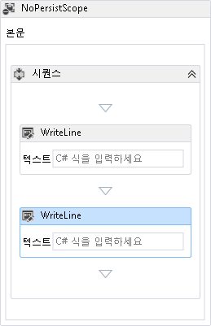

# <a name="c-expressions"></a>C# 식
[!INCLUDE[net_v45](../../../includes/net-v45-md.md)]부터는 [!INCLUDE[wf](../../../includes/wf-md.md)]에서 C# 식이 지원됩니다. [!INCLUDE[vs_current_long](../../../includes/vs-current-long-md.md)]에서 [!INCLUDE[net_v45](../../../includes/net-v45-md.md)]를 대상으로 만들어진 새 C# 워크플로 프로젝트에서는 C# 식을 사용하고, Visual Basic 워크플로 프로젝트에서는 Visual Basic 식을 사용합니다. Visual Basic 식을 사용하는 기존 [!INCLUDE[netfx40_short](../../../includes/netfx40-short-md.md)] 워크플로 프로젝트는 프로젝트 언어에 관계없이 [!INCLUDE[netfx_current_short](../../../includes/netfx-current-short-md.md)]로 마이그레이션할 수 있으며 지원됩니다. 이 항목에서는 [!INCLUDE[wf1](../../../includes/wf1-md.md)]의 C# 식에 대해 간략하게 설명합니다.  
  
## <a name="using-c-expressions-in-workflows"></a>워크플로에서 C# 식 사용  
  
-   [워크플로 디자이너에서 C# 식 사용](../../../docs/framework/windows-workflow-foundation/csharp-expressions.md#WFDesigner)  
  
    -   [이전 버전과 호환성](../../../docs/framework/windows-workflow-foundation/csharp-expressions.md#BackwardCompat)  
  
-   [코드 워크플로에서 C# 식 사용](../../../docs/framework/windows-workflow-foundation/csharp-expressions.md#CodeWorkflows)  
  
-   [XAML 워크플로에서 C# 식 사용](../../../docs/framework/windows-workflow-foundation/csharp-expressions.md#XamlWorkflows)  
  
    -   [컴파일된 Xaml](../../../docs/framework/windows-workflow-foundation/csharp-expressions.md#CompiledXaml)  
  
    -   [느슨한 Xaml](../../../docs/framework/windows-workflow-foundation/csharp-expressions.md#LooseXaml)  
  
-   [XAMLX 워크플로 서비스에서 C# 식 사용](../../../docs/framework/windows-workflow-foundation/csharp-expressions.md#WFServices)  
  
###  <a name="WFDesigner"></a>워크플로 디자이너에서 C# 식 사용  
 [!INCLUDE[net_v45](../../../includes/net-v45-md.md)]부터는 [!INCLUDE[wf](../../../includes/wf-md.md)]에서 C# 식이 지원됩니다. [!INCLUDE[vs_current_long](../../../includes/vs-current-long-md.md)]에서 [!INCLUDE[net_v45](../../../includes/net-v45-md.md)]를 대상으로 만들어진 C# 워크플로 프로젝트에서는 C# 식을 사용하는 반면, Visual Basic 워크플로 프로젝트에서는 Visual Basic 식을 사용합니다. 원하는 C# 식을 지정 하려면 입력란에 입력 **C# 식 입력**합니다. 이 레이블은 디자이너에서 활동이 선택된 경우 속성 창에 표시되거나 워크플로 디자이너의 활동에 표시됩니다. 다음 예제에서는 `WriteLine`의 `Sequence` 내에 두 개의 `NoPersistScope` 활동이 포함되어 있습니다.  
  
   
  
> [!NOTE]
>  C# 식은 [!INCLUDE[vs_current_short](../../../includes/vs-current-short-md.md)]에서만 지원되며 재호스트된 Workflow Designer에서는 지원되지 않습니다. [!INCLUDE[crabout](../../../includes/crabout-md.md)]재 호스트 된 디자이너에서 지원 되는 새로운 WF45 기능 참조 [다시 호스트 된 워크플로 디자이너에서 새 Workflow Foundation 4.5 기능에 대 한 지원을](../../../docs/framework/windows-workflow-foundation/wf-features-in-the-rehosted-workflow-designer.md)합니다.  
  
####  <a name="BackwardCompat"></a>이전 버전과 호환성  
 [!INCLUDE[netfx40_short](../../../includes/netfx40-short-md.md)]로 마이그레이션된 기존 [!INCLUDE[netfx_current_short](../../../includes/netfx-current-short-md.md)] C# 워크플로 프로젝트의 Visual Basic 식이 지원됩니다. 기존 Visual Basic 식의 텍스트 바뀝니다 Visual Basic 식이 워크플로 디자이너에서 보면 **XAML에서 값이 설정**Visual Basic 식이 유효한 C# 구문이 아니면 합니다. Visual Basic 식이 유효한 C# 구문인 경우에는 해당 식이 표시됩니다. Visual Basic 식을 C#으로 업데이트하려면 Workflow Designer에서 식을 편집하고 해당하는 C#식을 지정하면 됩니다. Visual Basic 식을 반드시 C#으로 업데이트할 필요는 없지만, 워크플로 디자이너에서 식을 업데이트한 후에는 식이 C#으로 변환되며 이를 Visual Basic으로 되돌릴 수는 없습니다.  
  
###  <a name="CodeWorkflows"></a>코드 워크플로에서 C# 식 사용  
 [!INCLUDE[netfx_current_short](../../../includes/netfx-current-short-md.md)] 코드 기반 워크플로에서는 C# 식이 지원되지만 워크플로를 호출하려면 먼저 <xref:System.Activities.XamlIntegration.TextExpressionCompiler.Compile%2A?displayProperty=nameWithType>을 사용하여 C# 식을 컴파일해야 합니다. 워크플로 작성자는 `CSharpValue`를 사용하여 식의 r-value를 나타내고 `CSharpReference`를 사용하여 식의 l-value를 나타냅니다. 다음 예제에서는 `Assign` 활동에 포함된 `WriteLine` 활동과 `Sequence` 활동으로 워크플로를 만듭니다. `CSharpReference`의 `To` 인수에는 `Assign`가 지정되어 식의 l-value를 나타냅니다. `CSharpValue`의 `Value` 인수와 `Assign`의 `Text` 인수에는 `WriteLine`가 지정되어 이 두 식의 r-value를 나타냅니다.  
  
```csharp  
Variable<int> n = new Variable<int>  
{  
    Name = "n"  
};  
  
Activity wf = new Sequence  
{  
    Variables = { n },  
    Activities =  
    {  
        new Assign<int>  
        {  
            To = new CSharpReference<int>("n"),  
            Value = new CSharpValue<int>("new Random().Next(1, 101)")  
        },  
        new WriteLine  
        {  
            Text = new CSharpValue<string>("\"The number is \" + n")  
        }  
    }  
};  
  
CompileExpressions(wf);  
  
WorkflowInvoker.Invoke(wf);  
```  
  
 워크플로가 생성된 후에는 `CompileExpressions` 도우미 메서드를 호출하여 C# 식을 컴파일한 다음 워크플로를 호출합니다. 다음 예제는 `CompileExpressions` 메서드입니다.  
  
```csharp  
static void CompileExpressions(Activity activity)  
{  
    // activityName is the Namespace.Type of the activity that contains the  
    // C# expressions.  
    string activityName = activity.GetType().ToString();  
  
    // Split activityName into Namespace and Type.Append _CompiledExpressionRoot to the type name  
    // to represent the new type that represents the compiled expressions.  
    // Take everything after the last . for the type name.  
    string activityType = activityName.Split('.').Last() + "_CompiledExpressionRoot";  
    // Take everything before the last . for the namespace.  
    string activityNamespace = string.Join(".", activityName.Split('.').Reverse().Skip(1).Reverse());  
  
    // Create a TextExpressionCompilerSettings.  
    TextExpressionCompilerSettings settings = new TextExpressionCompilerSettings  
    {  
        Activity = activity,  
        Language = "C#",  
        ActivityName = activityType,  
        ActivityNamespace = activityNamespace,  
        RootNamespace = null,  
        GenerateAsPartialClass = false,  
        AlwaysGenerateSource = true,  
        ForImplementation = false  
    };  
  
    // Compile the C# expression.  
    TextExpressionCompilerResults results =  
        new TextExpressionCompiler(settings).Compile();  
  
    // Any compilation errors are contained in the CompilerMessages.  
    if (results.HasErrors)  
    {  
        throw new Exception("Compilation failed.");  
    }  
  
    // Create an instance of the new compiled expression type.  
    ICompiledExpressionRoot compiledExpressionRoot =  
        Activator.CreateInstance(results.ResultType,  
            new object[] { activity }) as ICompiledExpressionRoot;  
  
    // Attach it to the activity.  
    CompiledExpressionInvoker.SetCompiledExpressionRoot(  
        activity, compiledExpressionRoot);  
}  
```  
  
> [!NOTE]
>  C# 식이 컴파일되지 않은 경우는 <xref:System.NotSupportedException> 다음과 유사한 메시지와 함께 워크플로가 호출 되는 경우에 throw 됩니다: `Expression Activity type 'CSharpValue`1' 컴파일 실행 하는 데 필요 합니다.  워크플로가 컴파일 되었는지 확인 하십시오.'  
  
 사용자 지정 코드 기반 워크플로에서 `DynamicActivity`를 사용하는 경우에는 다음 코드 예제와 같이 `CompileExpressions` 메서드를 일부 변경해야 합니다.  
  
```csharp  
static void CompileExpressions(DynamicActivity dynamicActivity)  
{  
    // activityName is the Namespace.Type of the activity that contains the  
    // C# expressions. For Dynamic Activities this can be retrieved using the  
    // name property , which must be in the form Namespace.Type.  
    string activityName = dynamicActivity.Name;  
  
    // Split activityName into Namespace and Type.Append _CompiledExpressionRoot to the type name  
    // to represent the new type that represents the compiled expressions.  
    // Take everything after the last . for the type name.  
    string activityType = activityName.Split('.').Last() + "_CompiledExpressionRoot";  
    // Take everything before the last . for the namespace.  
    string activityNamespace = string.Join(".", activityName.Split('.').Reverse().Skip(1).Reverse());  
  
    // Create a TextExpressionCompilerSettings.  
    TextExpressionCompilerSettings settings = new TextExpressionCompilerSettings  
    {  
        Activity = dynamicActivity,  
        Language = "C#",  
        ActivityName = activityType,  
        ActivityNamespace = activityNamespace,  
        RootNamespace = null,  
        GenerateAsPartialClass = false,  
        AlwaysGenerateSource = true,  
        ForImplementation = true  
    };  
  
    // Compile the C# expression.  
    TextExpressionCompilerResults results =  
        new TextExpressionCompiler(settings).Compile();  
  
    // Any compilation errors are contained in the CompilerMessages.  
    if (results.HasErrors)  
    {  
        throw new Exception("Compilation failed.");  
    }  
  
    // Create an instance of the new compiled expression type.  
    ICompiledExpressionRoot compiledExpressionRoot =  
        Activator.CreateInstance(results.ResultType,  
            new object[] { dynamicActivity }) as ICompiledExpressionRoot;  
  
    // Attach it to the activity.  
    CompiledExpressionInvoker.SetCompiledExpressionRootForImplementation(  
        dynamicActivity, compiledExpressionRoot);  
}  
```  
  
 동적 활동에서 C# 식을 컴파일하는 `CompileExpressions` 오버로드에는 몇 가지 차이점이 있습니다.  
  
-   `CompileExpressions`에 대한 매개 변수는 `DynamicActivity`입니다.  
  
-   형식 이름 및 네임스페이스는 `DynamicActivity.Name` 속성을 사용하여 검색됩니다.  
  
-   `TextExpressionCompilerSettings.ForImplementation`이 `true`로 설정됩니다.  
  
-   `CompiledExpressionInvoker.SetCompiledExpressionRootForImplementation` 대신 `CompiledExpressionInvoker.SetCompiledExpressionRoot`이 호출됩니다.  
  
 [!INCLUDE[crabout](../../../includes/crabout-md.md)]참조 코드의 식 작업, [제작 워크플로, 활동 및 식을 사용 하 여 명령적 코드](../../../docs/framework/windows-workflow-foundation/authoring-workflows-activities-and-expressions-using-imperative-code.md)합니다.  
  
###  <a name="XamlWorkflows"></a>XAML 워크플로에서 C# 식 사용  
 XAML 워크플로에서는 C# 식이 지원됩니다. 컴파일된 XAML 워크플로는 형식으로 컴파일되고, 느슨한 XAML 워크플로는 런타임에 의해 로드된 후 워크플로가 실행될 때 활동 트리로 컴파일됩니다.  
  
-   [컴파일된 Xaml](../../../docs/framework/windows-workflow-foundation/csharp-expressions.md#CompiledXaml)  
  
-   [느슨한 Xaml](../../../docs/framework/windows-workflow-foundation/csharp-expressions.md#LooseXaml)  
  
####  <a name="CompiledXaml"></a>컴파일된 Xaml  
 [!INCLUDE[netfx_current_short](../../../includes/netfx-current-short-md.md)]를 대상으로 하는 C# 워크플로 프로젝트의 일부로서 형식으로 컴파일되는 컴파일된 XAML 워크플로에서는 C# 식이 지원됩니다. 컴파일된 XAML은 [!INCLUDE[vs_current_short](../../../includes/vs-current-short-md.md)]에서 워크플로 작성의 기본 형식이며, [!INCLUDE[vs_current_short](../../../includes/vs-current-short-md.md)]를 대상으로 [!INCLUDE[netfx_current_short](../../../includes/netfx-current-short-md.md)]에서 만들어진 C# 워크플로 프로젝트는 C# 식을 사용합니다.  
  
####  <a name="LooseXaml"></a>느슨한 Xaml  
 느슨한 XAML 워크플로에서는 C# 식이 지원됩니다. 느슨한 XAML 워크플로를 로드 및 호출하는 워크플로 호스트 프로그램은 [!INCLUDE[netfx_current_short](../../../includes/netfx-current-short-md.md)]를 대상으로 하며, <xref:System.Activities.XamlIntegration.ActivityXamlServicesSettings.CompileExpressions%2A>는 `true`로 설정되어야 합니다(기본값 `false`). <xref:System.Activities.XamlIntegration.ActivityXamlServicesSettings.CompileExpressions%2A>를 `true`로 설정하려면 <xref:System.Activities.XamlIntegration.ActivityXamlServicesSettings> 속성을 <xref:System.Activities.XamlIntegration.ActivityXamlServicesSettings.CompileExpressions%2A>로 설정하여 `true` 인스턴스를 만든 후 이를 <xref:System.Activities.XamlIntegration.ActivityXamlServices.Load%2A?displayProperty=nameWithType>에 매개 변수로 전달합니다. 경우 `CompileExpressions` 로 설정 되지 않은 `true`, <xref:System.NotSupportedException> 다음과 유사한 메시지가 throw 됩니다: `Expression Activity type 'CSharpValue`1' 컴파일 실행 하는 데 필요 합니다.  워크플로가 컴파일 되었는지 확인 하십시오.'  
  
```csharp  
ActivityXamlServicesSettings settings = new ActivityXamlServicesSettings  
{  
    CompileExpressions = true  
};  
  
DynamicActivity<int> wf = ActivityXamlServices.Load(new StringReader(serializedAB), settings) as DynamicActivity<int>;  
```  
  
 [!INCLUDE[crabout](../../../includes/crabout-md.md)]참조 XAML 워크플로 작업, [직렬화 워크플로 및 활동 xaml](../../../docs/framework/windows-workflow-foundation/serializing-workflows-and-activities-to-and-from-xaml.md)합니다.  
  
###  <a name="WFServices"></a>XAMLX 워크플로 서비스에서 C# 식 사용  
 XAMLX 워크플로 서비스에서는 C# 식이 지원됩니다. 워크플로 서비스가 IIS 또는 WAS에서 호스트되는 경우에는 추가 단계가 필요하지 않지만, XAML 워크플로 서비스가 자체 호스트되는 경우 C# 식을 컴파일해야 합니다. C# 식에는 자체 호스팅된 XAMLX 워크플로 서비스를 컴파일하려면 먼저 XAMLX 파일을 로드 한 `WorkflowService`, 전달 된 후는 `Body` 의 `WorkflowService` 에 `CompileExpressions` 이전에 설명 된 방법을 [를 사용 하 여 C# 식 코드 워크플로에서](../../../docs/framework/windows-workflow-foundation/csharp-expressions.md#CodeWorkflows) 섹션. 다음 예제에서는 XAMLX 워크플로 서비스를 로드하고 C# 식을 컴파일한 다음 워크플로 서비스를 열고 요청을 기다립니다.  
  
```csharp  
// Load the XAMLX workflow service.  
WorkflowService workflow1 =  
    (WorkflowService)XamlServices.Load(xamlxPath);  
  
// Compile the C# expressions in the workflow by passing the Body to CompileExpressions.  
CompileExpressions(workflow1.Body);  
  
// Initialize the WorkflowServiceHost.  
var host = new WorkflowServiceHost(workflow1, new Uri("http://localhost:8293/Service1.xamlx"));  
  
// Enable Metadata publishing/  
ServiceMetadataBehavior smb = new ServiceMetadataBehavior();  
smb.HttpGetEnabled = true;  
smb.MetadataExporter.PolicyVersion = PolicyVersion.Policy15;  
host.Description.Behaviors.Add(smb);  
  
// Open the WorkflowServiceHost and wait for requests.  
host.Open();  
Console.WriteLine("Press enter to quit");  
Console.ReadLine();  
```  
  
 C# 식이 컴파일되지 않은 경우 `Open` 작업이 성공하지만 워크플로 호출에는 실패합니다. 다음 `CompileExpressions` 메서드는 이전 메서드와 동일 [코드 워크플로에서 사용 하 여 C# 식을](../../../docs/framework/windows-workflow-foundation/csharp-expressions.md#CodeWorkflows) 섹션.  
  
```csharp  
static void CompileExpressions(Activity activity)  
{  
    // activityName is the Namespace.Type of the activity that contains the  
    // C# expressions.  
    string activityName = activity.GetType().ToString();  
  
    // Split activityName into Namespace and Type.Append _CompiledExpressionRoot to the type name  
    // to represent the new type that represents the compiled expressions.  
    // Take everything after the last . for the type name.  
    string activityType = activityName.Split('.').Last() + "_CompiledExpressionRoot";  
    // Take everything before the last . for the namespace.  
    string activityNamespace = string.Join(".", activityName.Split('.').Reverse().Skip(1).Reverse());  
  
    // Create a TextExpressionCompilerSettings.  
    TextExpressionCompilerSettings settings = new TextExpressionCompilerSettings  
    {  
        Activity = activity,  
        Language = "C#",  
        ActivityName = activityType,  
        ActivityNamespace = activityNamespace,  
        RootNamespace = null,  
        GenerateAsPartialClass = false,  
        AlwaysGenerateSource = true,  
        ForImplementation = false  
    };  
  
    // Compile the C# expression.  
    TextExpressionCompilerResults results =  
        new TextExpressionCompiler(settings).Compile();  
  
    // Any compilation errors are contained in the CompilerMessages.  
    if (results.HasErrors)  
    {  
        throw new Exception("Compilation failed.");  
    }  
  
    // Create an instance of the new compiled expression type.  
    ICompiledExpressionRoot compiledExpressionRoot =  
        Activator.CreateInstance(results.ResultType,  
            new object[] { activity }) as ICompiledExpressionRoot;  
  
    // Attach it to the activity.  
    CompiledExpressionInvoker.SetCompiledExpressionRoot(  
        activity, compiledExpressionRoot);  
}  
```
