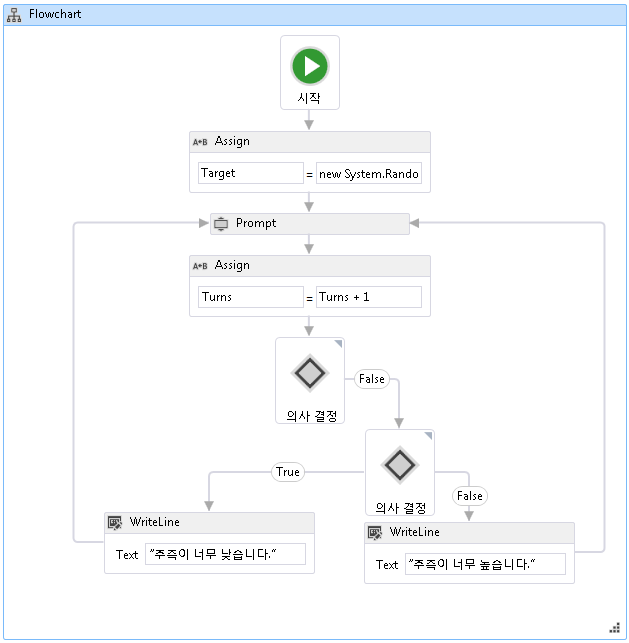

# <a name="how-to-create-a-flowchart-workflow"></a><span data-ttu-id="f35ac-102">방법: 순서도 워크플로 만들기</span><span class="sxs-lookup"><span data-stu-id="f35ac-102">How to: Create a Flowchart Workflow</span></span>
<span data-ttu-id="f35ac-103">기본 제공 활동뿐 아니라 사용자 지정 활동에서도 워크플로를 구성할 수 있습니다.</span><span class="sxs-lookup"><span data-stu-id="f35ac-103">Workflows can be constructed from built-in activities as well as from custom activities.</span></span> <span data-ttu-id="f35ac-104">이 항목의 단계와 같은 기본 제공 활동을 모두 사용 하는 워크플로 만드는 따라는 <xref:System.Activities.Statements.Flowchart> 활동과 이전 사용자 지정 활동 [하는 방법: 활동 만들기](../../../docs/framework/windows-workflow-foundation/how-to-create-an-activity.md) 항목입니다.</span><span class="sxs-lookup"><span data-stu-id="f35ac-104">This topic steps through creating a workflow that uses both built-in activities such as the <xref:System.Activities.Statements.Flowchart> activity, and the custom activities from the previous [How to: Create an Activity](../../../docs/framework/windows-workflow-foundation/how-to-create-an-activity.md) topic.</span></span> <span data-ttu-id="f35ac-105">이 워크플로는 숫자 추측 게임을 모델링합니다.</span><span class="sxs-lookup"><span data-stu-id="f35ac-105">The workflow models a number guessing game.</span></span>  
  
> [!NOTE]
>  <span data-ttu-id="f35ac-106">초보자를 위한 자습서의 각 항목은 이전 항목을 바탕으로 합니다.</span><span class="sxs-lookup"><span data-stu-id="f35ac-106">Each topic in the Getting Started tutorial depends on the previous topics.</span></span> <span data-ttu-id="f35ac-107">이 항목을 완료 하려면 먼저 완료 해야 [하는 방법: 활동 만들기](../../../docs/framework/windows-workflow-foundation/how-to-create-an-activity.md)합니다.</span><span class="sxs-lookup"><span data-stu-id="f35ac-107">To complete this topic, you must first complete [How to: Create an Activity](../../../docs/framework/windows-workflow-foundation/how-to-create-an-activity.md).</span></span>  
  
> [!NOTE]
>  <span data-ttu-id="f35ac-108">자습서의 전체 버전을 다운로드하려면 [Windows Workflow Foundation(WF45) - 초보자를 위한 자습서](http://go.microsoft.com/fwlink/?LinkID=248976)를 참조하세요.</span><span class="sxs-lookup"><span data-stu-id="f35ac-108">To download a completed version of the tutorial, see [Windows Workflow Foundation (WF45) - Getting Started Tutorial](http://go.microsoft.com/fwlink/?LinkID=248976).</span></span>  
  
### <a name="to-create-the-workflow"></a><span data-ttu-id="f35ac-109">워크플로를 만들려면</span><span class="sxs-lookup"><span data-stu-id="f35ac-109">To create the workflow</span></span>  
  
1.  <span data-ttu-id="f35ac-110">마우스 오른쪽 단추로 클릭 **NumberGuessWorkflowActivities** 에 **솔루션 탐색기** 선택 **추가**, **새 항목**합니다.</span><span class="sxs-lookup"><span data-stu-id="f35ac-110">Right-click **NumberGuessWorkflowActivities** in **Solution Explorer** and select **Add**, **New Item**.</span></span>  
  
2.  <span data-ttu-id="f35ac-111">에 **설치 됨**, **공통 항목** 노드를 **워크플로**합니다.</span><span class="sxs-lookup"><span data-stu-id="f35ac-111">In the **Installed**, **Common Items** node, select **Workflow**.</span></span> <span data-ttu-id="f35ac-112">선택 **활동** 에서 **워크플로** 목록입니다.</span><span class="sxs-lookup"><span data-stu-id="f35ac-112">Select **Activity** from the **Workflow** list.</span></span>  
  
3.  <span data-ttu-id="f35ac-113">형식 `FlowchartNumberGuessWorkflow` 에 **이름** 상자 한 클릭 **추가**합니다.</span><span class="sxs-lookup"><span data-stu-id="f35ac-113">Type `FlowchartNumberGuessWorkflow` into the **Name** box and click **Add**.</span></span>  
  
4.  <span data-ttu-id="f35ac-114">끌어서는 **순서도** 활동을는 **순서도** 의 섹션은 **도구 상자** 놓습니다는 **여기에 작업 놓기** 에 레이블는 워크플로 디자인 화면입니다.</span><span class="sxs-lookup"><span data-stu-id="f35ac-114">Drag a **Flowchart** activity from the **Flowchart** section of the **Toolbox** and drop it onto the **Drop activity here** label on the workflow design surface.</span></span>  
  
### <a name="to-create-the-workflow-variables-and-arguments"></a><span data-ttu-id="f35ac-115">워크플로 변수와 인수를 만들려면</span><span class="sxs-lookup"><span data-stu-id="f35ac-115">To create the workflow variables and arguments</span></span>  
  
1.  <span data-ttu-id="f35ac-116">두 번 클릭 **FlowchartNumberGuessWorkflow.xaml** 에 **솔루션 탐색기** 에 표시 되지 않은 경우 워크플로 디자이너를 표시 합니다.</span><span class="sxs-lookup"><span data-stu-id="f35ac-116">Double-click **FlowchartNumberGuessWorkflow.xaml** in **Solution Explorer** to display the workflow in the designer, if it is not already displayed.</span></span>  
  
2.  <span data-ttu-id="f35ac-117">클릭 **인수** 표시 하려면 워크플로 디자이너 왼쪽 아래에에서는 **인수** 창.</span><span class="sxs-lookup"><span data-stu-id="f35ac-117">Click **Arguments** in the lower-left side of the workflow designer to display the **Arguments** pane.</span></span>  
  
3.  <span data-ttu-id="f35ac-118">클릭 **인수 만들기**합니다.</span><span class="sxs-lookup"><span data-stu-id="f35ac-118">Click **Create Argument**.</span></span>  
  
4.  <span data-ttu-id="f35ac-119">형식 `MaxNumber` 에 **이름** 상자 **에** 에서 **방향** 드롭 다운 목록 **Int32** 는 에서**인수 형식이** 드롭 다운 목록 및 다음 인수를 저장 하는 ENTER 누릅니다.</span><span class="sxs-lookup"><span data-stu-id="f35ac-119">Type `MaxNumber` into the **Name** box, select **In** from the **Direction** drop-down list, select **Int32** from the **Argument type** drop-down list, and then press ENTER to save the argument.</span></span>  
  
5.  <span data-ttu-id="f35ac-120">클릭 **인수 만들기**합니다.</span><span class="sxs-lookup"><span data-stu-id="f35ac-120">Click **Create Argument**.</span></span>  
  
6.  <span data-ttu-id="f35ac-121">형식 `Turns` 에 **이름** 새로 추가 된 아래에 있는 상자 `MaxNumber` 인수를 **아웃** 에서 **방향** 드롭 다운 목록에서  **Int32** 에서 **인수 형식이** 드롭 다운 목록 및 다음 ENTER 누릅니다.</span><span class="sxs-lookup"><span data-stu-id="f35ac-121">Type `Turns` into the **Name** box that is below the newly added `MaxNumber` argument, select **Out** from the **Direction** drop-down list, select **Int32** from the **Argument type** drop-down list, and then press ENTER.</span></span>  
  
7.  <span data-ttu-id="f35ac-122">클릭 **인수** 를 닫으려면 활동 디자이너 왼쪽 아래에에서는 **인수** 창.</span><span class="sxs-lookup"><span data-stu-id="f35ac-122">Click **Arguments** in the lower-left side of the activity designer to close the **Arguments** pane.</span></span>  
  
8.  <span data-ttu-id="f35ac-123">클릭 **변수** 표시 하려면 워크플로 디자이너 왼쪽 아래에에서는 **변수** 창.</span><span class="sxs-lookup"><span data-stu-id="f35ac-123">Click **Variables** in the lower-left side of the workflow designer to display the **Variables** pane.</span></span>  
  
9. <span data-ttu-id="f35ac-124">클릭 **변수를 만들고**합니다.</span><span class="sxs-lookup"><span data-stu-id="f35ac-124">Click **Create Variable**.</span></span>  
  
    > [!TIP]
    >  <span data-ttu-id="f35ac-125">되지 않은 경우 **변수 만들기** 상자가 표시 됩니다을 클릭는 <xref:System.Activities.Statements.Flowchart> 활동을 워크플로 디자이너 화면을 선택 합니다.</span><span class="sxs-lookup"><span data-stu-id="f35ac-125">If no **Create Variable** box is displayed, click the <xref:System.Activities.Statements.Flowchart> activity on the workflow designer surface to select it.</span></span>  
  
10. <span data-ttu-id="f35ac-126">형식 `Guess` 에 **이름** 상자 **Int32** 에서 **변수 형식** 드롭 다운 목록 및 다음 변수를 저장 하는 ENTER 누릅니다.</span><span class="sxs-lookup"><span data-stu-id="f35ac-126">Type `Guess` into the **Name** box, select **Int32** from the **Variable type** drop-down list, and then press ENTER to save the variable.</span></span>  
  
11. <span data-ttu-id="f35ac-127">클릭 **변수를 만들고**합니다.</span><span class="sxs-lookup"><span data-stu-id="f35ac-127">Click **Create Variable**.</span></span>  
  
12. <span data-ttu-id="f35ac-128">형식 `Target` 에 **이름** 상자 **Int32** 에서 **변수 형식** 드롭 다운 목록 및 다음 변수를 저장 하는 ENTER 누릅니다.</span><span class="sxs-lookup"><span data-stu-id="f35ac-128">Type `Target` into the **Name** box, select **Int32** from the **Variable type** drop-down list, and then press ENTER to save the variable.</span></span>  
  
13. <span data-ttu-id="f35ac-129">클릭 **변수** 를 닫으려면 활동 디자이너 왼쪽 아래에에서는 **변수** 창.</span><span class="sxs-lookup"><span data-stu-id="f35ac-129">Click **Variables** in the lower-left side of the activity designer to close the **Variables** pane.</span></span>  
  
### <a name="to-add-the-workflow-activities"></a><span data-ttu-id="f35ac-130">워크플로 활동을 추가하려면</span><span class="sxs-lookup"><span data-stu-id="f35ac-130">To add the workflow activities</span></span>  
  
1.  <span data-ttu-id="f35ac-131">끌어서는 **할당** 활동을는 **기본 형식** 의 섹션은 **도구 상자** 위로 가져갑니다는 **시작** 의 위쪽에 있는 노드는 순서도입니다.</span><span class="sxs-lookup"><span data-stu-id="f35ac-131">Drag an **Assign** activity from the **Primitives** section of the **Toolbox** and hover it over the **Start** node, which is at the top of the flowchart.</span></span> <span data-ttu-id="f35ac-132">경우는 **할당** 활동 스타일러스가 **시작** 노드를 주위에 삼각형 세 개가 표시 됩니다는 **시작** 노드.</span><span class="sxs-lookup"><span data-stu-id="f35ac-132">When the **Assign** activity is over the **Start** node, three triangles will appear around the **Start** node.</span></span> <span data-ttu-id="f35ac-133">삭제는 **할당** 바로 아래에 있는 삼각형에 활동의 **시작** 노드.</span><span class="sxs-lookup"><span data-stu-id="f35ac-133">Drop the **Assign** activity on the triangle that is directly below the **Start** node.</span></span> <span data-ttu-id="f35ac-134">이 두 항목을 함께 연결 됩니다 하 고은 **할당** 순서도의 첫 번째 활동으로 작업 합니다.</span><span class="sxs-lookup"><span data-stu-id="f35ac-134">This will link the two items together and designates the **Assign** activity as the first activity in the flowchart.</span></span>  
  
    > [!NOTE]
    >  <span data-ttu-id="f35ac-135">시작 노드에 활동을 직접 연결하여 워크플로에서 해당 활동을 시작 활동으로 나타낼 수도 있습니다.</span><span class="sxs-lookup"><span data-stu-id="f35ac-135">Activities can also be indicated as the starting activity in the workflow by manually linking them activity to the start node.</span></span> <span data-ttu-id="f35ac-136">이렇게 하려면 위로 마우스를 가져가고는 **시작** 노드를 마우스를 위로 가져갈 때 나타나는 사각형 중 하나를 클릭는 **시작** 노드와 연결 된 아래로 끌어 원하는 활동 중 하나에 놓는 나타나는 사각형입니다.</span><span class="sxs-lookup"><span data-stu-id="f35ac-136">To do this, hover the mouse over the **Start** node, click one of the rectangles that appear when the mouse is over the **Start** node, and drag the connecting line down to the desired activity and drop it on one of the rectangles that appear.</span></span> <span data-ttu-id="f35ac-137">또한 지정할 수 있습니다 및 it를 마우스 오른쪽 단추로 클릭 하 고 선택 하 여 활동을 시작 활동으로 활동 **시작 노드로 설정**합니다.</span><span class="sxs-lookup"><span data-stu-id="f35ac-137">You can also designate and activity as the starting activity by right-clicking the it and choosing **Set as Start Node**.</span></span>  
  
2.  <span data-ttu-id="f35ac-138">형식 `Target` 에 **를** 상자와에 다음 식을 **C# 식 입력** 또는 **VB 식 입력** 상자입니다.</span><span class="sxs-lookup"><span data-stu-id="f35ac-138">Type `Target` into the **To** box and the following expression into the **Enter a C# Expression** or **Enter a VB expression** box.</span></span>  
  
    ```vb  
    New System.Random().Next(1, MaxNumber + 1)  
    ```  
  
    ```csharp  
    new System.Random().Next(1, MaxNumber + 1)  
    ```  
  
    > [!TIP]
    >  <span data-ttu-id="f35ac-139">경우는 **도구 상자** 창이 표시 되지 않으면, 선택 **도구 상자** 에서 **보기** 메뉴.</span><span class="sxs-lookup"><span data-stu-id="f35ac-139">If the **Toolbox** window is not displayed, select **Toolbox** from the **View** menu.</span></span>  
  
3.  <span data-ttu-id="f35ac-140">끌어서는 **프롬프트** 활동을는 **NumberGuessWorkflowActivities** 의 섹션은 **도구 상자**, 아래에 놓습니다는 **할당** 활동 이전 단계별로 실행 하며 연결 된 **프롬프트** 활동을는 **할당** 활동입니다.</span><span class="sxs-lookup"><span data-stu-id="f35ac-140">Drag a **Prompt** activity from the **NumberGuessWorkflowActivities** section of the **Toolbox**, drop it below the **Assign** activity from the previous step, and connect the **Prompt** activity to the **Assign** activity.</span></span> <span data-ttu-id="f35ac-141">두 활동을 연결하는 방법에는 세 가지가 있습니다.</span><span class="sxs-lookup"><span data-stu-id="f35ac-141">There are three ways to connect the two activities.</span></span> <span data-ttu-id="f35ac-142">첫 번째 방법은 놓을 때 연결 하는 **프롬프트** 워크플로에 활동입니다.</span><span class="sxs-lookup"><span data-stu-id="f35ac-142">The first way is to connect them as you drop the **Prompt** activity on the workflow.</span></span> <span data-ttu-id="f35ac-143">로 끌는 **프롬프트** 워크플로에 활동 위로 마우스를 가져가고는 **할당** 활동 때 표시 되는 4 개의 삼각형 중 하나에 놓습니다는 **프롬프트** 활동은 위에 **할당** 활동입니다.</span><span class="sxs-lookup"><span data-stu-id="f35ac-143">As you are dragging the **Prompt** activity to the workflow, hover it over the **Assign** activity and drop it onto one of the four triangles that appear when the **Prompt** activity is over the **Assign** activity.</span></span> <span data-ttu-id="f35ac-144">두 번째 방법은 삭제 하는 **프롬프트** 활동을 워크플로의 원하는 위치에 놓으면 됩니다.</span><span class="sxs-lookup"><span data-stu-id="f35ac-144">The second way is to drop the **Prompt** activity onto the workflow at the desired location.</span></span> <span data-ttu-id="f35ac-145">그런 다음 위로 마우스를 가져가고는 **할당** 활동 및 아래에 나타나는 사각형 중 하나는 끌어서는 **프롬프트** 활동입니다.</span><span class="sxs-lookup"><span data-stu-id="f35ac-145">Then, hover the mouse over the **Assign** activity and drag one of the rectangles that appears down to the **Prompt** activity.</span></span> <span data-ttu-id="f35ac-146">연결선이 되도록 마우스를 끌어는 **할당** 활동의 사각형 중 하나에 연결는 **프롬프트** 작업을 선택한 다음 마우스 단추를 놓습니다.</span><span class="sxs-lookup"><span data-stu-id="f35ac-146">Drag the mouse so that the connecting line from the **Assign** activity connects to one of the rectangles of the **Prompt** activity, and then release the mouse button.</span></span> <span data-ttu-id="f35ac-147">세 번째 방법은 매우 비슷합니다 끌어오는 방법 대신 점을 제외 하 고 첫 번째 방법은 **프롬프트** 활동을는 **도구 상자**, 워크플로 디자인 화면의 해당 위치에서 끌어는 위로마우스를가져가고 **할당** 활동에 나타나는 삼각형 중 하나에 놓습니다.</span><span class="sxs-lookup"><span data-stu-id="f35ac-147">The third way is very similar to the first way, except that instead of dragging the **Prompt** activity from the **Toolbox**, you drag it from its location on the workflow design surface, hover it over the **Assign** activity, and drop it onto one of the triangles that appears.</span></span>  
  
4.  <span data-ttu-id="f35ac-148">에 **속성 창** 에 대 한는 **프롬프트** 활동, 형식 `"EnterGuess"` 따옴표를 포함 하는 **BookmarkName** 속성 값 상자입니다.</span><span class="sxs-lookup"><span data-stu-id="f35ac-148">In the **Properties Window** for the **Prompt** activity, type `"EnterGuess"` including the quotes into the **BookmarkName** property value box.</span></span> <span data-ttu-id="f35ac-149">형식 `Guess` 에 **결과** 속성 값 상자에 다음 식을 입력 하 고는 **텍스트** 속성 상자입니다.</span><span class="sxs-lookup"><span data-stu-id="f35ac-149">Type `Guess` into the **Result** property value box, and type the following expression into the **Text** property box.</span></span>  
  
    ```vb  
    "Please enter a number between 1 and " & MaxNumber  
    ```  
  
    ```csharp  
    "Please enter a number between 1 and " + MaxNumber  
    ```  
  
    > [!TIP]
    >  <span data-ttu-id="f35ac-150">경우는 **속성 창** 가 표시 되지 않는 select **속성 창** 에서 **보기** 메뉴.</span><span class="sxs-lookup"><span data-stu-id="f35ac-150">If the **Properties Window** is not displayed, select **Properties Window** from the **View** menu.</span></span>  
  
5.  <span data-ttu-id="f35ac-151">끌어서는 **할당** 활동을는 **기본 형식** 의 섹션은 **도구 상자** 는 아래에이전단계에서설명하는방법중하나를사용하여연결하고 **Prompt** 활동입니다.</span><span class="sxs-lookup"><span data-stu-id="f35ac-151">Drag an **Assign** activity from the **Primitives** section of the **Toolbox** and connect it using one of the methods described in the previous step so that it is below the **Prompt** activity.</span></span>  
  
6.  <span data-ttu-id="f35ac-152">형식 `Turns` 에 **를** 상자 및 `Turns + 1` 에 **C# 식 입력** 또는 **VB 식 입력** 상자입니다.</span><span class="sxs-lookup"><span data-stu-id="f35ac-152">Type `Turns` into the **To** box and `Turns + 1` into the **Enter a C# expression**  or **Enter a VB expression** box.</span></span>  
  
7.  <span data-ttu-id="f35ac-153">끌어서는 **FlowDecision** 에서 **순서도** 의 섹션은 **도구 상자** 아래에 연결 하 고는 **할당** 활동입니다.</span><span class="sxs-lookup"><span data-stu-id="f35ac-153">Drag a **FlowDecision** from the **Flowchart** section of the **Toolbox** and connect it below the **Assign** activity.</span></span> <span data-ttu-id="f35ac-154">에 **속성 창**에 다음 식을 입력는 **조건** 속성 값 상자입니다.</span><span class="sxs-lookup"><span data-stu-id="f35ac-154">In the **Properties Window**, type the following expression into the **Condition** property value box.</span></span>  
  
    ```vb  
    Guess = Target  
    ```  
  
    ```csharp  
    Guess == Target  
    ```  
  
8.  <span data-ttu-id="f35ac-155">다른 **FlowDecision** 활동을는 **도구 상자** 첫 번째 아래에 놓습니다.</span><span class="sxs-lookup"><span data-stu-id="f35ac-155">Drag another **FlowDecision** activity from the **Toolbox** and drop it below the first one.</span></span> <span data-ttu-id="f35ac-156">레이블이 있는 사각형에서 끌어 두 활동을 연결 **False** 상단 **FlowDecision** 사각형에 두 번째 맨 위에 있는 활동 **FlowDecision**활동입니다.</span><span class="sxs-lookup"><span data-stu-id="f35ac-156">Connect the two activities by dragging from the rectangle that is labeled **False** on the top **FlowDecision** activity to the rectangle at the top of the second **FlowDecision** activity.</span></span>  
  
    > [!TIP]
    >  <span data-ttu-id="f35ac-157">표시 되지 않으면는 **True** 및 **False** 레이블의 **FlowDecision**, 위로 마우스를 가져가고는 **FlowDecision**합니다.</span><span class="sxs-lookup"><span data-stu-id="f35ac-157">If you do not see the **True** and **False** labels on the **FlowDecision**, hover the mouse over the **FlowDecision**.</span></span>  
  
9. <span data-ttu-id="f35ac-158">두 번째 클릭 **FlowDecision** 활동을 선택 합니다.</span><span class="sxs-lookup"><span data-stu-id="f35ac-158">Click the second **FlowDecision** activity to select it.</span></span> <span data-ttu-id="f35ac-159">에 **속성 창**에 다음 식을 입력는 **조건** 속성 값 상자입니다.</span><span class="sxs-lookup"><span data-stu-id="f35ac-159">In the **Properties Window**, type the following expression into the **Condition** property value box.</span></span>  
  
    ```
    Guess < Target  
    ```  
  
10. <span data-ttu-id="f35ac-160">두 개 **WriteLine** 활동을는 **기본 형식** 의 섹션은 **도구 상자** 있도록 함께 두 아래에 놓으면 **FlowDecision**  활동입니다.</span><span class="sxs-lookup"><span data-stu-id="f35ac-160">Drag two **WriteLine** activities from the **Primitives** section of the **Toolbox** and drop them so that they are side by side below the two **FlowDecision** activities.</span></span> <span data-ttu-id="f35ac-161">연결의 **True** 맨 **FlowDecision** 활동을 맨 왼쪽 **WriteLine** 활동 및 **False** 동작을는 맨 오른쪽 **WriteLine** 활동입니다.</span><span class="sxs-lookup"><span data-stu-id="f35ac-161">Connect the **True** action of the bottom **FlowDecision** activity to the leftmost **WriteLine** activity, and the **False** action to the rightmost **WriteLine** activity.</span></span>  
  
11. <span data-ttu-id="f35ac-162">가장 왼쪽에 있는 클릭 **WriteLine** 활동을 선택 하 고에 다음 식을 입력는 **텍스트** 속성 값 상자에 **속성 창**합니다.</span><span class="sxs-lookup"><span data-stu-id="f35ac-162">Click the leftmost **WriteLine** activity to select it, and type the following expression into the **Text** property value box in the **Properties Window**.</span></span>  
  
    ```
    "Your guess is too low."  
    ```  
  
12. <span data-ttu-id="f35ac-163">연결 된 **WriteLine** 의 왼쪽에는 **프롬프트** 그 보다 상위 활동입니다.</span><span class="sxs-lookup"><span data-stu-id="f35ac-163">Connect the **WriteLine** to the left side of the **Prompt** activity that is above it.</span></span>  
  
13. <span data-ttu-id="f35ac-164">맨 오른쪽 클릭 **WriteLine** 활동을 선택 하 고에 다음 식을 입력는 **텍스트** 속성 값 상자에 **속성 창**합니다.</span><span class="sxs-lookup"><span data-stu-id="f35ac-164">Click the rightmost **WriteLine** activity to select it, and type the following expression into the **Text** property value box in the **Properties Window**.</span></span>  
  
    ```
    "Your guess is too high."  
    ```  
  
14. <span data-ttu-id="f35ac-165">연결의 **WriteLine** 활동의 오른쪽에는 **프롬프트** 상위 활동입니다.</span><span class="sxs-lookup"><span data-stu-id="f35ac-165">Connect the **WriteLine** activity to the right side of the **Prompt** activity above it.</span></span>  
  
     <span data-ttu-id="f35ac-166">다음 예제에서는 완료된 워크플로를 보여 줍니다.</span><span class="sxs-lookup"><span data-stu-id="f35ac-166">The following example illustrates the completed workflow.</span></span>  
  
     <span data-ttu-id="f35ac-167"></span><span class="sxs-lookup"><span data-stu-id="f35ac-167"></span></span>  
  
### <a name="to-build-the-workflow"></a><span data-ttu-id="f35ac-168">워크플로를 빌드하려면</span><span class="sxs-lookup"><span data-stu-id="f35ac-168">To build the workflow</span></span>  
  
1.  <span data-ttu-id="f35ac-169">Ctrl+Shift+B를 눌러 솔루션을 빌드합니다.</span><span class="sxs-lookup"><span data-stu-id="f35ac-169">Press CTRL+SHIFT+B to build the solution.</span></span>  
  
     <span data-ttu-id="f35ac-170">워크플로 실행 하는 방법에 대 한 지침은 다음 항목을 참조 하십시오 [하는 방법: 워크플로 실행](../../../docs/framework/windows-workflow-foundation/how-to-run-a-workflow.md)합니다.</span><span class="sxs-lookup"><span data-stu-id="f35ac-170">For instructions on how to run the workflow, please see the next topic, [How to: Run a Workflow](../../../docs/framework/windows-workflow-foundation/how-to-run-a-workflow.md).</span></span> <span data-ttu-id="f35ac-171">이미 완료 된 경우는 [하는 방법: 워크플로 실행](../../../docs/framework/windows-workflow-foundation/how-to-run-a-workflow.md) 워크플로의 다른 스타일이 적용 된 단계와이 단계에서 순서도 워크플로 사용 하 여 실행 하려면,으로 바로 이동 하는 [빌드하고응용프로그램을실행하려면](../../../docs/framework/windows-workflow-foundation/how-to-run-a-workflow.md#BKMK_ToRunTheApplication)섹션 [하는 방법: 워크플로 실행](../../../docs/framework/windows-workflow-foundation/how-to-run-a-workflow.md)합니다.</span><span class="sxs-lookup"><span data-stu-id="f35ac-171">If you have already completed the [How to: Run a Workflow](../../../docs/framework/windows-workflow-foundation/how-to-run-a-workflow.md) step with a different style of workflow and wish to run it using the flowchart workflow from this step, skip ahead to the [To build and run the application](../../../docs/framework/windows-workflow-foundation/how-to-run-a-workflow.md#BKMK_ToRunTheApplication) section of [How to: Run a Workflow](../../../docs/framework/windows-workflow-foundation/how-to-run-a-workflow.md).</span></span>  
  
## <a name="see-also"></a><span data-ttu-id="f35ac-172">참고 항목</span><span class="sxs-lookup"><span data-stu-id="f35ac-172">See Also</span></span>  
 <xref:System.Activities.Statements.Flowchart>  
 <xref:System.Activities.Statements.FlowDecision>  
 [<span data-ttu-id="f35ac-173">Windows Workflow Foundation 프로그래밍</span><span class="sxs-lookup"><span data-stu-id="f35ac-173">Windows Workflow Foundation Programming</span></span>](../../../docs/framework/windows-workflow-foundation/programming.md)  
 [<span data-ttu-id="f35ac-174">워크플로 디자인</span><span class="sxs-lookup"><span data-stu-id="f35ac-174">Designing Workflows</span></span>](../../../docs/framework/windows-workflow-foundation/designing-workflows.md)  
 [<span data-ttu-id="f35ac-175">초보자를 위한 자습서</span><span class="sxs-lookup"><span data-stu-id="f35ac-175">Getting Started Tutorial</span></span>](../../../docs/framework/windows-workflow-foundation/getting-started-tutorial.md)  
 [<span data-ttu-id="f35ac-176">방법: 활동 만들기</span><span class="sxs-lookup"><span data-stu-id="f35ac-176">How to: Create an Activity</span></span>](../../../docs/framework/windows-workflow-foundation/how-to-create-an-activity.md)  
 [<span data-ttu-id="f35ac-177">방법: 워크플로 실행</span><span class="sxs-lookup"><span data-stu-id="f35ac-177">How to: Run a Workflow</span></span>](../../../docs/framework/windows-workflow-foundation/how-to-run-a-workflow.md)
