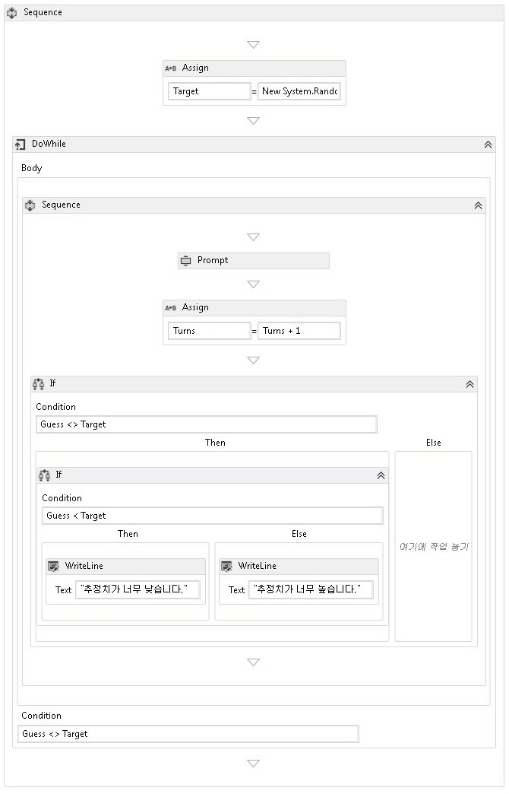

# <a name="how-to-create-a-sequential-workflow"></a>방법: 순차 워크플로 만들기
기본 제공 활동뿐 아니라 사용자 지정 활동에서도 워크플로를 구성할 수 있습니다. 이 항목의 단계와 같은 기본 제공 활동을 모두 사용 하는 워크플로 만드는 따라는 <xref:System.Activities.Statements.Sequence> 활동과 이전 사용자 지정 활동 [하는 방법: 활동 만들기](../../../docs/framework/windows-workflow-foundation/how-to-create-an-activity.md) 항목입니다. 이 워크플로는 숫자 추측 게임을 모델링합니다.  
  
> [!NOTE]
>  초보자를 위한 자습서의 각 항목은 이전 항목을 바탕으로 합니다. 이 항목을 완료 하려면 먼저 완료 해야 [하는 방법: 활동 만들기](../../../docs/framework/windows-workflow-foundation/how-to-create-an-activity.md)합니다.  
  
> [!NOTE]
>  자습서의 전체 버전을 다운로드하려면 [Windows Workflow Foundation(WF45) - 초보자를 위한 자습서](http://go.microsoft.com/fwlink/?LinkID=248976)를 참조하세요.  
  
### <a name="to-create-the-workflow"></a>워크플로를 만들려면  
  
1.  마우스 오른쪽 단추로 클릭 **NumberGuessWorkflowActivities** 에 **솔루션 탐색기** 선택 **추가**, **새 항목**합니다.  
  
2.  에 **설치 됨**, **공통 항목** 노드를 **워크플로**합니다. 선택 **활동** 에서 **워크플로** 목록입니다.  
  
3.  형식 `SequentialNumberGuessWorkflow` 에 **이름** 상자 한 클릭 **추가**합니다.  
  
4.  끌어서는 **시퀀스** 활동을는 **제어 흐름** 의 섹션은 **도구 상자** 놓습니다는 **여기에 작업 놓기** 에 레이블는 워크플로 디자인 화면입니다.  
  
### <a name="to-create-the-workflow-variables-and-arguments"></a>워크플로 변수와 인수를 만들려면  
  
1.  두 번 클릭 **SequentialNumberGuessWorkflow.xaml** 에 **솔루션 탐색기** 에 표시 되지 않은 경우 워크플로 디자이너를 표시 합니다.  
  
2.  클릭 **인수** 표시 하려면 워크플로 디자이너 왼쪽 아래에에서는 **인수** 창.  
  
3.  클릭 **인수 만들기**합니다.  
  
4.  형식 `MaxNumber` 에 **이름** 상자 **에** 에서 **방향** 드롭 다운 목록 **Int32** 는 에서**인수 형식이** 드롭 다운 목록 및 다음 인수를 저장 하는 ENTER 누릅니다.  
  
5.  클릭 **인수 만들기**합니다.  
  
6.  형식 `Turns` 에 **이름** 새로 추가 된 아래에 있는 상자 `MaxNumber` 인수를 **아웃** 에서 **방향** 드롭 다운 목록에서  **Int32** 에서 **인수 형식이** 드롭 다운 목록 및 다음 ENTER 누릅니다.  
  
7.  클릭 **인수** 를 닫으려면 활동 디자이너 왼쪽 아래에에서는 **인수** 창.  
  
8.  클릭 **변수** 표시 하려면 워크플로 디자이너 왼쪽 아래에에서는 **변수** 창.  
  
9. 클릭 **변수를 만들고**합니다.  
  
    > [!TIP]
    >  되지 않은 경우 **변수 만들기** 상자가 표시 됩니다을 클릭는 **시퀀스** 활동을 워크플로 디자이너 화면을 선택 합니다.  
  
10. 형식 `Guess` 에 **이름** 상자 **Int32** 에서 **변수 형식** 드롭 다운 목록 및 다음 변수를 저장 하는 ENTER 누릅니다.  
  
11. 클릭 **변수를 만들고**합니다.  
  
12. 형식 `Target` 에 **이름** 상자 **Int32** 에서 **변수 형식** 드롭 다운 목록 및 다음 변수를 저장 하는 ENTER 누릅니다.  
  
13. 클릭 **변수** 를 닫으려면 활동 디자이너 왼쪽 아래에에서는 **변수** 창.  
  
### <a name="to-add-the-workflow-activities"></a>워크플로 활동을 추가하려면  
  
1.  끌어서는 **할당** 활동을는 **기본 형식** 섹션은 **도구 상자** 놓습니다는 **시퀀스** 활동입니다. 형식 `Target` 에 **를** 상자와에 다음 식을 **C# 식 입력** 또는 **VB 식 입력** 상자입니다.  
  
    ```vb  
    New System.Random().Next(1, MaxNumber + 1)  
    ```  
  
    ```csharp  
    new System.Random().Next(1, MaxNumber + 1)  
    ```  
  
    > [!TIP]
    >  경우는 **도구 상자** 창이 표시 되지 않으면, 선택 **도구 상자** 에서 **보기** 메뉴.  
  
2.  끌어서는 **DoWhile** 활동을는 **제어 흐름** 의 섹션은 **도구 상자** 아래에 워크플로에 놓습니다는 **할당** 작업입니다.  
  
3.  에 다음 식을 입력는 **DoWhile** 활동의 **조건** 속성 값 상자입니다.  
  
    ```vb  
    Guess <> Target  
    ```  
  
    ```csharp  
    Guess != Target  
    ```  
  
     <xref:System.Activities.Statements.DoWhile> 활동은 자식 활동을 실행한 다음 해당 <xref:System.Activities.Statements.DoWhile.Condition%2A>을 확인합니다. <xref:System.Activities.Statements.DoWhile.Condition%2A>이 `True`로 확인되면 <xref:System.Activities.Statements.DoWhile>의 활동이 다시 실행됩니다. 이 예제에서는 사용자의 추측 값을 확인하여 추측이 올바를 때까지 <xref:System.Activities.Statements.DoWhile>이 계속됩니다.  
  
4.  끌어서는 **프롬프트** 활동을는 **NumberGuessWorkflowActivities** 의 섹션은 **도구 상자** 에 놓습니다는 **DoWhile** 활동 이전 단계의 합니다.  
  
5.  에 **속성 창**, 형식 `"EnterGuess"` 따옴표를 포함 하 여는 **BookmarkName** 속성 값 상자에는 **프롬프트** 활동입니다. 형식 `Guess` 에 **결과** 속성 값 상자에 다음 식을 입력 하 고는 **텍스트** 속성 상자입니다.  
  
    ```vb  
    "Please enter a number between 1 and " & MaxNumber  
    ```  
  
    ```csharp  
    "Please enter a number between 1 and " + MaxNumber  
    ```  
  
    > [!TIP]
    >  경우는 **속성 창** 가 표시 되지 않는 select **속성 창** 에서 **보기** 메뉴.  
  
6.  끌어서는 **할당** 활동을는 **기본 형식** 의 섹션은 **도구 상자** 에 놓습니다는 **DoWhile** 활동 뒤에 놓습니다는 **프롬프트** 활동입니다.  
  
    > [!NOTE]
    >  삭제할 경우의 **할당** 활동을 워크플로 디자이너 자동으로 추가 **시퀀스** 모두 포함 하도록 활동의 **프롬프트** 활동과 새로 추가 된 **할당** 활동입니다.  
  
7.  형식 `Turns` 에 **를** 상자 및 `Turns + 1` 에 **C# 식 입력** 또는 **VB 식 입력** 상자입니다.  
  
8.  끌어서는 **경우** 활동을는 **제어 흐름** 의 섹션은 **도구 상자** 에 놓습니다는 **시퀀스** 활동 뒤에 놓습니다는 새로 추가 된 **할당** 활동입니다.  
  
9. 에 다음 식을 입력는 **경우** 활동의 **조건** 속성 값 상자입니다.  
  
    ```vb  
    Guess <> Target  
    ```  
  
    ```csharp  
    Guess != Target  
    ```  
  
10. 다른 **경우** 활동을는 **제어 흐름** 섹션은 **도구 상자** 놓습니다는 **다음** 첫번째섹션**경우** 활동입니다.  
  
11. 에 새로 추가 된 다음 식을 입력 **경우** 활동의 **조건** 속성 값 상자입니다.  
  
    ```
    Guess < Target  
    ```  
  
12. 두 개 **WriteLine** 활동을는 **기본 형식** 의 섹션은 **도구 상자** 하나에 삭제할는 **다음** 의 섹션 새로 추가 된 **경우** 활동, 또 하나는 **Else** 섹션.  
  
13. 클릭는 **WriteLine** 활동에는 **다음** 섹션을 선택 하 고에 다음 식을 입력는 **텍스트** 속성 값 상자입니다.  
  
    ```vb  
    "Your guess is too low."  
    ```  
  
14. 클릭는 **WriteLine** 활동에는 **Else** 섹션을 선택 하 고에 다음 식을 입력는 **텍스트** 속성 값 상자입니다.  
  
    ```vb  
    "Your guess is too high."  
    ```  
  
     다음 예제에서는 완료된 워크플로를 보여 줍니다.  
  
       
  
### <a name="to-build-the-workflow"></a>워크플로를 빌드하려면  
  
1.  Ctrl+Shift+B를 눌러 솔루션을 빌드합니다.  
  
     워크플로 실행 하는 방법에 대 한 지침은 다음 항목을 참조 하십시오 [하는 방법: 워크플로 실행](../../../docs/framework/windows-workflow-foundation/how-to-run-a-workflow.md)합니다. 이미 완료 된 경우는 [하는 방법: 워크플로 실행](../../../docs/framework/windows-workflow-foundation/how-to-run-a-workflow.md) 워크플로의 다른 스타일이 적용 된 단계와이 단계에서 순차 워크플로 사용 하 여 실행 하려면,으로 바로 이동 하는 [빌드하고응용프로그램을실행하려면](../../../docs/framework/windows-workflow-foundation/how-to-run-a-workflow.md#BKMK_ToRunTheApplication)섹션 [하는 방법: 워크플로 실행](../../../docs/framework/windows-workflow-foundation/how-to-run-a-workflow.md)합니다.  
  
## <a name="see-also"></a>참고 항목  
 <xref:System.Activities.Statements.Flowchart>  
 <xref:System.Activities.Statements.FlowDecision>  
 [Windows Workflow Foundation 프로그래밍](../../../docs/framework/windows-workflow-foundation/programming.md)  
 [워크플로 디자인](../../../docs/framework/windows-workflow-foundation/designing-workflows.md)  
 [초보자를 위한 자습서](../../../docs/framework/windows-workflow-foundation/getting-started-tutorial.md)  
 [방법: 활동 만들기](../../../docs/framework/windows-workflow-foundation/how-to-create-an-activity.md)  
 [방법: 워크플로 실행](../../../docs/framework/windows-workflow-foundation/how-to-run-a-workflow.md)
