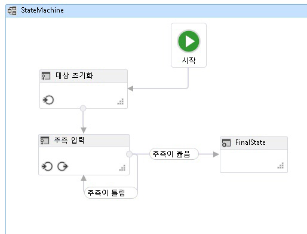

# <a name="how-to-create-a-state-machine-workflow"></a>방법: 상태 시스템 워크플로 만들기
기본 제공 활동뿐 아니라 사용자 지정 활동에서도 워크플로를 구성할 수 있습니다. 이 항목의 단계와 같은 기본 제공 활동을 모두 사용 하는 워크플로 만드는 따라는 <xref:System.Activities.Statements.StateMachine> 활동과 이전 사용자 지정 활동 [하는 방법: 활동 만들기](../../../docs/framework/windows-workflow-foundation/how-to-create-an-activity.md) 항목입니다. 이 워크플로는 숫자 추측 게임을 모델링합니다.  
  
> [!NOTE]
>  초보자를 위한 자습서의 각 항목은 이전 항목을 바탕으로 합니다. 이 항목을 완료 하려면 먼저 완료 해야 [하는 방법: 활동 만들기](../../../docs/framework/windows-workflow-foundation/how-to-create-an-activity.md)합니다.  
  
> [!NOTE]
>  자습서의 전체 버전을 다운로드하려면 [Windows Workflow Foundation(WF45) - 초보자를 위한 자습서](http://go.microsoft.com/fwlink/?LinkID=248976)를 참조하세요.  
  
### <a name="to-create-the-workflow"></a>워크플로를 만들려면  
  
1.  마우스 오른쪽 단추로 클릭 **NumberGuessWorkflowActivities** 에 **솔루션 탐색기** 선택 **추가**, **새 항목**합니다.  
  
2.  에 **설치 됨**, **공통 항목** 노드를 **워크플로**합니다. 선택 **활동** 에서 **워크플로** 목록입니다.  
  
3.  형식 `StateMachineNumberGuessWorkflow` 에 **이름** 상자 한 클릭 **추가**합니다.  
  
4.  끌어서는 **StateMachine** 활동을는 **상태 시스템** 의 섹션은 **도구 상자** 놓습니다는 **여기에 작업 놓기** 에 레이블 워크플로 디자인 화면입니다.  
  
### <a name="to-create-the-workflow-variables-and-arguments"></a>워크플로 변수와 인수를 만들려면  
  
1.  두 번 클릭 **StateMachineNumberGuessWorkflow.xaml** 에 **솔루션 탐색기** 에 표시 되지 않은 경우 워크플로 디자이너를 표시 합니다.  
  
2.  클릭 **인수** 표시 하려면 워크플로 디자이너 왼쪽 아래에에서는 **인수** 창.  
  
3.  클릭 **인수 만들기**합니다.  
  
4.  형식 `MaxNumber` 에 **이름** 상자 **에** 에서 **방향** 드롭 다운 목록 **Int32** 는 에서**인수 형식이** 드롭 다운 목록 및 다음 인수를 저장 하는 ENTER 누릅니다.  
  
5.  클릭 **인수 만들기**합니다.  
  
6.  형식 `Turns` 에 **이름** 새로 추가 된 아래에 있는 상자 `MaxNumber` 인수를 **아웃** 에서 **방향** 드롭 다운 목록에서  **Int32** 에서 **인수 형식이** 드롭 다운 목록 및 다음 ENTER 누릅니다.  
  
7.  클릭 **인수** 를 닫으려면 활동 디자이너 왼쪽 아래에에서는 **인수** 창.  
  
8.  클릭 **변수** 표시 하려면 워크플로 디자이너 왼쪽 아래에에서는 **변수** 창.  
  
9. 클릭 **변수를 만들고**합니다.  
  
    > [!TIP]
    >  되지 않은 경우 **변수 만들기** 상자가 표시 됩니다을 클릭는 <xref:System.Activities.Statements.StateMachine> 활동을 워크플로 디자이너 화면을 선택 합니다.  
  
10. 형식 `Guess` 에 **이름** 상자 **Int32** 에서 **변수 형식** 드롭 다운 목록 및 다음 변수를 저장 하는 ENTER 누릅니다.  
  
11. 클릭 **변수를 만들고**합니다.  
  
12. 형식 `Target` 에 **이름** 상자 **Int32** 에서 **변수 형식** 드롭 다운 목록 및 다음 변수를 저장 하는 ENTER 누릅니다.  
  
13. 클릭 **변수** 를 닫으려면 활동 디자이너 왼쪽 아래에에서는 **변수** 창.  
  
### <a name="to-add-the-workflow-activities"></a>워크플로 활동을 추가하려면  
  
1.  클릭 **State1** 을 선택 합니다. 에 **속성 창**, 변경 된 **DisplayName** 를 `Initialize Target`합니다.  
  
    > [!TIP]
    >  경우는 **속성 창** 가 표시 되지 않는 select **속성 창** 에서 **보기** 메뉴.  
  
2.  이름을 새로 변경한를 두 번 클릭 **Initialize Target** 하 여 확장 워크플로 디자이너의 상태입니다.  
  
3.  끌어서는 **할당** 활동을는 **기본 형식** 섹션은 **도구 상자** 놓습니다는 **항목** 상태 섹션. 형식 `Target` 에 **를** 상자와에 다음 식을 **C# 식 입력** 또는 **VB 식 입력** 상자입니다.  
  
    ```vb  
    New System.Random().Next(1, MaxNumber + 1)  
    ```  
  
    ```csharp  
    new System.Random().Next(1, MaxNumber + 1)  
    ```  
  
    > [!TIP]
    >  경우는 **도구 상자** 창이 표시 되지 않으면, 선택 **도구 상자** 에서 **보기** 메뉴.  
  
4.  전체 돌아갑니다 상태 워크플로 디자이너에서 컴퓨터 보기를 클릭 하 여 **StateMachine** 워크플로 디자이너의 맨 위에 표시 된 이동 경로에 있습니다.  
  
5.  끌어서는 **상태** 활동을는 **상태 시스템** 의 섹션은 **도구 상자** 워크플로 디자이너에 위로 가져갑니다는 **Initialize Target** 상태입니다. 참고 주위에 삼각형 4 개가 표시 됩니다는 **Initialize Target** 상태 위에 새 상태가 됩니다. Drop 바로 아래에 있는 삼각형에 새 상태는 **Initialize Target** 상태입니다. 새 상태가 워크플로에 배치 하 고에서 전환을 만듭니다.이 **Initialize Target** 새 상태로 상태입니다.  
  
6.  클릭 **State1** 를 선택 하려면 변경는 **DisplayName** 를 `Enter Guess`, 다음을 확장 하려면 워크플로 디자이너의 상태를 두 번 클릭 합니다.  
  
7.  끌어서는 **WriteLine** 활동을는 **기본 형식** 섹션은 **도구 상자** 놓습니다는 **항목** 상태 섹션.  
  
8.  에 다음 식을 입력는 **텍스트** 의 속성 상자는 **WriteLine**합니다.  
  
    ```vb  
    "Please enter a number between 1 and " & MaxNumber  
    ```  
  
    ```csharp  
    "Please enter a number between 1 and " + MaxNumber  
    ```  
  
9. 끌어서는 **할당** 활동을는 **기본 형식** 섹션은 **도구 상자** 끌어다 놓으십시오는 **종료** 상태 섹션.  
  
10. 형식 `Turns` 에 **를** 상자 및 `Turns + 1` 에 **C# 식 입력** 또는 **VB 식 입력** 상자입니다.  
  
11. 전체 돌아갑니다 상태 워크플로 디자이너에서 컴퓨터 보기를 클릭 하 여 **StateMachine** 워크플로 디자이너의 맨 위에 표시 된 이동 경로에 있습니다.  
  
12. 끌어서는 **FinalState** 활동을는 **상태 시스템** 의 섹션은 **도구 상자**, 위로 마우스를 가져가고는 **Enter Guess** 상태로 끌어 놓은 오른쪽에 나타나는 삼각형에는 **Enter Guess** 상태 간의 전환을 만들어지도록 **Enter Guess** 및 **FinalState**합니다.  
  
13. 전환의 기본 이름은 **T2**합니다. 선택 하 고 설정 하려면 워크플로 디자이너에서 전환을 클릭 하 여 해당 **DisplayName** 를 **Guess Correct**합니다. 그런 다음를 클릭 하 고 선택 된 **FinalState**, 두 상태 중 어느 쪽도 겹치지 없이 표시 되도록 전체 전환 이름에 대 한 공간이 있도록 오른쪽으로 끕니다. 이렇게 하면 자습서의 나머지 단계를 보다 쉽게 진행할 수 있습니다.  
  
14. 이름을 새로 변경한를 두 번 클릭 **Guess Correct** 하 여 확장 워크플로 디자이너에서 전환 합니다.  
  
15. 끌어서는 **ReadInt** 활동을는 **NumberGuessWorkflowActivities** 섹션은 **도구 상자** 놓습니다는 **트리거** 섹션 전환 합니다.  
  
16. 에 **속성 창** 에 대 한는 **ReadInt** 활동, 형식 `"EnterGuess"` 따옴표를 포함 하는 **BookmarkName** 속성 값 상자 및 형식 `Guess`에 **결과** 속성 값 상자  
  
17. 에 다음 식을 입력는 **Guess Correct** 전환의 **조건** 속성 값 상자입니다.  
  
    ```vb  
    Guess = Target  
    ```  
  
    ```csharp  
    Guess == Target  
    ```  
  
18. 전체 돌아갑니다 상태 워크플로 디자이너에서 컴퓨터 보기를 클릭 하 여 **StateMachine** 워크플로 디자이너의 맨 위에 표시 된 이동 경로에 있습니다.  
  
    > [!NOTE]
    >  트리거 이벤트를 받고 <xref:System.Activities.Statements.Transition.Condition%2A>이 `True`인 경우 전환이 발생합니다. 이 변환에 대 한 경우 사용자의 `Guess` 임의로 생성 된 일치 `Target`, 만든 다음 컨트롤에 전달 된 **FinalState** 워크플로가 완료 되 고 합니다.  
  
19. 추측이 올바른지 여부를 따라 워크플로의 전환 되어야 하는 **FinalState** 또는 돌아가기는 **Enter Guess** 시도할 합니다. 두 전환 모두 사용자의 추측을 통해 받을 때까지 기다리는 동일한 트리거를 공유는 **ReadInt** 활동입니다. 이를 공유 전환이라고 합니다. 공유 전환을 만들려면의 시작을 나타내는 원을 클릭 하 여 **Guess Correct** 전환 하 고 원하는 상태로 끕니다. 시작점을 끌어 하므로,이 경우 전환은 자체 전환을가 **Guess Correct** 전환 다시 놓습니다 맨 아래에 **Enter Guess** 상태입니다. 전환을 만든 후 워크플로 디자이너에서 선택 하 고 설정의 **DisplayName** 속성을 **Guess Incorrect**합니다.  
  
    > [!NOTE]
    >  공유 전환을 만들 수도 있습니다에서 전환 디자이너 내에서 클릭 하 여 **공유 트리거 전환 추가** 전환 디자이너 한 다음 원하는 대상 상태를 선택 하 고 맨 아래에  **연결에 사용할 상태** 드롭 다운 합니다.  
  
    > [!NOTE]
    >  전환의 <xref:System.Activities.Statements.Transition.Condition%2A>이 `false`가 되거나 모든 공유 트리거 전환 조건이 `false`가 되는 경우에는 전환이 일어나지 않으며 해당 상태로부터의 모든 전환에 대한 모든 트리거가 다시 예약됩니다. 이 자습서에서는 조건이 구성된 방식(추측이 올바른지 또는 잘못되었는지에 따라 특정 동작이 지정됨) 때문에 이러한 상황이 발생할 수 없습니다.  
  
20. 두 번 클릭 하 고 **Guess Incorrect** 전환 하 여 확장 워크플로 디자이너에서 합니다. **트리거** 동일 하 게 이미 설정 되어 **ReadInt** 활동에서 사용 하는 **Guess Correct** 전환 합니다.  
  
21. 에 다음 식을 입력는 **조건** 속성 값 상자입니다.  
  
    ```vb  
    Guess <> Target  
    ```  
  
    ```csharp  
    Guess != Target  
    ```  
  
22. 끌어서는 **경우** 활동을는 **제어 흐름** 섹션은 **도구 상자** 에 놓습니다는 **동작** 전환의 섹션입니다.  
  
23. 에 다음 식을 입력는 **경우** 활동의 **조건** 속성 값 상자입니다.  
  
    ```
    Guess < Target  
    ```  
  
24. 두 개 **WriteLine** 활동을는 **기본 형식** 의 섹션은 **도구 상자** 하나에 삭제할는 **다음** 의 섹션 **경우** 활동, 또 하나는 **Else** 섹션.  
  
25. 클릭는 **WriteLine** 활동에는 **다음** 섹션을 선택 하 고에 다음 식을 입력는 **텍스트** 속성 값 상자입니다.  
  
    ```
    "Your guess is too low."  
    ```  
  
26. 클릭는 **WriteLine** 활동에는 **Else** 섹션을 선택 하 고에 다음 식을 입력는 **텍스트** 속성 값 상자입니다.  
  
    ```
    "Your guess is too high."  
    ```  
  
27. 전체 돌아갑니다 상태 워크플로 디자이너에서 컴퓨터 보기를 클릭 하 여 **StateMachine** 워크플로 디자이너의 맨 위에 표시 된 이동 경로에 있습니다.  
  
     다음 예제에서는 완료된 워크플로를 보여 줍니다.  
  
       
  
### <a name="to-build-the-workflow"></a>워크플로를 빌드하려면  
  
1.  Ctrl+Shift+B를 눌러 솔루션을 빌드합니다.  
  
     워크플로 실행 하는 방법에 대 한 지침은 다음 항목을 참조 하십시오 [하는 방법: 워크플로 실행](../../../docs/framework/windows-workflow-foundation/how-to-run-a-workflow.md)합니다. 이미 완료 된 경우는 [하는 방법: 워크플로 실행](../../../docs/framework/windows-workflow-foundation/how-to-run-a-workflow.md) 워크플로의 다른 스타일이 적용 된 단계와이 단계에서 상태 시스템 워크플로 사용 하 여 실행 하려면,으로 바로 이동 하는 [빌드하고응용프로그램을실행하려면](../../../docs/framework/windows-workflow-foundation/how-to-run-a-workflow.md#BKMK_ToRunTheApplication) 섹션 [하는 방법: 워크플로 실행](../../../docs/framework/windows-workflow-foundation/how-to-run-a-workflow.md)합니다.  
  
## <a name="see-also"></a>참고 항목  
 <xref:System.Activities.Statements.Flowchart>  
 <xref:System.Activities.Statements.FlowDecision>  
 [Windows Workflow Foundation 프로그래밍](../../../docs/framework/windows-workflow-foundation/programming.md)  
 [워크플로 디자인](../../../docs/framework/windows-workflow-foundation/designing-workflows.md)  
 [초보자를 위한 자습서](../../../docs/framework/windows-workflow-foundation/getting-started-tutorial.md)  
 [방법: 활동 만들기](../../../docs/framework/windows-workflow-foundation/how-to-create-an-activity.md)  
 [방법: 워크플로 실행](../../../docs/framework/windows-workflow-foundation/how-to-run-a-workflow.md)
