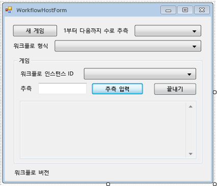

# <a name="how-to-create-and-run-a-long-running-workflow"></a>How to: Create and Run a Long Running Workflow
[!INCLUDE[wf](../../../includes/wf-md.md)]의 핵심 기능 중 하나는 런타임 시 데이터베이스에 유휴 워크플로를 유지하고 언로드하는 기능입니다. 단계 [하는 방법: 워크플로 실행](../../../docs/framework/windows-workflow-foundation/how-to-run-a-workflow.md) 워크플로 콘솔 응용 프로그램을 사용 하 여 호스팅의 기본적인 내용을 설명 합니다. 예제에서는 워크플로 시작 방법, 워크플로 수명 주기 처리기 및 책갈피 다시 시작 방법을 보여 줍니다. 워크플로 지속성을 효과적으로 보여 주기 위해서는 여러 워크플로 인스턴스의 시작 및 다시 시작을 지원하는 좀 더 복잡한 워크플로 호스트가 필요합니다. 자습서의 이 단계에서는 여러 워크플로 인스턴스의 시작 및 다시 시작과 워크플로 지속성을 지원하는 Windows Form 호스트 응용 프로그램을 만드는 방법을 보여 주고, 이후 자습서 단계에서 설명하는 추적 및 버전 관리 등의 고급 기능에 대한 기본 사항을 제공합니다.  
  
> [!NOTE]
>  이 자습서의 단계 및 후속 단계에서 3 개의 워크플로 유형을 모두 사용 하 여 [하는 방법: 워크플로 만들기](../../../docs/framework/windows-workflow-foundation/how-to-create-a-workflow.md)합니다. 세 가지 형식 모두 완료 하지 않은 경우에 있는 단계를의 전체 버전을 다운로드할 수 있습니다 [Windows Workflow Foundation (WF45)-초보자를 위한 자습서](http://go.microsoft.com/fwlink/?LinkID=248976)합니다.  
  
> [!NOTE]
>  를 전체 버전을 다운로드 하거나이 자습서의 비디오 연습을 보려면 참조 [Windows Workflow Foundation (WF45)-초보자를 위한 자습서](http://go.microsoft.com/fwlink/?LinkID=248976)합니다.  
  
## <a name="in-this-topic"></a>항목 내용  
  
-   [지 속성 데이터베이스를 만들려면](../../../docs/framework/windows-workflow-foundation/how-to-create-and-run-a-long-running-workflow.md#BKMK_CreatePersistenceDatabase)  
  
-   [DurableInstancing 어셈블리에 대 한 참조를 추가 하려면](../../../docs/framework/windows-workflow-foundation/how-to-create-and-run-a-long-running-workflow.md#BKMK_AddReference)  
  
-   [워크플로 호스트 폼을 만들려면](../../../docs/framework/windows-workflow-foundation/how-to-create-and-run-a-long-running-workflow.md#BKMK_CreateForm)  
  
-   [폼의 도우미 메서드와 속성을 추가 하려면](../../../docs/framework/windows-workflow-foundation/how-to-create-and-run-a-long-running-workflow.md#BKMK_AddHelperMethods)  
  
-   [인스턴스 저장소, 워크플로 수명 주기 처리기 및 확장을 구성 하려면](../../../docs/framework/windows-workflow-foundation/how-to-create-and-run-a-long-running-workflow.md#BKMK_ConfigureWorkflowApplication)  
  
-   [시작 및 여러 워크플로 유형을 다시 시작을 사용 하도록 설정 하려면](../../../docs/framework/windows-workflow-foundation/how-to-create-and-run-a-long-running-workflow.md#BKMK_WorkflowVersionMap)  
  
-   [새 워크플로 시작 하려면](../../../docs/framework/windows-workflow-foundation/how-to-create-and-run-a-long-running-workflow.md#BKMK_StartWorkflow)  
  
-   [워크플로 다시 시작 하려면](../../../docs/framework/windows-workflow-foundation/how-to-create-and-run-a-long-running-workflow.md#BKMK_ResumeWorkflow)  
  
-   [워크플로 종료 하려면](../../../docs/framework/windows-workflow-foundation/how-to-create-and-run-a-long-running-workflow.md#BKMK_TerminateWorkflow)  
  
-   [작성 하 고 응용 프로그램 실행](../../../docs/framework/windows-workflow-foundation/how-to-create-and-run-a-long-running-workflow.md#BKMK_BuildAndRun)  
  
###  <a name="BKMK_CreatePersistenceDatabase"></a>지 속성 데이터베이스를 만들려면  
  
1.  예를 들어 로컬 서버에 연결을 SQL Server Management Studio를 열고 **. \SQLEXPRESS**합니다. 마우스 오른쪽 단추로 클릭는 **데이터베이스** 노드를 선택 하 여 로컬 서버에 **새 데이터베이스**합니다. 새 데이터베이스의 이름을 **WF45GettingStartedTutorial**다른 모든 값을 그대로 사용 하 고 선택 **확인**합니다.  
  
    > [!NOTE]
    >  갖추어야 할 **Create Database** 데이터베이스를 만들기 전에 로컬 서버에 대 한 권한이 있습니다.  
  
2.  선택 **열려**, **파일** 에서 **파일** 메뉴. `C:\Windows\Microsoft.NET\Framework\4.0.30319\sql\en` 폴더로 이동합니다.  
  
     다음 두 파일을 선택 하 고 클릭 **열려**합니다.  
  
    -   SqlWorkflowInstanceStoreLogic.sql  
  
    -   SqlWorkflowInstanceStoreSchema.sql  
  
3.  선택 **SqlWorkflowInstanceStoreSchema.sql** 에서 **창** 메뉴. 되도록 **WF45GettingStartedTutorial** 에서 선택한는 **사용 가능한 데이터베이스** 드롭 다운 하 고 선택 **Execute** 에서 **쿼리**메뉴.  
  
4.  선택 **SqlWorkflowInstanceStoreLogic.sql** 에서 **창** 메뉴. 되도록 **WF45GettingStartedTutorial** 에서 선택한는 **사용 가능한 데이터베이스** 드롭 다운 하 고 선택 **Execute** 에서 **쿼리**메뉴.  
  
    > [!WARNING]
    >  앞의 두 단계는 올바른 순서대로 수행해야 합니다. 쿼리를 순서에 맞지 않게 실행하면 오류가 발생하고 지속성 데이터베이스가 올바르게 구성되지 않습니다.  
  
###  <a name="BKMK_AddReference"></a>DurableInstancing 어셈블리에 대 한 참조를 추가 하려면  
  
1.  마우스 오른쪽 단추로 클릭 **NumberGuessWorkflowHost** 에 **솔루션 탐색기** 선택 **참조 추가**합니다.  
  
2.  선택 **어셈블리** 에서 **참조 추가** 목록 및 형식 `DurableInstancing` 에 **어셈블리 검색** 상자입니다. 그러면 어셈블리가 필터링되므로 원하는 참조를 손쉽게 선택할 수 있습니다.  
  
3.  옆의 확인란 **검색 결과** 및 **System.Runtime.DurableInstancing** 에서 **검색 결과** 목록으로 이동한 클릭**확인**합니다.  
  
###  <a name="BKMK_CreateForm"></a>워크플로 호스트 폼을 만들려면  
  
> [!NOTE]
>  이 절차에서는 폼을 수동으로 추가 및 구성하는 방법을 단계별로 설명합니다. 필요한 경우 자습서용 솔루션 파일을 다운로드하고 프로젝트에 전체 폼을 추가할 수 있습니다. 자습서 파일을 다운로드 하려면 참조 [Windows Workflow Foundation (WF45)-초보자를 위한 자습서](http://go.microsoft.com/fwlink/?LinkID=248976)합니다. 파일 다운로드 되 면 마우스 오른쪽 단추로 클릭 **NumberGuessWorkflowHost** 선택 **참조 추가**합니다. 에 대 한 참조를 추가 **System.Windows.Forms** 및 **System.Drawing**합니다. 이러한 참조는에서 새 폼을 추가 하는 경우 자동으로 추가 됩니다는 **추가**, **새 항목** 메뉴 되지만 폼을 가져온 경우 수동으로 추가 해야 합니다. 참조가 추가 되 면 마우스 오른쪽 단추로 클릭 **NumberGuessWorkflowHost** 에 **솔루션 탐색기** 선택 **추가**, **기존 항목**합니다. 찾아는 `Form` 프로젝트 파일의 폴더 **WorkflowHostForm.cs** (또는 **WorkflowHostForm.vb**)를 클릭 하 고 **추가**합니다. 폼을 가져오는 경우 다음 섹션으로 건너뛸 수 [폼의 도우미 메서드와 속성을 추가 하려면](../../../docs/framework/windows-workflow-foundation/how-to-create-and-run-a-long-running-workflow.md#BKMK_AddHelperMethods)합니다.  
  
1.  마우스 오른쪽 단추로 클릭 **NumberGuessWorkflowHost** 에 **솔루션 탐색기** 선택 **추가**, **새 항목**합니다.  
  
2.  에 **설치 됨** 템플릿 목록에서 선택 **Windows Form**, 형식 `WorkflowHostForm` 에 **이름** 고 클릭 **추가**합니다.  
  
3.  폼에 다음 속성을 구성합니다.  
  
    |속성|값|  
    |--------------|-----------|  
    |FormBorderStyle|FixedSingle|  
    |MaximizeBox|False|  
    |크기|400, 420|  
  
4.  폼에 다음 컨트롤을 지정된 순서대로 추가하고 지시된 대로 속성을 구성합니다.  
  
    |컨트롤|속성: 값|  
    |-------------|---------------------|  
    |**Button**|이름: NewGame<br /><br /> 위치: 13, 13<br /><br /> 크기: 75, 23<br /><br /> New Game 텍스트:|  
    |**레이블**|위치: 94, 18<br /><br /> 1 ~ 숫자를 추측해 하는 텍스트:|  
    |**ComboBox**|이름: NumberRange<br /><br /> DropDownStyle: DropDownList<br /><br /> 항목: 10, 100, 1000<br /><br /> 위치: 228, 12<br /><br /> 크기: 143, 21|  
    |**레이블**|위치: 13, 43<br /><br /> Text: 워크플로 유형|  
    |**ComboBox**|이름: WorkflowType<br /><br /> DropDownStyle: DropDownList<br /><br /> StateMachineNumberGuessWorkflow FlowchartNumberGuessWorkflow, SequentialNumberGuessWorkflow 항목:<br /><br /> 위치: 94, 40<br /><br /> 크기: 277, 21|  
    |**레이블**|이름: WorkflowVersion<br /><br /> 위치: 13, 362<br /><br /> 워크플로 버전 텍스트:|  
    |**GroupBox**|위치: 13, 67<br /><br /> 크기: 358, 287<br /><br /> 텍스트: 게임|  
  
    > [!NOTE]
    >  다음과 같은 컨트롤을 추가할 때 GroupBox로 저장 합니다.  
  
    |컨트롤|속성: 값|  
    |-------------|---------------------|  
    |**레이블**|위치: 7, 20<br /><br /> Text: 워크플로 인스턴스 Id입니다.|  
    |**ComboBox**|이름: InstanceId<br /><br /> DropDownStyle: DropDownList<br /><br /> 위치: 121, 17<br /><br /> 크기: 227, 21|  
    |**레이블**|위치: 7, 47<br /><br /> 텍스트: 추측|  
    |**TextBox**|이름: 추측<br /><br /> 위치: 50, 44<br /><br /> 크기: 65, 20|  
    |**Button**|이름: EnterGuess<br /><br /> 위치: 121, 42<br /><br /> 크기: 75, 23<br /><br /> 추측을 입력 하는 텍스트:|  
    |**Button**|이름: QuitGame<br /><br /> 위치: 274, 42<br /><br /> 크기: 75, 23<br /><br /> 텍스트: 종료|  
    |**TextBox**|이름: WorkflowStatus<br /><br /> 위치: 10, 73<br /><br /> Multiline: True<br /><br /> 읽기 전용: True<br /><br /> 스크롤 막대: 세로<br /><br /> 크기: 338, 208|  
  
5.  설정의 **AcceptButton** 속성 폼의 **EnterGuess**합니다.  
  
 다음 예제에서는 완성된 폼을 보여 줍니다.  
  
   
  
###  <a name="BKMK_AddHelperMethods"></a>폼의 도우미 메서드와 속성을 추가 하려면  
 이 단원의 단계에서는 숫자 추측 워크플로의 실행 및 다시 시작을 지원하도록 폼 UI를 구성하는 속성 및 도우미 메서드를 폼 클래스에 추가합니다.  
  
1.  마우스 오른쪽 단추로 클릭 **WorkflowHostForm** 에 **솔루션 탐색기** 선택 **코드 보기**합니다.  
  
2.  다음 `using`(또는 `Imports`) 문을 파일의 맨 위에 다른 `using`(또는 `Imports`) 문과 함께 추가합니다.  
  
    ```vb  
    Imports System.Windows.Forms  
    Imports System.Activities.DurableInstancing  
    Imports System.Activities  
    Imports System.Data.SqlClient  
    Imports System.IO  
    ```  
  
    ```csharp  
    using System.Windows.Forms;  
    using System.Activities.DurableInstancing;  
    using System.Activities;  
    using System.Data.SqlClient;  
    using System.IO;  
    ```  
  
3.  다음 멤버 선언을 추가 **WorkflowHostForm** 클래스입니다.  
  
    ```vb  
    Const connectionString = "Server=.\SQLEXPRESS;Initial Catalog=WF45GettingStartedTutorial;Integrated Security=SSPI"  
    Dim store As SqlWorkflowInstanceStore  
    Dim WorkflowStarting As Boolean  
    ```  
  
    ```csharp  
    const string connectionString = "Server=.\\SQLEXPRESS;Initial Catalog=WF45GettingStartedTutorial;Integrated Security=SSPI";  
    SqlWorkflowInstanceStore store;  
    bool WorkflowStarting;  
    ```  
  
    > [!NOTE]
    >  연결 문자열이 다른 경우 해당 데이터베이스를 참조하도록 `connectionString`을 업데이트하세요.  
  
4.  `WorkflowInstanceId` 클래스에 `WorkflowFormHost` 속성을 추가합니다.  
  
    ```vb  
    Public ReadOnly Property WorkflowInstanceId() As Guid  
        Get  
            If InstanceId.SelectedIndex = -1 Then  
                Return Guid.Empty  
            Else  
                Return New Guid(InstanceId.SelectedItem.ToString())  
            End If  
        End Get  
    End Property  
    ```  
  
    ```csharp  
    public Guid WorkflowInstanceId  
    {  
        get  
        {  
            return InstanceId.SelectedIndex == -1 ? Guid.Empty : (Guid)InstanceId.SelectedItem;  
        }  
    }  
    ```  
  
     `InstanceId` 콤보 상자에는 지속형된 워크플로 인스턴스 id의 목록을 표시 및 `WorkflowInstanceId` 속성은 현재 선택한 워크플로 반환 합니다.  
  
5.  폼의 `Load` 이벤트에 대한 처리기를 추가합니다. 처리기를 추가 하려면 전환 **디자인 보기** 폼을 클릭는 **이벤트** 맨 위에 있는 아이콘은 **속성** 창 및 두 번 클릭 **부하**.  
  
    ```vb  
    Private Sub WorkflowHostForm_Load(sender As Object, e As EventArgs) Handles Me.Load  
  
    End Sub  
    ```  
  
    ```csharp  
    private void WorkflowHostForm_Load(object sender, EventArgs e)  
    {  
  
    }  
    ```  
  
6.  다음 코드를 `WorkflowHostForm_Load`에 추가합니다.  
  
    ```vb  
    'Initialize the store and configure it so that it can be used for  
    'multiple WorkflowApplication instances.  
    store = New SqlWorkflowInstanceStore(connectionString)  
    WorkflowApplication.CreateDefaultInstanceOwner(store, Nothing, WorkflowIdentityFilter.Any)  
  
    'Set default ComboBox selections.  
    NumberRange.SelectedIndex = 0  
    WorkflowType.SelectedIndex = 0  
  
    ListPersistedWorkflows()  
    ```  
  
    ```csharp  
    // Initialize the store and configure it so that it can be used for  
    // multiple WorkflowApplication instances.  
    store = new SqlWorkflowInstanceStore(connectionString);  
    WorkflowApplication.CreateDefaultInstanceOwner(store, null, WorkflowIdentityFilter.Any);  
  
    // Set default ComboBox selections.  
    NumberRange.SelectedIndex = 0;  
    WorkflowType.SelectedIndex = 0;  
  
    ListPersistedWorkflows();  
    ```  
  
     폼이 로드되면 `SqlWorkflowInstanceStore`가 구성되고 범위 및 워크플로 유형 콤보 상자가 기본값으로 설정되며 지속형 워크플로 인스턴스가 `InstanceId` 콤보 상자에 추가됩니다.  
  
7.  `SelectedIndexChanged`에 대한 `InstanceId` 처리기를 추가합니다. 처리기를 추가 하려면 전환 **디자인 보기** 양식 선택는 `InstanceId` 콤보 상자 클릭는 **이벤트** 맨 위에 있는 아이콘은 **속성** 창 및 두 번 클릭 **SelectedIndexChanged**합니다.  
  
    ```vb  
    Private Sub InstanceId_SelectedIndexChanged(sender As Object, e As EventArgs) Handles InstanceId.SelectedIndexChanged  
  
    End Sub  
    ```  
  
    ```csharp  
    private void InstanceId_SelectedIndexChanged(object sender, EventArgs e)  
    {  
  
    }  
    ```  
  
8.  다음 코드를 `InstanceId_SelectedIndexChanged`에 추가합니다. 콤보 상자를 사용하여 워크플로를 선택할 때마다 이 처리기에 의해 상태 창이 업데이트됩니다.  
  
    ```vb  
    If InstanceId.SelectedIndex = -1 Then  
        Return  
    End If  
  
    'Clear the status window.  
    WorkflowStatus.Clear()  
  
    'Get the workflow version and display it.  
    'If the workflow is just starting then this info will not  
    'be available in the persistence store so do not try and retrieve it.  
    If Not WorkflowStarting Then  
        Dim instance As WorkflowApplicationInstance = _  
            WorkflowApplication.GetInstance(WorkflowInstanceId, store)  
  
        WorkflowVersion.Text = _  
            WorkflowVersionMap.GetIdentityDescription(instance.DefinitionIdentity)  
  
        'Unload the instance.  
        instance.Abandon()  
    End If  
    ```  
  
    ```csharp  
    if (InstanceId.SelectedIndex == -1)  
    {  
        return;  
    }  
  
    // Clear the status window.  
    WorkflowStatus.Clear();  
  
    // Get the workflow version and display it.  
    // If the workflow is just starting then this info will not  
    // be available in the persistence store so do not try and retrieve it.  
    if (!WorkflowStarting)  
    {  
        WorkflowApplicationInstance instance =  
            WorkflowApplication.GetInstance(this.WorkflowInstanceId, store);  
  
        WorkflowVersion.Text =  
            WorkflowVersionMap.GetIdentityDescription(instance.DefinitionIdentity);  
  
        // Unload the instance.  
        instance.Abandon();  
    }  
    ```  
  
9. 폼 클래스에 다음 `ListPersistedWorkflows` 메서드를 추가합니다.  
  
    ```vb  
    Private Sub ListPersistedWorkflows()  
        Using localCon As New SqlConnection(connectionString)  
            Dim localCmd As String = _  
                "Select [InstanceId] from [System.Activities.DurableInstancing].[Instances] Order By [CreationTime]"  
  
            Dim cmd As SqlCommand = localCon.CreateCommand()  
            cmd.CommandText = localCmd  
            localCon.Open()  
            Using reader As SqlDataReader = cmd.ExecuteReader(CommandBehavior.CloseConnection)  
  
                While (reader.Read())  
                    'Get the InstanceId of the persisted Workflow.  
                    Dim id As Guid = Guid.Parse(reader(0).ToString())  
                    InstanceId.Items.Add(id)  
                End While  
            End Using  
        End Using  
    End Sub  
    ```  
  
    ```csharp  
    using (SqlConnection localCon = new SqlConnection(connectionString))  
    {  
        string localCmd =  
            "Select [InstanceId] from [System.Activities.DurableInstancing].[Instances] Order By [CreationTime]";  
  
        SqlCommand cmd = localCon.CreateCommand();  
        cmd.CommandText = localCmd;  
        localCon.Open();  
        using (SqlDataReader reader = cmd.ExecuteReader(CommandBehavior.CloseConnection))  
        {  
            while (reader.Read())  
            {  
                // Get the InstanceId of the persisted Workflow  
                Guid id = Guid.Parse(reader[0].ToString());  
                InstanceId.Items.Add(id);  
            }  
        }  
    }  
    ```  
  
     `ListPersistedWorkflows`는 인스턴스 저장소에서 지속형 워크플로 인스턴스를 쿼리하고 해당 인스턴스 ID를 `cboInstanceId` 콤보 상자에 추가합니다.  
  
10. 폼 클래스에 다음 `UpdateStatus` 메서드와 해당 대리자를 추가합니다. 이 메서드는 현재 실행 중인 워크플로의 상태로 폼의 상태 창을 업데이트합니다.  
  
    ```vb  
    Private Delegate Sub UpdateStatusDelegate(msg As String)  
    Public Sub UpdateStatus(msg As String)  
        'We may be on a different thread so we need to  
        'make this call using BeginInvoke.  
        If InvokeRequired Then  
            BeginInvoke(New UpdateStatusDelegate(AddressOf UpdateStatus), msg)  
        Else  
            If Not msg.EndsWith(vbCrLf) Then  
                msg = msg & vbCrLf  
            End If  
  
            WorkflowStatus.AppendText(msg)  
  
            'Ensure that the newly added status is visible.  
            WorkflowStatus.SelectionStart = WorkflowStatus.Text.Length  
            WorkflowStatus.ScrollToCaret()  
        End If  
    End Sub  
    ```  
  
    ```csharp  
    private delegate void UpdateStatusDelegate(string msg);  
    public void UpdateStatus(string msg)  
    {  
        // We may be on a different thread so we need to  
        // make this call using BeginInvoke.  
        if (InvokeRequired)  
        {  
            BeginInvoke(new UpdateStatusDelegate(UpdateStatus), msg);  
        }  
        else  
        {  
            if (!msg.EndsWith("\r\n"))  
            {  
                msg += "\r\n";  
            }  
            WorkflowStatus.AppendText(msg);  
  
            WorkflowStatus.SelectionStart = WorkflowStatus.Text.Length;  
            WorkflowStatus.ScrollToCaret();  
        }  
    }  
    ```  
  
11. 폼 클래스에 다음 `GameOver` 메서드와 해당 대리자를 추가합니다. 이 메서드는 워크플로가 완료 되 면 완료 된 워크플로의 인스턴스 id를 제거 하 여 폼 UI를 업데이트에서 **InstanceId** 콤보 상자입니다.  
  
    ```vb  
    Private Delegate Sub GameOverDelegate()  
    Private Sub GameOver()  
        If InvokeRequired Then  
            BeginInvoke(New GameOverDelegate(AddressOf GameOver))  
        Else  
            'Remove this instance from the InstanceId combo box.  
            InstanceId.Items.Remove(InstanceId.SelectedItem)  
            InstanceId.SelectedIndex = -1  
        End If  
    End Sub  
    ```  
  
    ```csharp  
    private delegate void GameOverDelegate();  
    private void GameOver()  
    {  
        if (InvokeRequired)  
        {  
            BeginInvoke(new GameOverDelegate(GameOver));  
        }  
        else  
        {  
            // Remove this instance from the combo box  
            InstanceId.Items.Remove(InstanceId.SelectedItem);  
            InstanceId.SelectedIndex = -1;  
        }  
    }  
    ```  
  
###  <a name="BKMK_ConfigureWorkflowApplication"></a>인스턴스 저장소, 워크플로 수명 주기 처리기 및 확장을 구성 하려면  
  
1.  폼 클래스에 `ConfigureWorkflowApplication` 메서드를 추가합니다.  
  
    ```vb  
    Private Sub ConfigureWorkflowApplication(wfApp As WorkflowApplication)  
  
    End Sub  
    ```  
  
    ```csharp  
    private void ConfigureWorkflowApplication(WorkflowApplication wfApp)  
    {      
    }  
    ```  
  
     이 메서드는 `WorkflowApplication`을 구성하고, 원하는 확장을 추가하고, 워크플로 수명 주기 이벤트에 대한 처리기를 추가합니다.  
  
2.  `ConfigureWorkflowApplication`에서 `SqlWorkflowInstanceStore`에 `WorkflowApplication`를 지정합니다.  
  
    ```vb  
    'Configure the persistence store.  
    wfApp.InstanceStore = store  
    ```  
  
    ```csharp  
    // Configure the persistence store.  
    wfApp.InstanceStore = store;  
    ```  
  
3.  그런 다음 `StringWriter` 인스턴스를 만들어 `Extensions`의 `WorkflowApplication` 컬렉션에 추가합니다. 경우는 `StringWriter` 모든을 캡처하는 확장에 추가 될 `WriteLine` 활동 출력 합니다. 워크플로가 유휴 상태가 되면 `WriteLine` 출력이 `StringWriter`에서 추출되어 폼에 표시될 수 있습니다.  
  
    ```vb  
    'Add a StringWriter to the extensions. This captures the output  
    'from the WriteLine activities so we can display it in the form.  
    Dim sw As New StringWriter()  
    wfApp.Extensions.Add(sw)  
    ```  
  
    ```csharp  
    // Add a StringWriter to the extensions. This captures the output  
    // from the WriteLine activities so we can display it in the form.  
    StringWriter sw = new StringWriter();  
    wfApp.Extensions.Add(sw);  
    ```  
  
4.  `Completed` 이벤트에 대한 다음 처리기를 추가합니다. 워크플로가 성공적으로 완료되면 숫자를 추측한 횟수가 상태 창에 표시됩니다. 워크플로가 종료되면 종료 원인이 된 예외에 대한 정보가 표시됩니다. 처리기가 끝나면 `GameOver` 메서드가 호출되어 워크플로 목록에서 완료된 워크플로를 제거합니다.  
  
    ```vb  
    wfApp.Completed = _  
        Sub(e As WorkflowApplicationCompletedEventArgs)  
            If e.CompletionState = ActivityInstanceState.Faulted Then  
                UpdateStatus(String.Format("Workflow Terminated. Exception: {0}" & vbCrLf & "{1}", _  
                    e.TerminationException.GetType().FullName, _  
                    e.TerminationException.Message))  
            ElseIf e.CompletionState = ActivityInstanceState.Canceled Then  
                UpdateStatus("Workflow Canceled.")  
            Else  
                Dim Turns As Integer = Convert.ToInt32(e.Outputs("Turns"))  
                UpdateStatus(String.Format("Congratulations, you guessed the number in {0} turns.", Turns))  
            End If  
            GameOver()  
        End Sub  
    ```  
  
    ```csharp  
    wfApp.Completed = delegate(WorkflowApplicationCompletedEventArgs e)  
    {  
        if (e.CompletionState == ActivityInstanceState.Faulted)  
        {  
            UpdateStatus(string.Format("Workflow Terminated. Exception: {0}\r\n{1}",  
                e.TerminationException.GetType().FullName,  
                e.TerminationException.Message));  
        }  
        else if (e.CompletionState == ActivityInstanceState.Canceled)  
        {  
            UpdateStatus("Workflow Canceled.");  
        }  
        else  
        {  
            int Turns = Convert.ToInt32(e.Outputs["Turns"]);  
            UpdateStatus(string.Format("Congratulations, you guessed the number in {0} turns.", Turns));  
        }  
        GameOver();  
    };  
    ```  
  
5.  다음 `Aborted` 및 `OnUnhandledException` 처리기를 추가합니다. 워크플로 인스턴스가 중단된 경우에는 해당 인스턴스가 종료되지 않으며 나중에 다시 시작할 수 있으므로 `GameOver` 처리기에서 `Aborted` 메서드가 호출되지 않습니다.  
  
    ```vb  
    wfApp.Aborted = _  
        Sub(e As WorkflowApplicationAbortedEventArgs)  
            UpdateStatus(String.Format("Workflow Aborted. Exception: {0}" & vbCrLf & "{1}", _  
                e.Reason.GetType().FullName, _  
                e.Reason.Message))  
        End Sub  
  
    wfApp.OnUnhandledException = _  
        Function(e As WorkflowApplicationUnhandledExceptionEventArgs)  
            UpdateStatus(String.Format("Unhandled Exception: {0}" & vbCrLf & "{1}", _  
                e.UnhandledException.GetType().FullName, _  
                e.UnhandledException.Message))  
            GameOver()  
            Return UnhandledExceptionAction.Terminate  
        End Function  
    ```  
  
    ```csharp  
    wfApp.Aborted = delegate(WorkflowApplicationAbortedEventArgs e)  
    {  
        UpdateStatus(string.Format("Workflow Aborted. Exception: {0}\r\n{1}",  
                e.Reason.GetType().FullName,  
                e.Reason.Message));  
    };  
  
    wfApp.OnUnhandledException = delegate(WorkflowApplicationUnhandledExceptionEventArgs e)  
    {  
        UpdateStatus(string.Format("Unhandled Exception: {0}\r\n{1}",  
                e.UnhandledException.GetType().FullName,  
                e.UnhandledException.Message));  
        GameOver();  
        return UnhandledExceptionAction.Terminate;  
    };  
    ```  
  
6.  다음 `PersistableIdle` 처리기를 추가합니다. 이 처리기는 추가된 `StringWriter` 확장을 검색하고 `WriteLine` 활동에서 출력을 추출하여 상태 창에 표시합니다.  
  
    ```vb  
    wfApp.PersistableIdle = _  
        Function(e As WorkflowApplicationIdleEventArgs)  
            'Send the current WriteLine outputs to the status window.  
            Dim writers = e.GetInstanceExtensions(Of StringWriter)()  
            For Each writer In writers  
                UpdateStatus(writer.ToString())  
            Next  
            Return PersistableIdleAction.Unload  
        End Function  
    ```  
  
    ```csharp  
    wfApp.PersistableIdle = delegate(WorkflowApplicationIdleEventArgs e)  
    {  
        // Send the current WriteLine outputs to the status window.  
        var writers = e.GetInstanceExtensions<StringWriter>();  
        foreach (var writer in writers)  
        {  
            UpdateStatus(writer.ToString());  
        }  
        return PersistableIdleAction.Unload;  
    };  
    ```  
  
     <xref:System.Activities.PersistableIdleAction> 열거형에는 세 개의 값(<xref:System.Activities.PersistableIdleAction.None>, <xref:System.Activities.PersistableIdleAction.Persist> 및 <xref:System.Activities.PersistableIdleAction.Unload>)이 있습니다. <xref:System.Activities.PersistableIdleAction.Persist>는 워크플로가 유지되도록 하지만 워크플로가 언로드되도록 하지는 않습니다. <xref:System.Activities.PersistableIdleAction.Unload>는 워크플로가 유지되고 언로드되도록 합니다.  
  
     다음 예제는 전체 `ConfigureWorkflowApplication` 메서드입니다.  
  
    ```vb  
    Private Sub ConfigureWorkflowApplication(wfApp As WorkflowApplication)  
        'Configure the persistence store.  
        wfApp.InstanceStore = store  
  
        'Add a StringWriter to the extensions. This captures the output  
        'from the WriteLine activities so we can display it in the form.  
        Dim sw As New StringWriter()  
        wfApp.Extensions.Add(sw)  
  
        wfApp.Completed = _  
            Sub(e As WorkflowApplicationCompletedEventArgs)  
                If e.CompletionState = ActivityInstanceState.Faulted Then  
                    UpdateStatus(String.Format("Workflow Terminated. Exception: {0}" & vbCrLf & "{1}", _  
                        e.TerminationException.GetType().FullName, _  
                        e.TerminationException.Message))  
                ElseIf e.CompletionState = ActivityInstanceState.Canceled Then  
                    UpdateStatus("Workflow Canceled.")  
                Else  
                    Dim Turns As Integer = Convert.ToInt32(e.Outputs("Turns"))  
                    UpdateStatus(String.Format("Congratulations, you guessed the number in {0} turns.", Turns))  
                End If  
                GameOver()  
            End Sub  
  
        wfApp.Aborted = _  
            Sub(e As WorkflowApplicationAbortedEventArgs)  
                UpdateStatus(String.Format("Workflow Aborted. Exception: {0}" & vbCrLf & "{1}", _  
                    e.Reason.GetType().FullName, _  
                    e.Reason.Message))  
            End Sub  
  
        wfApp.OnUnhandledException = _  
            Function(e As WorkflowApplicationUnhandledExceptionEventArgs)  
                UpdateStatus(String.Format("Unhandled Exception: {0}" & vbCrLf & "{1}", _  
                    e.UnhandledException.GetType().FullName, _  
                    e.UnhandledException.Message))  
                GameOver()  
                Return UnhandledExceptionAction.Terminate  
            End Function  
  
        wfApp.PersistableIdle = _  
            Function(e As WorkflowApplicationIdleEventArgs)  
                'Send the current WriteLine outputs to the status window.  
                Dim writers = e.GetInstanceExtensions(Of StringWriter)()  
                For Each writer In writers  
                    UpdateStatus(writer.ToString())  
                Next  
                Return PersistableIdleAction.Unload  
            End Function  
    End Sub  
    ```  
  
    ```csharp  
    private void ConfigureWorkflowApplication(WorkflowApplication wfApp)  
    {  
        // Configure the persistence store.  
        wfApp.InstanceStore = store;  
  
        // Add a StringWriter to the extensions. This captures the output  
        // from the WriteLine activities so we can display it in the form.  
        StringWriter sw = new StringWriter();  
        wfApp.Extensions.Add(sw);  
  
        wfApp.Completed = delegate(WorkflowApplicationCompletedEventArgs e)  
        {  
            if (e.CompletionState == ActivityInstanceState.Faulted)  
            {  
                UpdateStatus(string.Format("Workflow Terminated. Exception: {0}\r\n{1}",  
                    e.TerminationException.GetType().FullName,  
                    e.TerminationException.Message));  
            }  
            else if (e.CompletionState == ActivityInstanceState.Canceled)  
            {  
                UpdateStatus("Workflow Canceled.");  
            }  
            else  
            {  
                int Turns = Convert.ToInt32(e.Outputs["Turns"]);  
                UpdateStatus(string.Format("Congratulations, you guessed the number in {0} turns.", Turns));  
            }  
            GameOver();  
        };  
  
        wfApp.Aborted = delegate(WorkflowApplicationAbortedEventArgs e)  
        {  
            UpdateStatus(string.Format("Workflow Aborted. Exception: {0}\r\n{1}",  
                    e.Reason.GetType().FullName,  
                    e.Reason.Message));  
        };  
  
        wfApp.OnUnhandledException = delegate(WorkflowApplicationUnhandledExceptionEventArgs e)  
        {  
            UpdateStatus(string.Format("Unhandled Exception: {0}\r\n{1}",  
                    e.UnhandledException.GetType().FullName,  
                    e.UnhandledException.Message));  
            GameOver();  
            return UnhandledExceptionAction.Terminate;  
        };  
  
        wfApp.PersistableIdle = delegate(WorkflowApplicationIdleEventArgs e)  
        {  
            // Send the current WriteLine outputs to the status window.  
            var writers = e.GetInstanceExtensions<StringWriter>();  
            foreach (var writer in writers)  
            {  
                UpdateStatus(writer.ToString());  
            }  
            return PersistableIdleAction.Unload;  
        };  
    }  
    ```  
  
###  <a name="BKMK_WorkflowVersionMap"></a>시작 및 여러 워크플로 유형을 다시 시작을 사용 하도록 설정 하려면  
 워크플로 인스턴스를 다시 시작하려면 호스트에서 워크플로 정의를 제공해야 합니다. 이 자습서에는 세 가지 워크플로 유형이 있으며 이후 자습서 단계에서는 이러한 유형의 여러 버전을 소개합니다. 호스트 응용 프로그램에서는 `WorkflowIdentity`를 통해 식별 정보를 지속형 워크플로 인스턴스에 연결할 수 있습니다. 이 단원의 단계에서는 유틸리티 클래스를 만들어 지속형 워크플로 인스턴스의 워크플로 ID를 해당 워크플로 정의에 쉽게 매핑할 수 있도록 하는 방법을 보여 줍니다. [!INCLUDE[crabout](../../../includes/crabout-md.md)]`WorkflowIdentity` 버전 관리, 참조 [및 버전 관리를 사용 하 여 WorkflowIdentity](../../../docs/framework/windows-workflow-foundation/using-workflowidentity-and-versioning.md)합니다.  
  
1.  마우스 오른쪽 단추로 클릭 **NumberGuessWorkflowHost** 에 **솔루션 탐색기** 선택 **추가**, **클래스**합니다. 형식 `WorkflowVersionMap` 에 **이름** 상자 한 클릭 **추가**합니다.  
  
2.  다음 `using` 또는 `Imports` 문을 파일의 맨 위에 다른 `using` 또는 `Imports` 문과 함께 추가합니다.  
  
    ```vb  
    Imports NumberGuessWorkflowActivities  
    Imports System.Activities  
    ```  
  
    ```csharp  
    using NumberGuessWorkflowActivities;  
    using System.Activities;  
    ```  
  
3.  `WorkflowVersionMap` 클래스 선언을 다음 선언으로 바꿉니다.  
  
    ```vb  
    Public Module WorkflowVersionMap  
        Dim map As Dictionary(Of WorkflowIdentity, Activity)  
  
        'Current version identities.  
        Public StateMachineNumberGuessIdentity As WorkflowIdentity  
        Public FlowchartNumberGuessIdentity As WorkflowIdentity  
        Public SequentialNumberGuessIdentity As WorkflowIdentity  
  
        Sub New()  
            map = New Dictionary(Of WorkflowIdentity, Activity)  
  
            'Add the current workflow version identities.  
            StateMachineNumberGuessIdentity = New WorkflowIdentity With  
            {  
                .Name = "StateMachineNumberGuessWorkflow",  
                .Version = New Version(1, 0, 0, 0)  
            }  
  
            FlowchartNumberGuessIdentity = New WorkflowIdentity With  
            {  
                .Name = "FlowchartNumberGuessWorkflow",  
                .Version = New Version(1, 0, 0, 0)  
            }  
  
            SequentialNumberGuessIdentity = New WorkflowIdentity With  
            {  
                .Name = "SequentialNumberGuessWorkflow",  
                .Version = New Version(1, 0, 0, 0)  
            }  
  
            map.Add(StateMachineNumberGuessIdentity, New StateMachineNumberGuessWorkflow())  
            map.Add(FlowchartNumberGuessIdentity, New FlowchartNumberGuessWorkflow())  
            map.Add(SequentialNumberGuessIdentity, New SequentialNumberGuessWorkflow())  
        End Sub  
  
        Public Function GetWorkflowDefinition(identity As WorkflowIdentity) As Activity  
            Return map(identity)  
        End Function  
  
        Public Function GetIdentityDescription(identity As WorkflowIdentity) As String  
            Return identity.ToString()  
        End Function  
    End Module  
    ```  
  
    ```csharp  
    public static class WorkflowVersionMap  
    {  
        static Dictionary<WorkflowIdentity, Activity> map;  
  
        // Current version identities.  
        static public WorkflowIdentity StateMachineNumberGuessIdentity;  
        static public WorkflowIdentity FlowchartNumberGuessIdentity;  
        static public WorkflowIdentity SequentialNumberGuessIdentity;  
  
        static WorkflowVersionMap()  
        {  
            map = new Dictionary<WorkflowIdentity, Activity>();  
  
            // Add the current workflow version identities.  
            StateMachineNumberGuessIdentity = new WorkflowIdentity  
            {  
                Name = "StateMachineNumberGuessWorkflow",  
                Version = new Version(1, 0, 0, 0)  
            };  
  
            FlowchartNumberGuessIdentity = new WorkflowIdentity  
            {  
                Name = "FlowchartNumberGuessWorkflow",  
                Version = new Version(1, 0, 0, 0)  
            };  
  
            SequentialNumberGuessIdentity = new WorkflowIdentity  
            {  
                Name = "SequentialNumberGuessWorkflow",  
                Version = new Version(1, 0, 0, 0)  
            };  
  
            map.Add(StateMachineNumberGuessIdentity, new StateMachineNumberGuessWorkflow());  
            map.Add(FlowchartNumberGuessIdentity, new FlowchartNumberGuessWorkflow());  
            map.Add(SequentialNumberGuessIdentity, new SequentialNumberGuessWorkflow());  
        }  
  
        public static Activity GetWorkflowDefinition(WorkflowIdentity identity)  
        {  
            return map[identity];  
        }  
  
        public static string GetIdentityDescription(WorkflowIdentity identity)  
        {          
            return identity.ToString();  
       }  
    }  
    ```  
  
     `WorkflowVersionMap`에는 이 자습서에서 사용하는 세 개의 워크플로 정의에 매핑되며 다음 단원에서 워크플로가 시작 및 다시 시작될 때 사용되는 세 개의 워크플로 ID가 포함되어 있습니다.  
  
###  <a name="BKMK_StartWorkflow"></a>새 워크플로 시작 하려면  
  
1.  `Click`에 대한 `NewGame` 처리기를 추가합니다. 처리기를 추가 하려면 전환 **디자인 보기** 양식과 두 번 클릭에 대 한 `NewGame`합니다. `NewGame_Click` 처리기가 추가되고 폼의 뷰가 코드 뷰로 전환됩니다. 이 단추를 클릭할 때마다 새 워크플로가 시작됩니다.  
  
    ```vb  
    Private Sub NewGame_Click(sender As Object, e As EventArgs) Handles NewGame.Click  
  
    End Sub  
    ```  
  
    ```csharp  
    private void NewGame_Click(object sender, EventArgs e)  
    {  
  
    }  
    ```  
  
2.  click 처리기에 다음 코드를 추가합니다. 이 코드는 인수 이름으로 키가 지정된 워크플로 입력 인수 사전을 만듭니다. 이 사전에는 범위 콤보 상자에서 검색된 임의 생성 숫자의 범위를 포함하는 항목이 하나 있습니다.  
  
    ```vb  
    Dim inputs As New Dictionary(Of String, Object)()  
    inputs.Add("MaxNumber", Convert.ToInt32(NumberRange.SelectedItem))  
    ```  
  
    ```csharp  
    var inputs = new Dictionary<string, object>();  
    inputs.Add("MaxNumber", Convert.ToInt32(NumberRange.SelectedItem));  
    ```  
  
3.  다음으로는 워크플로를 시작하는 다음 코드를 추가합니다. 선택된 워크플로 유형에 해당하는 `WorkflowIdentity` 및 워크플로 정의는 `WorkflowVersionMap` 도우미 클래스를 사용하여 검색됩니다. 그런 다음 워크플로 정의, `WorkflowApplication` 및 입력 인수 사전을 사용하여 새 `WorkflowIdentity` 인스턴스가 만들어집니다.  
  
    ```vb  
    Dim identity As WorkflowIdentity = Nothing  
    Select Case WorkflowType.SelectedItem.ToString()  
        Case "SequentialNumberGuessWorkflow"  
            identity = WorkflowVersionMap.SequentialNumberGuessIdentity  
  
        Case "StateMachineNumberGuessWorkflow"  
            identity = WorkflowVersionMap.StateMachineNumberGuessIdentity  
  
        Case "FlowchartNumberGuessWorkflow"  
            identity = WorkflowVersionMap.FlowchartNumberGuessIdentity  
    End Select  
  
    Dim wf As Activity = WorkflowVersionMap.GetWorkflowDefinition(identity)  
  
    Dim wfApp = New WorkflowApplication(wf, inputs, identity)  
    ```  
  
    ```csharp  
    WorkflowIdentity identity = null;  
    switch (WorkflowType.SelectedItem.ToString())  
    {  
        case "SequentialNumberGuessWorkflow":  
            identity = WorkflowVersionMap.SequentialNumberGuessIdentity;  
            break;  
  
        case "StateMachineNumberGuessWorkflow":  
            identity = WorkflowVersionMap.StateMachineNumberGuessIdentity;  
            break;  
  
        case "FlowchartNumberGuessWorkflow":  
            identity = WorkflowVersionMap.FlowchartNumberGuessIdentity;  
            break;  
    };  
  
    Activity wf = WorkflowVersionMap.GetWorkflowDefinition(identity);  
  
    WorkflowApplication wfApp = new WorkflowApplication(wf, inputs, identity);  
    ```  
  
4.  그런 다음 워크플로 목록에 워크플로를 추가하고 폼에 워크플로 버전 정보를 표시하는 다음 코드를 추가합니다.  
  
    ```vb  
    'Add the workflow to the list and display the version information.  
    WorkflowStarting = True  
    InstanceId.SelectedIndex = InstanceId.Items.Add(wfApp.Id)  
    WorkflowVersion.Text = identity.ToString()  
    WorkflowStarting = False  
    ```  
  
    ```csharp  
    // Add the workflow to the list and display the version information.  
    WorkflowStarting = true;  
    InstanceId.SelectedIndex = InstanceId.Items.Add(wfApp.Id);  
    WorkflowVersion.Text = identity.ToString();  
    WorkflowStarting = false;  
    ```  
  
5.  `ConfigureWorkflowApplication`을 호출하여 이 `WorkflowApplication` 인스턴스의 인스턴스 저장소, 확장 및 워크플로 수명 주기 처리기를 구성합니다.  
  
    ```vb  
    'Configure the instance store, extensions, and   
    'workflow lifecycle handlers.  
    ConfigureWorkflowApplication(wfApp)  
    ```  
  
    ```csharp  
    // Configure the instance store, extensions, and   
    // workflow lifecycle handlers.  
    ConfigureWorkflowApplication(wfApp);  
    ```  
  
6.  마지막으로 `Run`를 호출합니다.  
  
    ```vb  
    'Start the workflow.  
    wfApp.Run()  
    ```  
  
    ```  
    // Start the workflow.  
    wfApp.Run();  
    ```  
  
     다음 예제는 전체 `NewGame_Click` 처리기입니다.  
  
    ```vb  
    Private Sub NewGame_Click(sender As Object, e As EventArgs) Handles NewGame.Click  
        'Start a new workflow.  
        Dim inputs As New Dictionary(Of String, Object)()  
        inputs.Add("MaxNumber", Convert.ToInt32(NumberRange.SelectedItem))  
  
        Dim identity As WorkflowIdentity = Nothing  
        Select Case WorkflowType.SelectedItem.ToString()  
            Case "SequentialNumberGuessWorkflow"  
                identity = WorkflowVersionMap.SequentialNumberGuessIdentity  
  
            Case "StateMachineNumberGuessWorkflow"  
                identity = WorkflowVersionMap.StateMachineNumberGuessIdentity  
  
            Case "FlowchartNumberGuessWorkflow"  
                identity = WorkflowVersionMap.FlowchartNumberGuessIdentity  
        End Select  
  
        Dim wf As Activity = WorkflowVersionMap.GetWorkflowDefinition(identity)  
  
        Dim wfApp = New WorkflowApplication(wf, inputs, identity)  
  
        'Add the workflow to the list and display the version information.  
        WorkflowStarting = True  
        InstanceId.SelectedIndex = InstanceId.Items.Add(wfApp.Id)  
        WorkflowVersion.Text = identity.ToString()  
        WorkflowStarting = False  
  
        'Configure the instance store, extensions, and   
        'workflow lifecycle handlers.  
        ConfigureWorkflowApplication(wfApp)  
  
        'Start the workflow.  
        wfApp.Run()  
    End Sub  
    ```  
  
    ```csharp  
    private void NewGame_Click(object sender, EventArgs e)  
    {  
        var inputs = new Dictionary<string, object>();  
        inputs.Add("MaxNumber", Convert.ToInt32(NumberRange.SelectedItem));  
  
        WorkflowIdentity identity = null;  
        switch (WorkflowType.SelectedItem.ToString())  
        {  
            case "SequentialNumberGuessWorkflow":  
                identity = WorkflowVersionMap.SequentialNumberGuessIdentity;  
                break;  
  
            case "StateMachineNumberGuessWorkflow":  
                identity = WorkflowVersionMap.StateMachineNumberGuessIdentity;  
                break;  
  
            case "FlowchartNumberGuessWorkflow":  
                identity = WorkflowVersionMap.FlowchartNumberGuessIdentity;  
                break;  
        };  
  
        Activity wf = WorkflowVersionMap.GetWorkflowDefinition(identity);  
  
        WorkflowApplication wfApp = new WorkflowApplication(wf, inputs, identity);  
  
        // Add the workflow to the list and display the version information.  
        WorkflowStarting = true;  
        InstanceId.SelectedIndex = InstanceId.Items.Add(wfApp.Id);  
        WorkflowVersion.Text = identity.ToString();  
        WorkflowStarting = false;  
  
        // Configure the instance store, extensions, and   
        // workflow lifecycle handlers.  
        ConfigureWorkflowApplication(wfApp);  
  
        // Start the workflow.  
        wfApp.Run();  
    }  
    ```  
  
###  <a name="BKMK_ResumeWorkflow"></a>워크플로 다시 시작 하려면  
  
1.  `Click`에 대한 `EnterGuess` 처리기를 추가합니다. 처리기를 추가 하려면 전환 **디자인 보기** 양식과 두 번 클릭에 대 한 `EnterGuess`합니다. 이 단추를 클릭할 때마다 워크플로가 다시 시작됩니다.  
  
    ```vb  
    Private Sub EnterGuess_Click(sender As Object, e As EventArgs) Handles EnterGuess.Click  
  
    End Sub  
    ```  
  
    ```csharp  
    private void EnterGuess_Click(object sender, EventArgs e)  
    {  
  
    }  
    ```  
  
2.  워크플로 목록에 워크플로가 선택되어 있고 사용자의 추측이 올바른지 확인하는 다음 코드를 추가합니다.  
  
    ```vb  
    If WorkflowInstanceId = Guid.Empty Then  
        MessageBox.Show("Please select a workflow.")  
        Return  
    End If  
  
    Dim userGuess As Integer  
    If Not Int32.TryParse(Guess.Text, userGuess) Then  
        MessageBox.Show("Please enter an integer.")  
        Guess.SelectAll()  
        Guess.Focus()  
        Return  
    End If  
    ```  
  
    ```csharp  
    if (WorkflowInstanceId == Guid.Empty)  
    {  
        MessageBox.Show("Please select a workflow.");  
        return;  
    }  
  
    int guess;  
    if (!Int32.TryParse(Guess.Text, out guess))  
    {  
        MessageBox.Show("Please enter an integer.");  
        Guess.SelectAll();  
        Guess.Focus();  
        return;  
    }  
    ```  
  
3.  그런 다음 지속형 워크플로 인스턴스의 `WorkflowApplicationInstance`를 검색합니다. `WorkflowApplicationInstance`는 워크플로 정의와 아직 연결되지 않은 지속형 워크플로 인스턴스를 나타냅니다. `DefinitionIdentity`의 `WorkflowApplicationInstance`에는 지속형 워크플로 인스턴스의 `WorkflowIdentity`가 포함되어 있습니다. 이 자습서에서는 `WorkflowVersionMap`를 올바른 워크플로 정의에 매핑하기 위해 `WorkflowIdentity` 유틸리티 클래스가 사용됩니다. 워크플로 정의가 검색되면 올바른 워크플로 정의를 사용하여 `WorkflowApplication`이 만들어집니다.  
  
    ```vb  
    Dim instance As WorkflowApplicationInstance = _  
        WorkflowApplication.GetInstance(WorkflowInstanceId, store)  
  
    'Use the persisted WorkflowIdentity to retrieve the correct workflow  
    'definition from the dictionary.  
    Dim wf As Activity = _  
        WorkflowVersionMap.GetWorkflowDefinition(instance.DefinitionIdentity)  
  
    'Associate the WorkflowApplication with the correct definition  
    Dim wfApp As WorkflowApplication = _  
        New WorkflowApplication(wf, instance.DefinitionIdentity)  
    ```  
  
    ```csharp  
    WorkflowApplicationInstance instance =  
        WorkflowApplication.GetInstance(WorkflowInstanceId, store);  
  
    // Use the persisted WorkflowIdentity to retrieve the correct workflow  
    // definition from the dictionary.  
    Activity wf =  
        WorkflowVersionMap.GetWorkflowDefinition(instance.DefinitionIdentity);  
  
    // Associate the WorkflowApplication with the correct definition  
    WorkflowApplication wfApp =  
        new WorkflowApplication(wf, instance.DefinitionIdentity);  
    ```  
  
4.  `WorkflowApplication`이 만들어진 후 `ConfigureWorkflowApplication`을 호출하여 인스턴스 저장소, 워크플로 수명 주기 처리기 및 확장을 구성합니다. 이러한 단계는 새 `WorkflowApplication`이 만들어질 때마다 수행되어야 하며, 워크플로 인스턴스가 `WorkflowApplication`에 로드되기 전에 수행되어야 합니다. 워크플로가 로드된 후에는 사용자의 추측과 함께 워크플로가 다시 시작됩니다.  
  
    ```vb  
    'Configure the extensions and lifecycle handlers.  
    'Do this before the instance is loaded. Once the instance is  
    'loaded it is too late to add extensions.  
    ConfigureWorkflowApplication(wfApp)  
  
    'Load the workflow.  
    wfApp.Load(instance)  
  
    'Resume the workflow.  
    wfApp.ResumeBookmark("EnterGuess", userGuess)  
    ```  
  
    ```csharp  
    // Configure the extensions and lifecycle handlers.  
    // Do this before the instance is loaded. Once the instance is  
    // loaded it is too late to add extensions.  
    ConfigureWorkflowApplication(wfApp);  
  
    // Load the workflow.  
    wfApp.Load(instance);  
  
    // Resume the workflow.  
    wfApp.ResumeBookmark("EnterGuess", guess);  
    ```  
  
5.  마지막으로, Guess 텍스트 상자를 지우고 다른 값을 추측할 수 있도록 폼을 준비합니다.  
  
    ```vb  
    'Clear the Guess textbox.  
    Guess.Clear()  
    Guess.Focus()  
    ```  
  
    ```csharp  
    // Clear the Guess textbox.  
    Guess.Clear();  
    Guess.Focus();  
    ```  
  
     다음 예제는 전체 `EnterGuess_Click` 처리기입니다.  
  
    ```vb  
    Private Sub EnterGuess_Click(sender As Object, e As EventArgs) Handles EnterGuess.Click  
        If WorkflowInstanceId = Guid.Empty Then  
            MessageBox.Show("Please select a workflow.")  
            Return  
        End If  
  
        Dim userGuess As Integer  
        If Not Int32.TryParse(Guess.Text, userGuess) Then  
            MessageBox.Show("Please enter an integer.")  
            Guess.SelectAll()  
            Guess.Focus()  
            Return  
        End If  
  
        Dim instance As WorkflowApplicationInstance = _  
            WorkflowApplication.GetInstance(WorkflowInstanceId, store)  
  
        'Use the persisted WorkflowIdentity to retrieve the correct workflow  
        'definition from the dictionary.  
        Dim wf As Activity = _  
            WorkflowVersionMap.GetWorkflowDefinition(instance.DefinitionIdentity)  
  
        'Associate the WorkflowApplication with the correct definition  
        Dim wfApp As WorkflowApplication = _  
            New WorkflowApplication(wf, instance.DefinitionIdentity)  
  
        'Configure the extensions and lifecycle handlers.  
        'Do this before the instance is loaded. Once the instance is  
        'loaded it is too late to add extensions.  
        ConfigureWorkflowApplication(wfApp)  
  
        'Load the workflow.  
        wfApp.Load(instance)  
  
        'Resume the workflow.  
        wfApp.ResumeBookmark("EnterGuess", userGuess)  
  
        'Clear the Guess textbox.  
        Guess.Clear()  
        Guess.Focus()  
    End Sub  
    ```  
  
    ```csharp  
    private void EnterGuess_Click(object sender, EventArgs e)  
    {  
        if (WorkflowInstanceId == Guid.Empty)  
        {  
            MessageBox.Show("Please select a workflow.");  
            return;  
        }  
  
        int guess;  
        if (!Int32.TryParse(Guess.Text, out guess))  
        {  
            MessageBox.Show("Please enter an integer.");  
            Guess.SelectAll();  
            Guess.Focus();  
            return;  
        }  
  
        WorkflowApplicationInstance instance =  
            WorkflowApplication.GetInstance(WorkflowInstanceId, store);  
  
        // Use the persisted WorkflowIdentity to retrieve the correct workflow  
        // definition from the dictionary.  
        Activity wf =  
            WorkflowVersionMap.GetWorkflowDefinition(instance.DefinitionIdentity);  
  
        // Associate the WorkflowApplication with the correct definition  
        WorkflowApplication wfApp =  
            new WorkflowApplication(wf, instance.DefinitionIdentity);  
  
        // Configure the extensions and lifecycle handlers.  
        // Do this before the instance is loaded. Once the instance is  
        // loaded it is too late to add extensions.  
        ConfigureWorkflowApplication(wfApp);  
  
        // Load the workflow.  
        wfApp.Load(instance);  
  
        // Resume the workflow.  
        wfApp.ResumeBookmark("EnterGuess", guess);  
  
        // Clear the Guess textbox.  
        Guess.Clear();  
        Guess.Focus();  
    }  
    ```  
  
###  <a name="BKMK_TerminateWorkflow"></a>워크플로 종료 하려면  
  
1.  `Click`에 대한 `QuitGame` 처리기를 추가합니다. 처리기를 추가 하려면 전환 **디자인 보기** 양식과 두 번 클릭에 대 한 `QuitGame`합니다. 이 단추를 클릭할 때마다 현재 선택된 워크플로가 종료됩니다.  
  
    ```vb  
    Private Sub QuitGame_Click(sender As Object, e As EventArgs) Handles QuitGame.Click  
  
    End Sub  
    ```  
  
    ```csharp  
    private void QuitGame_Click(object sender, EventArgs e)  
    {  
  
    }  
    ```  
  
2.  `QuitGame_Click` 처리기에 다음 코드를 추가합니다. 이 코드는 먼저 워크플로 목록에서 워크플로가 선택되어 있는지 확인합니다. 다음에는 지속형 인스턴스를 `WorkflowApplicationInstance`에 로드하고, `DefinitionIdentity`를 사용하여 올바른 워크플로 정의를 결정한 다음, `WorkflowApplication`을 초기화합니다. 그런 다음 `ConfigureWorkflowApplication`을 호출하여 확장 및 워크플로 수명 주기 처리기가 구성됩니다. 구성이 완료되면 `WorkflowApplication`이 로드되고 `Terminate`가 호출됩니다.  
  
    ```vb  
    If WorkflowInstanceId = Guid.Empty Then  
        MessageBox.Show("Please select a workflow.")  
        Return  
    End If  
  
    Dim instance As WorkflowApplicationInstance = _  
        WorkflowApplication.GetInstance(WorkflowInstanceId, store)  
  
    'Use the persisted WorkflowIdentity to retrieve the correct workflow  
    'definition from the dictionary.  
    Dim wf As Activity = WorkflowVersionMap.GetWorkflowDefinition(instance.DefinitionIdentity)  
  
    'Associate the WorkflowApplication with the correct definition.  
    Dim wfApp As WorkflowApplication = _  
        New WorkflowApplication(wf, instance.DefinitionIdentity)  
  
    'Configure the extensions and lifecycle handlers.  
    ConfigureWorkflowApplication(wfApp)  
  
    'Load the workflow.  
    wfApp.Load(instance)  
  
    'Terminate the workflow.  
    wfApp.Terminate("User resigns.")  
    ```  
  
    ```csharp  
    if (WorkflowInstanceId == Guid.Empty)  
    {  
        MessageBox.Show("Please select a workflow.");  
        return;  
    }  
  
    WorkflowApplicationInstance instance =  
        WorkflowApplication.GetInstance(WorkflowInstanceId, store);  
  
    // Use the persisted WorkflowIdentity to retrieve the correct workflow  
    // definition from the dictionary.  
    Activity wf = WorkflowVersionMap.GetWorkflowDefinition(instance.DefinitionIdentity);  
  
    // Associate the WorkflowApplication with the correct definition  
    WorkflowApplication wfApp =  
        new WorkflowApplication(wf, instance.DefinitionIdentity);  
  
    // Configure the extensions and lifecycle handlers  
    ConfigureWorkflowApplication(wfApp);  
  
    // Load the workflow.  
    wfApp.Load(instance);  
  
    // Terminate the workflow.  
    wfApp.Terminate("User resigns.");  
    ```  
  
###  <a name="BKMK_BuildAndRun"></a>작성 하 고 응용 프로그램 실행  
  
1.  두 번 클릭 **Program.cs** (또는 **Module1.vb**)에서 **솔루션 탐색기** 코드를 표시 합니다.  
  
2.  다음 `using`(또는 `Imports`) 문을 파일의 맨 위에 다른 `using`(또는 `Imports`) 문과 함께 추가합니다.  
  
    ```vb  
    Imports System.Windows.Forms  
    ```  
  
    ```csharp  
    using System.Windows.Forms;  
    ```  
  
3.  기존 워크플로 호스팅 코드를 주석으로 [하는 방법: 워크플로 실행](../../../docs/framework/windows-workflow-foundation/how-to-run-a-workflow.md)를 다음 코드로 바꿉니다.  
  
    ```vb  
    Sub Main()  
        Application.EnableVisualStyles()  
        Application.Run(New WorkflowHostForm())  
    End Sub  
    ```  
  
    ```csharp  
    static void Main(string[] args)  
    {  
        Application.EnableVisualStyles();  
        Application.Run(new WorkflowHostForm());  
    }  
    ```  
  
4.  마우스 오른쪽 단추로 클릭 **NumberGuessWorkflowHost** 에 **솔루션 탐색기** 선택 **속성**합니다. 에 **응용 프로그램** 탭을 지정 **Windows 응용 프로그램** 에 대 한는 **출력 형식이**합니다. 이 단계는 선택적이지만 이 단계를 수행하지 않으면 폼뿐만 아니라 콘솔 창도 표시됩니다.  
  
5.  Ctrl+Shift+B를 눌러 응용 프로그램을 빌드합니다.  
  
6.  되도록 **NumberGuessWorkflowHost** 시작 응용 프로그램으로 설정 하 고 Ctrl + f 5를 눌러 응용 프로그램을 시작 합니다.  
  
7.  추측 게임 및 시작 하 고 클릭 하는 워크플로 형식에 대 한 범위를 선택 **New Game**합니다. 에 추측 값을 입력에서 **추측** 상자 한 클릭 **이동** 여 추측 값을 제출 하 합니다. `WriteLine` 활동의 출력이 폼에 표시됩니다.  
  
8.  다른 워크플로 유형 및 숫자 범위를 사용 하 여 여러 워크플로 시작 하 고 몇 개의 추측 값을 입력 한 다음이에서 선택 하 여 워크플로 간을 전환는 **워크플로 인스턴스 Id** 목록입니다.  
  
     새 워크플로로 전환할 경우 이전 추측 값 및 워크플로 진행률이 상태 창에 표시되지 않습니다. 상태를 사용할 수 없는 것은 상태가 캡처 및 저장되지 않았기 때문입니다. 자습서의 다음 단계에서 [하는 방법: 사용자 지정 추적 참가자를 만드는](../../../docs/framework/windows-workflow-foundation/how-to-create-a-custom-tracking-participant.md),이 정보를 저장 하는 사용자 지정 추적 참가자를 만듭니다.
