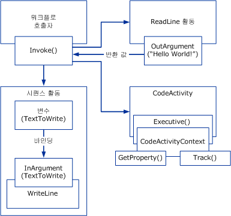

# Windows Workflow 개요
워크플로 이라는 요소 단위의 집합 *활동* 실제 프로세스를 설명 하는 모델로 포함 됩니다. 워크플로를 통해 단기 실행 작업과 장기 실행 작업의 실행 순서와 종속 관계를 설명할 수 있습니다. 이 작업은 모델을 시작부터 끝까지 통과하며 활동은 사람이 실행하거나 시스템 함수로 실행될 수 있습니다.  
  
## 워크플로 런타임 엔진  
 실행 중인 모든 워크플로 인스턴스는 다음 중 하나를 통해 호스트 프로세스와 상호 작용하는 in-process 런타임 엔진에서 만들고 유지합니다.  
  
-   메서드와 같이 워크플로를 호출하는 <xref:System.Activities.WorkflowInvoker>  
  
-   단일 워크플로 인스턴스의 실행을 명시적으로 제어하기 위한 <xref:System.Activities.WorkflowApplication>  
  
-   다중 인스턴스 시나리오에서 메시지 기반 상호 작용에 사용하는 <xref:System.ServiceModel.WorkflowServiceHost>  
  
 이 클래스는 각각 활동 실행을 담당하는 <xref:System.Activities.ActivityInstance>로 표현되는 코어 활동 런타임을 래핑합니다. 응용 프로그램 도메인 내에는 동시에 실행되는 여러 <xref:System.Activities.ActivityInstance> 개체가 있을 수 있습니다.  
  
 위의 세 가지 호스트 상호 작용 개체는 각각 워크플로 프로그램이라는 활동 트리에서 만들어집니다. 이 형식을 사용하거나 <xref:System.Activities.ActivityInstance>를 래핑하는 사용자 지정 호스트를 사용하면 콘솔 응용 프로그램, 폼 기반 응용 프로그램, Windows 서비스, [!INCLUDE[vstecasp](../../../includes/vstecasp-md.md)] 웹 사이트 및 [!INCLUDE[indigo1](../../../includes/indigo1-md.md)] 서비스를 포함한 모든 Windows 프로세스 내부에서 워크플로를 실행할 수 있습니다.  
  
   
호스트 프로세스의 워크플로 구성 요소  
  
## 워크플로 구성 요소 간의 상호 작용  
 다음 다이어그램에서는 워크플로 구성 요소가 서로 상호 작용하는 방법을 보여 줍니다.  
  
   
  
 위의 다이어그램에서는 <xref:System.Activities.WorkflowInvoker.Invoke%2A> 클래스의 <xref:System.Activities.WorkflowInvoker> 메서드를 사용하여 여러 워크플로 인스턴스를 호출합니다. <xref:System.Activities.WorkflowInvoker>는 호스트에서 관리할 필요 없는 간단한 워크플로에 사용되며, 호스트에서 관리해야 하는 워크플로(예: <xref:System.Activities.Bookmark> 다시 시작)는 그 대신 <xref:System.Activities.WorkflowApplication.Run%2A>을 사용하여 실행해야 합니다. 한 워크플로 인스턴스가 완료될 때까지 기다렸다가 다른 워크플로 인스턴스를 호출할 필요는 없습니다. 런타임 엔진은 여러 워크플로 인스턴스의 동시 실행을 지원합니다.  호출된 워크플로는 다음과 같습니다.  
  
-   <xref:System.Activities.Statements.Sequence> 자식 활동을 포함하는 <xref:System.Activities.Statements.WriteLine> 활동입니다. 부모 활동의 <xref:System.Activities.Variable>은 자식 활동의 <xref:System.Activities.InArgument>에 바인딩됩니다. [!INCLUDE[crabout](../../../includes/crabout-md.md)]참조 변수, 인수 및 바인딩에 [변수 및 인수](../../../docs/framework/windows-workflow-foundation/variables-and-arguments.md)합니다.  
  
-   `ReadLine`이라는 사용자 지정 활동입니다. <xref:System.Activities.OutArgument> 활동의 `ReadLine`가 호출 <xref:System.Activities.WorkflowInvoker.Invoke%2A> 메서드에 반환됩니다.  
  
-   <xref:System.Activities.CodeActivity> 추상 클래스에서 파생되는 사용자 지정 활동입니다. <xref:System.Activities.CodeActivity>는 <xref:System.Activities.CodeActivityContext> 메서드의 매개 변수로 사용되는 <xref:System.Activities.CodeActivity.Execute%2A>를 사용하여 런타임 기능(예: 추적 및 속성)에 액세스할 수 있습니다. [!INCLUDE[crabout](../../../includes/crabout-md.md)]이러한 런타임 기능 참조 [워크플로 추적 및 트레이싱](../../../docs/framework/windows-workflow-foundation/workflow-tracking-and-tracing.md) 및 [워크플로 실행 속성](../../../docs/framework/windows-workflow-foundation/workflow-execution-properties.md)합니다.  
  
## 참고 항목  
 [BizTalk Server 2006과 WF 프로젝트에 대 한 적절 한 워크플로 도구 선택](http://go.microsoft.com/fwlink/?LinkId=154901)
