# <a name="windows-workflow-foundation-4-performance"></a>Windows Workflow Foundation 4 성능
Dustin Metzgar  
  
 Wenlong Dong  
  
 Microsoft Corporation, 2010년 9월  
  
 Microsoft [!INCLUDE[netfx40_long](../../../includes/netfx40-long-md.md)] 성능에 많은 투자를 Windows Workflow Foundation (WF)의 주 버전을 포함 합니다.  이 새로운 수정 버전에서는 .NET Framework 3.0 및 [!INCLUDE[wf1](../../../includes/wf1-md.md)]의 일부로 제공된 [!INCLUDE[netfx35_short](../../../includes/netfx35-short-md.md)] 이전 버전의 디자인이 상당 부분 변경되었습니다. 성능과 유용성을 보다 향상시키기 위해 프로그래밍 모델, 런타임 및 도구의 핵심에서 다시 설계되었습니다. 이 항목에서는 이러한 수정 버전의 중요한 성능 특징을 보여 주고 이전 버전의 성능 특징과 비교합니다.  
  
 개별 워크플로 구성 요소 성능은 WF3과 WF4 사이에 몇 배나 증가했습니다.  직접 코딩 된 Windows Communication Foundation (WCF) 서비스 간의 격차를 둡니다이 및 [!INCLUDE[indigo2](../../../includes/indigo2-md.md)] 매우 적은 편 워크플로 서비스입니다.  WF4에서는 워크플로 대기 시간이 훨씬 줄었습니다.  지속성 성능은 2.5-3.0의 비율로 증가했습니다.  워크플로 추적을 통한 상태 모니터링의 오버헤드가 훨씬 줄었습니다.  이러한 특성은 응용 프로그램에서 WF4로 마이그레이션하거나 채택하는 강력한 이유가 됩니다.  
  
## <a name="terminology"></a>용어  
 이 항목의 나머지 부분에서는 [!INCLUDE[wf1](../../../includes/wf1-md.md)]에 도입된 [!INCLUDE[netfx40_short](../../../includes/netfx40-short-md.md)] 버전을 WF4라고 지칭합니다.  [!INCLUDE[wf1](../../../includes/wf1-md.md)]은 .Net 3.0에서 도입되었고 [!INCLUDE[netfx35_short](../../../includes/netfx35-short-md.md)] SP1을 통해 몇 가지 작은 수정이 있었습니다. 이 항목의 나머지 부분에서는 Workflow Foundation의 [!INCLUDE[netfx35_short](../../../includes/netfx35-short-md.md)] 버전을 WF3이라고 지칭합니다. WF3은 WF4와 함께 [!INCLUDE[netfx40_short](../../../includes/netfx40-short-md.md)]에 포함되어 있습니다. WF3 아티팩트를 w f 4로 마이그레이션하는 방법에 대 한 자세한 내용은 참조: [Windows Workflow Foundation 4 마이그레이션 지침](http://go.microsoft.com/fwlink/?LinkID=153313)  
  
 Windows Communication Foundation (WCF)는 서비스 지향 응용 프로그램을 빌드하기 위한 Microsoft의 통합된 프로그래밍 모델입니다. WF3과 함께 .NET 3.0의 일부로 처음 도입되었고 현재 [!INCLUDE[dnprdnshort](../../../includes/dnprdnshort-md.md)]의 주요 구성 요소 중 하나입니다.  
  
 Windows Server AppFabric은 IIS에서 실행되는 웹 응용 프로그램 및 복합 응용 프로그램을 쉽게 빌드하고, 확장 및 관리할 수 있게 하는 통합 기술 집합입니다. 서비스와 워크플로를 모니터링 및 관리하기 위한 도구를 제공합니다. 자세한 내용은 참조 [Windows Server AppFabric](http://msdn.microsoft.com/windowsserver/ee695849.aspx)  
  
## <a name="goals"></a>목표  
 이 항목은 각각 다른 시나리오에 대해 측정된 데이터와 함께 WF4의 성능 특성을 보여 주는 것을 목표로 합니다. 또한 WF4와 WF3을 자세히 비교하고 이 새로운 수정 버전에서 향상된 기능을 보여 줍니다. 이 문서에 제공된 시나리오와 데이터는 WF4 및 WF3의 여러 측면에 대한 기본 비용을 수량화합니다. 이 데이터는 WF4의 성능 특징을 파악하는 데 유용하며 WF3에서 WF4로의 마이그레이션을 계획하거나 응용 프로그램 개발에 WF4를 사용할 때 도움이 될 수 있습니다. 하지만 이 문서에 제공된 데이터에서 결론을 도출할 때는 주의해야 합니다. 복합 워크플로 응용 프로그램의 성능은 워크플로 구현 방법과 여러 구성 요소의 통합 방법에 따라 크게 달라집니다. 각 응용 프로그램을 측정하여 해당 응용 프로그램의 성능 특성을 결정해야 합니다.  
  
## <a name="overview-of-wf4-performance-enhancements"></a>WF4 성능 개선 사항 개요  
 WF4는 다음 단원에서 설명하는 고성능 및 확장성을 제공하도록 신중하게 설계 및 구현되었습니다.  
  
### <a name="wf-runtime"></a>WF 런타임  
 [!INCLUDE[wf1](../../../includes/wf1-md.md)] 런타임의 핵심에는 워크플로의 작업 실행을 구동하는 비동기 스케줄러가 있습니다. 비동기 스케줄러는 예측 가능한 고성능 작업 실행 환경을 제공합니다. 이 환경에는 실행, 연속, 완료, 취소, 예외 및 예측 가능한 스레딩 모델에 대한 정의가 포함되어 있습니다.  
  
 WF3에 비해 WF4 런타임의 스케줄러는 더 효율적입니다. 이 스케줄러는 [!INCLUDE[indigo2](../../../includes/indigo2-md.md)]에 사용되는 것과 동일하며 일괄 작업 항목 실행에 매우 효율적인 I/O 스레드 풀을 활용합니다. 내부 작업 항목 스케줄러 큐는 가장 일반적인 사용 패턴에 최적화되어 있습니다. 또한 WF4 런타임은 동기화 및 이벤트 처리 논리를 최소화하여 경량 방식으로 실행 상태를 관리하는 반면에 WF3은 중량 이벤트 등록 및 호출을 사용하여 상태 전환을 위한 복잡한 동기화를 수행합니다.  
  
### <a name="data-storage-and-flow"></a>데이터 저장소 및 흐름  
 WF3에서는 작업과 연결된 데이터가 <xref:System.Windows.DependencyProperty> 형식으로 구현된 종속성 속성을 통해 모델링됩니다. 종속성 속성 패턴은 Windows Presentation Foundation (WPF)에서 도입 되었습니다. 일반적으로 이 패턴은 쉬운 데이터 바인딩 및 기타 UI 기능을 매우 유연하게 지원합니다. 하지만 이 패턴을 사용하려면 워크플로 정의에서 속성을 정적 필드로 정의해야 합니다. [!INCLUDE[wf1](../../../includes/wf1-md.md)] 런타임이 속성 값을 설정하거나 가져올 때마다 중량 조회 논리가 사용됩니다.  
  
 WF4는 명료한 데이터 범위 논리를 사용하여 워크플로에서 데이터가 처리되는 방식을 크게 향상시킵니다. WF4는 서로 다른 두 가지 개념인 변수와 인수를 사용하여 작업에 저장되는 데이터와 작업 경계를 넘어서 전달되는 데이터를 구분합니다. 변수 및 "In/Out/InOut" 인수에 대해 명료한 계층적 범위를 사용 하 여 활동에 대 한 데이터 사용 복잡성이 훨씬 줄어들고 데이터 수명의 범위도 자동으로 지정 합니다. 작업에는 인수로 설명되는 잘 정의된 시그니처가 있습니다. 작업을 검사하기만 하면 받아야 하는 데이터와 실행 결과로 생성되는 데이터를 확인할 수 있습니다.  
  
 WF3에서는 워크플로를 만들 때 작업이 초기화되었습니다. WF4에서는 해당 작업이 실행되는 경우에만 작업이 초기화됩니다. 이렇게 하면 새 워크플로 인스턴스를 만들 때 초기화/초기화 취소 작업을 수행하지 않고 작업 수명 주기를 간소화할 수 있으므로 효율성이 향상됩니다.  
  
### <a name="control-flow"></a>제어 흐름  
 모든 프로그래밍 언어와 마찬가지로 [!INCLUDE[wf1](../../../includes/wf1-md.md)]에서는 시퀀싱, 반복, 분기 및 기타 패턴에 대한 제어 흐름 작업 집합을 도입하여 워크플로 정의에 대한 제어 흐름을 지원합니다. WF3에서는 동일한 작업을 다시 실행해야 하는 경우 새로운 <xref:System.Workflow.ComponentModel.ActivityExecutionContext>가 생성되고 <xref:System.Runtime.Serialization.Formatters.Binary.BinaryFormatter>를 기반으로 하는 중량 serialization 및 deserialization 논리를 통해 작업이 복제됩니다. 일반적으로 반복 제어 흐름의 성능은 작업 시퀀스를 실행하는 것보다 훨씬 느립니다.  
  
 WF4에서는 이러한 경우를 완전히 다른 방식으로 처리합니다. 작업 템플릿을 사용하고 새 ActivityInstance 개체를 만든 다음 스케줄러 큐에 추가합니다. 이 전체 프로세스는 명시적 개체 만들기만 포함하며 매우 경량입니다.  
  
### <a name="asynchronous-programming"></a>비동기 프로그래밍  
 일반적으로 I/O 또는 분산 컴퓨팅 작업과 같은 장기 실행 차단 작업에 대해 비동기 프로그래밍을 사용하면 응용 프로그램의 성능과 확장성이 향상됩니다. WF4에서는 기본 작업 형식 <xref:System.Activities.AsyncCodeActivity>, <xref:System.Activities.AsyncCodeActivity%601>를 통해 비동기 지원을 제공합니다. 런타임은 기본적으로 비동기 작업을 이해하므로 비동기 작업이 처리되는 동안 자동으로 인스턴스를 지속적이지 않은 영역에 배치할 수 있습니다. 워크플로 스케줄러 스레드를 보류하지 않고 병렬로 실행될 수 있는 작업을 차단하지 않으면서 비동기 작업을 수행하기 위해 이러한 유형에서 사용자 지정 작업이 파생될 수 있습니다.  
  
### <a name="messaging"></a>메시징  
 처음에 WF3은 외부 이벤트 또는 웹 서비스 호출을 통해 매우 제한된 메시징을 지원했습니다. .NET 3.5에서는 워크플로가 [!INCLUDE[indigo2](../../../includes/indigo2-md.md)] 클라이언트로 구현되거나 [!INCLUDE[indigo2](../../../includes/indigo2-md.md)] 및 <xref:System.Workflow.Activities.SendActivity>를 통해 <xref:System.Workflow.Activities.ReceiveActivity> 서비스로 노출될 수 있었습니다. WF4에서는 [!INCLUDE[indigo2](../../../includes/indigo2-md.md)] 메시징 논리가 WF로 긴밀히 통합됨에 따라 워크플로 기반 메시징 프로그래밍의 개념이 더욱 강화되었습니다.  
  
 .Net 4의 [!INCLUDE[indigo2](../../../includes/indigo2-md.md)]에 제공되는 통합 메시지 처리 파이프라인을 통해 WF4 서비스는 WF3보다 향상된 성능과 확장성을 제공할 수 있습니다. WF4는 복잡한 MEP(메시지 Exchange 패턴)를 모델링할 수 있는 보다 풍부한 메시징 프로그래밍 지원도 제공합니다. 개발자는 형식화된 서비스 계약을 사용하여 프로그래밍을 간소화하거나 형식화되지 않은 서비스 계약을 사용하여 serialization 비용 없이 성능을 향상시킬 수 있습니다. WF4의 <xref:System.ServiceModel.Activities.SendMessageChannelCache> 클래스를 통한 클라이언트 쪽 채널 캐싱 지원은 개발자가 최소한의 노력으로 빠른 응용 프로그램을 빌드하는 데 도움이 됩니다. 자세한 내용은 참조 [보내기 활동에 대 한 캐시 공유 수준 변경](../../../docs/framework/wcf/feature-details/changing-the-cache-sharing-levels-for-send-activities.md)합니다.  
  
### <a name="declarative-programming"></a>선언적 프로그래밍  
 WF4는 비즈니스 프로세스 및 서비스를 모델링하는 명료하고 단순한 선언적 프로그래밍 프레임워크를 제공합니다. 프로그래밍 모델은 코드 없이 선언적 작업 구성을 지원하므로 워크플로 작성이 훨씬 간소화됩니다. [!INCLUDE[netfx40_short](../../../includes/netfx40-short-md.md)]에서는 XAML 기반 선언적 프로그래밍 프레임워크가 WPF 및 WF를 모두 지원하는 단일 어셈블리 System.Xaml.dll로 통합되었습니다.  
  
 WF4에서는 XAML이 선언적 경험을 제공하며 .NET을 사용하여 빌드된 작업과 형식을 참조하여 XML 태그로 전체 워크플로 정의를 정의할 수 있도록 합니다. 사용자 지정 코드 숨김 논리를 포함하지 않는 WF3의 XOML 형식으로는 이러한 작업을 수행하는 것이 어려웠습니다. .Net 4의 새 XAML 스택은 워크플로 아티팩트를 serialize(직렬화)/deserialize(역직렬화)할 때 성능을 향상시키며 선언적 프로그래밍을 보다 효율적이고 강력하게 만듭니다.  
  
### <a name="workflow-designer"></a>Workflow Designer  
 WF4에서는 선언적 프로그래밍을 지원하므로 큰 워크플로의 경우 디자인 타임 성능을 위해 보다 엄격한 요구 사항이 명시적으로 부과됩니다. WF4의 Workflow Designer에서는 WF3에 비해 큰 워크플로에 대한 확장성이 향상되었습니다. WF3 디자이너에서는 몇백 개의 작업으로 구성된 워크플로도 거의 로드할 수 없는 반면에 WF4 디자이너는 UI 가상화 지원을 통해 1000개 작업으로 구성된 큰 워크플로를 몇 초 만에 쉽게 로드할 수 있습니다.  
  
## <a name="component-level-performance-comparisons"></a>구성 요소 수준 성능 비교  
 이 단원에는 WF3 및 WF4 워크플로의 개별 작업을 직접 비교한 결과 데이터가 포함되어 있습니다.  지속성과 같은 주요 영역이 개별 작업 구성 요소보다 성능에 더 큰 영향을 줍니다.  이제 구성 요소가 직접 코딩된 오케스트레이션 논리와 비교될 수 있을 만큼 빠르기 때문에 WF4의 개별 구성 요소 성능 향상은 중요합니다.  다음 섹션에 대해서는 설명 된 예제: "서비스 컴퍼지션 시나리오"  
  
### <a name="environment-setup"></a>환경 설치  
 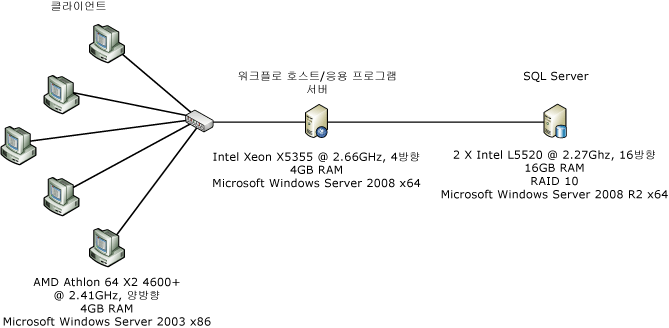  
  
 위의 그림은 구성 요소 수준 성능 측정에 사용되는 컴퓨터 구성을 보여 줍니다. 1Gbps 이더넷 네트워크 인터페이스 하나를 통해 연결된 클라이언트 5대와 서버 1대. 측정하기 쉽도록 서버는 Windows Server 2008 x86을 실행하는 듀얼 프로세서/쿼드 코어 서버의 단일 코어를 사용하도록 구성됩니다. 시스템 CPU 사용률은 거의 100% 유지됩니다.  
  
### <a name="test-details"></a>테스트 정보  
 대체로 WF3 <xref:System.Workflow.Activities.CodeActivity>는 WF3 워크플로에서 사용할 수 있는 가장 간단한 작업입니다.  이 작업은 워크플로 프로그래머가 사용자 지정 코드를 넣을 수 있는 코드 숨김의 메서드를 호출합니다.  WF4에는 WF3 <xref:System.Workflow.Activities.CodeActivity>와 동일한 기능을 수행하는 동등한 기능이 없습니다.  WF4에는 WF3 <xref:System.Activities.CodeActivity>와 관련이 없는 <xref:System.Workflow.Activities.CodeActivity> 기본 클래스가 있습니다.  워크플로 작성자는 사용자 지정 작업을 만든 다음 XAML 전용 워크플로를 빌드하는 것이 좋습니다.  아래 테스트에서는 비어 있는 `Comment` 대신 <xref:System.Workflow.Activities.CodeActivity>라는 작업이 WF4 워크플로에 사용됩니다.  `Comment` 작업의 코드는 다음과 같습니다.  
  
```  
[ContentProperty("Body")]  
    public sealed class Comment : CodeActivity  
    {  
        public Comment()  
            : base()  
        {  
        }  
  
        [DefaultValue(null)]  
        public Activity Body  
        {  
            get;  
            set;  
        }  
  
        protected override void Execute(CodeActivityContext context)  
        {  
        }  
    }  
```  
  
### <a name="empty-workflow"></a>빈 워크플로  
 이 테스트에서는 자식 작업이 없는 시퀀스 워크플로를 사용합니다.  
  
### <a name="single-activity"></a>단일 작업  
 이 워크플로는 자식 작업 한 개가 포함된 시퀀스 워크플로입니다.  작업은 WF3의 경우 코드가 없고 WF4의 경우 <xref:System.Workflow.Activities.CodeActivity> 작업이 있는 `Comment`입니다.  
  
### <a name="while-with-1000-iterations"></a>1000회 반복이 포함된 While  
 시퀀스 워크플로에는 아무 작업도 수행하지 않는 자식 작업 한 개가 루프에 포함된 <xref:System.Activities.Statements.While> 작업 한 개가 있습니다.  
  
### <a name="replicator-compared-to-parallelforeach"></a>ParallelForEach와 비교되는 복제기  
 WF3의 <xref:System.Workflow.Activities.ReplicatorActivity>에는 순차 실행 모드와 병렬 실행 모드가 있습니다.  순차 모드에서는 작업 성능이 <xref:System.Workflow.Activities.WhileActivity>와 유사합니다.  <xref:System.Workflow.Activities.ReplicatorActivity>는 병렬 실행에 가장 유용합니다.  WF4에서 이 작업과 유사한 작업은 <xref:System.Activities.Statements.ParallelForEach%601> 작업입니다.  
  
 다음 다이어그램에서는 이 테스트에 사용되는 워크플로를 보여 줍니다. 왼쪽은 WF3 워크플로이고 오른쪽은 WF4 워크플로입니다.  
  
 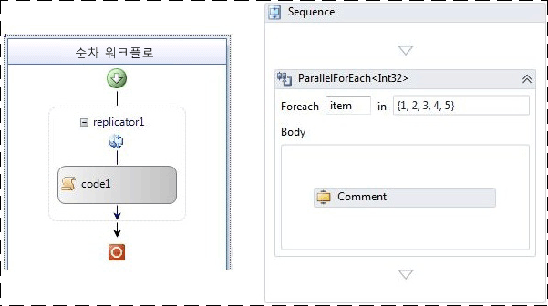  
  
### <a name="sequential-workflow-with-five-activities"></a>5개 작업이 포함된 순차 워크플로  
 이 테스트는 여러 작업을 순차적으로 실행할 경우의 결과를 보여 주기 위한 것입니다.  이 시퀀스에는 5개 작업이 있습니다.  
  
### <a name="transaction-scope"></a>트랜잭션 범위  
 트랜잭션 범위 테스트는 각 반복에 대해 새 워크플로 인스턴스가 생성되지 않는다는 점에서 다른 테스트와 약간 다릅니다.  대신 아무 작업도 수행하지 않는 작업 한 개가 있는 <xref:System.Activities.Statements.TransactionScope> 작업을 포함하는 워크플로가 while 루프를 사용하여 구성됩니다.  while 루프를 50회 반복하는 일괄 처리 작업을 매번 실행할 때마다 단일 작업으로 계산됩니다.  
  
### <a name="compensation"></a>보정  
 WF3 워크플로에는 `WorkScope`라는 보정 가능한 작업 한 개가 있습니다.  이 작업은 단순히 <xref:System.Workflow.ComponentModel.ICompensatableActivity> 인터페이스를 구현합니다.  
  
```  
class WorkScope :   
        CompositeActivity, ICompensatableActivity  
    {  
        public WorkScope() : base() { }  
  
        public WorkScope(string name)  
        {  
            this.Name = name;  
        }  
  
        public ActivityExecutionStatus Compensate(  
            ActivityExecutionContext executionContext)  
        {  
            return ActivityExecutionStatus.Closed;  
        }  
    }  
```  
  
 오류 처리기는 `WorkScope` 작업을 대상으로 합니다. WF4 워크플로도 똑같이 단순합니다.  <xref:System.Activities.Statements.CompensableActivity>에는 본문과 보정 처리기가 있습니다.  명시적 보정은 시퀀스의 다음 항목입니다.  본문 작업과 보정 처리기 작업은 모두 빈 구현입니다.  
  
```  
public sealed class CompensableActivityEmptyCompensation : CodeActivity  
    {  
        public CompensableActivityEmptyCompensation()  
            : base() { }  
  
        public Activity Body { get; set; }  
  
        protected override void Execute(CodeActivityContext context) { }  
    }  
    public sealed class CompensableActivityEmptyBody : CodeActivity  
    {  
        public CompensableActivityEmptyBody()  
            : base() { }  
  
        public Activity Body { get; set; }  
  
        protected override void Execute(CodeActivityContext context) { }  
    }  
```  
  
 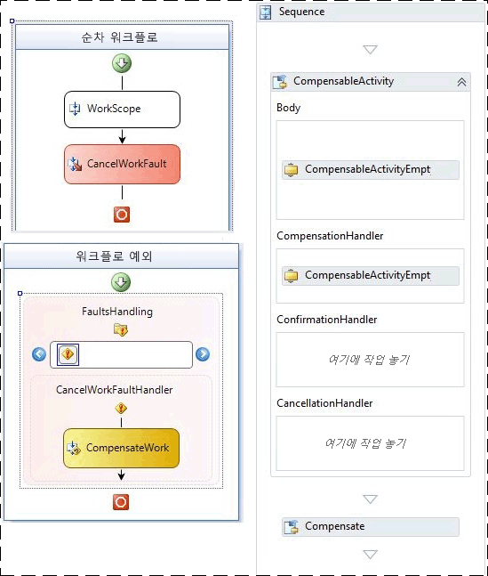  
  
 그림 2 – WF3(왼쪽) 및 WF4(오른쪽) 기본 보정 워크플로  
  
### <a name="performance-test-results"></a>성능 테스트 결과  
 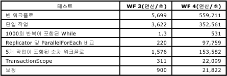  
  
 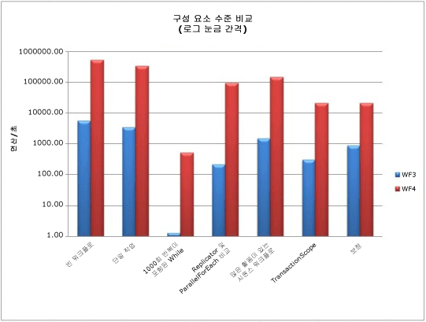  
  
 모든 테스트는 트랜잭션 범위 테스트를 제외하고 초당 워크플로 수로 측정됩니다.  위에서 볼 수 있듯이 [!INCLUDE[wf1](../../../includes/wf1-md.md)] 런타임 성능이 전반적으로, 특히 while 루프와 같이 동일한 작업을 여러 번 실행해야 하는 영역에서 향상되었습니다.  
  
## <a name="service-composition-scenario"></a>서비스 컴퍼지션 시나리오  
 이전 섹션 "구성 요소 수준 성능 비교" 에서처럼 w f 3과 WF4 사이 오버 헤드가 크게 감소가 했습니다.  이제 [!INCLUDE[indigo2](../../../includes/indigo2-md.md)] 워크플로 서비스는 직접 코딩된 [!INCLUDE[indigo2](../../../includes/indigo2-md.md)] 서비스의 성능과 거의 일치하는 동시에 [!INCLUDE[wf1](../../../includes/wf1-md.md)] 런타임의 모든 이점을 가질 수 있습니다.  이 테스트 시나리오에서는 [!INCLUDE[indigo2](../../../includes/indigo2-md.md)] 서비스를 WF4의 [!INCLUDE[indigo2](../../../includes/indigo2-md.md)] 워크플로 서비스와 비교합니다.  
  
### <a name="online-store-service"></a>온라인 저장소 서비스  
 Windows Workflow Foundation의 장점 중 하나에 몇 가지 서비스를 사용 하 여 프로세스를 작성 하는 기능입니다.  이러한 예로 서비스 호출 두 개를 오케스트레이션하여 주문을 구입하는 온라인 저장소 서비스가 있습니다.  첫 번째 단계에서는 주문 확인 서비스를 사용하여 주문을 확인합니다.  두 번째 단계에서는 웨어하우스 서비스를 사용하여 주문을 채웁니다.  
  
 두 개의 백 엔드 서비스인 주문 확인 서비스와 웨어하우스 서비스는 두 테스트에서 모두 동일하게 유지됩니다.  변경되는 부분은 오케스트레이션을 수행하는 온라인 저장소 서비스입니다.  한 사례에서는 서비스가 [!INCLUDE[indigo2](../../../includes/indigo2-md.md)] 서비스로 직접 코딩됩니다.  다른 사례에서는 서비스가 WF4의 [!INCLUDE[indigo2](../../../includes/indigo2-md.md)] 워크플로 서비스로 작성됩니다. 추적 및 지속성과 같은 [!INCLUDE[wf1](../../../includes/wf1-md.md)] 관련 기능은 이 테스트에서 해제됩니다.  
  
### <a name="environment"></a>환경  
   
  
 여러 컴퓨터에서 HTTP를 통해 온라인 저장소 서비스에 대한 클라이언트 요청이 수행됩니다.  한 컴퓨터에서 서비스 3개를 모두 호스트합니다.  온라인 저장소 서비스와 백 엔드 서비스 사이의 전송 계층은 TCP 또는 HTTP입니다.  작업/초 측정은 온라인 저장소 서비스에 대해 완료된 `PurchaseOrder` 호출 수를 기반으로 합니다.  채널 풀링은 WF4의 새로운 기능입니다.  이 테스트의 [!INCLUDE[indigo2](../../../includes/indigo2-md.md)] 부분에서는 채널 풀링이 기본적으로 제공되지 않으므로 온라인 저장소 서비스에서 간단한 풀링 기술의 직접 코딩된 구현이 사용되었습니다.  
  
### <a name="performance"></a>성능  
 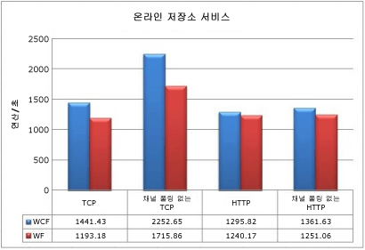  
  
 채널 풀링 없이 백엔드 TCP 서비스에 연결하는 [!INCLUDE[wf1](../../../includes/wf1-md.md)] 서비스는 처리량에 17.2% 영향을 줍니다.  채널 풀링을 사용할 경우 약 23.8% 손실이 있습니다.  HTTP의 경우 영향이 훨씬 적습니다. 풀링이 없을 경우 4.3% 손실이 있고 풀링을 사용할 경우 8.1% 손실이 있습니다.  HTTP를 사용할 때는 채널 풀링의 이점이 거의 없다는 것도 중요합니다.  
  
 이 테스트에서는 직접 코딩된 [!INCLUDE[indigo2](../../../includes/indigo2-md.md)] 서비스에 비해 WF4 런타임에서 오버헤드가 발생하지만 이는 최악의 시나리오로 간주될 수 있습니다.  이 테스트의 백 엔드 서비스 두 개는 거의 작업을 수행하지 않습니다.  실제 종단 간 시나리오에서는 이러한 서비스가 데이터베이스 호출과 같은 보다 광범위한 작업을 수행하여 전송 계층이 성능에 미치는 영향을 줄입니다.  이러한 장점 외에도 WF4에서 사용 가능한 기능의 이점 덕분에 Workflow Foundation은 오케스트레이션 서비스를 만들 때 유용한 선택이 됩니다.  
  
## <a name="key-performance-considerations"></a>주요 성능 고려 사항  
 interop을 제외한 이 단원의 기능 영역은 WF3과 WF4 사이에서 크게 변경되었습니다.  이러한 변경은 성능은 물론 워크플로 응용 프로그램의 디자인에도 영향을 줍니다.  
  
#### <a name="workflow-activation-latency"></a>워크플로 활성화 대기 시간  
 [!INCLUDE[indigo2](../../../includes/indigo2-md.md)] 워크플로 서비스 응용 프로그램에서는 새 워크플로를 시작하거나 기존 워크플로를 로드하기 위한 대기 시간이 중요합니다.  이 테스트 사례에서는 일반적인 시나리오의 WF4 XAMLX 호스트를 기준으로 WF3 XOML 호스트를 측정합니다.  
  
##### <a name="environment-setup"></a>환경 설치  
 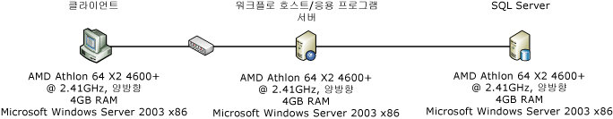  
  
##### <a name="test-setup"></a>테스트 설치  
 이 시나리오에서는 클라이언트 컴퓨터가 컨텍스트 기반 상관 관계를 사용하여 [!INCLUDE[indigo2](../../../includes/indigo2-md.md)] 워크플로 서비스에 연결합니다.  컨텍스트 상관 관계에는 특수 컨텍스트 바인딩이 필요하며 컨텍스트 헤더나 쿠키를 사용하여 메시지를 올바른 워크플로 인스턴스에 연결합니다.  상관 관계 ID가 메시지 헤더에 있으므로 메시지 본문을 구문 분석할 필요가 없다는 점에서 성능 이점이 있습니다. 컨텍스트 상관 관계에 대 한 자세한 내용은 참조 하십시오. [컨텍스트 교환 상관 관계](../../../docs/framework/wcf/feature-details/context-exchange-correlation.md)  
  
 서비스는 요청을 사용하여 새 워크플로를 만들고 즉각적인 응답을 보내어 대기 시간 측정에 워크플로 실행 시간이 포함되지 않도록 합니다.  WF3 워크플로는 코드 숨김이 있는 XOML이고 WF4 워크플로는 완전히 XAML입니다.  WF4 워크플로는 다음과 같습니다.  
  
 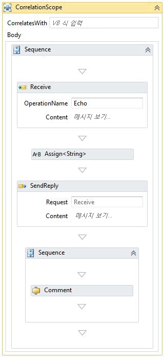  
  
 <xref:System.ServiceModel.Activities.Receive> 작업은 워크플로 인스턴스를 만듭니다.  받은 메시지에 전달된 값은 회신 메시지에서 에코됩니다.  회신 후의 시퀀스에는 워크플로의 나머지 부분이 포함됩니다.  위의 사례에서는 주석 작업 한 개만 표시됩니다.  주석 작업 수가 워크플로 복잡성을 시뮬레이션하기 위해 변경됩니다.  주석 작업은 아무 작업도 수행하지 않는 WF3 <xref:System.Workflow.Activities.CodeActivity>에 해당합니다. 주석 작업에 대 한 자세한 내용은이 문서의 앞부분에서 "구성 요소 수준 성능 비교" 섹션을 참조 합니다.  
  
##### <a name="test-results"></a>테스트 결과  
 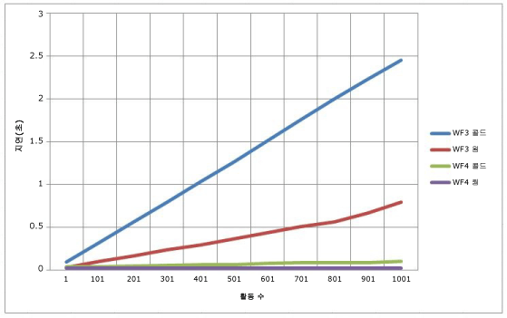  
  
 그림 3 – WCF 워크플로 서비스의 콜드 및 웜 대기 시간  
  
 위의 그래프에서 콜드는 지정된 워크플로에 대한 기존 <xref:System.ServiceModel.WorkflowServiceHost>가 없는 경우를 나타냅니다.  즉, 콜드 대기 시간은 워크플로가 처음 사용되고 있으며 XOML 또는 XAML을 컴파일해야 하는 경우입니다.  웜 대기 시간은 워크플로 형식이 이미 컴파일된 경우 새 워크플로 인스턴스를 만드는 시간입니다.  WF4 사례에서는 워크플로 복잡성에 거의 차이가 없지만 WF3 사례에서는 선형으로 진행합니다.  
  
#### <a name="correlation-throughput"></a>상관 관계 처리량  
 WF4에서는 콘텐츠 기반의 새 상관 관계 기능이 도입되었습니다.  WF3은 컨텍스트 기반 상관 관계만 제공했습니다.  컨텍스트 기반 상관 관계는 특정 [!INCLUDE[indigo2](../../../includes/indigo2-md.md)] 채널 바인딩을 통해서만 수행할 수 있었습니다.  이러한 바인딩을 사용하는 경우 메시지 헤더에 워크플로 ID가 삽입됩니다.  WF3 런타임은 워크플로를 해당 ID로만 식별할 수 있었습니다.  내용 기반 상관 관계를 사용하면 워크플로 작성자가 계정 번호, 고객 ID 등의 관련 데이터 부분에서 상관 관계 키를 만들 수 있습니다. 내용 기반 상관 관계에 대 한 자세한 내용은 참조 [콘텐츠 기반 상관 관계](../../../docs/framework/wcf/feature-details/content-based-correlation.md)합니다.  
  
 컨텍스트 기반 상관 관계는 상관 관계 키가 메시지 헤더에 있다는 점에서 성능 이점이 있습니다.  deserialization/메시지 복사 없이 메시지에서 키를 읽을 수 있습니다.  콘텐츠 기반 상관 관계에서는 상관 관계 키가 메시지 본문에 저장됩니다.  XPath 식을 사용하여 키를 찾습니다.  이 추가 처리 비용은 메시지 크기, 본문에서 키의 깊이 및 키 개수에 따라 달라집니다.  이 테스트에서는 컨텍스트 및 콘텐츠 기반 상관 관계를 비교하고 여러 키를 사용할 때의 성능 저하를 보여 줍니다.  
  
#### <a name="environment-setup"></a>환경 설치  
   
  
#### <a name="test-setup"></a>테스트 설치  
 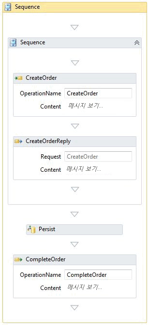  
  
 위에 표시 된 워크플로은 아래의 "지 속성" 섹션에 사용 된 것 같습니다.  지속성이 없는 상관 관계 테스트의 경우 런타임에 지속성 공급자가 설치되지 않습니다.  상관 관계는 CreateOrder 및 CompleteOrder의 두 위치에서 발생합니다.  
  
#### <a name="test-results"></a>테스트 결과  
 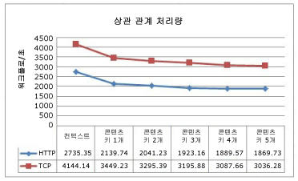  
  
 이 그래프에서는 콘텐츠 기반 상관 관계에서 사용된 키 개수가 증가할 때의 성능 저하를 보여 줍니다.  TCP와 HTTP의 곡선이 유사한 것은 이러한 프로토콜과 연결된 오버헤드를 나타냅니다.  
  
#### <a name="correlation-with-persistence"></a>지속성이 포함된 상관 관계  
 지속형 워크플로를 사용할 경우 콘텐츠 기반 상관 관계의 CPU 부담이 워크플로 런타임에서 SQL 데이터베이스로 이동합니다.  SQL 지속성 공급자의 저장 프로시저는 키를 일치시켜 해당 워크플로를 찾는 작업을 수행합니다.  
  
 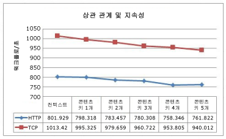  
  
 여전히 컨텍스트 기반 상관 관계가 콘텐츠 기반 상관 관계보다 더 빠릅니다.  그러나 지속성이 상관 관계보다 성능에 더 많은 영향을 주기 때문에 차이가 덜 두드러집니다.  
  
### <a name="complex-workflow-throughput"></a>복잡한 워크플로 처리량  
 워크플로 복잡성은 작업 수로만 측정되지 않습니다.  복합 작업에는 많은 자식이 포함될 수 있으며 이러한 자식도 복합 작업일 수 있습니다.  중첩 수준 수가 증가함에 따라 현재 실행 상태에 있는 작업 수와 특정 상태에 있는 변수 개수도 증가합니다.  이 테스트에서는 복잡한 워크플로를 실행할 때 WF3과 WF4의 처리량을 비교합니다.  
  
### <a name="test-setup"></a>테스트 설치  
 이러한 테스트는 Windows Server 2008 x64를 실행하는 Intel Xeon X5355 @ 2.66GHz 4방향 컴퓨터(4GB RAM)에서 실행되었습니다.  테스트 코드는 100% CPU 사용률에 도달하기 위해 코어당 스레드 한 개를 사용하여 단일 프로세스에서 실행됩니다.  
  
 이 테스트에 대해 생성된 워크플로에는 각 시퀀스의 작업 수와 깊이를 나타내는 두 개의 기본 변수가 있습니다.  각 깊이 수준에는 병렬 작업, while 루프, 결정, 할당 및 시퀀스가 포함됩니다.  아래 그림의 WF4 디자이너에는 최상위 순서도가 나와 있습니다.  각 순서도 작업은 기본 순서도와 비슷합니다.  깊이가 테스트 매개 변수로 제한되는 이 워크플로를 그림으로 그리는 경우 프랙탈을 고려하는 것이 유용할 수 있습니다.  
  
 지정된 테스트의 작업 수는 시퀀스당 작업 수와 깊이에 의해 결정됩니다.  다음 수식에서는 WF4 테스트의 작업 수를 계산합니다.  
  
   
  
 WF3 테스트의 작업 수는 추가 시퀀스로 인해 약간 다른 수식으로 계산할 수 있습니다.  
  
   
  
 여기서 d는 깊이이고 a는 시퀀스당 작업 수입니다.  이러한 수식 뒤의 논리는 첫 번째 상수에 a를 곱한 값이 시퀀스 수이고, 두 번째 상수는 현재 수준의 정적 작업 수라는 것입니다.  각 순서도에는 순서도 자식 작업 3개가 있습니다.  최하위 수준에서는 이러한 순서도가 비어 있지만 다른 수준에서는 기본 순서도의 복사본입니다.  각 테스트 변형의 워크플로 정의에 포함된 작업 수는 다음 표에 나와 있습니다.  
  
 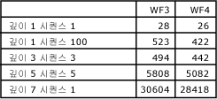  
  
 각 깊이 수준에 따라 워크플로 정의의 작업 수가 급격하게 증가합니다.  그러나 지정된 워크플로에서 결정당 경로 한 개만 실행되기 때문에 실제 작업의 일부만 실행됩니다.  
  
 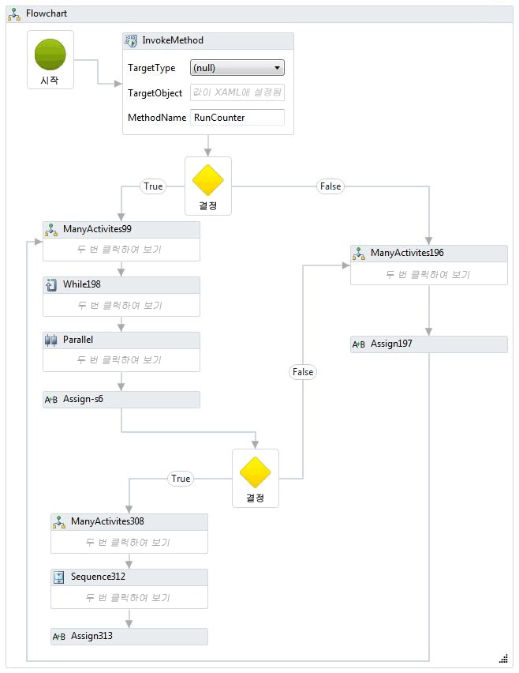  
  
 WF3에 대해 동등한 워크플로가 생성되었습니다. WF3 디자이너는 중첩하지 않고 전체 워크플로를 디자인 영역에 표시하기 때문에 이 항목에서 표시하기에 너무 큽니다. 워크플로의 코드 조각은 다음과 같습니다.  
  
 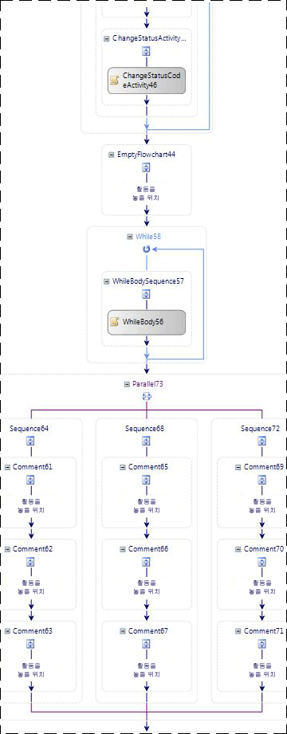  
  
 극단적인 사례에서 중첩을 연습하기 위해 이 테스트에 포함된 다른 워크플로에서는 중첩된 시퀀스 100개를 사용합니다.  가장 안쪽의 시퀀스에는 `Comment` 또는 <xref:System.Workflow.Activities.CodeActivity> 한 개가 있습니다.  
  
 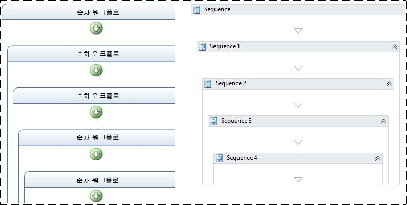  
  
 추적 및 지속성은 이 테스트의 일부로 사용되지 않습니다.  
  
### <a name="test-results"></a>테스트 결과  
 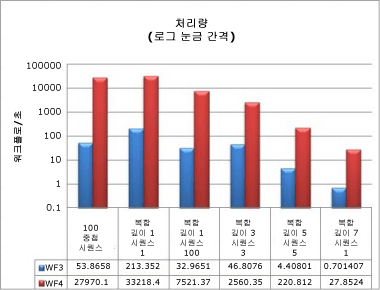  
  
 많은 깊이와 다수의 작업이 포함된 복잡한 워크플로에서도 성능 결과는 이 문서의 앞부분에 표시된 다른 처리량 수치와 일관됩니다.  WF4의 처리량은 몇 배나 더 빠르며 로그 눈금으로 비교해야 합니다.  
  
### <a name="memory"></a>메모리  
 Windows Workflow Foundation의 메모리 오버헤드는 워크플로 복잡성과 워크플로 정의 수의 두 가지 주요 영역에서 측정됩니다.  메모리 측정은 Windows 7 64비트 워크스테이션에서 수행되었습니다.  여러 가지 작업 집합 크기 성능 카운터를 모니터링, Environment.WorkingSet 폴링에서 사용 가능한 VMMap와 같은 도구를 사용 하 여 등의 [VMMap](http://technet.microsoft.com/sysinternals/dd535533.aspx)합니다. 각 테스트의 결과를 얻고 확인하기 위해 여러 방법의 조합이 사용되었습니다.  
  
### <a name="workflow-complexity-test"></a>워크플로 복잡성 테스트  
 워크플로 복잡성 테스트는 워크플로 복잡성을 기준으로 작업 집합 차이를 측정합니다.  이전 단원에서 사용된 복잡한 워크플로 외에도 단일 작업 워크플로 및 1000개 작업이 포함된 시퀀스의 두 가지 기본 사례를 다루기 위해 새 변형이 추가되었습니다.  이러한 테스트에서 워크플로는 완료될 때까지 1분 동안 단일 직렬 루프로 초기화 및 실행됩니다.  각 테스트 변형이 3회 실행되고 기록되는 데이터는 3회 실행의 평균입니다.  
  
 새 기본 테스트 2개에는 다음과 같은 워크플로가 있습니다.  
  
 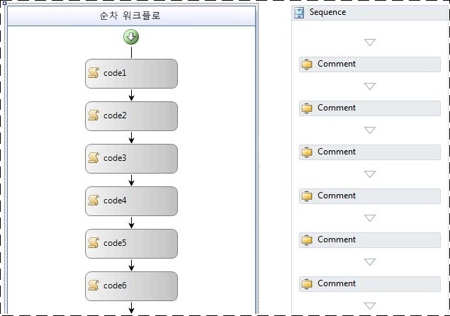  
  
 위에 표시된 WF3 워크플로에서는 비어 있는 <xref:System.Workflow.Activities.CodeActivity> 작업이 사용됩니다.  위의 WF4 워크플로는 `Comment` 작업을 사용합니다.  `Comment` 작업은 이 문서의 앞부분에 있는 구성 요소 수준 성능 비교 단원에서 설명되었습니다.  
  
   
  
 이 그래프에서 확인할 명확한 추세 중 하나는 WF3과 WF4에서 모두 중첩이 메모리 사용에 미치는 영향이 비교적 최소화된다는 것입니다.  가장 중요한 메모리 영향은 지정된 워크플로의 작업 수에서 비롯됩니다.  시퀀스 1000, 복잡한 깊이 5 시퀀스 5 및 복잡한 깊이 7 시퀀스 1 변형의 데이터가 주어질 경우 작업 수가 수천 개로 늘어나면 메모리 사용 증가가 더 두드러집니다.  ~29K 작업이 있는 극단적인 사례(깊이 7 시퀀스 1)에서 WF4는 WF3보다 거의 79% 더 적은 메모리를 사용합니다.  
  
### <a name="multiple-workflow-definitions-test"></a>여러 워크플로 정의 테스트  
 WF3 및 WF4에서 워크플로를 호스트하는 데 사용 가능한 옵션 때문에 워크플로 정의당 메모리 측정은 두 가지 테스트로 나뉩니다.  이러한 테스트는 지정된 워크플로가 정의당 한 번만 인스턴스화되고 실행된다는 점에서 워크플로 복잡성 테스트와는 다른 방식으로 실행됩니다.  워크플로 정의와 해당 호스트가 AppDomain 수명 동안 메모리에 남아 있기 때문입니다.  지정된 워크플로 인스턴스를 실행할 때 사용된 메모리를 가비지 수집 중에 정리해야 합니다.  호스팅 옵션에 대한 자세한 내용은 WF4에 대한 마이그레이션 지침을 참조하세요. 자세한 내용은 참조 [WF 마이그레이션 쿡 북: 워크플로 호스팅](http://go.microsoft.com/fwlink/?LinkID=153313)합니다.  
  
 여러 가지 방법으로 워크플로 정의 테스트에 사용할 많은 워크플로 정의를 만들 수 있습니다.  예를 들어, 코드 생성을 사용하여 이름만 제외하고 모두 동일한 1000개 워크플로 집합을 만들고 각 워크플로를 개별 파일에 저장할 수 있습니다.  이 방법은 콘솔 호스팅 테스트에 사용되었습니다.  WF3에서는 워크플로 정의를 실행하기 위해 <xref:System.Workflow.Runtime.WorkflowRuntime> 클래스가 사용되었습니다.  WF4는 <xref:System.Activities.WorkflowApplication>을 사용하여 단일 워크플로 인스턴스를 만들거나 직접 <xref:System.Activities.WorkflowInvoker>를 사용하여 메서드 호출인 것처럼 작업을 실행할 수 있습니다.  <xref:System.Activities.WorkflowApplication>은 단일 워크플로 인스턴스의 호스트이며 기능 패리티가 <xref:System.Workflow.Runtime.WorkflowRuntime>에 더 가깝기 때문에 이 테스트에서는 이 클래스가 사용되었습니다.  
  
 IIS에서 워크플로를 호스트하는 경우 XAMLX 또는 XOML 파일을 모두 생성하는 대신 <xref:System.Web.Hosting.VirtualPathProvider>를 사용하여 새 <xref:System.ServiceModel.WorkflowServiceHost>를 만들 수 있습니다.  <xref:System.Web.Hosting.VirtualPathProvider> 들어오는 요청을 처리 하 고 "가상 파일" 또는 될 수 있는 데이터베이스에서 로드,이 경우 즉석에서 생성을 사용 하 여 응답 합니다.  따라서 실제 파일 1000개를 만들 필요는 없습니다.  
  
 콘솔 테스트에서 사용된 워크플로 정의는 단일 작업이 포함된 단순한 순차 워크플로였습니다.  단일 작업은 WF3 사례의 경우 비어 있는 <xref:System.Workflow.Activities.CodeActivity>이고 WF4 사례의 경우 `Comment` 작업이었습니다.  IIS 호스팅 사례에서는 메시지 수신에서 시작되고 회신 전송에서 끝나는 워크플로를 사용했습니다.  
  
 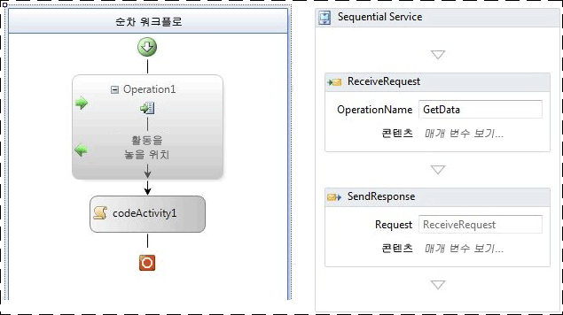  
  
 그림 4 – ReceiveActivity가 포함된 WF3 워크플로 및 요청/응답 패턴이 포함된 WF4 워크플로  
  
 아래 표에서는 단일 워크플로 정의와 1001개 정의 간의 작업 집합 델타를 보여 줍니다.  
  
|호스팅 옵션|WF3 작업 집합 델타|WF4 작업 집합 델타|  
|---------------------|---------------------------|---------------------------|  
|콘솔 응용 프로그램 호스트 워크플로|18 MB|9 MB|  
|IIS 호스트 워크플로 서비스|446 MB|364 MB|  
  
 IIS에서 워크플로 정의를 호스트하는 경우 <xref:System.ServiceModel.WorkflowServiceHost>, 자세한 [!INCLUDE[indigo2](../../../includes/indigo2-md.md)] 서비스 아티팩트 및 호스트와 연결된 메시지 처리 논리로 인해 메모리가 훨씬 많이 사용됩니다.  
  
 WF3의 콘솔 호스팅에서는 워크플로가 XOML 대신 코드로 구현되었습니다.  WF4에서는 XAML을 사용하는 것이 기본값입니다.  XAML은 어셈블리에 포함된 리소스로 저장되며 런타임 중에 컴파일되어 워크플로 구현을 제공합니다.  이 프로세스와 연결된 약간의 오버헤드가 있습니다.  WF3과 WF4의 공정한 비교를 위해 XAML 대신 코딩된 워크플로가 사용되었습니다.  다음은 WF4 워크플로 중 하나의 예제입니다.  
  
```  
public class Workflow1 : Activity  
{  
    protected override Func<Activity> Implementation  
    {  
        get  
        {  
            return new Func<Activity>(() =>  
            {  
                return new Sequence  
                {  
                    Activities = {  
                        new Comment()  
                    }  
                };  
            });  
        }  
        set  
        {  
            base.Implementation = value;  
        }  
    }  
}  
```  
  
 메모리 사용에 영향을 줄 수 있는 다른 여러 요인이 있습니다. 관리되는 모든 프로그램에 대한 동일한 조언이 여전히 적용됩니다.  IIS 호스팅 환경에서는 워크플로 정의에 대해 생성된 <xref:System.ServiceModel.WorkflowServiceHost> 개체가 응용 프로그램 풀이 재생될 때까지 메모리에 남아 있습니다.  확장을 작성할 때 이 점을 염두에 두어야 합니다.  또한 "전역" 변수 (전체 워크플로가 범위로 지정 된 변수) 하지 않도록 하 고 가능한 경우 변수의 범위를 제한 하는 것이 좋습니다.  
  
## <a name="workflow-runtime-services"></a>워크플로 런타임 서비스  
  
### <a name="persistence"></a>지속성  
 WF3과 WF4에는 모두 SQL 지속성 공급자가 포함되어 있습니다.  WF3 SQL 지속성 공급자는 워크플로 인스턴스를 serialize(직렬화)하고 blob에 저장하는 간단한 구현입니다.  이런 이유로 이 공급자의 성능은 워크플로 인스턴스의 크기에 따라 달라집니다.  이 문서의 앞부분에서 설명했듯이 WF3에서는 인스턴스 크기가 여러 이유로 증가할 수 있었습니다.  serialize(직렬화)된 인스턴스를 데이터베이스에 저장할 경우 워크플로 상태가 표시되지 않으므로 기본 SQL 지속성 공급자를 사용하지 않는 고객이 많습니다.  워크플로 ID를 모르고 특정 워크플로를 찾으려면 유지된 각 인스턴스를 deserialize(역직렬화)하고 콘텐츠를 검사해야 합니다.  이러한 장애를 극복하기 위해 고유한 지속성 공급자를 작성하는 개발자가 많습니다.  
  
 WF4 SQL 지속성 공급자는 이러한 문제 중 일부를 해결하려고 했습니다.  지속성 테이블에는 활성 책갈피, 수준을 올릴 수 있는 속성 등의 특정 정보가 노출됩니다.  WF4의 새 콘텐츠 기반 상관 관계 기능은 유지된 워크플로 인스턴스의 구성을 일부 변경한 WF3 SQL 지속성 방법에서는 제대로 수행되지 않습니다.  이로 인해 지속성 공급자의 작업이 더 복잡해지며 데이터베이스에 추가 부담을 주게 됩니다.  
  
### <a name="environment-setup"></a>환경 설치  
   
  
### <a name="test-setup"></a>테스트 설치  
 향상된 기능 집합과 보다 효율적인 동시성 처리 외에도 WF4의 SQL 지속성 공급자는 WF3의 공급자보다 더 빠릅니다.  속도 차이를 보여 주기 위해 WF3과 WF4에서 본질적으로 동일한 작업을 수행하는 워크플로 두 개의 비교 결과가 아래에 나와 있습니다.  
  
 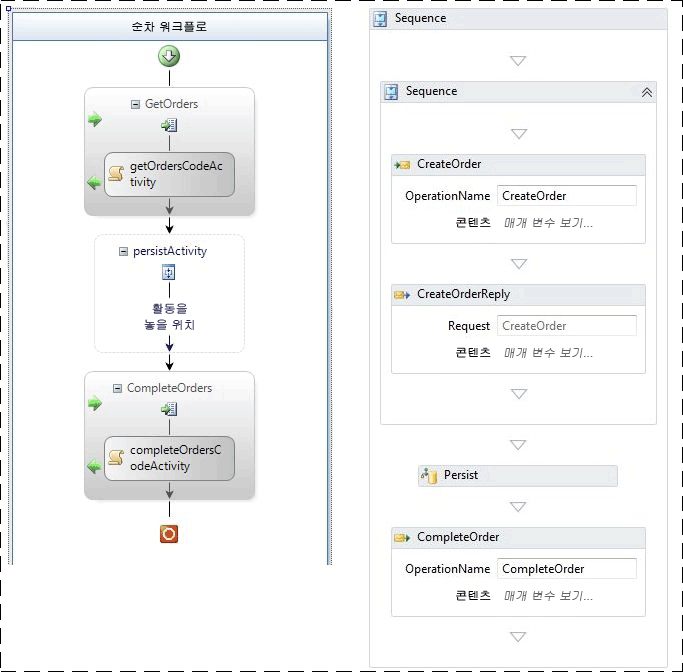  
  
 그림 5 - WF3(왼쪽) 및 WF4(오른쪽)의 지속성 워크플로  
  
 두 워크플로는 모두 받은 메시지에 의해 생성됩니다.  초기 회신을 보낸 후 워크플로가 유지됩니다.  WF3 사례에서는 비어 있는 <xref:System.Workflow.ComponentModel.TransactionScopeActivity>를 사용하여 지속성을 시작합니다.  동일한 결과 얻을 수도 w f 3에서 "닫을 때 유지"으로 활동을 표시 하 여  연결된 두 번째 메시지가 워크플로를 완료합니다.  워크플로는 유지되고 언로드되지 않습니다.  
  
### <a name="test-results"></a>테스트 결과  
 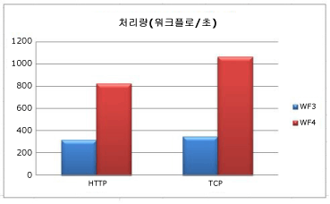  
  
 클라이언트와 중간 계층 간의 전송이 HTTP인 경우 WF4의 지속성이 2.6배 향상됩니다.  TCP 전송을 사용할 경우 해당 비율이 3.0배로 증가합니다.  모든 사례에서 중간 계층의 CPU 사용률은 98% 이상입니다.  WF4 처리량이 더 많은 이유는 워크플로 런타임이 더 빠르기 때문입니다.  serialize(직렬화)된 인스턴스 크기는 두 사례에서 모두 작으며 이러한 상황에서 주요 영향 요인이 아닙니다.  
  
 이 테스트의 WF3 및 WF4 워크플로는 모두 작업을 사용하여 지속성이 발생해야 하는 시기를 명시적으로 표시합니다.  이렇게 하면 워크플로를 언로드하지 않고 유지할 수 있는 이점이 있습니다.  WF3에서는 <xref:System.ServiceModel.Activities.Description.WorkflowIdleBehavior.TimeToUnload%2A> 기능을 사용하여 유지할 수도 있지만 이 경우 워크플로 인스턴스가 메모리에서 언로드됩니다.  WF3을 사용하는 개발자가 특정 지점에서 워크플로를 유지하려는 경우 워크플로 정의를 변경하거나 워크플로 인스턴스를 언로드한 후 다시 로드해야 합니다.  WF4의 새로운 기능인 <xref:System.ServiceModel.Activities.Description.WorkflowIdleBehavior.TimeToPersist%2A>를 사용하면 언로드하지 않고 유지할 수 있습니다.  이 기능을 통해 유휴 시 워크플로 인스턴스가 유지되고 <xref:System.ServiceModel.Activities.Description.WorkflowIdleBehavior.TimeToUnload%2A> 임계값에 도달하거나 실행이 다시 시작될 때까지 메모리에 남아 있도록 할 수 있습니다.  
  
 WF4 SQL 지속성 공급자는 데이터베이스 계층에서 더 많은 작업을 수행합니다.  SQL 데이터베이스는 병목이 될 수 있으므로 SQL 데이터베이스의 CPU 및 디스크 사용을 모니터링하는 것이 중요합니다.  워크플로 응용 프로그램의 성능을 테스트하는 경우 SQL 데이터베이스의 다음 성능 카운터를 포함해야 합니다.  
  
-   실제 디스크\\% 디스크 읽기 시간  
  
-   실제 디스크\\% Disk Time  
  
-   실제 디스크\\% 디스크 쓰기 시간  
  
-   실제 디스크\\%avg. Disk Queue Length  
  
-   PhysicalDisk\Avg. Disk Read Queue Length  
  
-   PhysicalDisk\Avg. Disk Write Queue Length  
  
-   PhysicalDisk\Current Disk Queue Length  
  
-   프로세서 정보\\% 프로세서 시간  
  
-   SQLServer:Latches\Average Latch Wait Time (ms)  
  
-   SQLServer:Latches\Latch Waits/sec  
  
### <a name="tracking"></a>추적  
 워크플로 추적을 사용하여 워크플로 진행률을 추적할 수 있습니다.  추적 이벤트에 포함되는 정보는 추적 프로필에서 결정됩니다.  추적 프로필이 복잡할수록 추적 비용이 증가합니다.  
  
 WF3에는 SQL 기반 추적 서비스가 포함되어 있었습니다.  이 서비스는 일괄 처리 모드와 비일괄 처리 모드로 작동할 수 있었습니다.  비일괄 처리 모드에서는 추적 이벤트가 데이터베이스에 직접 기록됩니다.  일괄 처리 모드에서는 추적 이벤트가 동일한 일괄 처리에 워크플로 인스턴스 상태로 수집됩니다.  일괄 처리 모드는 광범위한 워크플로 디자인에서 최고 성능을 제공합니다.  그러나 워크플로에서 많은 작업을 유지하지 않고 실행하며 이러한 작업이 추적되는 경우 일괄 처리 시 성능이 저하될 수 있습니다.  이 문제는 대체로 루프에서 발생하며, 이 시나리오를 방지하는 가장 좋은 방법은 지속성 지점이 포함될 큰 루프를 디자인하는 것입니다.  지속성 지점을 루프에 포함하는 경우에도 성능이 저하될 수 있으므로 각 루프의 비용을 측정하고 균형을 이루는 것이 중요합니다.  
  
 WF4에는 SQL 추적 서비스가 포함되어 있지 않습니다.  SQL 데이터베이스에 추적 정보를 기록하는 기능은 [!INCLUDE[dnprdnshort](../../../includes/dnprdnshort-md.md)]에 기본 제공하는 대신 응용 프로그램 서버에서 보다 효율적으로 처리할 수 있습니다. 따라서 이제 AppFabric에서 SQL 추적을 처리합니다.  WF4의 기본 제공 추적 공급자는 ETW(Windows용 이벤트 추적)를 기반으로 합니다.  
  
 ETW는 Windows에 기본 제공되며 대기 시간이 짧은 커널 수준의 이벤트 시스템입니다.  ETW는 실제로 소비자가 있는 경우에만 이벤트 추적 비용을 발생시키는 공급자/소비자 모델을 사용합니다.  프로세서, 디스크, 메모리, 네트워크 사용 등의 커널 이벤트뿐 아니라 많은 응용 프로그램이 ETW도 활용합니다.  응용 프로그램에 맞게 이벤트를 사용자 지정할 수 있다는 점에서 ETW 이벤트는 성능 카운터보다 더 강력합니다.  이벤트에는 워크플로 ID, 정보 메시지 등의 텍스트가 포함될 수 있습니다.  또한 특정 이벤트 하위 집합을 사용할 경우 모든 이벤트를 캡처할 때보다 성능에 미치는 영향이 감소하도록 이벤트가 비트 마스크로 분류됩니다.  
  
 SQL 대신 ETW를 추적에 사용할 경우 다음과 같은 이점이 있습니다.  
  
-   추적 이벤트 수집을 다른 프로세스로 구분할 수 있습니다.  이렇게 하면 이벤트 기록 방법의 유연성이 증가합니다.  
  
-   ETW 추적 이벤트는 [!INCLUDE[indigo2](../../../includes/indigo2-md.md)] ETW 이벤트나 SQL Server 또는 커널 공급자와 같은 다른 ETW 공급자와 쉽게 조합됩니다.  
  
-   워크플로 작성자가 WF3 SQL 추적 서비스의 일괄 처리 모드와 같은 특정 추적 구현에서 보다 효율적으로 작동하도록 워크플로를 변경할 필요가 없습니다.  
  
-   관리자가 호스트 프로세스를 재생하지 않고 추적을 설정하거나 해제할 수 있습니다.  
  
 ETW 추적의 성능 이점에는 단점도 수반됩니다.  시스템의 리소스 부담이 큰 경우 ETW 이벤트가 손실될 수 있습니다.  이벤트 처리는 정상적인 프로그램 실행을 차단하지 않으므로 모든 ETW 이벤트가 해당 구독자에게 브로드캐스트될 것을 보장할 수 없습니다.  이런 이유로 ETW 추적은 상태 모니터링에 유용하지만 감사에는 적합하지 않습니다.  
  
 WF4에는 SQL 추적 공급자가 없지만 AppFabric에는 있습니다.  AppFabric의 SQL 추적 방법은 이벤트를 일괄 처리하고 빠른 삽입용으로 디자인된 SQL 테이블에 쓰는 Windows 서비스를 사용하여 ETW 이벤트를 구독하는 것입니다.  별도의 작업이 이 테이블에서 데이터를 드레이닝한 후 AppFabric 대시보드에서 볼 수 있는 보고 테이블로 개정합니다.  즉, 추적 이벤트의 일괄 처리는 원본 워크플로에 독립적으로 처리되므로 기록되기 전에 지속성 지점을 기다릴 필요가 없습니다.  
  
 logman 또는 xperf와 같은 도구를 사용하여 ETW 이벤트를 기록할 수 있습니다.  xperfview 등의 도구로 압축 ETL 파일을 볼 수 있거나 tracerpt를 사용하여 보다 읽기 쉬운 XML 등의 형식으로 변환할 수 있습니다.  WF3에서 SQL 데이터베이스 없이 추적 이벤트를 가져오는 유일한 옵션은 사용자 지정 추적 서비스를 만드는 것입니다. ETW에 대 한 자세한 내용은 참조 [WCF 서비스와 Windows 용 이벤트 추적](../../../docs/framework/wcf/samples/wcf-services-and-event-tracing-for-windows.md) 및 [Windows 용 이벤트 추적](http://msdn.microsoft.com/library/ff190903.aspx\))합니다.  
  
 워크플로 추적을 사용하도록 설정하면 다양한 수준으로 성능에 영향을 주게 됩니다.  아래 벤치마크에서는 logman 도구를 통해 ETW 추적 이벤트를 사용하고 ETL 파일에 기록합니다.  AppFabric에서의 SQL 추적 비용은 이 문서의 범위를 벗어납니다.  이 벤치마크에는 역시 AppFabric에서 사용된 기본 추적 프로필이 표시됩니다.  상태 모니터링 이벤트만 추적하는 비용도 포함되어 있습니다.  이러한 이벤트는 문제를 해결하고 시스템의 평균 처리량을 확인하는 데 유용합니다.  
  
### <a name="environment-setup"></a>환경 설치  
   
  
### <a name="test-results"></a>테스트 결과  
 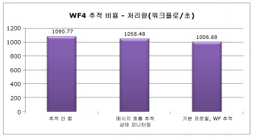  
  
 상태 모니터링은 처리량에 대략 3% 영향을 줍니다.  기본 프로필 비용은 약 8%입니다.  
  
## <a name="interop"></a>Interop  
 WF4는 [!INCLUDE[wf1](../../../includes/wf1-md.md)]에서 거의 완전히 다시 작성되었으므로 WF3 워크플로와 작업은 WF4와 직접 호환되지 않습니다.  W f 3에 대 한 사내 또는 타사 워크플로 정 및 사용자 지정 활동을 초기 Windows Workflow Foundation를 채택한 많은 고객 갖습니다.  WF4로 간단하게 전환하는 방법 중 하나는 WF4 워크플로 내에서 WF3 작업을 실행할 수 있는 Interop 작업을 사용하는 것입니다.  필요한 경우 <xref:System.Activities.Statements.Interop> 작업만 사용하는 것이 좋습니다. W f 4로 마이그레이션에 대 한 자세한 내용은 체크 아웃 된 [WF4 마이그레이션 지침](http://go.microsoft.com/fwlink/?LinkID=153313)합니다.  
  
### <a name="environment-setup"></a>환경 설치  
   
  
### <a name="test-results"></a>테스트 결과  
 다음 표에서는 다양한 구성에서 시퀀스의 5개 작업을 포함하는 워크플로를 실행한 결과를 보여 줍니다.  
  
|테스트|처리량(워크플로/초)|  
|----------|-----------------------------------|  
|WF3 런타임의 WF3 시퀀스|1,576|  
|Interop을 사용하는 WF4 런타임의 WF3 시퀀스|2,745|  
|WF4 시퀀스|153,582|  
  
 직선 WF3을 통해 Interop을 사용할 경우 성능이 훨씬 향상됩니다.  그러나 WF4 작업과 비교할 경우 이러한 증가는 무시될 수 있습니다.  
  
## <a name="summary"></a>요약  
 WF4의 성능에 대한 막대한 투자는 중요한 여러 영역에서 충분한 결실을 맺었습니다.  경우에 따라 개별 워크플로 구성 요소의 성능은 보다 간결한 [!INCLUDE[wf1](../../../includes/wf1-md.md)] 런타임으로 인해 WF3보다 WF4에서 수백 배 더 빠릅니다.  대기 시간 수치도 훨씬 낫습니다.  따라서 [!INCLUDE[wf1](../../../includes/wf1-md.md)] 사용 시의 이점을 고려할 때 직접 코딩된 [!INCLUDE[indigo2](../../../includes/indigo2-md.md)] 오케스트레이션 서비스에 비해 [!INCLUDE[wf1](../../../includes/wf1-md.md)] 사용 시의 성능 비용은 매우 적습니다.  지속성 성능은 2.5-3.0의 비율로 증가했습니다.  이제 워크플로 추적을 통한 상태 모니터링의 오버헤드가 매우 적습니다.  WF3에서 WF4로의 이동을 고려하는 사용자를 위해 포괄적인 마이그레이션 가이드 집합이 제공됩니다.  이러한 모든 특성 때문에 WF4는 복잡한 응용 프로그램을 작성할 때 유용한 옵션이 됩니다.  
  
## <a name="acknowledgements"></a>감사의 글  
 도움을 주신 다음 참가자와 검토자에게 감사 드립니다.  
  
-   Leon Welicki, Microsoft Corporation  
  
-   Ryszard Kwiecinski, Microsoft Corporation  
  
-   Emil Velinov, Microsoft Corporation  
  
-   Nate Talbert, Microsoft Corporation  
  
-   Bob Schmidt, Microsoft Corporation  
  
-   Stefan Batres, Microsoft Corporation
