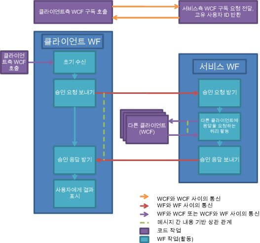

# 문서 승인 프로세스
이 샘플에서는 여러 가지 [!INCLUDE[wf](../../../../includes/wf-md.md)] 및 [!INCLUDE[indigo1](../../../../includes/indigo1-md.md)] 기능을 함께 사용하는 방법을 보여 줍니다. 이 기능들은 문서 승인 프로세스 시나리오를 구현하는 데 함께 사용됩니다. 클라이언트 응용 프로그램은 승인이 필요한 문서를 제출하고 문서를 승인합니다. 클라이언트 사이의 원활한 통신을 지원하고 승인 프로세스의 규칙을 적용하는 데는 승인 관리자 응용 프로그램이 사용됩니다. 승인 프로세스는 여러 가지 유형의 승인을 실행할 수 있는 워크플로입니다. 단일 승인 프로세스, 정족수 승인(승인자 집합의 백분율) 프로세스 및 정족수 승인과 단일 승인이 차례로 이루어지는 복합 승인 프로세스를 처리하기 위하여 각기 다른 활동이 사용됩니다.  
  
> [!IMPORTANT]
>  컴퓨터에 이 샘플이 이미 설치되어 있을 수도 있습니다. 계속하기 전에 다음(기본) 디렉터리를 확인하세요.  
>   
>  `<InstallDrive>:\WF_WCF_Samples`  
>   
>  이 디렉터리가 없으면 [Windows Communication Foundation (WCF) and Windows Workflow Foundation (WF) Samples for .NET Framework 4(.NET Framework 4용 WCF(Windows Communication Foundation) 및 WF(Windows Workflow Foundation) 샘플)](http://go.microsoft.com/fwlink/?LinkId=150780) 로 이동하여 [!INCLUDE[indigo1](../../../../includes/indigo1-md.md)] 및 [!INCLUDE[wf1](../../../../includes/wf1-md.md)] 샘플을 모두 다운로드하세요. 이 샘플은 다음 디렉터리에 있습니다.  
>   
>  `<InstallDrive>:\WF_WCF_Samples\WF\Application\DocumentApprovalProcess`  
  
## 샘플 세부 정보  
 다음 그래픽에서는 문서 승인 프로세스 워크플로를 보여 줍니다.  
  
   
  
 클라이언트측에서 볼 때 승인 프로세스는 다음과 같이 진행됩니다.  
  
1.  승인 프로세스 시스템의 사용자로 클라이언트를 등록합니다.  
  
2.  [!INCLUDE[indigo2](../../../../includes/indigo2-md.md)] 클라이언트에서 승인 관리자 응용 프로그램을 통해 호스트되는 [!INCLUDE[indigo2](../../../../includes/indigo2-md.md)] 서비스로 요청을 보냅니다.  
  
3.  고유한 사용자 ID가 클라이언트로 반환됩니다. 이제 클라이언트가 승인 프로세스에 참가할 수 있습니다.  
  
4.  조인된 클라이언트에서 단일, 정속수 또는 복합 승인 프로세스를 사용하여 승인이 필요한 문서를 보낼 수 있습니다.  
  
5.  클라이언트의 인터페이스 단추를 클릭하면 클라이언트 워크플로 서비스 호스트에서 워크플로 인스턴스가 시작됩니다.  
  
6.  워크플로에서 승인 관리자 응용 프로그램으로 승인 요청을 보냅니다.  
  
7.  워크플로 관리자가 승인 프로세스와 관련된 워크플로를 시작합니다.  
  
8.  관리자가 승인 워크플로를 실행하고 나면 그 결과가 클라이언트로 다시 보내집니다.  
  
9. 클라이언트에 결과가 표시됩니다.  
  
10. 클라이언트가 승인 요청을 받고 언제든지 해당 요청에 응답할 수 있습니다.  
  
11. 클라이언트에 호스트된 [!INCLUDE[indigo2](../../../../includes/indigo2-md.md)] 서비스가 승인 관리자 응용 프로그램으로부터 승인 요청을 받을 수 있습니다.  
  
12. 문서 정보가 검토를 위해 클라이언트에 표시됩니다.  
  
13. 사용자가 문서를 승인하거나 거부할 수 있습니다.  
  
14. [!INCLUDE[indigo2](../../../../includes/indigo2-md.md)] 클라이언트를 통해 승인 응답이 승인 관리자 응용 프로그램으로 다시 보내집니다.  
  
 승인 관리자 응용 프로그램측에서 볼 때 승인 프로세스는 다음과 같이 진행됩니다.  
  
1.  승인 프로세스 시스템에 대한 참가 요청이 클라이언트로부터 전달됩니다.  
  
2.  승인 관리자의 [!INCLUDE[indigo2](../../../../includes/indigo2-md.md)] 서비스가 승인 프로세스 시스템에 참가하고자 하는 클라이언트 요청을 받습니다.  
  
3.  클라이언트를 위한 고유한 ID가 생성됩니다. 사용자 정보가 데이터베이스에 저장됩니다.  
  
4.  고유 ID가 사용자에게 다시 전달됩니다.  
  
5.  승인 요청이 접수됩니다. 승인 관리자가 승인 프로세스를 실행합니다.  
  
6.  승인 관리자가 승인 요청을 받으면 새 워크플로가 시작됩니다.  
  
7.  요청의 유형(단순, 정족수 또는 복합)에 따라 각기 다른 활동이 실행됩니다.  
  
8.  검토할 승인 요청을 클라이언트로 보내고 응답을 받는 데는 상관 관계가 있는 보내기 및 받기 활동이 사용됩니다.  
  
9. 승인 프로세스 워크플로의 결과가 클라이언트로 보내집니다.  
  
## 샘플 사용  
  
##### 데이터베이스를 설정하려면  
  
1.  관리자 권한으로 [!INCLUDE[vs2010](../../../../includes/vs2010-md.md)] 명령 프롬프트 창을 열고 이DocumentApprovalProcess 폴더로 이동한 다음 Setup.cmd를 실행합니다.  
  
##### 응용 프로그램을 설정하려면  
  
1.  [!INCLUDE[vs2010](../../../../includes/vs2010-md.md)]에서 DocumentApprovalProcess.sln 솔루션 파일을 엽니다.  
  
2.  Ctrl+Shift+B를 눌러 솔루션을 빌드합니다.  
  
3.  승인 관리자 응용 프로그램에서 ApprovalManager 프로젝트를 마우스 오른쪽 단추로 클릭 하 여 실행할 솔루션을 실행 하려면는 **솔루션 탐색기** 클릭 하 고 **디버그**->**시작**  오른쪽 클릭 메뉴에서 새 인스턴스.  
  
     실행 준비가 되었다는 관리자의 메시지가 표시될 때까지 기다립니다.  
  
##### 단일 승인 시나리오를 실행하려면  
  
1.  관리자 권한으로 명령 프롬프트를 엽니다.  
  
2.  솔루션이 들어 있는 디렉터리로 이동합니다.  
  
3.  ApprovalClient\Bin\Debug 폴더로 이동하여 ApprovalClient.exe의 두 인스턴스를 실행합니다.  
  
4.  클릭 **검색**, 될 때까지 기다렸다가 **구독** 단추를 사용할 수 있습니다.  
  
5.  사용자 이름을 입력 하 고 클릭 **구독**합니다. 한 클라이언트에는 `UserType1`을 사용하고 다른 클라이언트에는 `UserType2` 형식을 사용합니다.  
  
6.  `UserType1` 클라이언트의 드롭다운 메뉴에서 단일 승인 유형을 선택하고 문서 이름과 콘텐츠를 입력합니다. 클릭 **승인 요청**합니다.  
  
7.  승인을 기다리는 문서가 `UserType2` 클라이언트에 표시됩니다. 선택 하 고 키를 눌러 **승인** 또는 **거부**합니다. `UserType1` 클라이언트에 결과가 표시됩니다.  
  
##### 정족수 승인 시나리오를 실행하려면  
  
1.  관리자 권한으로 명령 프롬프트를 엽니다.  
  
2.  솔루션이 들어 있는 디렉터리로 이동합니다.  
  
3.  ApprovalClient\Bin\Debug 폴더로 이동하여 ApprovalClient.exe의 세 인스턴스를 실행합니다.  
  
4.  클릭 **검색**, 될 때까지 기다렸다가 **구독** 단추를 사용할 수 있습니다.  
  
5.  사용자 이름을 입력 하 고 클릭 **구독**합니다. 한 클라이언트에는 `UserType1`을 사용하고 다른 두 클라이언트에는 `UserType2` 형식을 사용합니다.  
  
6.  `UserType1` 클라이언트의 드롭다운 메뉴에서 정족수 승인 유형을 선택하고 문서 이름과 콘텐츠를 입력합니다. 클릭 **승인 요청**합니다. 이렇게 하면 문서 승인 또는 거부를 필요로 하는 요청이 두 `UserType2` 클라이언트에 전달됩니다. 이 요청에 대해 두 `UserType2` 클라이언트가 모두 응답해야 하지만, 문서를 승인하려면 클라이언트 중 하나만 이를 승인해야 합니다.  
  
7.  승인을 기다리는 문서가 두 `UserType2` 클라이언트에 표시됩니다. 선택 하 고 키를 눌러 **승인** 또는 **거부**합니다. `UserType1` 클라이언트에 결과가 표시됩니다.  
  
##### 복합 승인 시나리오를 실행하려면  
  
1.  관리자 권한으로 명령 프롬프트를 엽니다.  
  
2.  솔루션이 들어 있는 디렉터리로 이동합니다.  
  
3.  ApprovalClient\Bin\Debug 폴더로 이동하여 ApprovalClient.exe의 네 인스턴스를 실행합니다.  
  
4.  클릭 **검색**, 될 때까지 기다렸다가 **구독** 단추를 사용할 수 있습니다.  
  
5.  사용자 이름을 입력 하 고 클릭 **구독**합니다. 한 클라이언트에는 `UserType1`을 사용하고 다른 두 클라이언트에는 `UserType2` 형식을, 마지막 클라이언트에는 `UserType3`을 사용합니다.  
  
6.  `UserType1` 클라이언트의 드롭다운 메뉴에서 단일 승인 유형을 선택하고 문서 이름과 콘텐츠를 입력합니다. 클릭 **승인 요청**합니다.  
  
7.  승인을 기다리는 문서가 두 `UserType2` 클라이언트에 표시됩니다. 선택 하 고 키를 눌러 **승인**, 문서에 전달 되는 `UserType3` 클라이언트입니다.  
  
     첫째 `UserType2` 정족수에서 문서를 승인하면 문서가 `UserType3` 클라이언트로 전달됩니다.  
  
8.  `UserType3` 클라이언트에서 문서를 승인 또는 거부합니다. `UserType1` 클라이언트에 결과가 표시됩니다.  
  
##### 정리하려면  
  
1.  [!INCLUDE[vs2010](../../../../includes/vs2010-md.md)] 명령 프롬프트에서 DocumentApprovalProcess 폴더로 이동하여 Cleanup.cmd를 실행합니다.