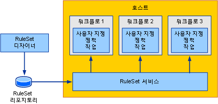
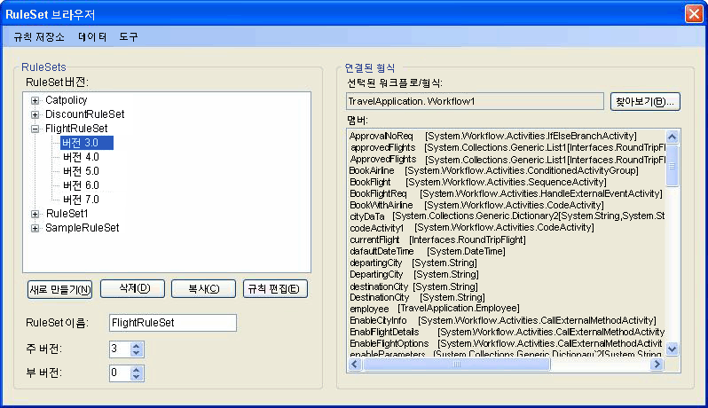
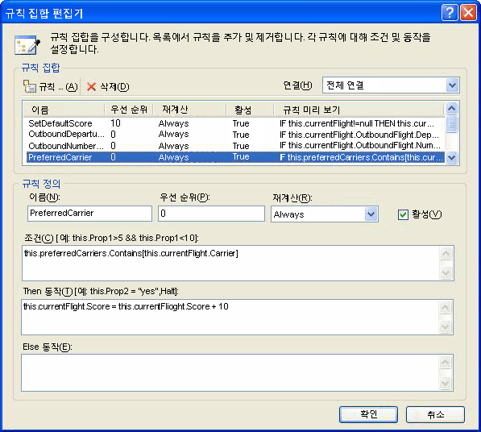
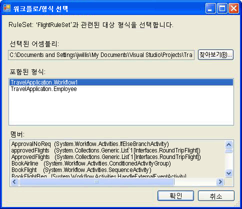
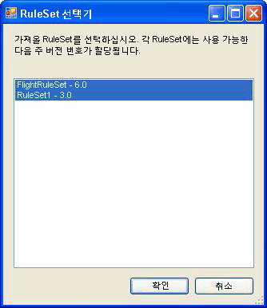

# <a name="external-ruleset-toolkit"></a><span data-ttu-id="a3a9b-102">External RuleSet Toolkit</span><span class="sxs-lookup"><span data-stu-id="a3a9b-102">External Ruleset Toolkit</span></span>
<span data-ttu-id="a3a9b-103">일반적으로 워크플로 응용 프로그램 내에서 규칙이 사용될 경우 해당 규칙은 어셈블리의 일부입니다.</span><span class="sxs-lookup"><span data-stu-id="a3a9b-103">Normally when rules are used within a workflow application, the rules are part of the assembly.</span></span> <span data-ttu-id="a3a9b-104">일부 시나리오에서는 워크플로 어셈블리를 다시 빌드하고 배포하지 않고도 RuleSet을 업데이트할 수 있도록 어셈블리와 별도로 RuleSet을 유지할 수 있습니다.</span><span class="sxs-lookup"><span data-stu-id="a3a9b-104">In some scenarios, you may want to maintain the RuleSets separately from the assembly so that they can be updated without rebuilding and deploying the workflow assembly.</span></span> <span data-ttu-id="a3a9b-105">이 샘플에서는 데이터베이스에 있는 RuleSet을 관리하고 편집하며 런타임에 워크플로에서 이러한 RuleSet에 액세스할 수 있습니다.</span><span class="sxs-lookup"><span data-stu-id="a3a9b-105">This sample allows you to manage and edit RuleSets in a database and access those RuleSets from a workflow at runtime.</span></span> <span data-ttu-id="a3a9b-106">따라서 워크플로 인스턴스를 실행하여 RuleSet 변경 내용을 자동으로 통합할 수 있습니다.</span><span class="sxs-lookup"><span data-stu-id="a3a9b-106">This enables running workflow instances to automatically incorporate RuleSet changes.</span></span>  
  
 <span data-ttu-id="a3a9b-107">External RuleSet Toolkit 샘플에는 데이터베이스에서 RuleSet 버전을 관리하고 편집하는 데 사용할 수 있는 Windows Forms 기반 도구가 포함되어 있으며,</span><span class="sxs-lookup"><span data-stu-id="a3a9b-107">The External RuleSet Toolkit sample contains a Windows Forms-based tool that you can use to manage and edit RuleSet versions in a database.</span></span> <span data-ttu-id="a3a9b-108">해당 규칙을 실행하는 호스트 서비스 및 활동도 포함되어 있습니다.</span><span class="sxs-lookup"><span data-stu-id="a3a9b-108">It also includes an activity and a host service for executing those rules.</span></span>  
  
> [!NOTE]
>  <span data-ttu-id="a3a9b-109">이 샘플을 사용 하려면 [Microsoft SQL Server](http://go.microsoft.com/fwlink/?LinkId=96181)합니다.</span><span class="sxs-lookup"><span data-stu-id="a3a9b-109">This sample requires [Microsoft SQL Server](http://go.microsoft.com/fwlink/?LinkId=96181).</span></span>  
  
 [!INCLUDE[vsprvsext](../../../../includes/vsprvsext-md.md)]<span data-ttu-id="a3a9b-110">에서는 Windows WF(Workflow Foundation)의 일부로 규칙 집합 편집기를 제공합니다.</span><span class="sxs-lookup"><span data-stu-id="a3a9b-110"> provides a RuleSet editor as part of the Windows Workflow Foundation (WF).</span></span> <span data-ttu-id="a3a9b-111">이 편집기는 워크플로의 `Policy` 활동을 두 번 클릭하여 시작할 수 있으며 정의된 RuleSet 개체를 워크플로와 연결된 .rules 파일로 serialize합니다. `Policy` 활동은 워크플로에 대해 RuleSet 인스턴스를 실행합니다.</span><span class="sxs-lookup"><span data-stu-id="a3a9b-111">You can start this editor by double-clicking the `Policy` activity in a workflow; it serializes the defined RuleSet object to the .rules file associated with the workflow (a `Policy` activity runs a RuleSet instance against the workflow).</span></span> <span data-ttu-id="a3a9b-112">.rules 파일은 워크플로 프로젝트를 빌드할 때 리소스로 어셈블리에 컴파일됩니다.</span><span class="sxs-lookup"><span data-stu-id="a3a9b-112">The .rules file is compiled into the assembly as a resource when you build the workflow project.</span></span>  
  
 <span data-ttu-id="a3a9b-113">이 샘플의 구성 요소는 다음과 같습니다.</span><span class="sxs-lookup"><span data-stu-id="a3a9b-113">The components of this sample include:</span></span>  
  
-   <span data-ttu-id="a3a9b-114">데이터베이스에서 RuleSet 버전을 편집하고 관리하는 데 사용할 수 있는 RuleSet 그래픽 사용자 인터페이스</span><span class="sxs-lookup"><span data-stu-id="a3a9b-114">A RuleSet graphical user interface tool that you can use to edit and manage RuleSet versions in the database.</span></span>  
  
-   <span data-ttu-id="a3a9b-115">호스트 응용 프로그램에서 구성되고 데이터베이스에서 RuleSet에 액세스하는 RuleSet 서비스</span><span class="sxs-lookup"><span data-stu-id="a3a9b-115">A RuleSet service that is configured on the host application and accesses RuleSets from the database.</span></span>  
  
-   <span data-ttu-id="a3a9b-116">RuleSet 서비스에서 RuleSet을 요청하고 워크플로에 대해 RuleSet을 실행하는 `ExternalPolicy` 활동</span><span class="sxs-lookup"><span data-stu-id="a3a9b-116">An `ExternalPolicy` activity that requests a RuleSet from the RuleSet service and runs the RuleSet against the workflow.</span></span>  
  
 <span data-ttu-id="a3a9b-117">그림 1에서는 구성 요소가 어떻게 상호 작용하는지 보여 줍니다.</span><span class="sxs-lookup"><span data-stu-id="a3a9b-117">The interaction of the components is shown in Figure 1.</span></span> <span data-ttu-id="a3a9b-118">그 뒤에 나오는 단원에서는 각 구성 요소에 대해 설명합니다.</span><span class="sxs-lookup"><span data-stu-id="a3a9b-118">The sections that follow describe each component.</span></span>  
  
 <span data-ttu-id="a3a9b-119"></span><span class="sxs-lookup"><span data-stu-id="a3a9b-119"></span></span>  
  
 <span data-ttu-id="a3a9b-120">그림 1: 샘플 개요</span><span class="sxs-lookup"><span data-stu-id="a3a9b-120">Figure 1: Sample Overview</span></span>  
  
> [!IMPORTANT]
>  <span data-ttu-id="a3a9b-121">컴퓨터에 이 샘플이 이미 설치되어 있을 수도 있습니다.</span><span class="sxs-lookup"><span data-stu-id="a3a9b-121">The samples may already be installed on your machine.</span></span> <span data-ttu-id="a3a9b-122">계속하기 전에 다음(기본) 디렉터리를 확인하세요.</span><span class="sxs-lookup"><span data-stu-id="a3a9b-122">Check for the following (default) directory before continuing.</span></span>  
>   
>  `<InstallDrive>:\WF_WCF_Samples`  
>   
>  <span data-ttu-id="a3a9b-123">이 디렉터리가로 이동 [Windows Communication Foundation (WCF) 및.NET Framework 4에 대 한 Windows WF (Workflow Foundation) 샘플](http://go.microsoft.com/fwlink/?LinkId=150780) 모든 Windows Communication Foundation (WCF)를 다운로드 하 고 [!INCLUDE[wf1](../../../../includes/wf1-md.md)] 샘플.</span><span class="sxs-lookup"><span data-stu-id="a3a9b-123">If this directory does not exist, go to [Windows Communication Foundation (WCF) and Windows Workflow Foundation (WF) Samples for .NET Framework 4](http://go.microsoft.com/fwlink/?LinkId=150780) to download all Windows Communication Foundation (WCF) and [!INCLUDE[wf1](../../../../includes/wf1-md.md)] samples.</span></span> <span data-ttu-id="a3a9b-124">이 샘플은 다음 디렉터리에 있습니다.</span><span class="sxs-lookup"><span data-stu-id="a3a9b-124">This sample is located in the following directory.</span></span>  
>   
>  `<InstallDrive>:\WF_WCF_Samples\WF\Scenario\ExternalRuleSetToolKit`  
  
## <a name="ruleset-tool"></a><span data-ttu-id="a3a9b-125">RuleSet 도구</span><span class="sxs-lookup"><span data-stu-id="a3a9b-125">RuleSet Tool</span></span>  
 <span data-ttu-id="a3a9b-126">그림 2에는 RuleSet 도구의 스크린 샷이 나와 있습니다.</span><span class="sxs-lookup"><span data-stu-id="a3a9b-126">A screen shot of the RuleSet tool is shown in Figure 2.</span></span> <span data-ttu-id="a3a9b-127">**규칙 저장소** 메뉴를 데이터베이스에서 사용 가능한 Ruleset을 로드 하 고 수정 된 Ruleset을 저장소에 다시 저장할 수 있습니다.</span><span class="sxs-lookup"><span data-stu-id="a3a9b-127">From the **Rule Store** menu, you can load the available RuleSets from the database and save modified RuleSets back to the store.</span></span> <span data-ttu-id="a3a9b-128">응용 프로그램 구성 파일에서는 RuleSet 데이터베이스에 대한 데이터베이스 연결 문자열을 제공합니다.</span><span class="sxs-lookup"><span data-stu-id="a3a9b-128">An application configuration file provides a database connection string for the RuleSet database.</span></span> <span data-ttu-id="a3a9b-129">도구를 시작하면 구성된 데이터베이스에서 RuleSet이 자동으로 로드됩니다.</span><span class="sxs-lookup"><span data-stu-id="a3a9b-129">When you start the tool, it automatically loads the RuleSets from the configured database.</span></span>  
  
 <span data-ttu-id="a3a9b-130"></span><span class="sxs-lookup"><span data-stu-id="a3a9b-130"></span></span>  
  
 <span data-ttu-id="a3a9b-131">그림 2: RuleSet 브라우저</span><span class="sxs-lookup"><span data-stu-id="a3a9b-131">Figure 2: RuleSet Browser</span></span>  
  
 <span data-ttu-id="a3a9b-132">RuleSet 도구에서는 RuleSet에 주 버전 및 부 버전 번호를 적용하여 동시에 여러 버전을 유지하고 저장할 수 있게 합니다. 이 도구에서는 버전 관리 기능 이외에 잠금이나 기타 구성 관리 기능을 제공하지 않습니다.</span><span class="sxs-lookup"><span data-stu-id="a3a9b-132">The RuleSet tool applies major and minor version numbers to the RuleSets, allowing you to simultaneously maintain and store multiple versions (the tool provides no locking or other configuration management features in addition to the versioning capability).</span></span> <span data-ttu-id="a3a9b-133">이 도구를 사용하여 새 RuleSet 버전을 만들거나 기존 버전을 삭제할 수 있습니다.</span><span class="sxs-lookup"><span data-stu-id="a3a9b-133">Using the tool, you can create new RuleSet versions or delete existing versions.</span></span> <span data-ttu-id="a3a9b-134">클릭할 때 **새로**, 도구에서 새 RuleSet 이름을 만들고 버전 1.0에 적용 합니다.</span><span class="sxs-lookup"><span data-stu-id="a3a9b-134">When you click **New**, the tool creates a new RuleSet name and applies version 1.0.</span></span> <span data-ttu-id="a3a9b-135">버전을 복사하면 도구에서 포함된 규칙을 비롯하여 선택한 RuleSet 버전의 복사본을 만들고 고유한 새 버전 번호를 할당합니다.</span><span class="sxs-lookup"><span data-stu-id="a3a9b-135">When you copy a version, the tool creates a copy of the selected RuleSet version, including the contained rules, and assigns new, unique version numbers.</span></span> <span data-ttu-id="a3a9b-136">이러한 버전 번호는 기존 RuleSet의 버전 번호를 기반으로 합니다.</span><span class="sxs-lookup"><span data-stu-id="a3a9b-136">These version numbers are based on the version numbers of existing RuleSets.</span></span> <span data-ttu-id="a3a9b-137">양식에서 연결된 필드를 사용하여 RuleSet 이름 및 버전 번호를 변경할 수 있습니다.</span><span class="sxs-lookup"><span data-stu-id="a3a9b-137">You can change the RuleSet name and version numbers using the associated fields on the form.</span></span>  
  
 <span data-ttu-id="a3a9b-138">클릭할 때 **규칙 편집**, 그림 3에 나와 있는 것 처럼 규칙 집합 편집기가 시작 합니다.</span><span class="sxs-lookup"><span data-stu-id="a3a9b-138">When you click **Edit Rules**, the RuleSet editor starts, as shown in Figure 3.</span></span>  
  
 <span data-ttu-id="a3a9b-139"></span><span class="sxs-lookup"><span data-stu-id="a3a9b-139"></span></span>  
  
 <span data-ttu-id="a3a9b-140">그림 3: RuleSet 편집기</span><span class="sxs-lookup"><span data-stu-id="a3a9b-140">Figure 3: RuleSet Editor</span></span>  
  
 <span data-ttu-id="a3a9b-141">Windows Workflow Foundation에 대 한 Visual Studio 추가 기능의 일부인 편집기 대화 상자를 다시 호스트입니다.</span><span class="sxs-lookup"><span data-stu-id="a3a9b-141">This is a re-hosting of the editor dialog that is part of the Windows Workflow Foundation Visual Studio add-in.</span></span> <span data-ttu-id="a3a9b-142">Intellisense 지원을 비롯하여 편집기 대화 상자와 동일한 기능을 제공합니다.</span><span class="sxs-lookup"><span data-stu-id="a3a9b-142">It provides the same functionality, including Intellisense support.</span></span> <span data-ttu-id="a3a9b-143">도구; RuleSet과 연결 되는 대상 형식 (예: 워크플로)에 대해 규칙 작성 클릭할 때 **찾아보기** 주 도구 대화 상자에는 **워크플로/형식 선택기** 그림 4에 나와 있는 것 처럼 대화 상자가 나타납니다.</span><span class="sxs-lookup"><span data-stu-id="a3a9b-143">The rules are authored against a target type (such as a workflow) that is associated with the RuleSet in the tool; when you click **Browse** in the main tool dialog, the **Workflow/Type Selector** dialog appears, as shown in Figure 4.</span></span>  
  
 <span data-ttu-id="a3a9b-144"></span><span class="sxs-lookup"><span data-stu-id="a3a9b-144"></span></span>  
  
 <span data-ttu-id="a3a9b-145">그림 4: 워크플로/형식 선택기</span><span class="sxs-lookup"><span data-stu-id="a3a9b-145">Figure 4: Workflow/Type Selector</span></span>  
  
 <span data-ttu-id="a3a9b-146">사용할 수는 **워크플로/형식 선택기** 어셈블리 및 해당 어셈블리 내에서 특정 형식을 지정 하는 대화입니다.</span><span class="sxs-lookup"><span data-stu-id="a3a9b-146">You can use the **Workflow/Type Selector** dialog to specify an assembly and a specific type within that assembly.</span></span> <span data-ttu-id="a3a9b-147">이 형식은 규칙이 제작 및 실행되는 대상 형식입니다.</span><span class="sxs-lookup"><span data-stu-id="a3a9b-147">This type is the target type against which the rules are authored (and run).</span></span> <span data-ttu-id="a3a9b-148">대부분의 경우 대상 형식은 워크플로나 다른 활동 형식입니다.</span><span class="sxs-lookup"><span data-stu-id="a3a9b-148">In many cases, the target type is a workflow or some other activity type.</span></span> <span data-ttu-id="a3a9b-149">그러나 .NET 형식에 대해 RuleSet을 실행할 수 있습니다.</span><span class="sxs-lookup"><span data-stu-id="a3a9b-149">However, you can run a RuleSet against any .NET type.</span></span>  
  
 <span data-ttu-id="a3a9b-150">어셈블리 파일 및 형식에 대 한 경로 `name are stored with the` 데이터베이스에서 RuleSet을 하는 데이터베이스에서 RuleSet 검색 되는 경우이 도구를 로드 하려고 시도 자동으로 대상 형식입니다.</span><span class="sxs-lookup"><span data-stu-id="a3a9b-150">The path to the assembly file and the type `name are stored with the` RuleSet in the database, so that when the RuleSet is retrieved from the database, the tool attempts to automatically load the target type.</span></span>  
  
 <span data-ttu-id="a3a9b-151">클릭할 때 **확인** 에 **워크플로/형식 선택기** 대화 상자에서 유효성을 검사할 대상 유형 규칙에서 참조 하는 모든 멤버에 있는지 확인 하는 규칙 집합에 대해 선택한 형식입니다.</span><span class="sxs-lookup"><span data-stu-id="a3a9b-151">When you click **OK** in the **Workflow/Type Selector** dialog, it validates the selected type against the RuleSet, to ensure that the target type has all the members referenced by the rules.</span></span> <span data-ttu-id="a3a9b-152">오류에 표시 되는 **유효성 검사 오류** 대화 상자 (그림 5 참조).</span><span class="sxs-lookup"><span data-stu-id="a3a9b-152">Errors are shown in a **Validation Errors** dialog (see Figure 5).</span></span> <span data-ttu-id="a3a9b-153">계속 하려면는 오류가 발생 해도 변경 하거나 클릭 하 여 선택할 수 있습니다 **취소**합니다.</span><span class="sxs-lookup"><span data-stu-id="a3a9b-153">You can choose to continue with the change despite the errors, or click **Cancel**.</span></span> <span data-ttu-id="a3a9b-154">**도구** 주 도구 대화 상자에서 메뉴를 클릭할 수 있는 **유효성 검사** 유효성을 다시 대상 활동에 대해 RuleSet 버전을 검사 합니다.</span><span class="sxs-lookup"><span data-stu-id="a3a9b-154">From the **Tools** menu in the main tool dialog, you can click **Validate** to re-validate the RuleSet version against the target activity.</span></span>  
  
 <span data-ttu-id="a3a9b-155"></span><span class="sxs-lookup"><span data-stu-id="a3a9b-155"></span></span>  
  
 <span data-ttu-id="a3a9b-156">그림 5: 유효성 검사 오류</span><span class="sxs-lookup"><span data-stu-id="a3a9b-156">Figure 5: Validation Errors</span></span>  
  
 <span data-ttu-id="a3a9b-157">**데이터** 메뉴 도구에서 가져올을 규칙 집합을 내보낼 수 있습니다.</span><span class="sxs-lookup"><span data-stu-id="a3a9b-157">From the **Data** menu in the tool, you can import and export RuleSets.</span></span> <span data-ttu-id="a3a9b-158">클릭할 때 **가져오기**,.rules 파일을 선택할 수 있는, 파일 선택 대화 상자가 나타납니다.</span><span class="sxs-lookup"><span data-stu-id="a3a9b-158">When you click **Import**, a file-chooser dialog appears, from which you can select a .rules file.</span></span> <span data-ttu-id="a3a9b-159">있거나 처음에 Visual Studio에서 만든 파일이 아닐 수도 있습니다.</span><span class="sxs-lookup"><span data-stu-id="a3a9b-159">This may or may not be a file initially created in Visual Studio.</span></span> <span data-ttu-id="a3a9b-160">.rules 파일에는 조건 컬렉션과 RuleSet 컬렉션을 포함하는 serialize된 `RuleDefinitions` 인스턴스가 포함되어야 합니다.</span><span class="sxs-lookup"><span data-stu-id="a3a9b-160">The .rules file should contain a serialized `RuleDefinitions` instance that contains a collection of conditions and a collection of RuleSets.</span></span> <span data-ttu-id="a3a9b-161">도구에서는 조건 컬렉션을 사용 하지 않지만 사용 된 `RuleDefinitions` .rules 형식을 Visual Studio 환경과 상호 작용을 허용 합니다.</span><span class="sxs-lookup"><span data-stu-id="a3a9b-161">The tool does not use the conditions collection, but it does use the `RuleDefinitions` .rules format to allow interaction with the Visual Studio environment.</span></span>  
  
 <span data-ttu-id="a3a9b-162">.Rules 파일을 선택한 후는 **RuleSet 선택기** (그림 6 참조) 대화 상자가 나타납니다.</span><span class="sxs-lookup"><span data-stu-id="a3a9b-162">After selecting a .rules file, a **RuleSet Selector** dialog appears (see Figure 6).</span></span> <span data-ttu-id="a3a9b-163">이 대화 상자를 사용하여 파일에서 가져올 RuleSet을 선택할 수 있습니다. 기본적으로 모든 RuleSet으로 지정되어 있습니다.</span><span class="sxs-lookup"><span data-stu-id="a3a9b-163">You can use the dialog to select the RuleSets from the file that you want to import (the default specifies all RuleSets).</span></span> <span data-ttu-id="a3a9b-164">WF 프로젝트 내의 버전 관리는 어셈블리의 버전과 동일하기 때문에 .rules 파일의 RuleSet에는 버전 번호가 없습니다.</span><span class="sxs-lookup"><span data-stu-id="a3a9b-164">RuleSets in the .rules file do not have version numbers, because their versioning within a WF project is the same as the version of the assembly.</span></span> <span data-ttu-id="a3a9b-165">가져오기 프로세스 도중 도구가 자동으로 할당 (있으며 사용자가 가져온 후 변경할 수 있습니다) 다음 사용 가능한 주 버전 번호. 에 할당 된 버전 번호를 볼 수는 **RuleSet 선택기** 목록입니다.</span><span class="sxs-lookup"><span data-stu-id="a3a9b-165">During the importing process, the tool automatically assigns the next available major version number (which you can change after importing); you can see the assigned version numbers in the **RuleSet Selector** list.</span></span>  
  
 <span data-ttu-id="a3a9b-166">도구는 가져오는 각 RuleSet에 대해 RuleSet에 사용된 멤버를 기반으로 .rules 파일(있는 경우)의 위치 아래에 있는 bin\Debug 폴더에서 연결된 형식을 찾으려고 합니다.</span><span class="sxs-lookup"><span data-stu-id="a3a9b-166">For each RuleSet it imports, the tool attempts to locate the associated type from the bin\Debug folder under the location of the .rules file (if it exists), based on the members used in the RuleSet.</span></span> <span data-ttu-id="a3a9b-167">RuleSet 도구에서 일치하는 형식을 여러 개 찾으면 .rules 파일 이름과 형식 이름이 일치하는 형식을 선택하려고 합니다. 예를 들어 `Workflow1` 형식은 Workflow1.rules에 대응합니다.</span><span class="sxs-lookup"><span data-stu-id="a3a9b-167">If the tool finds multiple matching types, it attempts to choose a type based on a match between the .rules file name and the type name (for example, the `Workflow1` type corresponds to Workflow1.rules).</span></span> <span data-ttu-id="a3a9b-168">일치하는 항목이 여러 개 있으면 형식을 선택하라는 메시지가 표시됩니다.</span><span class="sxs-lookup"><span data-stu-id="a3a9b-168">If multiple matches exist, you are prompted to select the type.</span></span> <span data-ttu-id="a3a9b-169">이 자동 식별 메커니즘을 일치 하는 어셈블리나 형식을 찾지 못하는 경우 가져온 후 클릭할 수 있는 **찾아보기** 연결된 된 형식으로 이동 하는 주 도구 대화 상자에 있습니다.</span><span class="sxs-lookup"><span data-stu-id="a3a9b-169">If this auto-identification mechanism fails to locate a matching assembly or type, then after importing you can click **Browse** on the main tool dialog to navigate to the associated type.</span></span>  
  
 <span data-ttu-id="a3a9b-170"></span><span class="sxs-lookup"><span data-stu-id="a3a9b-170"></span></span>  
  
 <span data-ttu-id="a3a9b-171">그림 6: RuleSet 선택기</span><span class="sxs-lookup"><span data-stu-id="a3a9b-171">Figure 6: RuleSet Selector</span></span>  
  
 <span data-ttu-id="a3a9b-172">클릭할 때 **데이터-내보내기** 주 도구 메뉴에서는 **RuleSet 선택기** 대화 상자가 다시 내보내야 하는 데이터베이스에서 Ruleset을 결정할 수 있습니다.</span><span class="sxs-lookup"><span data-stu-id="a3a9b-172">When you click **Data-Export** from the main tool menu, the **RuleSet Selector** dialog appears again, from which you can determine the RuleSets from the database that should be exported.</span></span> <span data-ttu-id="a3a9b-173">클릭할 때 **확인**, **파일 저장** 이름 및 결과.rules 파일의 위치를 지정할 수 있는 대화 상자가 나타납니다.</span><span class="sxs-lookup"><span data-stu-id="a3a9b-173">When you click **OK**, a **Save File** dialog appears, in which you can specify the name and location of the resulting .rules file.</span></span> <span data-ttu-id="a3a9b-174">.rules 파일에는 버전 정보가 저장되지 않으므로 지정된 RuleSet 이름을 사용하는 RuleSet 버전을 하나만 선택할 수 있습니다.</span><span class="sxs-lookup"><span data-stu-id="a3a9b-174">Because the .rules file does not contain version information, you can only select one RuleSet version with a given RuleSet name.</span></span>  
  
## <a name="policyfromservice-activity"></a><span data-ttu-id="a3a9b-175">PolicyFromService 활동</span><span class="sxs-lookup"><span data-stu-id="a3a9b-175">PolicyFromService Activity</span></span>  
 <span data-ttu-id="a3a9b-176">`PolicyFromService` 활동에 대한 코드는 간단합니다.</span><span class="sxs-lookup"><span data-stu-id="a3a9b-176">The code for the `PolicyFromService` activity is straightforward.</span></span> <span data-ttu-id="a3a9b-177">이 활동은 WF와 함께 제공되는 `Policy` 활동과 매우 유사하게 작동하지만 .rules 파일에서 대상 RuleSet을 검색하는 대신 호스트 서비스를 호출하여 RuleSet 인스턴스를 가져옵니다.</span><span class="sxs-lookup"><span data-stu-id="a3a9b-177">It works much like the `Policy` activity provided with WF, but instead of retrieving the target RuleSet from the .rules file, it calls a host service to obtain the RuleSet instance.</span></span> <span data-ttu-id="a3a9b-178">그런 다음 루트 워크플로 활동 인스턴스에 대해 RuleSet을 실행합니다.</span><span class="sxs-lookup"><span data-stu-id="a3a9b-178">It then runs the RuleSet against the root workflow activity instance.</span></span>  
  
 <span data-ttu-id="a3a9b-179">워크플로에서 활동을 사용하려면 워크플로 프로젝트에서 `PolicyActivities` 및 `RuleSetService` 어셈블리에 참조를 추가합니다.</span><span class="sxs-lookup"><span data-stu-id="a3a9b-179">To use the activity in a workflow, add a reference to the `PolicyActivities` and `RuleSetService` assemblies from your workflow project.</span></span> <span data-ttu-id="a3a9b-180">도구 상자에 활동을 추가하는 방법에 대한 자세한 내용은 이 항목의 끝에 나오는 절차를 참조하세요.</span><span class="sxs-lookup"><span data-stu-id="a3a9b-180">See the procedure at the end of this topic for a discussion of how to add the activity to the toolbox.</span></span>  
  
 <span data-ttu-id="a3a9b-181">워크플로에 활동을 배치한 후에는 실행할 RuleSet의 이름을 제공해야 합니다.</span><span class="sxs-lookup"><span data-stu-id="a3a9b-181">After placing the activity in your workflow, you must provide the name of the RuleSet to be run.</span></span> <span data-ttu-id="a3a9b-182">리터럴 값으로 이름을 입력하거나 다른 활동의 워크플로 변수나 속성에 바인딩할 수 있습니다.</span><span class="sxs-lookup"><span data-stu-id="a3a9b-182">You can enter the name as a literal value, or bind to a workflow variable or property of another activity.</span></span> <span data-ttu-id="a3a9b-183">선택적으로 실행할 특정 RuleSet의 버전 번호를 입력할 수 있습니다.</span><span class="sxs-lookup"><span data-stu-id="a3a9b-183">Optionally, you can enter version numbers for the specific RuleSet that should be run.</span></span> <span data-ttu-id="a3a9b-184">주 버전 및 부 버전 번호의 기본값 0을 유지하면 데이터베이스의 최신 버전 번호가 자동으로 활동에 제공됩니다.</span><span class="sxs-lookup"><span data-stu-id="a3a9b-184">If you leave the default value of 0 for the major and minor version numbers, the latest version number in the database is automatically provided for the activity.</span></span>  
  
## <a name="ruleset-service"></a><span data-ttu-id="a3a9b-185">RuleSet 서비스</span><span class="sxs-lookup"><span data-stu-id="a3a9b-185">RuleSet Service</span></span>  
 <span data-ttu-id="a3a9b-186">이 서비스는 데이터베이스에서 RuleSet 버전을 검색하고 호출 활동에 반환합니다.</span><span class="sxs-lookup"><span data-stu-id="a3a9b-186">The service is responsible for retrieving the specified RuleSet version from the database and returning it to the calling activity.</span></span> <span data-ttu-id="a3a9b-187">앞에서 설명한 대로 `GetRuleSet` 호출에서 전달된 주 버전 및 부 버전 값이 둘 다 0이면 서비스에서는 최신 버전을 검색합니다.</span><span class="sxs-lookup"><span data-stu-id="a3a9b-187">As previously discussed, if the major and minor version values passed in the `GetRuleSet` call are both 0, the service retrieves the latest version.</span></span> <span data-ttu-id="a3a9b-188">이때 RuleSet 정의나 인스턴스의 캐시가 없으며 마찬가지로 RuleSet 버전을 "배포됨"으로 표시하여 진행 중인 RuleSet과 구분하는 기능도 없습니다.</span><span class="sxs-lookup"><span data-stu-id="a3a9b-188">At this point, there is no caching of RuleSet definitions or instances; similarly, there are no features for marking RuleSet versions as "deployed" to differentiate them from in-progress RuleSets.</span></span>  
  
 <span data-ttu-id="a3a9b-189">서비스에서 액세스할 데이터베이스는 응용 프로그램 구성 파일을 사용하여 호스트에서 구성해야 합니다.</span><span class="sxs-lookup"><span data-stu-id="a3a9b-189">The database to be accessed by the service should be configured on the host using an application configuration file.</span></span>  
  
#### <a name="to-run-the-tool"></a><span data-ttu-id="a3a9b-190">도구를 실행하려면</span><span class="sxs-lookup"><span data-stu-id="a3a9b-190">To run the tool</span></span>  
  
1.  <span data-ttu-id="a3a9b-191">도구 및 서비스에서 사용하는 RuleSet 테이블을 설정하는 폴더에 Setup.sql 파일이 포함되어 있습니다.</span><span class="sxs-lookup"><span data-stu-id="a3a9b-191">The folder that sets up the RuleSet table used by the tool and the service contains a Setup.sql file.</span></span> <span data-ttu-id="a3a9b-192">Setup.cmd 배치 파일을 실행하여 SQL Express에 규칙 데이터베이스를 만들고 RuleSet 테이블을 설정할 수 있습니다.</span><span class="sxs-lookup"><span data-stu-id="a3a9b-192">You can run the Setup.cmd batch file to create the Rules database on SQL Express and to set up the RuleSet table.</span></span>  
  
2.  <span data-ttu-id="a3a9b-193">배치 파일이나 Setup.sql을 편집하고 SQL Express를 사용하지 않거나 `Rules`가 아닌 다른 이름의 데이터베이스에 테이블을 배치하도록 지정할 경우 RuleSet 도구와 `UsageSample` 프로젝트의 응용 프로그램 구성 파일을 같은 정보로 편집해야 합니다.</span><span class="sxs-lookup"><span data-stu-id="a3a9b-193">If you edit the batch file or Setup.sql and specify not to use SQL Express or to place the table in a database named something other than `Rules`, the application configuration files in the RuleSet tool and `UsageSample` projects should be edited with the same information.</span></span>  
  
3.  <span data-ttu-id="a3a9b-194">Setup.sql 스크립트를 실행한 후에는 `ExternalRuleSetToolkit` 솔루션을 빌드하고 ExternalRuleSetTool 프로젝트에서 RuleSet 도구를 시작할 수 있습니다.</span><span class="sxs-lookup"><span data-stu-id="a3a9b-194">After you run the Setup.sql script, you can build the `ExternalRuleSetToolkit` solution and then launch the RuleSet tool from the ExternalRuleSetTool project.</span></span>  
  
4.  <span data-ttu-id="a3a9b-195">`RuleSetToolkitUsageSample` 순차 워크플로 콘솔 응용 프로그램에는 샘플 워크플로가 포함되어 있습니다.</span><span class="sxs-lookup"><span data-stu-id="a3a9b-195">The `RuleSetToolkitUsageSample` Sequential Workflow Console Application solution includes a sample workflow.</span></span> <span data-ttu-id="a3a9b-196">워크플로는 대상 RuleSet이 실행되는 `PolicyFromService` 활동 및 두 가지 변수인 `orderValue`와 `discount`로 구성되어 있습니다.</span><span class="sxs-lookup"><span data-stu-id="a3a9b-196">The workflow consists of a `PolicyFromService` activity and two variables, `orderValue` and `discount`, against which the target RuleSet runs.</span></span>  
  
5.  <span data-ttu-id="a3a9b-197">샘플을 사용하려면 `RuleSetToolkitUsageSample` 솔루션을 빌드합니다.</span><span class="sxs-lookup"><span data-stu-id="a3a9b-197">To use the sample, build the `RuleSetToolkitUsageSample` solution.</span></span> <span data-ttu-id="a3a9b-198">그런 다음 RuleSet 도구 주 메뉴에서 클릭 **데이터-가져오기** 하 고 RuleSetToolkitUsageSample 폴더의 DiscountRuleSet.rules 파일을 가리킵니다.</span><span class="sxs-lookup"><span data-stu-id="a3a9b-198">Then from the RuleSet tool main menu, click **Data-Import** and point to the DiscountRuleSet.rules file in the RuleSetToolkitUsageSample folder.</span></span> <span data-ttu-id="a3a9b-199">클릭는 **규칙 저장소-저장** 메뉴 옵션을 가져온된 RuleSet 데이터베이스에 저장 합니다.</span><span class="sxs-lookup"><span data-stu-id="a3a9b-199">Click the **Rule Store-Save** menu option to save the imported RuleSet to the database.</span></span>  
  
6.  <span data-ttu-id="a3a9b-200">`PolicyActivities` 어셈블리는 샘플 워크플로 프로젝트에서 참조되므로 `PolicyFromService` 활동이 워크플로에 나타납니다.</span><span class="sxs-lookup"><span data-stu-id="a3a9b-200">Because the `PolicyActivities` assembly is referenced from the sample workflow project, the `PolicyFromService` activity appears in the workflow.</span></span> <span data-ttu-id="a3a9b-201">그러나 기본적으로 도구 상자에는 나타나지 않습니다.</span><span class="sxs-lookup"><span data-stu-id="a3a9b-201">It does not, however, appear in the toolbox by default.</span></span> <span data-ttu-id="a3a9b-202">도구 상자에 추가하려면 다음을 수행합니다.</span><span class="sxs-lookup"><span data-stu-id="a3a9b-202">To add it to the toolbox, do the following:</span></span>  
  
    -   <span data-ttu-id="a3a9b-203">도구 상자를 마우스 오른쪽 단추로 클릭 하 고 선택 **항목 선택** (시간이 걸릴 수 있음).</span><span class="sxs-lookup"><span data-stu-id="a3a9b-203">Right-click the toolbox and select **Choose Items** (this may take a while).</span></span>  
  
    -   <span data-ttu-id="a3a9b-204">때는 **도구 상자 항목 선택** 대화 상자가 나타나면 클릭 하 고 **활동** 탭 합니다.</span><span class="sxs-lookup"><span data-stu-id="a3a9b-204">When the **Choose Toolbox Items** dialog appears, click the **Activities** tab.</span></span>  
  
    -   <span data-ttu-id="a3a9b-205">찾아는 `PolicyActivities` 어셈블리에는 `ExternalRuleSetToolkit` 솔루션과 클릭 **열려**합니다.</span><span class="sxs-lookup"><span data-stu-id="a3a9b-205">Browse to the `PolicyActivities` assembly in the `ExternalRuleSetToolkit` solution and click **Open**.</span></span>  
  
    -   <span data-ttu-id="a3a9b-206">확인는 `PolicyFromService` 에서 활동을 선택할는 **도구 상자 항목 선택** 대화 상자와 클릭 **확인**합니다.</span><span class="sxs-lookup"><span data-stu-id="a3a9b-206">Ensure that the `PolicyFromService` activity is selected in the **Choose Toolbox Items** dialog and then click **OK**.</span></span>  
  
    -   <span data-ttu-id="a3a9b-207">이제 활동의 도구 상자에 표시 된 **RuleSetToolkitUsageSample 구성 요소** 범주입니다.</span><span class="sxs-lookup"><span data-stu-id="a3a9b-207">The activity should now appear in the toolbox in the **RuleSetToolkitUsageSample Components** category.</span></span>  
  
7.  <span data-ttu-id="a3a9b-208">RuleSet 서비스는 Program.cs에서 다음 문을 사용하여 콘솔 응용 프로그램 호스트에 이미 구성되어 있습니다.</span><span class="sxs-lookup"><span data-stu-id="a3a9b-208">The RuleSet service is already configured on the console application host using the following statement in Program.cs.</span></span>  
  
    ```  
    workflowRuntime.AddService(new RuleSetService());  
    ```  
  
8.  <span data-ttu-id="a3a9b-209">구성 파일을 사용하여 호스트에 서비스를 구성할 수도 있습니다. 자세한 내용은 SDK 설명서를 참조하세요.</span><span class="sxs-lookup"><span data-stu-id="a3a9b-209">You can also configure the service on the host using a configuration file; see the SDK documentation for details.</span></span>  
  
9. <span data-ttu-id="a3a9b-210">응용 프로그램 구성 파일이 워크플로 프로젝트에 추가되어 서비스에서 사용할 데이터베이스에 대한 연결 문자열을 지정합니다.</span><span class="sxs-lookup"><span data-stu-id="a3a9b-210">An application configuration file is added to the workflow project to specify the connection string for the database to be used by the service.</span></span> <span data-ttu-id="a3a9b-211">이 문자열은 RuleSet 도구에서 사용하는 연결 문자열과 동일해야 합니다. RuleSet 도구에서 사용하는 연결 문자열은 RuleSet 테이블을 포함하는 데이터베이스를 가리킵니다.</span><span class="sxs-lookup"><span data-stu-id="a3a9b-211">This should be the same connection string used by the RuleSet tool, which points to the database that contains the RuleSet table.</span></span>  
  
10. <span data-ttu-id="a3a9b-212">이제 다른 모든 워크플로 콘솔 응용 프로그램처럼 `RuleSetToolkitUsageSample` 프로젝트를 실행할 수 있습니다.</span><span class="sxs-lookup"><span data-stu-id="a3a9b-212">You can now run the `RuleSetToolkitUsageSample` project as you would any other workflow console application.</span></span> <span data-ttu-id="a3a9b-213">F5 또는 Ctrl + f 5를 눌러 Visual Studio 내에서 누르거나 RuleSetToolkitUsageSample.exe 파일을 직접 실행 합니다.</span><span class="sxs-lookup"><span data-stu-id="a3a9b-213">Press F5 or Ctrl+F5 within Visual Studio or run the RuleSetToolkitUsageSample.exe file directly.</span></span>  
  
    > [!NOTE]
    >  <span data-ttu-id="a3a9b-214">RuleSet 도구에서는 사용 샘플 어셈블리를 로드하므로 사용 샘플을 다시 컴파일하려면 도구를 닫아야 합니다.</span><span class="sxs-lookup"><span data-stu-id="a3a9b-214">You must close the RuleSet tool to recompile the usage sample, because the tool loads the usage sample assembly.</span></span>