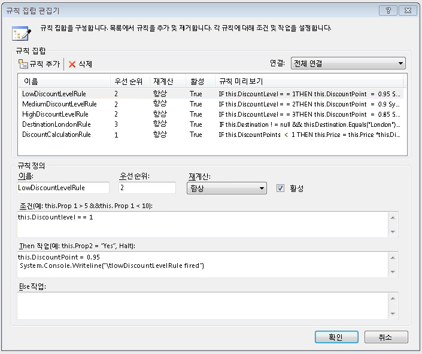
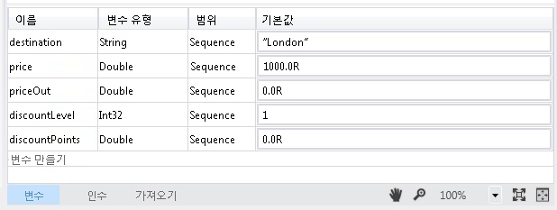
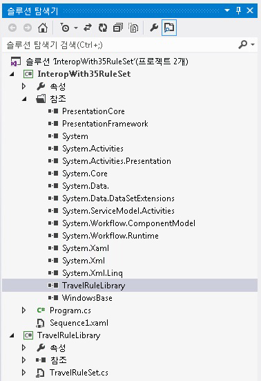
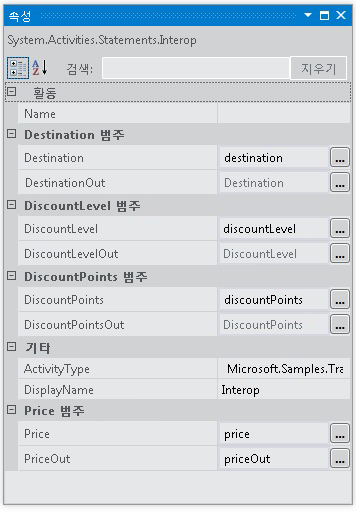

# <a name="interop-with-35-rule-set"></a><span data-ttu-id="489c3-102">3.5 규칙 집합과의 상호 운용성</span><span class="sxs-lookup"><span data-stu-id="489c3-102">Interop with 3.5 Rule Set</span></span>
<span data-ttu-id="489c3-103">이 샘플의 사용법을 보여줍니다는 <xref:System.Activities.Statements.Interop> 의 사용자 지정 활동과 통합 하는 활동 [!INCLUDE[netfx35_short](../../../../includes/netfx35-short-md.md)] 를 사용 하 여 <!--zz <xref:System.Workflow.Activities.Policy> --> `System.Workflow.Activities.Policy` 및 규칙입니다.</span><span class="sxs-lookup"><span data-stu-id="489c3-103">This sample demonstrates the use of the <xref:System.Activities.Statements.Interop> activity to integrate with a custom activity in [!INCLUDE[netfx35_short](../../../../includes/netfx35-short-md.md)] using <!--zz <xref:System.Workflow.Activities.Policy> --> `System.Workflow.Activities.Policy` and rules.</span></span> <span data-ttu-id="489c3-104">이 샘플에서는 사용자 지정 활동에서 노출하는 종속성 속성에 [!INCLUDE[netfx_current_long](../../../../includes/netfx-current-long-md.md)] 변수를 바인딩하여 사용자 지정 활동에 데이터를 전달합니다.</span><span class="sxs-lookup"><span data-stu-id="489c3-104">It passes data to the custom activity by binding [!INCLUDE[netfx_current_long](../../../../includes/netfx-current-long-md.md)] variables to the dependency properties exposed by the custom activity.</span></span>  
  
## <a name="requirements"></a><span data-ttu-id="489c3-105">요구 사항</span><span class="sxs-lookup"><span data-stu-id="489c3-105">Requirements</span></span>  
  
1.  [!INCLUDE[vs_current_long](../../../../includes/vs-current-long-md.md)]  
  
2.  [!INCLUDE[netfx_current_long](../../../../includes/netfx-current-long-md.md)]  
  
3.  [!INCLUDE[netfx35_long](../../../../includes/netfx35-long-md.md)]  
  
## <a name="demonstrates"></a><span data-ttu-id="489c3-106">세부 항목</span><span class="sxs-lookup"><span data-stu-id="489c3-106">Demonstrates</span></span>  
 <span data-ttu-id="489c3-107"><xref:System.Activities.Statements.Interop>활동을 <!--zz <xref:System.Workflow.Activities.Policy> --> `System.Workflow.Activities.Policy` 활동에 [!INCLUDE[netfx35_short](../../../../includes/netfx35-short-md.md)] 종속성 속성이 있는</span><span class="sxs-lookup"><span data-stu-id="489c3-107"><xref:System.Activities.Statements.Interop> activity, <!--zz <xref:System.Workflow.Activities.Policy> --> `System.Workflow.Activities.Policy` activity in [!INCLUDE[netfx35_short](../../../../includes/netfx35-short-md.md)] with dependency properties</span></span>  
  
## <a name="discussion"></a><span data-ttu-id="489c3-108">토론</span><span class="sxs-lookup"><span data-stu-id="489c3-108">Discussion</span></span>  
 <span data-ttu-id="489c3-109">이 샘플에서는 [!INCLUDE[netfx35_short](../../../../includes/netfx35-short-md.md)] 활동과의 통합에 대한 통합 시나리오 중 하나를 보여 줍니다.</span><span class="sxs-lookup"><span data-stu-id="489c3-109">The sample demonstrates one of the integration scenarios for integrating with a [!INCLUDE[netfx35_short](../../../../includes/netfx35-short-md.md)] activity.</span></span> <span data-ttu-id="489c3-110">이 샘플에 포함 되어는 [!INCLUDE[netfx35_short](../../../../includes/netfx35-short-md.md)] 를 호출 하는 사용자 지정 활동을 <!--zz <xref:System.Workflow.Activities.Policy> --> `System.Workflow.Activities.Policy` 활동입니다.</span><span class="sxs-lookup"><span data-stu-id="489c3-110">This sample includes a [!INCLUDE[netfx35_short](../../../../includes/netfx35-short-md.md)] custom activity that invokes a <!--zz <xref:System.Workflow.Activities.Policy> --> `System.Workflow.Activities.Policy` activity.</span></span>  
  
## <a name="travelrulelibrary"></a><span data-ttu-id="489c3-111">TravelRuleLibrary</span><span class="sxs-lookup"><span data-stu-id="489c3-111">TravelRuleLibrary</span></span>  
 <span data-ttu-id="489c3-112">디자이너에서 TravelRuleSet.cs를 열면 다음과 같이 정책 활동이 들어 있는 사용자 지정 순차 활동이 표시됩니다.</span><span class="sxs-lookup"><span data-stu-id="489c3-112">Opening TravelRuleSet.cs in the designer shows a custom sequential activity that contains a Policy activity as follows</span></span>  
  
 <span data-ttu-id="489c3-113"></span><span class="sxs-lookup"><span data-stu-id="489c3-113"></span></span>  
  
 <span data-ttu-id="489c3-114">두 번 클릭은 **DiscountPolicy** 정책 작업의 규칙을 검사 합니다.</span><span class="sxs-lookup"><span data-stu-id="489c3-114">Double-click the **DiscountPolicy** policy activity to examine the rules.</span></span> <span data-ttu-id="489c3-115">규칙 편집기에 규칙이 표시됩니다.</span><span class="sxs-lookup"><span data-stu-id="489c3-115">The Rules editor appears to show the rules.</span></span>  
  
 <span data-ttu-id="489c3-116"></span><span class="sxs-lookup"><span data-stu-id="489c3-116"></span></span>  
  
 <span data-ttu-id="489c3-117">마우스 오른쪽 단추로 클릭는 **DiscountPolicy** 활동과 선택 된 **코드 보기** 코드 검사 하는 코드 병행 C#이 작업으로 이동 하는 옵션입니다.</span><span class="sxs-lookup"><span data-stu-id="489c3-117">Right-click the **DiscountPolicy** activity and select the **View Code** option to examine the code-beside C# code that goes with this activity.</span></span> <span data-ttu-id="489c3-118">`DiscountLevel`의 종속성 속성 설정을 확인합니다.</span><span class="sxs-lookup"><span data-stu-id="489c3-118">Observe the dependency property setting for `DiscountLevel`.</span></span> <span data-ttu-id="489c3-119">이 설정은 <xref:System.Activities.Argument>의 [!INCLUDE[netfx_current_short](../../../../includes/netfx-current-short-md.md)]에 해당합니다.</span><span class="sxs-lookup"><span data-stu-id="489c3-119">This is equivalent to an <xref:System.Activities.Argument> in [!INCLUDE[netfx_current_short](../../../../includes/netfx-current-short-md.md)].</span></span>  
  
```  
public static DependencyProperty DiscountLevelProperty = DependencyProperty.Register("DiscountLevel", typeof(int), typeof(TravelRuleSet));  
  
[DescriptionAttribute("DiscountLevel")]  
[CategoryAttribute("DiscountLevel Category")]  
[BrowsableAttribute(true)]  
[DesignerSerializationVisibilityAttribute(DesignerSerializationVisibility.Visible)]  
public int DiscountLevel  
{  
   get  
   {  
return ((int)base.GetValue(TravelRuleSet.DiscountLevelProperty)));  
   }  
   set  
   {  
base.SetValue(TravelRuleSet.DiscountLevelProperty, value);  
   }  
}  
```  
  
## <a name="interopwith35ruleset"></a><span data-ttu-id="489c3-120">InteropWith35RuleSet</span><span class="sxs-lookup"><span data-stu-id="489c3-120">InteropWith35RuleSet</span></span>  
 <span data-ttu-id="489c3-121">[!INCLUDE[netfx_current_short](../../../../includes/netfx-current-short-md.md)] 활동을 사용하여 TravelRuleLibrary 프로젝트에 생성된 사용자 지정 규칙 집합과 통합하는 <xref:System.Activities.Statements.Interop> 순차 워크플로 프로젝트입니다.</span><span class="sxs-lookup"><span data-stu-id="489c3-121">This is a [!INCLUDE[netfx_current_short](../../../../includes/netfx-current-short-md.md)] sequential workflow project that uses the <xref:System.Activities.Statements.Interop> activity to integrate with the custom rule set created in the TravelRuleLibrary project.</span></span> <span data-ttu-id="489c3-122">다음과 같이 최상위 <xref:System.Activities.Statements.Sequence>에 변수가 만들어집니다.</span><span class="sxs-lookup"><span data-stu-id="489c3-122">Variables are created on the top-level <xref:System.Activities.Statements.Sequence> as follows.</span></span>  
  
 <span data-ttu-id="489c3-123"></span><span class="sxs-lookup"><span data-stu-id="489c3-123"></span></span>  
  
 <span data-ttu-id="489c3-124"></span><span class="sxs-lookup"><span data-stu-id="489c3-124"></span></span>  
  
 <span data-ttu-id="489c3-125">마지막으로 <xref:System.Activities.Statements.Interop> 활동을 사용하여 TravelRuleSet과 통합합니다.</span><span class="sxs-lookup"><span data-stu-id="489c3-125">Lastly, the <xref:System.Activities.Statements.Interop> activity is used to integrate with the TravelRuleSet.</span></span> <span data-ttu-id="489c3-126">이전에 <xref:System.Activities.Statements.Sequence>에 선언한 변수는 종속성 속성에 바인딩하는 데 사용됩니다.</span><span class="sxs-lookup"><span data-stu-id="489c3-126">The variables that were declared earlier on the <xref:System.Activities.Statements.Sequence> are used to bind to the dependency properties.</span></span>  
  
 <span data-ttu-id="489c3-127"></span><span class="sxs-lookup"><span data-stu-id="489c3-127"></span></span>  
  
 <span data-ttu-id="489c3-128"></span><span class="sxs-lookup"><span data-stu-id="489c3-128"></span></span>  
  
 <span data-ttu-id="489c3-129"></span><span class="sxs-lookup"><span data-stu-id="489c3-129"></span></span>  
  
> [!IMPORTANT]
>  <span data-ttu-id="489c3-130">컴퓨터에 이 샘플이 이미 설치되어 있을 수도 있습니다.</span><span class="sxs-lookup"><span data-stu-id="489c3-130">The samples may already be installed on your machine.</span></span> <span data-ttu-id="489c3-131">계속하기 전에 다음(기본) 디렉터리를 확인하세요.</span><span class="sxs-lookup"><span data-stu-id="489c3-131">Check for the following (default) directory before continuing.</span></span>  
>   
>  `<InstallDrive>:\WF_WCF_Samples`  
>   
>  <span data-ttu-id="489c3-132">이 디렉터리가 없으면 [Windows Communication Foundation (WCF) and Windows Workflow Foundation (WF) Samples for .NET Framework 4(.NET Framework 4용 WCF(Windows Communication Foundation) 및 WF(Windows Workflow Foundation) 샘플)](http://go.microsoft.com/fwlink/?LinkId=150780) 로 이동하여 [!INCLUDE[indigo1](../../../../includes/indigo1-md.md)] 및 [!INCLUDE[wf1](../../../../includes/wf1-md.md)] 샘플을 모두 다운로드하세요.</span><span class="sxs-lookup"><span data-stu-id="489c3-132">If this directory does not exist, go to [Windows Communication Foundation (WCF) and Windows Workflow Foundation (WF) Samples for .NET Framework 4](http://go.microsoft.com/fwlink/?LinkId=150780) to download all [!INCLUDE[indigo1](../../../../includes/indigo1-md.md)] and [!INCLUDE[wf1](../../../../includes/wf1-md.md)] samples.</span></span> <span data-ttu-id="489c3-133">이 샘플은 다음 디렉터리에 있습니다.</span><span class="sxs-lookup"><span data-stu-id="489c3-133">This sample is located in the following directory.</span></span>  
>   
>  `<InstallDrive>:\WF_WCF_Samples\WF\Basic\Built-InActivities\InteropWith35RuleSet`
