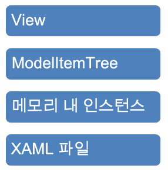

# Programming Model Item Tree
이 샘플에서는 [!INCLUDE[avalon1](../../../../includes/avalon1-md.md)] 트리 뷰에서 선언적 데이터 바인딩을 사용하여 <xref:System.Activities.Presentation.Model.ModelItem>을 탐색하는 방법을 보여 줍니다.  
  
## 샘플 세부 정보  
 <xref:System.Activities.Presentation.Model.ModelItem> 트리는 [!INCLUDE[wfd1](../../../../includes/wfd1-md.md)] 인프라에서 편집할 기본 인스턴스에 대한 데이터를 표시하는 데 사용되는 추상화입니다.다음 그림에서는 [!INCLUDE[wfd2](../../../../includes/wfd2-md.md)] 내의 다양한 인프라 계층을 보여 줍니다.  
  
   
  
 <xref:System.Activities.Presentation.Model.ModelItem>은 내부 값에 대한 포인터와 <xref:System.Activities.Presentation.Model.ModelProperty> 개체의 컬렉션으로 구성됩니다.<xref:System.Activities.Presentation.Model.ModelProperty> 개체는 속성의 이름 및 형식 같은 데이터와 값에 대한 포인터로 구성되며 이 값은 또 다른 <xref:System.Activities.Presentation.Model.ModelItem>입니다.값 변환기는 <xref:System.Activities.Presentation.Model.ModelProperty>에서 반환된 <xref:System.Activities.Presentation.Model.ModelItem>의 일부를 조작하여 트리 뷰에 올바르게 나타나도록 하는 데 사용됩니다.그런 다음 샘플에서는 다음 예제에 표시된 것과 같은 명령적 구문을 사용하여 <xref:System.Activities.Presentation.Model.ModelItem> 트리에 대해 명령적으로 프로그래밍하는 방법을 보여 줍니다.  
  
```csharp  
ModelItem mi = wd.Context.Services.GetService<ModelService>().Root;  
ModelProperty mp = mi.Properties["Activities"];  
mp.Collection.Add(new Persist());  
ModelItem justAdded = mp.Collection.Last();  
justAdded.Properties["DisplayName"].SetValue("new name");  
  
```  
  
#### 이 샘플을 사용하려면  
  
1.  [!INCLUDE[vs2010](../../../../includes/vs2010-md.md)]에서 ProgrammingModelItemTree.sln 솔루션을 엽니다.  
  
2.  **빌드** 메뉴에서 **솔루션 빌드**를 선택하여 솔루션을 빌드합니다.  
  
3.  F5 키를 눌러 응용 프로그램을 실행합니다.그러면 [!INCLUDE[avalon2](../../../../includes/avalon2-md.md)] 폼이 표시됩니다.  
  
4.  **WF 로드** 단추를 클릭하여 <xref:System.Activities.Presentation.Model.ModelItem>을 로드하고 이를 트리 뷰에 바인딩합니다.  
  
5.  **ModelItem 트리 변경** 단추를 클릭하면 앞의 코드가 실행되어 트리에 항목이 추가되고 속성이 설정됩니다.  
  
> [!IMPORTANT]
>  컴퓨터에 이 샘플이 이미 설치되어 있을 수도 있습니다.계속하기 전에 다음\(기본\) 디렉터리를 확인하십시오.  
>   
>  `<InstallDrive>:\WF_WCF_Samples`  
>   
>  이 디렉터리가 없으면 [Windows Communication Foundation \(WCF\) and Windows Workflow Foundation \(WF\) Samples for .NET Framework 4](http://go.microsoft.com/fwlink/?LinkId=150780)로 이동하여 [!INCLUDE[indigo1](../../../../includes/indigo1-md.md)] 및 [!INCLUDE[wf1](../../../../includes/wf1-md.md)] 샘플을 모두 다운로드하십시오.이 샘플은 다음 디렉터리에 있습니다.  
>   
>  `<InstallDrive>:\WF_WCF_Samples\WF\Basic\Designer\ProgrammingModelItemTree`  
  
## 참고 항목  
 <xref:System.Windows.Data.IValueConverter>