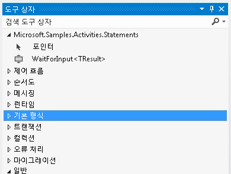

# 입력 대기 활동
이 샘플은 워크플로에 명명된 책갈피를 만드는 방법을 보여 줍니다. [!INCLUDE[wf](../../../../includes/wf-md.md)]에서는 선언적 책갈피 작성을 위한 활동을 제공하지 않습니다. 따라서 워크플로에 책갈피가 필요하면 책갈피를 만드는 사용자 지정 활동을 작성해야 합니다. 이 샘플에 정의되어 있는 `WaitForInput` 활동에서 이러한 기능을 제공하므로 사용자가 워크플로 내에 선언적으로 책갈피를 만들 수 있습니다.  
  
## 이 샘플의 프로젝트  
  
|**프로젝트 이름**|**설명**|**기본 파일**|  
|-|-|-|  
|WaitForInput|`WaitForInput` 활동과 이 활동의 디자이너가 들어 있습니다.|WaitForInput.cs   `WaitForInput` 활동 정의입니다.|  
|||WaitForInputDesigner.xaml   `WaitForInput` 활동에 대한 사용자 지정 디자이너입니다.|  
|||TypeToFirstGenericArgumentConverter.cs   디자이너에서 활동의 제네릭 형식을 업데이트하는 데 사용되는 WPF 형식 변환기입니다.|  
|WaitForInputTestClient|Workflow Designer를 통해 여러 가지 WaitForInput 활동을 사용하여 워크플로를 구성하고 실행하는 샘플 클라이언트 응용 프로그램입니다.|Sequence1.xaml   `WaitForInput` 활동을 사용하는 순차 워크플로입니다.|  
|||Program.cs   Sequence1.xaml에 정의된 워크플로의 인스턴스를 실행합니다.|  
  
## WaitForInput 활동  
 `WaitForInput` 활동은 워크플로에 명명된 책갈피를 만듭니다. 이 책갈피는 신호를 기다리고 미리 구성된 형식의 데이터를 받습니다. 책갈피가 다시 시작되면 워크플로에 전달된 데이터를 `Result` 속성을 통해 사용할 수 있습니다.  
  
 `WaitForInput` 활동은 <xref:System.Activities.NativeActivity> 클래스를 통해서만 액세스할 수 있는 책갈피를 만들어야 하므로 <xref:System.Activities.NativeActivityContext> 클래스에서 파생됩니다.  
  
 이 활동에는 디자이너를 바인딩하고, 업데이트 가능한 제네릭 인수 기능을 추가하고, 기본 제네릭 형식을 문자열로 설정하기 위한 세 가지 특성이 적용됩니다. 이 활동에는 다음 표에 나열된 것과 같은 인수도 있습니다.  
  
|**Name**|**Type**|**설명**|  
|-|-|-|  
|TResult|제네릭 인수(TResult)|책갈피의 형식입니다. 이는 책갈피를 다시 시작할 때 책갈피에 전달할 데이터의 형식입니다.|  
|BookmarkName|InArgument\<문자열 >|책갈피의 이름입니다.|  
|결과|InArgument\<TResult >|책갈피를 다시 시작할 때 활동에 전달할 데이터입니다.|  
  
## WaitForInput 활동 디자이너  
 `WaitForInput` 활동 디자이너는 WaitForInputDesigner.xaml 파일에서 구현됩니다. `WaitForInput` 활동과 이 활동의 디자이너는 동일한 어셈블리에 포함됩니다. 다음 그래픽에서는 어셈블리와 이름이 같은 범주 내 도구 상자의 `WaitForInput` 활동을 보여 줍니다.  
  
   
  
 다음 그래픽에서는 `WaitForInput` 디자이너를 보여 줍니다. `WaitForInput`은 매우 기본적인 활동이므로 디자이너 화면에서 해당 인수를 모두 직접 설정할 수 있습니다.  
  
   
  
#### 이 샘플을 사용하려면  
  
1.  [!INCLUDE[vs2010](../../../../includes/vs2010-md.md)]에서 WaitForInput.sln 파일을 엽니다.  
  
2.  Ctrl+Shift+B를 눌러 솔루션을 빌드합니다.  
  
3.  샘플을 디버깅하지 않고 시작하려면 Ctrl+F5를 누릅니다.  
  
> [!IMPORTANT]
>  컴퓨터에 이 샘플이 이미 설치되어 있을 수도 있습니다. 계속하기 전에 다음(기본) 디렉터리를 확인하세요.  
>   
>  `<InstallDrive>:\WF_WCF_Samples`  
>   
>  이 디렉터리가 없으면 [Windows Communication Foundation (WCF) and Windows Workflow Foundation (WF) Samples for .NET Framework 4(.NET Framework 4용 WCF(Windows Communication Foundation) 및 WF(Windows Workflow Foundation) 샘플)](http://go.microsoft.com/fwlink/?LinkId=150780) 로 이동하여 [!INCLUDE[indigo1](../../../../includes/indigo1-md.md)] 및 [!INCLUDE[wf1](../../../../includes/wf1-md.md)] 샘플을 모두 다운로드하세요. 이 샘플은 다음 디렉터리에 있습니다.  
>   
>  `<InstallDrive>:\WF_WCF_Samples\WF\Scenario\ActivityLibrary\WaitForInput`  
  
## 참고 항목
