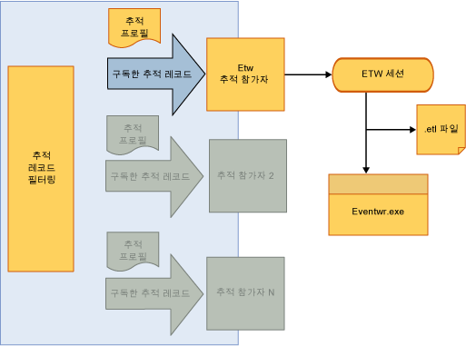

# <a name="tracking-participants"></a><span data-ttu-id="48859-102">추적 참가자</span><span class="sxs-lookup"><span data-stu-id="48859-102">Tracking Participants</span></span>
<span data-ttu-id="48859-103">추적 참가자는 워크플로 개발자가 <xref:System.Activities.Tracking.InteropTrackingRecord.TrackingRecord%2A> 개체에 액세스하여 처리할 수 있는 확장성 지점입니다.</span><span class="sxs-lookup"><span data-stu-id="48859-103">Tracking participants are extensibility points that allow a workflow developer to access <xref:System.Activities.Tracking.InteropTrackingRecord.TrackingRecord%2A> objects and process them.</span></span> [!INCLUDE[netfx_current_long](../../../includes/netfx-current-long-md.md)]<span data-ttu-id="48859-104">에는 추적 레코드를 ETW(Windows용 이벤트 추적) 이벤트로 기록하는 표준 추적 참가자가 포함되어 있습니다.</span><span class="sxs-lookup"><span data-stu-id="48859-104"> includes a standard tracking participant that writes tracking records as Event Tracing for Windows (ETW) events.</span></span> <span data-ttu-id="48859-105">표준 참가자가 요구 사항에 맞지 않는 경우 사용자 지정 추적 참가자를 작성할 수도 있습니다.</span><span class="sxs-lookup"><span data-stu-id="48859-105">If that does not meet your requirements, you can also write a custom tracking participant.</span></span>  
  
## <a name="tracking-participants"></a><span data-ttu-id="48859-106">추적 참가자</span><span class="sxs-lookup"><span data-stu-id="48859-106">Tracking Participants</span></span>  
 <span data-ttu-id="48859-107">추적 인프라를 사용하면 참가자가 레코드 하위 집합을 구독할 수 있도록 보내는 추적 레코드에 필터를 적용할 수 있습니다.</span><span class="sxs-lookup"><span data-stu-id="48859-107">The tracking infrastructure allows the application of a filter on the outgoing tracking records such that a participant can subscribe to a subset of the records.</span></span> <span data-ttu-id="48859-108">필터를 적용하는 메커니즘은 추적 프로필을 사용합니다.</span><span class="sxs-lookup"><span data-stu-id="48859-108">The mechanism to apply a filter is through a tracking profile.</span></span>  
  
 [!INCLUDE[wf](../../../includes/wf-md.md)]<span data-ttu-id="48859-109">의 [!INCLUDE[netfx_current_short](../../../includes/netfx-current-short-md.md)]는 추적 레코드를 ETW 세션에 기록하는 추적 참가자를 제공합니다.</span><span class="sxs-lookup"><span data-stu-id="48859-109"> in [!INCLUDE[netfx_current_short](../../../includes/netfx-current-short-md.md)] provides a tracking participant that writes the tracking records to an ETW session.</span></span> <span data-ttu-id="48859-110">추적 참가자는 워크플로 서비스에서 구성 파일에 추적별 동작을 추가하여 구성할 수 있습니다.</span><span class="sxs-lookup"><span data-stu-id="48859-110">The participant is configured on a workflow service by adding a tracking-specific behavior in a configuration file.</span></span> <span data-ttu-id="48859-111">ETW 추적 참가자를 사용하여 이벤트 뷰어에서 추적 레코드를 볼 수 있습니다.</span><span class="sxs-lookup"><span data-stu-id="48859-111">Enabling an ETW tracking participant allows tracking records to be viewed in the event viewer.</span></span> <span data-ttu-id="48859-112">ETW 기반 추적에 대한 SDK 샘플을 사용하면 ETW 기반 추적 참가자를 사용하는 WF 추적을 쉽게 익힐 수 있습니다.</span><span class="sxs-lookup"><span data-stu-id="48859-112">The SDK sample for ETW-based tracking is a good way to get familiar with WF tracking using the ETW-based tracking participant.</span></span>  
  
## <a name="etw-tracking-participant"></a><span data-ttu-id="48859-113">ETW 추적 참가자</span><span class="sxs-lookup"><span data-stu-id="48859-113">ETW Tracking Participant</span></span>  
 [!INCLUDE[netfx_current_short](../../../includes/netfx-current-short-md.md)]<span data-ttu-id="48859-114">에는 추적 레코드를 ETW 세션에 기록하는 ETW 추적 참가자가 포함됩니다.</span><span class="sxs-lookup"><span data-stu-id="48859-114"> includes an ETW Tracking Participant that writes the tracking records to an ETW session.</span></span> <span data-ttu-id="48859-115">이 작업은 응용 프로그램 성능이나 서버 처리량에 미치는 영향을 최소화하면서 매우 효율적인 방식으로 수행됩니다.</span><span class="sxs-lookup"><span data-stu-id="48859-115">This is done in a very efficient manner with minimal impact to the application’s performance or to the server’s throughput.</span></span> <span data-ttu-id="48859-116">표준 ETW 추적 참가자를 사용하는 이점은 Windows 이벤트 뷰어에서 다른 응용 프로그램 및 시스템 로그를 사용하여 참가자가 받는 추적 레코드를 볼 수 있다는 것입니다.</span><span class="sxs-lookup"><span data-stu-id="48859-116">An advantage of using the standard ETW tracking participant is that the tracking records it receives can be viewed with the other application and system logs in the Windows Event Viewer.</span></span>  
  
 <span data-ttu-id="48859-117">다음 예제와 같이 표준 ETW 추적 참가자는 Web.config 파일에서 구성됩니다.</span><span class="sxs-lookup"><span data-stu-id="48859-117">The standard ETW tracking participant is configured in the Web.config file as shown in the following example.</span></span>  
  
```xml  
<configuration>  
  <system.web>  
    <compilation debug="true" targetFramework="4.0" />  
  </system.web>  
  <system.serviceModel>  
    <behaviors>  
      <serviceBehaviors>  
        <behavior>  
          <etwTracking profileName="Sample Tracking Profile"/>  
        </behavior>  
      </serviceBehaviors>  
    </behaviors>  
   <tracking>  
      <profiles>  
        <trackingProfile name="Sample Tracking Profile">  
        ….  
       </trackingProfile>  
      </profiles>  
    </tracking>  
  </system.serviceModel>  
</configuration>  
```  
  
> [!NOTE]
>  <span data-ttu-id="48859-118">`trackingProfile` 또는 `<etwTracking/>`와 같이 `<etwTracking profileName=""/>` 이름을 지정하지 않으면 Machine.config 파일에서 [!INCLUDE[netfx_current_short](../../../includes/netfx-current-short-md.md)]과 함께 설치된 기본 추적 프로필이 사용됩니다.</span><span class="sxs-lookup"><span data-stu-id="48859-118">If a `trackingProfile` name is not specified, such as just `<etwTracking/>` or `<etwTracking profileName=""/>`, then the default tracking profile installed with the [!INCLUDE[netfx_current_short](../../../includes/netfx-current-short-md.md)] in the Machine.config file is used.</span></span>  
  
 <span data-ttu-id="48859-119">Machine.config 파일에서 기본 추적 프로필은 워크플로 인스턴스 레코드와 오류를 구독합니다.</span><span class="sxs-lookup"><span data-stu-id="48859-119">In the Machine.config file, the default tracking profile subscribes to workflow instance records and faults.</span></span>  
  
 <span data-ttu-id="48859-120">ETW에서는 공급자 ID를 통해 ETW 세션에 이벤트가 기록됩니다.</span><span class="sxs-lookup"><span data-stu-id="48859-120">In ETW, events are written to the ETW session through a provider ID.</span></span> <span data-ttu-id="48859-121">ETW 추적 참가자가 ETW에 추적 레코드를 기록하는 데 사용하는 공급자 ID는 Web.config 파일의 `<system.serviceModel><diagnostics>` 아래에 있는 진단 섹션에서 정의됩니다.</span><span class="sxs-lookup"><span data-stu-id="48859-121">The provider ID that the ETW tracking participant uses for writing the tracking records to ETW is defined in the diagnostics section of the Web.config file (under `<system.serviceModel><diagnostics>`).</span></span> <span data-ttu-id="48859-122">다음 예제와 같이 기본적으로 ETW 추적 참가자는 공급자 ID가 지정되지 않은 경우 기본 공급자 ID를 사용합니다.</span><span class="sxs-lookup"><span data-stu-id="48859-122">By default, the ETW tracking participant uses a default provider ID when one has not been specified, as shown in the following example.</span></span>  
  
```xml  
<system.serviceModel>  
        <diagnostics etwProviderId="52A3165D-4AD9-405C-B1E8-7D9A257EAC9F" />  
```  
  
 <span data-ttu-id="48859-123">다음 그림에서는 ETW 추적 참가자를 통한 추적 데이터 흐름을 보여 줍니다.</span><span class="sxs-lookup"><span data-stu-id="48859-123">The following illustration shows the flow of tracking data through the ETW tracking participant.</span></span> <span data-ttu-id="48859-124">추적 데이터가 ETW 세션에 도달하면 다양한 방법으로 이 데이터에 액세스할 수 있습니다.</span><span class="sxs-lookup"><span data-stu-id="48859-124">Once the tracking data reaches the ETW session, it can be accessed in a number of ways.</span></span> <span data-ttu-id="48859-125">이러한 이벤트에 액세스하는 가장 유용한 방법 중 하나는 응용 프로그램과 서비스에서 로그와 추적을 보는 데 사용되는 일반적인 Windows 도구인 이벤트 뷰어를 사용하는 것입니다.</span><span class="sxs-lookup"><span data-stu-id="48859-125">One of the most useful ways to access these events is through Event Viewer, a common Windows tool used for viewing logs and traces from applications and services.</span></span>  
  
 <span data-ttu-id="48859-126"></span><span class="sxs-lookup"><span data-stu-id="48859-126"></span></span>  
  
## <a name="tracking-participant-event-data"></a><span data-ttu-id="48859-127">추적 참가자 이벤트 데이터</span><span class="sxs-lookup"><span data-stu-id="48859-127">Tracking Participant Event Data</span></span>  
 <span data-ttu-id="48859-128">추적 참가자는 추적 레코드당 이벤트 하나의 형식으로 추적된 이벤트 데이터를 ETW 세션에 serialize합니다.</span><span class="sxs-lookup"><span data-stu-id="48859-128">A tracking participant serializes tracked event data to an ETW session in the format of one event per tracking record.</span></span>  <span data-ttu-id="48859-129">100 ~ 199 범위 내의 ID를 사용하여 이벤트를 식별합니다.</span><span class="sxs-lookup"><span data-stu-id="48859-129">An event is identified using an ID within the range of 100 through 199.</span></span> <span data-ttu-id="48859-130">추적 이벤트의 정의 대 한 추적 참가자가 내보낸 레코드 참조는 [추적 이벤트 참조](../../../docs/framework/windows-workflow-foundation/tracking-events-reference.md) 항목입니다.</span><span class="sxs-lookup"><span data-stu-id="48859-130">For definitions of the tracking event records emitted by a tracking participant, see the [Tracking Events Reference](../../../docs/framework/windows-workflow-foundation/tracking-events-reference.md) topic.</span></span>  
  
 <span data-ttu-id="48859-131">ETW 이벤트 크기는 ETW 버퍼 크기 또는 ETW 이벤트의 최대 페이로드 중 작은 값에 따라 제한됩니다.</span><span class="sxs-lookup"><span data-stu-id="48859-131">The size of an ETW event is limited by the ETW buffer size, or the by the maximum payload for an ETW event, whichever value is smaller.</span></span> <span data-ttu-id="48859-132">이벤트 크기가 이 ETW 제한 중 하나를 초과하면 임의의 방식으로 이벤트가 잘리고 이벤트 내용이 제거됩니다.</span><span class="sxs-lookup"><span data-stu-id="48859-132">If the size of the event exceeds either of these ETW limits, the event is truncated and its content removed in an arbitrary manner.</span></span> <span data-ttu-id="48859-133">변수, 인수, 주석 및 사용자 지정 데이터는 선택적으로 제거되지 않습니다.</span><span class="sxs-lookup"><span data-stu-id="48859-133">Variables, arguments, annotations and custom data are not selectively removed.</span></span> <span data-ttu-id="48859-134">잘리는 경우 어떤 값 때문에 이벤트 크기가 ETW 제한을 초과하는지와 상관없이 이 모든 항목이 잘립니다.</span><span class="sxs-lookup"><span data-stu-id="48859-134">In the case of truncation, all of these are truncated regardless of the value that caused the event size to exceed the ETW limit.</span></span>  <span data-ttu-id="48859-135">제거된 데이터는 `<item>..<item>`으로 대체됩니다.</span><span class="sxs-lookup"><span data-stu-id="48859-135">The removed data is replaced with `<item>..<item>`.</span></span>  
  
 <span data-ttu-id="48859-136">변수, 인수에에서 복합 형식 및 사용자 지정 데이터 항목을 사용 하 여 ETW 이벤트 레코드로 serialize 되는 [NetDataContractSerializer 클래스](http://go.microsoft.com/fwlink/?LinkId=177537)합니다.</span><span class="sxs-lookup"><span data-stu-id="48859-136">Complex types in variables, arguments, and custom data items are serialized to the ETW event record using the [NetDataContractSerializer Class](http://go.microsoft.com/fwlink/?LinkId=177537).</span></span> <span data-ttu-id="48859-137">이 클래스는 serialize된 XML 스트림에 CLR 형식 정보를 포함합니다.</span><span class="sxs-lookup"><span data-stu-id="48859-137">This class includes CLR-type information in the serialized XML steam.</span></span>  
  
 <span data-ttu-id="48859-138">ETW 제한으로 인해 페이로드 데이터가 잘리면 중복 추적 레코드가 ETW 세션에 전송될 수 있습니다.</span><span class="sxs-lookup"><span data-stu-id="48859-138">Truncation of payload data due to ETW limits can result in duplicate tracking records being sent to an ETW session.</span></span> <span data-ttu-id="48859-139">하나 이상의 세션이 이벤트를 수신하고 세션마다 다른 이벤트 페이로드 제한이 있는 경우 이 문제가 발생할 수 있습니다.</span><span class="sxs-lookup"><span data-stu-id="48859-139">This can occur if more than one session is listening for the events and the sessions have different payload limits for the events.</span></span>  
  
 <span data-ttu-id="48859-140">더 낮은 제한이 있는 세션의 경우 이벤트가 잘릴 수 있습니다.</span><span class="sxs-lookup"><span data-stu-id="48859-140">For  the session with the lower limit the event may be truncated.</span></span> <span data-ttu-id="48859-141">ETW 추적 참가자는 이벤트를 수신하는 세션 수를 알 수 없습니다. 세션에서 이벤트가 잘리면 ETW 참가자는 이벤트를 다시 한 번 보내려고 시도합니다.</span><span class="sxs-lookup"><span data-stu-id="48859-141">The ETW tracking participant does not have any knowledge of the number of sessions listening for the events; if an event is truncated for a session then the ETW participant retries sending the event once.</span></span> <span data-ttu-id="48859-142">이 경우 큰 페이로드 크기를 허용하도록 구성된 세션은 이벤트를 두 번 받습니다(잘리지 않은 이벤트 및 잘린 이벤트).</span><span class="sxs-lookup"><span data-stu-id="48859-142">In this case the session that is configured to accept a larger payload size will get the event twice (the non-truncated and truncated event).</span></span> <span data-ttu-id="48859-143">동일한 버퍼 크기 제한으로 모든 ETW 세션을 구성하면 중복을 방지할 수 있습니다.</span><span class="sxs-lookup"><span data-stu-id="48859-143">Duplication can be prevented by configuring all the ETW sessions with same buffer size limits.</span></span>  
  
## <a name="accessing-tracking-data-from-an-etw-participant-in-the-event-viewer"></a><span data-ttu-id="48859-144">이벤트 뷰어에서 ETW 참가자의 추적 데이터 액세스</span><span class="sxs-lookup"><span data-stu-id="48859-144">Accessing Tracking Data from an ETW Participant in the Event Viewer</span></span>  
 <span data-ttu-id="48859-145">ETW 추적 참가자가 ETW 세션에 기록한 이벤트는 이벤트 뷰어를 통해 액세스할 수 있습니다(기본 공급자 ID를 사용할 경우).</span><span class="sxs-lookup"><span data-stu-id="48859-145">Events that are written to an ETW session by the ETW tracking participant can be accessed through the Event Viewer (when using the default provider ID).</span></span> <span data-ttu-id="48859-146">따라서 워크플로에서 내보낸 추적 레코드를 신속하게 볼 수 있습니다.</span><span class="sxs-lookup"><span data-stu-id="48859-146">This allows for rapidly viewing of tracking records that have been emitted by the workflow.</span></span>  
  
> [!NOTE]
>  <span data-ttu-id="48859-147">ETW 세션으로 내보낸 추적 레코드 이벤트는 100 ~ 199 범위의 이벤트 ID를 사용합니다.</span><span class="sxs-lookup"><span data-stu-id="48859-147">Tracking record events emitted to an ETW session use event IDs in the range of 100 through 199.</span></span>  
  
#### <a name="to-enable-viewing-the-tracking-records-in-event-viewer"></a><span data-ttu-id="48859-148">이벤트 뷰어에서 추적 레코드 보기를 사용하려면</span><span class="sxs-lookup"><span data-stu-id="48859-148">To enable viewing the Tracking Records in Event Viewer</span></span>  
  
1.  <span data-ttu-id="48859-149">이벤트 뷰어(EVENTVWR.EXE)를 시작합니다.</span><span class="sxs-lookup"><span data-stu-id="48859-149">Start the Event Viewer (EVENTVWR.EXE)</span></span>  
  
2.  <span data-ttu-id="48859-150">선택 **이벤트 뷰어, 응용 프로그램 및 서비스 로그, Microsoft, Windows, 응용 프로그램 서버-응용 프로그램**합니다.</span><span class="sxs-lookup"><span data-stu-id="48859-150">Select **Event Viewer, Applications and Services Logs, Microsoft, Windows, Application Server-Applications**.</span></span>  
  
3.  <span data-ttu-id="48859-151">마우스 오른쪽 단추로 클릭 하 고 있는지 **보기, 분석 및 디버그 로그 표시** 을 선택 합니다.</span><span class="sxs-lookup"><span data-stu-id="48859-151">Right-click and ensure that **View, Show Analytic and Debug logs** is selected.</span></span> <span data-ttu-id="48859-152">그렇지 않으면 옆에 체크 표시가 나타나도록 이 항목을 선택합니다.</span><span class="sxs-lookup"><span data-stu-id="48859-152">If not, select it so the check mark appears next to it.</span></span> <span data-ttu-id="48859-153">그러면 표시 됩니다는 **분석**, **성능**, 및 **디버그** 로그 합니다.</span><span class="sxs-lookup"><span data-stu-id="48859-153">This displays the **Analytic**, **Perf**, and **Debug** logs.</span></span>  
  
4.  <span data-ttu-id="48859-154">마우스 오른쪽 단추로 클릭는 **분석** 로그인 한 다음 선택 **로그 사용**합니다.</span><span class="sxs-lookup"><span data-stu-id="48859-154">Right-click the **Analytic** log and then select **Enable Log**.</span></span> <span data-ttu-id="48859-155">로그는 %SystemRoot%\System32\Winevt\Logs\Microsoft-Windows-Application Server-Applications%4Analytic.etl 파일에 있습니다.</span><span class="sxs-lookup"><span data-stu-id="48859-155">The log will exist in the %SystemRoot%\System32\Winevt\Logs\Microsoft-Windows-Application Server-Applications%4Analytic.etl file.</span></span>  
  
## <a name="custom-tracking-participant"></a><span data-ttu-id="48859-156">사용자 지정 추적 참가자</span><span class="sxs-lookup"><span data-stu-id="48859-156">Custom Tracking Participant</span></span>  
 <span data-ttu-id="48859-157">추적 참가자 API를 사용하면 워크플로 런타임에서 내보낸 추적 레코드를 처리하기 위한 사용자 지정 논리를 포함할 수 있는 사용자 제공 추적 참가자를 사용하여 추적 런타임을 확장할 수 있습니다.</span><span class="sxs-lookup"><span data-stu-id="48859-157">The tracking participant API allows extension of the tracking runtime with a user-provided tracking participant that can include custom logic to handle tracking records emitted by the workflow runtime.</span></span> <span data-ttu-id="48859-158">사용자 지정 추적 참가자를 기록하려면 개발자가 `Track` 클래스에서 <xref:System.Activities.Tracking.TrackingParticipant> 메서드를 구현해야 합니다.</span><span class="sxs-lookup"><span data-stu-id="48859-158">To write a custom tracking participant, the developer must implement the `Track` method on the <xref:System.Activities.Tracking.TrackingParticipant> class.</span></span> <span data-ttu-id="48859-159">이 메서드는 워크플로 런타임에서 추적 레코드를 내보낼 때 호출됩니다.</span><span class="sxs-lookup"><span data-stu-id="48859-159">This method is called when a tracking record is emitted by the workflow runtime.</span></span>  
  
 <span data-ttu-id="48859-160">추적 참가자는 <xref:System.Activities.Tracking.TrackingParticipant> 클래스에서 파생됩니다.</span><span class="sxs-lookup"><span data-stu-id="48859-160">Tracking participants derive from the <xref:System.Activities.Tracking.TrackingParticipant> class.</span></span> <span data-ttu-id="48859-161">시스템 제공 <xref:System.Activities.Tracking.EtwTrackingParticipant>는 받은 각 추적 레코드에 대해 ETW(Windows용 이벤트 추적) 이벤트를 내보냅니다.</span><span class="sxs-lookup"><span data-stu-id="48859-161">The system-provided <xref:System.Activities.Tracking.EtwTrackingParticipant> emits an Event Tracking for Windows (ETW) event for each tracking record that is received.</span></span> <span data-ttu-id="48859-162">사용자 지정 추적 참가자를 만들려면 <xref:System.Activities.Tracking.TrackingParticipant>에서 파생되는 클래스를 만듭니다.</span><span class="sxs-lookup"><span data-stu-id="48859-162">To create a custom tracking participant, a class is created that derives from <xref:System.Activities.Tracking.TrackingParticipant>.</span></span> <span data-ttu-id="48859-163">기본 추적 기능을 제공하려면 <xref:System.Activities.Tracking.TrackingParticipant.Track%2A>을 재정의합니다.</span><span class="sxs-lookup"><span data-stu-id="48859-163">To provide basic tracking functionality, override <xref:System.Activities.Tracking.TrackingParticipant.Track%2A>.</span></span> <span data-ttu-id="48859-164"><xref:System.Activities.Tracking.TrackingParticipant.Track%2A>은 런타임에서 추적 레코드를 보낼 때 호출되며 원하는 방법으로 처리할 수 있습니다.</span><span class="sxs-lookup"><span data-stu-id="48859-164"><xref:System.Activities.Tracking.TrackingParticipant.Track%2A> is called when a tracking record is sent by the runtime and can be processed in the desired manner.</span></span> <span data-ttu-id="48859-165">다음 예제에서는 모든 추적 레코드를 콘솔 창으로 내보내는 사용자 지정 추적 참가자 클래스를 정의합니다.</span><span class="sxs-lookup"><span data-stu-id="48859-165">In the following example, a custom tracking participant class is defined that emits all tracking records to the console window.</span></span> <span data-ttu-id="48859-166"><xref:System.Activities.Tracking.TrackingParticipant> 및 `BeginTrack` 메서드를 사용하여 비동기식으로 추적 레코드를 처리하는 `EndTrack` 개체를 구현할 수도 있습니다.</span><span class="sxs-lookup"><span data-stu-id="48859-166">You can also implement a <xref:System.Activities.Tracking.TrackingParticipant> object that processes the tracking records asynchronously using its `BeginTrack` and `EndTrack` methods</span></span>  
  
```csharp  
class ConsoleTrackingParticipant : TrackingParticipant  
{  
    protected override void Track(TrackingRecord record, TimeSpan timeout)  
    {  
        if (record != null)  
        {  
            Console.WriteLine("=================================");  
            Console.WriteLine(record);  
        }  
    }  
}  
```  
  
 <span data-ttu-id="48859-167">특정 추적 참가자를 사용하려면 다음 예제와 같이 추적할 워크플로 인스턴스에 해당 참가자를 등록합니다.</span><span class="sxs-lookup"><span data-stu-id="48859-167">To use a particular tracking participant, register it with the workflow instance that you want to track, as shown in the following example.</span></span>  
  
```csharp  
myInstance.Extensions.Add(new ConsoleTrackingParticipant());  
```  
  
 <span data-ttu-id="48859-168">다음 예제에서는 <xref:System.Activities.Statements.Sequence> 활동을 포함하는 <xref:System.Activities.Statements.WriteLine> 활동으로 구성된 워크플로를 만듭니다.</span><span class="sxs-lookup"><span data-stu-id="48859-168">In the following example, a workflow that consists of a <xref:System.Activities.Statements.Sequence> activity that contains a <xref:System.Activities.Statements.WriteLine> activity is created.</span></span> <span data-ttu-id="48859-169">`ConsoleTrackingParticipant`를 확장에 추가하고 워크플로를 호출합니다.</span><span class="sxs-lookup"><span data-stu-id="48859-169">The `ConsoleTrackingParticipant` is added to the extensions and the workflow is invoked.</span></span>  
  
```csharp  
Activity activity= new Sequence()  
{  
    Activities =  
    {  
        new WriteLine()  
        {  
            Text = "Hello World."  
        }  
    }  
};  
  
WorkflowApplication instance = new WorkflowApplication(activity);  
  
instance.Extensions.Add(new ConsoleTrackingParticipant());  
  instance.Completed = delegate(WorkflowApplicationCompletedEventArgs e)  
            {  
                Console.WriteLine("workflow instance completed, Id = " + instance.Id);  
                resetEvent.Set();  
            };  
            instance.Run();  
            Console.ReadLine();  
```  
  
## <a name="see-also"></a><span data-ttu-id="48859-170">참고 항목</span><span class="sxs-lookup"><span data-stu-id="48859-170">See Also</span></span>  
 [<span data-ttu-id="48859-171">Windows Server App Fabric 모니터링</span><span class="sxs-lookup"><span data-stu-id="48859-171">Windows Server App Fabric Monitoring</span></span>](http://go.microsoft.com/fwlink/?LinkId=201273)  
 [<span data-ttu-id="48859-172">App Fabric로 응용 프로그램 모니터링</span><span class="sxs-lookup"><span data-stu-id="48859-172">Monitoring Applications with App Fabric</span></span>](http://go.microsoft.com/fwlink/?LinkId=201275)
