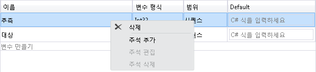
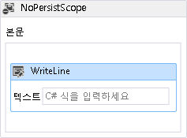
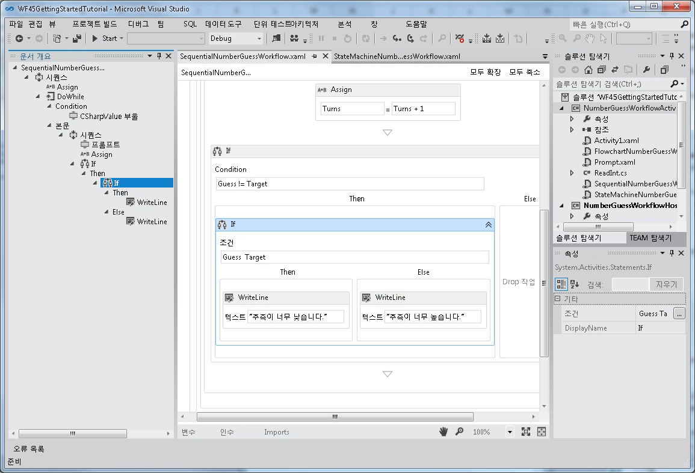
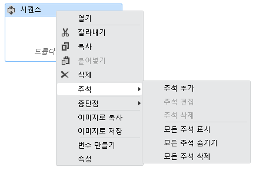

# <a name="what39s-new-in-windows-workflow-foundation-in-net-45"></a><span data-ttu-id="5b270-102">어떤&#39;.NET 4.5에서에서 Windows Workflow Foundation의 새로운 s</span><span class="sxs-lookup"><span data-stu-id="5b270-102">What&#39;s New in Windows Workflow Foundation in .NET 4.5</span></span>
[!INCLUDE[wf](../../../includes/wf-md.md)]<span data-ttu-id="5b270-103">의 [!INCLUDE[net_v45](../../../includes/net-v45-md.md)]에는 새 활동, 디자이너 기능 및 워크플로 개발 모델과 같은 여러 가지 새로운 기능이 추가되었습니다.</span><span class="sxs-lookup"><span data-stu-id="5b270-103"> in [!INCLUDE[net_v45](../../../includes/net-v45-md.md)] introduces many new features, such as new activities, designer capabilities, and workflow development models.</span></span> <span data-ttu-id="5b270-104">[!INCLUDE[net_v45](../../../includes/net-v45-md.md)]에서 새로 추가된 워크플로 기능 중 다수는 재호스트된 Workflow Designer에서 지원됩니다.</span><span class="sxs-lookup"><span data-stu-id="5b270-104">Many, but not all, of the new workflow features introduced in [!INCLUDE[net_v45](../../../includes/net-v45-md.md)] are supported in the re-hosted workflow designer.</span></span> [!INCLUDE[crabout](../../../includes/crabout-md.md)]<span data-ttu-id="5b270-105"> 지원 되는 새로운 기능 참조 [다시 호스트 된 워크플로 디자이너에서 새 Workflow Foundation 4.5 기능에 대 한 지원을](../../../docs/framework/windows-workflow-foundation/wf-features-in-the-rehosted-workflow-designer.md)합니다.</span><span class="sxs-lookup"><span data-stu-id="5b270-105"> the new features that are supported, see [Support for New Workflow Foundation 4.5 Features in the Rehosted Workflow Designer](../../../docs/framework/windows-workflow-foundation/wf-features-in-the-rehosted-workflow-designer.md).</span></span> [!INCLUDE[crabout](../../../includes/crabout-md.md)]<span data-ttu-id="5b270-106"> 마이그레이션.NET 3.0 및 최신 버전을 사용 하려면.NET 3.5 워크플로 응용 프로그램 참조 [마이그레이션 지침](../../../docs/framework/windows-workflow-foundation/migration-guidance.md)합니다.</span><span class="sxs-lookup"><span data-stu-id="5b270-106"> migrating .NET 3.0 and .NET 3.5 workflow applications to use the latest version, see [Migration Guidance](../../../docs/framework/windows-workflow-foundation/migration-guidance.md).</span></span> <span data-ttu-id="5b270-107">이 항목에서는 [!INCLUDE[net_v45](../../../includes/net-v45-md.md)]에 새로 추가된 워크플로 기능에 대해 간략하게 설명합니다.</span><span class="sxs-lookup"><span data-stu-id="5b270-107">This topic provides an overview of the new workflow features introduced in [!INCLUDE[net_v45](../../../includes/net-v45-md.md)].</span></span>  
  
> [!WARNING]
>  <span data-ttu-id="5b270-108">이전 버전의 프레임워크를 대상으로 하는 프로젝트에는 [!INCLUDE[wf2](../../../includes/wf2-md.md)]에 새로 추가된 [!INCLUDE[net_v45](../../../includes/net-v45-md.md)] 기능을 사용할 수 없습니다.</span><span class="sxs-lookup"><span data-stu-id="5b270-108">The new [!INCLUDE[wf2](../../../includes/wf2-md.md)] features introduced in [!INCLUDE[net_v45](../../../includes/net-v45-md.md)] are not available for projects that target previous versions of the framework.</span></span> <span data-ttu-id="5b270-109">[!INCLUDE[net_v45](../../../includes/net-v45-md.md)]를 대상으로 하는 프로젝트의 대상이 이전 버전의 프레임워크로 변경될 경우 여러 문제가 발생할 수 있습니다.</span><span class="sxs-lookup"><span data-stu-id="5b270-109">If a project that targets [!INCLUDE[net_v45](../../../includes/net-v45-md.md)] is re-targeted to a previous version of the framework, several issues can occur.</span></span>  
>   
>  -   <span data-ttu-id="5b270-110">메시지와 함께 C# 식은 디자이너에서 교체 **XAML에서 값이 설정**합니다.</span><span class="sxs-lookup"><span data-stu-id="5b270-110">C# expressions will be replaced in the designer with the message **Value was set in XAML**.</span></span>  
> -   <span data-ttu-id="5b270-111">다음 오류를 포함하여 여러 빌드 오류가 발생합니다.</span><span class="sxs-lookup"><span data-stu-id="5b270-111">Many build errors will occur, including the following error.</span></span>  
>   
>  <span data-ttu-id="5b270-112">**파일 형식이 현재 대상 프레임 워크와 호환 되지 않습니다. 파일 형식을 변환하려면 파일을 명시적으로 저장하세요. 이 오류 메시지가 나타나지 것입니다 파일을 저장 하 고 디자이너를 다시 여세요.**</span><span class="sxs-lookup"><span data-stu-id="5b270-112">**The file format is not compatible with current targeting framework. To convert the file format, please explicitly save the file. This error message will go away after you save the file and reopen the designer.**</span></span>  
  
##  <a name="BKMK_Versioning"></a> <span data-ttu-id="5b270-113">워크플로 버전 관리</span><span class="sxs-lookup"><span data-stu-id="5b270-113">Workflow Versioning</span></span>  
 [!INCLUDE[net_v45](../../../includes/net-v45-md.md)]<span data-ttu-id="5b270-114">에는 새로운 <xref:System.Activities.WorkflowIdentity> 클래스를 기반으로 하는 여러 가지 새로운 버전 관리 기능이 추가되었습니다.</span><span class="sxs-lookup"><span data-stu-id="5b270-114"> introduced several new versioning features based around the new <xref:System.Activities.WorkflowIdentity> class.</span></span> <span data-ttu-id="5b270-115"><xref:System.Activities.WorkflowIdentity>는 워크플로 응용 프로그램 작성자에게 지속형 워크플로 인스턴스를 해당 정의와 매핑하는 메커니즘을 제공합니다.</span><span class="sxs-lookup"><span data-stu-id="5b270-115"><xref:System.Activities.WorkflowIdentity> provides workflow application authors a mechanism for mapping a persisted workflow instance with its definition.</span></span>  
  
-   <span data-ttu-id="5b270-116"><xref:System.Activities.WorkflowApplication> 호스팅을 사용하는 개발자는 <xref:System.Activities.WorkflowIdentity>를 사용하여 여러 버전의 워크플로를 함께 호스트할 수 있습니다.</span><span class="sxs-lookup"><span data-stu-id="5b270-116">Developers using <xref:System.Activities.WorkflowApplication> hosting can use <xref:System.Activities.WorkflowIdentity> to enable hosting multiple versions of a workflow side-by-side.</span></span> <span data-ttu-id="5b270-117">새로운 <xref:System.Activities.WorkflowApplicationInstance> 클래스를 사용하여 지속형 워크플로 인스턴스를 로드할 수 있으며, 그런 다음 호스트에서는 <xref:System.Activities.WorkflowApplicationInstance.DefinitionIdentity%2A>를 사용하여 <xref:System.Activities.WorkflowApplication>을 인스턴스화할 때 올바른 버전의 워크플로 정의를 제공할 수 있습니다.</span><span class="sxs-lookup"><span data-stu-id="5b270-117">Persisted workflow instances can be loaded using the new <xref:System.Activities.WorkflowApplicationInstance> class, and then the <xref:System.Activities.WorkflowApplicationInstance.DefinitionIdentity%2A> can be used by the host to provide the correct version of the workflow definition when instantiating the <xref:System.Activities.WorkflowApplication>.</span></span> <span data-ttu-id="5b270-118">자세한 내용은 참조 [및 버전 관리를 사용 하 여 WorkflowIdentity](../../../docs/framework/windows-workflow-foundation/using-workflowidentity-and-versioning.md) 및 [하는 방법: 호스트는 워크플로-Side-by-side의 여러 버전](../../../docs/framework/windows-workflow-foundation/how-to-host-multiple-versions-of-a-workflow-side-by-side.md)합니다.</span><span class="sxs-lookup"><span data-stu-id="5b270-118">For more information, see [Using WorkflowIdentity and Versioning](../../../docs/framework/windows-workflow-foundation/using-workflowidentity-and-versioning.md) and [How to: Host Multiple Versions of a Workflow Side-by-Side](../../../docs/framework/windows-workflow-foundation/how-to-host-multiple-versions-of-a-workflow-side-by-side.md).</span></span>  
  
-   <span data-ttu-id="5b270-119"><xref:System.ServiceModel.WorkflowServiceHost>는 이제 다중 버전 호스트입니다.</span><span class="sxs-lookup"><span data-stu-id="5b270-119"><xref:System.ServiceModel.WorkflowServiceHost> is now a multi-version host.</span></span> <span data-ttu-id="5b270-120">워크플로 서비스의 새 버전을 배포할 경우 새 인스턴스는 새 서비스를 사용하여 만들어지지만 기존 인스턴스는 이전 버전을 사용하여 완료됩니다.</span><span class="sxs-lookup"><span data-stu-id="5b270-120">When a new version of a workflow service is deployed, new instances are created using the new service, but existing instances complete using the previous version.</span></span> <span data-ttu-id="5b270-121">자세한 내용은 참조 [WorkflowServiceHost에서 Side-by-side 버전 관리](../../../docs/framework/wcf/feature-details/side-by-side-versioning-in-workflowservicehost.md)합니다.</span><span class="sxs-lookup"><span data-stu-id="5b270-121">For more information, see [Side by Side Versioning in WorkflowServiceHost](../../../docs/framework/wcf/feature-details/side-by-side-versioning-in-workflowservicehost.md).</span></span>  
  
-   <span data-ttu-id="5b270-122">지속형 워크플로 인스턴스의 정의를 업데이트하는 메커니즘을 제공하는 동적 업데이트가 도입되었습니다.</span><span class="sxs-lookup"><span data-stu-id="5b270-122">Dynamic update is introduced which provides a mechanism for updating the definition of a persisted workflow instance.</span></span> <span data-ttu-id="5b270-123">자세한 내용은 참조 [동적 업데이트](../../../docs/framework/windows-workflow-foundation/dynamic-update.md) 및 [하는 방법: 실행 중인 워크플로 인스턴스의 정의 업데이트](../../../docs/framework/windows-workflow-foundation/how-to-update-the-definition-of-a-running-workflow-instance.md)합니다.</span><span class="sxs-lookup"><span data-stu-id="5b270-123">For more information, see [Dynamic Update](../../../docs/framework/windows-workflow-foundation/dynamic-update.md) and [How to: Update the Definition of a Running Workflow Instance](../../../docs/framework/windows-workflow-foundation/how-to-update-the-definition-of-a-running-workflow-instance.md).</span></span>  
  
-   <span data-ttu-id="5b270-124">[!INCLUDE[netfx40_short](../../../includes/netfx40-short-md.md)] 데이터베이스 스크립트를 사용하여 만들어진 지속성 데이터베이스를 업그레이드하기 위해 SqlWorkflowInstanceStoreSchemaUpgrade.sql 데이터베이스 스크립트가 제공됩니다.</span><span class="sxs-lookup"><span data-stu-id="5b270-124">A SqlWorkflowInstanceStoreSchemaUpgrade.sql database script is provided to upgrade persistence databases created using the [!INCLUDE[netfx40_short](../../../includes/netfx40-short-md.md)] database scripts.</span></span> <span data-ttu-id="5b270-125">이 스크립트는 [!INCLUDE[netfx40_short](../../../includes/netfx40-short-md.md)]에 도입된 새 버전 관리 기능을 지원하도록 [!INCLUDE[net_v45](../../../includes/net-v45-md.md)] 지속성 데이터베이스를 업데이트합니다.</span><span class="sxs-lookup"><span data-stu-id="5b270-125">This script updates [!INCLUDE[netfx40_short](../../../includes/netfx40-short-md.md)] persistence databases to support the new versioning capabilities introduced in [!INCLUDE[net_v45](../../../includes/net-v45-md.md)].</span></span> <span data-ttu-id="5b270-126">데이터베이스의 지속형 워크플로 인스턴스는 기본 버전 관리 값을 제공 받으며, side-by-side 실행 및 동적 업데이트에 참여할 수 있습니다.</span><span class="sxs-lookup"><span data-stu-id="5b270-126">The persisted workflow instances in the database are given default versioning values, and can participate in side-by-side execution and dynamic update.</span></span> [!INCLUDE[crdefault](../../../includes/crdefault-md.md)]<span data-ttu-id="5b270-127"> [워크플로 버전 관리를 지원 하기 위해.NET Framework 4 지 속성 데이터베이스 업그레이드](../../../docs/framework/windows-workflow-foundation/using-workflowidentity-and-versioning.md#UpdatingWF4PersistenceDatabases)합니다.</span><span class="sxs-lookup"><span data-stu-id="5b270-127"> [Upgrading .NET Framework 4 Persistence Databases to Support Workflow Versioning](../../../docs/framework/windows-workflow-foundation/using-workflowidentity-and-versioning.md#UpdatingWF4PersistenceDatabases).</span></span>  
  
##  <a name="BKMK_NewActivities"></a> <span data-ttu-id="5b270-128">활동</span><span class="sxs-lookup"><span data-stu-id="5b270-128">Activities</span></span>  
 <span data-ttu-id="5b270-129">기본 제공 활동 라이브러리에는 새로운 활동과 기존 활동의 새로운 기능이 들어 있습니다.</span><span class="sxs-lookup"><span data-stu-id="5b270-129">The built-in activity library contains new activities and new features for existing activities.</span></span>  
  
###  <a name="BKMK_NoPersistScope"></a> <span data-ttu-id="5b270-130">비지 속성 범위</span><span class="sxs-lookup"><span data-stu-id="5b270-130">NoPersist Scope</span></span>  
 <span data-ttu-id="5b270-131"><xref:System.Activities.Statements.NoPersistScope>는 NoPersistScope의 자식 활동이 실행될 때 워크플로가 지속되지 않도록 하는 새로운 컨테이너 활동입니다.</span><span class="sxs-lookup"><span data-stu-id="5b270-131"><xref:System.Activities.Statements.NoPersistScope> is a new container activity that prevents a workflow from being persisted when the NoPersistScope’s child activities are executing.</span></span> <span data-ttu-id="5b270-132">이는 워크플로가 파일 핸들과 같은 시스템별 리소스를 사용하고 있거나 데이터베이스 트랜잭션 중일 때와 같이 워크플로가 지속되는 것이 적합하지 않은 시나리오에서 유용합니다.</span><span class="sxs-lookup"><span data-stu-id="5b270-132">This is useful in scenarios where it is not appropriate for the workflow to be persisted, such as when the workflow is using machine-specific resources such as file handles, or during database transactions.</span></span> <span data-ttu-id="5b270-133">이전에는 활동이 실행되는 동안 지속성을 방지하기 위해 <xref:System.Activities.NativeActivity>을 사용하는 사용자 지정 <xref:System.Activities.NoPersistHandle>가 필요했습니다.</span><span class="sxs-lookup"><span data-stu-id="5b270-133">Previously, to prevent persistence from occurring during an activity's execution, a custom <xref:System.Activities.NativeActivity> that used a <xref:System.Activities.NoPersistHandle> was required.</span></span>  
  
###  <a name="BKMK_NewFlowchartCapabilities"></a> <span data-ttu-id="5b270-134">새로운 순서도 기능</span><span class="sxs-lookup"><span data-stu-id="5b270-134">New Flowchart Capabilities</span></span>  
 <span data-ttu-id="5b270-135">순서도는 [!INCLUDE[net_v45](../../../includes/net-v45-md.md)]에 맞게 업데이트되었으며, 다음과 같은 새로운 기능이 있습니다.</span><span class="sxs-lookup"><span data-stu-id="5b270-135">Flowcharts are updated for [!INCLUDE[net_v45](../../../includes/net-v45-md.md)] and have the following new capabilities:</span></span>  
  
-   <span data-ttu-id="5b270-136">`DisplayName` 또는 <xref:System.Activities.Statements.FlowSwitch%601> 활동의 <xref:System.Activities.Statements.FlowDecision> 속성을 편집할 수 있습니다.</span><span class="sxs-lookup"><span data-stu-id="5b270-136">The `DisplayName` property of a <xref:System.Activities.Statements.FlowSwitch%601> or <xref:System.Activities.Statements.FlowDecision> activity is editable.</span></span> <span data-ttu-id="5b270-137">따라서 활동 디자이너에 활동의 목적에 대한 자세한 내용을 표시할 수 있습니다.</span><span class="sxs-lookup"><span data-stu-id="5b270-137">This will let the activity designer show more information about the activity's purpose.</span></span>  
  
-   <span data-ttu-id="5b270-138">순서도에는 <xref:System.Activities.Statements.Flowchart.ValidateUnconnectedNodes%2A>라는 새로운 속성이 있으며, 이 속성의 기본값은 `False`입니다.</span><span class="sxs-lookup"><span data-stu-id="5b270-138">Flowcharts have a new property called <xref:System.Activities.Statements.Flowchart.ValidateUnconnectedNodes%2A>; the default for this property is `False`.</span></span> <span data-ttu-id="5b270-139">이 속성이 `True`로 설정된 경우 연결되지 않은 순서도 노드에 유효성 검사 오류가 발생합니다.</span><span class="sxs-lookup"><span data-stu-id="5b270-139">If this property is set to `True`, then unconnected flowchart nodes will produce validation errors.</span></span>  
  
## <a name="support-for-partial-trust"></a><span data-ttu-id="5b270-140">부분 신뢰에 대한 지원</span><span class="sxs-lookup"><span data-stu-id="5b270-140">Support for Partial Trust</span></span>  
 <span data-ttu-id="5b270-141">[!INCLUDE[netfx40_long](../../../includes/netfx40-long-md.md)]의 워크플로에는 완전히 신뢰할 수 있는 응용 프로그램 도메인이 필요합니다.</span><span class="sxs-lookup"><span data-stu-id="5b270-141">Workflows in [!INCLUDE[netfx40_long](../../../includes/netfx40-long-md.md)] required a fully trusted application domain.</span></span> <span data-ttu-id="5b270-142">[!INCLUDE[net_v45](../../../includes/net-v45-md.md)]에서는 워크플로가 부분 신뢰 환경에서 작동할 수 있습니다.</span><span class="sxs-lookup"><span data-stu-id="5b270-142">In [!INCLUDE[net_v45](../../../includes/net-v45-md.md)], workflows can operate in a partial trust environment.</span></span> <span data-ttu-id="5b270-143">부분 신뢰 환경에서는 호스트 리소스에 대한 전체 액세스 권한을 부여하지 않고 타사 구성 요소를 사용할 수 있습니다.</span><span class="sxs-lookup"><span data-stu-id="5b270-143">In a partial trust environment, third-party components can be used without granting them full access to the resources of the host.</span></span> <span data-ttu-id="5b270-144">워크플로를 부분 신뢰 상태로 실행할 때는 다음과 같은 몇 가지 사항을 고려해야 합니다.</span><span class="sxs-lookup"><span data-stu-id="5b270-144">Some concerns about running workflows in partial trust are as follows:</span></span>  
  
1.  <span data-ttu-id="5b270-145"><xref:System.Activities.Statements.Interop> 활동에 포함된 규칙 등의 레거시 구성 요소는 부분 신뢰 상태로 사용할 수 없습니다.</span><span class="sxs-lookup"><span data-stu-id="5b270-145">Using legacy components (including Rules) contained in the <xref:System.Activities.Statements.Interop> activity is not supported under partial trust.</span></span>  
  
2.  <span data-ttu-id="5b270-146"><xref:System.ServiceModel.WorkflowServiceHost>에서 부분 신뢰 상태로 워크플로를 실행할 수 없습니다.</span><span class="sxs-lookup"><span data-stu-id="5b270-146">Running workflows in partial trust in <xref:System.ServiceModel.WorkflowServiceHost> is not supported.</span></span>  
  
3.  <span data-ttu-id="5b270-147">부분 신뢰 시나리오에서 예외를 지속하는 것은 잠재적 보안 위협입니다.</span><span class="sxs-lookup"><span data-stu-id="5b270-147">Persisting exceptions in a partial-trust scenario is a potential security threat.</span></span> <span data-ttu-id="5b270-148">예외 지속성을 사용하지 않으려면 프로젝트에 <xref:System.Activities.ExceptionPersistenceExtension> 형식의 확장을 추가하여 예외 지속성을 해제해야 합니다.</span><span class="sxs-lookup"><span data-stu-id="5b270-148">To disable persisting of exceptions, an extension of type <xref:System.Activities.ExceptionPersistenceExtension> must be added to the project in order to opt out of persisting exceptions.</span></span> <span data-ttu-id="5b270-149">다음 코드 예제에서는 이 형식을 구현하는 방법을 보여 줍니다.</span><span class="sxs-lookup"><span data-stu-id="5b270-149">The following code example demonstrates how to implement this type.</span></span>  
  
    ```  
    public class ExceptionPersistenceExtension   
    {  
        public ExceptionPersistenceExtension()   
        {   
            this.PersistExceptions = false;   
        }   
        public bool PersistExceptions { get; set; }   
    }  
    ```  
  
     <span data-ttu-id="5b270-150">예외가 serialize되지 않는 경우에는 예외가 <xref:System.Activities.Statements.NoPersistScope> 내에서 사용되도록 합니다.</span><span class="sxs-lookup"><span data-stu-id="5b270-150">If exceptions are not to be serialized, ensure that exceptions are used within a <xref:System.Activities.Statements.NoPersistScope>.</span></span>  
  
4.  <span data-ttu-id="5b270-151">활동 작성자는 <xref:System.Activities.Activity.CacheMetadata%2A>를 재정의하여 워크플로 런타임이 자동으로 해당 형식에 대해 리플렉션을 실행하지 않도록 해야 합니다.</span><span class="sxs-lookup"><span data-stu-id="5b270-151">Activity authors should override <xref:System.Activities.Activity.CacheMetadata%2A> to avoid having the workflow runtime automatically execute reflection against the type.</span></span> <span data-ttu-id="5b270-152">인수 및 자식 활동은 null이 아니어야 하며, <xref:System.Activities.ActivityMetadata.Bind%2A>는 명시적으로 호출되어 합니다.</span><span class="sxs-lookup"><span data-stu-id="5b270-152">Arguments and child activities must be non-null, and <xref:System.Activities.ActivityMetadata.Bind%2A> must be called explicitly.</span></span> <span data-ttu-id="5b270-153">재정의 대 한 자세한 내용은 <xref:System.Activities.Activity.CacheMetadata%2A>, 참조 [CacheMetadata 사용 하 여 데이터를 노출](../../../docs/framework/windows-workflow-foundation/exposing-data-with-cachemetadata.md)합니다.</span><span class="sxs-lookup"><span data-stu-id="5b270-153">For more information on overriding <xref:System.Activities.Activity.CacheMetadata%2A>, see [Exposing data with CacheMetadata](../../../docs/framework/windows-workflow-foundation/exposing-data-with-cachemetadata.md).</span></span> <span data-ttu-id="5b270-154">형식의 인수 인스턴스 또한 `internal` 또는 **개인** 에 명시적으로 만들어야 <xref:System.Activities.Activity.CacheMetadata%2A> 리플렉션에 의해 만들어지지 않도록 합니다.</span><span class="sxs-lookup"><span data-stu-id="5b270-154">Also, instances of arguments that are of a type that is `internal` or **private** must be explicitly created in  <xref:System.Activities.Activity.CacheMetadata%2A> to avoid being created by reflection.</span></span>  
  
5.  <span data-ttu-id="5b270-155">형식은 serialization에 <xref:System.Runtime.Serialization.ISerializable> 또는 <xref:System.SerializableAttribute>를 사용하지 않으며, serialize되는 형식은 <xref:System.Runtime.Serialization.DataContractSerializer>를 지원해야 합니다.</span><span class="sxs-lookup"><span data-stu-id="5b270-155">Types will not use <xref:System.Runtime.Serialization.ISerializable> or <xref:System.SerializableAttribute> for serialization; types that are to be serialized must support <xref:System.Runtime.Serialization.DataContractSerializer>.</span></span>  
  
6.  <span data-ttu-id="5b270-156"><xref:System.Activities.Expressions.LambdaValue%601>를 사용하는 식은 <xref:System.Security.Permissions.ReflectionPermissionAttribute.RestrictedMemberAccess%2A>를 필요로 하므로 부분 신뢰 상태로 작동하지 않습니다.</span><span class="sxs-lookup"><span data-stu-id="5b270-156">Expressions that use <xref:System.Activities.Expressions.LambdaValue%601> require <xref:System.Security.Permissions.ReflectionPermissionAttribute.RestrictedMemberAccess%2A>, and thus will not work under partial trust.</span></span> <span data-ttu-id="5b270-157"><xref:System.Activities.Expressions.LambdaValue%601>를 사용하는 워크플로에서는 해당 식을 <xref:System.Activities.CodeActivity%601>에서 파생된 활동으로 바꿔야 합니다.</span><span class="sxs-lookup"><span data-stu-id="5b270-157">Workflows that use <xref:System.Activities.Expressions.LambdaValue%601> should replace those expressions with activities that derive from <xref:System.Activities.CodeActivity%601>.</span></span> <span data-ttu-id="5b270-158">이어야 합니다.</span><span class="sxs-lookup"><span data-stu-id="5b270-158">.</span></span>  
  
7.  <span data-ttu-id="5b270-159">부분 신뢰 상태에서는 <xref:System.Activities.XamlIntegration.TextExpressionCompiler>나 Visual Basic에서 호스트되는 컴파일러를 사용하여 식을 컴파일할 수 없지만, 이전에 컴파일된 식은 실행할 수 있습니다.</span><span class="sxs-lookup"><span data-stu-id="5b270-159">Expressions cannot be compiled using <xref:System.Activities.XamlIntegration.TextExpressionCompiler> or the Visual Basic hosted compiler in partial trust, but previously compiled expressions can be run.</span></span>  
  
8.  <span data-ttu-id="5b270-160">사용 하는 단일 어셈블리 [수준 2 투명도](http://aka.ms/Level2Transparency) 에서 사용할 수 없습니다 [!INCLUDE[netfx40_short](../../../includes/netfx40-short-md.md)], [!INCLUDE[netfx_current_short](../../../includes/netfx-current-short-md.md)] 완전 신뢰에서 및 [!INCLUDE[netfx_current_short](../../../includes/netfx-current-short-md.md)] 부분 신뢰 환경에서 합니다.</span><span class="sxs-lookup"><span data-stu-id="5b270-160">A single assembly that uses [Level 2 Transparency](http://aka.ms/Level2Transparency) cannot be used in [!INCLUDE[netfx40_short](../../../includes/netfx40-short-md.md)], [!INCLUDE[netfx_current_short](../../../includes/netfx-current-short-md.md)] in full trust, and [!INCLUDE[netfx_current_short](../../../includes/netfx-current-short-md.md)] in partial trust.</span></span>  
  
##  <a name="BKMK_NewDesignerCapabilites"></a> <span data-ttu-id="5b270-161">새로운 디자이너 기능</span><span class="sxs-lookup"><span data-stu-id="5b270-161">New Designer Capabilities</span></span>  
  
###  <a name="BKMK_DesignerSearch"></a> <span data-ttu-id="5b270-162">디자이너 검색</span><span class="sxs-lookup"><span data-stu-id="5b270-162">Designer Search</span></span>  
 <span data-ttu-id="5b270-163">이제 대규모 워크플로를 보다 효율적으로 관리하기 위해 워크플로를 키워드로 검색할 수 있습니다.</span><span class="sxs-lookup"><span data-stu-id="5b270-163">To make larger workflows more manageable, workflows can now be searched by keyword.</span></span> <span data-ttu-id="5b270-164">이 기능은; Visual Studio에서 사용할 수 이 기능은 재 호스트 된 디자이너에서 사용할 수 없습니다.</span><span class="sxs-lookup"><span data-stu-id="5b270-164">This feature is only available in Visual Studio; this feature is not available in a rehosted designer.</span></span> <span data-ttu-id="5b270-165">사용 가능한 검색 종류는 다음 두 가지입니다.</span><span class="sxs-lookup"><span data-stu-id="5b270-165">There are two kinds of searches available:</span></span>  
  
-   <span data-ttu-id="5b270-166">통해 시작 하는 빠른 찾기 **Ctrl + F** 또는 **편집**, **찾기 및 바꾸기**, **빠른 찾기**합니다.</span><span class="sxs-lookup"><span data-stu-id="5b270-166">Quick Find, initiated with either **Ctrl+F** or **Edit**, **Find and Replace**, **Quick Find**.</span></span>  
  
-   <span data-ttu-id="5b270-167">통해 시작 파일에서 찾기 **Ctrl + Shift + F** 또는 **편집**, **찾기 및 바꾸기**, **파일에서 찾기**합니다.</span><span class="sxs-lookup"><span data-stu-id="5b270-167">Find in Files, initiated with either **Ctrl+Shift+F** or **Edit**, **Find and Replace**, **Find in Files**.</span></span>  
  
 <span data-ttu-id="5b270-168">바꾸기는 지원되지 않습니다.</span><span class="sxs-lookup"><span data-stu-id="5b270-168">Note that Replace is not supported.</span></span>  
  
####  <a name="BKMK_QuickFind"></a> <span data-ttu-id="5b270-169">빠른 찾기</span><span class="sxs-lookup"><span data-stu-id="5b270-169">Quick Find</span></span>  
 <span data-ttu-id="5b270-170">워크플로에서 검색되는 키워드는 다음 디자이너 항목과 일치합니다.</span><span class="sxs-lookup"><span data-stu-id="5b270-170">Keywords searched in workflows will match the following designer items:</span></span>  
  
-   <span data-ttu-id="5b270-171"><xref:System.Activities.Activity> 개체, <xref:System.Activities.Statements.FlowNode> 개체, <xref:System.Activities.Statements.State> 개체, <xref:System.Activities.Statements.Transition> 개체 및 기타 사용자 지정 흐름 제어 항목의 속성</span><span class="sxs-lookup"><span data-stu-id="5b270-171">Properties of <xref:System.Activities.Activity> objects, <xref:System.Activities.Statements.FlowNode> objects, <xref:System.Activities.Statements.State> objects, <xref:System.Activities.Statements.Transition> objects, and other custom flow-control items.</span></span>  
  
-   <span data-ttu-id="5b270-172">변수</span><span class="sxs-lookup"><span data-stu-id="5b270-172">Variables</span></span>  
  
-   <span data-ttu-id="5b270-173">인수</span><span class="sxs-lookup"><span data-stu-id="5b270-173">Arguments</span></span>  
  
-   <span data-ttu-id="5b270-174">식</span><span class="sxs-lookup"><span data-stu-id="5b270-174">Expressions</span></span>  
  
 <span data-ttu-id="5b270-175">빠른 찾기는 디자이너의 <xref:System.Activities.Presentation.Model.ModelItem> 트리에서 수행됩니다.</span><span class="sxs-lookup"><span data-stu-id="5b270-175">Quick Find is performed on the designer's <xref:System.Activities.Presentation.Model.ModelItem> tree.</span></span> <span data-ttu-id="5b270-176">워크플로 정의로 가져온 네임스페이스는 빠른 찾기로 찾을 수 없습니다.</span><span class="sxs-lookup"><span data-stu-id="5b270-176">Quick Find will not locate namespaces imported in the workflow definition.</span></span>  
  
####  <a name="BKMK_FindInFiles"></a> <span data-ttu-id="5b270-177">파일에서 찾기</span><span class="sxs-lookup"><span data-stu-id="5b270-177">Find in Files</span></span>  
 <span data-ttu-id="5b270-178">워크플로에서 검색되는 키워드는 워크플로 파일의 실제 내용과 일치합니다.</span><span class="sxs-lookup"><span data-stu-id="5b270-178">Keywords searched in workflows will match the actual content of the workflow files.</span></span> <span data-ttu-id="5b270-179">검색 결과는 Visual Studio 찾기 결과 뷰 창에 표시됩니다.</span><span class="sxs-lookup"><span data-stu-id="5b270-179">The search results will be shown in Visual Studio Find Results view pane.</span></span> <span data-ttu-id="5b270-180">결과 항목을 두 번 클릭하면 워크플로 디자이너의 일치 항목이 포함된 활동으로 이동됩니다.</span><span class="sxs-lookup"><span data-stu-id="5b270-180">Double-clicking the result item will navigate to the activity which contains the match in workflow designer.</span></span>  
  
###  <a name="BKMK_VariableDeleteContextMenu"></a> <span data-ttu-id="5b270-181">변수 및 인수 디자이너에서 상황에 맞는 메뉴 항목 삭제</span><span class="sxs-lookup"><span data-stu-id="5b270-181">Delete context menu item in variable and argument designer</span></span>  
 <span data-ttu-id="5b270-182">[!INCLUDE[netfx40_short](../../../includes/netfx40-short-md.md)]에서는 디자이너에서 키보드로만 변수 및 인수를 삭제할 수 있었습니다.</span><span class="sxs-lookup"><span data-stu-id="5b270-182">In [!INCLUDE[netfx40_short](../../../includes/netfx40-short-md.md)], variables and arguments could only be deleted in the designer using the keyboard.</span></span> <span data-ttu-id="5b270-183">[!INCLUDE[net_v45](../../../includes/net-v45-md.md)]부터는 상황에 맞는 메뉴를 사용하여 변수 및 인수를 삭제할 수 있습니다.</span><span class="sxs-lookup"><span data-stu-id="5b270-183">Starting with [!INCLUDE[net_v45](../../../includes/net-v45-md.md)], variables and arguments can be deleted using the context menu.</span></span>  
  
 <span data-ttu-id="5b270-184">다음 스크린 샷에서는 변수 및 인수 디자이너의 상황에 맞는 메뉴를 보여 줍니다.</span><span class="sxs-lookup"><span data-stu-id="5b270-184">The following screenshot shows the variable and argument designer context menu.</span></span>  
  
 <span data-ttu-id="5b270-185"></span><span class="sxs-lookup"><span data-stu-id="5b270-185"></span></span>  
  
###  <a name="BKMK_AutoSurround"></a> <span data-ttu-id="5b270-186">자동 감싸기 시퀀스</span><span class="sxs-lookup"><span data-stu-id="5b270-186">Auto-surround with Sequence</span></span>  
 <span data-ttu-id="5b270-187">워크플로 또는 특정 컨테이너 활동(예: <xref:System.Activities.Statements.NoPersistScope>)에는 단일 본문 활동만 포함할 수 있으므로 두 번째 활동을 추가하려면 개발자가 첫 번째 활동을 삭제하고 <xref:System.Activities.Statements.Sequence> 활동을 추가한 후 두 활동을 모두 시퀀스 활동에 추가해야 했습니다.</span><span class="sxs-lookup"><span data-stu-id="5b270-187">Since a workflow or certain container activities (such as <xref:System.Activities.Statements.NoPersistScope>) can only contain a single body activity, adding a second activity required the developer to delete the first activity, add a <xref:System.Activities.Statements.Sequence> activity, and then add both activities to the sequence activity.</span></span> <span data-ttu-id="5b270-188">[!INCLUDE[net_v45](../../../includes/net-v45-md.md)]부터는 디자이너 화면에 두 번째 활동을 추가하면 `Sequence` 활동이 자동으로 만들어져 두 활동을 래핑합니다.</span><span class="sxs-lookup"><span data-stu-id="5b270-188">Starting with [!INCLUDE[net_v45](../../../includes/net-v45-md.md)], when adding a second activity to the designer surface, a `Sequence` activity will be automatically created to wrap both activities.</span></span>  
  
 <span data-ttu-id="5b270-189">다음 스크린 샷에서는 `WriteLine`의 `Body`에 있는 `NoPersistScope` 활동을 보여 줍니다.</span><span class="sxs-lookup"><span data-stu-id="5b270-189">The following screenshot shows a `WriteLine` activity in the `Body` of a `NoPersistScope`.</span></span>  
  
 <span data-ttu-id="5b270-190"></span><span class="sxs-lookup"><span data-stu-id="5b270-190"></span></span>  
  
 <span data-ttu-id="5b270-191">다음 스크린 샷에서는 두 번째 `Sequence`이 첫 번째 항목 아래에 놓였을 때 `Body`에 자동으로 만들어진 `WriteLine` 활동을 보여 줍니다.</span><span class="sxs-lookup"><span data-stu-id="5b270-191">The following screenshot shows the automatically created `Sequence` activity in the `Body` when a second `WriteLine` is dropped below the first.</span></span>  
  
 <span data-ttu-id="5b270-192"></span><span class="sxs-lookup"><span data-stu-id="5b270-192"></span></span>  
  
###  <a name="BKMK_PanMode"></a> <span data-ttu-id="5b270-193">이동 모드</span><span class="sxs-lookup"><span data-stu-id="5b270-193">Pan Mode</span></span>  
 <span data-ttu-id="5b270-194">디자이너에서 큰 워크플로를 더욱 쉽게 이동하기 위해 이동 모드를 사용할 수 있습니다. 이동 모드에서 개발자는 스크롤 바를 사용할 필요 없이 워크플로의 보이는 부분을 클릭하여 끌 수 있습니다.</span><span class="sxs-lookup"><span data-stu-id="5b270-194">To more easily navigate a large workflow in the designer, pan mode can be enabled, allowing the developer to click and drag to move the visible portion of the workflow, rather than needing to use the scroll bars.</span></span> <span data-ttu-id="5b270-195">이동 모드를 활성화하는 단추는 디자이너의 오른쪽 아래 모퉁이에 있습니다.</span><span class="sxs-lookup"><span data-stu-id="5b270-195">The button to activate pan mode is in the lower right corner of the designer.</span></span>  
  
 <span data-ttu-id="5b270-196">다음 스크린 샷에서는 워크플로 디자이너의 오른쪽 아래 모퉁이에 있는 이동 단추를 보여 줍니다.</span><span class="sxs-lookup"><span data-stu-id="5b270-196">The following screenshot shows the pan button which is located at the bottom right corner of the workflow designer.</span></span>  
  
 <span data-ttu-id="5b270-197"></span><span class="sxs-lookup"><span data-stu-id="5b270-197"></span></span>  
  
 <span data-ttu-id="5b270-198">마우스 가운데 단추 또는 스페이스바를 사용하여 워크플로 디자이너를 이동할 수도 있습니다.</span><span class="sxs-lookup"><span data-stu-id="5b270-198">The middle mouse button or space bar can also be used to pan the workflow designer.</span></span>  
  
###  <a name="BKMK_MultiSelect"></a> <span data-ttu-id="5b270-199">다중 선택</span><span class="sxs-lookup"><span data-stu-id="5b270-199">Multi-select</span></span>  
 <span data-ttu-id="5b270-200">이동 모드를 사용하지 않을 경우 활동 주위의 사각형을 끌거나, Ctrl 키를 누른 채 원하는 활동을 하나씩 클릭하여 여러 활동을 한 번에 선택할 수 있습니다.</span><span class="sxs-lookup"><span data-stu-id="5b270-200">Multiple activities can be selected at one time, either by dragging a rectangle around them (when pan mode is not enabled), or by holding down Ctrl and click the desired activities one by one.</span></span>  
  
 <span data-ttu-id="5b270-201">디자이너 내에서 선택된 여러 활동을 끌어다 놓을 수도 있으며 상황에 맞는 메뉴를 사용하여 상호 작용할 수도 있습니다.</span><span class="sxs-lookup"><span data-stu-id="5b270-201">Multiple activity selections can also be dragged and dropped within the designer, and can also be interacted with using the context menu.</span></span>  
  
###  <a name="BKMK_DocumentOutline"></a> <span data-ttu-id="5b270-202">워크플로 항목 개요 뷰</span><span class="sxs-lookup"><span data-stu-id="5b270-202">Outline view of workflow items</span></span>  
 <span data-ttu-id="5b270-203">계층적 워크플로를 쉽게 탐색할 수 있도록 워크플로의 구성 요소는 트리 스타일 개요 뷰로 표시됩니다.</span><span class="sxs-lookup"><span data-stu-id="5b270-203">In order to make hierarchical workflows easier to navigate, components of a workflow are shown in a tree-style outline view.</span></span> <span data-ttu-id="5b270-204">개요 보기에 표시 되는 **문서 개요** 보기.</span><span class="sxs-lookup"><span data-stu-id="5b270-204">The outline view is displayed in the **Document Outline** view.</span></span> <span data-ttu-id="5b270-205">상단 메뉴에서이 뷰를 열려면 선택 **보기**, **다른 창**, **문서 개요**, 하거나 ctrl + W, u입니다.</span><span class="sxs-lookup"><span data-stu-id="5b270-205">To open this view, from the top menu, select **View**, **Other Windows**, **Document Outline**, or press Ctrl W,U.</span></span> <span data-ttu-id="5b270-206">개요 뷰의 노드를 클릭하면 워크플로 디자이너의 해당 활동으로 이동되고 개요 뷰가 업데이트되어 디자이너에서 선택된 활동이 표시됩니다.</span><span class="sxs-lookup"><span data-stu-id="5b270-206">Clicking on a node in outline view will navigate to the corresponding activity in the workflow designer, and the outline view will be updated to show activities that are selected in the designer.</span></span>  
  
 <span data-ttu-id="5b270-207">완료 된 워크플로의 다음 스크린 샷에서 [초보자를 위한 자습서](../../../docs/framework/windows-workflow-foundation/getting-started-tutorial.md) 순차 워크플로 개요 보기를 보여 줍니다.</span><span class="sxs-lookup"><span data-stu-id="5b270-207">The following screenshot of the completed workflow from the [Getting Started Tutorial](../../../docs/framework/windows-workflow-foundation/getting-started-tutorial.md) shows the outline view with a sequential workflow.</span></span>  
  
 <span data-ttu-id="5b270-208"></span><span class="sxs-lookup"><span data-stu-id="5b270-208"></span></span>  
  
###  <a name="BKMK_CSharpExpressions"></a> <span data-ttu-id="5b270-209">C# 식</span><span class="sxs-lookup"><span data-stu-id="5b270-209">C# Expressions</span></span>  
 <span data-ttu-id="5b270-210">[!INCLUDE[net_v45](../../../includes/net-v45-md.md)] 이전에는 워크플로의 모든 식을 Visual Basic으로만 작성할 수 있었습니다.</span><span class="sxs-lookup"><span data-stu-id="5b270-210">Prior to [!INCLUDE[net_v45](../../../includes/net-v45-md.md)], all expressions in workflows could only be written in Visual Basic.</span></span> <span data-ttu-id="5b270-211">[!INCLUDE[net_v45](../../../includes/net-v45-md.md)]에서 Visual Basic 식은 Visual Basic을 사용하여 만든 프로젝트에만 사용됩니다.</span><span class="sxs-lookup"><span data-stu-id="5b270-211">In [!INCLUDE[net_v45](../../../includes/net-v45-md.md)], Visual Basic expressions are only used for projects created using Visual Basic.</span></span> <span data-ttu-id="5b270-212">Visual C# 프로젝트는 이제 식에 C#을 사용합니다.</span><span class="sxs-lookup"><span data-stu-id="5b270-212">Visual C# projects now use C# for expressions.</span></span> <span data-ttu-id="5b270-213">문법 강조 표시 및 IntelliSense와 같은 기능이 포함된 완전한 기능의 C# 식 편집기가 제공됩니다.</span><span class="sxs-lookup"><span data-stu-id="5b270-213">A fully functional C# expression editor is provided which capabilities such as grammar highlighting and intellisense.</span></span> <span data-ttu-id="5b270-214">이전 버전에서 만들어졌으며 Visual Basic 식을 사용하는 C# 워크플로 프로젝트는 계속 작동합니다.</span><span class="sxs-lookup"><span data-stu-id="5b270-214">C# workflow projects created in previous versions that use Visual Basic expressions will continue to work.</span></span>  
  
 <span data-ttu-id="5b270-215">디자인 타임에 C# 식의 유효성이 검사됩니다.</span><span class="sxs-lookup"><span data-stu-id="5b270-215">C# expressions are validated at design-time.</span></span> <span data-ttu-id="5b270-216">C# 식의 오류는 빨간색 물결선으로 표시됩니다.</span><span class="sxs-lookup"><span data-stu-id="5b270-216">Errors in C# expressions will be marked with a red wavy underline.</span></span>  
  
 [!INCLUDE[crabout](../../../includes/crabout-md.md)]<span data-ttu-id="5b270-217"> C# 식을 참조 [C# 식을](../../../docs/framework/windows-workflow-foundation/csharp-expressions.md)합니다.</span><span class="sxs-lookup"><span data-stu-id="5b270-217"> C# expressions, see [C# Expressions](../../../docs/framework/windows-workflow-foundation/csharp-expressions.md).</span></span>  
  
###  <a name="BKMK_Visibility"></a> <span data-ttu-id="5b270-218">셸 표시줄 및 헤더의 표시 방식 제어 향상 항목</span><span class="sxs-lookup"><span data-stu-id="5b270-218">More control of visibility of shell bar and header items</span></span>  
 <span data-ttu-id="5b270-219">재호스트된 디자이너에서 특정 워크플로에 대해 의미가 없는 일부 표준 UI 컨트롤은 해제할 수 있습니다.</span><span class="sxs-lookup"><span data-stu-id="5b270-219">In a rehosted designer, some of the standard UI controls may not have meaning for a given workflow, and may be turned off.</span></span> <span data-ttu-id="5b270-220">[!INCLUDE[netfx40_short](../../../includes/netfx40-short-md.md)]에서는 디자이너의 맨 아래에 있는 셸 표시줄을 통해서만 이를 사용자 지정할 수 있었습니다.</span><span class="sxs-lookup"><span data-stu-id="5b270-220">In [!INCLUDE[netfx40_short](../../../includes/netfx40-short-md.md)], this customization is only supported by the shell bar at the bottom of the designer.</span></span> <span data-ttu-id="5b270-221">[!INCLUDE[net_v45](../../../includes/net-v45-md.md)]에서는 <xref:System.Activities.Presentation.View.DesignerView.WorkflowShellHeaderItemsVisibility%2A>를 적절한 <xref:System.Activities.Presentation.View.ShellHeaderItemsVisibility> 값으로 설정하여 디자이너의 맨 위에 있는 셸 헤더 항목의 표시 유형을 조정할 수 있습니다.</span><span class="sxs-lookup"><span data-stu-id="5b270-221">In [!INCLUDE[net_v45](../../../includes/net-v45-md.md)], the visibility of shell header items at the top of the designer can be adjusted by setting <xref:System.Activities.Presentation.View.DesignerView.WorkflowShellHeaderItemsVisibility%2A> with the appropriate <xref:System.Activities.Presentation.View.ShellHeaderItemsVisibility> value.</span></span>  
  
###  <a name="BKMK_AutoConnect"></a> <span data-ttu-id="5b270-222">자동 연결 및 자동 삽입 순서도 및 상태 시스템 워크플로</span><span class="sxs-lookup"><span data-stu-id="5b270-222">Auto-connect and auto-insert in Flowchart and State Machine workflows</span></span>  
 <span data-ttu-id="5b270-223">[!INCLUDE[netfx40_short](../../../includes/netfx40-short-md.md)]에서는 순서도 워크플로의 노드 간 연결을 수동으로 추가해야 했습니다.</span><span class="sxs-lookup"><span data-stu-id="5b270-223">In [!INCLUDE[netfx40_short](../../../includes/netfx40-short-md.md)], connections between nodes in a Flowchart workflow had to be added manually.</span></span> <span data-ttu-id="5b270-224">[!INCLUDE[net_v45](../../../includes/net-v45-md.md)]에서는 도구 상자에서 디자이너 화면으로 활동을 끌어올 때 순서도 및 상태 시스템 노드에는 자동 연결 지점이 표시됩니다.</span><span class="sxs-lookup"><span data-stu-id="5b270-224">In [!INCLUDE[net_v45](../../../includes/net-v45-md.md)], Flowchart and State Machine nodes have auto-connect points that become visible when an activity is dragged from the toolbox onto the designer surface.</span></span> <span data-ttu-id="5b270-225">이러한 지점 중 하나에 활동을 놓으면 필요한 연결과 함께 활동이 자동으로 추가됩니다.</span><span class="sxs-lookup"><span data-stu-id="5b270-225">Dropping an activity on one of these points automatically adds the activity along with the necessary connection.</span></span>  
  
 <span data-ttu-id="5b270-226">다음 스크린 샷에서는 도구 상자에서 디자이너 화면으로 활동을 끌어 올 때 표시되는 연결 지점을 보여 줍니다.</span><span class="sxs-lookup"><span data-stu-id="5b270-226">The following screenshot shows the attachment points that become visible when an activity is dragged from the toolbox.</span></span>  
  
 <span data-ttu-id="5b270-227"></span><span class="sxs-lookup"><span data-stu-id="5b270-227"></span></span>  
  
 <span data-ttu-id="5b270-228">활동을 순서도 노드와 상태 간 연결로 끌어 와 다른 두 노드 사이에 노드를 자동으로 삽입할 수도 있습니다.</span><span class="sxs-lookup"><span data-stu-id="5b270-228">Activities can also be dragged onto connections between flowchart nodes and states to auto-insert the node between two other nodes.</span></span> <span data-ttu-id="5b270-229">다음 스크린 샷에서는 도구 상자의 활동을 끌어다 놓을 수 있는 강조 표시된 연결선을 보여 줍니다.</span><span class="sxs-lookup"><span data-stu-id="5b270-229">The following screenshot shows the highlighted connecting line where activities can be dragged from the toolbox and dropped.</span></span>  
  
 <span data-ttu-id="5b270-230"></span><span class="sxs-lookup"><span data-stu-id="5b270-230"></span></span>  
  
###  <a name="BKMK_Annotations"></a> <span data-ttu-id="5b270-231">디자이너 주석</span><span class="sxs-lookup"><span data-stu-id="5b270-231">Designer Annotations</span></span>  
 <span data-ttu-id="5b270-232">이제 대규모 워크플로를 손쉽게 개발할 수 있도록 디자이너에서 주석을 추가하여 디자인 프로세스를 추적할 수 있습니다.</span><span class="sxs-lookup"><span data-stu-id="5b270-232">To facilitate developing larger workflows, the designer now supports adding annotations to help keep track of the design process.</span></span> <span data-ttu-id="5b270-233">주석은 활동, 상태, 순서도 노드, 변수 및 인수에 추가할 수 있습니다.</span><span class="sxs-lookup"><span data-stu-id="5b270-233">Annotation can be added to activities, states, flowchart nodes, variables and arguments.</span></span> <span data-ttu-id="5b270-234">다음 스크린 샷에서는 디자이너에 주석을 추가하는 데 사용되는 상황에 맞는 메뉴를 보여 줍니다.</span><span class="sxs-lookup"><span data-stu-id="5b270-234">The following screenshot shows the context menu used to add annotations to the designer.</span></span>  
  
 <span data-ttu-id="5b270-235"></span><span class="sxs-lookup"><span data-stu-id="5b270-235"></span></span>  
  
### <a name="debugging-states"></a><span data-ttu-id="5b270-236">상태 디버깅</span><span class="sxs-lookup"><span data-stu-id="5b270-236">Debugging states</span></span>  
 <span data-ttu-id="5b270-237">[!INCLUDE[netfx40_short](../../../includes/netfx40-short-md.md)]에서 비활동 요소는 실행 단위가 아니므로 디버그 중단점을 지원할 수 없습니다.</span><span class="sxs-lookup"><span data-stu-id="5b270-237">In [!INCLUDE[netfx40_short](../../../includes/netfx40-short-md.md)], non-activity elements could not support debug breakpoints since they were not units of execution.</span></span> <span data-ttu-id="5b270-238">이 릴리스에서는 <xref:System.Activities.Statements.State> 개체에 중단점을 추가하는 메커니즘을 제공합니다.</span><span class="sxs-lookup"><span data-stu-id="5b270-238">This release provides a mechanism for adding breakpoints to <xref:System.Activities.Statements.State> objects.</span></span> <span data-ttu-id="5b270-239"><xref:System.Activities.Statements.State>에서 중단점을 설정하면 해당 진입 활동 또는 트리거가 예약되기 전에 상태 전환 시점에서 실행이 중단됩니다.</span><span class="sxs-lookup"><span data-stu-id="5b270-239">When a breakpoint is set on a <xref:System.Activities.Statements.State>, execution will break when the state is transitioned to, before its entry activities or triggers are scheduled.</span></span>  
  
###  <a name="BKMK_ActivityDelegates"></a> <span data-ttu-id="5b270-240">디자이너에서 ActivityDelegate 개체 정의 및 사용</span><span class="sxs-lookup"><span data-stu-id="5b270-240">Define and consume ActivityDelegate objects in the designer</span></span>  
 <span data-ttu-id="5b270-241">[!INCLUDE[netfx40_short](../../../includes/netfx40-short-md.md)]의 활동은 <xref:System.Activities.ActivityDelegate> 개체를 사용하여 워크플로의 다른 부분이 워크플로의 실행과 상호 작용할 수 있는 실행 지점을 노출했지만, 이러한 실행 지점을 사용하려면 일반적으로 많은 양의 코드가 필요했습니다.</span><span class="sxs-lookup"><span data-stu-id="5b270-241">Activities in [!INCLUDE[netfx40_short](../../../includes/netfx40-short-md.md)] used <xref:System.Activities.ActivityDelegate> objects to expose execution points where other parts of the workflow could interact with a workflow's execution, but using these execution points usually required a fair amount of code.</span></span> <span data-ttu-id="5b270-242">이 릴리스에서는 개발자가 워크플로 디자이너를 사용하여 활동 대리자를 정의하고 사용할 수 있습니다.</span><span class="sxs-lookup"><span data-stu-id="5b270-242">In this release, developers can define and consume activity delegates using the workflow designer.</span></span> <span data-ttu-id="5b270-243">자세한 내용은 참조 [하는 방법: 워크플로 디자이너에서 활동 대리자 정의 및 사용](/visualstudio/workflow-designer/how-to-define-and-consume-activity-delegates-in-the-workflow-designer)합니다.</span><span class="sxs-lookup"><span data-stu-id="5b270-243">For more information, see [How to: Define and consume activity delegates in the Workflow Designer](/visualstudio/workflow-designer/how-to-define-and-consume-activity-delegates-in-the-workflow-designer).</span></span>  
  
###  <a name="BKMK_BuildTimeValidation"></a> <span data-ttu-id="5b270-244">빌드 타임 유효성 검사</span><span class="sxs-lookup"><span data-stu-id="5b270-244">Build-time validation</span></span>  
 <span data-ttu-id="5b270-245">[!INCLUDE[netfx40_short](../../../includes/netfx40-short-md.md)]에서는 워크플로 프로젝트를 빌드하는 동안 워크플로 유효성 검사 오류가 빌드 오류로 간주되지 않았습니다.</span><span class="sxs-lookup"><span data-stu-id="5b270-245">In [!INCLUDE[netfx40_short](../../../includes/netfx40-short-md.md)], workflow validation errors weren’t counted as build errors during the build of a workflow project.</span></span> <span data-ttu-id="5b270-246">따라서 워크플로 유효성 검사 오류가 있더라도 워크플로 프로젝트를 성공적으로 빌드할 수 있었습니다.</span><span class="sxs-lookup"><span data-stu-id="5b270-246">This meant that building a workflow project could succeed even when there were workflow validation errors.</span></span> <span data-ttu-id="5b270-247">[!INCLUDE[net_v45](../../../includes/net-v45-md.md)]에서는 워크플로 유효성 검사 오류가 있으면 빌드에 실패합니다.</span><span class="sxs-lookup"><span data-stu-id="5b270-247">In [!INCLUDE[net_v45](../../../includes/net-v45-md.md)], workflow validation errors cause the build to fail.</span></span>  
  
###  <a name="BKMK_DesignTimeValidation"></a> <span data-ttu-id="5b270-248">디자인 타임 백그라운드 유효성 검사</span><span class="sxs-lookup"><span data-stu-id="5b270-248">Design-time background validation</span></span>  
 <span data-ttu-id="5b270-249">[!INCLUDE[netfx40_short](../../../includes/netfx40-short-md.md)]에서는 포그라운드 프로세스로 워크플로의 유효성을 검사하므로 복잡하거나 시간이 많이 걸리는 유효성 검사 프로세스 중에 UI가 중단될 수 있었습니다.</span><span class="sxs-lookup"><span data-stu-id="5b270-249">In [!INCLUDE[netfx40_short](../../../includes/netfx40-short-md.md)], workflows were validated as a foreground process, which could potentially hang the UI during complex or time-consuming validation processes.</span></span> <span data-ttu-id="5b270-250">이제는 백그라운드 스레드에서 워크플로 유효성 검사를 수행하므로 UI가 차단되지 않습니다.</span><span class="sxs-lookup"><span data-stu-id="5b270-250">Workflow validation now takes place on a background thread, so that the UI is not blocked.</span></span>  
  
###  <a name="BKMK_ViewState"></a> <span data-ttu-id="5b270-251">XAML 파일의 별도 위치에 있는 뷰 상태</span><span class="sxs-lookup"><span data-stu-id="5b270-251">View state located in a separate location in XAML files</span></span>  
 <span data-ttu-id="5b270-252">[!INCLUDE[netfx40_short](../../../includes/netfx40-short-md.md)]에서는 워크플로의 뷰 상태 정보가 XAML 파일을 통해 여러 다른 위치에 저장되었습니다.</span><span class="sxs-lookup"><span data-stu-id="5b270-252">In [!INCLUDE[netfx40_short](../../../includes/netfx40-short-md.md)], the view state information for a workflow is stored across the XAML file in many different locations.</span></span> <span data-ttu-id="5b270-253">따라서 개발자가 XAML을 직접 읽거나 뷰 상태 정보를 제거하는 코드를 작성하기에 불편했습니다.</span><span class="sxs-lookup"><span data-stu-id="5b270-253">This is inconvenient for developers who want to read XAML directly, or write code to remove the view state information.</span></span> <span data-ttu-id="5b270-254">[!INCLUDE[net_v45](../../../includes/net-v45-md.md)], XAML 파일에서 뷰 상태 정보가 XAML 파일에서 별도 요소로 serialize 됩니다.</span><span class="sxs-lookup"><span data-stu-id="5b270-254">In [!INCLUDE[net_v45](../../../includes/net-v45-md.md)], the view state information in the XAML file is serialized as a separate element in the XAML file.</span></span>  <span data-ttu-id="5b270-255">개발자가 쉽게 찾 및 활동의 보기 상태 정보를 편집 하거나 제거할 수 뷰 상태 완전히 합니다.</span><span class="sxs-lookup"><span data-stu-id="5b270-255">Developers can easily locate and edit the view state information of an activity, or remove the view state altogether.</span></span>  
  
###  <a name="BKMK_ExpressionExtensibility"></a> <span data-ttu-id="5b270-256">식 확장성</span><span class="sxs-lookup"><span data-stu-id="5b270-256">Expression extensibility</span></span>  
 <span data-ttu-id="5b270-257">[!INCLUDE[net_v45](../../../includes/net-v45-md.md)]에서는 개발자가 Workflow Designer에 연결될 수 있는 고유한 식 및 식 작성 환경을 만들 수 있습니다.</span><span class="sxs-lookup"><span data-stu-id="5b270-257">In [!INCLUDE[net_v45](../../../includes/net-v45-md.md)], we provide a way for developers to create their own expression and expression authoring experience that can be plugged into the workflow designer.</span></span>  
  
###  <a name="BKMK_BackwardCompatRehostedDesigner"></a> <span data-ttu-id="5b270-258">재 호스트 된 디자이너에서 Workflow 4.5 기능에 대 한 옵트인</span><span class="sxs-lookup"><span data-stu-id="5b270-258">Opt-in for Workflow 4.5 features in rehosted designer</span></span>  
 <span data-ttu-id="5b270-259">이전 버전과의 호환성을 유지하기 위해 [!INCLUDE[net_v45](../../../includes/net-v45-md.md)]에 포함된 새로운 기능 중 일부는 재호스트된 디자이너에서 기본적으로 사용되지 않도록 설정됩니다.</span><span class="sxs-lookup"><span data-stu-id="5b270-259">To preserve backward compatibility, some new features included in [!INCLUDE[net_v45](../../../includes/net-v45-md.md)] are not enabled by default in the rehosted designer.</span></span> <span data-ttu-id="5b270-260">따라서 재호스트된 디자이너를 사용하는 기존 응용 프로그램은 최신 버전으로 업데이트해도 차단되지 않습니다.</span><span class="sxs-lookup"><span data-stu-id="5b270-260">This is to ensure that existing applications that use the rehosted designer are not broken by updating to the latest version.</span></span> <span data-ttu-id="5b270-261">재호스트된 디자이너에서 새로운 기능을 사용하려면 <xref:System.Activities.Presentation.DesignerConfigurationService.TargetFrameworkName%2A>을 ".NET Framework 4.5"로 설정하거나 <xref:System.Activities.Presentation.DesignerConfigurationService>의 개별 멤버를 설정하여 개별 기능을 사용하도록 설정합니다.</span><span class="sxs-lookup"><span data-stu-id="5b270-261">To enable new features in the rehosted designer, either set <xref:System.Activities.Presentation.DesignerConfigurationService.TargetFrameworkName%2A> to ".NET Framework 4.5", or set individual members of <xref:System.Activities.Presentation.DesignerConfigurationService> to enable individual features.</span></span>  
  
##  <a name="BKMK_NewWFModels"></a> <span data-ttu-id="5b270-262">새로운 워크플로 개발 모델</span><span class="sxs-lookup"><span data-stu-id="5b270-262">New Workflow Development Models</span></span>  
 <span data-ttu-id="5b270-263">순서도 및 순차 워크플로 개발 모델 외에도 이 릴리스에는 상태 시스템 워크플로 및 계약 중심 워크플로 서비스가 포함되어 있습니다.</span><span class="sxs-lookup"><span data-stu-id="5b270-263">In addition to flowchart and sequential workflow development models, this release includes State Machine workflows, and contract-first workflow services.</span></span>  
  
###  <a name="BKMK_StateMachine"></a> <span data-ttu-id="5b270-264">상태 시스템 워크플로</span><span class="sxs-lookup"><span data-stu-id="5b270-264">State machine workflows</span></span>  
 <span data-ttu-id="5b270-265">상태 시스템 워크플로가.NET Framework 4 버전 4.0.1의의 일부로 도입 된 [MICROSOFT.NET Framework 4 플랫폼 업데이트 1](http://go.microsoft.com/fwlink/?LinkID=215092)합니다.</span><span class="sxs-lookup"><span data-stu-id="5b270-265">State machine workflows were introduced as part of the .NET Framework 4, version 4.0.1 in the [Microsoft .NET Framework 4 Platform Update 1](http://go.microsoft.com/fwlink/?LinkID=215092).</span></span> <span data-ttu-id="5b270-266">이 업데이트에는 여러 가지 새로운 클래스 및 활동이 포함되어 있으므로 개발자가 상태 시스템 워크플로를 만들 수 있었습니다.</span><span class="sxs-lookup"><span data-stu-id="5b270-266">This update included several new classes and activities which allowed developers to create state machine workflows.</span></span> <span data-ttu-id="5b270-267">[!INCLUDE[net_v45](../../../includes/net-v45-md.md)]에서는 이러한 클래스 및 활동이 업데이트되었습니다.</span><span class="sxs-lookup"><span data-stu-id="5b270-267">These classes and activities have been updated for [!INCLUDE[net_v45](../../../includes/net-v45-md.md)].</span></span> <span data-ttu-id="5b270-268">업데이트에는 다음이 포함됩니다.</span><span class="sxs-lookup"><span data-stu-id="5b270-268">Updates include:</span></span>  
  
1.  <span data-ttu-id="5b270-269">상태에 중단점을 설정할 수 있는 기능</span><span class="sxs-lookup"><span data-stu-id="5b270-269">The ability to set breakpoints on states</span></span>  
  
2.  <span data-ttu-id="5b270-270">Workflow Designer에서 전환을 복사하여 붙여 넣을 수 있는 기능</span><span class="sxs-lookup"><span data-stu-id="5b270-270">The ability to copy and paste transitions in the workflow designer</span></span>  
  
3.  <span data-ttu-id="5b270-271">공유 트리거 전환 작성을 위한 디자이너 지원</span><span class="sxs-lookup"><span data-stu-id="5b270-271">Designer support for shared trigger transition creation</span></span>  
  
4.  <span data-ttu-id="5b270-272"><xref:System.Activities.Statements.StateMachine>, <xref:System.Activities.Statements.State> 및 <xref:System.Activities.Statements.Transition>을 포함하여 상태 시스템 워크플로를 만드는 데 사용되는 활동</span><span class="sxs-lookup"><span data-stu-id="5b270-272">Activities used to create State Machine workflows, including: <xref:System.Activities.Statements.StateMachine>, <xref:System.Activities.Statements.State>, and <xref:System.Activities.Statements.Transition></span></span>  
  
 <span data-ttu-id="5b270-273">다음 스크린샷은에서 완료 된 상태 시스템 워크플로 [초보자를 위한 자습서](../../../docs/framework/windows-workflow-foundation/getting-started-tutorial.md) 단계 [하는 방법: 상태 시스템 워크플로 만들기](../../../docs/framework/windows-workflow-foundation/how-to-create-a-state-machine-workflow.md)합니다.</span><span class="sxs-lookup"><span data-stu-id="5b270-273">The following screenshot shows the completed state machine workflow from the [Getting Started Tutorial](../../../docs/framework/windows-workflow-foundation/getting-started-tutorial.md) step [How to: Create a State Machine Workflow](../../../docs/framework/windows-workflow-foundation/how-to-create-a-state-machine-workflow.md).</span></span>  
  
 <span data-ttu-id="5b270-274"></span><span class="sxs-lookup"><span data-stu-id="5b270-274"></span></span>  
  
 <span data-ttu-id="5b270-275">상태 시스템 워크플로 만드는 방법에 대 한 자세한 내용은 참조 하십시오. [상태 시스템 워크플로](../../../docs/framework/windows-workflow-foundation/state-machine-workflows.md)합니다.</span><span class="sxs-lookup"><span data-stu-id="5b270-275">For more information on creating state machine workflows, see [State Machine Workflows](../../../docs/framework/windows-workflow-foundation/state-machine-workflows.md).</span></span>  
  
###  <a name="BKMK_ContractFirst"></a> <span data-ttu-id="5b270-276">계약 중심 워크플로 개발</span><span class="sxs-lookup"><span data-stu-id="5b270-276">Contract-first workflow development</span></span>  
 <span data-ttu-id="5b270-277">계약 중심 워크플로 개발 도구를 사용 하면 코드에서 계약을 먼저 디자인 한 다음, Visual Studio에서 몇 번의 클릭으로 자동으로 생성 활동 템플릿을 각 작업을 나타내는 도구 상자에서 개발자.</span><span class="sxs-lookup"><span data-stu-id="5b270-277">The contract-first workflow development tool allows the developer to design a contract in code first, then, with a few clicks in Visual Studio, automatically generate an activity template in the toolbox representing each operation.</span></span> <span data-ttu-id="5b270-278">그런 다음 이러한 활동은 계약에서 정의한 작업을 구현하는 워크플로를 만드는 데 사용됩니다.</span><span class="sxs-lookup"><span data-stu-id="5b270-278">These activities are then used to create a workflow that implements the operations defined by the contract.</span></span> <span data-ttu-id="5b270-279">Workflow Designer는 워크플로 서비스의 유효성을 검사하여 이러한 작업을 구현하고 워크플로의 서명이 계약 서명과 일치하도록 합니다.</span><span class="sxs-lookup"><span data-stu-id="5b270-279">The workflow designer will validate the workflow service to ensure that these operations are implemented and the signature of the workflow matches the contract signature.</span></span> <span data-ttu-id="5b270-280">개발자는 워크플로 서비스와 구현된 계약 컬렉션을 연결할 수도 있습니다.</span><span class="sxs-lookup"><span data-stu-id="5b270-280">The developer can also associate a workflow service with a collection of implemented contracts.</span></span> <span data-ttu-id="5b270-281">계약 중심 워크플로 서비스 개발에 대 한 자세한 내용은 참조 하십시오. [하는 방법: 기존 서비스 계약을 사용 하는 워크플로 서비스 만들기](../../../docs/framework/windows-workflow-foundation/how-to-create-a-workflow-service-that-consumes-an-existing-service-contract.md)합니다.</span><span class="sxs-lookup"><span data-stu-id="5b270-281">For more information on contract-first workflow service development, see [How to: Create a workflow service that consumes an existing service contract](../../../docs/framework/windows-workflow-foundation/how-to-create-a-workflow-service-that-consumes-an-existing-service-contract.md).</span></span>
