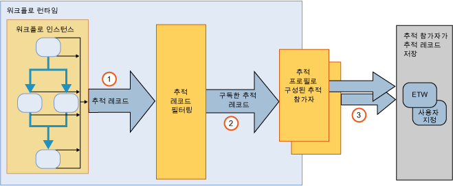

# 워크플로 추적
Windows Workflow 추적은 워크플로 실행을 쉽게 볼 수 있도록 디자인된 [!INCLUDE[netfx_current_long](../../../includes/netfx-current-long-md.md)] 기능입니다. 이 기능은 워크플로 인스턴스 실행을 추적하기 위한 추적 인프라를 제공합니다. WF 추적 인프라는 실행 중에 주요 이벤트를 반영하여 레코드를 내보내기 위한 워크플로를 투명하게 계측합니다. 기본적으로 모든 [!INCLUDE[netfx_current_short](../../../includes/netfx-current-short-md.md)] 워크플로에 이 기능을 사용할 수 있습니다. 추적을 수행하기 위해 [!INCLUDE[netfx_current_long](../../../includes/netfx-current-long-md.md)] 워크플로를 변경할 필요는 없습니다. 받으려는 추적 데이터의 양만 결정하면 됩니다. 워크플로 인스턴스가 시작되거나 완료되면 처리 추적 레코드가 내보내집니다. 추적에서 워크플로 변수와 연결된 비즈니스 관련 데이터를 추출할 수도 있습니다. 예를 들어, 워크플로가 주문 처리 시스템을 나타내는 경우 <xref:System.Activities.Tracking.TrackingRecord> 개체와 함께 주문 ID를 추출할 수 있습니다. 일반적으로 WF 추적을 사용하면 워크플로 실행에서 진단 또는 비즈니스 분석에 쉽게 액세스할 수 있습니다.  
  
 이 추적 구성 요소는 [!INCLUDE[vstecwinfx](../../../includes/vstecwinfx-md.md)]의 추적 서비스와 같습니다. [!INCLUDE[netfx_current_short](../../../includes/netfx-current-short-md.md)]에서는 WF 추적 기능에 맞게 성능이 향상되고 프로그래밍 모델이 단순화되었습니다. 추적 런타임은 워크플로 인스턴스를 계측하여 워크플로 수명 주기와 관련된 이벤트, 워크플로 활동 및 사용자 지정 이벤트를 내보냅니다.  
  
 Windows Server AppFabric은 WCF 및 워크플로 서비스의 실행을 모니터링하는 기능도 제공합니다. [!INCLUDE[crdefault](../../../includes/crdefault-md.md)][Windows Server App Fabric 모니터링](http://go.microsoft.com/fwlink/?LinkId=201273) 및 [Windows Server AppFabric로 응용 프로그램 모니터링](http://go.microsoft.com/fwlink/?LinkId=201287)  
  
 워크플로 런타임의 문제를 해결하기 위해 진단 워크플로 추적을 설정할 수 있습니다. [!INCLUDE[crdefault](../../../includes/crdefault-md.md)][워크플로 추적](../../../docs/framework/windows-workflow-foundation/workflow-tracing.md)합니다.  
  
 프로그래밍 모델을 이해할 수 있도록 이 항목에서는 추적 인프라의 주요 구성 요소를 설명합니다.  
  
-   워크플로 런타임에서 내보낸 <xref:System.Activities.Tracking.TrackingRecord> 개체입니다. [!INCLUDE[crdefault](../../../includes/crdefault-md.md)][추적 레코드](../../../docs/framework/windows-workflow-foundation/tracking-records.md)합니다.  
  
-   <xref:System.Activities.Tracking.TrackingParticipant> 개체는 <xref:System.Activities.Tracking.TrackingRecord> 개체를 구독합니다. 추적 참가자에는 <xref:System.Activities.Tracking.TrackingRecord> 개체에서 페이로드를 처리하기 위한 논리가 포함됩니다. 예를 들어 파일에 기록하도록 선택할 수 있습니다. [!INCLUDE[crdefault](../../../includes/crdefault-md.md)][추적 참가자에 게](../../../docs/framework/windows-workflow-foundation/tracking-participants.md)합니다.  
  
-   <xref:System.Activities.Tracking.TrackingProfile> 개체는 워크플로 인스턴스에서 내보낸 추적 레코드를 필터링합니다. [!INCLUDE[crdefault](../../../includes/crdefault-md.md)][추적 프로필](../../../docs/framework/windows-workflow-foundation/tracking-profiles.md)합니다.  
  
## 워크플로 추적 인프라  
 워크플로 추적 인프라는 게시 및 구독 패러다임을 따릅니다. 워크플로 인스턴스는 추적 레코드 게시자인 반면, 추적 레코드 구독자는 워크플로의 확장으로 등록됩니다. <xref:System.Activities.Tracking.TrackingRecord> 개체를 구독하는 이 확장을 추적 참가자라고 합니다. 추적 참가자는 <xref:System.Activities.Tracking.TrackingRecord> 개체에 액세스한 다음 해당 참가자에 정해진 방식으로 처리하는 확장성 지점입니다. 추적 인프라를 사용하면 보내기 추적 레코드에 필터를 적용하여 참가자가 레코드 하위 집합을 구독하도록 허용할 수 있습니다. 이 필터링 메커니즘은 추적 프로필 파일을 통해 완료됩니다.  
  
 다음 그림에서는 추적 인프라를 간략하게 보여 줍니다.  
  
   
  
## 섹션 내용  
 [추적 레코드](../../../docs/framework/windows-workflow-foundation/tracking-records.md)  
 워크플로 런타임이 내보내는 추적 레코드를 설명합니다.  
  
 [추적 프로필](../../../docs/framework/windows-workflow-foundation/tracking-profiles.md)  
 추적 프로필이 사용되는 방법을 설명합니다.  
  
 [추적 참가자](../../../docs/framework/windows-workflow-foundation/tracking-participants.md)  
 시스템 제공 추적 참가자를 사용하는 방법 또는 사용자 지정 추적 참가자를 만드는 방법을 설명합니다.  
  
 [워크플로 추적 구성](../../../docs/framework/windows-workflow-foundation/configuring-tracking-for-a-workflow.md)  
 워크플로 추적을 구성하는 방법을 설명합니다.  
  
 [워크플로 추적](../../../docs/framework/windows-workflow-foundation/workflow-tracing.md)  
 워크플로 추적을 디버깅하는 두 가지 방법을 설명합니다.  
  
 [추적을 사용하여 워크플로 실행 기간 확인](../../../docs/framework/windows-workflow-foundation/determining-workflow-execution-duration-using-tracing.md)  
 워크플로 응용 프로그램 실행 기간을 확인하기 위해 메시지 추적을 사용하는 방법을 설명합니다.  
  
## 참고 항목  
 [SQL 추적](../../../docs/framework/windows-workflow-foundation/samples/sql-tracking.md)
