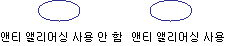

# 선과 곡선의 앤티 앨리어싱
사용 하는 경우 [!INCLUDE[ndptecgdiplus](../../../../includes/ndptecgdiplus-md.md)] 선을 그리려면, 시작 지점 및 끝 줄 지점을 제공 하지만 줄에서 개별 픽셀에 대 한 정보를 제공할 필요가 없습니다. [!INCLUDE[ndptecgdiplus](../../../../includes/ndptecgdiplus-md.md)] 픽셀 특정 디스플레이 장치에 줄을 표시 하도록 설정 됩니다 확인 하려면 디스플레이 드라이버 소프트웨어와 함께 작동 합니다.  
  
## 별칭 지정  
 에 바로 빨간색 선이 지점 (4, 2)에서 점 (16, 10)로 이동 하는 것이 좋습니다. 좌표 시스템의 왼쪽 위 모퉁이에 원점 측정 단위를은 픽셀이 고 가정 합니다. 또한 아래로 오른쪽와 y 축 지점에 x 축이 가리키는지 가정 합니다. 다음 그림에는 빨간색의 다양 한 색상 배경에 그려지는 선이 확대해 보여 줍니다.  
  
   
  
 줄을 렌더링 하는 데 빨간색 픽셀은 불투명 합니다. 줄에는 부분적으로 투명 하 게 픽셀이 없습니다. 이러한 유형의 줄 렌더링을 사용 하면 선이 가변된 모양 및 약간 계단 처럼 보입니다. 이 기술의 선을 계단식으로 표시할 앨리어싱이 라고 합니다. 계단 이론적인 줄에 대 한 별칭입니다.  
  
## 앤티 앨리어싱  
 줄을 렌더링 하기 위한 보다 정교한 기법에서는 불투명 한 픽셀과 함께 반투명 픽셀로 사용 합니다. 줄에는 정도 따라 빨간색과 배경색을 혼합 하 또는 픽셀 순수 빨간색으로 설정 됩니다. 이 유형의 렌더링 앤티 앨리어싱 라고 하며 결과 육안에 게 더 부드러운는 선이 있습니다. 다음 그림에서는 특정 픽셀 앤티 앨리어싱 선을 위해 배경색과 혼합 되는 방법을 보여 줍니다.  
  
   
  
 라고도 함, 다듬기 앤티 앨리어싱 곡선에 적용할 수도 있습니다. 다음 그림에서는 확대해 평활된 타원을 보여 줍니다.  
  
   
  
 다음 그림에는 실제 크기에 한 번 앤티 앨리어싱 앤티 앨리어싱 없이 한 번에 같은 타원 보여 줍니다.  
  
   
  
 선과 곡선의 앤티 앨리어싱 사용 하는 그리려는 인스턴스를 만들고는 <xref:System.Drawing.Graphics> 클래스 및 설정의 <xref:System.Drawing.Graphics.SmoothingMode%2A> 속성을 <xref:System.Drawing.Drawing2D.SmoothingMode.AntiAlias> 또는 <xref:System.Drawing.Drawing2D.SmoothingMode.HighQuality>합니다. 다음 중 하나를 호출 하는의 그리기 메서드 같은 <xref:System.Drawing.Graphics> 클래스입니다.  
  
 [!code-csharp[LinesCurvesAndShapes#81](../../../../samples/snippets/csharp/VS_Snippets_Winforms/LinesCurvesAndShapes/CS/Class1.cs#81)]
 [!code-vb[LinesCurvesAndShapes#81](../../../../samples/snippets/visualbasic/VS_Snippets_Winforms/LinesCurvesAndShapes/VB/Class1.vb#81)]  
  
## 참고 항목  
 <xref:System.Drawing.Drawing2D.SmoothingMode?displayProperty=nameWithType>  
 [선, 곡선 및 도형](../../../../docs/framework/winforms/advanced/lines-curves-and-shapes.md)  
 [방법: 텍스트에 앤티 앨리어싱 사용](../../../../docs/framework/winforms/advanced/how-to-use-antialiasing-with-text.md)
