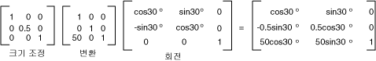

# 전역 및 지역 변형
전역 변환은 그려진 모든 항목에 적용 되는 변환을 주어진 <xref:System.Drawing.Graphics> 개체입니다. 반면, 로컬 변환을를 그릴 수 있는 특정 항목에 적용 하는 변환이입니다.  
  
## 전역 변환  
 전역 변환 생성, 구성는 <xref:System.Drawing.Graphics> 개체를 조작 다음 해당 <xref:System.Drawing.Graphics.Transform%2A> 속성입니다. <xref:System.Drawing.Graphics.Transform%2A> 속성은 한 <xref:System.Drawing.Drawing2D.Matrix> 관계 변환의 모든 시퀀스를 보유할 수 있는 개체입니다. 에 저장 된 변환은 <xref:System.Drawing.Graphics.Transform%2A> 속성은 전역 변환 이라고 합니다. <xref:System.Drawing.Graphics> 클래스에서는 복합 전역 변환을를 구축 하기 위한 여러 가지 방법: <xref:System.Drawing.Graphics.MultiplyTransform%2A>, <xref:System.Drawing.Graphics.RotateTransform%2A>, <xref:System.Drawing.Graphics.ScaleTransform%2A>, 및 <xref:System.Drawing.Graphics.TranslateTransform%2A>합니다. 다음 예제에서는 타원을 그립니다: 월드 변환과 후를 만들기 전에 한 번입니다. 변환을 y 방향의 0.5의 비율로 크기를 조정 다음 x 방향의 50 명의 단위 변환한 30도 회전 합니다.  
  
 [!code-csharp[System.Drawing.CoordinateSystems#21](../../../../samples/snippets/csharp/VS_Snippets_Winforms/System.Drawing.CoordinateSystems/CS/Class1.cs#21)]
 [!code-vb[System.Drawing.CoordinateSystems#21](../../../../samples/snippets/visualbasic/VS_Snippets_Winforms/System.Drawing.CoordinateSystems/VB/Class1.vb#21)]  
  
 다음 그림은 변환과 관련 된 매트릭스를 보여 줍니다.  
  
   
  
> [!NOTE]
>  앞의 예제에서 클라이언트 영역의 왼쪽 위 모퉁이에 있는 좌표계의 원점을 타원이 회전 합니다. 회전 중심을 관통 자체에 대 한 타원 결과 서로 다르게 생성 됩니다.  
  
## 로컬 변환  
 로컬 변환을를 그릴 수 있는 특정 항목에 적용 됩니다. 예를 들어 한 <xref:System.Drawing.Drawing2D.GraphicsPath> 개체에는 <xref:System.Drawing.Drawing2D.GraphicsPath.Transform%2A> 메서드를 해당 경로 대 한 데이터 요소를 변환할 수 있습니다. 다음 예제에서는 변환이 사용 되지 않은 사각형 및 회전 변환 사용 하 여 경로 그립니다. (세계 변환이 라고 가정 합니다.)  
  
 [!code-csharp[System.Drawing.CoordinateSystems#22](../../../../samples/snippets/csharp/VS_Snippets_Winforms/System.Drawing.CoordinateSystems/CS/Class1.cs#22)]
 [!code-vb[System.Drawing.CoordinateSystems#22](../../../../samples/snippets/visualbasic/VS_Snippets_Winforms/System.Drawing.CoordinateSystems/VB/Class1.vb#22)]  
  
 다양 한 결과 달성 하기 위해 로컬 변형과 월드 변환을 결합할 수 있습니다. 예를 들어 좌표 시스템을 수정 하 고 지역 변환을 사용 하 여 회전 하 고 새 좌표계에 나타나는 개체의 크기를 조정 하 월드 변환을 사용할 수 있습니다.  
  
 클라이언트 영역의 왼쪽된 가장자리에서 원본 200 픽셀 및 클라이언트 영역의 위쪽에서 150 픽셀 위치를 포함 하는 좌표계를 한다고 가정 합니다. 또한 x 축이 오른쪽 및 위쪽을 가리키는 y 축에는 픽셀 수를 측정 단위를 지정 하는 것으로 가정 합니다. 기본 좌표 시스템 가로 축을 따라 반사를 수행 해야 하므로 y 축은, 아래쪽에 있습니다. 다음 그림은 이러한 반사의 매트릭스를 보여 줍니다.  
  
   
  
 다음으로, 오른쪽에 200 단위를 이동 및 아래로 150 단위를 수행 해야 할 가정 합니다.  
  
 다음 예에서는 설정의 월드 변형과 설정 하 여 방금 설명한 좌표계는 <xref:System.Drawing.Graphics> 개체입니다.  
  
 [!code-csharp[System.Drawing.CoordinateSystems#23](../../../../samples/snippets/csharp/VS_Snippets_Winforms/System.Drawing.CoordinateSystems/CS/Class1.cs#23)]
 [!code-vb[System.Drawing.CoordinateSystems#23](../../../../samples/snippets/visualbasic/VS_Snippets_Winforms/System.Drawing.CoordinateSystems/VB/Class1.vb#23)]  
  
 다음 코드 (위 예의 끝에 위치)와 왼쪽 아래 모퉁이가 새 좌표계의 원점 단일 사각형으로 구성 된 경로 만듭니다. 사각형은 변환이 사용 되지 않은 로컬 한 번은 로컬 변환을 두 번 채워집니다. 가로 배율 2 30도 회전 하 여 로컬 변환으로 구성 됩니다.  
  
 [!code-csharp[System.Drawing.CoordinateSystems#24](../../../../samples/snippets/csharp/VS_Snippets_Winforms/System.Drawing.CoordinateSystems/CS/Class1.cs#24)]
 [!code-vb[System.Drawing.CoordinateSystems#24](../../../../samples/snippets/visualbasic/VS_Snippets_Winforms/System.Drawing.CoordinateSystems/VB/Class1.vb#24)]  
  
 다음은 새 좌표계와 두 개의 사각형입니다.  
  
   
  
## 참고 항목  
 [좌표계 및 변형](../../../../docs/framework/winforms/advanced/coordinate-systems-and-transformations.md)  
 [관리 GDI+에서 변형 사용](../../../../docs/framework/winforms/advanced/using-transformations-in-managed-gdi.md)
