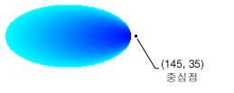

# 방법: 경로 그라데이션 만들기
<xref:System.Drawing.Drawing2D.PathGradientBrush> 클래스 점진적으로 색을 변경 하 여 도형 채우기 방법을 사용자 지정할 수 있습니다. 예를 들어 경로의 가운데에 대 한 한 가지 색 및 경로의 경계에 대 한 다른 색을 지정할 수 있습니다. 각 경로 경계를 따라 여러 지점에 대 한 별도 색을 지정할 수도 있습니다.  
  
> [!NOTE]
>  [!INCLUDE[ndptecgdiplus](../../../../includes/ndptecgdiplus-md.md)], 경로 일련의 선 및 곡선에서 유지 관리는 <xref:System.Drawing.Drawing2D.GraphicsPath> 개체입니다. 에 대 한 자세한 내용은 [!INCLUDE[ndptecgdiplus](../../../../includes/ndptecgdiplus-md.md)] 경로 참조 [GDI +의 그래픽 경로](../../../../docs/framework/winforms/advanced/graphics-paths-in-gdi.md) 및 [Constructing 및 그리기 경로](../../../../docs/framework/winforms/advanced/constructing-and-drawing-paths.md)합니다.  
  
### 타원을 채우는 그라데이션으로 경로  
  
-   다음 예제에서는 경로 그라데이션 브러시로 타원을 채웁니다. 중간 색을 파란색 설정과 경계 색 바다색으로 설정 됩니다. 다음 그림에서는 채워진된 타원을 보여 줍니다.  
  
       
  
     기본적으로 경로 그라데이션 브러시 경로의 경계 밖에 확장 되지 않습니다. 경로 그라데이션 브러시를 사용 하 여 그림 경로의 경계를 넘는 채울 경로 밖에 화면 영역 채워지지 않습니다.  
  
     다음 그림에서는 변경 하면 어떤 일이 생기는 <xref:System.Drawing.Graphics.FillEllipse%2A> 에 다음 코드를 호출 `e.Graphics.FillRectangle(pthGrBrush, 0, 10, 200, 40)`합니다.  
  
       
  
     [!code-csharp[System.Drawing.UsingaGradientBrush#11](../../../../samples/snippets/csharp/VS_Snippets_Winforms/System.Drawing.UsingaGradientBrush/CS/Class1.cs#11)]
     [!code-vb[System.Drawing.UsingaGradientBrush#11](../../../../samples/snippets/visualbasic/VS_Snippets_Winforms/System.Drawing.UsingaGradientBrush/VB/Class1.vb#11)]  
  
     이전 코드 예제는 Windows Forms에서 사용 하도록 설계 되었으며 필요는 <xref:System.Windows.Forms.PaintEventArgs> 매개 변수인 e의 <xref:System.Windows.Forms.PaintEventHandler>합니다.  
  
### 요소를 지정 하려면 경계에서  
  
-   다음 예제에서는 별 모양 경로에서 경로 그라데이션 브러시를 생성합니다. 코드 집합은 <xref:System.Drawing.Drawing2D.PathGradientBrush.CenterColor%2A> 속성으로, 빨강으로 별모양의 중심에서 색을 설정 합니다. 다음 코드 집합은 <xref:System.Drawing.Drawing2D.PathGradientBrush.SurroundColors%2A> 다양 한 색을 지정 하려면 속성 (에 저장 된는 `colors` 배열)의 개별 시점에서는 `points` 배열입니다. 코드의 마지막 문에서 별 모양 경로 경로 그라데이션 브러시를 채웁니다.  
  
     [!code-csharp[System.Drawing.UsingaGradientBrush#12](../../../../samples/snippets/csharp/VS_Snippets_Winforms/System.Drawing.UsingaGradientBrush/CS/Class1.cs#12)]
     [!code-vb[System.Drawing.UsingaGradientBrush#12](../../../../samples/snippets/visualbasic/VS_Snippets_Winforms/System.Drawing.UsingaGradientBrush/VB/Class1.vb#12)]  
  
-   다음 예제에서는 그립니다 없이 경로 그라데이션은 <xref:System.Drawing.Drawing2D.GraphicsPath> 코드에서 개체입니다. 특정 <xref:System.Drawing.Drawing2D.PathGradientBrush.%23ctor%2A> 예제의 생성자 점의 배열을 받지만 필요 하지 않습니다는 <xref:System.Drawing.Drawing2D.GraphicsPath> 개체입니다. 또한는 <xref:System.Drawing.Drawing2D.PathGradientBrush> 경로가 아닌 사각형을 채우는 데 사용 됩니다. 사각형은 사각형의 일부가 브러시 색칠 하지 하므로 브러시를 정의 하는 데 닫힌된 경로 보다 큽니다. 다음 그림에서는 사각형 (점선) 및 경로 그라데이션 브러시로 그린 사각형의 부분을 보여 줍니다.  
  
       
  
     [!code-csharp[System.Drawing.UsingaGradientBrush#13](../../../../samples/snippets/csharp/VS_Snippets_Winforms/System.Drawing.UsingaGradientBrush/CS/Class1.cs#13)]
     [!code-vb[System.Drawing.UsingaGradientBrush#13](../../../../samples/snippets/visualbasic/VS_Snippets_Winforms/System.Drawing.UsingaGradientBrush/VB/Class1.vb#13)]  
  
### 경로 그라데이션 사용자 지정 하려면  
  
-   경로 그라데이션 브러시를 사용자 지정 하는 한 가지 방법은 설정 하는 것은 <xref:System.Drawing.Drawing2D.PathGradientBrush.FocusScales%2A> 속성입니다. 주 경로 내에 있는 내부 경로 지정 합니다. 중간 색 중심점 뿐만 아니라 내부 경로의 everywhere 표시 됩니다.  
  
     다음 예제에서는 타원형 경로에 따라 경로 그라데이션 브러시를 만듭니다. 코드 경계 색을 파랑을 설정 하 고 센터 색 바다색을 설정 하 고 경로 그라데이션 브러시를 사용 하 여 타원형 경로 채웁니다.  
  
     다음으로 코드 포커스에 대 한 범위의 경로 그라데이션 브러시를 설정합니다. X 포커스 표시줄이 0.3, 설정 된 및 y 포커스 비율 0.8로 설정 합니다. 코드를 호출 하 여는 <xref:System.Drawing.Graphics.TranslateTransform%2A> 의 메서드는 <xref:System.Drawing.Graphics> 개체를 후속 호출에 <xref:System.Drawing.Graphics.FillPath%2A> 첫 번째 타원의 오른쪽에 있습니다. 타원을 채웁니다.  
  
     포커스 눈금의 결과 보려면 주 타원과 중심을 관통를 공유 하는 작은 타원 한다고 가정 합니다. 작은 (내부) 타원 가로로 크기가 조정 (가운데를 중심으로) 0.3의 비율로 및 0.8의 비율로 세로로 주 타원이입니다. 외부 타원의 경계에서 내부 타원의 경계를 이동 하면 색이 변경 점진적으로 파랑에서을 바다색 합니다. 공유 센터로 바다색 색은 유지 안쪽 타원의 경계에서에서 이동 합니다.  
  
     다음 그림에서는 다음 코드의 출력을 보여 줍니다. 왼쪽 타원 바다색 중심점에만 있습니다. 오른쪽 타원 바다색 내부 경로 내의 모든 곳이 있습니다.  
  
   
  
 [!code-csharp[System.Drawing.UsingaGradientBrush#14](../../../../samples/snippets/csharp/VS_Snippets_Winforms/System.Drawing.UsingaGradientBrush/CS/Class1.cs#14)]
 [!code-vb[System.Drawing.UsingaGradientBrush#14](../../../../samples/snippets/visualbasic/VS_Snippets_Winforms/System.Drawing.UsingaGradientBrush/VB/Class1.vb#14)]  
  
### 보간을 사용 하 여 사용자 지정 하려면  
  
-   경로 그라데이션 브러시를 사용자 지정 하는 다른 방법은 보간 색의 배열 및 삽입할 위치의의 배열을 지정 하는 것입니다.  
  
     다음 예제는 삼각형에 따라 경로 그라데이션 브러시를 만듭니다. 코드 집합은 <xref:System.Drawing.Drawing2D.PathGradientBrush.InterpolationColors%2A> 보간 색 (진한 녹색, 바다색, 파랑)의 배열 및 보간 위치 (0, 0.25, 1)의 배열을 지정 하는 경로 그라데이션 브러시 속성입니다. 중심점에 삼각형의 경계에서 이동 하면 색이 변경 점진적으로 진한 녹색 바다색 이동한 다음 바다색을 파랑에서 합니다. 진한 녹색 바다색 하 여 변경을 파랑 진한 녹색에서 거리의 25%에서 발생 합니다.  
  
     다음 그림에서는 사용자 지정 경로 그라데이션 브러시도 채워진 삼각형을 보여 줍니다.  
  
       
  
     [!code-csharp[System.Drawing.UsingaGradientBrush#15](../../../../samples/snippets/csharp/VS_Snippets_Winforms/System.Drawing.UsingaGradientBrush/CS/Class1.cs#15)]
     [!code-vb[System.Drawing.UsingaGradientBrush#15](../../../../samples/snippets/visualbasic/VS_Snippets_Winforms/System.Drawing.UsingaGradientBrush/VB/Class1.vb#15)]  
  
### 중심점을 설정 하려면  
  
-   기본적으로 경로 그라데이션 브러시의 중심점 브러시를 생성 하는 데 사용 되는 경로의 중심에는 있습니다. 설정 하 여 중심점의 위치를 변경할 수는 <xref:System.Drawing.Drawing2D.PathGradientBrush.CenterPoint%2A> 의 속성은 <xref:System.Drawing.Drawing2D.PathGradientBrush> 클래스입니다.  
  
     다음 예제에서는 타원에 따라 경로 그라데이션 브러시를 만듭니다. 타원의 중심에는 (70, 35)로 경로 그라데이션 브러시의 중심점 설정 되어 있지만 (120, 40).  
  
     [!code-csharp[System.Drawing.UsingaGradientBrush#16](../../../../samples/snippets/csharp/VS_Snippets_Winforms/System.Drawing.UsingaGradientBrush/CS/Class1.cs#16)]
     [!code-vb[System.Drawing.UsingaGradientBrush#16](../../../../samples/snippets/visualbasic/VS_Snippets_Winforms/System.Drawing.UsingaGradientBrush/VB/Class1.vb#16)]  
  
     다음 그림에서는 채워진된 타원 고 경로 그라데이션 브러시의 중심점.  
  
       
  
-   브러시를 만드는 데 사용한 경로 외부 위치 경로 그라데이션 브러시의 중심점을 설정할 수 있습니다. 다음 예제에서는 대체 설정 하는 호출 된 <xref:System.Drawing.Drawing2D.PathGradientBrush.CenterPoint%2A> 위의 코드에서 속성입니다.  
  
     [!code-csharp[System.Drawing.UsingaGradientBrush#17](../../../../samples/snippets/csharp/VS_Snippets_Winforms/System.Drawing.UsingaGradientBrush/CS/Class1.cs#17)]
     [!code-vb[System.Drawing.UsingaGradientBrush#17](../../../../samples/snippets/visualbasic/VS_Snippets_Winforms/System.Drawing.UsingaGradientBrush/VB/Class1.vb#17)]  
  
     다음 그림에서는 이러한 변경으로 인해 출력을 보여 줍니다.  
  
       
  
     앞의 그림에는 타원의 맨 오른쪽에 있는 지점의 없는 순수 파란색 (매우 유사 하지만). 채우기 색 (0, 0, 255) 순수 파랑 수 없는 지점 (145, 35)에 도달 하는 경우 색 그라데이션에 배치 됩니다. 채우기에 도달 하지만 (145, 35) 경로 그라데이션 브러시 경로 안쪽만 때문에 있습니다.  
  
## 코드 컴파일  
 앞의 예제에서는 Windows Forms에서 사용 하도록 설계 되었으며 필요한 <xref:System.Windows.Forms.PaintEventArgs> `e`의 매개 변수는 <xref:System.Windows.Forms.Control.Paint> 이벤트 처리기입니다.  
  
## 참고 항목  
 [그라데이션 브러시를 사용하여 도형 채우기](../../../../docs/framework/winforms/advanced/using-a-gradient-brush-to-fill-shapes.md)
