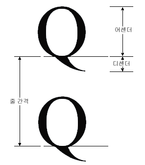

# 방법: 글꼴 메트릭 얻기
<xref:System.Drawing.FontFamily> 클래스에는 특정 패밀리\/스타일 조합을 위한 다양한 메트릭을 가져오는 다음과 같은 메서드가 있습니다.  
  
-   <xref:System.Drawing.FontFamily.GetEmHeight%2A>\(FontStyle\)  
  
-   <xref:System.Drawing.FontFamily.GetCellAscent%2A>\(FontStyle\)  
  
-   <xref:System.Drawing.FontFamily.GetCellDescent%2A>\(FontStyle\)  
  
-   <xref:System.Drawing.FontFamily.GetLineSpacing%2A>\(FontStyle\)  
  
 이러한 메서드에서 반환되는 숫자는 글꼴 디자인 단위를 사용하므로 특정 <xref:System.Drawing.Font> 개체의 크기 및 단위와 관계가 없습니다.  
  
 아래 그림에 다양한 매트릭이 나와 있습니다.  
  
   
  
## 예제  
 아래 예제에서는 Arial 글꼴 패밀리의 보통 스타일에 대한 매트릭을 표시합니다.  또한 이 코드에서는 Arial 패밀리를 기반으로 크기가 16픽셀인 <xref:System.Drawing.Font> 개체를 만들고 이 <xref:System.Drawing.Font> 개체에 대한 메트릭을 픽셀 단위로 표시합니다.  
  
 다음 그림은 예제 코드의 실행 결과를 보여 줍니다.  
  
   
  
 위 그림에 나타난 출력에서 처음 두 줄에 유의해야 합니다.  <xref:System.Drawing.Font> 개체는 크기 값 16을 반환하고 <xref:System.Drawing.FontFamily> 개체는 em 높이 값 2,048을 반환합니다.  이러한 두 값\(16과 2,048\)은 글꼴 디자인 단위와 <xref:System.Drawing.Font> 개체의 단위\(이 예제의 경우 픽셀\)를 변환하는 데 반드시 필요합니다.  
  
 예를 들어, 다음과 같이 디자인 단위에서 픽셀 단위로 변환할 수 있습니다.  
  
   
  
 다음 코드에서는 <xref:System.Drawing.PointF> 개체의 <xref:System.Drawing.PointF.Y%2A> 데이터 멤버를 설정하여 텍스트를 세로로 배치합니다.  y 좌표는 텍스트 줄이 새로 추가될 때마다 `font.Height`만큼 증가합니다.  <xref:System.Drawing.Font> 개체의 <xref:System.Drawing.Font.Height%2A> 속성은 해당 <xref:System.Drawing.Font> 개체에 대한 줄 간격을 픽셀 단위로 반환합니다.  이 예제의 경우 <xref:System.Drawing.Font.Height%2A>에서 반환되는 값은 19입니다.  이 값은 줄 간격 메트릭을 픽셀로 변환하여 얻은 값\(정수로 반올림\)과 같습니다.  
  
 크기 또는 em 크기라고도 하는 em 높이는 기준선 위와 아래의 크기 합계가 아닙니다.  기준선 위와 아래의 크기 합계는 셀 높이라고 합니다.  셀 높이에서 내부 여백을 뺀 크기가 em 높이입니다.  또한 셀 높이에 외부 여백을 더한 값이 줄 간격입니다.  
  
 [!code-csharp[System.Drawing.FontsAndText#71](../../../../samples/snippets/csharp/VS_Snippets_Winforms/System.Drawing.FontsAndText/CS/Class1.cs#71)]
 [!code-vb[System.Drawing.FontsAndText#71](../../../../samples/snippets/visualbasic/VS_Snippets_Winforms/System.Drawing.FontsAndText/VB/Class1.vb#71)]  
  
## 코드 컴파일  
 앞의 예제는 Windows Forms에서 사용해야 하며 <xref:System.Windows.Forms.PaintEventHandler>의 매개 변수인 <xref:System.Windows.Forms.PaintEventArgs> `e`를 필요로 합니다.  
  
## 참고 항목  
 [Windows Forms의 그래픽 및 그리기](../../../../docs/framework/winforms/advanced/graphics-and-drawing-in-windows-forms.md)   
 [글꼴 및 텍스트 사용](../../../../docs/framework/winforms/advanced/using-fonts-and-text.md)