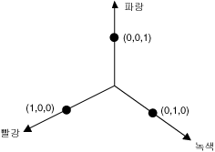
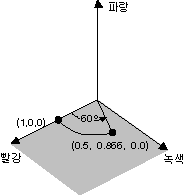
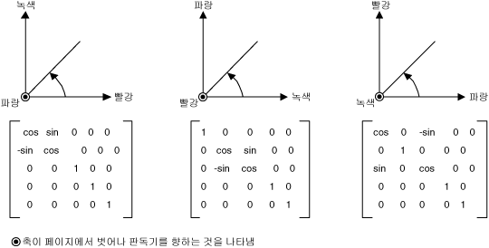
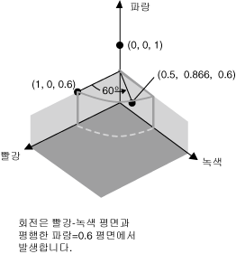

# 방법: 색 회전
4차원 색 공간에서 회전을 시각적으로 표시하기는 어렵습니다.  색 구성 요소 중 하나가 고정되어 있다고 가정하면 좀 더 쉽게 회전을 시각적으로 나타낼 수 있습니다.  알파 구성 요소를 1\(완전 불투명\)로 고정한다고 가정합니다.  그러면 아래 그림과 같이 빨강, 녹색 및 파랑 구성 요소에 대한 축을 가진 3차원 색 공간을 시각적으로 나타낼 수 있습니다.  
  
   
  
 색을 3차원 공간에 있는 점으로 생각할 수 있습니다.  예를 들어, 3차원 공간에서 점 \(1, 0, 0\)은 빨강을 나타내며 점 \(0, 1, 0\)은 녹색을 나타냅니다.  
  
 아래 그림에서는 색 \(1, 0, 0\)을 빨강\-녹색 평면에서 60도 회전하면 어떻게 되는지를 보여 줍니다.  빨강\-녹색 평면과 평행한 평면에서 회전하는 것은 파랑 구성 요소의 축을 중심으로 회전하는 것과 같습니다.  
  
   
  
 아래 그림에서는 세 좌표축\(빨강, 녹색, 파랑\) 각각을 중심으로 회전하기 위해 색 매트릭스를 초기화하는 방법을 보여 줍니다.  
  
   
  
## 예제  
 아래 예제에서는 모두 같은 색\(1, 0, 0.6\)으로 되어 있는 이미지에 파랑 요소의 축을 중심으로 60도 회전하는 변환을 적용합니다.  회전은 빨강\-녹색 평면과 평행한 평면에서 이루어집니다.  
  
 아래 그림에서 왼쪽은 원래 이미지이고 오른쪽은 색 회전을 적용한 이미지입니다.  
  
   
  
 다음 그림에서는 아래 코드에서 수행되는 색 회전을 시각적으로 보여 줍니다.  
  
   
  
 [!code-csharp[System.Drawing.RotateColors#1](../../../../samples/snippets/csharp/VS_Snippets_Winforms/System.Drawing.RotateColors/CS/Form1.cs#1)]
 [!code-vb[System.Drawing.RotateColors#1](../../../../samples/snippets/visualbasic/VS_Snippets_Winforms/System.Drawing.RotateColors/VB/Form1.vb#1)]  
  
## 코드 컴파일  
 앞의 예제는 Windows Forms에서 사용해야 하며 <xref:System.Windows.Forms.Control.Paint> 이벤트 처리기의 매개 변수인 <xref:System.Windows.Forms.PaintEventArgs> `e`를 필요로 합니다.  `RotationInput.bmp`를 시스템에서 사용할 수 있는 이미지 파일 이름 및 경로로 바꾸십시오.  
  
## 참고 항목  
 <xref:System.Drawing.Imaging.ColorMatrix>   
 <xref:System.Drawing.Imaging.ImageAttributes>   
 [Windows Forms의 그래픽 및 그리기](../../../../docs/framework/winforms/advanced/graphics-and-drawing-in-windows-forms.md)   
 [이미지 다시 칠하기](../../../../docs/framework/winforms/advanced/recoloring-images.md)