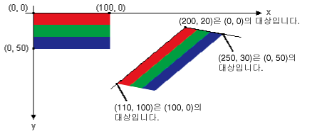

# 방법: 이미지 회전, 반사 및 기울이기
원래 이미지의 왼쪽 위, 오른쪽 위 및 왼쪽 아래 모퉁이에 대한 대상 지점을 지정하여 이미지를 회전하고 반사하고 기울일 수 있습니다.  세 개의 대상 지점에 따라 원래의 사각형 이미지를 평행 사변형으로 매핑하는 상관 변환이 결정됩니다.  
  
## 예제  
 예를 들어, 원래 이미지의 왼쪽 위 모퉁이가 \(0, 0\), 오른쪽 위 모퉁이가 \(100, 0\), 왼쪽 아래 모퉁이가 \(0, 50\)인 사각형이 있습니다.  이제 이 세 지점을 다음과 같이 대상 지점에 매핑한다고 가정합니다.  
  
|원래 지점|대상 지점|  
|-----------|-----------|  
|왼쪽 위\(0, 0\)|\(200, 20\)|  
|오른쪽 위\(100, 0\)|\(110, 100\)|  
|왼쪽 아래\(0, 50\)|\(250, 30\)|  
  
 아래 그림에서는 원래 이미지 및 평행 사변형으로 매핑된 이미지를 보여 줍니다.  여기서는 원래 이미지를 기울이고, 반사하고, 회전 및 이동했습니다.  원래 이미지의 위쪽 가장자리에 있는 x 축은 \(200, 20\)에서 \(110, 100\)까지 연결하는 선에 매핑됩니다.  원래 이미지의 왼쪽 가장자리에 있는 y 축은 \(200, 20\)에서 \(250, 30\)을 지나는 선에 매핑됩니다.  
  
   
  
 아래 그림에서는 이와 유사한 변환을 사진 이미지에 적용한 결과를 보여 줍니다.  
  
   
  
 아래 그림에서는 이와 유사한 변환을 메타파일에 적용한 결과를 보여 줍니다.  
  
   
  
 아래 예제에서는 첫 번째 그림에 나타난 이미지를 만듭니다.  
  
 [!code-csharp[System.Drawing.WorkingWithImages#61](../../../../samples/snippets/csharp/VS_Snippets_Winforms/System.Drawing.WorkingWithImages/CS/Class1.cs#61)]
 [!code-vb[System.Drawing.WorkingWithImages#61](../../../../samples/snippets/visualbasic/VS_Snippets_Winforms/System.Drawing.WorkingWithImages/VB/Class1.vb#61)]  
  
## 코드 컴파일  
 앞의 예제는 Windows Forms에서 사용해야 하며 <xref:System.Windows.Forms.Control.Paint> 이벤트 처리기의 매개 변수인 <xref:System.Windows.Forms.PaintEventArgs> `e`를 필요로 합니다.  `Stripes.bmp`를 시스템에서 사용할 수 있는 이미지에 대한 경로로 바꿔야 합니다.  
  
## 참고 항목  
 [이미지, 비트맵, 아이콘 및 메타파일 사용](../../../../docs/framework/winforms/advanced/working-with-images-bitmaps-icons-and-metafiles.md)