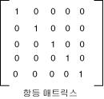

# 방법: 색 매트릭스를 사용하여 단색으로 변환
[!INCLUDE[ndptecgdiplus](../../../../includes/ndptecgdiplus-md.md)]에서는 이미지를 저장 및 조작하기 위한 <xref:System.Drawing.Image> 및 <xref:System.Drawing.Bitmap> 클래스를 제공합니다.  <xref:System.Drawing.Image> 및 <xref:System.Drawing.Bitmap> 개체에는 빨강, 녹색, 파랑 및 알파 각각에 대해 8비트씩 모두 32비트 숫자로 각 픽셀의 색이 저장됩니다.  네 가지 구성 요소 각각은 0부터 255까지의 숫자이며 여기서 0은 농도가 없음을 나타내고 255는 농도가 100%임을 나타냅니다.  알파 구성 요소는 색의 투명도를 나타냅니다. 0은 완전 투명이고 255는 완전 불투명입니다.  
  
 색 벡터는 이러한 네 가지 구성 요소\(빨강, 녹색, 파랑 및 알파\)가 조합되어 구성됩니다.  예를 들어, 색 벡터 \(0, 255, 0, 255\)는 빨강 및 파랑 요소는 없고 녹색 요소의 농도가 100%인 불투명 색을 나타냅니다.  
  
 색을 표시하는 또다른 규칙에서는 100% 농도를 숫자 1로 나타냅니다.  이 규칙을 사용하여 위 단락에서 설명한 색을 표시하면 벡터 \(0, 1, 0, 1\)이 됩니다.  [!INCLUDE[ndptecgdiplus](../../../../includes/ndptecgdiplus-md.md)]에서는 색을 변환할 때 100% 농도를 숫자 1로 나타내는 규칙을 사용합니다.  
  
 색 벡터에 4×4 매트릭스를 곱하여 회전, 배율 조정 같은 선형 변환을 색 벡터에 적용할 수 있습니다.  그러나 이동 등의 비선형 변환을 수행할 때는 4×4 매트릭스를 사용할 수 없습니다.  색 벡터 각각에 다섯 번째 더미 좌표\(예: 숫자 1\)를 추가할 경우, 5×5 매트릭스를 사용하여 선형 변환과 이동을 마음대로 조합하여 적용할 수 있습니다.  선형 변환 다음에 이동이 이어지는 변환을 상관 변환이라고 합니다.  
  
 예를 들어, 색 \(0.2, 0.0, 0.4, 1.0\)에서 시작하여 아래와 같은 변환을 적용한다고 가정합니다.  
  
1.  빨강 구성 요소를 두 배로 늘립니다.  
  
2.  빨강, 녹색 및 파랑 구성 요소에 0.2를 더합니다.  
  
 아래의 매트릭스 곱에서는 나열된 순서대로 변환이 수행됩니다.  
  
   
  
 색 매트릭스의 요소에는 0부터 시작되는 인덱스가 행과 열의 순으로 부여됩니다.  예를 들어, 매트릭스 M에서 다섯 번째 행과 세 번째 열에 있는 엔트리는 M\[4\]\[2\]입니다.  
  
 다음 그림에서 5×5 항등 매트릭스의 대각선에는 1이 있고 그 외 위치에는 0이 있습니다.  색 벡터에 항등 매트릭스를 곱할 경우 색 벡터는 변경되지 않습니다.  항등 매트릭스에서 시작하여 원하는 변환이 이루어질 때까지 조금씩 변경하면 색 변환의 매트릭스를 간편하게 구성할 수 있습니다.  
  
   
  
 매트릭스와 변환에 대한 자세한 내용은[좌표계 및 변환](../../../../docs/framework/winforms/advanced/coordinate-systems-and-transformations.md)을 참조하십시오.  
  
## 예제  
 아래 예제에서는 모두 같은 색\(0.2, 0.0, 0.4, 1.0\)으로 되어 있는 이미지에 이전 단락에서 설명한 변환을 적용합니다.  
  
 아래 그림에서 왼쪽은 원래 이미지이고 오른쪽은 변환된 이미지입니다.  
  
   
  
 다음 예제의 코드에서는 아래와 같은 단계에 따라 다시 칠하기를 수행합니다.  
  
1.  <xref:System.Drawing.Imaging.ColorMatrix> 개체를 초기화합니다.  
  
2.  <xref:System.Drawing.Imaging.ImageAttributes> 개체를 만들고 <xref:System.Drawing.Imaging.ColorMatrix> 개체를 <xref:System.Drawing.Imaging.ImageAttributes> 개체의 <xref:System.Drawing.Imaging.ImageAttributes.SetColorMatrix%2A> 메서드에 전달합니다.  
  
3.  <xref:System.Drawing.Imaging.ImageAttributes> 개체를 <xref:System.Drawing.Graphics> 개체의 <xref:System.Drawing.Graphics.DrawImage%2A> 메서드에 전달합니다.  
  
 [!code-csharp[System.Drawing.RecoloringImages#21](../../../../samples/snippets/csharp/VS_Snippets_Winforms/System.Drawing.RecoloringImages/CS/Class1.cs#21)]
 [!code-vb[System.Drawing.RecoloringImages#21](../../../../samples/snippets/visualbasic/VS_Snippets_Winforms/System.Drawing.RecoloringImages/VB/Class1.vb#21)]  
  
## 코드 컴파일  
 앞의 예제는 Windows Forms에서 사용해야 하며 <xref:System.Windows.Forms.Control.Paint> 이벤트 처리기의 매개 변수인 <xref:System.Windows.Forms.PaintEventArgs> `e`를 필요로 합니다.  
  
## 참고 항목  
 [이미지 다시 칠하기](../../../../docs/framework/winforms/advanced/recoloring-images.md)   
 [좌표계 및 변환](../../../../docs/framework/winforms/advanced/coordinate-systems-and-transformations.md)