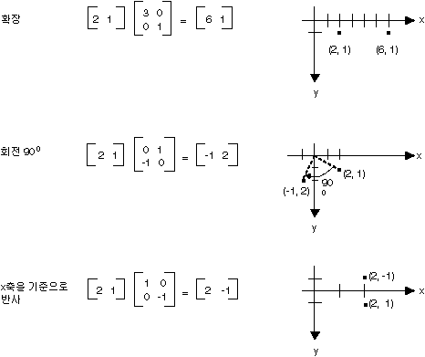
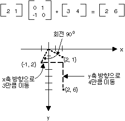
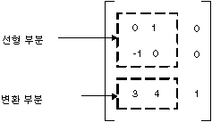

# 매트릭스에 의한 변형 표시
m × n 행렬은 행 m과 n 개의 열으로 정렬 하는 숫자 집합입니다. 다음 그림에서는 몇 가지 매트릭스를 보여 줍니다.  
  
   
  
 개별 요소를 추가 하 여 동일한 크기의 두 행렬을 추가할 수 있습니다. 다음은 매트릭스 더하기는 두 가지 예입니다.  
  
   
  
 결과 m × p 매트릭스를 m × n 매트릭스 n × p 매트릭스는 곱하고 수 수 있습니다. 첫 번째 행렬의 열 수가 두 번째 행렬의 행 수와 같아야 합니다. 예를 들어 4 × 2 매트릭스 4 × 3 매트릭스를 생성 하기 위해 2 × 3 매트릭스를 곱한 수 있습니다.  
  
 행렬의 열 및 행 평면에서 점 벡터도 생각할 수 있습니다. 예를 들어, (2, 5)는 두 가지 구성 요소를 사용 하 여 벡터 및 (3, 7, 1) 세 요소로 구성 된 벡터입니다. 두 벡터의 내적을 다음과 같이 정의 됩니다.  
  
 (a, b) * (c, d) = ac + bd  
  
 (a, b, c) (d, e, f) * + = ad + cf  
  
 예를 들어 내적 (2, 3) 및 (5, 4)는 (2)(5) + (3)(4) = 22입니다. (2, 5, 1)의 내적 및 (4, 3, 1)은 (2)(4) + (5)(3) + (1)(1) = 24입니다. 참고 두 벡터의 내적은 숫자를 다른 벡터입니다. 또한 참고가 두 벡터 동일한 구성 요소 수를 포함 하는 경우에 내적을 계산할 수 있습니다.  
  
 Let A(i, j) i 번째 행과 열에 있는 엔트리입니다 매트릭스 A에에서 있는 항목 수 있습니다. 예를 들어 A (3, 2)는 세 번째 행과 두 번째 열에는 행렬에 대 한 항목입니다. A, B 및 C는 행렬 및 AB 가정가 됩니다. C의 항목은 다음과 같이 계산 됩니다.  
  
 C (i, j) = (i/A 행) • (B 열의 j)  
  
 다음은 매트릭스 곱의 몇 가지 예입니다.  
  
   
  
 1 × 2 행렬으로 평면에 있는 점의 생각 되 면 해당 지점 2 × 2 매트릭스를 곱하여 변형할 수 있습니다. 다음 그림에서는 점 (2, 1)에 적용 하는 몇몇 변환이 보여 줍니다.  
  
   
  
 위 그림에 나타난 모두 선형 변환 하십시오. 같은 다른 변환은 특정 선형이 아니므로 하 고 2 × 2 매트릭스 곱으로 표현 될 수 없습니다. 한다고 가정 시작 하 여 점 (2, 1), 90도 회전, x 방향의 3 단위 및 4 단위 y 방향으로 변환 합니다. 뒤에 여는 행렬 곱하기를 사용 하 여이 수행할 수 있습니다.  
  
   
  
 선형 변환 (2 × 2 행렬에서 곱하기) (1 × 2 매트릭스 더하기) 번역 다음 3x3 유사 변환을 이라고 합니다. 3x3 유사 변형 행렬 (선형 부분에 대 한 1) 및 변환에 대 한 쌍에 저장 하는 대신 3 × 3 행렬의 전체 변환을 저장 하는 것입니다. 이 작업을 하려면 평면에서 점은 세 번째 좌표가 더미와 1 × 3 행렬에 저장 되어야 합니다. 일반적으로 모든 세 번째 좌표를 1로 확인 합니다. 예를 들어 점 (2, 1) 행렬 [2 1 1]로 표시 됩니다. 다음 그림과 유사 변환 (90도 회전, 3 방향으로에서 단위 x, y 방향의 4 단위 변환) 단일 3 × 3 매트릭스 곱으로 표현 됩니다.  
  
   
  
 앞의 예제에서 점 (2, 1) 점 (2, 6)에 매핑됩니다. Note 숫자 0, 0, 1 3 × 3 행렬의 세 번째 열에 포함 되도록 합니다. 이 3x3 유사 변환의 3 × 3 행렬의 경우 항상 됩니다. 중요 한 번호는 1과 2 열에 6 개의 숫자입니다. 행렬의 왼쪽 위 2 × 2 부분은 변환의 선형 부분을 나타내고, 세 번째 행의 처음 두 항목 번역을 나타냅니다.  
  
   
  
 [!INCLUDE[ndptecgdiplus](../../../../includes/ndptecgdiplus-md.md)] 는 3x3 유사 변형에 저장할 수 있습니다는 <xref:System.Drawing.Drawing2D.Matrix> 개체입니다. 나타내는 3x3 유사 변형 매트릭스의 세 번째 열은 항상 때문에 (0, 0, 1)을 만들 때 처음 두 열에 있는 6 개의 숫자만 지정는 <xref:System.Drawing.Drawing2D.Matrix> 개체입니다. 문이 `Matrix myMatrix = new Matrix(0, 1, -1, 0, 3, 4)` 앞의 그림에 표시 된 매트릭스를 구성 합니다.  
  
## 합성 변형  
 복합 변환에는 다른 뒤에 오는 단일 변환의 시퀀스입니다. 매트릭스 및 다음 목록에는 변환을 고려 합니다.  
  
|||  
|-|-|  
|매트릭스 A|90도 회전|  
|매트릭스 B|X 방향으로 2의 비율로 크기 조정|  
|C 매트릭스|Y 방향의 3 단위|  
  
 점 (2, 1)으로 시작 하는 경우-행렬 [2 1 1]로 표시-A, B, C, 점 (2, 1)에 나열 된 순서로 세 가지 변환 될 예정 다음 곱하면 합니다.  
  
 [2 1 1]ABC = [-2 5 1]  
  
 대신 세 개의 별도 행렬에 복합 변환의 세 부분을 저장, A, 곱하기 수 B 및 C 함께 전체 복합 변환을 저장 하는 단일 3 × 3 행렬을 가져옵니다. ABC 가정 = D D를 곱하면 A, B, C 곱하면와 동일한 결과 제공 하는 다음  
  
 [2 1 1]D = [-2 5 1]  
  
 다음 그림 A "," B "," C "및" 4. 매트릭스를 보여 줍니다.  
  
   
  
 개별 변형 매트릭스를 곱하여 복합 변환 매트릭스를 만들 수 있습니다 팩트 관계 변환 시퀀스는 단일에 저장할 수 있습니다 의미 <xref:System.Drawing.Drawing2D.Matrix> 개체입니다.  
  
> [!CAUTION]
>  복합 변환의 순서가 중요 합니다. 일반적으로, 다음 크기 조정, 이동을 차례로 동일 하지는 않습니다 눈금으로 한 후를 회전 하 고 변환 합니다. 마찬가지로, 매트릭스 곱의 순서는 중요 합니다. 일반적으로 ABC는 하지 하기와 동일 합니다.  
  
 <xref:System.Drawing.Drawing2D.Matrix> 클래스 복합 변환을 구성 하는 여러 가지 방법을 제공: <xref:System.Drawing.Drawing2D.Matrix.Multiply%2A>, <xref:System.Drawing.Drawing2D.Matrix.Rotate%2A>, <xref:System.Drawing.Drawing2D.Matrix.RotateAt%2A>, <xref:System.Drawing.Drawing2D.Matrix.Scale%2A>, <xref:System.Drawing.Drawing2D.Matrix.Shear%2A>, 및 <xref:System.Drawing.Drawing2D.Matrix.Translate%2A>합니다. 다음 예제에서는 30도 회전 다음 y 방향으로 2 배 하 여 확장 한 다음 x 방향의 5 단위를 변환 하는 복합 변환 행렬을 만듭니다.  
  
 [!code-csharp[System.Drawing.CoordinateSystems#11](../../../../samples/snippets/csharp/VS_Snippets_Winforms/System.Drawing.CoordinateSystems/CS/Class1.cs#11)]
 [!code-vb[System.Drawing.CoordinateSystems#11](../../../../samples/snippets/visualbasic/VS_Snippets_Winforms/System.Drawing.CoordinateSystems/VB/Class1.vb#11)]  
  
 다음은 행렬입니다.  
  
   
  
## 참고 항목  
 [좌표계 및 변형](../../../../docs/framework/winforms/advanced/coordinate-systems-and-transformations.md)  
 [관리 GDI+에서 변형 사용](../../../../docs/framework/winforms/advanced/using-transformations-in-managed-gdi.md)
