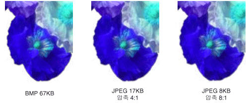

# 비트맵의 유형
비트맵은 픽셀의 사각형 배열에 있는 각 픽셀의 색을 지정하는 비트의 배열입니다.  각 픽셀에 사용되는 비트의 수는 해당 픽셀에 할당될 색 수를 결정합니다.  예를 들어, 각 픽셀이 4비트로 표현될 경우 주어진 픽셀은 16 가지 색 중 하나로\(2^4 \= 16\) 할당될 수 있습니다.  다음 표는 주어진 비트 수로 표현되는 픽셀에 할당될 수 있는 색 수의 예를 몇 가지 보여 줍니다.  
  
|픽셀 당 비트 수|픽셀에 할당될 수 있는 색 수|  
|---------------|----------------------|  
|1|2^1 \= 2|  
|2|2^2 \= 4|  
|4|2^4 \= 16|  
|8|2^8 \= 256|  
|16|2^16 \= 65,536|  
|24|2^24 \= 16,777,216|  
  
 비트맵을 저장하는 디스크 파일은 일반적으로 픽셀 당 비트 수, 각 행의 픽셀 수 및 배열의 행 개수 등과 같은 정보를 저장하는 정보 블록을 하나 이상 포함합니다.  또한 이러한 파일은 기본 색상표라고도 하는 색상표를 포함합니다.  색상표는 비트맵의 수를 특정 색에 대응시킵니다.   다음 그림은 확대된 이미지와 이 이미지의 비트맵 및 색상표를 보여 줍니다.  각 픽셀은 4비트 수로 표현되기 때문에 색상표에는 2^4 \= 16 가지의 색이 있습니다.  표에 있는 각 색은 빨강 8비트, 녹색  8비트, 파랑 8비트로 이루어진 총 24비트 수로 표현됩니다.  숫자는 16진수 형태로 표시되므로 A \= 10, B \= 11, C \= 12, D \= 13, E \= 14, F \= 15를 나타냅니다.  
  
   
  
 이미지의 3 행, 5 열의 픽셀을 보십시오.  비트맵에서 대응되는 수는 1입니다.  색상표에 따르면 1은 빨강이기 때문에 이 픽셀은 빨강입니다.  비트맵에서 맨 위 행의 모든 항목은 3입니다.  색상표에 따르면 3은 파랑을 나타내기 때문에 이미지에서 맨 위 행의 모든 픽셀은 파랑입니다.  
  
> [!NOTE]
>  일부 비트맵은 역순으로 저장됩니다. 이러한 비트맵의 첫 번째 행에 있는 숫자는 이미지의 마지막 행에 있는 픽셀에 해당합니다.  
  
 색상표에 인덱스를 저장하는 비트맵을 색상표에 인덱싱된 비트맵이라고 합니다.  어떤 비트맵은 색상표가 필요 없습니다.  예를 들어, 비트맵이 픽셀 당 24비트를 사용한다면,  이 비트맵은 색상표에 인덱스를 저장하기보다 색을 자체적으로 저장할 수 있습니다.   다음 그림은 색상표를 사용하지 않고 픽셀 당 24비트로 색을 직접 저장하는 비트맵을 보여 줍니다.  그림은 또한 확대된 대응 이미지를 보여 줍니다.  비트맵에서 FFFFFF는 흰색, FF0000은 빨강, 00FF00은 녹색, 0000FF는 파랑을 나타냅니다.  
  
   
  
## 그래픽 파일 형식  
 다양한 표준 형식을 사용하여 비트맵을 디스크 파일에 저장할 수 있습니다.  [!INCLUDE[ndptecgdiplus](../../../../includes/ndptecgdiplus-md.md)]에서는 다음 단락에서 설명하는 그래픽 파일 형식을 지원합니다.  
  
### BMP  
 BMP는 Windows에서 장치 또는 응용 프로그램에 구애받지 않고 독립적으로 이미지를 저장하기 위해 사용하는 표준 형식입니다.  주어진 BMP 파일의 픽셀 당 비트 수\(1, 4, 8, 15, 24, 32, 64\)는 파일 헤더에 지정됩니다.  픽셀 당 24비트인 BMP 파일이 일반적입니다.  대개 BMP 파일은 압축되지 않으므로 인터넷을 통해 전송하는 데 적합하지 않습니다.  
  
### GIF\(Graphics Interchange Format\)  
 GIF는 웹 페이지에 나타나는 이미지의 일반적인 형식입니다.  GIF는 선을 그리거나 단색 블록이 있는 그림 및 색 사이에 선명한 경계선이 있는 그림에 잘 동작합니다.  GIF는 압축되지만 압축 과정에서 손실되는 정보는 없습니다. 압축 해제된 이미지는 원래 이미지와 완전히 동일합니다.  GIF 중 한 색을 투명하게 지정하여 이미지의 배경색을 이 이미지를 표시하는 웹 페이지 색과 같도록 만들 수 있습니다.  GIF 이미지의 시퀀스는 단일 파일에 저장되어 애니메이션 GIF를 형성할 수 있습니다.  GIF는 픽셀 당 최대 8비트를 저장할 수 있기 때문에 256 색상으로 제한됩니다.  
  
### JPEG\(Joint Photographic Experts Group\)  
 JPEG는 스캐닝한 사진과 같이 자연스런 장면에 잘 작동하는 압축 방식입니다.  압축 과정에서 일부 정보가 손실되나 이러한 손실은 사람의 눈으로 감지할 수 없습니다 .  JPEG는 픽셀 당 24비트를 저장하기 때문에 천 6 백만 색 이상을 표시할 수 있습니다.  JPEG는 투명성 또는 애니메이션을 지원하지 않습니다.  
  
 JPEG 이미지에서는 압축 수준을 구성할 수 있으나 압축 수준이 높을수록, 즉 파일이 작아질수록 정보 손실률이 높아집니다.  흔히 20:1 압축률을 사용해도 사람의 눈으로 원본과 구분하기 어려운 이미지가 만들어집니다.  다음 그림은 BMP 이미지와 이 BMP 이미지를 압축한 JPEG 이미지 두 개를 보여 줍니다.  첫 번째 JPEG는 압축률이 4:1이고 두 번째 JPEG는 압축률이 8:1입니다.  
  
   
  
 JPEG 압축은 선을 그리거나 단색 블록 및 선명한 경계선이 있을 경우에는 잘 작동하지 않습니다.  다음 그림은 BMP를 JPEG 두 개 및 GIF와 함께 보여 줍니다.  JPEG와 GIF는 BMP를 압축한 것입니다.  압축률은 GIF가 4:1, 작은 JPEG는 4:1 그리고 큰 JPEG는 8:3입니다.  GIF 형식을 사용하면 선을 따라 선명한 경계선이 유지되지만 JPEG 형식을 사용하면 경계선이 흐리게 표시되는 경향이 있습니다.  
  
   
  
 JPEG는 파일 형식이 아니라 압축 방식입니다.  JFIF\(JPEG File Interchange Format\)는 JPEG 방식으로 압축된 이미지를 저장하고 전송할 때 일반적으로 사용되는 파일 형식입니다.  웹 브라우저에서 표시되는 JFIF 파일은 .jpg 확장명을 가집니다.  
  
### EXIF\(Exchangeable Image File\)  
 EXIF는 디지털 카메라로 찍은 사진에 사용되는 파일 형식입니다.  EXIF 파일은 JPEG 사양으로 압축된 이미지를 포함합니다.  EXIF 파일은 또한 촬영 날짜, 셔터 속도, 노출 시간 등과 같은 사진에 관한 정보와 제조업체, 모델 등과 같은 카메라에 관한 정보를 포함합니다.  
  
### PNG\(Portable Network Graphics\)  
 PNG 형식은 GIF 형식의 많은 장점을 유지하면서 이러한 GIF 이상의 기능을 제공합니다.  GIF 파일처럼 PNG 파일은 정보 손실 없이 압축됩니다.  PNG 파일은 픽셀 당 8, 24 또는 48 비트로 색을 저장할 수 있으며, 픽셀 당 1, 2, 4, 8 또는 16 비트로 회색조를 저장할 수 있습니다.  이와 대조적으로 GIF 파일은 픽셀 당 1, 2, 4 또는 8 비트만 사용할 수 있습니다.  PNG 파일은 또한 각 픽셀의 알파 값을 저장할 수 있는데 이 값은 해당 픽셀의 색이 배경색과 혼합될 때의 색상 혼합 정도를 지정합니다.  
  
 PNG 형식에서는 GIF의 기능 중 이미지를 점진적으로 표시하는 기능, 즉 네트워크 연결을 통해 이미지가 전송될 때 시간에 따라 해당 이미지가 더 선명하게 표시되도록 하는 기능이 향상되었습니다.  PNG 파일은 감마 보정 및 색 보정 정보를 포함하므로 다양한 디스플레이 장치에서 이미지를 정확하게 렌더링할 수 있습니다.  
  
### TIFF\(Tag Image File Format\)  
 TIFF 는 다양한 플랫폼과 이미지 처리 응용 프로그램에서 지원되는 유연하고 확장 가능한 형식입니다.  TIFF  파일은 픽셀 당 임의의 비트 수로 이미지를 저장할 수 있으며 다양한 압축 알고리즘을 사용할 수 있습니다.  여러 이미지를 여러 페이지의 단일 TIFF 파일에 저장할 수 있습니다.  작성한 스캐너, 호스트 컴퓨터, 압축 유형, 방향, 픽셀 당 샘플 등 이미지 관련 정보를 파일에 저장하고 태그를 사용하여 정렬할 수 있습니다.  TIFF  형식은 필요에 따라 새로운 태그를 승인하고 추가하여 확장할 수 있습니다.  
  
## 참고 항목  
 <xref:System.Drawing.Image?displayProperty=fullName>   
 <xref:System.Drawing.Bitmap?displayProperty=fullName>   
 <xref:System.Drawing.Imaging.PixelFormat?displayProperty=fullName>   
 [이미지, 비트맵 및 메타파일](../../../../docs/framework/winforms/advanced/images-bitmaps-and-metafiles.md)   
 [이미지, 비트맵, 아이콘 및 메타파일 사용](../../../../docs/framework/winforms/advanced/working-with-images-bitmaps-icons-and-metafiles.md)