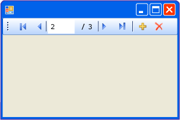

# BindingNavigator 컨트롤 개요(Windows Forms)BindingNavigator Control Overview (Windows Forms)
<xref:System.Windows.Forms.BindingNavigator> 컨트롤을 사용하여 사용자가 Windows Form에서 데이터를 검색 및 변경할 수 있게 해주는 표준화된 방법을 만들 수 있습니다.You can use the <xref:System.Windows.Forms.BindingNavigator> control to create a standardized means for users to search and change data on a Windows Form. 사용자가 폼의 데이터 레코드를 탐색하고 레코드와 상호 작용할 수 있도록 <xref:System.Windows.Forms.BindingSource> 구성 요소와 함께 <xref:System.Windows.Forms.BindingNavigator>를 사용하는 경우가 많습니다.You frequently use <xref:System.Windows.Forms.BindingNavigator> with the <xref:System.Windows.Forms.BindingSource> component to enable users to move through data records on a form and interact with the records.  
  
## BindingNavigator 작동 방식How the BindingNavigator Works  
 <xref:System.Windows.Forms.BindingNavigator> 컨트롤은 데이터 추가, 데이터 삭제 및 데이터 탐색과 같은 대부분의 일반적인 데이터 관련 작업을 위한 일련의 <xref:System.Windows.Forms.ToolStripItem> 개체를 포함하는 <xref:System.Windows.Forms.ToolStrip>으로 구성됩니다.The <xref:System.Windows.Forms.BindingNavigator> control is composed of a <xref:System.Windows.Forms.ToolStrip> with a series of <xref:System.Windows.Forms.ToolStripItem> objects for most of the common data-related actions: adding data, deleting data, and navigating through data. 기본적으로 <xref:System.Windows.Forms.BindingNavigator> 컨트롤은 이러한 표준 단추를 포함합니다.By default, the <xref:System.Windows.Forms.BindingNavigator> control contains these standard buttons. 다음 스크린샷은 폼의 <xref:System.Windows.Forms.BindingNavigator> 컨트롤을 보여 줍니다.The following screen shot shows the <xref:System.Windows.Forms.BindingNavigator> control on a form.  
  
   
  
 다음 표에서는 컨트롤을 나열하고 해당 기능을 설명합니다.The following table lists the controls and describes their functions.  
  
|컨트롤Control|함수Function|  
|-------------|--------------|  
|<xref:System.Windows.Forms.BindingNavigator.AddNewItem%2A> 단추<xref:System.Windows.Forms.BindingNavigator.AddNewItem%2A> button|내부 데이터 소스에 새 행을 삽입합니다.Inserts a new row into the underlying data source.|  
|<xref:System.Windows.Forms.BindingNavigator.DeleteItem%2A> 단추<xref:System.Windows.Forms.BindingNavigator.DeleteItem%2A> button|내부 데이터 소스에서 현재 행을 삭제합니다.Deletes the current row from the underlying data source.|  
|<xref:System.Windows.Forms.BindingNavigator.MoveFirstItem%2A> 단추<xref:System.Windows.Forms.BindingNavigator.MoveFirstItem%2A> button|내부 데이터 소스의 첫 번째 행으로 이동합니다.Moves to the first item in the underlying data source.|  
|<xref:System.Windows.Forms.BindingNavigator.MoveLastItem%2A> 단추<xref:System.Windows.Forms.BindingNavigator.MoveLastItem%2A> button|내부 데이터 소스의 마지막 행으로 이동합니다.Moves to the last item in the underlying data source.|  
|<xref:System.Windows.Forms.BindingNavigator.MoveNextItem%2A> 단추<xref:System.Windows.Forms.BindingNavigator.MoveNextItem%2A> button|내부 데이터 소스의 다음 행으로 이동합니다.Moves to the next item in the underlying data source.|  
|<xref:System.Windows.Forms.BindingNavigator.MovePreviousItem%2A> 단추<xref:System.Windows.Forms.BindingNavigator.MovePreviousItem%2A> button|내부 데이터 소스의 이전 행으로 이동합니다.Moves to the previous item in the underlying data source.|  
|<xref:System.Windows.Forms.BindingNavigator.PositionItem%2A> 텍스트 상자<xref:System.Windows.Forms.BindingNavigator.PositionItem%2A> text box|내부 데이터 소스 내의 현재 위치를 반환합니다.Returns the current position within the underlying data source.|  
|<xref:System.Windows.Forms.BindingNavigator.CountItem%2A> 텍스트 상자<xref:System.Windows.Forms.BindingNavigator.CountItem%2A> text box|내부 데이터 소스의 총 항목 수를 반환합니다.Returns the total number of items in the underlying data source.|  
  
 이 컬렉션의 각 컨트롤에 대해 프로그래밍 방식으로 동일한 기능을 제공하는 <xref:System.Windows.Forms.BindingSource> 구성 요소의 해당 멤버가 있습니다.For each control in this collection, there is a corresponding member of the <xref:System.Windows.Forms.BindingSource> component that programmatically provides the same functionality. 예를 들어 <xref:System.Windows.Forms.BindingNavigator.MoveFirstItem%2A> 단추는 <xref:System.Windows.Forms.BindingSource> 구성 요소의 <xref:System.Windows.Forms.BindingSource.MoveFirst%2A> 메서드에 해당하고 <xref:System.Windows.Forms.BindingNavigator.DeleteItem%2A> 단추는 <xref:System.Windows.Forms.BindingSource.RemoveCurrent%2A> 메서드에 해당합니다.For example, the <xref:System.Windows.Forms.BindingNavigator.MoveFirstItem%2A> button corresponds to the <xref:System.Windows.Forms.BindingSource.MoveFirst%2A> method of the <xref:System.Windows.Forms.BindingSource> component, the <xref:System.Windows.Forms.BindingNavigator.DeleteItem%2A> button corresponds to the <xref:System.Windows.Forms.BindingSource.RemoveCurrent%2A> method, and so on.  
  
 기본 단추가 응용 프로그램에 적합하지 않은 경우 또는 다른 유형의 기능을 지원하기 위해 추가 단추가 필요한 경우 고유한 <xref:System.Windows.Forms.ToolStrip> 단추를 제공할 수 있습니다.If the default buttons are not suited to your application, or if you require additional buttons to support other types of functionality, you can supply your own <xref:System.Windows.Forms.ToolStrip> buttons. [방법: Windows Forms BindingNavigator 컨트롤에 로드, 저장 및 취소 단추 추가](../../../../docs/framework/winforms/controls/load-save-and-cancel-bindingnavigator.md)도 참조하세요.Also see [How to: Add Load, Save, and Cancel Buttons to the Windows Forms BindingNavigator Control](../../../../docs/framework/winforms/controls/load-save-and-cancel-bindingnavigator.md).  
  
## 참고 항목See Also  
 <xref:System.Windows.Forms.BindingNavigator>  
 <xref:System.Windows.Forms.BindingSource>  
 [BindingNavigator 컨트롤BindingNavigator Control](../../../../docs/framework/winforms/controls/bindingnavigator-control-windows-forms.md)
