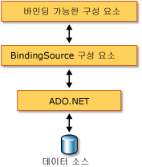

# BindingSource 구성 요소 개요BindingSource Component Overview
<xref:System.Windows.Forms.BindingSource> 구성 요소는 내부 데이터 소스에 컨트롤을 바인딩하는 프로세스를 간소화하도록 설계되었습니다.The <xref:System.Windows.Forms.BindingSource> component is designed to simplify the process of binding controls to an underlying data source. <xref:System.Windows.Forms.BindingSource> 구성 요소는 바인딩하는 다른 컨트롤에 대한 통로 및 데이터 소스 역할을 합니다.The <xref:System.Windows.Forms.BindingSource> component acts as both a conduit and a data source for other controls to bind to. 내부 데이터 목록에 명령을 전달하는 동안 폼의 데이터 연결에 대한 추상화를 제공합니다.It provides an abstraction of your form's data connection while passing through commands to the underlying list of data. 또한 구성 요소 자체가 데이터 소스 역할을 하도록 데이터를 직접 추가할 수 있습니다.Additionally, you can add data directly to it, so that the component itself functions as a data source.  
  
## 중개자로 작동하는 BindingSource 구성 요소BindingSource Component as an Intermediary  
 <xref:System.Windows.Forms.BindingSource> 구성 요소는 폼의 일부 또는 모든 컨트롤에 대한 데이터 소스 역할을 합니다.The <xref:System.Windows.Forms.BindingSource> component acts as the data source for some or all of the controls on the form. Visual Studio에서의 <xref:System.Windows.Forms.BindingSource> 방법으로 컨트롤에 바인딩할 수는 `DataBindings` 에서 액세스할 수 있는 속성의 **속성** 창.In Visual Studio, the <xref:System.Windows.Forms.BindingSource> can be bound to a control by means of the `DataBindings` property, which is accessible from the **Properties** window. [방법: 디자이너를 사용하여 Windows Forms 컨트롤에 BindingSource 구성 요소 바인딩](../../../../docs/framework/winforms/controls/bind-wf-controls-with-the-bindingsource.md)을 참조하세요.Also see [How to: Bind Windows Forms Controls with the BindingSource Component Using the Designer](../../../../docs/framework/winforms/controls/bind-wf-controls-with-the-bindingsource.md).  
  
 개체의 단순 속성이나 기본 컬렉션(예: <xref:System.Collections.ArrayList>)과 같은 간단한 데이터 소스 및 데이터베이스 테이블과 같은 복잡한 데이터 소스 둘 다에 <xref:System.Windows.Forms.BindingSource> 구성 요소를 바인딩할 수 있습니다.You can bind the <xref:System.Windows.Forms.BindingSource> component to both simple data sources, like a single property of an object or a basic collection like <xref:System.Collections.ArrayList>, and complex data sources, like a database table. <xref:System.Windows.Forms.BindingSource> 구성 요소는 바인딩 및 통화 관리 서비스를 제공하는 중간자 역할을 합니다.The <xref:System.Windows.Forms.BindingSource> component acts as an intermediary that provides binding and currency management services. 디자인 타임 또는 런타임에 해당 <xref:System.Windows.Forms.BindingSource.DataSource%2A> 및 <xref:System.Windows.Forms.BindingSource.DataMember%2A> 속성을 각각 데이터베이스와 테이블로 설정하여 <xref:System.Windows.Forms.BindingSource> 구성 요소를 복잡한 데이터 소스에 바인딩할 수 있습니다.At design time or run time, you can bind a <xref:System.Windows.Forms.BindingSource> component to a complex data source by setting its <xref:System.Windows.Forms.BindingSource.DataSource%2A> and <xref:System.Windows.Forms.BindingSource.DataMember%2A> properties to the database and table, respectively. 다음 그림에서는 <xref:System.Windows.Forms.BindingSource> 구성 요소가 기존 데이터 바인딩 아키텍처에 들어가는 위치를 보여 줍니다.The following illustration demonstrates where the <xref:System.Windows.Forms.BindingSource> component fits into the existing data-binding architecture.  
  
   
  
> [!NOTE]
>  디자인 타임에 데이터 창에서 빈 폼으로 데이터베이스 테이블 끌기와 같은 일부 작업은 <xref:System.Windows.Forms.BindingSource> 구성 요소를 만들고, 내부 데이터 소스에 바인딩한 다음 하나의 작업에서 모든 데이터 인식 컨트롤을 추가합니다.At design time, some actions, like dragging a database table from a data window onto a blank form, will create the <xref:System.Windows.Forms.BindingSource> component, bind it to the underlying data source, and add data-aware controls all in one operation. [Visual Studio에서 데이터에 Windows Forms 컨트롤 바인딩](/visualstudio/data-tools/bind-windows-forms-controls-to-data-in-visual-studio)을 참조하세요.Also see [Bind Windows Forms controls to data in Visual Studio](/visualstudio/data-tools/bind-windows-forms-controls-to-data-in-visual-studio).  
  
## 데이터 소스로 작동하는 BindingSource 구성 요소BindingSource Component as a Data Source  
 먼저 바인딩할 목록을 지정하지 않고 <xref:System.Windows.Forms.BindingSource> 구성 요소에 항목 추가를 시작하는 경우 구성 요소는 목록 스타일 데이터 소스처럼 작동하며 이러한 추가된 항목을 수락합니다.If you start adding items to the <xref:System.Windows.Forms.BindingSource> component without first specifying a list to be bound to, the component will act like a list-style data source and accept these added items.  
  
 또한 항목이 목록에 추가되기 전에 <xref:System.Windows.Forms.BindingSource.AddingNew> 메서드를 호출할 때 발생하는 <xref:System.Windows.Forms.BindingSource.AddNew%2A> 이벤트를 통해 사용자 지정 "AddNew" 기능을 제공하는 코드를 작성할 수 있습니다.Additionally, you can write code to provide custom "AddNew" functionality by means of the <xref:System.Windows.Forms.BindingSource.AddingNew> event, which is raised when the <xref:System.Windows.Forms.BindingSource.AddNew%2A> method is called prior to the item being added to the list. 자세한 내용은 [BindingSource 구성 요소 아키텍처](../../../../docs/framework/winforms/controls/bindingsource-component-architecture.md)를 참조하세요.For more information, see [BindingSource Component Architecture](../../../../docs/framework/winforms/controls/bindingsource-component-architecture.md).  
  
## 탐색Navigation  
 폼에서 데이터를 탐색해야 하는 사용자의 경우 <xref:System.Windows.Forms.BindingNavigator> 구성 요소를 사용하면 <xref:System.Windows.Forms.BindingSource> 구성 요소에 따라 데이터를 탐색 및 조작할 수 있습니다.For users that need to navigate the data on a form, the <xref:System.Windows.Forms.BindingNavigator> component enables you to navigate and manipulate data, in coordination with a <xref:System.Windows.Forms.BindingSource> component. 자세한 내용은 [BindingNavigator 컨트롤](../../../../docs/framework/winforms/controls/bindingnavigator-control-windows-forms.md)을 참조하세요.For more information, see [BindingNavigator Control](../../../../docs/framework/winforms/controls/bindingnavigator-control-windows-forms.md).  
  
## 데이터 조작Data Manipulation  
 <xref:System.Windows.Forms.BindingSource>는 모든 바인딩에 대한 <xref:System.Windows.Forms.CurrencyManager> 역할을 하므로 데이터 소스와 관련해서 통화 및 위치 정보에 대한 액세스를 제공합니다.The: <xref:System.Windows.Forms.BindingSource> acts as a <xref:System.Windows.Forms.CurrencyManager> for all of its bindings and can, therefore, provide access to currency and position information regarding the data source. 다음 표에서는 <xref:System.Windows.Forms.BindingSource> 구성 요소가 내부 데이터 액세스 및 조작을 위해 제공하는 멤버를 보여 줍니다.The following table shows the members that the <xref:System.Windows.Forms.BindingSource> component provides for accessing and manipulating the underlying data.  
  
|멤버Member|설명Description|  
|------------|-----------------|  
|<xref:System.Windows.Forms.BindingSource.Current%2A> 속성<xref:System.Windows.Forms.BindingSource.Current%2A> property|데이터 소스의 현재 항목을 가져옵니다.Gets the current item of the data source.|  
|<xref:System.Windows.Forms.BindingSource.Position%2A> 속성<xref:System.Windows.Forms.BindingSource.Position%2A> property|내부 목록에서 현재 위치를 가져오거나 설정합니다.Gets or sets the current position in the underlying list.|  
|<xref:System.Windows.Forms.BindingSource.List%2A> 속성<xref:System.Windows.Forms.BindingSource.List%2A> property|<xref:System.Windows.Forms.BindingSource.DataSource%2A> 및 <xref:System.Windows.Forms.BindingSource.DataMember%2A>의 평가인 목록을 가져옵니다.Gets the list that is the evaluation of the <xref:System.Windows.Forms.BindingSource.DataSource%2A> and <xref:System.Windows.Forms.BindingSource.DataMember%2A> evaluation. <xref:System.Windows.Forms.BindingSource.DataMember%2A>가 설정되지 않은 경우 <xref:System.Windows.Forms.BindingSource.DataSource%2A>에 지정된 목록을 반환합니다.If <xref:System.Windows.Forms.BindingSource.DataMember%2A> is not set, returns the list specified by <xref:System.Windows.Forms.BindingSource.DataSource%2A>.|  
|<xref:System.Windows.Forms.BindingSource.Insert%2A> 메서드<xref:System.Windows.Forms.BindingSource.Insert%2A> method|목록의 지정된 인덱스에 항목을 삽입합니다.Inserts an item in the list at the specified index.|  
|<xref:System.Windows.Forms.BindingSource.RemoveCurrent%2A> 메서드<xref:System.Windows.Forms.BindingSource.RemoveCurrent%2A> method|목록에서 현재 항목을 제거합니다.Removes the current item from the list.|  
|<xref:System.Windows.Forms.BindingSource.EndEdit%2A> 메서드<xref:System.Windows.Forms.BindingSource.EndEdit%2A> method|내부 데이터 소스에 보류 중인 변경 내용을 적용합니다.Applies pending changes to the underlying data source.|  
|<xref:System.Windows.Forms.BindingSource.CancelEdit%2A> 메서드<xref:System.Windows.Forms.BindingSource.CancelEdit%2A> method|현재 편집 작업을 취소합니다.Cancels the current edit operation.|  
|<xref:System.Windows.Forms.BindingSource.AddNew%2A> 메서드<xref:System.Windows.Forms.BindingSource.AddNew%2A> method|내부 목록에 새 항목을 추가합니다.Adds a new item to the underlying list. 데이터 소스가 <xref:System.ComponentModel.IBindingList>를 구현하고 <xref:System.Windows.Forms.BindingSource.AddingNew> 이벤트에서 항목을 반환하는 경우 이 항목을 추가합니다.If the data source implements <xref:System.ComponentModel.IBindingList> and returns an item from the <xref:System.Windows.Forms.BindingSource.AddingNew> event, adds this item. 그러지 않으면 요청이 목록의 <xref:System.ComponentModel.IBindingList.AddNew%2A> 메서드에 전달됩니다.Otherwise, the request is passed to the list's <xref:System.ComponentModel.IBindingList.AddNew%2A> method. 내부 목록이 <xref:System.ComponentModel.IBindingList>가 아닌 경우 public 기본 생성자를 통해 항목이 자동으로 만들어집니다.If the underlying list is not an <xref:System.ComponentModel.IBindingList>, the item is automatically created through its public default constructor.|  
  
## 정렬 및 필터링Sorting and Filtering  
 일반적으로 데이터 소스의 정렬 또는 필터링된 뷰를 사용해야 합니다.Usually, you should work with an ordered or filtered view of the data source. 다음 표에서는 <xref:System.Windows.Forms.BindingSource> 구성 요소 데이터 소스가 제공하는 멤버를 보여 줍니다.The following table shows the members that the <xref:System.Windows.Forms.BindingSource> component data source provides.  
  
|멤버Member|설명Description|  
|------------|-----------------|  
|<xref:System.Windows.Forms.BindingSource.Sort%2A> 속성<xref:System.Windows.Forms.BindingSource.Sort%2A> property|데이터 소스가 <xref:System.ComponentModel.IBindingList>인 경우 정렬에 사용되는 열 이름과 정렬 순서 정보를 가져오거나 설정합니다.If the data source is an <xref:System.ComponentModel.IBindingList>, gets or sets a column name used for sorting and sort order information. 데이터 소스가 <xref:System.ComponentModel.IBindingListView>이고 고급 정렬을 지원하는 경우 정렬에 사용되는 여러 개의 열 이름과 정렬 순서 정보를 가져옵니다.If the data source is an <xref:System.ComponentModel.IBindingListView> and supports advanced sorting, gets multiple column names used for sorting and sort order information|  
|<xref:System.Windows.Forms.BindingSource.Filter%2A> 속성<xref:System.Windows.Forms.BindingSource.Filter%2A> property|데이터 소스가 <xref:System.ComponentModel.IBindingListView>인 경우 표시할 행을 필터링하는 데 사용하는 식을 가져오거나 설정합니다.If the data source is an <xref:System.ComponentModel.IBindingListView>, gets or sets the expression used to filter which rows are viewed.|  
  
## 참고 항목See Also  
 <xref:System.Windows.Forms.BindingSource>  
 <xref:System.Windows.Forms.BindingNavigator>  
 [BindingSource 구성 요소 아키텍처BindingSource Component Architecture](../../../../docs/framework/winforms/controls/bindingsource-component-architecture.md)  
 [BindingSource 구성 요소BindingSource Component](../../../../docs/framework/winforms/controls/bindingsource-component.md)  
 [BindingNavigator 컨트롤BindingNavigator Control](../../../../docs/framework/winforms/controls/bindingnavigator-control-windows-forms.md)  
 [Windows Forms 데이터 바인딩Windows Forms Data Binding](../../../../docs/framework/winforms/windows-forms-data-binding.md)  
 [Windows Forms에 사용할 수 있는 컨트롤Controls to Use on Windows Forms](../../../../docs/framework/winforms/controls/controls-to-use-on-windows-forms.md)
