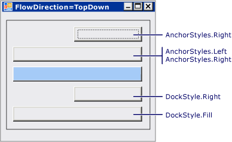

# 방법: FlowLayoutPanel 컨트롤의 자식 컨트롤 고정 및 도킹
<xref:System.Windows.Forms.FlowLayoutPanel> 컨트롤은 자식 컨트롤의 <xref:System.Windows.Forms.Control.Anchor%2A> 및 <xref:System.Windows.Forms.Control.Dock%2A> 속성을 지원합니다.  
  
### FlowLayoutPanel 컨트롤의 자식 컨트롤을 고정 및 도킹하려면  
  
1.  폼에 <xref:System.Windows.Forms.FlowLayoutPanel> 컨트롤을 만듭니다.  
  
2.  설정의 <xref:System.Windows.Forms.Control.Width%2A> 의 <xref:System.Windows.Forms.FlowLayoutPanel> 컨트롤을 **300**, 설정 및 해당 <xref:System.Windows.Forms.FlowLayoutPanel.FlowDirection%2A> 를 <xref:System.Windows.Forms.FlowDirection.TopDown>합니다.  
  
3.  두 개의 <xref:System.Windows.Forms.Button> 컨트롤을 만들어 <xref:System.Windows.Forms.FlowLayoutPanel> 컨트롤에 배치합니다.  
  
4.  설정의 <xref:System.Windows.Forms.Control.Width%2A> 하는 첫 번째 단추의 **200**합니다.  
  
5.  두 번째 단추의 <xref:System.Windows.Forms.Control.Dock%2A> 속성을 <xref:System.Windows.Forms.DockStyle.Fill>로 설정합니다.  
  
    > [!NOTE]
    >  두 번째 단추는 첫 번째 단추와 동일한 너비를 사용합니다. <xref:System.Windows.Forms.FlowLayoutPanel> 컨트롤의 너비에 가로로 늘여지지 않습니다.  
  
6.  두 번째 단추의 <xref:System.Windows.Forms.Control.Dock%2A> 속성을 `None`로 설정합니다. 그러면 단추가 원래 너비를 사용합니다.  
  
7.  두 번째 단추의 <xref:System.Windows.Forms.Control.Anchor%2A> 속성을 `Left, Right`로 설정합니다.  
  
    > [!IMPORTANT]
    >  두 번째 단추는 첫 번째 단추와 동일한 너비를 사용합니다. <xref:System.Windows.Forms.FlowLayoutPanel> 컨트롤의 너비에 가로로 늘여지지 않습니다. 이는 <xref:System.Windows.Forms.FlowLayoutPanel> 컨트롤의 고정 및 도킹에 대한 일반적인 규칙입니다. 세로 흐름 방향에서는 <xref:System.Windows.Forms.FlowLayoutPanel> 컨트롤이 폼에서 가장 넓은 자식 컨트롤의 암시된 열 너비를 계산합니다. 이 열에서 <xref:System.Windows.Forms.Control.Anchor%2A> 또는 <xref:System.Windows.Forms.Control.Dock%2A> 속성을 가진 다른 모든 컨트롤은 이 암시된 열에 맞게 맞춰지거나 늘어납니다. 이 동작은 가로 흐름 방향에서도 비슷하게 작동합니다. <xref:System.Windows.Forms.FlowLayoutPanel> 컨트롤은 행에서 가장 높은 자식 컨트롤의 암시된 행 높이를 계산하고 이 행에서 도킹 또는 고정된 모든 자식 컨트롤이 암시된 행을 채우도록 맞춰지거나 크기가 조정됩니다.  
  
## 예제  
 다음 그림에서는 <xref:System.Windows.Forms.FlowLayoutPanel>의 파란색 단추를 기준으로 고정 및 도킹된 단추 4개를 보여 줍니다. <xref:System.Windows.Forms.FlowLayoutPanel.FlowDirection%2A>이 <xref:System.Windows.Forms.FlowDirection.LeftToRight>인 경우  
  
   
  
 다음 그림에서는 <xref:System.Windows.Forms.FlowLayoutPanel>의 파란색 단추를 기준으로 고정 및 도킹된 단추 4개를 보여 줍니다. <xref:System.Windows.Forms.FlowLayoutPanel.FlowDirection%2A>이 <xref:System.Windows.Forms.FlowDirection.TopDown>인 경우  
  
   
  
 다음 코드 예제에서는 <xref:System.Windows.Forms.FlowLayoutPanel> 컨트롤의 <xref:System.Windows.Forms.Button> 컨트롤에 대한 다양한 <xref:System.Windows.Forms.Control.Anchor%2A> 속성 값을 보여 줍니다.  
  
 [!code-csharp[System.Windows.Forms.FlowLayoutPanel.AnchorExampleForm#1](../../../../samples/snippets/csharp/VS_Snippets_Winforms/System.Windows.Forms.FlowLayoutPanel.AnchorExampleForm/CS/FlpAnchorExampleForm.cs#1)]
 [!code-vb[System.Windows.Forms.FlowLayoutPanel.AnchorExampleForm#1](../../../../samples/snippets/visualbasic/VS_Snippets_Winforms/System.Windows.Forms.FlowLayoutPanel.AnchorExampleForm/VB/FlpAnchorExampleForm.vb#1)]  
  
## 코드 컴파일  
 이 예제에는 다음 사항이 필요합니다.  
  
-   System, System.Data, System.Drawing 및 System.Windows.Forms 어셈블리에 대한 참조  
  
 Visual Basic 또는 Visual C#에 대 한 명령줄에서이 예제를 빌드하는 방법에 대 한 정보를 참조 하십시오. [명령줄에서 빌드](~/docs/visual-basic/reference/command-line-compiler/building-from-the-command-line.md) 또는 [사용한 명령줄 빌드 csc.exe](~/docs/csharp/language-reference/compiler-options/command-line-building-with-csc-exe.md)합니다. 새 프로젝트에 코드를 붙여 넣어 Visual Studio에서이 예제를 빌드할 수도 있습니다.  [방법: Visual Studio를 사용하여 전체 Windows Forms 코드 예제 컴파일 및 실행](http://msdn.microsoft.com/library/Bb129228\(v=vs.110\))을 참조하세요.  
  
## 참고 항목  
 <xref:System.Windows.Forms.FlowLayoutPanel>  
 [FlowLayoutPanel 컨트롤 개요](../../../../docs/framework/winforms/controls/flowlayoutpanel-control-overview.md)
