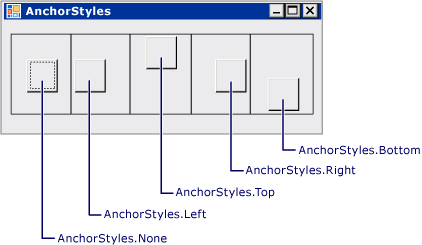
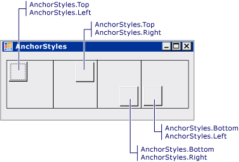
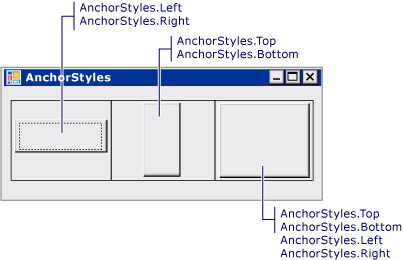

# 방법: TableLayoutPanel 컨트롤의 자식 컨트롤 고정 및 도킹
<xref:System.Windows.Forms.TableLayoutPanel> 컨트롤은 자식 컨트롤의 <xref:System.Windows.Forms.Control.Anchor%2A> 및 <xref:System.Windows.Forms.Control.Dock%2A> 속성을 지원합니다.  
  
### TableLayoutPanel 셀에서 자식 컨트롤을 맞추려면  
  
1.  폼에 <xref:System.Windows.Forms.TableLayoutPanel> 컨트롤을 만듭니다.  
  
2.  값으로 설정 된 <xref:System.Windows.Forms.TableLayoutPanel> 컨트롤의 <xref:System.Windows.Forms.TableLayoutPanel.ColumnCount%2A> 및 <xref:System.Windows.Forms.TableLayoutPanel.RowCount%2A> 속성을 **1**합니다.  
  
3.  <xref:System.Windows.Forms.TableLayoutPanel> 컨트롤에 <xref:System.Windows.Forms.Button> 컨트롤을 만듭니다. <xref:System.Windows.Forms.Button>이 셀의 왼쪽 위 모퉁이에 배치됩니다.  
  
4.  <xref:System.Windows.Forms.Button> 컨트롤의 <xref:System.Windows.Forms.Control.Anchor%2A> 속성 값을 `Left`로 변경합니다. <xref:System.Windows.Forms.Button>이 이동하여 셀의 왼쪽 테두리에 맞춰집니다.  
  
    > [!NOTE]
    >  이 동작은 다른 컨테이너 컨트롤의 동작과 다릅니다. 다른 컨테이너 컨트롤에서는 <xref:System.Windows.Forms.Control.Anchor%2A> 속성을 설정할 때 자식 컨트롤이 이동하지 않고 고정된 컨트롤과 부모 컨테이너 경계 간의 거리가 <xref:System.Windows.Forms.Control.Anchor%2A> 속성을 설정할 때 고정됩니다.  
  
5.  <xref:System.Windows.Forms.Button> 컨트롤의 <xref:System.Windows.Forms.Control.Anchor%2A> 속성 값을 `Top, Left`로 변경합니다. <xref:System.Windows.Forms.Button> 컨트롤이 이동하여 셀의 왼쪽 위 모퉁이에 배치됩니다.  
  
6.  5 단계를 반복 값의 `Top, Right` 이동 하는 <xref:System.Windows.Forms.Button> 셀의 오른쪽 위 모퉁이를 제어 합니다. `Bottom, Left` 및 `Bottom, Right` 값으로 반복합니다.  
  
### TableLayoutPanel 셀에서 자식 컨트롤을 늘이려면  
  
1.  <xref:System.Windows.Forms.Button> 컨트롤의 <xref:System.Windows.Forms.Control.Anchor%2A> 속성 값을 `Left, Right`로 변경합니다. <xref:System.Windows.Forms.Button> 컨트롤의 크기가 조정되어 셀에 가로로 늘여집니다.  
  
    > [!NOTE]
    >  이 동작은 다른 컨테이너 컨트롤의 동작과 다릅니다. 다른 컨테이너 컨트롤의 자식 컨트롤은 크기를 조정할 때는 <xref:System.Windows.Forms.Control.Anchor%2A> 속성이 `Left, Right` 또는 `Top, Bottom`합니다.  
  
2.  <xref:System.Windows.Forms.Button> 컨트롤의 <xref:System.Windows.Forms.Control.Anchor%2A> 속성 값을 `Top, Bottom`로 변경합니다. <xref:System.Windows.Forms.Button> 컨트롤의 크기가 조정되어 셀의 맨 위에서 맨 아래까지 세로로 늘여집니다.  
  
3.  <xref:System.Windows.Forms.Button> 컨트롤의 <xref:System.Windows.Forms.Control.Anchor%2A> 속성 값을 `Top, Bottom, Left, Right`로 변경합니다. <xref:System.Windows.Forms.Button> 컨트롤의 크기가 조정되어 셀을 채웁니다.  
  
4.  <xref:System.Windows.Forms.Button> 컨트롤의 <xref:System.Windows.Forms.Control.Anchor%2A> 속성 값을 `None`로 변경합니다. <xref:System.Windows.Forms.Button> 컨트롤의 크기가 조정되고 셀의 가운데에 배치됩니다.  
  
5.  <xref:System.Windows.Forms.Button> 컨트롤의 <xref:System.Windows.Forms.Control.Dock%2A> 속성 값을 <xref:System.Windows.Forms.DockStyle.Left>로 변경합니다. <xref:System.Windows.Forms.Button>이 이동하여 셀의 왼쪽 테두리에 맞춰집니다. <xref:System.Windows.Forms.Button> 컨트롤의 너비는 유지되지만 높이가 조정되어 셀을 세로로 채웁니다.  
  
    > [!NOTE]
    >  이는 다른 컨테이너 컨트롤에서 발생하는 동작과 같습니다.  
  
6.  <xref:System.Windows.Forms.Button> 컨트롤의 <xref:System.Windows.Forms.Control.Dock%2A> 속성 값을 <xref:System.Windows.Forms.DockStyle.Fill>로 변경합니다. <xref:System.Windows.Forms.Button> 컨트롤의 크기가 조정되어 셀을 채웁니다.  
  
## 예  
 다음 그림에서는 개별 <xref:System.Windows.Forms.TableLayoutPanel> 셀 5개에 고정된 단추 5개를 보여 줍니다.  
  
   
  
 다음 그림에서는 개별 <xref:System.Windows.Forms.TableLayoutPanel> 셀 4개의 모퉁이에 고정된 단추 4개를 보여 줍니다.  
  
   
  
 다음 그림에서는 개별 <xref:System.Windows.Forms.TableLayoutPanel> 셀 3에 고정하여 늘여진 단추 3개를 보여 줍니다.  
  
   
  
 다음 코드 예제에서는 <xref:System.Windows.Forms.TableLayoutPanel> 컨트롤의 <xref:System.Windows.Forms.Button> 컨트롤에 대한 <xref:System.Windows.Forms.Control.Anchor%2A> 속성 값의 모든 조합을 보여 줍니다.  
  
 [!code-csharp[System.Windows.Forms.TableLayoutPanel.AnchorExampleForm#1](../../../../samples/snippets/csharp/VS_Snippets_Winforms/System.Windows.Forms.TableLayoutPanel.AnchorExampleForm/CS/TlpAnchorExampleForm.cs#1)]
 [!code-vb[System.Windows.Forms.TableLayoutPanel.AnchorExampleForm#1](../../../../samples/snippets/visualbasic/VS_Snippets_Winforms/System.Windows.Forms.TableLayoutPanel.AnchorExampleForm/VB/TlpAnchorExampleForm.vb#1)]  
  
## 코드 컴파일  
 이 예제에는 다음 사항이 필요합니다.  
  
-   System, System.Data, System.Drawing 및 System.Windows.Forms 어셈블리에 대한 참조  
  
 [!INCLUDE[vbprvb](../../../../includes/vbprvb-md.md)] 또는 [!INCLUDE[csprcs](../../../../includes/csprcs-md.md)]의 명령줄에서 이 예제를 빌드하는 방법에 대한 자세한 내용은 [명령줄에서 빌드](~/docs/visual-basic/reference/command-line-compiler/building-from-the-command-line.md) 또는 [csc.exe를 사용한 명령줄 빌드](~/docs/csharp/language-reference/compiler-options/command-line-building-with-csc-exe.md)를 참조하세요. [!INCLUDE[vsprvs](../../../../includes/vsprvs-md.md)]에서 코드를 새 프로젝트에 붙여넣어 이 예제를 빌드할 수도 있습니다.  [방법: Visual Studio를 사용하여 전체 Windows Forms 코드 예제 컴파일 및 실행](http://msdn.microsoft.com/library/Bb129228\(v=vs.110\))을 참조하세요.  
  
## 참고 항목  
 <xref:System.Windows.Forms.TableLayoutPanel>  
 [TableLayoutPanel 컨트롤](../../../../docs/framework/winforms/controls/tablelayoutpanel-control-windows-forms.md)
