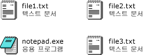

# <a name="how-to-enable-tile-view-in-a-windows-forms-listview-control"></a><span data-ttu-id="1a47e-102">방법: Windows Forms ListView 컨트롤의 Tile 보기 사용</span><span class="sxs-lookup"><span data-stu-id="1a47e-102">How to: Enable Tile View in a Windows Forms ListView Control</span></span>
<span data-ttu-id="1a47e-103"><xref:System.Windows.Forms.ListView> 컨트롤의 바둑판식 뷰 기능을 통해 그래픽 정보와 텍스트 정보 간의 시각적 균형을 제공할 수 있습니다.</span><span class="sxs-lookup"><span data-stu-id="1a47e-103">With the tile view feature of the <xref:System.Windows.Forms.ListView> control, you can provide a visual balance between graphical and textual information.</span></span> <span data-ttu-id="1a47e-104">바둑판식 뷰에서 항목에 대해 표시되는 텍스트 정보는 세부 정보 뷰에 대해 정의된 열 정보와 같습니다.</span><span class="sxs-lookup"><span data-stu-id="1a47e-104">The textual information displayed for an item in tile view is the same as the column information defined for details view.</span></span> <span data-ttu-id="1a47e-105">바둑판식 뷰는 <xref:System.Windows.Forms.ListView> 컨트롤의 그룹화 또는 삽입 표시 기능과 함께 작동합니다.</span><span class="sxs-lookup"><span data-stu-id="1a47e-105">Tile view works in combination with either the grouping or insertion mark features in the <xref:System.Windows.Forms.ListView> control.</span></span>  
  
 <span data-ttu-id="1a47e-106">다음 이미지와 같이 바둑판식 뷰는 32 x 32 픽셀 아이콘과 여러 줄의 텍스트를 사용합니다.</span><span class="sxs-lookup"><span data-stu-id="1a47e-106">The tile view uses a 32 x 32 pixel icon and several lines of text, as shown in the following images.</span></span>  
  
 <span data-ttu-id="1a47e-107"></span><span class="sxs-lookup"><span data-stu-id="1a47e-107"></span></span>  
<span data-ttu-id="1a47e-108">바둑판식 뷰 아이콘 및 텍스트</span><span class="sxs-lookup"><span data-stu-id="1a47e-108">Tile view icons and text</span></span>  
  
 <span data-ttu-id="1a47e-109">바둑판식 뷰를 사용하도록 설정하려면 <xref:System.Windows.Forms.ListView.View%2A> 속성을 <xref:System.Windows.Forms.View.Tile>로 설정합니다.</span><span class="sxs-lookup"><span data-stu-id="1a47e-109">To enable tile view, set the <xref:System.Windows.Forms.ListView.View%2A> property to <xref:System.Windows.Forms.View.Tile>.</span></span> <span data-ttu-id="1a47e-110"><xref:System.Windows.Forms.ListView.TileSize%2A> 속성을 설정하여 타일 크기를 조정하고, <xref:System.Windows.Forms.ListView.Columns%2A> 컬렉션을 조정하여 타일에 표시되는 텍스트 줄 수를 조정할 수 있습니다.</span><span class="sxs-lookup"><span data-stu-id="1a47e-110">You can adjust the size of the tiles by setting the <xref:System.Windows.Forms.ListView.TileSize%2A> property, and the number of text lines displayed in the tile by adjusting the <xref:System.Windows.Forms.ListView.Columns%2A> collection.</span></span>  
  
> [!NOTE]
>  <span data-ttu-id="1a47e-111">바둑판식 뷰는 응용 프로그램이 <xref:System.Windows.Forms.Application.EnableVisualStyles%2A?displayProperty=nameWithType> 메서드를 호출할 때 [!INCLUDE[WinXpFamily](../../../../includes/winxpfamily-md.md)]에서만 사용할 수 있습니다.</span><span class="sxs-lookup"><span data-stu-id="1a47e-111">The tile view is available only on [!INCLUDE[WinXpFamily](../../../../includes/winxpfamily-md.md)] when your application calls the <xref:System.Windows.Forms.Application.EnableVisualStyles%2A?displayProperty=nameWithType> method.</span></span> <span data-ttu-id="1a47e-112">이전 운영 체제에서는 바둑판식 뷰와 관련된 코드가 아무 효과도 없으며, <xref:System.Windows.Forms.ListView> 컨트롤이 큰 아이콘 보기에 표시됩니다.</span><span class="sxs-lookup"><span data-stu-id="1a47e-112">On earlier operating systems, any code related to the tile view has no effect, and the <xref:System.Windows.Forms.ListView> control displays in the large icon view.</span></span> <span data-ttu-id="1a47e-113">자세한 내용은 <xref:System.Windows.Forms.ListView.View%2A?displayProperty=nameWithType>을 참조하세요.</span><span class="sxs-lookup"><span data-stu-id="1a47e-113">For more information, see <xref:System.Windows.Forms.ListView.View%2A?displayProperty=nameWithType>.</span></span>  
  
### <a name="to-set-tile-view-programmatically"></a><span data-ttu-id="1a47e-114">프로그래밍 방식으로 바둑판식 뷰를 설정하려면</span><span class="sxs-lookup"><span data-stu-id="1a47e-114">To set tile view programmatically</span></span>  
  
1.  <span data-ttu-id="1a47e-115"><xref:System.Windows.Forms.ListView> 컨트롤의 <xref:System.Windows.Forms.View> 열거형을 사용합니다.</span><span class="sxs-lookup"><span data-stu-id="1a47e-115">Use the <xref:System.Windows.Forms.View> enumeration of the <xref:System.Windows.Forms.ListView> control.</span></span>  
  
    ```vb  
    ListView1.View = View.Tile  
    ```  
  
    ```csharp  
    listView1.View = View.Tile;  
    ```  
  
## <a name="example"></a><span data-ttu-id="1a47e-116">예제</span><span class="sxs-lookup"><span data-stu-id="1a47e-116">Example</span></span>  
 <span data-ttu-id="1a47e-117">다음 전체 코드 예제에서는 타일이 3줄의 텍스트를 표시하도록 수정된 바둑판식 뷰를 보여 줍니다.</span><span class="sxs-lookup"><span data-stu-id="1a47e-117">The following complete code example demonstrates Tile view with tiles modified to show three lines of text.</span></span> <span data-ttu-id="1a47e-118">줄 바꿈을 방지하기 위해 타일 크기가 조정되었습니다.</span><span class="sxs-lookup"><span data-stu-id="1a47e-118">The tile size has been adjusted to prevent line-wrapping.</span></span>  
  
 [!code-cpp[System.Windows.Forms.ListView.Tiling#1](../../../../samples/snippets/cpp/VS_Snippets_Winforms/System.Windows.Forms.ListView.Tiling/CPP/listviewtilingexample.cpp#1)]
 [!code-csharp[System.Windows.Forms.ListView.Tiling#1](../../../../samples/snippets/csharp/VS_Snippets_Winforms/System.Windows.Forms.ListView.Tiling/CS/listviewtilingexample.cs#1)]
 [!code-vb[System.Windows.Forms.ListView.Tiling#1](../../../../samples/snippets/visualbasic/VS_Snippets_Winforms/System.Windows.Forms.ListView.Tiling/VB/listviewtilingexample.vb#1)]  
  
## <a name="compiling-the-code"></a><span data-ttu-id="1a47e-119">코드 컴파일</span><span class="sxs-lookup"><span data-stu-id="1a47e-119">Compiling the Code</span></span>  
 <span data-ttu-id="1a47e-120">이 예제에는 다음 사항이 필요합니다.</span><span class="sxs-lookup"><span data-stu-id="1a47e-120">This example requires:</span></span>  
  
-   <span data-ttu-id="1a47e-121">System 및 System.Windows.Forms 어셈블리에 대한 참조</span><span class="sxs-lookup"><span data-stu-id="1a47e-121">References to the System and System.Windows.Forms assemblies.</span></span>  
  
-   <span data-ttu-id="1a47e-122">실행 파일과 동일한 디렉터리에 있는 book.ico로 명명된 아이콘 파일</span><span class="sxs-lookup"><span data-stu-id="1a47e-122">An icon file named book.ico in the same directory as the executable file.</span></span>  
  
 <span data-ttu-id="1a47e-123">Visual Basic 또는 Visual C#에 대 한 명령줄에서이 예제를 빌드하는 방법에 대 한 정보를 참조 하십시오. [명령줄에서 빌드](~/docs/visual-basic/reference/command-line-compiler/building-from-the-command-line.md) 또는 [사용한 명령줄 빌드 csc.exe](~/docs/csharp/language-reference/compiler-options/command-line-building-with-csc-exe.md)합니다.</span><span class="sxs-lookup"><span data-stu-id="1a47e-123">For information about building this example from the command line for Visual Basic or Visual C#, see [Building from the Command Line](~/docs/visual-basic/reference/command-line-compiler/building-from-the-command-line.md) or [Command-line Building With csc.exe](~/docs/csharp/language-reference/compiler-options/command-line-building-with-csc-exe.md).</span></span> <span data-ttu-id="1a47e-124">새 프로젝트에 코드를 붙여 넣어 Visual Studio에서이 예제를 빌드할 수도 있습니다.</span><span class="sxs-lookup"><span data-stu-id="1a47e-124">You can also build this example in Visual Studio by pasting the code into a new project.</span></span>  <span data-ttu-id="1a47e-125">[방법: Visual Studio를 사용하여 전체 Windows Forms 코드 예제 컴파일 및 실행](http://msdn.microsoft.com/library/Bb129228\(v=vs.110\))을 참조하세요.</span><span class="sxs-lookup"><span data-stu-id="1a47e-125">Also see [How to: Compile and Run a Complete Windows Forms Code Example Using Visual Studio](http://msdn.microsoft.com/library/Bb129228\(v=vs.110\)).</span></span>  
  
## <a name="see-also"></a><span data-ttu-id="1a47e-126">참고 항목</span><span class="sxs-lookup"><span data-stu-id="1a47e-126">See Also</span></span>  
 <xref:System.Windows.Forms.ListView>  
 <xref:System.Windows.Forms.ListView.TileSize%2A>  
 [<span data-ttu-id="1a47e-127">ListView 컨트롤</span><span class="sxs-lookup"><span data-stu-id="1a47e-127">ListView Control</span></span>](../../../../docs/framework/winforms/controls/listview-control-windows-forms.md)  
 [<span data-ttu-id="1a47e-128">ListView 컨트롤 개요</span><span class="sxs-lookup"><span data-stu-id="1a47e-128">ListView Control Overview</span></span>](../../../../docs/framework/winforms/controls/listview-control-overview-windows-forms.md)  
 [<span data-ttu-id="1a47e-129">Windows XP 기능 및 Windows Forms 컨트롤</span><span class="sxs-lookup"><span data-stu-id="1a47e-129">Windows XP Features and Windows Forms Controls</span></span>](http://msdn.microsoft.com/library/bc7fab94-fce9-4bf1-a8ad-a5837c91c3c0)
