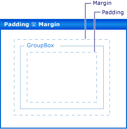

# 연습: Padding, Margins 및 AutoSize 속성을 사용하여 Windows Forms 컨트롤 레이아웃
폼의 정확한 컨트롤 배치는 많은 응용 프로그램에서 우선 순위가 높습니다. **Windows Forms 디자이너** 이를 위해 여러 레이아웃 도구를 제공 합니다. 가장 중요 한 중 3 개는 <xref:System.Windows.Forms.Control.Margin%2A>, <xref:System.Windows.Forms.Control.Padding%2A>, 및 <xref:System.Windows.Forms.Control.AutoSize%2A> 모든 Windows Forms 컨트롤에 있는 속성입니다.  
  
 <xref:System.Windows.Forms.Control.Margin%2A> 속성은 다른 컨트롤을 컨트롤의 테두리에서 지정된 거리에 유지하는 컨트롤 주위의 공간을 정의합니다.  
  
 <xref:System.Windows.Forms.Control.Padding%2A> 속성은 컨트롤의 내용(예: <xref:System.Windows.Forms.Control.Text%2A> 속성의 값)을 컨트롤의 테두리에서 지정된 거리에 유지하는 컨트롤 내부의 공간을 정의합니다.  
  
 다음 그림에서는 컨트롤의 <xref:System.Windows.Forms.Control.Padding%2A> 및 <xref:System.Windows.Forms.Control.Margin%2A> 속성을 보여 줍니다.  
  
   
  
 <xref:System.Windows.Forms.Control.AutoSize%2A> 속성이 있으면 자동으로 크기를 자동으로 해당 콘텐츠를 제어 합니다. 해당 컨트롤의 원래 값 보다 작게 크기가 조정 되지는 <xref:System.Windows.Forms.Control.Size%2A> 속성과 값을 고려 합니다 해당 <xref:System.Windows.Forms.Control.Padding%2A> 속성입니다.  
  
 이 연습에서 설명하는 작업은 다음과 같습니다.  
  
-   Windows Forms 프로젝트 만들기  
  
-   컨트롤에 대 한 여백 설정  
  
-   컨트롤에 안쪽 여백 설정  
  
-   자동으로 컨트롤 크기 조정  
  
 작업을 완료하면 이러한 중요한 레이아웃 기능이 수행하는 역할을 이해하게 됩니다.  
  
> [!NOTE]
>  표시되는 대화 상자와 메뉴 명령은 활성 설정이나 버전에 따라 도움말에서 설명하는 것과 다를 수 있습니다. 설정을 변경하려면 **도구** 메뉴에서 **설정 가져오기 및 내보내기** 를 선택합니다. 자세한 내용은 [Visual Studio에서 개발 설정 사용자 지정](http://msdn.microsoft.com/library/22c4debb-4e31-47a8-8f19-16f328d7dcd3)을 참조하세요.  
  
## 필수 구성 요소  
 이 연습을 완료하려면 다음 사항이 필요합니다.  
  
-   충분 한 권한이을 만들고 Visual Studio가 설치 된 컴퓨터에서 Windows Forms 응용 프로그램 프로젝트를 실행할 수 있습니다.  
  
## 프로젝트 만들기  
 첫 번째 단계는 프로젝트를 만들고 폼을 설정하는 것입니다.  
  
#### 프로젝트를 만들려면  
  
1.  만들기는 **Windows 응용 프로그램** 라는 프로젝트 `LayoutExample`합니다. 자세한 내용은 참조 [하는 방법: Windows 응용 프로그램 프로젝트 만들기](http://msdn.microsoft.com/library/b2f93fed-c635-4705-8d0e-cf079a264efa) 합니다.  
  
2.  폼을 선택는 **Windows Forms 디자이너**합니다.  
  
## 컨트롤에 대 한 여백 설정  
 사용 하 여 컨트롤 사이의 기본 간격을 설정할 수 있습니다는 <xref:System.Windows.Forms.Control.Margin%2A> 속성입니다. 컨트롤을 이동 하는 경우 다른 컨트롤에 가까이, 두 컨트롤의 여백을 보여 주는 맞춤선 표시 됩니다. 이동 하는 컨트롤 여백으로 정의 된 거리에도 맞춰집니다.  
  
#### Margin 속성을 사용 하 여 폼에 컨트롤을 정렬 하려면  
  
1.  두 개 <xref:System.Windows.Forms.Button> 에서 제어는 **도구 상자** 폼으로 합니다.  
  
2.  중 하나를 선택는 <xref:System.Windows.Forms.Button> 제어 하 고 거의 닿는 될 때까지 다른 가깝게 이동 합니다.  
  
     서로 표시 되는 맞춤선을 확인 합니다. 이 길이 두 컨트롤의 합계인 <xref:System.Windows.Forms.Control.Margin%2A> 값입니다. 이동 하는이 간격에 맞춰집니다. 자세한 내용은 참조 [연습: 맞춤선 Windows Forms에서 사용 하 여 컨트롤 정렬](../../../../docs/framework/winforms/controls/walkthrough-arranging-controls-on-windows-forms-using-snaplines.md)합니다.  
  
3.  변경의 <xref:System.Windows.Forms.Control.Margin%2A> 속성을 확장 하 여 컨트롤 중 하나는 <xref:System.Windows.Forms.Control.Margin%2A> 항목에는 **속성** 창과 설정은 <xref:System.Windows.Forms.Padding.All%2A> 속성 20 합니다.  
  
4.  중 하나를 선택는 <xref:System.Windows.Forms.Button> 제어 하 고 다른 가깝게 이동 합니다.  
  
     맞춤선 정의 하는 여백 값의 합이 긴 및 다른 컨트롤에서 멀리에 맞춰집니다.  
  
5.  변경은 <xref:System.Windows.Forms.Control.Margin%2A> 를 확장 하 여 선택한 컨트롤의 속성은 <xref:System.Windows.Forms.Control.Margin%2A> 항목에는 **속성** 창과 설정은 <xref:System.Windows.Forms.Padding.Top%2A> 속성을 5로 합니다.  
  
6.  다른 컨트롤의 아래쪽 선택한 컨트롤을 이동 하 고 맞춤선은 짧은 관찰 합니다. 다른 컨트롤의 왼쪽에 선택 된 컨트롤을 이동 하 고 맞춤선 4 단계에서 관찰 된 값을 유지 하도록 관찰 합니다.  
  
7.  각각의 측면을 설정할 수 있습니다는 <xref:System.Windows.Forms.Control.Margin%2A> 속성 <xref:System.Windows.Forms.Padding.Left%2A>, <xref:System.Windows.Forms.Padding.Top%2A>, <xref:System.Windows.Forms.Padding.Right%2A>, <xref:System.Windows.Forms.Padding.Bottom%2A>, 다른 값 또는 있습니다 값과 동일한 값에 모두 설정할 수는 <xref:System.Windows.Forms.Padding.All%2A> 속성입니다.  
  
## 컨트롤에 안쪽 여백 설정  
 응용 프로그램에 필요한 정확한 레이아웃을 얻기 위해 컨트롤 자식 컨트롤이 종종 포함 됩니다. 부모 컨트롤의 테두리에 대 한 자식 컨트롤의 테두리의 근접 단어를 지정 하려는 경우 부모 컨트롤을 사용 하 여 <xref:System.Windows.Forms.Control.Padding%2A> 속성과 함께 자식 컨트롤의 <xref:System.Windows.Forms.Control.Margin%2A> 속성입니다. <xref:System.Windows.Forms.Control.Padding%2A> 속성은 컨트롤의 콘텐츠 근접 단어를 제어 하려면 또한 사용 (예를 들어 한 <xref:System.Windows.Forms.Button> 컨트롤의 <xref:System.Windows.Forms.Control.Text%2A> 속성) 해당 테두리입니다.  
  
#### 패딩을 사용 하 여 폼에 컨트롤을 정렬 하려면  
  
1.  끌어서는 <xref:System.Windows.Forms.Button> 에서 제어는 **도구 상자** 폼으로 합니다.  
  
2.  <xref:System.Windows.Forms.Button> 컨트롤의 <xref:System.Windows.Forms.Control.AutoSize%2A> 속성 값을 `true`로 변경합니다.  
  
3.  변경의 <xref:System.Windows.Forms.Control.Padding%2A> 확장은 <xref:System.Windows.Forms.Control.Padding%2A> 항목에는 **속성** 창과 설정은 <xref:System.Windows.Forms.Padding.All%2A> 속성을 5로 합니다.  
  
     컨트롤 확장 새 안쪽 여백에 확보 됩니다.  
  
4.  끌어서는 <xref:System.Windows.Forms.GroupBox> 에서 제어는 **도구 상자** 폼으로 합니다. 끌어서는 <xref:System.Windows.Forms.Button> 에서 제어는 **도구 상자** 에 <xref:System.Windows.Forms.GroupBox> 제어 합니다. 위치는 <xref:System.Windows.Forms.Button> 의 오른쪽 아래 모퉁이에 맞도록 제어는 <xref:System.Windows.Forms.GroupBox> 제어 합니다.  
  
     로 표시 되는 맞춤선을 관찰는 <xref:System.Windows.Forms.Button> 아래쪽 및 오른쪽 테두리의 가까워질는 <xref:System.Windows.Forms.GroupBox> 제어 합니다. 에 해당 하는 이러한 맞춤선의 <xref:System.Windows.Forms.Control.Margin%2A> 의 속성은 <xref:System.Windows.Forms.Button>합니다.  
  
5.  변경의 <xref:System.Windows.Forms.GroupBox> 컨트롤의 <xref:System.Windows.Forms.Control.Padding%2A> 확장은 <xref:System.Windows.Forms.Control.Padding%2A> 항목에는 **속성** 창과 설정은 <xref:System.Windows.Forms.Padding.All%2A> 속성 20 합니다.  
  
6.  선택의 <xref:System.Windows.Forms.Button> 컨트롤 내에서 <xref:System.Windows.Forms.GroupBox> 제어의 중심 쪽으로 이동 하 고는 <xref:System.Windows.Forms.GroupBox>합니다.  
  
     맞춤선의 테두리에서 큰 거리 만큼 떨어진 표시는 <xref:System.Windows.Forms.GroupBox> 제어 합니다. 이 길이의 합계는 <xref:System.Windows.Forms.Button> 컨트롤의 <xref:System.Windows.Forms.Control.Margin%2A> 속성 및 <xref:System.Windows.Forms.GroupBox> 컨트롤의 <xref:System.Windows.Forms.Control.Padding%2A> 속성입니다.  
  
## 자동으로 컨트롤 크기 조정  
 일부 응용 프로그램에서 컨트롤의 크기가 됩니다 동일한 실행 시 디자인 타임에 했습니다. 텍스트는 <xref:System.Windows.Forms.Button> 컨트롤, 예를 들어에서 가져올 수 있지만 데이터베이스 및 길이 미리 알 수 없는 됩니다.  
  
 경우는 <xref:System.Windows.Forms.Control.AutoSize%2A> 속성이로 설정 되어 `true`, 컨트롤이 해당 내용에 크기가 됩니다. 자세한 내용은 참조 [AutoSize 속성 개요](../../../../docs/framework/winforms/controls/autosize-property-overview.md)합니다.  
  
#### AutoSize 속성을 사용 하 여 양식에 컨트롤을 정렬 하려면  
  
1.  끌어서는 <xref:System.Windows.Forms.Button> 에서 제어는 **도구 상자** 폼으로 합니다.  
  
2.  <xref:System.Windows.Forms.Button> 컨트롤의 <xref:System.Windows.Forms.Control.AutoSize%2A> 속성 값을 `true`로 변경합니다.  
  
3.  변경 된 <xref:System.Windows.Forms.Button> 컨트롤의 <xref:System.Windows.Forms.Control.Text%2A> 속성을 "**이 단추에 Text 속성에 대 한 긴 문자열**."  
  
     변경 내용을 커밋하는 경우는 <xref:System.Windows.Forms.Button> 컨트롤 새 텍스트에 맞게 자신의 크기를 조정 합니다.  
  
4.  다른 <xref:System.Windows.Forms.Button> 에서 제어는 **도구 상자** 폼으로 합니다.  
  
5.  변경 된 <xref:System.Windows.Forms.Button> 컨트롤의 <xref:System.Windows.Forms.Control.Text%2A> 속성을 "**이 단추에 Text 속성에 대 한 긴 문자열.**"  
  
     변경 내용을 커밋하는 경우는 <xref:System.Windows.Forms.Button> 컨트롤 자체를 조정 하지 않는 및 텍스트 컨트롤의 오른쪽 가장자리에서 잘립니다.  
  
6.  변경의 <xref:System.Windows.Forms.Control.Padding%2A> 확장은 <xref:System.Windows.Forms.Control.Padding%2A> 항목에는 **속성** 창과 설정은 <xref:System.Windows.Forms.Padding.All%2A> 속성을 5로 합니다.  
  
     이 컨트롤의 안쪽에 있는 텍스트 네 면에서 모두 잘립니다.  
  
7.  변경 된 <xref:System.Windows.Forms.Button> 컨트롤의 <xref:System.Windows.Forms.Control.AutoSize%2A> 속성을 `true`합니다.  
  
     <xref:System.Windows.Forms.Button> 컨트롤 크기를 조정 하는 전체 문자열을 포함 하도록 합니다. 텍스트, 주변에 안쪽 여백을 추가 또한 일으키는 <xref:System.Windows.Forms.Button> 컨트롤 네 방향으로 확장을 합니다.  
  
8.  끌어서는 <xref:System.Windows.Forms.Button> 에서 제어는 **도구 상자** 폼으로 합니다. 폼의 오른쪽 아래 모서리 가까이 배치 합니다.  
  
9. <xref:System.Windows.Forms.Button> 컨트롤의 <xref:System.Windows.Forms.Control.AutoSize%2A> 속성 값을 `true`로 변경합니다.  
  
10. 설정의 <xref:System.Windows.Forms.Button> 컨트롤의 <xref:System.Windows.Forms.Control.Anchor%2A> 속성을 <xref:System.Windows.Forms.AnchorStyles.Right>, <xref:System.Windows.Forms.AnchorStyles.Bottom>합니다.  
  
11. 변경 된 <xref:System.Windows.Forms.Button> 컨트롤의 <xref:System.Windows.Forms.Control.Text%2A> 속성을 "**이 단추에 Text 속성에 대 한 긴 문자열.**"  
  
     변경 내용을 커밋하는 경우는 <xref:System.Windows.Forms.Button> 컨트롤 왼쪽으로 크기를 조정 합니다. 일반적으로 자동 크기 조정 반대 방향에서 컨트롤의 크기가 늘어납니다 해당 <xref:System.Windows.Forms.Control.Anchor%2A> 속성을 설정 합니다.  
  
## AutoSize 및 AutoSizeMode 속성  
 일부 컨트롤은 지원는 `AutoSizeMode` 속성을 컨트롤의 자동 크기 조정 동작을 보다 세분화 된 제어를 제공 합니다.  
  
#### AutoSizeMode 속성을 사용 하려면  
  
1.  끌어서는 <xref:System.Windows.Forms.Panel> 에서 제어는 **도구 상자** 폼으로 합니다.  
  
2.  값으로 설정 된 <xref:System.Windows.Forms.Panel> 컨트롤의 <xref:System.Windows.Forms.Control.AutoSize%2A> 속성을 `true`합니다.  
  
3.  끌어서는 <xref:System.Windows.Forms.Button> 에서 제어는 **도구 상자** 에 <xref:System.Windows.Forms.Panel> 제어 합니다.  
  
4.  위치는 <xref:System.Windows.Forms.Button> 컨트롤의 오른쪽 아래 모퉁이 <xref:System.Windows.Forms.Panel> 제어 합니다.  
  
5.  선택 된 <xref:System.Windows.Forms.Panel> 제어 하 고 오른쪽 아래 크기 조정 핸들을 선택 합니다. 크기 조정의 <xref:System.Windows.Forms.Panel> 컨트롤이 장기 및 단기 표시 될 수 있습니다.  
  
    > [!NOTE]
    >  자유롭게 조정할 수 있습니다는 <xref:System.Windows.Forms.Panel> 컨트롤 있지만 없습니다 크기의 위치 보다 작은 <xref:System.Windows.Forms.Button> 컨트롤의 오른쪽 아래 모서리 합니다. 이 동작의 기본 값으로 지정 된 된 `AutoSizeMode` 속성, 즉 <xref:System.Windows.Forms.AutoSizeMode.GrowOnly>합니다.  
  
6.  값으로 설정 된 <xref:System.Windows.Forms.Panel> 컨트롤의 `AutoSizeMode` 속성을 <xref:System.Windows.Forms.AutoSizeMode.GrowAndShrink>합니다.  
  
     <xref:System.Windows.Forms.Panel> 컨트롤 크기를 묶는 자체는 <xref:System.Windows.Forms.Button> 제어 합니다. 크기를 조정할 수 없습니다는 <xref:System.Windows.Forms.Panel> 제어 합니다.  
  
7.  끌어서는 <xref:System.Windows.Forms.Button> 컨트롤의 왼쪽 위 모서리 쪽으로 <xref:System.Windows.Forms.Panel> 제어 합니다.  
  
     <xref:System.Windows.Forms.Panel> 에 컨트롤 크기가 조정 되는 <xref:System.Windows.Forms.Button> 컨트롤의 새 위치입니다.  
  
## 다음 단계  
 Windows Forms 응용 프로그램에서 컨트롤 정렬에 대 한 다른 레이아웃 기능이 많이 있습니다. 다음은 일부 조합이 해 볼 수도 있습니다.  
  
-   사용 하 여 양식을 작성 한 <xref:System.Windows.Forms.TableLayoutPanel> 제어 합니다. 자세한 내용은 참조 [연습: Windows Forms 사용 하 여 TableLayoutPanel에서 컨트롤 정렬](../../../../docs/framework/winforms/controls/walkthrough-arranging-controls-on-windows-forms-using-a-tablelayoutpanel.md)합니다. 값을 변경는 <xref:System.Windows.Forms.TableLayoutPanel> 컨트롤의 <xref:System.Windows.Forms.Control.Padding%2A> 속성으로 <xref:System.Windows.Forms.Control.Margin%2A> 해당 자식 컨트롤의 속성입니다.  
  
-   사용 하 여 같은 실험 시도 <xref:System.Windows.Forms.FlowLayoutPanel> 제어 합니다. 자세한 내용은 참조 [연습: Windows Forms 사용 하 여 FlowLayoutPanel에서 컨트롤 정렬](../../../../docs/framework/winforms/controls/walkthrough-arranging-controls-on-windows-forms-using-a-flowlayoutpanel.md)합니다.  
  
-   자식 컨트롤에 도킹 된 실험 한 <xref:System.Windows.Forms.Panel> 제어 합니다. <xref:System.Windows.Forms.Control.Padding%2A> 속성은 보다 일반적으로 구현한은 <xref:System.Windows.Forms.ScrollableControl.DockPadding%2A> 속성을 만족 하는 사용자가 직접 자식 컨트롤에 삽입 하 여 대/소문자 인지는 <xref:System.Windows.Forms.Panel> 컨트롤과 자식 컨트롤의 설정 <xref:System.Windows.Forms.Control.Dock%2A> 속성 를<xref:System.Windows.Forms.DockStyle.Fill>. 설정의 <xref:System.Windows.Forms.Panel> 컨트롤의 <xref:System.Windows.Forms.Control.Padding%2A> 속성을 다양 한 값과 미치는 영향을 확인 합니다.  
  
## 참고 항목  
 <xref:System.Windows.Forms.Control.AutoSize%2A>  
 <xref:System.Windows.Forms.ScrollableControl.DockPadding%2A>  
 <xref:System.Windows.Forms.Control.Margin%2A>  
 <xref:System.Windows.Forms.Control.Padding%2A>  
 [AutoSize 속성 개요](../../../../docs/framework/winforms/controls/autosize-property-overview.md)  
 [연습: TableLayoutPanel을 사용하여 Windows Forms에서 컨트롤 정렬](../../../../docs/framework/winforms/controls/walkthrough-arranging-controls-on-windows-forms-using-a-tablelayoutpanel.md)  
 [연습: FlowLayoutPanel을 사용하여 Windows Forms에서 컨트롤 정렬](../../../../docs/framework/winforms/controls/walkthrough-arranging-controls-on-windows-forms-using-a-flowlayoutpanel.md)  
 [연습: Windows Forms에서 맞춤선을 사용하여 컨트롤 정렬](../../../../docs/framework/winforms/controls/walkthrough-arranging-controls-on-windows-forms-using-snaplines.md)
