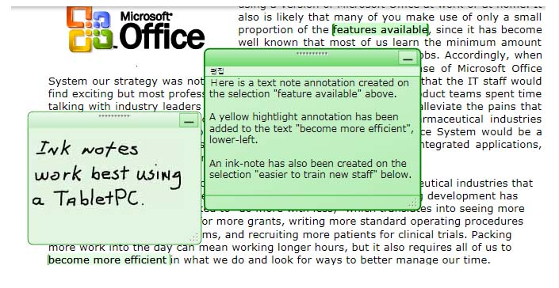
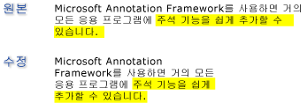

# 주석 개요Annotations Overview
종이 문서에 메모나 설명을 적는 것은 당연하게 받아들이는 매우 일반적인 행동입니다.Writing notes or comments on paper documents is such a commonplace activity that we almost take it for granted. 이러한 메모나 설명은 나중에 참조하기 위해 관심 있는 항목을 강조 표시하거나 정보를 첨부하기 위해 문서에 추가하는 "주석"입니다.These notes or comments are "annotations" that we add to a document to flag information or to highlight items of interest for later reference. 인쇄된 문서에 메모를 적는 것은 간단하고 일반적이지만 전자 문서에 개인적인 주석을 추가하는 기능은 대개 가능하더라도 매우 제한적입니다.Although writing notes on printed documents is easy and commonplace, the ability to add personal comments to electronic documents is typically very limited, if available at all.  
  
 이 항목에서는 몇 가지 일반적인 유형의 주석, 특히 스티커 메모 및 강조 표시를 검토 하 고 보여 줍니다 방법을 [!INCLUDE[TLA#tla_caf](../../../../includes/tlasharptla-caf-md.md)] 이러한 유형의 Windows Presentation Foundation (WPF) 문서를 통해 응용 프로그램에 대 한 주석 컨트롤 볼 수 있습니다.This topic reviews several common types of annotations, specifically sticky notes and highlights, and illustrates how the [!INCLUDE[TLA#tla_caf](../../../../includes/tlasharptla-caf-md.md)] facilitates these types of annotations in applications through the Windows Presentation Foundation (WPF) document viewing controls.  [!INCLUDE[TLA2#tla_wpf](../../../../includes/tla2sharptla-wpf-md.md)] 문서 보기 컨트롤을 지 원하는 주석이 포함 <xref:System.Windows.Controls.FlowDocumentReader> 및 <xref:System.Windows.Controls.FlowDocumentScrollViewer>에서 파생 된 컨트롤 뿐 <xref:System.Windows.Controls.Primitives.DocumentViewerBase> 같은 <xref:System.Windows.Controls.DocumentViewer> 및 <xref:System.Windows.Controls.FlowDocumentPageViewer>합니다. document viewing controls that support annotations include <xref:System.Windows.Controls.FlowDocumentReader> and <xref:System.Windows.Controls.FlowDocumentScrollViewer>, as well as controls derived from <xref:System.Windows.Controls.Primitives.DocumentViewerBase> such as <xref:System.Windows.Controls.DocumentViewer> and <xref:System.Windows.Controls.FlowDocumentPageViewer>.  
  
  
   
## 스티커 메모Sticky Notes  
 일반적인 스티커 메모는 작은 색지에 정보를 작성하여 문서에 "붙입니다".A typical sticky note contains information written on a small piece of colored paper that is then "stuck" to a document. 디지털 스티커 메모는 전자 문서에 비슷한 기능을 제공하지만 입력된 텍스트, 필기 메모(예: [!INCLUDE[TLA#tla_tpc](../../../../includes/tlasharptla-tpc-md.md)] "잉크" 스트로크) 또는 웹 링크와 같이 다양한 유형의 콘텐츠를 유연하게 추가할 수 있습니다.Digital sticky notes provide similar functionality for electronic documents, but with the added flexibility to include many other types of content such as typed text, handwritten notes (for example, [!INCLUDE[TLA#tla_tpc](../../../../includes/tlasharptla-tpc-md.md)] "ink" strokes), or Web links.  
  
 다음 그림에서는 강조 표시, 텍스트 스티커 메모 및 잉크 스티커 메모 주석의 몇 가지 예를 보여 줍니다.The following illustration shows some examples of highlight, text sticky note, and ink sticky note annotations.  
  
   
  
 다음 예제에서는 응용 프로그램에서 주석 지원을 설정하는 데 사용할 수 있는 메서드를 보여 줍니다.The following example shows the method that you can use to enable annotation support in your application.  
  
 [!code-csharp[DocViewerAnnotationsXml#DocViewXmlStartAnnotations](../../../../samples/snippets/csharp/VS_Snippets_Wpf/DocViewerAnnotationsXml/CSharp/Window1.xaml.cs#docviewxmlstartannotations)]
 [!code-vb[DocViewerAnnotationsXml#DocViewXmlStartAnnotations](../../../../samples/snippets/visualbasic/VS_Snippets_Wpf/DocViewerAnnotationsXml/visualbasic/window1.xaml.vb#docviewxmlstartannotations)]  
  
   
## 강조 표시Highlights  
 사람들은 종이 문서에 표시할 때 밑줄 긋기, 강조 표시, 문장에 포함된 단어에 동그라미 표시, 여백에 표식이나 주석 그리기 등의 창조적인 방법으로 관심 있는 항목에 주의를 끌도록 합니다.People use creative methods to draw attention to items of interest when they mark up a paper document, such as underlining, highlighting, circling words in a sentence, or drawing marks or notations in the margin.  [!INCLUDE[TLA#tla_caf](../../../../includes/tlasharptla-caf-md.md)]의 강조 표시 주석은 [!INCLUDE[TLA2#tla_wpf](../../../../includes/tla2sharptla-wpf-md.md)] 문서 보기 컨트롤에 표시되는 정보를 지정하는 것과 비슷한 기능을 제공합니다.Highlight annotations in [!INCLUDE[TLA#tla_caf](../../../../includes/tlasharptla-caf-md.md)] provide a similar feature for marking up information displayed in [!INCLUDE[TLA2#tla_wpf](../../../../includes/tla2sharptla-wpf-md.md)] document viewing controls.  
  
 다음 그림에서는 강조 표시 주석의 예를 보여 줍니다.The following illustration shows an example of a highlight annotation.  
  
   
  
 일반적으로 사용자가 일부 텍스트 또는 관심 있는 항목을 먼저 선택 하 고 표시 하려면 마우스 오른쪽 단추로 클릭 하 여 주석을 작성 한 <xref:System.Windows.Controls.ContextMenu> 주석 옵션입니다.Users typically create annotations by first selecting some text or an item of interest, and then right-clicking to display a <xref:System.Windows.Controls.ContextMenu> of annotation options.  다음 예제와 [!INCLUDE[TLA#tla_xaml](../../../../includes/tlasharptla-xaml-md.md)] 선언 하는 데 사용할 수는 <xref:System.Windows.Controls.ContextMenu> 만들고 주석을 관리 하려면 사용자가 액세스할 수 있는 라우팅된 명령을 사용 합니다.The following example shows the [!INCLUDE[TLA#tla_xaml](../../../../includes/tlasharptla-xaml-md.md)] you can use to declare a <xref:System.Windows.Controls.ContextMenu> with routed commands that users can access to create and manage annotations.  
  
 [!code-xaml[DocViewerAnnotationsXps#CreateDeleteAnnotations](../../../../samples/snippets/csharp/VS_Snippets_Wpf/DocViewerAnnotationsXps/CSharp/Window1.xaml#createdeleteannotations)]  
  
   
## 데이터 고정Data Anchoring  
 [!INCLUDE[TLA2#tla_caf](../../../../includes/tla2sharptla-caf-md.md)]에서는 표시 보기의 위치뿐만 아니라 사용자가 선택한 데이터에도 주석을 바인딩합니다.The [!INCLUDE[TLA2#tla_caf](../../../../includes/tla2sharptla-caf-md.md)] binds annotations to the data that the user selects, not just to a position on the display view. 따라서 사용자가 표시 창을 스크롤하거나 크기를 조정할 때와 같이 문서 보기가 변경되면 주석은 바인딩된 데이터 선택 항목과 함께 그대로 유지됩니다.Therefore, if the document view changes, such as when the user scrolls or resizes the display window, the annotation stays with the data selection to which it is bound. 예를 들어 다음 그래픽에서는 사용자가 텍스트를 선택하여 만든 주석을 보여 줍니다.For example, the following graphic illustrates an annotation that the user has made on a text selection. 문서 보기가 변경되면(스크롤, 크기 조정, 배율 또는 이동 등) 강조 표시 주석은 원래의 데이터 선택 항목과 함께 이동합니다.When the document view changes (scrolls, resizes, scales, or otherwise moves), the highlight annotation moves with the original data selection.  
  
   
  
   
## 주석이 지정된 개체에 주석 연결Matching Annotations with Annotated Objects  
 주석을 해당 주석이 지정된 개체와 연결할 수 있습니다.You can match annotations with the corresponding annotated objects. 예를 들어 주석 창이 있는 간단한 문서 판독기 응용 프로그램을 생각해 보겠습니다.For example, consider a simple document reader application that has a comments pane. 주석 창은 문서에 고정된 주석 목록의 텍스트를 표시하는 목록 상자일 수 있습니다.The comments pane might be a list box that displays the text from a list of annotations that are anchored to a document. 사용자가 목록 상자에서 항목을 선택하면 응용 프로그램에서 해당 주석 개체에 고정된 문서의 단락을 표시합니다.If the user selects an item in the list box, then the application brings into view the paragraph in the document that the corresponding annotation object is anchored to.  
  
 다음 예제에서는 주석 창으로 사용되는 목록 상자의 이벤트 처리기를 구현하는 방법을 보여 줍니다.The following example demonstrates how to implement the event handler of such a list box that serves as the comments pane.  
  
 [!code-csharp[FlowDocumentAnnotatedViewer#Handler](../../../../samples/snippets/csharp/VS_Snippets_Wpf/FlowDocumentAnnotatedViewer/CSharp/Window1.xaml.cs#handler)]
 [!code-vb[FlowDocumentAnnotatedViewer#Handler](../../../../samples/snippets/visualbasic/VS_Snippets_Wpf/FlowDocumentAnnotatedViewer/visualbasic/window1.xaml.vb#handler)]  
  
 다른 예제 시나리오는 주석 및 전자 메일을 통해 문서 독자 간의 스티커 메모를 교환할 수 있도록 하는 응용 프로그램을 포함 합니다.Another example scenario involves applications that enable the exchange of annotations and sticky notes between document readers through email. 이러한 응용 프로그램은 이 기능을 통해 판독기에서 교환하는 주석이 포함된 페이지로 이동할 수 있습니다.This feature enables these applications to navigate the reader to the page that contains the annotation that is being exchanged.  
  
## 참고 항목See Also  
 <xref:System.Windows.Controls.Primitives.DocumentViewerBase>  
 <xref:System.Windows.Controls.DocumentViewer>  
 <xref:System.Windows.Controls.FlowDocumentPageViewer>  
 <xref:System.Windows.Controls.FlowDocumentScrollViewer>  
 <xref:System.Windows.Controls.FlowDocumentReader>  
 <xref:System.Windows.Annotations.IAnchorInfo>  
 [주석 스키마Annotations Schema](../../../../docs/framework/wpf/advanced/annotations-schema.md)  
 [ContextMenu 개요ContextMenu Overview](../../../../docs/framework/wpf/controls/contextmenu-overview.md)  
 [명령 개요Commanding Overview](../../../../docs/framework/wpf/advanced/commanding-overview.md)  
 [유동 문서 개요Flow Document Overview](../../../../docs/framework/wpf/advanced/flow-document-overview.md)  
 [방법: MenuItem에 명령 추가How to: Add a Command to a MenuItem](http://msdn.microsoft.com/library/013d68a0-5373-4a68-bd91-5de574307370)
