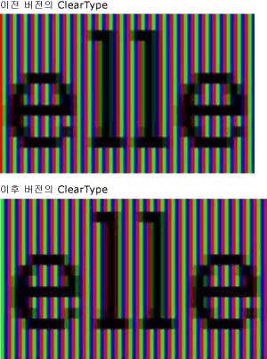
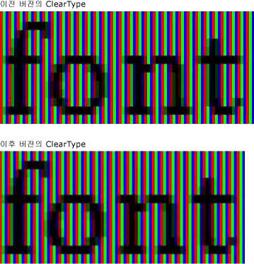
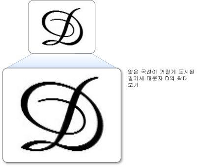
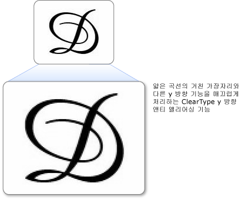

# ClearType 개요
이 항목에서는 [!INCLUDE[TLA#tla_winclient](../../../../includes/tlasharptla-winclient-md.md)]에서 사용되는 [!INCLUDE[TLA#tla_ct](../../../../includes/tlasharptla-ct-md.md)] 기술에 대한 개요를 제공합니다.  
  
   
  
   
## 기술 개요  
 [!INCLUDE[TLA2#tla_ct](../../../../includes/tla2sharptla-ct-md.md)]은 랩톱 화면, 포켓 PC 화면, 평면 모니터 등 기존의 LCD\(액정 디스플레이\)에서 보다 쉽게 텍스트를 읽을 수 있도록 지원하기 위해 [!INCLUDE[TLA#tla_ms](../../../../includes/tlasharptla-ms-md.md)]에서 개발한 소프트웨어 기술입니다.  [!INCLUDE[TLA2#tla_ct](../../../../includes/tla2sharptla-ct-md.md)]은 LCD 화면의 모든 픽셀에 있는 각각의 세로 줄로 된 색 요소에 액세스하는 방식으로 작동합니다.  [!INCLUDE[TLA2#tla_ct](../../../../includes/tla2sharptla-ct-md.md)] 이전에 컴퓨터에서 표시할 수 있는 가장 작은 단위는 픽셀이었지만 LCD 모니터에서 실행되는 [!INCLUDE[TLA2#tla_ct](../../../../includes/tla2sharptla-ct-md.md)]을 사용하면 너비가 픽셀의 소수 값으로 표현되는 작은 텍스트 특징까지 표시할 수 있습니다.  해상도가 높아짐에 따라 텍스트의 미세한 부분까지 보다 선명하게 표시되므로 오랫동안 읽어도 불편함을 덜 느끼게 됩니다.  
  
 [!INCLUDE[TLA#tla_winclient](../../../../includes/tlasharptla-winclient-md.md)]에서 제공되는 [!INCLUDE[TLA2#tla_ct](../../../../includes/tla2sharptla-ct-md.md)]은 [!INCLUDE[TLA2#tla_ct](../../../../includes/tla2sharptla-ct-md.md)]의 여러 버전에 걸쳐 몇 차례 향상된 [!INCLUDE[TLA#tla_gdi](../../../../includes/tlasharptla-gdi-md.md)]의 최신 버전입니다.  
  
   
## 하위 픽셀 위치 지정  
 [!INCLUDE[TLA2#tla_ct](../../../../includes/tla2sharptla-ct-md.md)]의 이전 버전에 비해 크게 향상된 것은 하위 픽셀 위치 지정 기능을 사용한다는 것입니다.  [!INCLUDE[TLA2#tla_gdi](../../../../includes/tla2sharptla-gdi-md.md)]의 [!INCLUDE[TLA2#tla_ct](../../../../includes/tla2sharptla-ct-md.md)] 구현과 달리 [!INCLUDE[TLA#tla_winclient](../../../../includes/tlasharptla-winclient-md.md)]의 [!INCLUDE[TLA2#tla_ct](../../../../includes/tla2sharptla-ct-md.md)]에서는 문자 모양이 픽셀의 시작 경계에서만 시작할 수 있는 것이 아니라 픽셀 안에서도 시작할 수 있습니다.  문자 모양의 위치 지정에 대해 지원되는 이러한 높은 해상도 덕분에 문자 모양의 간격과 비율의 정밀도와 일관성이 높아집니다.  
  
 다음 두 예제에서는 하위 픽셀 위치 지정 기능을 사용할 때 문자 모양이 하위 픽셀 경계에서 시작되는 방식을 보여 줍니다.  왼쪽의 예제는 하위 픽셀 위치 지정을 지원하지 않는 [!INCLUDE[TLA2#tla_ct](../../../../includes/tla2sharptla-ct-md.md)] 렌더러의 이전 버전을 사용하여 렌더링됩니다.  오른쪽의 예제는 하위 픽셀 위치 지정을 지원하는 새 버전의 [!INCLUDE[TLA2#tla_ct](../../../../includes/tla2sharptla-ct-md.md)] 렌더러를 사용하여 렌더링됩니다.  오른쪽 이미지의 **e**와 **l**은 서로 다른 하위 픽셀에서 시작되기 때문에 렌더링 방식이 약간 다릅니다.  텍스트를 화면에서 정상 크기로 볼 때는 문자 모양 이미지의 고대비 때문에 이 차이가 눈에 띄지 않습니다.  이런 특징은 [!INCLUDE[TLA2#tla_ct](../../../../includes/tla2sharptla-ct-md.md)]에 통합된 정교한 색 필터링 덕분에 가능합니다.  
  
   
이전 버전 및 최신 버전의 ClearType으로 표시된 텍스트  
  
 다음 두 예제에서는 이전 [!INCLUDE[TLA2#tla_ct](../../../../includes/tla2sharptla-ct-md.md)] 렌더러의 출력과 새 버전 [!INCLUDE[TLA2#tla_ct](../../../../includes/tla2sharptla-ct-md.md)] 렌더러의 출력을 비교합니다.  오른쪽의 하위 픽셀 위치 지정은 화면의 글자 간격 배치를 크게 개선하며, 특히 작은 크기의 경우에는 하위 픽셀과 전체 픽셀 사이의 차이가 문자 모양 너비의 많은 부분을 차지하므로 그러한 특징이 두드러집니다.  두 번째 이미지에서는 글자 사이의 간격이 더 균일함을 알 수 있습니다.  텍스트 화면의 전체적인 모양을 보면 하위 픽셀 위치 지정의 이점이 더욱 크게 드러나 [!INCLUDE[TLA2#tla_ct](../../../../includes/tla2sharptla-ct-md.md)] 기술의 중요한 혁신을 보여 줍니다.  
  
   
이전 버전 및 최신 버전의 ClearType을 사용한 텍스트  
  
   
## Y 방향 앤티 앨리어싱  
 [!INCLUDE[TLA#tla_winclient](../../../../includes/tlasharptla-winclient-md.md)]에서 [!INCLUDE[TLA2#tla_ct](../../../../includes/tla2sharptla-ct-md.md)]의 다른 향상된 기능은 y 방향 앤티 앨리어싱입니다.  y 방향 앤티 앨리어싱이 지원되지 않는 [!INCLUDE[TLA2#tla_gdi](../../../../includes/tla2sharptla-gdi-md.md)]의 [!INCLUDE[TLA2#tla_ct](../../../../includes/tla2sharptla-ct-md.md)]의 경우에는 x축에서만 높은 해상도를 제공하고 y축에서는 그렇지 않습니다.  얇은 곡선의 상단과 하단에 거칠게 표시된 부분은 가독성을 낮춥니다.  
  
 다음 예제에서는 y 방향 앤티 앨리어싱이 없을 때의 효과를 보여 줍니다.  이 경우 문자 위와 아래에서 거친 가장자리가 눈에 띕니다.  
  
   
얇은 곡선이 거칠게 표시된 텍스트  
  
 [!INCLUDE[TLA#tla_winclient](../../../../includes/tlasharptla-winclient-md.md)]의 [!INCLUDE[TLA2#tla_ct](../../../../includes/tla2sharptla-ct-md.md)]은 거친 가장자리를 매끄럽게 하기 위해 y 방향에서 앤티 앨리어싱을 제공합니다.  표의 문자의 경우 가로와 세로에서 얇은 곡선의 양이 거의 같기 때문에 이 기능은 특히 동아시아 언어의 가독성 향상에 중요합니다.  
  
 다음 예제에서는 y 방향 앤티 앨리어싱의 효과를 보여 줍니다.  이 경우 문자의 위와 아래 곡선이 더 매끄럽게 보입니다.  
  
   
ClearType Y 방향 앤티 앨리어싱 기능으로 표현한 텍스트  
  
   
## 하드웨어 가속  
 [!INCLUDE[TLA#tla_winclient](../../../../includes/tlasharptla-winclient-md.md)]의 [!INCLUDE[TLA2#tla_ct](../../../../includes/tla2sharptla-ct-md.md)]은 하드웨어 가속의 이점을 활용하여 성능을 더 높이고 CPU 로드와 시스템 메모리 요구 사항을 줄일 수 있습니다.  [!INCLUDE[TLA2#tla_ct](../../../../includes/tla2sharptla-ct-md.md)]은 그래픽 카드의 픽셀 셰이더와 비디오 메모리를 사용함으로써 특히 애니메이션을 사용할 때 더 빠른 텍스트 렌더링을 제공합니다.  
  
 [!INCLUDE[TLA#tla_winclient](../../../../includes/tlasharptla-winclient-md.md)]의 [!INCLUDE[TLA2#tla_ct](../../../../includes/tla2sharptla-ct-md.md)]은 시스템 전체 [!INCLUDE[TLA2#tla_ct](../../../../includes/tla2sharptla-ct-md.md)] 설정을 수정하지 않습니다.  [!INCLUDE[TLA#tla_mswin](../../../../includes/tlasharptla-mswin-md.md)]에서 [!INCLUDE[TLA2#tla_ct](../../../../includes/tla2sharptla-ct-md.md)]을 사용하지 않으면 [!INCLUDE[TLA#tla_winclient](../../../../includes/tlasharptla-winclient-md.md)] 앤티 앨리어싱이 회색조 모드로 설정됩니다. 또한 [!INCLUDE[TLA#tla_winclient](../../../../includes/tlasharptla-winclient-md.md)]의 [!INCLUDE[TLA2#tla_ct](../../../../includes/tla2sharptla-ct-md.md)]은 [ClearType Tuner PowerToy](http://www.microsoft.com/typography/ClearTypePowerToy.mspx)의 설정을 수정하지 않습니다.  
  
 [!INCLUDE[TLA#tla_winclient](../../../../includes/tlasharptla-winclient-md.md)] 아키텍처 디자인과 관련해 내려진 결정 중 하나는 사용이 증가하고 있는 고해상도 DPI 모니터를 더 효과적으로 지원하기 위한 해상도의 영향을 받지 않는 레이아웃이 있어야 한다는 점입니다.  이에 따른 결론은 일부 동아시아 글꼴의 비트맵 또는 앨리어싱된 텍스트 렌더링이 모두 해상도의 영향을 받기 때문에 [!INCLUDE[TLA#tla_winclient](../../../../includes/tlasharptla-winclient-md.md)]에서는 이를 지원하지 않는다는 것입니다.  
  
   
## 추가 정보  
 [ClearType Information](http://www.microsoft.com/typography/ClearTypeInfo.mspx)  
  
 [ClearType Tuner PowerToy](http://www.microsoft.com/typography/ClearTypePowerToy.mspx)  
  
## 참고 항목  
 [ClearType 레지스트리 설정](../../../../docs/framework/wpf/advanced/cleartype-registry-settings.md)