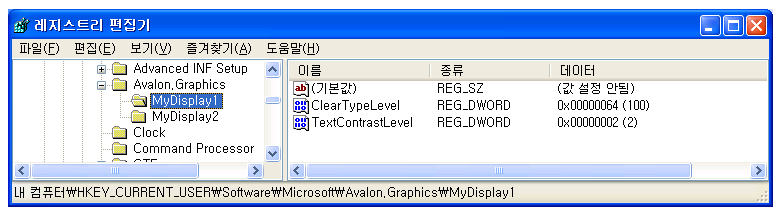
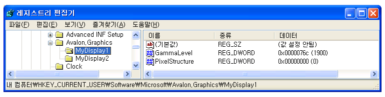

# ClearType 레지스트리 설정
이 항목에 대해 간략하게 설명 된 [!INCLUDE[TLA2#tla_winclient](../../../../includes/tla2sharptla-winclient-md.md)] [!INCLUDE[TLA#tla_ct](../../../../includes/tlasharptla-ct-md.md)] 에서 사용 되는 레지스트리 설정이 [!INCLUDE[TLA2#tla_winclient](../../../../includes/tla2sharptla-winclient-md.md)] 응용 프로그램입니다.  
  
  
   
## 기술 개요  
 [!INCLUDE[TLA2#tla_winclient](../../../../includes/tla2sharptla-winclient-md.md)]디스플레이 장치 사용에 대 한 텍스트를 렌더링 하는 응용 프로그램 [!INCLUDE[TLA2#tla_ct](../../../../includes/tla2sharptla-ct-md.md)] 기능 향상된 된 읽기 환경을 제공 합니다. [!INCLUDE[TLA2#tla_ct](../../../../includes/tla2sharptla-ct-md.md)]은 랩톱 화면, Pocket PC 화면, 평면 모니터 등 기존의 LCD(액정 디스플레이)에서 보다 쉽게 텍스트를 읽을 수 있도록 하기 위해 [!INCLUDE[TLA#tla_ms](../../../../includes/tlasharptla-ms-md.md)]에서 개발한 소프트웨어 기술입니다. [!INCLUDE[TLA2#tla_ct](../../../../includes/tla2sharptla-ct-md.md)]은 LCD 화면의 모든 픽셀에 있는 개별 세로 색 스트라이프 요소에 액세스하는 방식으로 작동합니다. 대 한 자세한 내용은 [!INCLUDE[TLA2#tla_ct](../../../../includes/tla2sharptla-ct-md.md)], 참조 [ClearType 개요](../../../../docs/framework/wpf/advanced/cleartype-overview.md)합니다.  
  
 텍스트와 함께 렌더링 된 [!INCLUDE[TLA2#tla_ct](../../../../includes/tla2sharptla-ct-md.md)] 다양 한 디스플레이 장치에서 크게 다르게 보일 수 있습니다. 파란색, 녹색, 빨강 순서로 색 요소가 아닌 일반적인 빨강, 녹색, 파란색 모니터 수가 적은 구현 하는 예를 들어 ( [!INCLUDE[TLA#tla_rgb](../../../../includes/tlasharptla-rgb-md.md)]) 순서입니다.  
  
 텍스트와 함께 렌더링 된 [!INCLUDE[TLA2#tla_ct](../../../../includes/tla2sharptla-ct-md.md)] 도 다양 한 수준의 색 민감도 개인이 크게 다르게 보일 수 있습니다. 어떤 사람은 다른 사람보다 미묘한 색의 차이를 더 잘 감지할 수 있습니다.  
  
 이러한 경우 [!INCLUDE[TLA2#tla_ct](../../../../includes/tla2sharptla-ct-md.md)] 기능 최선의 읽기 각 개인에 대 한 환경을 제공 하기 위해 수정 해야 합니다.  
  
   
## 레지스트리 설정  
 [!INCLUDE[TLA2#tla_winclient](../../../../includes/tla2sharptla-winclient-md.md)]네 가지 레지스트리 설정을 제어 하기 위한 지정 [!INCLUDE[TLA2#tla_ct](../../../../includes/tla2sharptla-ct-md.md)] 기능:  
  
|설정|설명|  
|-------------|-----------------|  
|[!INCLUDE[TLA2#tla_ct](../../../../includes/tla2sharptla-ct-md.md)] 수준|수준을 설명 [!INCLUDE[TLA2#tla_ct](../../../../includes/tla2sharptla-ct-md.md)] 색 명확성 합니다.|  
|감마 수준|디스플레이 장치의 픽셀 색 구성 요소 수준을 설명합니다.|  
|픽셀 구조체|디스플레이 장치의 픽셀 배치를 설명합니다.|  
|텍스트 대비 수준|표시되는 텍스트의 대비 수준을 설명합니다.|  
  
 이러한 설정은 식별 된 참조 하는 방법을 있는 외부 구성 유틸리티에서 액세스할 수 있습니다 [!INCLUDE[TLA2#tla_winclient](../../../../includes/tla2sharptla-winclient-md.md)] [!INCLUDE[TLA2#tla_ct](../../../../includes/tla2sharptla-ct-md.md)] 레지스트리 설정 합니다. 이러한 설정은 [!INCLUDE[TLA#tla_mswin](../../../../includes/tlasharptla-mswin-md.md)] 레지스트리 편집기를 통해 직접 값에 액세스하여 만들거나 수정할 수도 있습니다.  
  
 경우는 [!INCLUDE[TLA2#tla_winclient](../../../../includes/tla2sharptla-winclient-md.md)] [!INCLUDE[TLA2#tla_ct](../../../../includes/tla2sharptla-ct-md.md)] 레지스트리 설정은 (이 기본 상태), 설정 되지 않습니다는 [!INCLUDE[TLA2#tla_winclient](../../../../includes/tla2sharptla-winclient-md.md)] 응용 프로그램 쿼리는 [!INCLUDE[TLA#tla_mswin](../../../../includes/tlasharptla-mswin-md.md)] 글꼴 다듬기 설정에 대 한 시스템 매개 변수 정보입니다.  
  
> [!NOTE]
>  디스플레이 장치 이름을 열거에 대 한 자세한 내용은 참조는 `SystemParametersInfo` [!INCLUDE[TLA2#tla_win32](../../../../includes/tla2sharptla-win32-md.md)] 함수입니다.  
  
   
## ClearType 수준  
 [!INCLUDE[TLA2#tla_ct](../../../../includes/tla2sharptla-ct-md.md)] 수준에서는 개인에 대 한 인식와 색 민감도에 따라 텍스트의 렌더링을 조정할 수 있습니다. 일부 개인, 텍스트의 렌더링을 사용 하는 [!INCLUDE[TLA2#tla_ct](../../../../includes/tla2sharptla-ct-md.md)] 가장 높은 수준에서 최선의 환경을 읽기을 생성 하지 않습니다.  
  
 [!INCLUDE[TLA2#tla_ct](../../../../includes/tla2sharptla-ct-md.md)] 수준은 0에서 100 사이의 정수 값입니다. 기본값은 100, 즉 [!INCLUDE[TLA2#tla_ct](../../../../includes/tla2sharptla-ct-md.md)] 디스플레이 장치의 색 요소가의 최대는 기능을 사용 합니다. 그러나 한 [!INCLUDE[TLA2#tla_ct](../../../../includes/tla2sharptla-ct-md.md)] 수준 0의 텍스트를 회색조로 렌더링 합니다. 설정 하 여는 [!INCLUDE[TLA2#tla_ct](../../../../includes/tla2sharptla-ct-md.md)] 0과 100 사이의 임의 수준에서 만들 수 있습니다 각 사용자의 색 구분 하기에 적합 한 중간 수준을 합니다.  
  
### 레지스트리 설정  
 에 대 한 레지스트리 설정 위치는 [!INCLUDE[TLA2#tla_ct](../../../../includes/tla2sharptla-ct-md.md)] 수준은 특정 디스플레이 장치 이름에 해당 하는 개별 사용자 설정:  
  
 `HKEY_CURRENT_USER\SOFTWARE\Microsoft\Avalon.Graphics\<displayName>`  
  
 사용자가 각 디스플레이 장치 이름에 대 한 한 `ClearTypeLevel` DWORD 값 정의 됩니다. 다음 스크린샷은 대 한 레지스트리 편집기 설정의 [!INCLUDE[TLA2#tla_ct](../../../../includes/tla2sharptla-ct-md.md)] 수준입니다.  
  
   
  
> [!NOTE]
>  [!INCLUDE[TLA2#tla_winclient](../../../../includes/tla2sharptla-winclient-md.md)]응용 프로그램의 텍스트와 사용 하지 않는 다음 중 하나가 두 가지 모드 중 하나를 렌더링 [!INCLUDE[TLA2#tla_ct](../../../../includes/tla2sharptla-ct-md.md)]합니다. 없이 텍스트를 렌더링 하는 경우 [!INCLUDE[TLA2#tla_ct](../../../../includes/tla2sharptla-ct-md.md)], 회색조 렌더링 라고 합니다.  
  
   
## 감마 수준  
 감마 수준은 픽셀 값과 광도 사이의 비선형 관계를 가리킵니다. 감마 수준 설정은 디스플레이 장치의 물리적 특성과 일치해야 합니다. 그렇지 않으면 렌더링된 출력에서 왜곡이 발생할 수 있습니다. 예를 들어 테스트가 너무 넓거나 너무 좁게 나타나거나 문자 모양의 세로 획 가장자리에 색 주름이 나타날 수 있습니다.  
  
 감마 수준은 1,000에서 2,200까지의 정수 값입니다. 기본 수준은 1,900입니다.  
  
### 레지스트리 설정  
 감마 수준에 대한 레지스트리 설정 위치는 특정 디스플레이 장치 이름에 해당하는 로컬 컴퓨터 설정입니다.  
  
 `HKEY_LOCAL_MACHINE\SOFTWARE\Microsoft\Avalon.Graphics\<displayName>`  
  
 사용자가 각 디스플레이 장치 이름에 대 한 한 `GammaLevel` DWORD 값 정의 됩니다. 다음 스크린샷에서는 감마 수준에 대한 레지스트리 편집기 설정을 보여 줍니다.  
  
   
  
   
## 픽셀 구조체  
 픽셀 구조체는 디스플레이 장치를 구성하는 픽셀 형식을 설명합니다. 픽셀 구조체는 다음 세 가지 형식 중 하나로 정의됩니다.  
  
|형식|값|설명|  
|----------|-----------|-----------------|  
|플랫|0|디스플레이 장치에는 픽셀 구조체가 없습니다. 즉 각 색의 광원이 픽셀 영역에서 고르게 분산되며, 이를 회색조 렌더링이라고 합니다. 이 형식은 표준 디스플레이 장치에서 작동하는 방법입니다. [!INCLUDE[TLA2#tla_ct](../../../../includes/tla2sharptla-ct-md.md)]이 렌더링된 텍스트에 적용되지 않습니다.|  
|RGB|1|디스플레이 장치에는 빨강, 녹색 및 파랑 순서의 3개 스트라이프로 구성되는 픽셀이 있습니다. [!INCLUDE[TLA2#tla_ct](../../../../includes/tla2sharptla-ct-md.md)]이 렌더링된 텍스트에 적용됩니다.|  
|BGR|2|디스플레이 장치에는 파랑, 녹색 및 빨강 순서의 3개 스트라이프로 구성되는 픽셀이 있습니다. [!INCLUDE[TLA2#tla_ct](../../../../includes/tla2sharptla-ct-md.md)]이 렌더링된 텍스트에 적용됩니다. 색의 순서가 RGB 형식과는 반대입니다.|  
  
 픽셀 구조체는 0에서 2까지의 정수 값에 해당합니다. 기본 수준은 플랫 픽셀 구조체를 나타내는 0입니다.  
  
> [!NOTE]
>  디스플레이 장치 이름을 열거에 대 한 자세한 내용은 참조는 `EnumDisplayDevices` [!INCLUDE[TLA2#tla_win32](../../../../includes/tla2sharptla-win32-md.md)] 함수입니다.  
  
### 레지스트리 설정  
 픽셀 구조체에 대한 레지스트리 설정 위치는 특정 디스플레이 장치 이름에 해당하는 로컬 컴퓨터 설정입니다.  
  
 `HKEY_LOCAL_MACHINE\SOFTWARE\Microsoft\Avalon.Graphics\<displayName>`  
  
 사용자가 각 디스플레이 장치 이름에 대 한 한 `PixelStructure` DWORD 값 정의 됩니다. 다음 스크린샷에서는 픽셀 구조체에 대한 레지스트리 편집기 설정을 보여 줍니다.  
  
   
  
   
## 텍스트 대비 수준  
 텍스트 대비 수준을 사용하면 문자 모양의 획 너비를 기준으로 텍스트 렌더링을 조정할 수 있습니다. 텍스트 대비 수준은 0에서 6까지의 정수 값이며, 정수 값이 클수록 획이 넓어집니다. 기본 수준은 1입니다.  
  
### 레지스트리 설정  
 텍스트 대비 수준에 대한 레지스트리 설정 위치는 특정 디스플레이 장치 이름에 해당하는 개별 사용자 설정입니다.  
  
 `HKEY_CURRENT_USER\Software\Microsoft\Avalon.Graphics\<displayName>`  
  
 사용자가 각 디스플레이 장치 이름에 대 한 한 `TextContrastLevel` DWORD 값 정의 됩니다. 다음 스크린샷에서는 텍스트 대조 수준에 대한 레지스트리 편집기 설정을 보여 줍니다.  
  
   
  
## 참고 항목  
 [ClearType 개요](../../../../docs/framework/wpf/advanced/cleartype-overview.md)  
 [ClearType 앤티 앨리어싱](https://msdn.microsoft.com/library/dd183433(v=vs.85).aspx)
