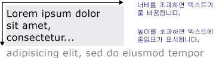

# 서식 있는 텍스트 그리기
이 항목에서는 <xref:System.Windows.Media.FormattedText> 개체의 기능에 대해 간략하게 설명합니다.  이 개체는 [!INCLUDE[TLA#tla_winclient](../../../../includes/tlasharptla-winclient-md.md)] 응용 프로그램에서 텍스트를 그리기 위한 하위 수준의 제어를 제공합니다.  
  
 [!INCLUDE[autoOutline](../Token/autoOutline_md.md)]  
  
   
## 기술 개요  
 <xref:System.Windows.Media.FormattedText> 개체를 사용하면 여러 줄 텍스트를 그릴 수 있으며 각 텍스트 문자의 서식을 개별적으로 지정할 수 있습니다.  다음 예제에서는 여러 서식이 적용된 텍스트를 보여 줍니다.  
  
   
FormattedText 메서드를 사용하여 표시한 텍스트  
  
> [!NOTE]
>  [Win32 마이그레이션](#win32_migration) 단원의 표에는 [!INCLUDE[TLA#tla_win32](../../../../includes/tlasharptla-win32-md.md)] API에서 마이그레이션하는 개발자를 위해 [!INCLUDE[TLA#tla_win32](../../../../includes/tlasharptla-win32-md.md)] DrawText 플래그와 이에 해당되는 [!INCLUDE[TLA#tla_winclient](../../../../includes/tlasharptla-winclient-md.md)] 항목이 나와 있습니다.  
  
### 서식 있는 텍스트를 사용하는 이유  
 [!INCLUDE[TLA2#tla_winclient](../../../../includes/tla2sharptla-winclient-md.md)]에는 화면에 텍스트를 그리기 위한 다양한 컨트롤이 포함되어 있습니다.  각 컨트롤은 서로 다른 시나리오에 사용되며 컨트롤마다 고유한 기능 및 제한 사항이 있습니다.  [!INCLUDE[TLA#tla_ui](../../../../includes/tlasharptla-ui-md.md)]의 간단한 문장과 같이 제한된 텍스트 지원이 필요할 경우 일반적으로 <xref:System.Windows.Controls.TextBlock> 요소를 사용해야 합니다.  <xref:System.Windows.Controls.Label>은 최소한의 텍스트 지원만 필요할 경우 사용할 수 있습니다.  자세한 내용은 [WPF의 문서](../../../../docs/framework/wpf/advanced/documents-in-wpf.md)를 참조하십시오.  
  
 <xref:System.Windows.Media.FormattedText> 개체는 [!INCLUDE[TLA#tla_winclient](../../../../includes/tlasharptla-winclient-md.md)] 텍스트 컨트롤에 비해 훨씬 다양한 텍스트 서식 지정 기능을 제공하며 텍스트를 장식 요소로 사용하려는 경우에 매우 유용합니다. 자세한 내용은 아래에 나오는 [서식 있는 텍스트를 기하 도형으로 변환](#converting_formatted_text) 단원을 참조하십시오.  
  
 또한 <xref:System.Windows.Media.FormattedText> 개체는 <xref:System.Windows.Media.DrawingVisual>에서 파생된 텍스트 기반의 개체를 만들 때도 유용합니다.  <xref:System.Windows.Media.DrawingVisual>은 도형, 이미지 또는 텍스트를 렌더링하는 데 사용되는 간단한 그리기 클래스입니다.  자세한 내용은 [Hit Test Using DrawingVisuals 샘플](http://go.microsoft.com/fwlink/?LinkID=159994)을 참조하십시오.  
  
   
## FormattedText 개체 사용  
 서식 있는 텍스트를 만들려면 <xref:System.Windows.Media.FormattedText.%23ctor%2A> 생성자를 호출하여 <xref:System.Windows.Media.FormattedText> 개체를 만듭니다.  초기 서식 있는 텍스트 문자열을 만든 다음에는 다양한 서식 스타일을 적용할 수 있습니다.  
  
 <xref:System.Windows.Media.FormattedText.MaxTextWidth%2A> 속성을 사용하여 텍스트의 너비를 제한하면  지정한 너비를 초과하지 않도록 텍스트가 자동으로 줄 바꿈됩니다.  <xref:System.Windows.Media.FormattedText.MaxTextHeight%2A> 속성을 사용하여 텍스트의 높이를 제한할 수도 있는데  이렇게 하면 지정한 높이를 초과하는 텍스트에 줄임표\("…"\)가 표시됩니다.  
  
   
자동 줄 바꿈 및 줄임표가 적용된 텍스트  
  
 하나 이상의 문자에 여러 서식 스타일을 적용할 수 있습니다.  예를 들어 <xref:System.Windows.Media.FormattedText.SetFontSize%2A> 및 <xref:System.Windows.Media.FormattedText.SetForegroundBrush%2A> 메서드를 모두 호출하여 텍스트에 있는 처음 5개 문자의 서식을 변경할 수 있습니다.  
  
 다음 코드 예제에서는 <xref:System.Windows.Media.FormattedText> 개체를 만든 다음 텍스트에 몇 가지 서식 스타일을 적용합니다.  
  
 [!code-csharp[FormattedTextSnippets#FormattedTextSnippets1](../../../../samples/snippets/csharp/VS_Snippets_Wpf/FormattedTextSnippets/CSharp/Window1.xaml.cs#formattedtextsnippets1)]
 [!code-vb[FormattedTextSnippets#FormattedTextSnippets1](../../../../samples/snippets/visualbasic/VS_Snippets_Wpf/FormattedTextSnippets/visualbasic/window1.xaml.vb#formattedtextsnippets1)]  
  
### 글꼴 크기의 측정 단위  
 [!INCLUDE[TLA#tla_winclient](../../../../includes/tlasharptla-winclient-md.md)] 응용 프로그램의 다른 텍스트 개체와 마찬가지로 <xref:System.Windows.Media.FormattedText> 개체도 장치에 관계없이 픽셀을 측정 단위로 사용합니다.  그러나 대부분의 [!INCLUDE[TLA#tla_win32](../../../../includes/tlasharptla-win32-md.md)] 응용 프로그램에서는 측정 단위가 포인트입니다.  [!INCLUDE[TLA#tla_winclient](../../../../includes/tlasharptla-winclient-md.md)] 응용 프로그램에서 텍스트를 포인트 단위로 표시하려면 [!INCLUDE[TLA#tla_dipixel#plural](../../../../includes/tlasharptla-dipixelsharpplural-md.md)]를 포인트로 변환해야 합니다.  다음 코드 예제에서는 이러한 변환을 수행하는 방법을 보여 줍니다.  
  
 [!code-csharp[FormattedTextSnippets#FormattedTextSnippets2](../../../../samples/snippets/csharp/VS_Snippets_Wpf/FormattedTextSnippets/CSharp/Window1.xaml.cs#formattedtextsnippets2)]
 [!code-vb[FormattedTextSnippets#FormattedTextSnippets2](../../../../samples/snippets/visualbasic/VS_Snippets_Wpf/FormattedTextSnippets/visualbasic/window1.xaml.vb#formattedtextsnippets2)]  
  
   
### 서식 있는 텍스트를 기하 도형으로 변환  
 서식 있는 텍스트를 <xref:System.Windows.Media.Geometry> 개체로 변환하여 시각적으로 흥미로운 다른 유형의 텍스트를 만들 수 있습니다.  예를 들어 텍스트 문자열의 윤곽선을 사용하여 <xref:System.Windows.Media.Geometry> 개체를 만들 수 있습니다.  
  
   
선형 그라데이션 브러시를 사용하여 표시한 텍스트 윤곽선  
  
 다음 예제에서는 변환된 텍스트의 스트로크, 채우기, 강조 표시를 수정하여 흥미로운 시각 효과를 만드는 여러 가지 방법을 보여 줍니다.  
  
   
다른 색으로 스트로크와 채우기를 설정하는 예  
  
   
스트로크에 이미지 브러시가 적용된 예  
  
   
스트로크 및 강조 표시에 이미지 브러시가 적용된 예  
  
 <xref:System.Windows.Media.Geometry> 개체로 변환된 텍스트는 더 이상 문자 컬렉션이 아니므로 텍스트 문자열의 문자를 수정할 수 없습니다.  그러나 스트로크 및 채우기 속성을 수정하여 변환된 텍스트의 모양을 변경할 수 있습니다.  스트로크는 변환된 텍스트의 윤곽선을 참조하고 채우기는 변환된 텍스트의 윤곽선 내의 영역을 참조합니다.  자세한 내용은 [윤곽선이 있는 텍스트 만들기](../../../../docs/framework/wpf/advanced/how-to-create-outlined-text.md)를 참조하십시오.  
  
 서식 있는 텍스트를 <xref:System.Windows.Media.PathGeometry> 개체로 변환하고 이 개체를 사용하여 텍스트를 강조 표시할 수도 있습니다.  예를 들어 애니메이션이 서식 있는 텍스트의 윤곽선을 따라 표시되도록 <xref:System.Windows.Media.PathGeometry> 개체에 애니메이션을 적용할 수 있습니다.  
  
 다음 예제에서는 <xref:System.Windows.Media.PathGeometry> 개체로 변환된 서식 있는 텍스트를 보여 줍니다.  애니메이션 타원은 렌더링된 텍스트의 스트로크 경로를 따라 표시됩니다.  
  
   
텍스트의 기하학적 경로를 따르는 구  
  
 자세한 내용은 [How to: Create a PathGeometry Animation for Text](http://msdn.microsoft.com/ko-kr/29f8051e-798a-463f-a926-a099a99e9c67)를 참조하십시오.  
  
 서식 있는 텍스트를 <xref:System.Windows.Media.PathGeometry> 개체로 변환하면 텍스트를 다양하게 활용할 수 있습니다.  예를 들면 비디오를 잘라내서 텍스트 안에 표시할 수 있습니다.  
  
   
텍스트의 기하학적 경로를 보여 주는 비디오  
  
   
## Win32 마이그레이션  
 <xref:System.Windows.Media.FormattedText>의 텍스트 그리기 기능은 [!INCLUDE[TLA#tla_win32](../../../../includes/tlasharptla-win32-md.md)] DrawText 함수의 기능과 유사합니다.  다음 표에는 [!INCLUDE[TLA#tla_win32](../../../../includes/tlasharptla-win32-md.md)] API에서 마이그레이션하는 개발자를 위해 [!INCLUDE[TLA#tla_win32](../../../../includes/tlasharptla-win32-md.md)] DrawText 플래그와 이에 해당되는 [!INCLUDE[TLA#tla_winclient](../../../../includes/tlasharptla-winclient-md.md)] 항목이 나와 있습니다.  
  
|DrawText 플래그|WPF에 해당하는 항목|참고|  
|------------------|------------------|--------|  
|DT\_BOTTOM|<xref:System.Windows.Media.FormattedText.Height%2A>|<xref:System.Windows.Media.FormattedText.Height%2A> 속성을 사용하여 [!INCLUDE[TLA#tla_win32](../../../../includes/tlasharptla-win32-md.md)] DrawText 'y'의 위치를 계산합니다.|  
|DT\_CALCRECT|<xref:System.Windows.Media.FormattedText.Height%2A>, <xref:System.Windows.Media.FormattedText.Width%2A>|<xref:System.Windows.Media.FormattedText.Height%2A> 및 <xref:System.Windows.Media.FormattedText.Width%2A> 속성을 사용하여 출력 사각형을 계산합니다.|  
|DT\_CENTER|<xref:System.Windows.Media.FormattedText.TextAlignment%2A>|<xref:System.Windows.Media.FormattedText.TextAlignment%2A> 속성의 값을 <xref:System.Windows.TextAlignment>로 설정하여 사용합니다.|  
|DT\_EDITCONTROL|없음|필요하지 않음.  공백 너비와 마지막 줄 렌더링은 프레임워크 편집 컨트롤에서와 동일합니다.|  
|DT\_END\_ELLIPSIS|<xref:System.Windows.Media.FormattedText.Trimming%2A>|<xref:System.Windows.Media.FormattedText.Trimming%2A> 속성의 값을 <xref:System.Windows.TextTrimming>로 설정하여 사용합니다.   <xref:System.Windows.TextTrimming>를 사용하여 DT\_WORD\_ELLIPSIS end ellipsis를 통한 [!INCLUDE[TLA#tla_win32](../../../../includes/tlasharptla-win32-md.md)] DT\_END\_ELLIPSIS를 구현할 수 있습니다. 이 경우 줄임표는 줄 하나에 들어 가지 않는 단어에 대해서만 표시됩니다.|  
|DT\_EXPAND\_TABS|없음|필요하지 않음.  4em마다 정지하도록 탭을 자동으로 확장합니다. 4em은 8자 정도의 너비이며 특정 언어에 국한되지 않습니다.|  
|DT\_EXTERNALLEADING|없음|필요하지 않음.  외부 여백은 줄 간격에 항상 포함됩니다.  사용자 정의 줄 간격을 만들려면 <xref:System.Windows.Media.FormattedText.LineHeight%2A> 속성을 사용합니다.|  
|DT\_HIDEPREFIX|없음|지원되지 않습니다.  <xref:System.Windows.Media.FormattedText> 개체를 생성하기 전에 문자열에서 '&'를 제거합니다.|  
|DT\_LEFT|<xref:System.Windows.Media.FormattedText.TextAlignment%2A>|기본 텍스트 맞춤입니다.  <xref:System.Windows.Media.FormattedText.TextAlignment%2A> 속성의 값을 <xref:System.Windows.TextAlignment>로 설정하여 사용합니다.  WPF 전용입니다.|  
|DT\_MODIFYSTRING|없음|지원되지 않습니다.|  
|DT\_NOCLIP|<xref:System.Windows.Media.Visual.VisualClip%2A>|클리핑이 자동으로 수행되지 않습니다.  텍스트를 클리핑하려면 <xref:System.Windows.Media.Visual.VisualClip%2A> 속성을 사용합니다.|  
|DT\_NOFULLWIDTHCHARBREAK|없음|지원되지 않습니다.|  
|DT\_NOPREFIX|없음|필요하지 않음.  문자열의 '&' 문자는 항상 일반 문자로 처리됩니다.|  
|DT\_PATHELLIPSIS|없음|<xref:System.Windows.Media.FormattedText.Trimming%2A> 속성의 값을 <xref:System.Windows.TextTrimming>로 설정하여 사용합니다.|  
|DT\_PREFIX|없음|지원되지 않습니다.  액셀러레이터 키나 링크와 같은 텍스트에 밑줄을 사용하려면 <xref:System.Windows.Media.FormattedText.SetTextDecorations%2A> 메서드를 사용합니다.|  
|DT\_PREFIXONLY|없음|지원되지 않습니다.|  
|DT\_RIGHT|<xref:System.Windows.Media.FormattedText.TextAlignment%2A>|<xref:System.Windows.Media.FormattedText.TextAlignment%2A> 속성의 값을 <xref:System.Windows.TextAlignment>로 설정하여 사용합니다.  WPF 전용입니다.|  
|DT\_RTLREADING|<xref:System.Windows.Media.FormattedText.FlowDirection%2A>|<xref:System.Windows.Media.FormattedText.FlowDirection%2A> 속성을 <xref:System.Windows.FlowDirection>으로 설정합니다.|  
|DT\_SINGLELINE|없음|필요하지 않음.  <xref:System.Windows.Media.FormattedText.MaxTextWidth%2A> 속성을 설정하거나 텍스트에 CR\/LF\(캐리지 리턴\/줄 바꿈\)가 있는 경우가 아니면 <xref:System.Windows.Media.FormattedText> 개체는 한 줄 컨트롤과 같이 동작합니다.|  
|DT\_TABSTOP|없음|사용자 정의 탭 정지 위치는 지원되지 않습니다.|  
|DT\_TOP|<xref:System.Windows.Media.FormattedText.Height%2A>|필요하지 않음.  기본값은 위쪽 맞춤입니다.  <xref:System.Windows.Media.FormattedText.Height%2A> 속성을 사용하여 [!INCLUDE[TLA#tla_win32](../../../../includes/tlasharptla-win32-md.md)] DrawText 'y' 위치를 계산하면 다른 세로 위치 지정 값을 정의할 수 있습니다.|  
|DT\_VCENTER|<xref:System.Windows.Media.FormattedText.Height%2A>|<xref:System.Windows.Media.FormattedText.Height%2A> 속성을 사용하여 [!INCLUDE[TLA#tla_win32](../../../../includes/tlasharptla-win32-md.md)] DrawText 'y'의 위치를 계산합니다.|  
|DT\_WORDBREAK|없음|필요하지 않음.  <xref:System.Windows.Media.FormattedText> 개체에서는 단어 분리가 자동으로 발생하며,  이 기능을 해제할 수 없습니다.|  
|DT\_WORD\_ELLIPSIS|<xref:System.Windows.Media.FormattedText.Trimming%2A>|<xref:System.Windows.Media.FormattedText.Trimming%2A> 속성의 값을 <xref:System.Windows.TextTrimming>로 설정하여 사용합니다.|  
  
## 참고 항목  
 <xref:System.Windows.Media.FormattedText>   
 [WPF의 문서](../../../../docs/framework/wpf/advanced/documents-in-wpf.md)   
 [WPF의 입력 체계](../../../../docs/framework/wpf/advanced/typography-in-wpf.md)   
 [윤곽선이 있는 텍스트 만들기](../../../../docs/framework/wpf/advanced/how-to-create-outlined-text.md)   
 [How to: Create a PathGeometry Animation for Text](http://msdn.microsoft.com/ko-kr/29f8051e-798a-463f-a926-a099a99e9c67)