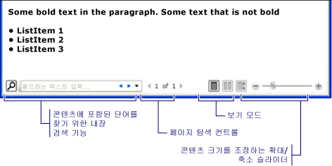

# 유동 문서 개요
유동 문서는 보기와 가독성을 최적화하도록 디자인되었습니다.  유동 문서는 하나의 미리 정의된 레이아웃으로 설정되는 대신에 창 크기, 장치 해상도 및 선택적 사용자 기본 설정과 같은 런타임 변수를 기반으로 동적으로 해당 콘텐츠를 조정하고 다시 배치합니다.  또한 유동 문서는 페이지 매김 및 열과 같은 고급 문서 기능을 제공합니다.  이 항목에서는 유동 문서의 개요와 유동 문서를 만드는 방법을 제공합니다.  
  
 [!INCLUDE[autoOutline](../Token/autoOutline_md.md)]  
  
   
## 유동 문서의 정의  
 유동 문서는 창 크기, 장치 해상도 및 다른 환경 변수에 따라 "콘텐츠 흐름을 바꾸도록" 디자인되었습니다.  또한 유동 문서에는 검색, 가독성을 최적화하는 보기 모드, 글꼴 크기와 모양을 변경하는 기능 등 여러 기본 제공 기능이 있습니다.  문서를 사용할 때 쉽게 읽을 수 있어야 하는 것이 주된 관심사인 경우 유동 문서가 가장 잘 활용됩니다.  반대로 고정 문서는 정적 표현을 가지도록 디자인되었습니다.  소스 콘텐츠가 충실해야 하는 경우 고정 문서가 유용합니다.  여러 가지 문서 형식에 대한 자세한 내용은 [WPF의 문서](../../../../docs/framework/wpf/advanced/documents-in-wpf.md)를 참조하십시오.  
  
 다음 그림에서는 다양한 크기의 여러 창에서 본 샘플 유동 문서를 보여 줍니다.  표시 영역이 변경될 경우 사용 가능한 영역을 최대한 활용하도록 콘텐츠 흐름이 바뀝니다.  
  
   
  
 위 이미지와 같이 유동 콘텐츠는 단락, 목록, 이미지 등을 비롯한 많은 구성 요소를 포함할 수 있습니다.  이러한 구성 요소는 프로시저 코드의 개체 및 태그의 요소에 해당합니다.  이 개요의 [유동 관련 클래스](#flow_related_classes) 단원에서 이러한 클래스에 대해 자세히 설명합니다.  지금은 일부 굵은 텍스트와 목록이 있는 단락으로 구성된 유동 문서를 만드는 간단한 코드 예제를 살펴봅니다.  
  
 [!code-xml[FlowOvwSnippets_snip#SimpleFlowExampleWholePage](../../../../samples/snippets/csharp/VS_Snippets_Wpf/FlowOvwSnippets_snip/CS/SimpleFlowExample.xaml#simpleflowexamplewholepage)]  
  
 [!code-csharp[FlowOvwSnippets_procedural_snip#SimpleFlowCodeOnlyExampleWholePage](../../../../samples/snippets/csharp/VS_Snippets_Wpf/FlowOvwSnippets_procedural_snip/CSharp/SimpleFlowExample.cs#simpleflowcodeonlyexamplewholepage)]
 [!code-vb[FlowOvwSnippets_procedural_snip#SimpleFlowCodeOnlyExampleWholePage](../../../../samples/snippets/visualbasic/VS_Snippets_Wpf/FlowOvwSnippets_procedural_snip/VisualBasic/SimpleFlowExample.vb#simpleflowcodeonlyexamplewholepage)]  
  
 아래 그림에서는 이 코드 조각을 보여 줍니다.  
  
   
  
 이 예제에서 <xref:System.Windows.Controls.FlowDocumentReader> 컨트롤은 유동 콘텐츠를 호스팅하는 데 사용됩니다.  유동 콘텐츠 호스팅 컨트롤에 대한 자세한 내용은 [유동 문서 형식](#flow_document_types)을 참조하십시오.  <xref:System.Windows.Documents.Paragraph>, <xref:System.Windows.Documents.List>, <xref:System.Windows.Documents.ListItem> 및 <xref:System.Windows.Documents.Bold> 요소는 태그에서의 순서에 따라 콘텐츠 서식을 제어하는 데 사용됩니다.  예를 들어 <xref:System.Windows.Documents.Bold> 요소는 단락에서 텍스트 부분에만 걸쳐 있으므로 결과적으로 해당 텍스트 부분만 굵게 표시됩니다.  HTML을 사용한 적이 있는 경우 이 작업에 익숙할 것입니다.  
  
 위 그림에서 강조 표시된 것처럼 유동 문서에 빌드된 여러 기능이 있습니다.  
  
-   검색: 사용자가 전체 문서의 전체 텍스트 검색을 수행할 수 있게 합니다.  
  
-   보기 모드: 단일 페이지\(한 번에 한 페이지\) 보기 모드, 한 번에 두 페이지\(책 읽기 형식\) 보기 모드 및 연속 스크롤\(바닥 없음\) 보기 모드를 비롯한 원하는 보기 모드를 선택할 수 있습니다.  이러한 보기 모드에 대한 자세한 내용은 <xref:System.Windows.Controls.FlowDocumentReaderViewingMode>를 참조하십시오.  
  
-   페이지 탐색 컨트롤: 문서의 보기 모드에서 페이지를 사용할 경우 페이지 탐색 컨트롤에는 다음 페이지\(아래쪽 화살표\) 또는 이전 페이지\(위쪽 화살표\)로 점프하는 단추 및 현재 페이지 번호와 전체 페이지 수를 보여 주는 표시기가 포함됩니다.  페이지 넘기기는 키보드 화살표 키를 사용하여 수행할 수도 있습니다.  
  
-   확대\/축소: 확대\/축소 컨트롤에서 \+ 또는 \- 단추를 각각 클릭하여 확대\/축소 수준을 올리거나 내릴 수 있습니다.  확대\/축소 컨트롤에는 확대\/축소 수준을 조정하는 슬라이더도 포함됩니다.  자세한 내용은 <xref:System.Windows.Controls.FlowDocumentReader.Zoom%2A>을 참조하십시오.  
  
 유동 콘텐츠를 호스팅하는 데 사용되는 컨트롤에 기초하여 이러한 기능을 수정할 수 있습니다.  다음 단원에서는 여러 다른 컨트롤에 대해 설명합니다.  
  
   
## 유동 문서 형식  
 유동 문서 콘텐츠의 표시 여부와 유동 문서가 표시되는 방법은 유동 콘텐츠를 호스팅하는 데 사용되는 개체에 따라 달라집니다.  유동 콘텐츠의 보기를 지원하는 네 개의 컨트롤인 <xref:System.Windows.Controls.FlowDocumentReader>, <xref:System.Windows.Controls.FlowDocumentPageViewer>, <xref:System.Windows.Controls.RichTextBox> 및 <xref:System.Windows.Controls.FlowDocumentScrollViewer>가 있습니다.  아래에서 이러한 컨트롤에 대해 간략하게 설명합니다.  
  
 **참고:**  유동 콘텐츠를 직접 호스팅하려면 <xref:System.Windows.Documents.FlowDocument>가 필요하므로 이러한 모든 보기 컨트롤은 유동 콘텐츠 호스팅이 가능하도록 <xref:System.Windows.Documents.FlowDocument>를 사용합니다.  
  
### FlowDocumentReader  
 <xref:System.Windows.Controls.FlowDocumentReader>에는 단일 페이지\(한 번에 한 페이지\) 보기 모드, 한 번에 두 페이지\(책 읽기 형식\) 보기 모드 및 연속 스크롤\(바닥 없음\) 보기 모드를 비롯한 다양한 보기 모드를 동적으로 선택할 수 있는 기능이 포함되어 있습니다.  이러한 보기 모드에 대한 자세한 내용은 <xref:System.Windows.Controls.FlowDocumentReaderViewingMode>를 참조하십시오.  다른 보기 모드 사이에 동적으로 전환하는 기능이 필요하지 않은 경우 <xref:System.Windows.Controls.FlowDocumentPageViewer> 및 <xref:System.Windows.Controls.FlowDocumentScrollViewer>는 특정 보기 모드에 고정된 간단한 유동 콘텐츠 뷰어를 제공합니다.  
  
### FlowDocumentPageViewer 및 FlowDocumentScrollViewer  
 <xref:System.Windows.Controls.FlowDocumentPageViewer>가 한 번에 한 페이지 보기 모드로 콘텐츠를 표시하는 반면에 <xref:System.Windows.Controls.FlowDocumentScrollViewer>는 연속 스크롤 모드로 콘텐츠를 표시합니다.  <xref:System.Windows.Controls.FlowDocumentPageViewer>와 <xref:System.Windows.Controls.FlowDocumentScrollViewer>는 모두 특정 보기 모드로 고정됩니다.  <xref:System.Windows.Controls.FlowDocumentReader>에는 사용자가 <xref:System.Windows.Controls.FlowDocumentReaderViewingMode> 열거형에서 제공하는 것처럼 여러 보기 모드를 동적으로 선택할 수 있는 기능이 포함되어 있지만, <xref:System.Windows.Controls.FlowDocumentPageViewer> 또는 <xref:System.Windows.Controls.FlowDocumentScrollViewer>보다 리소스를 많이 소모합니다.  
  
 기본적으로 세로 스크롤 막대는 항상 표시되며 가로 스크롤 막대는 필요한 경우에만 표시됩니다.  <xref:System.Windows.Controls.FlowDocumentScrollViewer>의 기본 UI에는 도구 모음이 포함되어 있지 않지만 <xref:System.Windows.Controls.FlowDocumentScrollViewer.IsToolBarVisible%2A> 속성을 사용하여 기본 제공 도구 모음을 사용하도록 설정할 수 있습니다.  
  
### RichTextBox  
 사용자가 유동 콘텐츠를 편집할 수 있게 하려면 <xref:System.Windows.Controls.RichTextBox>를 사용합니다.  예를 들어 사용자가 표, 기울임꼴 및 굵게 서식 등과 같은 요소를 편집할 수 있는 편집기를 만들려면 <xref:System.Windows.Controls.RichTextBox>를 사용합니다.  자세한 내용은 [RichTextBox 개요](../../../../docs/framework/wpf/controls/richtextbox-overview.md)를 참조하십시오.  
  
 **참고:** <xref:System.Windows.Controls.RichTextBox> 내의 유동 콘텐츠는 다른 컨트롤에 포함된 유동 콘텐츠와 동일하게 작동하지 않습니다.  예를 들어 <xref:System.Windows.Controls.RichTextBox>에는 열이 없으므로 자동 크기 조정 동작이 발생하지 않습니다.  또한 검색, 보기 모드, 페이지 탐색, 확대\/축소 등과 같은 유동 콘텐츠의 일반적인 기본 제공 기능을 <xref:System.Windows.Controls.RichTextBox> 내에서 사용할 수 없습니다.  
  
   
## 유동 콘텐츠 만들기  
 유동 콘텐츠는 텍스트, 이미지, 표, 심지어 <xref:System.Windows.UIElement> 파생 클래스\(예: 컨트롤\)를 비롯한 다양한 요소로 구성되어 복잡할 수 있습니다.  복잡한 유동 콘텐츠를 만드는 방법을 이해하려면 다음 사항이 중요합니다.  
  
-   **유동 관련 클래스**: 유동 콘텐츠에서 사용되는 각 클래스에는 특정 용도가 있습니다.  또한 유동 클래스 간의 계층 관계는 유동 클래스가 사용되는 방법을 이해하는 데 도움이 됩니다.  예를 들어 <xref:System.Windows.Documents.Block> 클래스에서 파생된 클래스는 다른 개체를 포함하는 데 사용되는 반면에 <xref:System.Windows.Documents.Inline>에서 파생된 클래스는 표시되는 개체를 포함합니다.  
  
-   **콘텐츠 스키마**: 유동 문서에는 상당히 많은 수의 중첩된 요소가 필요할 수 있습니다.  콘텐츠 스키마는 요소 간의 가능한 부모\/자식 관계를 지정합니다.  
  
 다음 단원에는 이러한 각 영역에 대해 자세히 설명합니다.  
  
   
## 유동 관련 클래스  
 아래 다이어그램에서는 유동 콘텐츠와 함께 가장 일반적으로 사용되는 개체를 보여 줍니다.  
  
   
  
 유동 콘텐츠를 위한 두 개의 중요한 범주가 있습니다.  
  
1.  **블록 파생 클래스**: "블록 콘텐츠 요소" 또는 간단히 "블록 요소"라고도 합니다.  <xref:System.Windows.Documents.Block>에서 상속되는 요소를 사용하여 공통 부모 아래의 요소를 그룹화하거나 공통 특성을 그룹에 적용할 수 있습니다.  
  
2.  **인라인 파생 클래스**: "인라인 콘텐츠 요소" 또는 간단히 "인라인 요소"라고도 합니다.  <xref:System.Windows.Documents.Inline>에서 상속되는 요소는 블록 요소 또는 다른 인라인 요소에 포함됩니다.  인라인 요소는 흔히 화면에 렌더링되는 콘텐츠의 직접 컨테이너로 사용됩니다.  예를 들어 <xref:System.Windows.Documents.Paragraph>\(블록 요소\)는 <xref:System.Windows.Documents.Run>\(인라인 요소\)을 포함할 수 있지만 <xref:System.Windows.Documents.Run>은 실제로 화면에서 렌더링되는 텍스트를 포함합니다.  
  
 아래에서는 이러한 두 범주의 각 클래스에 대해 간략하게 설명합니다.  
  
### 블록 파생 클래스  
 **Paragraph**  
  
 <xref:System.Windows.Documents.Paragraph>는 일반적으로 콘텐츠를 단락으로 그룹화하는 데 사용됩니다.  Paragraph의 가장 간단하고 일반적인 용도는 텍스트 단락을 만드는 것입니다.  
  
 [!code-xml[FlowOvwSnippets_snip#ParagraphExampleWholePage](../../../../samples/snippets/csharp/VS_Snippets_Wpf/FlowOvwSnippets_snip/CS/ParagraphExample.xaml#paragraphexamplewholepage)]  
  
 [!code-csharp[FlowOvwSnippets_procedural_snip#ParagraphCodeOnlyExampleWholePage](../../../../samples/snippets/csharp/VS_Snippets_Wpf/FlowOvwSnippets_procedural_snip/CSharp/ParagraphExample.cs#paragraphcodeonlyexamplewholepage)]
 [!code-vb[FlowOvwSnippets_procedural_snip#ParagraphCodeOnlyExampleWholePage](../../../../samples/snippets/visualbasic/VS_Snippets_Wpf/FlowOvwSnippets_procedural_snip/VisualBasic/ParagraphExample.vb#paragraphcodeonlyexamplewholepage)]  
  
 그러나 아래에 나온 것처럼 다른 인라인 파생 요소를 포함할 수도 있습니다.  
  
 **단원**  
  
 <xref:System.Windows.Documents.Section>은 <xref:System.Windows.Documents.Block>에서 파생된 다른 요소를 포함하기 위해서만 사용되며  포함된 요소에 기본 서식을 적용하지는 않습니다.  그러나 <xref:System.Windows.Documents.Section>에 설정된 모든 속성 값은 자식 요소에 적용됩니다.  또한 Section을 사용하면 프로그래밍 방식으로 자식 컬렉션을 반복할 수 있습니다.  <xref:System.Windows.Documents.Section>은 HTML의 \<DIV\> 태그와 비슷한 방식으로 사용됩니다.  
  
 아래 예제에서는 하나의 <xref:System.Windows.Documents.Section> 아래에 세 개의 단락이 정의됩니다.  이 Section의 <xref:System.Windows.Documents.TextElement.Background%2A> 속성 값은 Red이므로 단락의 배경색도 빨간색입니다.  
  
 [!code-xml[FlowOvwSnippets_snip#SectionExampleWholePage](../../../../samples/snippets/csharp/VS_Snippets_Wpf/FlowOvwSnippets_snip/CS/SectionExample.xaml#sectionexamplewholepage)]  
  
 [!code-csharp[FlowOvwSnippets_procedural_snip#SectionCodeOnlyExampleWholePage](../../../../samples/snippets/csharp/VS_Snippets_Wpf/FlowOvwSnippets_procedural_snip/CSharp/SectionExample.cs#sectioncodeonlyexamplewholepage)]
 [!code-vb[FlowOvwSnippets_procedural_snip#SectionCodeOnlyExampleWholePage](../../../../samples/snippets/visualbasic/VS_Snippets_Wpf/FlowOvwSnippets_procedural_snip/VisualBasic/SectionExample.vb#sectioncodeonlyexamplewholepage)]  
  
 **BlockUIContainer**  
  
 <xref:System.Windows.Documents.BlockUIContainer>를 사용하면 <xref:System.Windows.UIElement> 요소\(예:  <xref:System.Windows.Controls.Button>\)를 블록 파생 유동 콘텐츠에 포함할 수 있습니다.  <xref:System.Windows.Documents.InlineUIContainer>\(아래 참조\)는 <xref:System.Windows.UIElement> 요소를 인라인 파생 유동 콘텐츠에 포함하는 데 사용됩니다.  <xref:System.Windows.Documents.BlockUIContainer> 및 <xref:System.Windows.Documents.InlineUIContainer> 중 하나에 포함되지 않은 경우 <xref:System.Windows.UIElement>를 유동 콘텐츠에서 사용할 수 있는 방법이 없으므로 이러한 두 요소가 중요합니다.  
  
 다음 예제에서는 <xref:System.Windows.Documents.BlockUIContainer> 요소를 사용하여 유동 콘텐츠 내에서 <xref:System.Windows.UIElement> 개체를 호스팅하는 방법을 보여 줍니다.  
  
 [!code-xml[SpanSnippets#_BlockUIXAML](../../../../samples/snippets/csharp/VS_Snippets_Wpf/SpanSnippets/CSharp/Window1.xaml#_blockuixaml)]  
  
 다음 그림에서는 이 예제가 렌더링되는 방법을 보여 줍니다.  
  
   
  
 **List**  
  
 <xref:System.Windows.Documents.List>는 글머리 기호 또는 숫자 목록을 만드는 데 사용됩니다.  <xref:System.Windows.Documents.List.MarkerStyle%2A> 속성을 <xref:System.Windows.TextMarkerStyle> 열거형 값으로 설정하여 목록의 스타일을 결정합니다.  아래 예제에서는 간단한 목록을 만드는 방법을 보여 줍니다.  
  
 [!code-xml[FlowOvwSnippets_snip#ListExampleWholePage](../../../../samples/snippets/csharp/VS_Snippets_Wpf/FlowOvwSnippets_snip/CS/ListExample.xaml#listexamplewholepage)]  
  
 [!code-csharp[FlowOvwSnippets_procedural_snip#ListCodeOnlyExampleWholePage](../../../../samples/snippets/csharp/VS_Snippets_Wpf/FlowOvwSnippets_procedural_snip/CSharp/ListExample.cs#listcodeonlyexamplewholepage)]
 [!code-vb[FlowOvwSnippets_procedural_snip#ListCodeOnlyExampleWholePage](../../../../samples/snippets/visualbasic/VS_Snippets_Wpf/FlowOvwSnippets_procedural_snip/VisualBasic/ListExample.vb#listcodeonlyexamplewholepage)]  
  
 **참고:** <xref:System.Windows.Documents.List>는 <xref:System.Windows.Documents.ListItemCollection>을 사용하여 자식 요소를 관리하는 유일한 유동 요소입니다.  
  
 **표**  
  
 <xref:System.Windows.Documents.Table>은 표를 만드는 데 사용됩니다.  <xref:System.Windows.Documents.Table>은 <xref:System.Windows.Controls.Grid> 요소와 비슷하지만 보다 많은 기능을 제공하기 때문에 리소스 오버헤드가 더 높습니다.  <xref:System.Windows.Controls.Grid>는 <xref:System.Windows.UIElement>이므로 <xref:System.Windows.Documents.BlockUIContainer> 또는 <xref:System.Windows.Documents.InlineUIContainer>에 포함되지 않은 경우 유동 콘텐츠에서 사용할 수 없습니다.  <xref:System.Windows.Documents.Table>에 대한 자세한 내용은 [표 개요](../../../../docs/framework/wpf/advanced/table-overview.md)를 참조하십시오.  
  
### 인라인 파생 클래스  
 **실행**  
  
 <xref:System.Windows.Documents.Run>은 서식 없는 텍스트를 포함하는 데 사용됩니다.  <xref:System.Windows.Documents.Run> 개체가 유동 콘텐츠에서 널리 사용될 것으로 예상할 수도 있습니다.  그러나 태그에서 <xref:System.Windows.Documents.Run> 요소가 명시적으로 사용되어야 하는 것은 아닙니다.  <xref:System.Windows.Documents.Run>은 코드를 사용하여 유동 문서를 만들거나 조작할 경우에 사용되어야 합니다.  예를 들어 아래 태그에서 첫 번째 <xref:System.Windows.Documents.Paragraph>는 <xref:System.Windows.Documents.Run> 요소를 명시적으로 지정하지만 두 번째는 그렇지 않습니다.  두 Paragraph는 동일한 출력을 생성합니다.  
  
 [!code-xml[FlowOvwSnippets_snip#RunExample1](../../../../samples/snippets/csharp/VS_Snippets_Wpf/FlowOvwSnippets_snip/CS/RunSnippetsExample.xaml#runexample1)]  
  
 **참고:**  [!INCLUDE[net_v40_short](../../../../includes/net-v40-short-md.md)]에서부터 <xref:System.Windows.Documents.Run> 개체의 <xref:System.Windows.Documents.Run.Text%2A> 속성은 종속성 속성입니다.  <xref:System.Windows.Documents.Run.Text%2A> 속성은 <xref:System.Windows.Controls.TextBlock> 같은 데이터 소스에 바인딩할 수 있습니다.  <xref:System.Windows.Documents.Run.Text%2A> 속성은 단방향 바인딩을 완벽하게 지원합니다.  또한 <xref:System.Windows.Controls.RichTextBox>가 아닌 경우 <xref:System.Windows.Documents.Run.Text%2A> 속성은 양방향 바인딩을 지원합니다.  예제를 보려면 <xref:System.Windows.Documents.Run.Text%2A?displayProperty=fullName>를 참조하십시오.  
  
 **Span**  
  
 <xref:System.Windows.Documents.Span>은 다른 인라인 콘텐츠 요소를 함께 그룹화합니다.  <xref:System.Windows.Documents.Span> 요소 내의 콘텐츠에는 고유 렌더링이 적용되지 않습니다.  그러나 <xref:System.Windows.Documents.Hyperlink>, <xref:System.Windows.Documents.Bold>, <xref:System.Windows.Documents.Italic> 및 <xref:System.Windows.Documents.Underline>을 비롯하여 <xref:System.Windows.Documents.Span>에서 상속되는 요소는 서식을 텍스트에 적용합니다.  
  
 아래 예제에서는 텍스트, <xref:System.Windows.Documents.Bold> 요소 및 <xref:System.Windows.Controls.Button>을 비롯한 인라인 콘텐츠를 포함하는 데 사용되는 <xref:System.Windows.Documents.Span>을 보여 줍니다.  
  
 [!code-xml[FlowOvwSnippets_snip#SpanExampleWholePage](../../../../samples/snippets/csharp/VS_Snippets_Wpf/FlowOvwSnippets_snip/CS/SpanExample.xaml#spanexamplewholepage)]  
  
 다음 스크린 샷에서는 이 예제가 렌더링되는 방법을 보여 줍니다.  
  
   
  
 **InlineUIContainer**  
  
 <xref:System.Windows.Documents.InlineUIContainer>를 사용하면 <xref:System.Windows.UIElement> 요소\(예:  <xref:System.Windows.Controls.Button>과 같은 컨트롤\)를 <xref:System.Windows.Documents.Inline> 콘텐츠 요소에 포함할 수 있습니다.  이 요소는 위에 설명된 <xref:System.Windows.Documents.BlockUIContainer>와 동등한 인라입니다.  아래 예제에서는 <xref:System.Windows.Documents.InlineUIContainer>를 사용하여 <xref:System.Windows.Controls.Button> 인라인을 <xref:System.Windows.Documents.Paragraph>에 삽입합니다.  
  
 [!code-xml[FlowOvwSnippets_snip#InlineUIContainerExampleWholePage](../../../../samples/snippets/csharp/VS_Snippets_Wpf/FlowOvwSnippets_snip/CS/InlineUIContainerExample.xaml#inlineuicontainerexamplewholepage)]  
  
 [!code-csharp[FlowOvwSnippets_procedural_snip#InlineUIContainerCodeOnlyExampleWholePage](../../../../samples/snippets/csharp/VS_Snippets_Wpf/FlowOvwSnippets_procedural_snip/CSharp/InlineUIContainerExample.cs#inlineuicontainercodeonlyexamplewholepage)]
 [!code-vb[FlowOvwSnippets_procedural_snip#InlineUIContainerCodeOnlyExampleWholePage](../../../../samples/snippets/visualbasic/VS_Snippets_Wpf/FlowOvwSnippets_procedural_snip/VisualBasic/InlineUIContainerExample.vb#inlineuicontainercodeonlyexamplewholepage)]  
  
 **참고:** <xref:System.Windows.Documents.InlineUIContainer>는 태그에서 명시적으로 사용될 필요가 없습니다.  생략할 경우 코드가 컴파일될 때 <xref:System.Windows.Documents.InlineUIContainer>가 만들어집니다.  
  
 **Figure 및 Floater**  
  
 <xref:System.Windows.Documents.Figure> 및 <xref:System.Windows.Documents.Floater>는 기본 콘텐츠 흐름과 별개로 사용자 지정할 수 있는 배치 속성과 함께 콘텐츠를 유동 문서에 포함하는 데 사용됩니다.  <xref:System.Windows.Documents.Figure> 또는 <xref:System.Windows.Documents.Floater> 요소는 주로 콘텐츠 일부를 강조하거나, 기본 콘텐츠 흐름 내에서 지원 이미지 또는 기타 콘텐츠를 호스팅하거나, 광고와 같은 관련이 적은 콘텐츠를 삽입하는 데 사용됩니다.  
  
 다음 예제에서는 <xref:System.Windows.Documents.Figure>를 텍스트 단락에 포함하는 방법을 보여 줍니다.  
  
 [!code-xml[FlowOvwSnippets_snip#FigureExampleWholePage](../../../../samples/snippets/csharp/VS_Snippets_Wpf/FlowOvwSnippets_snip/CS/FigureExample.xaml#figureexamplewholepage)]  
  
 [!code-csharp[FlowOvwSnippets_procedural_snip#FigureCodeOnlyExampleWholePage](../../../../samples/snippets/csharp/VS_Snippets_Wpf/FlowOvwSnippets_procedural_snip/CSharp/FigureExample.cs#figurecodeonlyexamplewholepage)]
 [!code-vb[FlowOvwSnippets_procedural_snip#FigureCodeOnlyExampleWholePage](../../../../samples/snippets/visualbasic/VS_Snippets_Wpf/FlowOvwSnippets_procedural_snip/VisualBasic/FigureExample.vb#figurecodeonlyexamplewholepage)]  
  
 다음 그림에서는 이 예제가 렌더링되는 방법을 보여 줍니다.  
  
   
  
 <xref:System.Windows.Documents.Figure>와 <xref:System.Windows.Documents.Floater>는 여러 가지 면에서 다르며 서로 다른 시나리오에 사용됩니다.  
  
 **Figure:**  
  
-   배치가 가능합니다. 페이지, 콘텐츠, 열 또는 단락에 상대적으로 도킹되도록 해당 가로 앵커와 새로 앵커를 설정할 수 있습니다.  <xref:System.Windows.Documents.Figure.HorizontalOffset%2A> 및 <xref:System.Windows.Documents.Figure.VerticalOffset%2A> 속성을 사용하여 임의의 오프셋을 지정할 수도 있습니다.  
  
-   두 개 이상의 열로 크기를 조정할 수 있습니다. <xref:System.Windows.Documents.Figure>의 높이와 너비를 페이지, 콘텐츠 또는 열의 높이나 너비의 배수로 설정할 수 있습니다.  페이지와 콘텐츠의 경우 1보다 큰 배수를 사용할 수 없습니다.  예를 들어 <xref:System.Windows.Documents.Figure>의 너비를 "0.5페이지", "0.25콘텐츠" 또는 "2열"로 설정할 수 있습니다.  높이와 너비를 절대 픽셀 값으로도 설정할 수 있습니다.  
  
-   페이지 매김이 적용되지 않습니다. <xref:System.Windows.Documents.Figure> 내의 콘텐츠가 <xref:System.Windows.Documents.Figure> 크기에 맞지 않는 경우 크기에 맞는 콘텐츠만 렌더링되고 나머지 콘텐츠는 손실됩니다.  
  
 **Floater:**  
  
-   배치가 불가능하며, 요소에 사용할 수 있는 공간이 모두 렌더링됩니다.  오프셋을 설정하거나 <xref:System.Windows.Documents.Floater>에 앵커를 지정할 수 없습니다.  
  
-   두 개 이상의 열로 크기를 조정할 수 없습니다. 기본적으로 <xref:System.Windows.Documents.Floater>의 크기는 하나의 열로 지정됩니다.  절대 픽셀 값으로 설정할 수 있는 <xref:System.Windows.Documents.Floater.Width%2A> 속성이 있지만 이 값이 한 열의 너비보다 크면 값이 무시되고 배치자\(Floater\)의 크기가 하나의 열로 지정됩니다.  올바른 픽셀 너비를 설정하여 한 열보다 작게 크기를 조정할 수 있지만 열을 기준으로 크기를 조정할 수 없으므로 <xref:System.Windows.Documents.Floater> 너비를 조정할 때 "0.5열"과 같은 식을 사용할 수 없습니다.  <xref:System.Windows.Documents.Floater>에는 높이 속성이 없으므로 높이를 설정할 수 없고 높이는 콘텐츠에 따라 달라집니다.  
  
-   <xref:System.Windows.Documents.Floater> 페이지 매김이 적용됩니다. 지정된 너비의 콘텐츠를 두 개 이상의 열 높이로 확장하면 배치자\(Floater\)는 중단되고 다음 열, 다음 페이지 등으로 페이지가 매겨집니다.  
  
 <xref:System.Windows.Documents.Figure>에서는 크기와 위치를 제어할 독립형 콘텐츠를 배치하기 좋으며 콘텐츠가 지정된 크기에 정확하게 맞습니다.  <xref:System.Windows.Documents.Floater>에서는 기본 페이지 콘텐츠와 비슷하게 진행되지만 기본 페이지 콘텐츠와 구분되며 더 자유롭게 진행되는 콘텐츠를 배치하기에 좋습니다.  
  
 **LineBreak**  
  
 <xref:System.Windows.Documents.LineBreak>를 사용하면 유동 콘텐츠에서 줄 바꿈이 발생합니다.  다음 예제는 <xref:System.Windows.Documents.LineBreak>의 사용을 보여 줍니다.  
  
 [!code-xml[FlowOvwSnippets_snip#LineBreakExampleWholePage](../../../../samples/snippets/csharp/VS_Snippets_Wpf/FlowOvwSnippets_snip/CS/LineBreakExample.xaml#linebreakexamplewholepage)]  
  
 다음 스크린 샷에서는 이 예제가 렌더링되는 방법을 보여 줍니다.  
  
   
  
### 유동 컬렉션 요소  
 위에 설명된 대부분의 예제에서는 유동 콘텐츠를 프로그래밍 방식으로 생성하기 위해 <xref:System.Windows.Documents.BlockCollection> 및 <xref:System.Windows.Documents.InlineCollection>이 사용됩니다.  예를 들어 요소를 <xref:System.Windows.Documents.Paragraph>에 추가하려면 다음 구문을 사용합니다.  
  
 `…`  
  
 `myParagraph.Inlines.Add(new Run("Some text"));`  
  
 `…`  
  
 이 구문은 <xref:System.Windows.Documents.Paragraph>의 <xref:System.Windows.Documents.InlineCollection>에 <xref:System.Windows.Documents.Run>을 추가합니다.  이는 태그의 <xref:System.Windows.Documents.Paragraph> 안에 있는 암시적 <xref:System.Windows.Documents.Run>과 동일합니다.  
  
 `…`  
  
 `<Paragraph>`  
  
 `Some Text`  
  
 `</Paragraph>`  
  
 `…`  
  
 <xref:System.Windows.Documents.BlockCollection>을 사용하는 예제와 같이 다음 예제에서는 새 <xref:System.Windows.Documents.Section>을 만든 다음 **Add** 메서드를 사용하여 새 <xref:System.Windows.Documents.Paragraph>를 <xref:System.Windows.Documents.Section> 콘텐츠에 추가합니다.  
  
 [!code-csharp[FlowDocumentSnippets#_SectionBlocksAdd](../../../../samples/snippets/csharp/VS_Snippets_Wpf/FlowDocumentSnippets/CSharp/Window1.xaml.cs#_sectionblocksadd)]
 [!code-vb[FlowDocumentSnippets#_SectionBlocksAdd](../../../../samples/snippets/visualbasic/VS_Snippets_Wpf/FlowDocumentSnippets/visualbasic/window1.xaml.vb#_sectionblocksadd)]  
  
 항목을 유동 컬렉션에 추가하는 것 외에도 항목을 제거할 수 있습니다.  다음 예제에서는 <xref:System.Windows.Documents.Span>에서 마지막 <xref:System.Windows.Documents.Inline> 요소를 삭제합니다.  
  
 [!code-csharp[SpanSnippets#_SpanInlinesRemoveLast](../../../../samples/snippets/csharp/VS_Snippets_Wpf/SpanSnippets/CSharp/Window1.xaml.cs#_spaninlinesremovelast)]
 [!code-vb[SpanSnippets#_SpanInlinesRemoveLast](../../../../samples/snippets/visualbasic/VS_Snippets_Wpf/SpanSnippets/visualbasic/window1.xaml.vb#_spaninlinesremovelast)]  
  
 다음 예제에서는 <xref:System.Windows.Documents.Span>에서 모든 콘텐츠\(<xref:System.Windows.Documents.Inline> 요소\)를 지웁니다.  
  
 [!code-csharp[SpanSnippets#_SpanInlinesClear](../../../../samples/snippets/csharp/VS_Snippets_Wpf/SpanSnippets/CSharp/Window1.xaml.cs#_spaninlinesclear)]
 [!code-vb[SpanSnippets#_SpanInlinesClear](../../../../samples/snippets/visualbasic/VS_Snippets_Wpf/SpanSnippets/visualbasic/window1.xaml.vb#_spaninlinesclear)]  
  
 유동 콘텐츠를 프로그래밍 방식으로 사용할 경우 이러한 컬렉션을 광범위하게 사용할 것입니다.  
  
 유동 콘텐츠에서 자식 요소를 포함하기 위해 <xref:System.Windows.Documents.InlineCollection>\(인라인\)이 사용되는지 아니면 <xref:System.Windows.Documents.BlockCollection>\(블록\)이 사용되는지 여부는 부모가 포함할 수 있는 자식 요소의 형식\(<xref:System.Windows.Documents.Block> 또는 <xref:System.Windows.Documents.Inline>\)에 따라 다릅니다.  유동 콘텐츠 요소의 포함 규칙이 다음 단원의 콘텐츠 스키마에 요약되어 있습니다.  
  
 **참고:** 유동 콘텐츠와 함께 사용되는 세 번째 형식의 컬렉션인 <xref:System.Windows.Documents.ListItemCollection>이 있지만 이 컬렉션은 <xref:System.Windows.Documents.List>와 함께만 사용됩니다.  또한 <xref:System.Windows.Documents.Table>과 함께 사용되는 여러 컬렉션이 있습니다.  자세한 내용은 [표 개요](../../../../docs/framework/wpf/advanced/table-overview.md)를 참조하십시오.  
  
   
## 콘텐츠 스키마  
 다양한 유동 콘텐츠 요소가 제공된 경우 요소가 포함할 수 있는 자식 요소의 형식을 추적하면 과부하가 걸릴 수 있습니다.  아래 다이어그램에서는 유동 요소의 포함 규칙을 요약하여 보여 줍니다.  화살표는 가능한 부모\/자식 관계를 나타냅니다.  
  
   
  
 위 다이어그램에서 볼 수 있는 것처럼 요소에 허용되는 자식이 요소가 <xref:System.Windows.Documents.Block> 요소인지 아니면 <xref:System.Windows.Documents.Inline> 요소인지 여부에 따라서만 결정되는 것은 아닙니다.  예를 들어 <xref:System.Windows.Documents.Span>\(<xref:System.Windows.Documents.Inline> 요소\)은 <xref:System.Windows.Documents.Inline> 자식 요소만 포함할 수 있는 반면에 <xref:System.Windows.Documents.Figure>\(마찬가지로 <xref:System.Windows.Documents.Inline> 요소\)는 <xref:System.Windows.Documents.Block> 자식 요소만 포함할 수 있습니다.  따라서 다이어그램은 다른 요소에 포함할 수 있는 요소를 신속하게 확인하는 데 유용합니다.  예를 들어 <xref:System.Windows.Controls.RichTextBox>의 유동 콘텐츠를 생성하는 방법을 확인하기 위해 다이어그램을 사용해 보겠습니다.  
  
 **1.** <xref:System.Windows.Controls.RichTextBox>는 <xref:System.Windows.Documents.Block> 파생 개체를 포함해야 하는 <xref:System.Windows.Documents.FlowDocument>를 포함해야 합니다.  위 다이어그램의 해당 세그먼트는 아래와 같습니다.  
  
   
  
 따라서 지금까지의 태그는 다음과 같습니다.  
  
 [!code-xml[FlowOvwSnippets_snip#SchemaWalkThrough1](../../../../samples/snippets/csharp/VS_Snippets_Wpf/FlowOvwSnippets_snip/CS/MiscSnippets.xaml#schemawalkthrough1)]  
  
 **2.** 다이어그램에 따르면 <xref:System.Windows.Documents.Paragraph>, <xref:System.Windows.Documents.Section>, <xref:System.Windows.Documents.Table>, <xref:System.Windows.Documents.List> 및 <xref:System.Windows.Documents.BlockUIContainer>를 비롯하여 선택할 여러 <xref:System.Windows.Documents.Block> 요소가 있습니다\(위의 블록 파생 클래스 참조\).  <xref:System.Windows.Documents.Table>이 필요하다고 가정해 봅니다.  위 다이어그램에 따르면 <xref:System.Windows.Documents.Block>에서 파생된 개체가 포함된 <xref:System.Windows.Documents.TableCell> 요소를 포함하는 <xref:System.Windows.Documents.TableRow> 요소가 있는 <xref:System.Windows.Documents.TableRowGroup>이 <xref:System.Windows.Documents.Table>에 포함되어 있습니다.  위 다이어그램의 <xref:System.Windows.Documents.Table>에 대한 해당 세그먼트는 아래와 같습니다.  
  
   
  
 해당 태그는 아래와 같습니다.  
  
 [!code-xml[FlowOvwSnippets_snip#SchemaWalkThrough2](../../../../samples/snippets/csharp/VS_Snippets_Wpf/FlowOvwSnippets_snip/CS/MiscSnippets.xaml#schemawalkthrough2)]  
  
 **3.** 이 경우에도 <xref:System.Windows.Documents.TableCell> 아래에 하나 이상의 <xref:System.Windows.Documents.Block> 요소가 필요합니다.  간단하게 약간의 텍스트를 셀 안에 배치해 보겠습니다.  이렇게 하려면 <xref:System.Windows.Documents.Run> 요소와 함께 <xref:System.Windows.Documents.Paragraph>를 사용하면 됩니다.  <xref:System.Windows.Documents.Paragraph>가 <xref:System.Windows.Documents.Inline> 요소를 포함할 수 있고 <xref:System.Windows.Documents.Run>\(<xref:System.Windows.Documents.Inline> 요소\)이 일반 텍스트만 포함할 수 있다는 것을 보여 주는 다이어그램의 해당 세그먼트는 아래와 같습니다.  
  
   
  
   
  
 태그의 전체 예제는 다음과 같습니다.  
  
 [!code-xml[FlowOvwSnippets_snip#SchemaExampleWholePage](../../../../samples/snippets/csharp/VS_Snippets_Wpf/FlowOvwSnippets_snip/CS/SchemaExample.xaml#schemaexamplewholepage)]  
  
   
## 텍스트 사용자 지정  
 일반적으로 텍스트는 유동 문서에서 가장 많이 사용되는 콘텐츠 형식입니다.  위에 소개된 개체를 사용하여 텍스트가 렌더링되는 방법을 대부분 제어할 수 있지만 이 단원에 설명된 텍스트를 사용자 지정하기 위한 몇 가지 다른 방법이 있습니다.  
  
### 텍스트 장식  
 텍스트 장식을 사용하면 밑줄, 윗줄, 기준선 및 취소선 효과를 텍스트에 적용할 수 있습니다\(아래 그림 참조\).  <xref:System.Windows.Documents.Inline>, <xref:System.Windows.Documents.Paragraph>, <xref:System.Windows.Controls.TextBlock> 및 <xref:System.Windows.Controls.TextBox>를 비롯한 여러 개체에 의해 노출되는 <xref:System.Windows.Documents.Inline.TextDecorations%2A> 속성을 사용하여 이러한 장식을 추가합니다.  
  
 다음 예제에서는 <xref:System.Windows.Documents.Paragraph>의 <xref:System.Windows.Documents.Paragraph.TextDecorations%2A> 속성을 설정하는 방법을 보여 줍니다.  
  
 [!code-xml[InlineSnippets#_Paragraph_TextDecXAML](../../../../samples/snippets/csharp/VS_Snippets_Wpf/InlineSnippets/CSharp/Window1.xaml#_paragraph_textdecxaml)]  
  
 [!code-csharp[InlineSnippets#_Paragraph_TextDec](../../../../samples/snippets/csharp/VS_Snippets_Wpf/InlineSnippets/CSharp/Window1.xaml.cs#_paragraph_textdec)]
 [!code-vb[InlineSnippets#_Paragraph_TextDec](../../../../samples/snippets/visualbasic/VS_Snippets_Wpf/InlineSnippets/visualbasic/window1.xaml.vb#_paragraph_textdec)]  
  
 다음 그림에서는 이 예제가 렌더링되는 방법을 보여 줍니다.  
  
   
  
 다음 그림에서는 **윗줄**, **기준선** 및 **밑줄** 장식이 각각 렌더링되는 방법을 보여 줍니다.  
  
   
  
   
  
   
  
### 입력 체계  
 <xref:System.Windows.Documents.TextElement.Typography%2A> 속성은 <xref:System.Windows.Documents.TextElement>, <xref:System.Windows.Documents.FlowDocument>, <xref:System.Windows.Controls.TextBlock> 및 <xref:System.Windows.Controls.TextBox>를 비롯한 대부분의 유동 관련 콘텐츠에 의해 노출됩니다.  이 속성은 텍스트의 입력 체계 특성\/변형\(예:  작은 대문자 또는 큰 대문자, 위 첨자 및 아래 첨자 만들기 등\)을 제어하는 데 사용됩니다.  
  
 다음 예제에서는 <xref:System.Windows.Documents.Paragraph>를 예제 요소로 사용하여 <xref:System.Windows.Documents.TextElement.Typography%2A> 특성을 설정하는 방법을 보여 줍니다.  
  
 [!code-xml[TextElementSnippets#_TextElement_TypogXAML](../../../../samples/snippets/csharp/VS_Snippets_Wpf/TextElementSnippets/CSharp/Window1.xaml#_textelement_typogxaml)]  
  
 다음 그림에서는 이 예제가 렌더링되는 방법을 보여 줍니다.  
  
   
  
 한편 다음 그림에서는 비슷한 예제에서 기본 입력 체계 속성을 사용할 때 렌더링되는 모습을 보여 줍니다.  
  
   
  
 다음 예제에서는 <xref:System.Windows.Controls.TextBox.Typography%2A> 속성을 프로그래밍 방식으로 설정하는 방법을 보여 줍니다.  
  
 [!code-csharp[TextElementSnippets#_TextElement_Typog](../../../../samples/snippets/csharp/VS_Snippets_Wpf/TextElementSnippets/CSharp/Window1.xaml.cs#_textelement_typog)]
 [!code-vb[TextElementSnippets#_TextElement_Typog](../../../../samples/snippets/visualbasic/VS_Snippets_Wpf/TextElementSnippets/visualbasic/window1.xaml.vb#_textelement_typog)]  
  
 입력 체계에 대한 자세한 내용은 [WPF의 입력 체계](../../../../docs/framework/wpf/advanced/typography-in-wpf.md)를 참조하십시오.  
  
## 참고 항목  
 [텍스트](../../../../docs/framework/wpf/advanced/optimizing-performance-text.md)   
 [WPF의 입력 체계](../../../../docs/framework/wpf/advanced/typography-in-wpf.md)   
 [방법 항목](../../../../docs/framework/wpf/advanced/flow-content-elements-how-to-topics.md)   
 [TextElement 콘텐츠 모델 개요](../../../../docs/framework/wpf/advanced/textelement-content-model-overview.md)   
 [RichTextBox 개요](../../../../docs/framework/wpf/controls/richtextbox-overview.md)   
 [WPF의 문서](../../../../docs/framework/wpf/advanced/documents-in-wpf.md)   
 [표 개요](../../../../docs/framework/wpf/advanced/table-overview.md)   
 [주석 개요](../../../../docs/framework/wpf/advanced/annotations-overview.md)