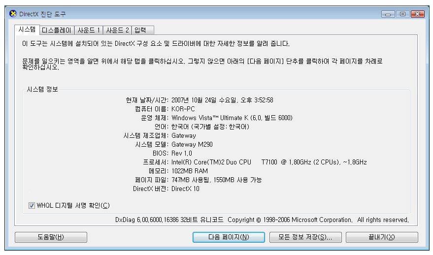

# 그래픽 렌더링 계층
렌더링 계층은 [!INCLUDE[TLA2#tla_winclient](../../../../includes/tla2sharptla-winclient-md.md)] 응용 프로그램을 실행하는 장치의 그래픽 하드웨어 기능과 성능 수준을 정의합니다.  
  

  
   
## 그래픽 하드웨어  
 렌더링 계층 수준에 가장 큰 영향을 미치는 그래픽 하드웨어 기능은 다음과 같습니다.  
  
-   **비디오 RAM** 그래픽 하드웨어의 비디오 메모리 양에 따라 그래픽을 합성하는 데 사용할 수 있는 버퍼의 크기와 수를 결정합니다.  
  
-   **픽셀 셰이더** 픽셀 셰이더는 픽셀별 미치는 영향을 계산하는 그래픽 처리 함수입니다. 표시된 그래픽의 해상도에 따라 표시 프레임별로 수백만 픽셀을 처리해야 할 수도 있습니다.  
  
-   **꼭짓점 셰이더** 꼭짓점 셰이더는 개체의 꼭짓점 데이터에서 수학 연산을 수행하는 그래픽 처리 함수입니다.  
  
-   **여러 질감 지원** 여러 질감 지원은 3D 그래픽 개체에서 혼합 작업 중에 두 개 이상의 개별 질감을 적용할 수 있는 기능을 나타냅니다. 여러 질감 지원 정도는 그래픽 하드웨어의 여러 질감 단위 수에 따라 결정됩니다.  
  
   
## 렌더링 계층 정의  
 그래픽 하드웨어 기능에 따라 [!INCLUDE[TLA2#tla_winclient](../../../../includes/tla2sharptla-winclient-md.md)] 응용 프로그램의 렌더링 기능이 결정됩니다. [!INCLUDE[TLA2#tla_winclient](../../../../includes/tla2sharptla-winclient-md.md)] 시스템에서는 다음 세 개의 렌더링 계층을 정의합니다.  
  
-   **렌더링 계층 0** 그래픽 하드웨어 가속이 없습니다. 모든 그래픽 기능에서 소프트웨어 가속을 사용합니다. [!INCLUDE[TLA2#tla_dx](../../../../includes/tla2sharptla-dx-md.md)] 버전 수준은 버전 9.0 미만입니다.  
  
-   **렌더링 계층 1** 일부 그래픽 기능에서는 그래픽 하드웨어 가속을 사용합니다. [!INCLUDE[TLA2#tla_dx](../../../../includes/tla2sharptla-dx-md.md)] 버전 수준은 버전 9.0 이상입니다.  
  
-   **렌더링 계층 2** 대부분의 그래픽 기능에서는 그래픽 하드웨어 가속을 사용합니다. [!INCLUDE[TLA2#tla_dx](../../../../includes/tla2sharptla-dx-md.md)] 버전 수준은 버전 9.0 이상입니다.  
  
 <xref:System.Windows.Media.RenderCapability.Tier%2A?displayProperty=nameWithType> 속성 렌더링 계층 응용 프로그램 실행 시간을 검색할 수 있습니다. 렌더링 계층을 사용하여 장치에서 특정 하드웨어 가속 그래픽 기능을 지원하는지 결정합니다. 그러면 장치에서 지원하는 렌더링 계층에 따라 응용 프로그램에서 런타임 시 다른 코드 경로를 사용할 수 있습니다.  
  
### 렌더링 계층 0  
 렌더링 계층 값이 0이면 장치의 응용 프로그램에서 사용할 수 있는 그래픽 하드웨어 가속이 없습니다. 이 계층 레벨에서는 하드웨어 가속 없이 소프트웨어를 통해 모든 그래픽이 렌더링된다고 가정해야 합니다. 이 계층의 기능은 9.0 미만인 [!INCLUDE[TLA2#tla_dx](../../../../includes/tla2sharptla-dx-md.md)] 버전에 해당합니다.  
  
### 렌더링 계층 1 및 렌더링 계층 2  
  
> [!NOTE]
>  .NET Framework 4부터 렌더링 계층 1은 [!INCLUDE[TLA2#tla_dx](../../../../includes/tla2sharptla-dx-md.md)] 9.0 이상을 지원하는 그래픽 하드웨어만 포함하도록 재정의되었습니다. [!INCLUDE[TLA2#tla_dx](../../../../includes/tla2sharptla-dx-md.md)] 7 또는 8을 지원하는 그래픽 하드웨어는 이제 렌더링 계층 0으로 정의됩니다.  
  
 렌더링 계층 값이 1 또는 2이면 필요한 시스템 리소스가 사용 가능하며 소진되지 않은 경우 대부분의 [!INCLUDE[TLA2#tla_winclient](../../../../includes/tla2sharptla-winclient-md.md)] 그래픽 기능에서 하드웨어 가속을 사용합니다. 이 내용은 9.0 이상의 [!INCLUDE[TLA2#tla_dx](../../../../includes/tla2sharptla-dx-md.md)] 버전에 해당합니다.  
  
 다음 테이블에서는 렌더링 계층 1과 렌더링 계층 2에 대한 그래픽 하드웨어 요구 사항의 차이점을 보여줍니다.  
  
|기능|계층 1|계층 2|  
|-------------|------------|------------|  
|[!INCLUDE[TLA2#tla_dx](../../../../includes/tla2sharptla-dx-md.md)] 버전|9.0보다 크거나 같아야 합니다.|9.0보다 크거나 같아야 합니다.|  
|비디오 RAM|60MB보다 크거나 같아야 합니다.|120MB보다 크거나 같아야 합니다.|  
|픽셀 셰이더|버전 수준은 2.0 이상이어야 합니다.|버전 수준은 2.0 이상이어야 합니다.|  
|꼭짓점 셰이더|요구 사항이 없습니다.|버전 수준은 2.0 이상이어야 합니다.|  
|여러 질감 단위|요구 사항이 없습니다.|단위 수가 4 이상이어야 합니다.|  
  
 다음 특징과 기능은 렌더링 계층 1과 렌더링 계층 2용으로 가속화된 하드웨어입니다.  
  
|기능|노트|  
|-------------|-----------|  
|2D 렌더링|대부분의 2D 렌더링이 지원됩니다.|  
|3D 래스터화|대부분의 3D 래스터화가 지원됩니다.|  
|3D 이방성 필터링|[!INCLUDE[TLA2#tla_winclient](../../../../includes/tla2sharptla-winclient-md.md)]에서는 3D 콘텐츠를 렌더링할 때 이방성 필터링을 사용합니다. 이방성 필터링은 카메라에서 멀리 떨어져 있고 기울기가 심한 표면에서 이미지의 질감을 향상시키는 것을 나타냅니다.|  
|3D MIP 매핑|[!INCLUDE[TLA2#tla_winclient](../../../../includes/tla2sharptla-winclient-md.md)]에서는 3D 콘텐츠를 렌더링할 때 MIP 매핑을 사용합니다. MIP 매핑 질감이 더 작은 보기 필드에서 차지 하는 경우 텍스처 렌더링 품질을 향상 시키기는 <xref:System.Windows.Controls.Viewport3D>합니다.|  
|방사형 그라데이션|지원 되기는 하지만 사용 하지 않도록 <xref:System.Windows.Media.RadialGradientBrush> 대형 개체입니다.|  
|3D 조명 계산|[!INCLUDE[TLA2#tla_winclient](../../../../includes/tla2sharptla-winclient-md.md)]에서는 꼭짓점별 조명을 수행합니다. 즉, 메시에 적용할 각 재질의 꼭짓점마다 조명 강도를 계산해야 합니다.|  
|텍스트 렌더링|하위 픽셀 글꼴 렌더링에서는 그래픽 하드웨어에서 사용 가능한 픽셀 셰이더를 사용합니다.|  
  
 다음 특징과 기능은 렌더링 계층 2용으로만 가속화된 하드웨어입니다.  
  
|기능|노트|  
|-------------|-----------|  
|3D 앤티앨리어싱|3D 앤티앨리어싱은 [!INCLUDE[TLA2#tla_winvista](../../../../includes/tla2sharptla-winvista-md.md)] 및 [!INCLUDE[win7](../../../../includes/win7-md.md)]와 같은 WDDM(Windows Display Driver Model)를 지원하는 운영 체제에서만 지원됩니다.|  
  
 다음 특징과 기능은 가속화된 하드웨어가 **아닙니다**.  
  
|기능|노트|  
|-------------|-----------|  
|인쇄된 콘텐츠|인쇄된 모든 콘텐츠는 [!INCLUDE[TLA2#tla_winclient](../../../../includes/tla2sharptla-winclient-md.md)] 소프트웨어 파이프라인을 사용하여 렌더링합니다.|  
|사용 하는 래스터화된 콘텐츠<xref:System.Windows.Media.Imaging.RenderTargetBitmap>|사용 하 여 렌더링 된 모든 콘텐츠에 <xref:System.Windows.Media.Imaging.RenderTargetBitmap.Render%2A> 방식의 <xref:System.Windows.Media.Imaging.RenderTargetBitmap>합니다.|  
|사용 하는 바둑판식으로 배열 된 콘텐츠<xref:System.Windows.Media.TileBrush>|콘텐츠를 바둑판식으로 배열 된는 <xref:System.Windows.Media.TileBrush.TileMode%2A> 의 속성은 <xref:System.Windows.Media.TileBrush> 로 설정 되어 <xref:System.Windows.Media.TileMode.Tile>합니다.|  
|그래픽 하드웨어의 최대 질감 크기를 초과하는 화면|대부분의 그래픽 하드웨어에서 대형 화면의 크기는 2048x2048 또는 4096x4096 픽셀입니다.|  
|비디오 RAM 요구 사항이 그래픽 하드웨어의 메모리를 초과하는 모든 작업|Windows SDK에서 [WPF 성능 제품군](http://msdn.microsoft.com/library/67cafaad-57ad-4ecb-9c08-57fac144393e)에 포함된 Perforator 도구를 사용하여 응용 프로그램 비디오 RAM 사용량을 모니터링할 수 있습니다.|  
|계층적 창|계층적 창을 사용하면 [!INCLUDE[TLA2#tla_winclient](../../../../includes/tla2sharptla-winclient-md.md)] 응용 프로그램에서 직사각형이 아닌 창의 화면에 맞게 콘텐츠를 렌더링할 수 있습니다. [!INCLUDE[TLA2#tla_winvista](../../../../includes/tla2sharptla-winvista-md.md)] 및 [!INCLUDE[win7](../../../../includes/win7-md.md)]와 같은 WDDM(Windows Display Driver Model)을 지원하는 운영 체제에서 계층적 창은 하드웨어 가속됩니다. [!INCLUDE[winxp](../../../../includes/winxp-md.md)]와 같은 다른 시스템에서는 하드웨어 가속이 없는 소프트웨어를 통해 계층적 창을 렌더링합니다.   계층된 창에서 사용 하도록 설정할 수 [!INCLUDE[TLA2#tla_winclient](../../../../includes/tla2sharptla-winclient-md.md)] 다음을 설정 하 여 <xref:System.Windows.Window> 속성:   -   <xref:System.Windows.Window.WindowStyle%2A> = <xref:System.Windows.WindowStyle.None> -   <xref:System.Windows.Window.AllowsTransparency%2A> = `true` -   <xref:System.Windows.Controls.Control.Background%2A> = <xref:System.Windows.Media.Brushes.Transparent%2A>|  
  
   
## 기타 리소스  
 다음 리소스를 사용하면 [!INCLUDE[TLA2#tla_winclient](../../../../includes/tla2sharptla-winclient-md.md)] 응용 프로그램의 성능 특징을 분석할 수 있습니다.  
  
### 그래픽 렌더링 레지스트리 설정  
 [!INCLUDE[TLA2#tla_winclient](../../../../includes/tla2sharptla-winclient-md.md)]에서는 [!INCLUDE[TLA2#tla_winclient](../../../../includes/tla2sharptla-winclient-md.md)] 렌더링을 제어하는 다음 네 개의 레지스트리 설정을 제공합니다.  
  
|설정|설명|  
|-------------|-----------------|  
|**하드웨어 가속 옵션 사용 안 함**|하드웨어 가속을 사용해야 하는지 지정합니다.|  
|**최대 다중 샘플 값**|[!INCLUDE[TLA2#tla_3d](../../../../includes/tla2sharptla-3d-md.md)] 콘텐츠를 앤티앨리어싱하는 데 사용할 다중 샘플링의 수준을 지정합니다.|  
|**필수 비디오 드라이버 날짜 설정**|시스템에서 2004년 11월 이전에 릴리스된 드라이버의 하드웨어 가속을 사용하지 않게 설정할지 지정합니다.|  
|**참조 래스터라이저 옵션 사용**|[!INCLUDE[TLA2#tla_winclient](../../../../includes/tla2sharptla-winclient-md.md)]에서 참조 래스터라이저를 사용해야 하는지 지정합니다.|  
  
 이러한 설정은 [!INCLUDE[TLA2#tla_winclient](../../../../includes/tla2sharptla-winclient-md.md)] 레지스트리 설정을 참조하는 방법을 아는 외부 구성 유틸리티에서 액세스할 수 있습니다. 이러한 설정은 [!INCLUDE[TLA#tla_mswin](../../../../includes/tlasharptla-mswin-md.md)] 레지스트리 편집기를 통해 직접 값에 액세스하여 만들거나 수정할 수도 있습니다. 자세한 내용은 [그래픽 렌더링 레지스트리 설정](../../../../docs/framework/wpf/graphics-multimedia/graphics-rendering-registry-settings.md)을 참조하세요.  
  
### WPF 성능 프로파일링 도구  
 [!INCLUDE[TLA2#tla_winclient](../../../../includes/tla2sharptla-winclient-md.md)]에서는 응용 프로그램의 런타임 동작을 분석할 수 있고 적용할 수 있는 성능 최적화 형식을 판별하는 성능 프로파일링 도구 제품군을 제공합니다. 다음 테이블에서는 [!INCLUDE[TLA2#tla_lhsdk](../../../../includes/tla2sharptla-lhsdk-md.md)] 도구인 WPF 성능 제품군에 포함된 성능 프로파일링 도구를 나열합니다.  
  
|도구|설명|  
|----------|-----------------|  
|Perforator|렌더링 동작을 분석하는 데 사용합니다.|  
|Visual Profiler|시각적 트리의 요소별로 레이아웃 및 이벤트 처리 같은 [!INCLUDE[TLA2#tla_winclient](../../../../includes/tla2sharptla-winclient-md.md)] 서비스 사용을 프로파일링하는 데 사용합니다.|  
  
 WPF 성능 제품군에서는 성능 데이터의 그래픽 보기를 다양하게 제공합니다. WPF 성능 도구에 대한 자세한 내용은 [WPF 성능 제품군](http://msdn.microsoft.com/library/67cafaad-57ad-4ecb-9c08-57fac144393e)을 참조하세요.  
  
### DirectX 진단 도구  
 [!INCLUDE[TLA2#tla_dx](../../../../includes/tla2sharptla-dx-md.md)] 진단 도구인 Dxdiag.exe는 [!INCLUDE[TLA2#tla_dx](../../../../includes/tla2sharptla-dx-md.md)] 관련 문제를 해결하는 데 도움을 주도록 설계되었습니다. [!INCLUDE[TLA2#tla_dx](../../../../includes/tla2sharptla-dx-md.md)] 진단 도구의 기본 설치 폴더는 다음과 같습니다.  
  
 `~\Windows\System32`  
  
 [!INCLUDE[TLA2#tla_dx](../../../../includes/tla2sharptla-dx-md.md)] 진단 도구를 실행할 때 기본 창에는 [!INCLUDE[TLA2#tla_dx](../../../../includes/tla2sharptla-dx-md.md)] 관련 정보를 표시하고 진단할 수 있는 탭 집합이 포함되어 있습니다. 예를 들어, **시스템** 탭에서는 컴퓨터에 대한 시스템 정보를 제공하고 컴퓨터에 설치된 [!INCLUDE[TLA2#tla_dx](../../../../includes/tla2sharptla-dx-md.md)]의 버전을 지정합니다.  
  
   
DirectX 진단 도구 기본 창  
  
## 참고 항목  
 <xref:System.Windows.Media.RenderCapability>  
 <xref:System.Windows.Media.RenderOptions>  
 [WPF 응용 프로그램 성능 최적화](../../../../docs/framework/wpf/advanced/optimizing-wpf-application-performance.md)  
 [WPF 성능 제품군](http://msdn.microsoft.com/library/67cafaad-57ad-4ecb-9c08-57fac144393e)  
 [그래픽 렌더링 레지스트리 설정](../../../../docs/framework/wpf/graphics-multimedia/graphics-rendering-registry-settings.md)  
 [애니메이션에 대한 유용한 정보](../../../../docs/framework/wpf/graphics-multimedia/animation-tips-and-tricks.md)
