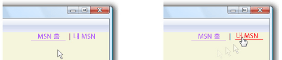

# 방법: 텍스트 장식 만들기How to: Create a Text Decoration
A <xref:System.Windows.TextDecoration> 개체는 시각적 장식 텍스트를 추가할 수 있습니다.A <xref:System.Windows.TextDecoration> object is a visual ornamentation you can add to text. 텍스트 장식의 네 가지가: 밑줄, 초기, 취소선 및 윗줄 합니다.There are four types of text decorations: underline, baseline, strikethrough, and overline. 다음 예제에서는 텍스트를 기준으로 텍스트 장식의 위치를 보여 줍니다.The following example shows the locations of the text decorations relative to the text.  
  
   
텍스트 장식의 종류의 예Example of text decoration types  
  
 텍스트 장식 텍스트를 추가 하려면 만듭니다는 <xref:System.Windows.TextDecoration> 개체 및 해당 속성을 수정 합니다.To add a text decoration to text, create a <xref:System.Windows.TextDecoration> object and modify its properties. 사용 하 여는 <xref:System.Windows.TextDecoration.Location%2A> 속성을 통해 밑줄 등 텍스트 장식이 나타나는 위치를 지정 합니다.Use the <xref:System.Windows.TextDecoration.Location%2A> property to specify where the text decoration appears, such as underline. 사용 된 <xref:System.Windows.TextDecoration.Pen%2A> 텍스트 장식 단색 또는 그라데이션 색 등의 모양을 지정 하는 속성입니다.Use the <xref:System.Windows.TextDecoration.Pen%2A> property to specify the appearance of the text decoration, such as a solid fill or gradient color. 에 대 한 값을 지정 하지 않으면는 <xref:System.Windows.TextDecoration.Pen%2A> 속성에 텍스트와 동일한 색으로 장식의 기본값입니다.If you do not specify a value for the <xref:System.Windows.TextDecoration.Pen%2A> property, the decorations defaults to the same color as the text. 정의 하 고 나면는 <xref:System.Windows.TextDecoration> 개체를 추가 하는 <xref:System.Windows.TextDecorations> 원하는 텍스트 개체의 컬렉션입니다.Once you have defined a <xref:System.Windows.TextDecoration> object, add it to the <xref:System.Windows.TextDecorations> collection of the desired text object.  
  
 다음 예제에서는 선형 그라데이션 브러시 및 펜 파선된으로 스타일이 지정 된 텍스트 장식을 보여 줍니다.The following example shows a text decoration that has been styled with a linear gradient brush and a dashed pen.  
  
   
선형 그라데이션으로 스타일이 지정 된 밑줄의 예 파선된 펜 및 브러시Example of an underline styled with a linear gradient brush and dashed pen  
  
 <xref:System.Windows.Documents.Hyperlink> 개체는 유동 콘텐츠 내에서 하이퍼링크를 호스팅할 수 있도록 하는 인라인 수준의 유동 콘텐츠 요소입니다.The <xref:System.Windows.Documents.Hyperlink> object is an inline-level flow content element that allows you to host hyperlinks within the flow content. 기본적으로 <xref:System.Windows.Documents.Hyperlink> 사용 하 여 한 <xref:System.Windows.TextDecoration> 밑줄을 표시 하는 개체입니다.By default, <xref:System.Windows.Documents.Hyperlink> uses a <xref:System.Windows.TextDecoration> object to display an underline. <xref:System.Windows.TextDecoration>특히 많은 경우 개체를 인스턴스화할 때 성능이 저하 될 수 있습니다 <xref:System.Windows.Documents.Hyperlink> 개체입니다.<xref:System.Windows.TextDecoration> objects can be performance intensive to instantiate, particularly if you have many <xref:System.Windows.Documents.Hyperlink> objects. 광범위 하 게 사용의 경우 <xref:System.Windows.Documents.Hyperlink> 요소를 만들려는 경우와 같은 이벤트 트리거될 때만 밑줄이 표시 된 <xref:System.Windows.ContentElement.MouseEnter> 이벤트입니다.If you make extensive use of <xref:System.Windows.Documents.Hyperlink> elements, you may want to consider showing an underline only when triggering an event, such as the <xref:System.Windows.ContentElement.MouseEnter> event.  
  
 다음 예제에서는 "My MSN" 링크의 밑줄은 동적-만 표시 될 때는 <xref:System.Windows.ContentElement.MouseEnter> 이벤트가 발생 합니다.In the following example, the underline for the "My MSN" link is dynamic—it only appears when the <xref:System.Windows.ContentElement.MouseEnter> event is triggered.  
  
   
TextDecorations를 사용 하 여 정의 되는 하이퍼링크Hyperlinks defined with TextDecorations  
  
 자세한 내용은 [하이퍼링크에 밑줄이 그어지는지 여부 지정](../../../../docs/framework/wpf/advanced/how-to-specify-whether-a-hyperlink-is-underlined.md)을 참조하세요.For more information, see [Specify Whether a Hyperlink is Underlined](../../../../docs/framework/wpf/advanced/how-to-specify-whether-a-hyperlink-is-underlined.md).  
  
## 예제Example  
 다음 코드 예제에서는 밑줄 텍스트 장식을 글꼴의 기본값을 사용합니다.In the following code example, an underline text decoration uses the default font value.  
  
 [!code-csharp[TextDecorationSnippets#TextDecorationSnippets1](../../../../samples/snippets/csharp/VS_Snippets_Wpf/TextDecorationSnippets/CSharp/Window1.xaml.cs#textdecorationsnippets1)]
 [!code-vb[TextDecorationSnippets#TextDecorationSnippets1](../../../../samples/snippets/visualbasic/VS_Snippets_Wpf/TextDecorationSnippets/visualbasic/window1.xaml.vb#textdecorationsnippets1)]
 [!code-xaml[TextDecorationSnippets#TextDecorationSnippets1](../../../../samples/snippets/csharp/VS_Snippets_Wpf/TextDecorationSnippets/CSharp/Window1.xaml#textdecorationsnippets1)]  
  
 다음 코드 예제에서는 밑줄 텍스트 장식은 펜 단색 브러시를 사용한 만들어집니다.In the following code example, an underline text decoration is created with a solid color brush for the pen.  
  
 [!code-csharp[TextDecorationSnippets#TextDecorationSnippets2](../../../../samples/snippets/csharp/VS_Snippets_Wpf/TextDecorationSnippets/CSharp/Window1.xaml.cs#textdecorationsnippets2)]
 [!code-vb[TextDecorationSnippets#TextDecorationSnippets2](../../../../samples/snippets/visualbasic/VS_Snippets_Wpf/TextDecorationSnippets/visualbasic/window1.xaml.vb#textdecorationsnippets2)]
 [!code-xaml[TextDecorationSnippets#TextDecorationSnippets2](../../../../samples/snippets/csharp/VS_Snippets_Wpf/TextDecorationSnippets/CSharp/Window1.xaml#textdecorationsnippets2)]  
  
 다음 코드 예제에서는 밑줄 텍스트 장식은 파선 펜 선형 그라데이션 브러시로 만들어집니다.In the following code example, an underline text decoration is created with a linear gradient brush for the dashed pen.  
  
 [!code-csharp[TextDecorationSnippets#TextDecorationSnippets3](../../../../samples/snippets/csharp/VS_Snippets_Wpf/TextDecorationSnippets/CSharp/Window1.xaml.cs#textdecorationsnippets3)]
 [!code-vb[TextDecorationSnippets#TextDecorationSnippets3](../../../../samples/snippets/visualbasic/VS_Snippets_Wpf/TextDecorationSnippets/visualbasic/window1.xaml.vb#textdecorationsnippets3)]
 [!code-xaml[TextDecorationSnippets#TextDecorationSnippets3](../../../../samples/snippets/csharp/VS_Snippets_Wpf/TextDecorationSnippets/CSharp/Window1.xaml#textdecorationsnippets3)]  
  
## 참고 항목See Also  
 <xref:System.Windows.TextDecoration>  
 <xref:System.Windows.Documents.Hyperlink>  
 [하이퍼링크에 밑줄이 그어지는지 여부 지정Specify Whether a Hyperlink is Underlined](../../../../docs/framework/wpf/advanced/how-to-specify-whether-a-hyperlink-is-underlined.md)
