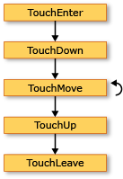
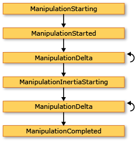
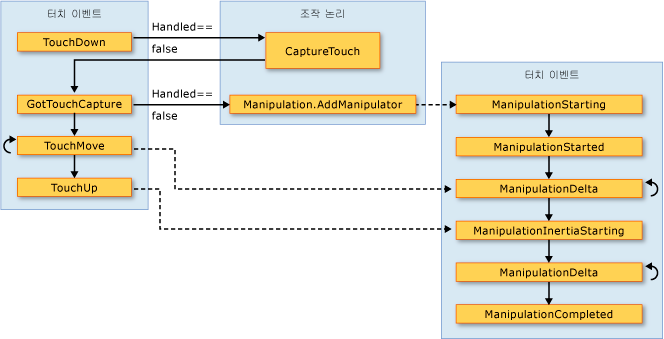

# 입력 개요Input Overview
[!INCLUDE[TLA#tla_winclient](../../../../includes/tlasharptla-winclient-md.md)] 하위 시스템은 마우스, 키보드, 터치, 스타일러스를 비롯한 다양한 장치에서 입력을 가져오는 데 사용할 수 있는 강력한 [!INCLUDE[TLA#tla_api](../../../../includes/tlasharptla-api-md.md)]를 제공합니다. The[!INCLUDE[TLA#tla_winclient](../../../../includes/tlasharptla-winclient-md.md)] subsystem provides a powerful [!INCLUDE[TLA#tla_api](../../../../includes/tlasharptla-api-md.md)] for obtaining input from a variety of devices, including the mouse, keyboard, touch, and stylus. 이 항목에서는 [!INCLUDE[TLA2#tla_winclient](../../../../includes/tla2sharptla-winclient-md.md)]가 제공하는 서비스에 대해 설명하고 입력 시스템의 아키텍처를 살펴봅니다.This topic describes the services provided by [!INCLUDE[TLA2#tla_winclient](../../../../includes/tla2sharptla-winclient-md.md)] and explains the architecture of the input systems.  
  
  
   
## 입력 APIInput API  
 기본 입력 [!INCLUDE[TLA2#tla_api](../../../../includes/tla2sharptla-api-md.md)] 기본 요소 클래스에 노출 됩니다: <xref:System.Windows.UIElement>, <xref:System.Windows.ContentElement>, <xref:System.Windows.FrameworkElement>, 및 <xref:System.Windows.FrameworkContentElement>합니다.The primary input [!INCLUDE[TLA2#tla_api](../../../../includes/tla2sharptla-api-md.md)] exposure is found on the base element classes: <xref:System.Windows.UIElement>, <xref:System.Windows.ContentElement>, <xref:System.Windows.FrameworkElement>, and <xref:System.Windows.FrameworkContentElement>.  기본 요소에 대한 자세한 내용은 [기본 요소 개요](../../../../docs/framework/wpf/advanced/base-elements-overview.md)를 참조하세요.For more information about the base elements, see [Base Elements Overview](../../../../docs/framework/wpf/advanced/base-elements-overview.md).  이러한 클래스는 키 누르기, 마우스 단추, 마우스 휠, 마우스 이동, 포커스 관리, 마우스 캡처 등과 관련된 입력 이벤트를 위한 기능을 제공합니다.These classes provide functionality for input events related to key presses, mouse buttons, mouse wheel, mouse movement, focus management, and mouse capture, to name a few. 입력 아키텍처는 모든 입력 이벤트를 서비스로 처리하는 대신 기본 요소에 입력 [!INCLUDE[TLA2#tla_api](../../../../includes/tla2sharptla-api-md.md)]를 배치함으로써 UI의 특정 개체가 입력 이벤트를 발생시키도록 하고, 둘 이상의 요소가 입력 이벤트를 처리할 수 있는 이벤트 라우팅 체계를 지원할 수 있습니다.By placing the input [!INCLUDE[TLA2#tla_api](../../../../includes/tla2sharptla-api-md.md)] on the base elements, rather than treating all input events as a service, the input architecture enables the input events to be sourced by a particular object in the UI, and to support an event routing scheme whereby more than one element has an opportunity to handle an input event. 대부분의 입력 이벤트에는 연결된 이벤트 쌍이 있습니다.Many input events have a pair of events associated with them.  키 누름 이벤트 연관 예를 들어는 <xref:System.Windows.Input.Keyboard.KeyDown> 및 <xref:System.Windows.Input.Keyboard.PreviewKeyDown> 이벤트입니다.For example, the key down event is associated with the <xref:System.Windows.Input.Keyboard.KeyDown> and <xref:System.Windows.Input.Keyboard.PreviewKeyDown> events.  이벤트마다 이벤트가 대상 요소로 라우트되는 방법이 다릅니다.The difference in these events is in how they are routed to the target element.  미리 보기 이벤트는 요소 트리의 루트 요소에서 대상 요소로 터널링됩니다.Preview events tunnel down the element tree from the root element to the target element.  버블링 이벤트는 대상 요소에서 루트 요소로 버블링됩니다.Bubbling events bubble up from the target element to the root element.  [!INCLUDE[TLA2#tla_winclient](../../../../includes/tla2sharptla-winclient-md.md)]의 이벤트 라우팅에 대한 자세한 내용은 이 개요 항목의 이후 단원 및 [라우트된 이벤트 개요](../../../../docs/framework/wpf/advanced/routed-events-overview.md)에서 자세히 설명합니다.Event routing in [!INCLUDE[TLA2#tla_winclient](../../../../includes/tla2sharptla-winclient-md.md)] is discussed in more detail later in this overview and in the [Routed Events Overview](../../../../docs/framework/wpf/advanced/routed-events-overview.md).  
  
### 키보드 및 마우스 클래스Keyboard and Mouse Classes  
 입력 외에도 [!INCLUDE[TLA2#tla_api](../../../../includes/tla2sharptla-api-md.md)] 기본 요소 클래스에는 <xref:System.Windows.Input.Keyboard> 클래스 및 <xref:System.Windows.Input.Mouse> 클래스는 제공 추가 [!INCLUDE[TLA2#tla_api](../../../../includes/tla2sharptla-api-md.md)] 키보드 및 마우스 입력을 사용 합니다.In addition to the input [!INCLUDE[TLA2#tla_api](../../../../includes/tla2sharptla-api-md.md)] on the base element classes, the <xref:System.Windows.Input.Keyboard> class and <xref:System.Windows.Input.Mouse> classes provide additional [!INCLUDE[TLA2#tla_api](../../../../includes/tla2sharptla-api-md.md)] for working with keyboard and mouse input.  
  
 입력의 예 [!INCLUDE[TLA2#tla_api](../../../../includes/tla2sharptla-api-md.md)] 에 <xref:System.Windows.Input.Keyboard> 클래스는 <xref:System.Windows.Input.Keyboard.Modifiers%2A> 속성을 반환 하는 <xref:System.Windows.Input.ModifierKeys> 현재 눌러져 및 <xref:System.Windows.Input.Keyboard.IsKeyDown%2A> 지정된 된 키를 눌렀는지 여부를 확인 하는 메서드.Examples of input [!INCLUDE[TLA2#tla_api](../../../../includes/tla2sharptla-api-md.md)] on the <xref:System.Windows.Input.Keyboard> class are the <xref:System.Windows.Input.Keyboard.Modifiers%2A> property, which returns the <xref:System.Windows.Input.ModifierKeys> currently pressed, and the <xref:System.Windows.Input.Keyboard.IsKeyDown%2A> method, which determines whether a specified key is pressed.  
  
 다음 예제에서는 <xref:System.Windows.Input.Keyboard.GetKeyStates%2A> 여부를 확인 하는 메서드는 <xref:System.Windows.Input.Key> 다운 상태에 있습니다.The following example uses the <xref:System.Windows.Input.Keyboard.GetKeyStates%2A> method to determine if a <xref:System.Windows.Input.Key> is in the down state.  
  
 [!code-csharp[keyargssnippetsample#KeyEventArgsKeyBoardGetKeyStates](../../../../samples/snippets/csharp/VS_Snippets_Wpf/KeyArgsSnippetSample/CSharp/Window1.xaml.cs#keyeventargskeyboardgetkeystates)]
 [!code-vb[keyargssnippetsample#KeyEventArgsKeyBoardGetKeyStates](../../../../samples/snippets/visualbasic/VS_Snippets_Wpf/KeyArgsSnippetSample/visualbasic/window1.xaml.vb#keyeventargskeyboardgetkeystates)]  
  
 입력의 예 [!INCLUDE[TLA2#tla_api](../../../../includes/tla2sharptla-api-md.md)] 에 <xref:System.Windows.Input.Mouse> 클래스 <xref:System.Windows.Input.Mouse.MiddleButton%2A>, 마우스 가운데 단추의 상태를 가져오는 및 <xref:System.Windows.Input.Mouse.DirectlyOver%2A>, 현재 위에 마우스 포인터가 요소를 가져옵니다.Examples of input [!INCLUDE[TLA2#tla_api](../../../../includes/tla2sharptla-api-md.md)] on the <xref:System.Windows.Input.Mouse> class are <xref:System.Windows.Input.Mouse.MiddleButton%2A>, which obtains the state of the middle mouse button, and <xref:System.Windows.Input.Mouse.DirectlyOver%2A>, which gets the element the mouse pointer is currently over.  
  
 다음 예제에서는 확인 여부는 <xref:System.Windows.Input.Mouse.LeftButton%2A> 마우스가는 <xref:System.Windows.Input.MouseButtonState.Pressed> 상태입니다.The following example determines whether the <xref:System.Windows.Input.Mouse.LeftButton%2A> on the mouse is in the <xref:System.Windows.Input.MouseButtonState.Pressed> state.  
  
 [!code-csharp[mouserelatedsnippets#MouseRelatedSnippetsGetLeftButtonMouse](../../../../samples/snippets/csharp/VS_Snippets_Wpf/MouseRelatedSnippets/CSharp/Window1.xaml.cs#mouserelatedsnippetsgetleftbuttonmouse)]
 [!code-vb[mouserelatedsnippets#MouseRelatedSnippetsGetLeftButtonMouse](../../../../samples/snippets/visualbasic/VS_Snippets_Wpf/MouseRelatedSnippets/visualbasic/window1.xaml.vb#mouserelatedsnippetsgetleftbuttonmouse)]  
  
 <xref:System.Windows.Input.Mouse> 및 <xref:System.Windows.Input.Keyboard> 클래스가이 개요 항목에서 자세히 다룹니다.The <xref:System.Windows.Input.Mouse> and <xref:System.Windows.Input.Keyboard> classes are covered in more detail throughout this overview.  
  
### 스타일러스 입력Stylus Input  
 [!INCLUDE[TLA2#tla_winclient](../../../../includes/tla2sharptla-winclient-md.md)]에 통합에 대 한 지원이 <xref:System.Windows.Input.Stylus>합니다. has integrated support for the <xref:System.Windows.Input.Stylus>.  <xref:System.Windows.Input.Stylus> 에 널리 사용 되는 펜 입력는 [!INCLUDE[TLA#tla_tpc](../../../../includes/tlasharptla-tpc-md.md)]합니다.The <xref:System.Windows.Input.Stylus> is a pen input made popular by the [!INCLUDE[TLA#tla_tpc](../../../../includes/tlasharptla-tpc-md.md)].  [!INCLUDE[TLA2#tla_winclient](../../../../includes/tla2sharptla-winclient-md.md)] 응용 프로그램은 마우스 [!INCLUDE[TLA2#tla_api](../../../../includes/tla2sharptla-api-md.md)]를 사용하여 스타일러스를 마우스로 처리할 수 있지만 [!INCLUDE[TLA2#tla_winclient](../../../../includes/tla2sharptla-winclient-md.md)]는 키보드 및 마우스와 비슷한 모델을 사용하는 스타일러스 장치 추상화도 노출합니다. applications can treat the stylus as a mouse by using the mouse [!INCLUDE[TLA2#tla_api](../../../../includes/tla2sharptla-api-md.md)], but [!INCLUDE[TLA2#tla_winclient](../../../../includes/tla2sharptla-winclient-md.md)] also exposes a stylus device abstraction that use a model similar to the keyboard and mouse.  스타일러스와 관련된 모든 [!INCLUDE[TLA2#tla_api#plural](../../../../includes/tla2sharptla-apisharpplural-md.md)]에는 “Stylus”라는 단어가 포함됩니다.All stylus-related [!INCLUDE[TLA2#tla_api#plural](../../../../includes/tla2sharptla-apisharpplural-md.md)] contain the word "Stylus".  
  
 스타일러스는 마우스처럼 동작할 수 있으므로 마우스 입력만 지원하는 응용 프로그램도 약간의 스타일러스 지원을 자동으로 받을 수 있습니다.Because the stylus can act as a mouse, applications that support only mouse input can still obtain some level of stylus support automatically. 이러한 방식으로 스타일러스를 사용하는 경우 응용 프로그램은 알맞은 스타일러스 이벤트를 처리한 다음 해당 마우스 이벤트를 처리할 수 있게 됩니다.When the stylus is used in such a manner, the application is given the opportunity to handle the appropriate stylus event and then handles the corresponding mouse event. 뿐만 아니라 스타일러스 장치 추상화를 통해 잉크 입력과 같은 높은 수준의 서비스도 사용할 수 있습니다.In addition, higher-level services such as ink input are also available through the stylus device abstraction.  잉크 입력에 대한 자세한 내용은 [잉크 시작](../../../../docs/framework/wpf/advanced/getting-started-with-ink.md)을 참조하세요.For more information about ink as input, see [Getting Started with Ink](../../../../docs/framework/wpf/advanced/getting-started-with-ink.md).  
  
   
## 이벤트 라우팅Event Routing  
 A <xref:System.Windows.FrameworkElement> 요소 트리를 형성 하는 콘텐츠 모델에 대 한 자식 요소로 다른 요소를 포함할 수 있습니다.A <xref:System.Windows.FrameworkElement> can contain other elements as child elements in its content model, forming a tree of elements.  [!INCLUDE[TLA2#tla_winclient](../../../../includes/tla2sharptla-winclient-md.md)]에서 부모 요소는 이벤트를 처리하여 해당 자식 요소 또는 다른 하위 요소를 대상으로 하는 입력에 참가할 수 있습니다.In [!INCLUDE[TLA2#tla_winclient](../../../../includes/tla2sharptla-winclient-md.md)], the parent element can participate in input directed to its child elements or other descendants by handing events. 이는 특히 더 작은 컨트롤에서 컨트롤을 빌드하는 “컨트롤 컴퍼지션” 또는 “합치기”라고 하는 프로세스에 유용합니다.This is especially useful for building controls out of smaller controls, a process known as "control composition" or "compositing." 요소 트리 및 요소 트리와 이벤트 경로가 서로 어떻게 관련되는지에 대한 자세한 내용은 [WPF의 트리](../../../../docs/framework/wpf/advanced/trees-in-wpf.md)를 참조하세요.For more information about element trees and how element trees relate to event routes, see [Trees in WPF](../../../../docs/framework/wpf/advanced/trees-in-wpf.md).  
  
 이벤트 라우팅은 이벤트를 여러 요소로 전달함으로써 경로 상의 특정 개체나 요소가 다른 요소에서 발생시킨 이벤트에 대해 이벤트 처리를 통해 의미 있는 응답을 제공할 수 있도록 하는 프로세스입니다.Event routing is the process of forwarding events to multiple elements, so that a particular object or element along the route can choose to offer a significant response (through handling) to an event that might have been sourced by a different element.  라우트된 이벤트는 직접, 버블링, 터널링이라는 세 가지 라우팅 메커니즘 중 하나를 사용합니다.Routed events use one of three routing mechanisms: direct, bubbling, and tunneling.  직접 라우팅에서는 소스 요소만 이벤트에 대한 알림을 받으며 이벤트가 다른 요소로 라우트되지 않습니다.In direct routing, the source element is the only element notified, and the event is not routed to any other elements. 하지만 직접 라우트된 이벤트도 표준 [!INCLUDE[TLA2#tla_clr](../../../../includes/tla2sharptla-clr-md.md)] 이벤트와는 달리 라우트된 이벤트에만 있는 몇몇 추가 기능을 제공합니다.However, the direct routed event still offers some additional capabilities that are only present for routed events as opposed to standard [!INCLUDE[TLA2#tla_clr](../../../../includes/tla2sharptla-clr-md.md)] events. 버블링은 먼저 이벤트에 대해 이벤트를 발생시킨 요소에 알린 다음 부모 요소 등에 알리는 순서로 요소 트리의 위쪽으로 작동합니다.Bubbling works up the element tree by first notifying the element that sourced the event, then the parent element, and so on.  터널링은 요소 트리의 루트에서 시작하여 아래로 이동한 다음 원래 소스 요소에서 끝납니다.Tunneling starts at the root of the element tree and works down, ending with the original source element.  라우트된 이벤트에 대한 자세한 내용은 [라우트된 이벤트 개요](../../../../docs/framework/wpf/advanced/routed-events-overview.md)를 참조하세요.For more information about routed events, see [Routed Events Overview](../../../../docs/framework/wpf/advanced/routed-events-overview.md).  
  
 [!INCLUDE[TLA2#tla_winclient](../../../../includes/tla2sharptla-winclient-md.md)] 입력 이벤트는 일반적으로 터널링 이벤트와 버블링 이벤트의 쌍으로 구성되어 제공됩니다. input events generally come in pairs that consists of a tunneling event and a bubbling event.  터널링 이벤트는 “Preview” 접두사가 있다는 점에서 버블링 이벤트와 다릅니다.Tunneling events are distinguished from bubbling events with the "Preview" prefix.  예를 들어, <xref:System.Windows.Input.Mouse.PreviewMouseMove> 은 마우스 이동 이벤트의 터널링 버전 및 <xref:System.Windows.Input.Mouse.MouseMove> 이 이벤트의 버블링 버전입니다.For instance, <xref:System.Windows.Input.Mouse.PreviewMouseMove> is the tunneling version of a mouse move event and <xref:System.Windows.Input.Mouse.MouseMove> is the bubbling version of this event. 이 이벤트 쌍은 요소 수준에서 구현되는 규칙이며 [!INCLUDE[TLA2#tla_winclient](../../../../includes/tla2sharptla-winclient-md.md)] 이벤트 시스템의 본질적인 기능은 아닙니다.This event pairing is a convention that is implemented at the element level and is not an inherent capability of the [!INCLUDE[TLA2#tla_winclient](../../../../includes/tla2sharptla-winclient-md.md)] event system. 자세한 내용은 [라우트된 이벤트 개요](../../../../docs/framework/wpf/advanced/routed-events-overview.md)의 WPF 입력 이벤트 섹션을 참조하세요.For details, see the WPF Input Events section in [Routed Events Overview](../../../../docs/framework/wpf/advanced/routed-events-overview.md).  
  
   
## 입력 이벤트 처리Handling Input Events  
 요소에서 입력을 받으려면 특정 이벤트에 이벤트 처리기를 연결해야 합니다.To receive input on an element, an event handler must be associated with that particular event.  [!INCLUDE[TLA2#tla_xaml](../../../../includes/tla2sharptla-xaml-md.md)]에서는 이 작업이 매우 간단합니다. 이 이벤트를 수신할 요소의 특성으로 이벤트 이름을 참조합니다.In [!INCLUDE[TLA2#tla_xaml](../../../../includes/tla2sharptla-xaml-md.md)] this is straightforward: you reference the name of the event as an attribute of the element that will be listening for this event.  그런 다음 대리자에 따라 정의하는 이벤트 처리기의 이름으로 특성 값을 설정하기만 하면 됩니다.Then, you set the value of the attribute to the name of the event handler that you define, based on a delegate.  이벤트 처리기는 [!INCLUDE[TLA#tla_cshrp](../../../../includes/tlasharptla-cshrp-md.md)]과 같은 코드로 작성해야 하며 코드 숨김 파일에 포함할 수 있습니다.The event handler must be written in code such as [!INCLUDE[TLA#tla_cshrp](../../../../includes/tlasharptla-cshrp-md.md)] and can be included in a code-behind file.  
  
 키보드 이벤트는 키보드 포커스가 요소에 있는 동안 발생하는 키 동작을 운영 체제에서 보고할 때 발생합니다.Keyboard events occur when the operating system reports key actions that occur while keyboard focus is on an element. 마우스 및 스타일러스 이벤트는 각각 요소를 기준으로 포인터 위치의 변경을 보고하는 이벤트와 장치 단추의 상태 변경을 보고하는 이벤트의 두 범주로 나뉩니다.Mouse and stylus events each fall into two categories: events that report changes in pointer position relative to the element, and events that report changes in the state of device buttons.  
  
### 키보드 입력 이벤트 예제Keyboard Input Event Example  
 다음 예제에서는 왼쪽 화살표 키 누르기를 수신합니다.The following example listens for a left arrow key press.  A <xref:System.Windows.Controls.StackPanel> 만들어집니다에 <xref:System.Windows.Controls.Button>합니다.A <xref:System.Windows.Controls.StackPanel> is created that has a <xref:System.Windows.Controls.Button>.  왼쪽된 화살표 키 누름에 연결 된에 대 한 수신 하는 이벤트 처리기는 <xref:System.Windows.Controls.Button> 인스턴스.An event handler to listen for the left arrow key press is attached to the <xref:System.Windows.Controls.Button> instance.  
  
 예의 첫 번째 섹션을 만듭니다는 <xref:System.Windows.Controls.StackPanel> 및 <xref:System.Windows.Controls.Button> 에 대 한 이벤트 처리기를 연결 하 고는 <xref:System.Windows.UIElement.KeyDown>합니다.The first section of the example creates the <xref:System.Windows.Controls.StackPanel> and the <xref:System.Windows.Controls.Button> and attaches the event handler for the <xref:System.Windows.UIElement.KeyDown>.  
  
 [!code-xaml[InputOvw#Input_OvwKeyboardExampleXAML](../../../../samples/snippets/csharp/VS_Snippets_Wpf/InputOvw/CSharp/Page1.xaml#input_ovwkeyboardexamplexaml)]  
  
 [!code-csharp[InputOvw#Input_OvwKeyboardExampleUICodeBehind](../../../../samples/snippets/csharp/VS_Snippets_Wpf/InputOvw/CSharp/Page1.xaml.cs#input_ovwkeyboardexampleuicodebehind)]
 [!code-vb[InputOvw#Input_OvwKeyboardExampleUICodeBehind](../../../../samples/snippets/visualbasic/VS_Snippets_Wpf/InputOvw/VisualBasic/Page1.xaml.vb#input_ovwkeyboardexampleuicodebehind)]  
  
 코드로 작성된 두 번째 섹션은 이벤트 처리기를 정의합니다.The second section is written in code and defines the event handler.  왼쪽된 화살표 키를 누르면 및 <xref:System.Windows.Controls.Button> 키보드 포커스가 처리기가 실행 및 <xref:System.Windows.Controls.Control.Background%2A> 의 색은 <xref:System.Windows.Controls.Button> 변경 됩니다.When the left arrow key is pressed and the <xref:System.Windows.Controls.Button> has keyboard focus, the handler runs and the <xref:System.Windows.Controls.Control.Background%2A> color of the <xref:System.Windows.Controls.Button> is changed.  키를 누르면 있지만 왼쪽된 화살표 키를 없는 경우는 <xref:System.Windows.Controls.Control.Background%2A> 의 색은 <xref:System.Windows.Controls.Button> 다시 시작 색으로 변경 됩니다.If the key is pressed, but it is not the left arrow key, the <xref:System.Windows.Controls.Control.Background%2A> color of the <xref:System.Windows.Controls.Button> is changed back to its starting color.  
  
 [!code-csharp[InputOvw#Input_OvwKeyboardExampleHandlerCodeBehind](../../../../samples/snippets/csharp/VS_Snippets_Wpf/InputOvw/CSharp/Page1.xaml.cs#input_ovwkeyboardexamplehandlercodebehind)]
 [!code-vb[InputOvw#Input_OvwKeyboardExampleHandlerCodeBehind](../../../../samples/snippets/visualbasic/VS_Snippets_Wpf/InputOvw/VisualBasic/Page1.xaml.vb#input_ovwkeyboardexamplehandlercodebehind)]  
  
### 마우스 입력 이벤트 예제Mouse Input Event Example  
 다음 예제에서는 <xref:System.Windows.Controls.Control.Background%2A> 의 색은 <xref:System.Windows.Controls.Button> 마우스 포인터가 들어올 때 변경 되는 <xref:System.Windows.Controls.Button>합니다.In the following example, the <xref:System.Windows.Controls.Control.Background%2A> color of a <xref:System.Windows.Controls.Button> is changed when the mouse pointer enters the <xref:System.Windows.Controls.Button>.  <xref:System.Windows.Controls.Control.Background%2A> 마우스가 벗어날 때 색 복원 되는 <xref:System.Windows.Controls.Button>합니다.The <xref:System.Windows.Controls.Control.Background%2A> color is restored when the mouse leaves the <xref:System.Windows.Controls.Button>.  
  
 예의 첫 번째 섹션을 만듭니다는 <xref:System.Windows.Controls.StackPanel> 및 <xref:System.Windows.Controls.Button> 제어에 대 한 이벤트 처리기를 연결 하 고는 <xref:System.Windows.UIElement.MouseEnter> 및 <xref:System.Windows.UIElement.MouseLeave> 이벤트는 <xref:System.Windows.Controls.Button>합니다.The first section of the example creates the <xref:System.Windows.Controls.StackPanel> and the <xref:System.Windows.Controls.Button> control and attaches the event handlers for the <xref:System.Windows.UIElement.MouseEnter> and <xref:System.Windows.UIElement.MouseLeave> events to the <xref:System.Windows.Controls.Button>.  
  
 [!code-xaml[InputOvw#Input_OvwMouseExampleXAML](../../../../samples/snippets/csharp/VS_Snippets_Wpf/InputOvw/CSharp/Page1.xaml#input_ovwmouseexamplexaml)]  
  
 [!code-csharp[InputOvw#Input_OvwMouseExampleUICodeBehind](../../../../samples/snippets/csharp/VS_Snippets_Wpf/InputOvw/CSharp/Page1.xaml.cs#input_ovwmouseexampleuicodebehind)]
 [!code-vb[InputOvw#Input_OvwMouseExampleUICodeBehind](../../../../samples/snippets/visualbasic/VS_Snippets_Wpf/InputOvw/VisualBasic/Page1.xaml.vb#input_ovwmouseexampleuicodebehind)]  
  
 예제에서 코드로 작성된 두 번째 섹션은 이벤트 처리기를 정의합니다.The second section of the example is written in code and defines the event handlers.  마우스를 가져갈 때는 <xref:System.Windows.Controls.Button>, <xref:System.Windows.Controls.Control.Background%2A> 의 색은 <xref:System.Windows.Controls.Button> 로 변경 <xref:System.Windows.Media.Brushes.SlateGray%2A>합니다.When the mouse enters the <xref:System.Windows.Controls.Button>, the <xref:System.Windows.Controls.Control.Background%2A> color of the <xref:System.Windows.Controls.Button> is changed to <xref:System.Windows.Media.Brushes.SlateGray%2A>.  마우스가 벗어날 때는 <xref:System.Windows.Controls.Button>, <xref:System.Windows.Controls.Control.Background%2A> 의 색은 <xref:System.Windows.Controls.Button> 으로 다시 변경 <xref:System.Windows.Media.Brushes.AliceBlue%2A>합니다.When the mouse leaves the <xref:System.Windows.Controls.Button>, the <xref:System.Windows.Controls.Control.Background%2A> color of the <xref:System.Windows.Controls.Button> is changed back to <xref:System.Windows.Media.Brushes.AliceBlue%2A>.  
  
 [!code-csharp[InputOvw#Input_OvwMouseExampleEneterHandler](../../../../samples/snippets/csharp/VS_Snippets_Wpf/InputOvw/CSharp/Page1.xaml.cs#input_ovwmouseexampleeneterhandler)]
 [!code-vb[InputOvw#Input_OvwMouseExampleEneterHandler](../../../../samples/snippets/visualbasic/VS_Snippets_Wpf/InputOvw/VisualBasic/Page1.xaml.vb#input_ovwmouseexampleeneterhandler)]  
  
 [!code-csharp[InputOvw#Input_OvwMouseExampleLeaveHandler](../../../../samples/snippets/csharp/VS_Snippets_Wpf/InputOvw/CSharp/Page1.xaml.cs#input_ovwmouseexampleleavehandler)]
 [!code-vb[InputOvw#Input_OvwMouseExampleLeaveHandler](../../../../samples/snippets/visualbasic/VS_Snippets_Wpf/InputOvw/VisualBasic/Page1.xaml.vb#input_ovwmouseexampleleavehandler)]  
  
   
## 텍스트 입력Text Input  
 <xref:System.Windows.ContentElement.TextInput> 이벤트를 사용 하면 장치에 관계 없이 텍스트 입력에 대 한 수신 대기 하도록 합니다.The <xref:System.Windows.ContentElement.TextInput> event enables you to listen for text input in a device-independent manner. 텍스트 입력에는 주로 키보드를 사용하지만 음성, 필기 및 기타 입력 장치를 통해서도 텍스트 입력을 생성할 수 있습니다.The keyboard is the primary means of text input, but speech, handwriting, and other input devices can generate text input also.  
  
 키보드 입력에 대 한 [!INCLUDE[TLA2#tla_winclient](../../../../includes/tla2sharptla-winclient-md.md)] 먼저 적절 한 보냅니다 <xref:System.Windows.ContentElement.KeyDown> / <xref:System.Windows.ContentElement.KeyUp> 이벤트입니다.For keyboard input, [!INCLUDE[TLA2#tla_winclient](../../../../includes/tla2sharptla-winclient-md.md)] first sends the appropriate <xref:System.Windows.ContentElement.KeyDown>/<xref:System.Windows.ContentElement.KeyUp> events. 이러한 이벤트가 처리 되지 않습니다 (방향 화살표와 같은 컨트롤 키) 또는 기능 키 아니라 텍스트의 키가 하는 경우는 <xref:System.Windows.ContentElement.TextInput> 이벤트가 발생 합니다.If those events are not handled and the key is textual (rather than a control key such as directional arrows or function keys), then a <xref:System.Windows.ContentElement.TextInput> event is raised.  없기 항상 간 단순 일대일 매핑보다 <xref:System.Windows.ContentElement.KeyDown> / <xref:System.Windows.ContentElement.KeyUp> 및 <xref:System.Windows.ContentElement.TextInput> 이벤트 여러 키 입력 텍스트 입력의 단일 문자를 생성할 수 있으며 단일 키 입력 여러 문자를 생성할 수 있으므로 문자열입니다.There is not always a simple one-to-one mapping between <xref:System.Windows.ContentElement.KeyDown>/<xref:System.Windows.ContentElement.KeyUp> and <xref:System.Windows.ContentElement.TextInput> events because multiple keystrokes can generate a single character of text input and single keystrokes can generate multi-character strings.  이는 특히 각 언어의 알파벳으로 수천 개의 가능한 문자를 생성하는 데 [!INCLUDE[TLA#tla_ime#plural](../../../../includes/tlasharptla-imesharpplural-md.md)]를 사용하는 한국어, 중국어 및 일본어 등의 언어에서 더욱 그렇습니다.This is especially true for languages such as Chinese, Japanese, and Korean which use [!INCLUDE[TLA#tla_ime#plural](../../../../includes/tlasharptla-imesharpplural-md.md)] to generate the thousands of possible characters in their corresponding alphabets.  
  
 때 [!INCLUDE[TLA2#tla_winclient](../../../../includes/tla2sharptla-winclient-md.md)] 보냅니다는 <xref:System.Windows.ContentElement.KeyUp> / <xref:System.Windows.ContentElement.KeyDown> 이벤트 <xref:System.Windows.Input.KeyEventArgs.Key%2A> 로 설정 된 <xref:System.Windows.Input.Key.System?displayProperty=nameWithType> 키 입력의 일부가 될 수 있는 경우는 <xref:System.Windows.ContentElement.TextInput> 이벤트 (ALT + S를 누르거나 예를 들어) 하는 경우.When [!INCLUDE[TLA2#tla_winclient](../../../../includes/tla2sharptla-winclient-md.md)] sends a <xref:System.Windows.ContentElement.KeyUp>/<xref:System.Windows.ContentElement.KeyDown> event, <xref:System.Windows.Input.KeyEventArgs.Key%2A> is set to <xref:System.Windows.Input.Key.System?displayProperty=nameWithType> if the keystrokes could become part of a <xref:System.Windows.ContentElement.TextInput> event (if ALT+S is pressed, for example). 이렇게 하면 코드에는 <xref:System.Windows.ContentElement.KeyDown> 이벤트 처리기를 확인 하려면 <xref:System.Windows.Input.Key.System?displayProperty=nameWithType> 및 경우 이후에 발생의 처리기에 대 한 처리를 찾을 수 <xref:System.Windows.ContentElement.TextInput> 이벤트입니다.This allows code in a <xref:System.Windows.ContentElement.KeyDown> event handler to check for <xref:System.Windows.Input.Key.System?displayProperty=nameWithType> and, if found, leave processing for the handler of the subsequently raised <xref:System.Windows.ContentElement.TextInput> event. 이러한 경우의 다양 한 속성에는 <xref:System.Windows.Input.TextCompositionEventArgs> 원래 키 입력을 확인 하려면 인수를 사용할 수 있습니다.In these cases, the various properties of the <xref:System.Windows.Input.TextCompositionEventArgs> argument can be used to determine the original keystrokes. 마찬가지로, 하는 경우는 [!INCLUDE[TLA2#tla_ime](../../../../includes/tla2sharptla-ime-md.md)] 가 활성 상태 이면 <xref:System.Windows.Input.Key> 값 <xref:System.Windows.Input.Key.ImeProcessed?displayProperty=nameWithType>, 및 <xref:System.Windows.Input.KeyEventArgs.ImeProcessedKey%2A> 원래 키 또는 키 입력을 제공 합니다.Similarly, if an [!INCLUDE[TLA2#tla_ime](../../../../includes/tla2sharptla-ime-md.md)] is active, <xref:System.Windows.Input.Key> has the value of <xref:System.Windows.Input.Key.ImeProcessed?displayProperty=nameWithType>, and <xref:System.Windows.Input.KeyEventArgs.ImeProcessedKey%2A> gives the original keystroke or keystrokes.  
  
 다음 예제에서는 정의 대 한 처리기는 <xref:System.Windows.Controls.Primitives.ButtonBase.Click> 이벤트 및에 대 한 처리기는 <xref:System.Windows.UIElement.KeyDown> 이벤트입니다.The following example defines a handler for the <xref:System.Windows.Controls.Primitives.ButtonBase.Click> event and a handler for the <xref:System.Windows.UIElement.KeyDown> event.  
  
 코드 또는 태그의 첫 번째 세그먼트에서는 사용자 인터페이스를 만듭니다.The first segment of code or markup creates the user interface.  
  
 [!code-xaml[InputOvw#Input_OvwTextInputXAML](../../../../samples/snippets/csharp/VS_Snippets_Wpf/InputOvw/CSharp/Page1.xaml#input_ovwtextinputxaml)]  
  
 [!code-csharp[InputOvw#Input_OvwTextInputUICodeBehind](../../../../samples/snippets/csharp/VS_Snippets_Wpf/InputOvw/CSharp/Page1.xaml.cs#input_ovwtextinputuicodebehind)]
 [!code-vb[InputOvw#Input_OvwTextInputUICodeBehind](../../../../samples/snippets/visualbasic/VS_Snippets_Wpf/InputOvw/VisualBasic/Page1.xaml.vb#input_ovwtextinputuicodebehind)]  
  
 코드의 두 번째 세그먼트에는 이벤트 처리기가 포함되어 있습니다.The second segment of code contains the event handlers.  
  
 [!code-csharp[InputOvw#Input_OvwTextInputHandlersCodeBehind](../../../../samples/snippets/csharp/VS_Snippets_Wpf/InputOvw/CSharp/Page1.xaml.cs#input_ovwtextinputhandlerscodebehind)]
 [!code-vb[InputOvw#Input_OvwTextInputHandlersCodeBehind](../../../../samples/snippets/visualbasic/VS_Snippets_Wpf/InputOvw/VisualBasic/Page1.xaml.vb#input_ovwtextinputhandlerscodebehind)]  
  
 이벤트 경로 입력된 이벤트를 생성 하기 때문에 <xref:System.Windows.Controls.StackPanel> 에 키보드 포커스가 있는 요소에 관계 없이 입력을 받습니다.Because input events bubble up the event route, the <xref:System.Windows.Controls.StackPanel> receives the input regardless of which element has keyboard focus. <xref:System.Windows.Controls.TextBox> 컨트롤 먼저 알려집니다 및 `OnTextInputKeyDown` 경우에 처리기가 호출 됩니다는 <xref:System.Windows.Controls.TextBox> 입력을 처리 하지 못했습니다.The <xref:System.Windows.Controls.TextBox> control is notified first and the `OnTextInputKeyDown` handler is called only if the <xref:System.Windows.Controls.TextBox> did not handle the input. 경우는 <xref:System.Windows.UIElement.PreviewKeyDown> 이벤트 대신 사용 되는 <xref:System.Windows.UIElement.KeyDown> 이벤트를는 `OnTextInputKeyDown` 먼저 처리기가 호출 됩니다.If the <xref:System.Windows.UIElement.PreviewKeyDown> event is used instead of the <xref:System.Windows.UIElement.KeyDown> event, the `OnTextInputKeyDown` handler is called first.  
  
 이 예제에서 처리 논리는 Ctrl+O에 대해 한 번, 그리고 단추의 클릭 이벤트에 대해 한 번으로 총 두 번 작성되었습니다.In this example, the handling logic is written two times—one time for CTRL+O, and again for button's click event. 입력 이벤트를 직접 처리하는 대신 명령을 사용하면 이를 간편하게 처리할 수 있습니다.This can be simplified by using commands, instead of handling the input events directly.  명령에 대해서는 이 개요 항목과 [명령 개요](../../../../docs/framework/wpf/advanced/commanding-overview.md)에서 설명합니다.Commands are discussed in this overview and in [Commanding Overview](../../../../docs/framework/wpf/advanced/commanding-overview.md).  
  
   
## 터치 및 조작Touch and Manipulation  
 Windows 7 운영 체제의 새로운 하드웨어 및 API를 사용하면 응용 프로그램이 여러 터치에서 동시에 입력을 수신할 수 있습니다.New hardware and API in the Windows 7 operating system provide applications the ability to receive input from multiple touches simultaneously. [!INCLUDE[TLA2#tla_winclient](../../../../includes/tla2sharptla-winclient-md.md)]를 사용하면 응용 프로그램에서 터치가 발생할 때 이벤트를 발생시킴으로써 마우스나 키보드와 같은 다른 입력에 응답하는 것과 유사한 방식으로 터치를 감지하고 이에 응답할 수 있습니다. enables applications to detect and respond to touch in a manner similar to responding to other input, such as the mouse or keyboard, by raising events when touch occurs.  
  
 [!INCLUDE[TLA2#tla_winclient](../../../../includes/tla2sharptla-winclient-md.md)]는 터치가 발생할 때 두 가지 형식의 이벤트, 즉 터치 이벤트와 조작 이벤트를 노출합니다. exposes two types of events when touch occurs: touch events and manipulation events. 터치 이벤트는 터치 스크린의 각 손가락과 그 이동에 대한 원시 데이터를 제공합니다.Touch events provide raw data about each finger on a touchscreen and its movement. 조작 이벤트는 특정 작업으로 입력을 해석합니다.Manipulation events interpret the input as certain actions. 이 섹션에서는 두 가지 형식의 이벤트에 대해 모두 설명합니다.Both types of events are discussed in this section.  
  
### 필수 구성 요소Prerequisites  
 터치에 응답하는 응용 프로그램을 개발하려면 다음 구성 요소가 필요합니다.You need the following components to develop an application that responds to touch.  
  
-   [!INCLUDE[vs_dev10_ext](../../../../includes/vs-dev10-ext-md.md)]..  
  
-   Windows 7Windows 7.  
  
-   Windows Touch를 지원하는 터치 스크린과 같은 장치A device, such as a touchscreen, that supports Windows Touch.  
  
### 용어Terminology  
 터치에 대해 설명할 때 다음 용어가 사용됩니다.The following terms are used when touch is discussed.  
  
-   **터치**는 Windows 7에서 인식되는 사용자 입력 형식입니다.**Touch** is a type of user input that is recognized by Windows 7. 일반적으로 터치 스크린에 손가락을 대면 터치가 시작됩니다.Usually, touch is initiated by putting fingers on a touch-sensitive screen. 랩톱 컴퓨터에서 일반적으로 사용되는 터치 패드와 같은 장치는 장치가 손가락의 위치와 움직임을 마우스 입력으로 단순히 변환하는 경우 터치를 지원하지 않습니다.Note that devices such as a touchpad that is common on laptop computers do not support touch if the device merely converts the finger's position and movement as mouse input.  
  
-   **멀티 터치**는 둘 이상의 지점에서 동시에 발생하는 터치입니다.**Multitouch** is touch that occurs from more than one point simultaneously. Windows 7 및 [!INCLUDE[TLA2#tla_winclient](../../../../includes/tla2sharptla-winclient-md.md)]에서 멀티 터치를 지원합니다.Windows 7 and [!INCLUDE[TLA2#tla_winclient](../../../../includes/tla2sharptla-winclient-md.md)] supports multitouch. [!INCLUDE[TLA2#tla_winclient](../../../../includes/tla2sharptla-winclient-md.md)]에 대한 설명서에서 터치를 설명할 때마다 이 개념이 멀티 터치에 적용됩니다.Whenever touch is discussed in the documentation for [!INCLUDE[TLA2#tla_winclient](../../../../includes/tla2sharptla-winclient-md.md)], the concepts apply to multitouch.  
  
-   터치가 개체에 적용되는 물리적 액션으로 해석되면 **조작**이 발생합니다.A **manipulation** occurs when touch is interpreted as a physical action that is applied to an object. [!INCLUDE[TLA2#tla_winclient](../../../../includes/tla2sharptla-winclient-md.md)]에서 조작 이벤트는 입력을 변환, 확장 또는 회전 조작으로 해석합니다.In [!INCLUDE[TLA2#tla_winclient](../../../../includes/tla2sharptla-winclient-md.md)], manipulation events interpret input as a translation, expansion, or rotation manipulation.  
  
-   `touch device`는 터치 스크린에서 한 손가락과 같은 터치식 입력을 생성하는 장치를 나타냅니다.A `touch device` represents a device that produces touch input, such as a single finger on a touchscreen.  
  
### 터치에 반응하는 컨트롤Controls that Respond to Touch  
 보기에서 스크롤된 콘텐츠가 있는 경우 컨트롤에서 손가락을 드래그하여 다음 컨트롤을 스크롤할 수 있습니다.The following controls can be scrolled by dragging a finger across the control if it has content that is scrolled out of view.  
  
-   <xref:System.Windows.Controls.ComboBox>  
  
-   <xref:System.Windows.Controls.ContextMenu>  
  
-   <xref:System.Windows.Controls.DataGrid>  
  
-   <xref:System.Windows.Controls.ListBox>  
  
-   <xref:System.Windows.Controls.ListView>  
  
-   <xref:System.Windows.Controls.MenuItem>  
  
-   <xref:System.Windows.Controls.TextBox>  
  
-   <xref:System.Windows.Controls.ToolBar>  
  
-   <xref:System.Windows.Controls.TreeView>  
  
 <xref:System.Windows.Controls.ScrollViewer> 정의 <xref:System.Windows.Controls.ScrollViewer.PanningMode%2A?displayProperty=nameWithType> 터치 이동 사용 가능 여부 가로, 세로, 가로 및 세로 또는 둘 다 지정할 수 있는 연결 된 속성입니다.The <xref:System.Windows.Controls.ScrollViewer> defines the <xref:System.Windows.Controls.ScrollViewer.PanningMode%2A?displayProperty=nameWithType> attached property that enables you to specify whether touch panning is enabled horizontally, vertically, both, or neither. <xref:System.Windows.Controls.ScrollViewer.PanningDeceleration%2A?displayProperty=nameWithType> 얼마나 빨리 스크롤 속도 낮추고 손가락 터치 스크린에서 들어 올릴 때 속성을 지정 합니다.The <xref:System.Windows.Controls.ScrollViewer.PanningDeceleration%2A?displayProperty=nameWithType> property specifies how quickly the scrolling slows down when the user lifts the finger from the touchscreen. <xref:System.Windows.Controls.ScrollViewer.PanningRatio%2A?displayProperty=nameWithType> 스크롤 조작 오프셋을 변환 하는 오프셋의 비율을 지정 하는 연결 된 속성입니다.The <xref:System.Windows.Controls.ScrollViewer.PanningRatio%2A?displayProperty=nameWithType> attached property specifies the ratio of scrolling offset to translate manipulation offset.  
  
### 터치 이벤트Touch Events  
 기본 클래스 <xref:System.Windows.UIElement>, <xref:System.Windows.UIElement3D>, 및 <xref:System.Windows.ContentElement>, 응용 프로그램는 터치에 응답 하도록 구독할 수 있는 이벤트를 정의 합니다.The base classes, <xref:System.Windows.UIElement>, <xref:System.Windows.UIElement3D>, and <xref:System.Windows.ContentElement>, define events that you can subscribe to so your application will respond to touch. 터치 이벤트는 응용 프로그램이 터치를 개체 조작이 아닌 다른 것으로 해석할 때 유용합니다.Touch events are useful when your application interprets touch as something other than manipulating an object. 예를 들어 사용자가 하나 이상의 손가락으로 그릴 수 있는 응용 프로그램은 터치 이벤트를 구독합니다.For example, an application that enables a user to draw with one or more fingers would subscribe to touch events.  
  
 세 클래스 모두 다음과 같은 이벤트를 정의합니다. 이 이벤트는 정의 클래스에 관계없이 유사하게 동작합니다.All three classes define the following events, which behave similarly, regardless of the defining class.  
  
-   <xref:System.Windows.UIElement.TouchDown>  
  
-   <xref:System.Windows.UIElement.TouchMove>  
  
-   <xref:System.Windows.UIElement.TouchUp>  
  
-   <xref:System.Windows.UIElement.TouchEnter>  
  
-   <xref:System.Windows.UIElement.TouchLeave>  
  
-   <xref:System.Windows.UIElement.PreviewTouchDown>  
  
-   <xref:System.Windows.UIElement.PreviewTouchMove>  
  
-   <xref:System.Windows.UIElement.PreviewTouchUp>  
  
-   <xref:System.Windows.UIElement.GotTouchCapture>  
  
-   <xref:System.Windows.UIElement.LostTouchCapture>  
  
 키보드 및 마우스 이벤트와 마찬가지로 터치 이벤트는 라우트된 이벤트입니다.Like keyboard and mouse events, the touch events are routed events. `Preview`로 시작하는 이벤트는 터널링 이벤트이고 `Touch`로 시작하는 이벤트는 버블링 이벤트입니다.The events that begin with `Preview` are tunneling events and the events that begin with `Touch` are bubbling events. 라우트된 이벤트에 대한 자세한 내용은 [라우트된 이벤트 개요](../../../../docs/framework/wpf/advanced/routed-events-overview.md)를 참조하세요.For more information about routed events, see [Routed Events Overview](../../../../docs/framework/wpf/advanced/routed-events-overview.md). 이러한 이벤트를 처리 하는 경우 호출 하 여 모든 요소를 기준으로 입력의 위치를 가져올 수 있습니다는 <xref:System.Windows.Input.TouchEventArgs.GetTouchPoint%2A> 또는 <xref:System.Windows.Input.TouchEventArgs.GetIntermediateTouchPoints%2A> 메서드.When you handle these events, you can get the position of the input, relative to any element, by calling the <xref:System.Windows.Input.TouchEventArgs.GetTouchPoint%2A> or <xref:System.Windows.Input.TouchEventArgs.GetIntermediateTouchPoints%2A> method.  
  
 터치 이벤트 간의 상호 작용을 이해하려면 사용자가 한 손가락을 요소 위에 놓고 손가락을 요소에서 움직인 다음 요소에서 손가락을 들어 올리는 시나리오를 고려해 보세요.To understand the interaction among the touch events, consider the scenario where a user puts one finger on an element, moves the finger in the element, and then lifts the finger from the element. 다음 그림에서는 버블링 이벤트를 실행하는 것을 보여 줍니다(단순하게 하기 위해 터널링 이벤트는 생략됨).The following illustration shows the execution of the bubbling events (the tunneling events are omitted for simplicity).  
  
 ![터치 이벤트의 시퀀스입니다. ] (../../../../docs/framework/wpf/advanced/media/ndp-touchevents.png "NDP_TouchEvents")  
터치 이벤트Touch events  
  
 다음 목록은 앞의 그림에서 이벤트 시퀀스를 설명합니다.The following list describes the sequence of the events in the preceding illustration.  
  
1.  <xref:System.Windows.UIElement.TouchEnter> 이벤트는 사용자가 요소에 손가락을 놓고 하는 경우 한 번 발생 합니다.The <xref:System.Windows.UIElement.TouchEnter> event occurs one time when the user puts a finger on the element.  
  
2.  <xref:System.Windows.UIElement.TouchDown> 이벤트 한 번 발생 합니다.The <xref:System.Windows.UIElement.TouchDown> event occurs one time.  
  
3.  <xref:System.Windows.UIElement.TouchMove> 손가락 요소 내에서 이동할 때 이벤트에 여러 번 발생 합니다.The <xref:System.Windows.UIElement.TouchMove> event occurs multiple times as the user moves the finger within the element.  
  
4.  <xref:System.Windows.UIElement.TouchUp> 이벤트는 사용자가 요소에서 손가락을 뗄 때 한 번 발생 합니다.The <xref:System.Windows.UIElement.TouchUp> event occurs one time when the user lifts the finger from the element.  
  
5.  <xref:System.Windows.UIElement.TouchLeave> 이벤트 한 번 발생 합니다.The <xref:System.Windows.UIElement.TouchLeave> event occurs one time.  
  
 3개 이상의 손가락이 사용되면 각 손가락마다 이벤트가 발생합니다.When more than two fingers are used, the events occur for each finger.  
  
### 조작 이벤트Manipulation Events  
 응용 프로그램을 통해 사용자가 개체를 조작할 수 있는 경우에는 <xref:System.Windows.UIElement> 클래스 조작 이벤트를 정의 합니다.For cases where an application enables a user to manipulate an object, the <xref:System.Windows.UIElement> class defines manipulation events. 터치 위치를 단순히 보고하는 터치 이벤트와 달리 조작 이벤트는 입력을 해석할 수 있는 방법을 보고합니다.Unlike the touch events that simply report the position of touch, the manipulation events report how the input can be interpreted. 변환, 확장 및 회전이라는 세 가지 형식의 조작이 있습니다.There are three types of manipulations, translation, expansion, and rotation. 다음 목록은 세 가지 형식의 조작을 호출하는 방법을 설명합니다.The following list describes how to invoke the three types of manipulations.  
  
-   개체에 손가락을 대고 터치 스크린에서 손가락을 움직이면 변환 조작을 호출합니다.Put a finger on an object and move the finger across the touchscreen to invoke a translation manipulation. 그러면 일반적으로 개체를 이동합니다.This usually moves the object.  
  
-   개체 위에 두 개의 손가락을 놓고 손가락을 서로 더 가깝게 또는 멀리 움직여 확장 조작을 호출합니다.Put two fingers on an object and move the fingers closer together or farther apart from one another to invoke an expansion manipulation. 그러면 일반적으로 개체의 크기를 조정합니다.This usually resizes the object.  
  
-   개체에 두 손가락을 놓고 손가락을 서로 회전하면 회전 조작을 호출합니다.Put two fingers on an object and rotate the fingers around each other to invoke a rotation manipulation. 그러면 일반적으로 개체를 회전합니다.This usually rotates the object.  
  
 둘 이상의 조작 형식이 동시에 발생할 수 있습니다.More than one type of manipulation can occur simultaneously.  
  
 개체가 조작에 응답하게 하면 개체에 관성이 있는 것처럼 보일 수 있습니다.When you cause objects to respond to manipulations, you can have the object appear to have inertia. 그러면 개체가 실제 세계를 시뮬레이트하게 만들 수 있습니다.This can make your objects simulate the physical world. 예를 들어 테이블에서 책을 밀 때 충분히 세게 밀면 책을 놓은 후에도 책이 계속 움직입니다.For example, when you push a book across a table, if you push hard enough the book will continue to move after you release it. [!INCLUDE[TLA2#tla_winclient](../../../../includes/tla2sharptla-winclient-md.md)]을 사용하면 사용자가 손가락을 개체에서 뗀 후 조작 이벤트를 발생시켜 이 동작을 시뮬레이트할 수 있습니다. enables you to simulate this behavior by raising manipulation events after the user's fingers releases the object.  
  
 사용자가 개체를 이동, 크기 조정 및 회전할 수 있게 하는 응용 프로그램을 만드는 방법에 대한 자세한 내용은 [연습: 첫 번째 터치 응용 프로그램 만들기](../../../../docs/framework/wpf/advanced/walkthrough-creating-your-first-touch-application.md)를 참조하세요.For information about how to create an application that enables the user to move, resize, and rotate an object, see [Walkthrough: Creating Your First Touch Application](../../../../docs/framework/wpf/advanced/walkthrough-creating-your-first-touch-application.md).  
  
 <xref:System.Windows.UIElement> 다음 조작 이벤트를 정의 합니다.The <xref:System.Windows.UIElement> defines the following manipulation events.  
  
-   <xref:System.Windows.UIElement.ManipulationStarting>  
  
-   <xref:System.Windows.UIElement.ManipulationStarted>  
  
-   <xref:System.Windows.UIElement.ManipulationDelta>  
  
-   <xref:System.Windows.UIElement.ManipulationInertiaStarting>  
  
-   <xref:System.Windows.UIElement.ManipulationCompleted>  
  
-   <xref:System.Windows.UIElement.ManipulationBoundaryFeedback>  
  
 기본적으로는 <xref:System.Windows.UIElement> 이러한 조작 이벤트를 수신 하지 않습니다.By default, a <xref:System.Windows.UIElement> does not receive these manipulation events. 조작 이벤트에 받을 <xref:System.Windows.UIElement>설정, <xref:System.Windows.UIElement.IsManipulationEnabled%2A?displayProperty=nameWithType> 를 `true`합니다.To receive manipulation events on a <xref:System.Windows.UIElement>, set <xref:System.Windows.UIElement.IsManipulationEnabled%2A?displayProperty=nameWithType> to `true`.  
  
#### 조작 이벤트 실행 경로The Execution Path of Manipulation Events  
 사용자가 개체를 “throw”하는 시나리오를 고려해 보겠습니다.Consider a scenario where a user "throws" an object. 사용자가 개체 위에 손가락을 놓고 터치 스크린에서 짧은 거리만큼 손가락을 이동한 다음 개체가 움직이는 동안 손가락을 뗍니다.The user puts a finger on the object, moves the finger across the touchscreen for a short distance, and then lifts the finger while it is moving. 그 결과 사용자가 손가락을 뗀 후에도 개체가 사용자의 손가락 아래에서 계속 움직입니다.The result of this is that the object will move under the user's finger and continue to move after the user lifts the finger.  
  
 다음 그림에서는 조작 이벤트의 실행 경로 및 각 이벤트에 대한 중요한 정보를 보여 줍니다.The following illustration shows the execution path of manipulation events and important information about each event.  
  
 ![조작 이벤트의 시퀀스입니다. ] (../../../../docs/framework/wpf/advanced/media/ndp-manipulationevents.png "NDP_ManipulationEvents")  
조작 이벤트Manipulation events  
  
 다음 목록은 앞의 그림에서 이벤트 시퀀스를 설명합니다.The following list describes the sequence of the events in the preceding illustration.  
  
1.  <xref:System.Windows.UIElement.ManipulationStarting> 이벤트 개체에 손가락을 놓을 때 발생 합니다.The <xref:System.Windows.UIElement.ManipulationStarting> event occurs when the user places a finger on the object. 특히,이 이벤트를 통해 설정할 수 있습니다는 <xref:System.Windows.Input.ManipulationStartingEventArgs.ManipulationContainer%2A> 속성입니다.Among other things, this event allows you to set the <xref:System.Windows.Input.ManipulationStartingEventArgs.ManipulationContainer%2A> property. 후속 이벤트에서 조작의 위치에 상대적인 됩니다는 <xref:System.Windows.Input.ManipulationStartingEventArgs.ManipulationContainer%2A>합니다.In the subsequent events, the position of the manipulation will be relative to the <xref:System.Windows.Input.ManipulationStartingEventArgs.ManipulationContainer%2A>. 이외의 이벤트에서 <xref:System.Windows.UIElement.ManipulationStarting>,이 속성은 읽기 전용 이므로 <xref:System.Windows.UIElement.ManipulationStarting> 이벤트는이 속성을 설정할 수 있는 유일한 경우입니다.In events other than <xref:System.Windows.UIElement.ManipulationStarting>, this property is read-only, so the <xref:System.Windows.UIElement.ManipulationStarting> event is the only time that you can set this property.  
  
2.  <xref:System.Windows.UIElement.ManipulationStarted> 이벤트 다음에 발생 합니다.The <xref:System.Windows.UIElement.ManipulationStarted> event occurs next. 이 이벤트는 조작의 출처를 보고합니다.This event reports the origin of the manipulation.  
  
3.  <xref:System.Windows.UIElement.ManipulationDelta> 이벤트 터치 스크린에 손가락 이동 사용자의로 여러 번 발생 합니다.The <xref:System.Windows.UIElement.ManipulationDelta> event occurs multiple times as a user's fingers move on a touchscreen. <xref:System.Windows.Input.ManipulationDeltaEventArgs.DeltaManipulation%2A> 의 속성은 <xref:System.Windows.Input.ManipulationDeltaEventArgs> 클래스 조작 이동, 확장 또는 번역 해석 되는지 여부를 보고 합니다.The <xref:System.Windows.Input.ManipulationDeltaEventArgs.DeltaManipulation%2A> property of the <xref:System.Windows.Input.ManipulationDeltaEventArgs> class reports whether the manipulation is interpreted as movement, expansion, or translation. 바로 여기서 개체 조작 작업의 대부분이 수행됩니다.This is where you perform most of the work of manipulating an object.  
  
4.  <xref:System.Windows.UIElement.ManipulationInertiaStarting> 이 이벤트는 사용자의 손가락의 개체와 연결이 끊어질 때 발생 합니다.The <xref:System.Windows.UIElement.ManipulationInertiaStarting> event occurs when the user's fingers lose contact with the object. 이 이벤트를 사용하면 관성이 발생하는 동안 수행되는 조작의 감속을 지정할 수 있습니다.This event enables you to specify the deceleration of the manipulations during inertia. 따라서 사용자가 선택한 여러 가지 실제 공간 또는 특성을 개체가 에뮬레이트할 수 있습니다.This is so your object can emulate different physical spaces or attributes if you choose. 예를 들어 응용 프로그램에 실제 세계의 항목을 나타내는 개체가 두 개 있고 한 개체가 다른 개체보다 무거운 경우를 가정해 봅니다.For example, suppose your application has two objects that represent items in the physical world, and one is heavier than the other. 이 경우 무거운 개체가 가벼운 개체보다 더 빠르게 감속되도록 할 수 있습니다.You can make the heavier object decelerate faster than the lighter object.  
  
5.  <xref:System.Windows.UIElement.ManipulationDelta> 관성 발생할 때마다 이벤트에 여러 번 발생 합니다.The <xref:System.Windows.UIElement.ManipulationDelta> event occurs multiple times as inertia occurs. 이 이벤트는 사용자가 터치 스크린에서 손가락을 이동하고 [!INCLUDE[TLA2#tla_winclient](../../../../includes/tla2sharptla-winclient-md.md)]에서 관성을 시뮬레이트하는 경우에 발생합니다.Note that this event occurs when the user's fingers move across the touchscreen and when [!INCLUDE[TLA2#tla_winclient](../../../../includes/tla2sharptla-winclient-md.md)] simulates inertia. 즉, <xref:System.Windows.UIElement.ManipulationDelta> 전과 후에 발생는 <xref:System.Windows.UIElement.ManipulationInertiaStarting> 이벤트입니다.In other words, <xref:System.Windows.UIElement.ManipulationDelta> occurs before and after the <xref:System.Windows.UIElement.ManipulationInertiaStarting> event. <xref:System.Windows.Input.ManipulationDeltaEventArgs.IsInertial%2A?displayProperty=nameWithType> 속성 보고서 여부는 <xref:System.Windows.UIElement.ManipulationDelta> 관성 중 사용자가 해당 속성을 확인 하 고 해당 값에 따라 다양 한 작업을 수행할 수 있도록 이벤트가 발생 합니다.The <xref:System.Windows.Input.ManipulationDeltaEventArgs.IsInertial%2A?displayProperty=nameWithType> property reports whether the <xref:System.Windows.UIElement.ManipulationDelta> event occurs during inertia, so you can check that property and perform different actions, depending on its value.  
  
6.  <xref:System.Windows.UIElement.ManipulationCompleted> 이벤트 발생 조작 및 관성 끝나면 합니다.The <xref:System.Windows.UIElement.ManipulationCompleted> event occurs when the manipulation and any inertia ends. 즉, 이후 모든은 <xref:System.Windows.UIElement.ManipulationDelta> 이벤트가 발생 된 <xref:System.Windows.UIElement.ManipulationCompleted> 를 조작이 완료 되었음을 알리는 이벤트가 발생 합니다.That is, after all the <xref:System.Windows.UIElement.ManipulationDelta> events occur, the <xref:System.Windows.UIElement.ManipulationCompleted> event occurs to signal that the manipulation is complete.  
  
 <xref:System.Windows.UIElement> 도 정의 <xref:System.Windows.UIElement.ManipulationBoundaryFeedback> 이벤트입니다.The <xref:System.Windows.UIElement> also defines the <xref:System.Windows.UIElement.ManipulationBoundaryFeedback> event. 이 이벤트가 발생할 때는 <xref:System.Windows.Input.ManipulationDeltaEventArgs.ReportBoundaryFeedback%2A> 메서드가 호출 되는지는 <xref:System.Windows.UIElement.ManipulationDelta> 이벤트입니다.This event occurs when the <xref:System.Windows.Input.ManipulationDeltaEventArgs.ReportBoundaryFeedback%2A> method is called in the <xref:System.Windows.UIElement.ManipulationDelta> event. <xref:System.Windows.UIElement.ManipulationBoundaryFeedback> 이벤트 개체는 경계에 도달 하면 시각적 피드백을 제공 하는 응용 프로그램 또는 구성 요소를 사용 합니다.The <xref:System.Windows.UIElement.ManipulationBoundaryFeedback> event enables applications or components to provide visual feedback when an object hits a boundary. 예를 들어는 <xref:System.Windows.Window> 핸들 클래스는 <xref:System.Windows.UIElement.ManipulationBoundaryFeedback> 창이 약간의 가장자리에 오류가 발생을 이동 하는 이벤트입니다.For example, the <xref:System.Windows.Window> class handles the <xref:System.Windows.UIElement.ManipulationBoundaryFeedback> event to cause the window to slightly move when its edge is encountered.  
  
 호출 하 여 조작을 취소할 수는 <xref:System.Windows.Input.ManipulationStartingEventArgs.Cancel%2A> 메서드를 제외 하 고 조작 이벤트의 이벤트 인수에 <xref:System.Windows.UIElement.ManipulationBoundaryFeedback> 이벤트입니다.You can cancel the manipulation by calling the <xref:System.Windows.Input.ManipulationStartingEventArgs.Cancel%2A> method on the event arguments in any manipulation event except <xref:System.Windows.UIElement.ManipulationBoundaryFeedback> event. 호출 하는 경우 <xref:System.Windows.Input.ManipulationStartingEventArgs.Cancel%2A>조작 이벤트는 더 이상 발생 하 고 터치에 대 한 마우스 이벤트를 발생 합니다.When you call <xref:System.Windows.Input.ManipulationStartingEventArgs.Cancel%2A>, the manipulation events are no longer raised and mouse events occur for touch. 다음 표에서는 조작이 취소되는 시점과 발생하는 마우스 이벤트 간의 관계에 대해 설명합니다.The following table describes the relationship between the time the manipulation is canceled and the mouse events that occur.  
  
|Cancel이 호출되는 이벤트The event that Cancel is called in|이미 발생한 입력에 대해 발생하는 마우스 이벤트The mouse events that occur for input that already occurred|  
|----------------------------------------|-----------------------------------------------------------------|  
|<xref:System.Windows.UIElement.ManipulationStarting> 및 <xref:System.Windows.UIElement.ManipulationStarted><xref:System.Windows.UIElement.ManipulationStarting> and <xref:System.Windows.UIElement.ManipulationStarted>|마우스 누름 이벤트Mouse down events.|  
|<xref:System.Windows.UIElement.ManipulationDelta>|마우스 누름 및 마우스 이동 이벤트Mouse down and mouse move events.|  
|<xref:System.Windows.UIElement.ManipulationInertiaStarting> 및 <xref:System.Windows.UIElement.ManipulationCompleted><xref:System.Windows.UIElement.ManipulationInertiaStarting> and <xref:System.Windows.UIElement.ManipulationCompleted>|마우스 누름, 마우스 이동 및 마우스 놓기 이벤트Mouse down, mouse move, and mouse up events.|  
  
 호출 하는 경우 유의 <xref:System.Windows.Input.ManipulationStartingEventArgs.Cancel%2A> 메서드 반환 조작 관성 이면 `false` 하며 입력 마우스 이벤트를 발생 하지 않습니다.Note that if you call <xref:System.Windows.Input.ManipulationStartingEventArgs.Cancel%2A> when the manipulation is in inertia, the method returns `false` and the input does not raise mouse events.  
  
### 터치 이벤트와 조작 이벤트의 관계The Relationship Between Touch and Manipulation Events  
 A <xref:System.Windows.UIElement> 항상 터치 이벤트를 받을 수 있습니다.A <xref:System.Windows.UIElement> can always receive touch events. 경우는 <xref:System.Windows.UIElement.IsManipulationEnabled%2A> 속성이 `true`, <xref:System.Windows.UIElement> 모두 터치 이벤트와 조작 이벤트를 받을 수 있습니다.When the <xref:System.Windows.UIElement.IsManipulationEnabled%2A> property is set to `true`, a <xref:System.Windows.UIElement> can receive both touch and manipulation events.  경우는 <xref:System.Windows.UIElement.TouchDown> 이벤트가 처리 되지 않은 (즉,는 <xref:System.Windows.RoutedEventArgs.Handled%2A> 속성은 `false`), 조작 논리 요소에 대 한 터치 캡처하고 조작 이벤트를 생성 합니다.If the <xref:System.Windows.UIElement.TouchDown> event is not handled (that is, the <xref:System.Windows.RoutedEventArgs.Handled%2A> property is `false`), the manipulation logic captures the touch to the element and generates the manipulation events. 경우는 <xref:System.Windows.RoutedEventArgs.Handled%2A> 속성이 `true` 에 <xref:System.Windows.UIElement.TouchDown> 이벤트를 조작 논리 조작 이벤트를 생성 하지 않습니다.If the <xref:System.Windows.RoutedEventArgs.Handled%2A> property is set to `true` in the <xref:System.Windows.UIElement.TouchDown> event, the manipulation logic does not generate manipulation events. 다음 그림에서는 터치 이벤트와 조작 이벤트의 관계를 보여 줍니다.The following illustration shows the relationship between touch events and manipulation events.  
  
   
터치 이벤트와 조작 이벤트Touch and manipulation events  
  
 다음 목록에서는 앞의 그림에 나와 있는 터치 이벤트와 조작 이벤트의 관계에 대해 설명합니다.The following list describes the relationship between the touch and manipulation events that is shown in the preceding illustration.  
  
-   첫 번째 터치 장치를 생성 한 <xref:System.Windows.UIElement.TouchDown> 이벤트에는 <xref:System.Windows.UIElement>, 조작 논리 호출은 <xref:System.Windows.UIElement.CaptureTouch%2A> 을 생성 하는 방법을 <xref:System.Windows.UIElement.GotTouchCapture> 이벤트입니다.When the first touch device generates a <xref:System.Windows.UIElement.TouchDown> event on a <xref:System.Windows.UIElement>, the manipulation logic calls the <xref:System.Windows.UIElement.CaptureTouch%2A> method, which generates the <xref:System.Windows.UIElement.GotTouchCapture> event.  
  
-   경우는 <xref:System.Windows.UIElement.GotTouchCapture> 조작 논리 호출 발생는 <xref:System.Windows.Input.Manipulation.AddManipulator%2A?displayProperty=nameWithType> 을 생성 하는 방법을 <xref:System.Windows.UIElement.ManipulationStarting> 이벤트입니다.When the <xref:System.Windows.UIElement.GotTouchCapture> occurs, the manipulation logic calls the <xref:System.Windows.Input.Manipulation.AddManipulator%2A?displayProperty=nameWithType> method, which generates the <xref:System.Windows.UIElement.ManipulationStarting> event.  
  
-   경우는 <xref:System.Windows.UIElement.TouchMove> 이벤트 발생을 조작 논리 생성는 <xref:System.Windows.UIElement.ManipulationDelta> 이벤트 전에 발생 하는 <xref:System.Windows.UIElement.ManipulationInertiaStarting> 이벤트입니다.When the <xref:System.Windows.UIElement.TouchMove> events occur, the manipulation logic generates the <xref:System.Windows.UIElement.ManipulationDelta> events that occur before the <xref:System.Windows.UIElement.ManipulationInertiaStarting> event.  
  
-   장치 터치 하는 마지막 요소를 발생 시킵니다는 <xref:System.Windows.UIElement.TouchUp> 조작 논리 생성 이벤트에는 <xref:System.Windows.UIElement.ManipulationInertiaStarting> 이벤트입니다.When the last touch device on the element raises the <xref:System.Windows.UIElement.TouchUp> event, the manipulation logic generates the <xref:System.Windows.UIElement.ManipulationInertiaStarting> event.  
  
   
## 포커스Focus  
 [!INCLUDE[TLA2#tla_winclient](../../../../includes/tla2sharptla-winclient-md.md)]에는 포커스와 관련된 두 가지 주요 개념인 키보드 포커스와 논리 포커스가 있습니다.There are two main concepts that pertain to focus in [!INCLUDE[TLA2#tla_winclient](../../../../includes/tla2sharptla-winclient-md.md)]: keyboard focus and logical focus.  
  
### 키보드 포커스Keyboard Focus  
 키보드 포커스는 키보드 입력을 받고 있는 요소를 말합니다.Keyboard focus refers to the element that is receiving keyboard input.  키보드 포커스가 있는 전체 데스크탑에는 요소가 하나뿐이어야 합니다.There can be only one element on the whole desktop that has keyboard focus.  [!INCLUDE[TLA2#tla_winclient](../../../../includes/tla2sharptla-winclient-md.md)], 키보드 포커스가 있는 요소에 포함 될 <xref:System.Windows.IInputElement.IsKeyboardFocused%2A> 로 설정 `true`합니다.In [!INCLUDE[TLA2#tla_winclient](../../../../includes/tla2sharptla-winclient-md.md)], the element that has keyboard focus will have <xref:System.Windows.IInputElement.IsKeyboardFocused%2A> set to `true`.  정적 <xref:System.Windows.Input.Keyboard> 메서드 <xref:System.Windows.Input.Keyboard.FocusedElement%2A> 현재 키보드 포커스가 있는 요소를 반환 합니다.The static <xref:System.Windows.Input.Keyboard> method <xref:System.Windows.Input.Keyboard.FocusedElement%2A> returns the element that currently has keyboard focus.  
  
 요소에 탭 이동 하거나와 같은 특정 요소에 마우스를 클릭 하 여 키보드 포커스를 얻을 수 있습니다는 <xref:System.Windows.Controls.TextBox>합니다.Keyboard focus can be obtained by tabbing to an element or by clicking the mouse on certain elements, such as a <xref:System.Windows.Controls.TextBox>.  키보드 포커스를 사용 하 여 프로그래밍 방식으로 얻을 수도 있습니다는 <xref:System.Windows.Input.Keyboard.Focus%2A> 에서 메서드는 <xref:System.Windows.Input.Keyboard> 클래스입니다.Keyboard focus can also be obtained programmatically by using the <xref:System.Windows.Input.Keyboard.Focus%2A> method on the <xref:System.Windows.Input.Keyboard> class.  <xref:System.Windows.Input.Keyboard.Focus%2A>지정 된 요소가 키보드 포커스를 시도 합니다.<xref:System.Windows.Input.Keyboard.Focus%2A> attempts to give the specified element keyboard focus.  반환한 요소 <xref:System.Windows.Input.Keyboard.Focus%2A> 는 현재 키보드 포커스가 있는 요소입니다.The element returned by <xref:System.Windows.Input.Keyboard.Focus%2A> is the element that currently has keyboard focus.  
  
 요소에 키보드 포커스가를 위해는 <xref:System.Windows.UIElement.Focusable%2A> 속성 및 <xref:System.Windows.UIElement.IsVisible%2A> 속성으로 설정 되어 있어야 **true**합니다.In order for an element to obtain keyboard focus the <xref:System.Windows.UIElement.Focusable%2A> property and the <xref:System.Windows.UIElement.IsVisible%2A> properties must be set to **true**.  와 같은 일부 클래스 <xref:System.Windows.Controls.Panel>, 있어야 <xref:System.Windows.UIElement.Focusable%2A> 로 설정 `false` 기본적으로 따라서 할 수 있습니다이 속성을 설정 `true` 포커스를 얻을 수 있게 되기를 해당 요소에 들어 있습니다.Some classes, such as <xref:System.Windows.Controls.Panel>, have <xref:System.Windows.UIElement.Focusable%2A> set to `false` by default; therefore, you may have to set this property to `true` if you want that element to be able to obtain focus.  
  
 다음 예제에서는 <xref:System.Windows.Input.Keyboard.Focus%2A> 에 키보드 포커스를 설정 하는 <xref:System.Windows.Controls.Button>합니다.The following example uses <xref:System.Windows.Input.Keyboard.Focus%2A> to set keyboard focus on a <xref:System.Windows.Controls.Button>.  응용 프로그램에서 초기 포커스를 설정 하는 가장 좋은 위치는 <xref:System.Windows.FrameworkElement.Loaded> 이벤트 처리기입니다.The recommended place to set initial focus in an application is in the <xref:System.Windows.FrameworkElement.Loaded> event handler.  
  
 [!code-csharp[focussample#FocusSampleSetFocus](../../../../samples/snippets/csharp/VS_Snippets_Wpf/FocusSample/CSharp/Window1.xaml.cs#focussamplesetfocus)]
 [!code-vb[focussample#FocusSampleSetFocus](../../../../samples/snippets/visualbasic/VS_Snippets_Wpf/FocusSample/visualbasic/window1.xaml.vb#focussamplesetfocus)]  
  
 키보드 포커스에 대한 자세한 내용은 [포커스 개요](../../../../docs/framework/wpf/advanced/focus-overview.md)를 참조하세요.For more information about keyboard focus, see [Focus Overview](../../../../docs/framework/wpf/advanced/focus-overview.md).  
  
### 논리 포커스Logical Focus  
 논리 포커스를 참조 하는 <xref:System.Windows.Input.FocusManager.FocusedElement%2A?displayProperty=nameWithType> 포커스 범위 내에서.Logical focus refers to the <xref:System.Windows.Input.FocusManager.FocusedElement%2A?displayProperty=nameWithType> in a focus scope.  응용 프로그램에 논리 포커스가 있는 요소는 여러 개일 수 있지만, 특정 포커스 범위에 논리 포커스가 있는 요소는 하나뿐일 수 있습니다.There can be multiple elements that have logical focus in an application, but there may only be one element that has logical focus in a particular focus scope.  
  
 포커스 범위는 컨테이너 요소를 추적 하는 <xref:System.Windows.Input.FocusManager.FocusedElement%2A> 해당 범위 내에서.A focus scope is a container element that keeps track of the <xref:System.Windows.Input.FocusManager.FocusedElement%2A> within its scope.  포커스가 포커스 범위를 벗어나면 포커스가 있는 요소에서 키보드 포커스를 잃지만 논리 포커스는 유지합니다.When focus leaves a focus scope, the focused element will lose keyboard focus but will retain logical focus.  포커스가 포커스 범위로 돌아오면 포커스가 있는 요소가 키보드 포커스를 갖습니다.When focus returns to the focus scope, the focused element will obtain keyboard focus.  이렇게 하면 여러 포커스 범위 사이에서 키보드 포커스가 변경되더라도 포커스 범위 내에서 포커스가 있는 요소는 포커스가 다시 돌아올 때 포커스가 있는 상태로 유지됩니다.This allows for keyboard focus to be changed between multiple focus scopes but insures that the focused element within the focus scope remains the focused element when focus returns.  
  
 요소에서 포커스 범위로 변환할 수 있습니다 [!INCLUDE[TLA#tla_xaml](../../../../includes/tlasharptla-xaml-md.md)] 설정 하 여는 <xref:System.Windows.Input.FocusManager> 연결 된 속성 <xref:System.Windows.Input.FocusManager.IsFocusScope%2A> 를 `true`, 또는 사용 하 여 연결 된 속성을 설정 하 여 코드는 <xref:System.Windows.Input.FocusManager.SetIsFocusScope%2A> 메서드.An element can be turned into a focus scope in [!INCLUDE[TLA#tla_xaml](../../../../includes/tlasharptla-xaml-md.md)] by setting the <xref:System.Windows.Input.FocusManager> attached property <xref:System.Windows.Input.FocusManager.IsFocusScope%2A> to `true`, or in code by setting the attached property by using the <xref:System.Windows.Input.FocusManager.SetIsFocusScope%2A> method.  
  
 다음 예에서는 한 <xref:System.Windows.Controls.StackPanel> 설정 하 여 포커스 범위로 <xref:System.Windows.Input.FocusManager.IsFocusScope%2A> 연결 된 속성입니다.The following example makes a <xref:System.Windows.Controls.StackPanel> into a focus scope by setting the <xref:System.Windows.Input.FocusManager.IsFocusScope%2A> attached property.  
  
 [!code-xaml[MarkupSnippets#MarkupIsFocusScopeXAML](../../../../samples/snippets/csharp/VS_Snippets_Wpf/MarkupSnippets/CSharp/Window1.xaml#markupisfocusscopexaml)]  
  
 [!code-csharp[FocusSnippets#FocusSetIsFocusScope](../../../../samples/snippets/csharp/VS_Snippets_Wpf/FocusSnippets/CSharp/Window1.xaml.cs#focussetisfocusscope)]
 [!code-vb[FocusSnippets#FocusSetIsFocusScope](../../../../samples/snippets/visualbasic/VS_Snippets_Wpf/FocusSnippets/visualbasic/window1.xaml.vb#focussetisfocusscope)]  
  
 에 있는 클래스 [!INCLUDE[TLA2#tla_winclient](../../../../includes/tla2sharptla-winclient-md.md)] 는 기본적으로 포커스 범위인 <xref:System.Windows.Window>, <xref:System.Windows.Controls.Menu>, <xref:System.Windows.Controls.ToolBar>, 및 <xref:System.Windows.Controls.ContextMenu>합니다.Classes in [!INCLUDE[TLA2#tla_winclient](../../../../includes/tla2sharptla-winclient-md.md)] which are focus scopes by default are <xref:System.Windows.Window>, <xref:System.Windows.Controls.Menu>, <xref:System.Windows.Controls.ToolBar>, and <xref:System.Windows.Controls.ContextMenu>.  
  
 키보드 포커스가 있는 요소에는 자신이 속한; 포커스 범위에 대 한 논리적 포커스 따라서 인 요소에 포커스를 설정의 <xref:System.Windows.Input.Keyboard.Focus%2A> 에서 메서드는 <xref:System.Windows.Input.Keyboard> 클래스 또는 기본 요소 클래스 요소에 키보드 포커스 및 논리 포커스를 제공 하려고 합니다.An element that has keyboard focus will also have logical focus for the focus scope it belongs to; therefore, setting focus on an element with the <xref:System.Windows.Input.Keyboard.Focus%2A> method on the <xref:System.Windows.Input.Keyboard> class or the base element classes will attempt to give the element keyboard focus and logical focus.  
  
 포커스 범위 내에서 포커스가 있는 요소를 확인 하려면 사용 하 여 <xref:System.Windows.Input.FocusManager.GetFocusedElement%2A>합니다.To determine the focused element in a focus scope, use <xref:System.Windows.Input.FocusManager.GetFocusedElement%2A>. 포커스 범위에 대 한 포커스가 있는 요소를 변경 하려면 사용 하 여 <xref:System.Windows.Input.FocusManager.SetFocusedElement%2A>합니다.To change the focused element for a focus scope, use <xref:System.Windows.Input.FocusManager.SetFocusedElement%2A>.  
  
 논리 포커스에 대한 자세한 내용은 [포커스 개요](../../../../docs/framework/wpf/advanced/focus-overview.md)를 참조하세요.For more information about logical focus, see [Focus Overview](../../../../docs/framework/wpf/advanced/focus-overview.md).  
  
   
## 마우스 위치Mouse Position  
 [!INCLUDE[TLA2#tla_winclient](../../../../includes/tla2sharptla-winclient-md.md)] 입력 [!INCLUDE[TLA2#tla_api](../../../../includes/tla2sharptla-api-md.md)]는 좌표 공간과 관련된 유용한 정보를 제공합니다.The [!INCLUDE[TLA2#tla_winclient](../../../../includes/tla2sharptla-winclient-md.md)] input [!INCLUDE[TLA2#tla_api](../../../../includes/tla2sharptla-api-md.md)] provides helpful information with regard to coordinate spaces.  예를 들어 좌표 `(0,0)`은 좌표의 왼쪽 위를 나타냅니다. 그러나 트리에서 어떤 요소의 왼쪽 위인가요?For example, coordinate `(0,0)` is the upper-left coordinate, but the upper-left of which element in the tree? 즉, 좌표가 나타내는 요소가 입력 대상인지The element that is the input target? 이벤트 처리기를 연결한 요소인지The element you attached your event handler to? 또는 다른 요소인지 알 수 없습니다.Or something else? 이러한 혼동을 피하기 위해 [!INCLUDE[TLA2#tla_winclient](../../../../includes/tla2sharptla-winclient-md.md)] 입력 [!INCLUDE[TLA2#tla_api](../../../../includes/tla2sharptla-api-md.md)]에서 마우스로 좌표를 사용할 때는 참조 프레임을 지정해야 합니다.To avoid confusion, the [!INCLUDE[TLA2#tla_winclient](../../../../includes/tla2sharptla-winclient-md.md)] input [!INCLUDE[TLA2#tla_api](../../../../includes/tla2sharptla-api-md.md)] requires that you specify your frame of reference when you work with coordinates obtained through the mouse. <xref:System.Windows.Input.Mouse.GetPosition%2A> 메서드는 지정 된 요소를 기준으로 마우스 포인터의 좌표를 반환 합니다.The <xref:System.Windows.Input.Mouse.GetPosition%2A> method returns the coordinate of the mouse pointer relative to the specified element.  
  
   
## 마우스 캡처Mouse Capture  
 마우스 장치에는 마우스 캡처라고 하는 모달 특성이 있습니다.Mouse devices specifically hold a modal characteristic known as mouse capture. 마우스 캡처는 끌어서 놓기 작업이 시작될 때 전환되는 입력 상태를 유지함으로써 마우스 포인터의 명목상 화면 위치와 관련된 다른 작업이 발생할 필요가 없도록 하기 위해 사용됩니다.Mouse capture is used to maintain a transitional input state when a drag-and-drop operation is started, so that other operations involving the nominal on-screen position of the mouse pointer do not necessarily occur. 마우스를 끄는 동안 끌어서 놓기 작업을 중단하지 않고는 클릭할 수 없으므로 끌기 원점에서 마우스 캡처를 보유하는 동안에는 대부분의 마우스 이동 동작이 적절하지 않게 됩니다.During the drag, the user cannot click without aborting the drag-and-drop, which makes most mouseover cues inappropriate while the mouse capture is held by the drag origin. 입력 시스템은 마우스 캡처 상태를 확인할 수 있는 [!INCLUDE[TLA2#tla_api#plural](../../../../includes/tla2sharptla-apisharpplural-md.md)]와 특정 요소에 마우스 캡처를 적용하거나 마우스 캡처 상태를 지울 수 있는 [!INCLUDE[TLA2#tla_api#plural](../../../../includes/tla2sharptla-apisharpplural-md.md)]를 제공합니다.The input system exposes [!INCLUDE[TLA2#tla_api#plural](../../../../includes/tla2sharptla-apisharpplural-md.md)] that can determine mouse capture state, as well as [!INCLUDE[TLA2#tla_api#plural](../../../../includes/tla2sharptla-apisharpplural-md.md)] that can force mouse capture to a specific element, or clear mouse capture state. 끌어서 놓기 작업에 대한 자세한 내용은 [끌어서 놓기 개요](../../../../docs/framework/wpf/advanced/drag-and-drop-overview.md)를 참조하세요.For more information on drag-and-drop operations, see [Drag and Drop Overview](../../../../docs/framework/wpf/advanced/drag-and-drop-overview.md).  
  
   
## 명령Commands  
 명령을 사용하면 장치 입력에 비해 보다 의미적 수준에서 입력을 처리할 수 있습니다.Commands enable input handling at a more semantic level than device input.  명령은 `Cut`, `Copy`, `Paste` 또는 `Open`과 같은 단순한 지시문입니다.Commands are simple directives, such as `Cut`, `Copy`, `Paste`, or `Open`.  명령은 명령 논리를 중앙 집중화하는 데 유용합니다.Commands are useful for centralizing your command logic.  동일한 명령에서 액세스할 수 있습니다는 <xref:System.Windows.Controls.Menu>의 <xref:System.Windows.Controls.ToolBar>, 또는 바로 가기 키입니다.The same command might be accessed from a <xref:System.Windows.Controls.Menu>, on a <xref:System.Windows.Controls.ToolBar>, or through a keyboard shortcut. 또한 명령은 명령을 사용할 수 없을 때 컨트롤을 비활성화하는 메커니즘도 제공합니다.Commands also provide a mechanism for disabling controls when the command becomes unavailable.  
  
 <xref:System.Windows.Input.RoutedCommand>이 [!INCLUDE[TLA2#tla_winclient](../../../../includes/tla2sharptla-winclient-md.md)] 구현의 <xref:System.Windows.Input.ICommand>합니다.<xref:System.Windows.Input.RoutedCommand> is the [!INCLUDE[TLA2#tla_winclient](../../../../includes/tla2sharptla-winclient-md.md)] implementation of <xref:System.Windows.Input.ICommand>.  경우는 <xref:System.Windows.Input.RoutedCommand> 실행 되는 <xref:System.Windows.Input.CommandManager.PreviewExecuted> 및 <xref:System.Windows.Input.CommandManager.Executed> 어떤 터널와 요소 트리를 통해 거품형 등의 다른 입력 명령 대상에서 이벤트 발생 합니다.When a <xref:System.Windows.Input.RoutedCommand> is executed, a <xref:System.Windows.Input.CommandManager.PreviewExecuted> and an <xref:System.Windows.Input.CommandManager.Executed> event are raised on the command target, which tunnel and bubble through the element tree like other input.  명령 대상이 설정되어 있지 않으면 키보드 포커스가 있는 요소가 명령 대상이 됩니다.If a command target is not set, the element with keyboard focus will be the command target.  에 연결 된 명령을 수행 하는 논리는 <xref:System.Windows.Input.CommandBinding>합니다.The logic that performs the command is attached to a <xref:System.Windows.Input.CommandBinding>.  경우는 <xref:System.Windows.Input.CommandManager.Executed> 이벤트가 도달할는 <xref:System.Windows.Input.CommandBinding> 특정 명령에 대 한는 <xref:System.Windows.Input.ExecutedRoutedEventHandler> 에 <xref:System.Windows.Input.CommandBinding> 호출 됩니다.When an <xref:System.Windows.Input.CommandManager.Executed> event reaches a <xref:System.Windows.Input.CommandBinding> for that specific command, the <xref:System.Windows.Input.ExecutedRoutedEventHandler> on the <xref:System.Windows.Input.CommandBinding> is called.  이 처리기는 명령의 작업을 수행합니다.This handler performs the action of the command.  
  
 명령에 대한 자세한 내용은 [명령 개요](../../../../docs/framework/wpf/advanced/commanding-overview.md)를 참조하세요.For more information on commanding, see [Commanding Overview](../../../../docs/framework/wpf/advanced/commanding-overview.md).  
  
 [!INCLUDE[TLA2#tla_winclient](../../../../includes/tla2sharptla-winclient-md.md)]구성 된 일반적인 명령의 라이브러리를 제공 <xref:System.Windows.Input.ApplicationCommands>, <xref:System.Windows.Input.MediaCommands>, <xref:System.Windows.Input.ComponentCommands>, <xref:System.Windows.Input.NavigationCommands>, 및 <xref:System.Windows.Documents.EditingCommands>, 하거나 사용자 고유의 정의할 수 있습니다. provides a library of common commands which consists of <xref:System.Windows.Input.ApplicationCommands>, <xref:System.Windows.Input.MediaCommands>, <xref:System.Windows.Input.ComponentCommands>, <xref:System.Windows.Input.NavigationCommands>, and <xref:System.Windows.Documents.EditingCommands>, or you can define your own.  
  
 설정 하는 방법을 보여 주는 다음 예제는 <xref:System.Windows.Controls.MenuItem> 를 클릭 하면 호출 됩니다는 <xref:System.Windows.Input.ApplicationCommands.Paste%2A> 명령을 <xref:System.Windows.Controls.TextBox>되었다고 가정 하 고는 <xref:System.Windows.Controls.TextBox> 키보드 포커스가 합니다.The following example shows how to set up a <xref:System.Windows.Controls.MenuItem> so that when it is clicked it will invoke the <xref:System.Windows.Input.ApplicationCommands.Paste%2A> command on the <xref:System.Windows.Controls.TextBox>, assuming the <xref:System.Windows.Controls.TextBox> has keyboard focus.  
  
 [!code-xaml[CommandingOverviewSnippets#CommandingOverviewSimpleCommand](../../../../samples/snippets/csharp/VS_Snippets_Wpf/CommandingOverviewSnippets/CSharp/Window1.xaml#commandingoverviewsimplecommand)]  
  
 [!code-csharp[CommandingOverviewSnippets#CommandingOverviewCommandTargetCodeBehind](../../../../samples/snippets/csharp/VS_Snippets_Wpf/CommandingOverviewSnippets/CSharp/Window1.xaml.cs#commandingoverviewcommandtargetcodebehind)]
 [!code-vb[CommandingOverviewSnippets#CommandingOverviewCommandTargetCodeBehind](../../../../samples/snippets/visualbasic/VS_Snippets_Wpf/CommandingOverviewSnippets/visualbasic/window1.xaml.vb#commandingoverviewcommandtargetcodebehind)]  
  
 [!INCLUDE[TLA2#tla_winclient](../../../../includes/tla2sharptla-winclient-md.md)]에서 명령에 대한 자세한 내용은 [명령 개요](../../../../docs/framework/wpf/advanced/commanding-overview.md)를 참조하세요.For more information about commands in [!INCLUDE[TLA2#tla_winclient](../../../../includes/tla2sharptla-winclient-md.md)], see [Commanding Overview](../../../../docs/framework/wpf/advanced/commanding-overview.md).  
  
   
## 입력 시스템 및 기본 요소The Input System and Base Elements  
 정의 하는 연결 된 이벤트와 같은 입력 이벤트의 <xref:System.Windows.Input.Mouse>, <xref:System.Windows.Input.Keyboard>, 및 <xref:System.Windows.Input.Stylus> 클래스는 입력된 시스템에서 발생 되며 적중 횟수의 표시 트리 실행 시 테스트를 기반으로 개체 모델의 특정 위치에 삽입 합니다.Input events such as the attached events defined by the <xref:System.Windows.Input.Mouse>, <xref:System.Windows.Input.Keyboard>, and <xref:System.Windows.Input.Stylus> classes are raised by the input system and injected into a particular position in the object model based on hit testing the visual tree at run time.  
  
 각 이벤트는 <xref:System.Windows.Input.Mouse>, <xref:System.Windows.Input.Keyboard>, 및 <xref:System.Windows.Input.Stylus> 정의 연결된 된 이벤트의 클래스에 의해 다시 노출 됩니다 <xref:System.Windows.UIElement> 및 <xref:System.Windows.ContentElement> 새 라우트된 이벤트로 합니다.Each of the events that <xref:System.Windows.Input.Mouse>, <xref:System.Windows.Input.Keyboard>, and <xref:System.Windows.Input.Stylus> define as an attached event is also re-exposed by the base element classes <xref:System.Windows.UIElement> and <xref:System.Windows.ContentElement> as a new routed event. 기본 요소의 라우트된 이벤트는 원래 연결된 이벤트를 처리하고 이벤트 데이터를 다시 사용하는 클래스를 통해 생성됩니다.The base element routed events are generated by classes handling the original attached event and reusing the event data.  
  
 입력 이벤트가 해당 기본 요소 입력 이벤트 구현을 통해 특정 소스 요소와 연결되는 경우 이 입력 이벤트는 논리적 트리 개체 및 시각적 트리 개체의 조합을 기반으로 하는 이벤트 경로의 나머지 부분을 통해 전송할 수 있으며 응용 프로그램 코드에서 처리할 수 있습니다.When the input event becomes associated with a particular source element through its base element input event implementation, it can be routed through the remainder of an event route that is based on a combination of logical and visual tree objects, and be handled by application code.  일반적으로 것이 더 편리에서 라우트된 이벤트를 사용 하 여 장치 관련 입력된 이벤트를 처리할 수 없는 <xref:System.Windows.UIElement> 및 <xref:System.Windows.ContentElement>보다 직관적인 이벤트 처리기 구문을 모두에서 사용할 수 있으므로, [!INCLUDE[TLA2#tla_xaml](../../../../includes/tla2sharptla-xaml-md.md)] 코드입니다.Generally, it is more convenient to handle these device-related input events using the routed events on <xref:System.Windows.UIElement> and <xref:System.Windows.ContentElement>, because you can use more intuitive event handler syntax both in [!INCLUDE[TLA2#tla_xaml](../../../../includes/tla2sharptla-xaml-md.md)] and in code. 대신 프로세스를 시작한 연결된 이벤트를 처리할 수도 있지만 이 경우 몇 가지 문제에 직면할 수 있습니다. 예를 들어 기본 요소 클래스 처리를 통해 연결된 이벤트가 처리된 것으로 표시될 수 있습니다. 또한 연결된 이벤트에 대한 처리기를 연결하기 위해 실제 이벤트 구문 대신 접근자 메서드를 사용해야 합니다.You could choose to handle the attached event that initiated the process instead, but you would face several issues: the attached event may be marked handled by the base element class handling, and you need to use accessor methods rather than true event syntax in order to attach handlers for attached events.  
  
   
## 새로운 기능What's Next  
 이제 보다 다양한 기술로 [!INCLUDE[TLA2#tla_winclient](../../../../includes/tla2sharptla-winclient-md.md)]에서 입력을 처리할 수 있게 되었습니다.You now have several techniques to handle input in [!INCLUDE[TLA2#tla_winclient](../../../../includes/tla2sharptla-winclient-md.md)].  따라서 [!INCLUDE[TLA2#tla_winclient](../../../../includes/tla2sharptla-winclient-md.md)]에서 사용하는 라우트된 이벤트 메커니즘 및 다양한 형식의 입력 이벤트에 대해 보다 잘 이해하고 있어야 합니다.You should also have an improved understanding of the various types of input events and the routed event mechanisms used by [!INCLUDE[TLA2#tla_winclient](../../../../includes/tla2sharptla-winclient-md.md)].  
  
 [!INCLUDE[TLA2#tla_winclient](../../../../includes/tla2sharptla-winclient-md.md)] 프레임워크 요소 및 이벤트 라우팅에 대해 보다 자세히 설명하는 추가 리소스가 있습니다.Additional resources are available that explain [!INCLUDE[TLA2#tla_winclient](../../../../includes/tla2sharptla-winclient-md.md)] framework elements and event routing in more detail. 자세한 내용은 [명령 개요](../../../../docs/framework/wpf/advanced/commanding-overview.md), [포커스 개요](../../../../docs/framework/wpf/advanced/focus-overview.md), [기본 요소 개요](../../../../docs/framework/wpf/advanced/base-elements-overview.md),[WPF의 트리](../../../../docs/framework/wpf/advanced/trees-in-wpf.md) 및 [라우트된 이벤트 개요](../../../../docs/framework/wpf/advanced/routed-events-overview.md)와 같은 개요를 참조하세요.See the following overviews for more information, [Commanding Overview](../../../../docs/framework/wpf/advanced/commanding-overview.md), [Focus Overview](../../../../docs/framework/wpf/advanced/focus-overview.md), [Base Elements Overview](../../../../docs/framework/wpf/advanced/base-elements-overview.md), [Trees in WPF](../../../../docs/framework/wpf/advanced/trees-in-wpf.md), and [Routed Events Overview](../../../../docs/framework/wpf/advanced/routed-events-overview.md).  
  
## 참고 항목See Also  
 [포커스 개요Focus Overview](../../../../docs/framework/wpf/advanced/focus-overview.md)  
 [명령 개요Commanding Overview](../../../../docs/framework/wpf/advanced/commanding-overview.md)  
 [라우트된 이벤트 개요Routed Events Overview](../../../../docs/framework/wpf/advanced/routed-events-overview.md)  
 [기본 요소 개요Base Elements Overview](../../../../docs/framework/wpf/advanced/base-elements-overview.md)  
 [속성Properties](../../../../docs/framework/wpf/advanced/properties-wpf.md)
