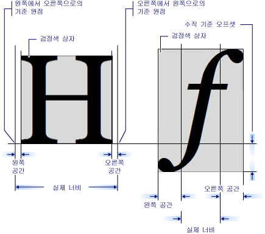

# GlyphRun 개체 및 Glyphs 요소 소개
이 항목에 설명 된 <xref:System.Windows.Media.GlyphRun> 개체 및 <xref:System.Windows.Documents.Glyphs> 요소입니다.  
  
  
   
## GlyphRun 소개  
 [!INCLUDE[TLA#tla_winclient](../../../../includes/tlasharptla-winclient-md.md)] 에 대 한 직접 액세스를 사용 하 여 문자 모양 수준의 태그를 포함 하 여 고급 텍스트 지원 <xref:System.Windows.Documents.Glyphs> 가로채 고 텍스트를 포맷 한 후 유지 하려는 고객에 대 한 합니다. 이러한 기능을 통해 다음과 같은 각 시나리오의 다양한 텍스트 렌더링 요구 사항을 충족시킬 수 있습니다.  
  
1.  고정된 형식 문서의 화면 표시  
  
2.  인쇄 시나리오  
  
    -   장치 프린터 언어로서의 [!INCLUDE[TLA#tla_xaml](../../../../includes/tlasharptla-xaml-md.md)]  
  
    -   [!INCLUDE[TLA#tla_mxdw](../../../../includes/tlasharptla-mxdw-md.md)].  
  
    -   이전 프린터 드라이버, [!INCLUDE[TLA#tla_win32](../../../../includes/tlasharptla-win32-md.md)] 응용 프로그램에서 고정된 형식으로의 출력  
  
    -   인쇄 스풀 형식  
  
3.  이전 버전의 [!INCLUDE[TLA#tla_mswin](../../../../includes/tlasharptla-mswin-md.md)] 및 기타 컴퓨팅 장치에 대한 클라이언트를 포함하는 고정된 형식 문서 표시  
  
> [!NOTE]
>  <xref:System.Windows.Documents.Glyphs> 및 <xref:System.Windows.Media.GlyphRun> 고정 형식의 문서 표시 및 인쇄 시나리오에 대 한 설계 합니다. [!INCLUDE[TLA#tla_winclient](../../../../includes/tlasharptla-winclient-md.md)] 일반 레이아웃에 대 한 여러 요소를 제공 하 고 [!INCLUDE[TLA#tla_ui](../../../../includes/tlasharptla-ui-md.md)] 시나리오와 같은 <xref:System.Windows.Controls.Label> 및 <xref:System.Windows.Controls.TextBlock>합니다. 레이아웃 및 [!INCLUDE[TLA2#tla_ui](../../../../includes/tla2sharptla-ui-md.md)] 시나리오에 대한 자세한 내용은 [WPF의 입력 체계](../../../../docs/framework/wpf/advanced/typography-in-wpf.md)를 참조하세요.  
  
   
## GlyphRun 개체  
 <xref:System.Windows.Media.GlyphRun> 개체에서 단일 크기와 단일 렌더링 스타일이 단일 글꼴의 있는 일련의 문자를 나타냅니다.  
  
 <xref:System.Windows.Media.GlyphRun> 문자 모양 등의 글꼴 정보가 모두 포함 <xref:System.Windows.Documents.Glyphs.Indices%2A> 및 개별 문자 모양 위치입니다. 또한 원래 포함 [!INCLUDE[TLA#tla_unicode](../../../../includes/tlasharptla-unicode-md.md)] 코드 포인트를 문자 문자 모양 버퍼 오프셋된 매핑 정보와 및 문자별 플래그에서 생성 된 합니다.  
  
 <xref:System.Windows.Media.GlyphRun> 해당 상위 수준 <xref:System.Windows.FrameworkElement>, <xref:System.Windows.Documents.Glyphs>합니다. <xref:System.Windows.Documents.Glyphs> 요소 트리 및 사용할 수 있습니다 [!INCLUDE[TLA2#tla_xaml](../../../../includes/tla2sharptla-xaml-md.md)] 나타내는 태그를 <xref:System.Windows.Media.GlyphRun> 출력 합니다.  
  
   
## 문자 모양 요소  
 <xref:System.Windows.Documents.Glyphs> 요소 출력의 나타냅니다는 <xref:System.Windows.Media.GlyphRun> 에서 [!INCLUDE[TLA2#tla_xaml](../../../../includes/tla2sharptla-xaml-md.md)]합니다. 다음 태그 구문 기술에 사용 되는 <xref:System.Windows.Documents.Glyphs> 요소입니다.  
  
 [!code-xaml[GlyphsOvwSample1#1](../../../../samples/snippets/csharp/VS_Snippets_Wpf/GlyphsOvwSample1/CS/default.xaml#1)]  
  
 다음 속성 정의는 샘플 태그의 처음 네 특성에 해당합니다.  
  
|속성|설명|  
|--------------|-----------------|  
|<xref:System.Windows.Documents.Glyphs.FontUri%2A>|리소스 식별자를 지정 합니다: 파일 이름, 웹 [!INCLUDE[TLA#tla_uri](../../../../includes/tlasharptla-uri-md.md)], 또는 응용 프로그램.exe 또는 컨테이너의 리소스 참조 합니다.|  
|<xref:System.Windows.Documents.Glyphs.FontRenderingEmSize%2A>|글꼴 크기를 그리기 화면 단위로 지정합니다(기본값은 .96인치).|  
|<xref:System.Windows.Documents.Glyphs.StyleSimulations%2A>|굵게 및 기울임꼴 스타일에 대한 플래그를 지정합니다.|  
|<xref:System.Windows.Documents.Glyphs.BidiLevel%2A>|양방향 레이아웃 수준을 지정합니다. 짝수 및 0 값은 왼쪽에서 오른쪽 레이아웃을 나타내며, 홀수 값은 오른쪽에서 왼쪽 레이아웃을 나타냅니다.|  
  
   
### Indices 속성  
 <xref:System.Windows.Documents.Glyphs.Indices%2A> 속성은 문자 모양 사양의 문자열입니다. 문자 모양의 시퀀스가 단일 클러스터를 구성하는 경우 클러스터 첫 번째 문자 모양의 사양 앞에 문자 모양의 개수와 클러스터를 구성하는 코드 포인트 수에 대한 사양이 있습니다. <xref:System.Windows.Documents.Glyphs.Indices%2A> 속성은 다음과 같은 속성이 하나의 문자열에서 수집 합니다.  
  
-   문자 모양 인덱스  
  
-   문자 모양의 사전 너비  
  
-   문자 모양 첨부 벡터 조합  
  
-   코드 포인트에서 문자 모양으로 클러스터 매핑  
  
-   문자 모양 플래그  
  
 각 문자 모양 사양에는 다음 형식이 있습니다.  
  
 `[GlyphIndex][,[Advance][,[uOffset][,[vOffset][,[Flags]]]]]`  
  
   
## 문자 모양 메트릭  
 각 문자 모양을 다른 맞추는 방법을 지정 하는 메트릭을 정의 <xref:System.Windows.Documents.Glyphs>합니다. 다음 그래픽에서는 서로 다른 두 문자 모양 문자의 다양한 입력 체계의 품질을 정의합니다.  
  
   
  
   
## 문자 모양 태그  
 다음 코드 예제에서는 다양 한 속성을 사용 하는 방법을 보여 줍니다.는 <xref:System.Windows.Documents.Glyphs> 요소 [!INCLUDE[TLA2#tla_xaml](../../../../includes/tla2sharptla-xaml-md.md)]합니다.  
  
 [!code-xaml[GlyphsOvwSamp2#1](../../../../samples/snippets/csharp/VS_Snippets_Wpf/GlyphsOvwSamp2/CS/default.xaml#1)]  
  
## 참고 항목  
 [WPF의 입력 체계](../../../../docs/framework/wpf/advanced/typography-in-wpf.md)  
 [WPF의 문서](../../../../docs/framework/wpf/advanced/documents-in-wpf.md)  
 [텍스트](../../../../docs/framework/wpf/advanced/optimizing-performance-text.md)
