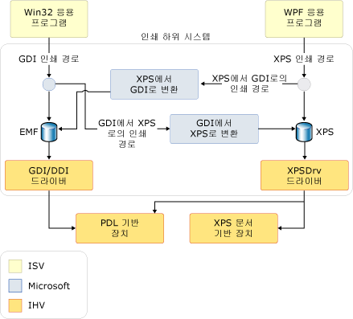

# 인쇄 개요
[!INCLUDE[TLA#tla_winfx](../../../../includes/tlasharptla-winfx-md.md)]에서 [!INCLUDE[TLA#tla_wpf](../../../../includes/tlasharptla-wpf-md.md)]를 사용하는 응용 프로그램 개발자는 새로운 풍부한 인쇄 및 인쇄 시스템 관리 집합 [!INCLUDE[TLA#tla_api#plural](../../../../includes/tlasharptla-apisharpplural-md.md)]를 이용할 수 있습니다.  [!INCLUDE[TLA#tla_winvista](../../../../includes/tlasharptla-winvista-md.md)]에서는 [!INCLUDE[TLA#tla_winforms](../../../../includes/tlasharptla-winforms-md.md)] 응용 프로그램을 만드는 개발자와 비관리 코드를 사용하는 개발자도 이러한 인쇄 시스템 향상 기능을 일부 사용할 수 있습니다.  이 새로운 기능의 핵심은 새 [!INCLUDE[TLA#tla_xps](../../../../includes/tlasharptla-xps-md.md)] 파일 형식과 [!INCLUDE[TLA2#tla_xps](../../../../includes/tla2sharptla-xps-md.md)] 인쇄 경로입니다.  
  
 이 항목에는 다음과 같은 섹션이 포함되어 있습니다.  
  
   
-   [XPS 정보](#introduction_to_XPS)  
  
-   [XPS 인쇄 경로](#XPS_print_path_intro)  
  
-   [GDI 인쇄 경로](#GDI_Print_Path_intro)  
  
-   [XPSDrv 드라이버 모델](#XPS_Driver_Model_intro)  
  
-   [관련 항목](#seeAlso_Toggle)  
  
   
## XPS 정보  
 [!INCLUDE[TLA2#tla_metro](../../../../includes/tla2sharptla-metro-md.md)]는 전자 문서 형식, 스풀 파일 형식 및 페이지 설명 언어입니다.  [!INCLUDE[TLA#tla_xml](../../../../includes/tlasharptla-xml-md.md)], [!INCLUDE[TLA#tla_opc](../../../../includes/tlasharptla-opc-md.md)] 및 기타 산업 표준을 사용하여 플랫폼 간 문서를 만드는 공개 문서 형식입니다.  [!INCLUDE[TLA2#tla_metro](../../../../includes/tla2sharptla-metro-md.md)]는 디지털 문서를 생성, 공유, 인쇄, 표시 및 보관하는 프로세스를 간소화합니다.  [!INCLUDE[TLA2#tla_metro](../../../../includes/tla2sharptla-metro-md.md)]에 대한 자세한 내용은 [XPS 웹사이트](http://www.microsoft.com/xps)\(영문\)를 참조하세요.  
  
 [!INCLUDE[TLA2#tla_wpf](../../../../includes/tla2sharptla-wpf-md.md)]를 사용하여 [!INCLUDE[TLA2#tla_metro](../../../../includes/tla2sharptla-metro-md.md)] 기반 콘텐츠를 인쇄하는 여러 가지 기술은 [프로그래밍 방식으로 XPS 파일 인쇄](../../../../docs/framework/wpf/advanced/how-to-programmatically-print-xps-files.md)에서 보여 줍니다.  이 항목에 포함된 내용을 검토하는 동안 이러한 예제를 참조하는 것이 유용할 수도 있습니다. 비관리 코드 개발자는 *Microsoft XPS 문서 변환기 프린터 이스케이프*에 대한 도움말을 참조해야 합니다.  [!INCLUDE[TLA2#tla_winforms#initcap](../../../../includes/tla2sharptla-winformssharpinitcap-md.md)] 개발자는 전체 [!INCLUDE[TLA2#tla_xps](../../../../includes/tla2sharptla-xps-md.md)] 인쇄 경로는 지원하지 않지만 하이브리드 GDI\-XPS 인쇄 경로를 지원하는 <xref:System.Drawing.Printing> 네임스페이스의 [!INCLUDE[TLA2#tla_api](../../../../includes/tla2sharptla-api-md.md)]를 사용해야 합니다.  아래의 **인쇄 경로 아키텍처**를 참조하세요.  
  
   
## XPS 인쇄 경로  
 [!INCLUDE[TLA#tla_metro](../../../../includes/tlasharptla-metro-md.md)] 인쇄 경로는 [!INCLUDE[TLA2#tla_mswin](../../../../includes/tla2sharptla-mswin-md.md)] 응용 프로그램에서 인쇄를 처리하는 방법을 다시 정의하는 새로운 [!INCLUDE[TLA#tla_mswin](../../../../includes/tlasharptla-mswin-md.md)] 기능입니다.  [!INCLUDE[TLA2#tla_xps](../../../../includes/tla2sharptla-xps-md.md)]는 문서 표시 언어\(예: RTF\), 인쇄 스풀러 형식\(예: WMF\) 및 페이지 설명 언어\(예: PCL 또는 포스트스크립트\)를 대체할 수 있습니다. 새로운 인쇄 경로는 인쇄 드라이버 또는 장치에서 응용 프로그램 게시부터 최종 처리까지 [!INCLUDE[TLA2#tla_metro](../../../../includes/tla2sharptla-metro-md.md)] 형식을 유지 관리합니다.  
  
 [!INCLUDE[TLA2#tla_metro](../../../../includes/tla2sharptla-metro-md.md)] 인쇄 경로는 [!INCLUDE[TLA#tla_wys](../../../../includes/tlasharptla-wys-md.md)] 인쇄, 향상된 색 지원, 향상된 인쇄 성능 등 개발자에게 여러 가지 혜택을 제공하는 [!INCLUDE[TLA2#tla_metro](../../../../includes/tla2sharptla-metro-md.md)] 프린터 드라이버 모델\(XPSDrv\)을 기반으로 합니다.  XPSDrv에 대한 자세한 내용은 [Windows 드라이버 개발 키트](http://msdn.microsoft.com/library/default.asp?url=/library/dnanchor/html/DeviceDriver.asp)를 참조하세요.  
  
 [!INCLUDE[TLA2#tla_metro](../../../../includes/tla2sharptla-metro-md.md)] 문서에 대한 인쇄 스풀러 작업은 기본적으로 이전 버전의 [!INCLUDE[TLA2#tla_mswin](../../../../includes/tla2sharptla-mswin-md.md)]와 동일합니다.  그러나 기존의 [!INCLUDE[TLA2#tla_gdi](../../../../includes/tla2sharptla-gdi-md.md)] 인쇄 경로뿐 아니라 [!INCLUDE[TLA2#tla_metro](../../../../includes/tla2sharptla-metro-md.md)] 인쇄 경로도 지원하도록 향상되었습니다.  새로운 인쇄 경로는 기본적으로 [!INCLUDE[TLA2#tla_metro](../../../../includes/tla2sharptla-metro-md.md)] 스풀 파일을 사용합니다.  이전 버전의 [!INCLUDE[TLA#tla_mswin](../../../../includes/tlasharptla-mswin-md.md)]용으로 작성된 사용자 모드 프린터 드라이버도 계속 작동하지만 [!INCLUDE[TLA2#tla_metro](../../../../includes/tla2sharptla-metro-md.md)] 인쇄 경로를 사용하려면 [!INCLUDE[TLA2#tla_metro](../../../../includes/tla2sharptla-metro-md.md)] 프린터 드라이버\(XPSDrv\)가 필요합니다.  
  
 [!INCLUDE[TLA2#tla_metro](../../../../includes/tla2sharptla-metro-md.md)] 인쇄 경로에는 다음과 같은 중요한 장점이 있습니다.  
  
-   [!INCLUDE[TLA2#tla_wys](../../../../includes/tla2sharptla-wys-md.md)] 인쇄 지원  
  
-   32bpc\(채널당 비트\), CMYK, 명명된 색, n\-잉크 및 투명도와 그라데이션 기본 지원을 포함하는 고급 색 프로필에 대한 기본 지원입니다.  
  
-   [!INCLUDE[TLA2#tla_winfx](../../../../includes/tla2sharptla-winfx-md.md)] 및 [!INCLUDE[TLA#tla_win32](../../../../includes/tlasharptla-win32-md.md)] 기반 응용 프로그램 둘 다에 대한 인쇄 성능 향상  
  
-   산업 표준 [!INCLUDE[TLA2#tla_metro](../../../../includes/tla2sharptla-metro-md.md)] 형식  
  
 기본 인쇄 시나리오에서는 사용자 인터페이스, 구성 및 작업 제출을 위한 단일 진입점으로 간단하고 직관적인 [!INCLUDE[TLA2#tla_api](../../../../includes/tla2sharptla-api-md.md)]를 사용할 수 있습니다.  고급 시나리오에서는 [!INCLUDE[TLA#tla_ui](../../../../includes/tlasharptla-ui-md.md)] 사용자 지정\(또는 [!INCLUDE[TLA2#tla_ui](../../../../includes/tla2sharptla-ui-md.md)] 없음\), 동기 또는 비동기 인쇄 및 일괄 처리 인쇄 기능을 위한 추가 지원이 추가됩니다.  두 옵션 모두 완전 신뢰 또는 부분 신뢰 모드로 인쇄 지원을 제공합니다.  
  
 [!INCLUDE[TLA2#tla_metro](../../../../includes/tla2sharptla-metro-md.md)]는 확장성을 염두에 두고 설계되었습니다.  확장성 프레임워크를 사용하여 모듈형 방식으로 [!INCLUDE[TLA2#tla_metro](../../../../includes/tla2sharptla-metro-md.md)]에 기능 및 특성을 추가할 수 있습니다.  확장성 기능은 다음과 같습니다.  
  
-   인쇄 스키마.  공용 스키마는 정기적으로 업데이트되며 장치 기능을 빠르게 확장할 수 있게 해줍니다.  아래의 **PrintTicket 및 PrintCapabilities**를 참조하세요.  
  
-   확장 가능한 필터 파이프라인.  [!INCLUDE[TLA2#tla_metro](../../../../includes/tla2sharptla-metro-md.md)] 프린터 드라이버\(XPSDrv\) 필터 파이프라인은 [!INCLUDE[TLA2#tla_metro](../../../../includes/tla2sharptla-metro-md.md)] 문서의 직접 인쇄와 확장 가능한 인쇄를 둘 다 사용할 수 있도록 설계되었습니다.  [Windows 드라이버 개발 키트](http://msdn.microsoft.com/library/default.asp?url=/library/dnanchor/html/DeviceDriver.asp)의 “XPSDrv"를 참조하세요.  
  
### 인쇄 경로 아키텍처  
 [!INCLUDE[TLA2#tla_win32](../../../../includes/tla2sharptla-win32-md.md)] 및 [!INCLUDE[TLA2#tla_winfx](../../../../includes/tla2sharptla-winfx-md.md)] 응용 프로그램은 [!INCLUDE[TLA2#tla_metro](../../../../includes/tla2sharptla-metro-md.md)]를 지원하는 반면, [!INCLUDE[TLA2#tla_win32](../../../../includes/tla2sharptla-win32-md.md)] 및 [!INCLUDE[TLA2#tla_winforms](../../../../includes/tla2sharptla-winforms-md.md)] 응용 프로그램은 [!INCLUDE[TLA2#tla_metro](../../../../includes/tla2sharptla-metro-md.md)] 프린터 드라이버\(XPSDrv\)용 [!INCLUDE[TLA2#tla_metro](../../../../includes/tla2sharptla-metro-md.md)] 형식 콘텐츠를 만들기 위해 [!INCLUDE[TLA2#tla_gdi](../../../../includes/tla2sharptla-gdi-md.md)]\-[!INCLUDE[TLA2#tla_metro](../../../../includes/tla2sharptla-metro-md.md)] 변환을 사용합니다.  이러한 응용 프로그램은 [!INCLUDE[TLA2#tla_metro](../../../../includes/tla2sharptla-metro-md.md)] 인쇄 경로를 사용할 필요가 없으며 [!INCLUDE[TLA#tla_emf](../../../../includes/tlasharptla-emf-md.md)] 기반 인쇄를 계속 사용할 수 있습니다.  그러나 대부분의 [!INCLUDE[TLA2#tla_metro](../../../../includes/tla2sharptla-metro-md.md)] 기능과 향상된 기능은 [!INCLUDE[TLA2#tla_metro](../../../../includes/tla2sharptla-metro-md.md)] 인쇄 경로를 대상으로 하는 응용 프로그램만 사용할 수 있습니다.  
  
 [!INCLUDE[TLA2#tla_win32](../../../../includes/tla2sharptla-win32-md.md)] 및 [!INCLUDE[TLA2#tla_winforms](../../../../includes/tla2sharptla-winforms-md.md)] 응용 프로그램에서 XPSDrv 기반 프린터를 사용할 수 있도록 [!INCLUDE[TLA2#tla_metro](../../../../includes/tla2sharptla-metro-md.md)] 프린터 드라이버\(XPSDrv\)는 [!INCLUDE[TLA2#tla_gdi](../../../../includes/tla2sharptla-gdi-md.md)]\-[!INCLUDE[TLA2#tla_metro](../../../../includes/tla2sharptla-metro-md.md)] 형식 변환을 지원합니다. XPSDrv 모델은 [!INCLUDE[TLA2#tla_win32](../../../../includes/tla2sharptla-win32-md.md)] 응용 프로그램에서 [!INCLUDE[TLA2#tla_xps](../../../../includes/tla2sharptla-xps-md.md)] 문서를 인쇄할 수 있도록 [!INCLUDE[TLA2#tla_metro](../../../../includes/tla2sharptla-metro-md.md)]\-[!INCLUDE[TLA2#tla_gdi](../../../../includes/tla2sharptla-gdi-md.md)] 형식 변환기도 제공합니다.  [!INCLUDE[TLA2#tla_wpf](../../../../includes/tla2sharptla-wpf-md.md)] 응용 프로그램의 경우 쓰기 작업의 대상 인쇄 대기열에 XPSDrv 드라이버가 없을 때마다 <xref:System.Windows.Xps.XpsDocumentWriter> 클래스의 <xref:System.Windows.Xps.XpsDocumentWriter.Write%2A> 및 <xref:System.Windows.Xps.XpsDocumentWriter.WriteAsync%2A> 메서드에 의해 자동으로 [!INCLUDE[TLA2#tla_metro](../../../../includes/tla2sharptla-metro-md.md)]\-[!INCLUDE[TLA2#tla_gdi](../../../../includes/tla2sharptla-gdi-md.md)] 형식 변환이 수행됩니다. [!INCLUDE[TLA2#tla_winforms#initcap](../../../../includes/tla2sharptla-winformssharpinitcap-md.md)] 응용 프로그램은 [!INCLUDE[TLA2#tla_xps](../../../../includes/tla2sharptla-xps-md.md)] 문서를 인쇄할 수 없습니다.  
  
 다음 그림에서는 인쇄 하위 시스템을 보여 주며 [!INCLUDE[TLA#tla_ms](../../../../includes/tlasharptla-ms-md.md)]에서 제공하는 부분과 소프트웨어 및 하드웨어 공급업체에서 정의되는 부분을 정의합니다.  
  
   
  
### 기본 XPS 인쇄  
 [!INCLUDE[TLA2#tla_wpf](../../../../includes/tla2sharptla-wpf-md.md)]는 기본 및 고급 [!INCLUDE[TLA#tla_api](../../../../includes/tlasharptla-api-md.md)]를 둘 다 정의합니다.  광범위한 인쇄 사용자 지정이나 전체 [!INCLUDE[TLA2#tla_metro](../../../../includes/tla2sharptla-metro-md.md)] 기능 집합에 대한 액세스가 필요하지 않은 응용 프로그램의 경우 기본 인쇄 지원을 사용할 수 있습니다.  기본 인쇄 지원은 최소한의 구성이 필요하며 익숙한 [!INCLUDE[TLA2#tla_ui](../../../../includes/tla2sharptla-ui-md.md)]를 제공하는 인쇄 대화 상자 컨트롤을 통해 노출됩니다.  이 간소화된 인쇄 모델을 통해 많은 [!INCLUDE[TLA2#tla_metro](../../../../includes/tla2sharptla-metro-md.md)] 기능을 사용할 수 있습니다.  
  
#### PrintDialog  
 <xref:System.Windows.Controls.PrintDialog?displayProperty=fullName> 컨트롤은 [!INCLUDE[TLA2#tla_ui](../../../../includes/tla2sharptla-ui-md.md)], 구성 및 [!INCLUDE[TLA2#tla_metro](../../../../includes/tla2sharptla-metro-md.md)] 작업 제출을 위한 단일 진입점을 제공합니다.  컨트롤을 인스턴스화하고 사용하는 방법에 대한 자세한 내용은 [인쇄 대화 상자 호출](../../../../docs/framework/wpf/advanced/how-to-invoke-a-print-dialog.md)을 참조하세요.  
  
### 고급 XPS 인쇄  
 [!INCLUDE[TLA2#tla_metro](../../../../includes/tla2sharptla-metro-md.md)] 기능의 전체 집합에 액세스하려면 고급 인쇄 [!INCLUDE[TLA2#tla_api](../../../../includes/tla2sharptla-api-md.md)]를 사용해야 합니다.  아래에서는 여러 관련 [!INCLUDE[TLA2#tla_api](../../../../includes/tla2sharptla-api-md.md)]에 대해 자세히 설명합니다.  [!INCLUDE[TLA2#tla_metro](../../../../includes/tla2sharptla-metro-md.md)] 인쇄 경로 [!INCLUDE[TLA2#tla_api#plural](../../../../includes/tla2sharptla-apisharpplural-md.md)]의 전체 목록은 <xref:System.Windows.Xps> 및 <xref:System.Printing> 네임스페이스 참조를 참조하세요.  
  
#### PrintTicket 및 PrintCapabilities  
 <xref:System.Printing.PrintTicket> 및 <xref:System.Printing.PrintCapabilities> 클래스는 고급 [!INCLUDE[TLA2#tla_metro](../../../../includes/tla2sharptla-metro-md.md)] 기능의 기초가 됩니다.  두 유형의 개체는 모두 데이터 정렬, 양면 인쇄, 스테이플링 등과 같은 인쇄 지향 기능의 [!INCLUDE[TLA#tla_xml](../../../../includes/tlasharptla-xml-md.md)] 형식 구조체입니다.  이러한 구조체는 인쇄 스키마에서 정의됩니다.  <xref:System.Printing.PrintTicket>은 인쇄 작업을 처리하는 방법을 프린터에 지시합니다.  <xref:System.Printing.PrintCapabilities> 클래스는 프린터 기능을 정의합니다.  프린터 기능 쿼리를 통해 프린터에서 지원하는 기능을 완전히 활용하는 <xref:System.Printing.PrintTicket>을 만들 수 있습니다.  마찬가지로, 지원되지 않는 기능을 방지할 수 있습니다.  
  
 다음 예제에서는 코드를 사용하여 프린터의 <xref:System.Printing.PrintCapabilities>를 쿼리하고 <xref:System.Printing.PrintTicket>을 만드는 방법을 보여 줍니다.  
  
 [!code-cpp[xpscreate#PrinterCapabilities](../../../../samples/snippets/cpp/VS_Snippets_Wpf/XpsCreate/CPP/XpsCreate.cpp#printercapabilities)]
 [!code-csharp[xpscreate#PrinterCapabilities](../../../../samples/snippets/csharp/VS_Snippets_Wpf/XpsCreate/CSharp/XpsCreate.cs#printercapabilities)]
 [!code-vb[xpscreate#PrinterCapabilities](../../../../samples/snippets/visualbasic/VS_Snippets_Wpf/XpsCreate/visualbasic/xpscreate.vb#printercapabilities)]  
  
#### PrintServer 및 PrintQueue  
 <xref:System.Printing.PrintServer> 클래스는 네트워크 인쇄 서버를 나타내고 <xref:System.Printing.PrintQueue> 클래스는 프린터 및 프린터와 연결된 출력 작업 큐를 나타냅니다.  이러한 [!INCLUDE[TLA2#tla_api#plural](../../../../includes/tla2sharptla-apisharpplural-md.md)]를 함께 사용하여 서버 인쇄 작업의 고급 관리를 수행할 수 있습니다.  <xref:System.Printing.PrintServer> 또는 해당 파생 클래스 중 하나는 <xref:System.Printing.PrintQueue>를 관리하는 데 사용됩니다.  <xref:System.Printing.PrintQueue.AddJob%2A> 메서드는 새 인쇄 작업을 대기열에 삽입하는 데 사용됩니다.  
  
 다음 예제에서는 코드를 사용하여 <xref:System.Printing.LocalPrintServer>를 만들고 기본 <xref:System.Printing.PrintQueue>에 액세스하는 방법을 보여 줍니다.  
  
 [!code-csharp[xpsprint#PrintQueueSnip](../../../../samples/snippets/csharp/VS_Snippets_Wpf/XpsPrint/CSharp/XpsPrintHelper.cs#printqueuesnip)]
 [!code-vb[xpsprint#PrintQueueSnip](../../../../samples/snippets/visualbasic/VS_Snippets_Wpf/XpsPrint/visualbasic/xpsprinthelper.vb#printqueuesnip)]  
  
#### XpsDocumentWriter  
 많은 <xref:System.Windows.Xps.XpsDocumentWriter.Write%2A> 및 <xref:System.Windows.Xps.XpsDocumentWriter.WriteAsync%2A> 메서드와 더불어 <xref:System.Windows.Xps.XpsDocumentWriter>는 [!INCLUDE[TLA2#tla_metro](../../../../includes/tla2sharptla-metro-md.md)] 문서를 <xref:System.Printing.PrintQueue>에 쓰는 데 사용됩니다.  예를 들어 <xref:System.Windows.Xps.XpsDocumentWriter.Write%28System.Windows.Documents.FixedPage%2CSystem.Printing.PrintTicket%29> 메서드는 [!INCLUDE[TLA2#tla_metro](../../../../includes/tla2sharptla-metro-md.md)] 문서와 <xref:System.Printing.PrintTicket>을 동기적으로 출력하는 데 사용됩니다.  <xref:System.Windows.Xps.XpsDocumentWriter.WriteAsync%28System.Windows.Documents.FixedDocument%2CSystem.Printing.PrintTicket%29> 메서드는 [!INCLUDE[TLA2#tla_metro](../../../../includes/tla2sharptla-metro-md.md)] 문서와 <xref:System.Printing.PrintTicket>을 비동기적으로 출력하는 데 사용됩니다.  
  
 다음 예제에서는 코드를 사용하여 <xref:System.Windows.Xps.XpsDocumentWriter>를 만드는 방법을 보여 줍니다.  
  
 [!code-csharp[XpsPrint#PrintQueueSnip](../../../../samples/snippets/csharp/VS_Snippets_Wpf/XpsPrint/CSharp/XpsPrintHelper.cs#printqueuesnip)]
 [!code-vb[XpsPrint#PrintQueueSnip](../../../../samples/snippets/visualbasic/VS_Snippets_Wpf/XpsPrint/visualbasic/xpsprinthelper.vb#printqueuesnip)]  
  
 <xref:System.Printing.PrintQueue.AddJob%2A> 메서드는 다양한 인쇄 방법도 제공합니다.  자세한 내용은 [프로그래밍 방식으로 XPS 파일 인쇄](../../../../docs/framework/wpf/advanced/how-to-programmatically-print-xps-files.md)를  참조하세요.  
  
   
## GDI 인쇄 경로  
 [!INCLUDE[TLA2#tla_wpf](../../../../includes/tla2sharptla-wpf-md.md)] 응용 프로그램은 기본적으로 [!INCLUDE[TLA2#tla_metro](../../../../includes/tla2sharptla-metro-md.md)] 인쇄 경로를 지원하지만 [!INCLUDE[TLA2#tla_win32](../../../../includes/tla2sharptla-win32-md.md)] 및 [!INCLUDE[TLA2#tla_winforms](../../../../includes/tla2sharptla-winforms-md.md)] 응용 프로그램도 일부 [!INCLUDE[TLA2#tla_metro](../../../../includes/tla2sharptla-metro-md.md)] 기능을 이용할 수 있습니다.  [!INCLUDE[TLA2#tla_metro](../../../../includes/tla2sharptla-metro-md.md)] 프린터 드라이버\(XPSDrv\)는 [!INCLUDE[TLA2#tla_gdi](../../../../includes/tla2sharptla-gdi-md.md)] 기반 출력을 [!INCLUDE[TLA2#tla_metro](../../../../includes/tla2sharptla-metro-md.md)] 형식으로 변환할 수 있습니다.  고급 시나리오에서는 [Microsoft XPS 문서 변환기 프린터 이스케이프](_win32_MXDC_ESCAPE)를 통해 콘텐츠의 사용자 지정 변환이 지원됩니다.  마찬가지로, [!INCLUDE[TLA2#tla_wpf](../../../../includes/tla2sharptla-wpf-md.md)] 응용 프로그램도 <xref:System.Windows.Xps.XpsDocumentWriter> 클래스의 <xref:System.Windows.Xps.XpsDocumentWriter.Write%2A> 또는 <xref:System.Windows.Xps.XpsDocumentWriter.WriteAsync%2A> 메서드 중 하나를 호출하고 비 XpsDrv 프린터를 대상 인쇄 대기열로 지정하여 [!INCLUDE[TLA2#tla_gdi](../../../../includes/tla2sharptla-gdi-md.md)] 인쇄 경로에 출력할 수 있습니다.  
  
 [!INCLUDE[TLA2#tla_metro](../../../../includes/tla2sharptla-metro-md.md)] 기능이나 지원이 필요하지 않은 응용 프로그램의 경우 현재 [!INCLUDE[TLA2#tla_gdi](../../../../includes/tla2sharptla-gdi-md.md)] 인쇄 경로가 변경되지 않고 유지됩니다.  
  
-   [!INCLUDE[TLA2#tla_gdi](../../../../includes/tla2sharptla-gdi-md.md)] 인쇄 경로 및 다양한 [!INCLUDE[TLA2#tla_metro](../../../../includes/tla2sharptla-metro-md.md)] 변환 옵션에 대한 추가 참조 자료는 [Microsoft XPS 문서 변환기 프린터 이스케이프](_win32_MXDC_ESCAPE) 및 [Windows 드라이버 개발 키트](http://msdn.microsoft.com/library/default.asp?url=/library/dnanchor/html/DeviceDriver.asp)의 "XPSDrv"를 참조하세요.  
  
   
## XPSDrv 드라이버 모델  
 [!INCLUDE[TLA2#tla_metro](../../../../includes/tla2sharptla-metro-md.md)] 인쇄 경로는 [!INCLUDE[TLA2#tla_metro](../../../../includes/tla2sharptla-metro-md.md)] 사용 프린터 또는 드라이버에 인쇄할 때 [!INCLUDE[TLA2#tla_metro](../../../../includes/tla2sharptla-metro-md.md)]를 기본 인쇄 스풀 형식으로 사용하여 스풀러 효율성을 향상시킵니다.  간소화된 스풀링 프로세스에서는 문서가 스풀링되기 전에 [!INCLUDE[TLA2#tla_emf](../../../../includes/tla2sharptla-emf-md.md)] 데이터 파일과 같은 중간 스풀 파일을 생성할 필요가 없습니다.  작은 스풀 파일 크기를 통해 [!INCLUDE[TLA2#tla_metro](../../../../includes/tla2sharptla-metro-md.md)] 인쇄 경로는 네트워크 트래픽을 줄이고 인쇄 성능을 향상시킬 수 있습니다.  
  
 [!INCLUDE[TLA2#tla_emf](../../../../includes/tla2sharptla-emf-md.md)]는 응용 프로그램 출력을 렌더링 서비스에 대한 일련의 [!INCLUDE[TLA2#tla_gdi](../../../../includes/tla2sharptla-gdi-md.md)] 호출로 나타내는 닫힌 형식입니다.  [!INCLUDE[TLA2#tla_emf](../../../../includes/tla2sharptla-emf-md.md)]와 달리 [!INCLUDE[TLA2#tla_metro](../../../../includes/tla2sharptla-metro-md.md)] 스풀 형식은 [!INCLUDE[TLA2#tla_metro](../../../../includes/tla2sharptla-metro-md.md)] 기반 프린터 드라이버\(XPSDrv\)에 출력할 때 추가 해석을 요구하지 않고 실제 문서를 나타냅니다.  드라이버가 형식의 데이터에 대해 직접 작동할 수 있습니다.  이 기능은 [!INCLUDE[TLA2#tla_emf](../../../../includes/tla2sharptla-emf-md.md)] 파일과 [!INCLUDE[TLA2#tla_gdi](../../../../includes/tla2sharptla-gdi-md.md)] 기반 인쇄 드라이버를 사용할 때 필요한 데이터 및 색 공간 변환을 제거합니다.  
  
 일반적으로 [!INCLUDE[TLA2#tla_metro](../../../../includes/tla2sharptla-metro-md.md)] 프린터 드라이버\(XPSDrv\)를 대상으로 하는 [!INCLUDE[TLA2#tla_metro](../../../../includes/tla2sharptla-metro-md.md)] 문서를 사용하는 경우 해당 [!INCLUDE[TLA2#tla_emf](../../../../includes/tla2sharptla-emf-md.md)]에 비해 스풀 파일 크기가 감소하지만 다음과 같은 예외도 있습니다.  
  
-   매우 복잡하거나 다중 계층이거나 비효율적으로 작성된 벡터 그래픽은 동일한 그래픽의 비트맵 버전보다 클 수 있습니다.  
  
-   화면 표시를 위해 XPS 파일은 장치 글꼴과 컴퓨터 기반 글꼴을 포함하는 반면 GDI 스풀 파일은 장치 글꼴을 포함하지 않습니다.  그러나 두 종류의 글꼴은 모두 하위 집합으로 지정되며\(아래 참조\), 프린터 드라이버가 파일을 프린터로 전송하기 전에 장치 글꼴을 제거할 수 있습니다.  
  
 스풀 크기 감소는 다음과 같은 여러 메커니즘을 통해 수행됩니다.  
  
-   **글꼴 하위 집합 지정**.  실제 문서 내에서 사용되는 문자만 [!INCLUDE[TLA2#tla_metro](../../../../includes/tla2sharptla-metro-md.md)] 파일에 저장됩니다.  
  
-   **고급 그래픽 지원**.  투명도 및 그라데이션 기본 형식에 대한 기본 지원을 통해 [!INCLUDE[TLA2#tla_xps](../../../../includes/tla2sharptla-xps-md.md)] 문서에서 콘텐츠의 래스터화를 방지합니다.  
  
-   **공용 리소스 식별**.  여러 번 사용되는 리소스\(예: 회사 로고를 나타내는 이미지\)는 공유 리소스로 처리되며 한 번만 로드됩니다.  
  
-   **ZIP 압축**.  모든 [!INCLUDE[TLA2#tla_metro](../../../../includes/tla2sharptla-metro-md.md)] 문서가 ZIP 압축을 사용합니다.  
  
## 참고 항목  
 <xref:System.Windows.Controls.PrintDialog>   
 <xref:System.Windows.Xps.XpsDocumentWriter>   
 <xref:System.Windows.Xps.Packaging.XpsDocument>   
 <xref:System.Printing.PrintTicket>   
 <xref:System.Printing.PrintCapabilities>   
 <xref:System.Printing.PrintServer>   
 <xref:System.Printing.PrintQueue>   
 [방법 항목](../../../../docs/framework/wpf/advanced/printing-how-to-topics.md)   
 [WPF의 문서](../../../../docs/framework/wpf/advanced/documents-in-wpf.md)   
 [XPS](http://www.microsoft.com/xps)   
 [문서 serialization 및 저장소](../../../../docs/framework/wpf/advanced/document-serialization-and-storage.md)   
 [Microsoft XPS 문서 변환기 프린터 이스케이프](_win32_MXDC_ESCAPE)