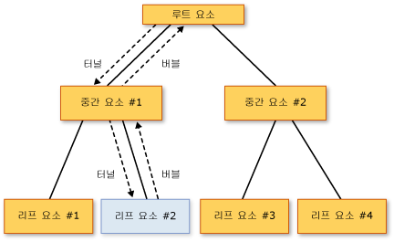

# 라우트된 이벤트 개요
이 항목에서는 [!INCLUDE[TLA#tla_winclient](../../../../includes/tlasharptla-winclient-md.md)]의 라우트된 이벤트 개념에 대해 설명합니다.  이 항목에서는 먼저 라우트된 이벤트의 의미를 정의한 다음 라우트된 이벤트가 요소 트리를 통해 라우팅하는 방법에 대해 설명합니다. 그런 다음 라우트된 이벤트를 처리하는 방법에 대해 간단히 살펴보고 고유의 사용자 지정 라우트된 이벤트를 만드는 방법을 보여 줍니다.  
  
   
  
   
## 사전 요구 사항  
 이 항목에서는 사용자가 [!INCLUDE[TLA#tla_clr](../../../../includes/tlasharptla-clr-md.md)], 개체 지향 프로그래밍 및 [!INCLUDE[TLA2#tla_winclient](../../../../includes/tla2sharptla-winclient-md.md)] 요소 간의 관계를 트리로 개념화하는 것과 관련된 기본 사항을 잘 이해하고 있다고 가정합니다.  이 항목의 예제를 수행하려면 [!INCLUDE[TLA#tla_xaml](../../../../includes/tlasharptla-xaml-md.md)]에 대해서도 이해하고 있어야 하며 기본적인 [!INCLUDE[TLA2#tla_winclient](../../../../includes/tla2sharptla-winclient-md.md)] 응용 프로그램 또는 페이지를 작성하는 방법을 알고 있어야 합니다.  자세한 내용은 [연습: WPF 시작](../../../../docs/framework/wpf/getting-started/walkthrough-my-first-wpf-desktop-application.md) 및 [XAML 개요\(WPF\)](../../../../docs/framework/wpf/advanced/xaml-overview-wpf.md)를 참조하십시오.  
  
   
## 라우트된 이벤트의 정의  
 라우트된 이벤트의 정의를 내릴 때 기능 또는 구현의 측면에서 접근할 수 있습니다.  이 항목에서는 두 정의를 모두 제공하지만 어떤 정의가 도움이 되는지는 사용자에 따라 다를 수 있습니다.  
  
 먼저 기능 측면에서 정의하면 라우트된 이벤트란 이벤트를 발생시킨 특정 개체뿐 아니라 요소 트리의 여러 수신기에서 처리기를 호출할 수 있는 이벤트 형식입니다.  
  
 구현 측면에서 정의하면 [라우트된 이벤트](GTMT)는 <xref:System.Windows.RoutedEvent> 클래스 인스턴스의 지원을 받으며 [!INCLUDE[TLA#tla_winclient](../../../../includes/tlasharptla-winclient-md.md)] 이벤트 시스템에 의해 처리되는 [!INCLUDE[TLA2#tla_clr](../../../../includes/tla2sharptla-clr-md.md)] 이벤트입니다.  
  
 일반적인 [!INCLUDE[TLA2#tla_winclient](../../../../includes/tla2sharptla-winclient-md.md)] 응용 프로그램에는 많은 요소가 포함됩니다.  코드로 작성되었는지 또는 [!INCLUDE[TLA2#tla_xaml](../../../../includes/tla2sharptla-xaml-md.md)]로 선언되었는지에 관계없이 이러한 요소는 요소 트리 내에서 다른 요소와 관계를 이루며 존재합니다.  이벤트 경로는 이벤트 정의에 따라 두 방향 중 한 방향으로 이동할 수 있지만, 소스 요소에서 시작하여 요소 트리의 루트\(대개 페이지 또는 창\)에 도달할 때까지 요소 트리의 위쪽으로 "버블링"하는 것이 일반적입니다.  이전에 DHTML 개체 모델을 사용해 본 적이 있다면 이 버블링 개념이 생소하지 않을 것입니다.  
  
 다음과 같은 단순한 요소 트리가 있다고 가정해 보십시오.  
  
 [!code-xml[EventOvwSupport#GroupButton](../../../../samples/snippets/csharp/VS_Snippets_Wpf/EventOvwSupport/CSharp/default.xaml#groupbutton)]  
  
 이 요소 트리의 모양은 다음과 같습니다.  
  
   
  
 단순한 이 요소 트리에서 <xref:System.Windows.Controls.Primitives.ButtonBase.Click> 이벤트의 소스는 <xref:System.Windows.Controls.Button> 요소 중 하나이며 이러한 <xref:System.Windows.Controls.Button> 요소 중 어떤 것을 클릭하든 이벤트를 처리할 기회를 가지는 것은 첫 번째 요소입니다.  하지만 이벤트에 대해 작업을 수행할 처리기가 <xref:System.Windows.Controls.Button>에 연결되지 않은 경우에는 요소 트리에서 이벤트의 <xref:System.Windows.Controls.Button> 부모인 <xref:System.Windows.Controls.StackPanel>로 이벤트가 버블링됩니다.  이벤트가 <xref:System.Windows.Controls.Border>로 버블링된 다음 요소 트리의 페이지 루트로 갈 수도 있습니다\(표시되지 않음\).  
  
 즉, 이 <xref:System.Windows.Controls.Primitives.ButtonBase.Click> 이벤트의 이벤트 경로는 다음과 같습니다.  
  
 Button\-\-\>StackPanel\-\-\>Border\-\-\>...  
  
### 라우트된 이벤트에 대한 최상위 수준 시나리오  
 다음은 라우트된 이벤트라는 개념이 도입된 동기가 된 시나리오를 간단히 요약한 것으로, 일반적인 [!INCLUDE[TLA2#tla_clr](../../../../includes/tla2sharptla-clr-md.md)] 이벤트가 이러한 시나리오에 적합하지 않은 이유를 보여 줍니다.  
  
 **컨트롤 컴퍼지션 및 캡슐화:** [!INCLUDE[TLA2#tla_winclient](../../../../includes/tla2sharptla-winclient-md.md)]의 다양한 컨트롤에는 강력한 콘텐츠 모델이 사용됩니다.  예를 들어 <xref:System.Windows.Controls.Button> 내에 이미지를 배치하여 단추의 시각적 트리를 효과적으로 확장할 수 있습니다.  하지만 추가된 이미지는 단추가 해당 내용에 대한 <xref:System.Windows.Controls.Primitives.ButtonBase.Click>에 응답하도록 하는 적중 테스트 동작을 중단시키지 않아야 하며 이는 클릭한 대상이 기술적으로는 이미지에 포함된 픽셀인 경우에도 마찬가지입니다.  
  
 **단일 처리기 연결 지점:** [!INCLUDE[TLA#tla_winforms](../../../../includes/tlasharptla-winforms-md.md)]에서는 여러 요소에서 발생시킬 수 있는 이벤트를 처리하기 위해 같은 처리기를 여러 번 연결해야 합니다.  라우트된 이벤트를 사용할 경우 앞 예제와 같이 처리기를 한 번만 연결하면 됩니다. 또한 필요하면 처리기 논리를 사용하여 이벤트의 출처를 확인할 수 있습니다.  예를 들어 앞에 나온 [!INCLUDE[TLA2#tla_xaml](../../../../includes/tla2sharptla-xaml-md.md)]에 대한 처리기는 다음과 같습니다.  
  
 [!code-csharp[EventOvwSupport#GroupButtonCodeBehind](../../../../samples/snippets/csharp/VS_Snippets_Wpf/EventOvwSupport/CSharp/default.xaml.cs#groupbuttoncodebehind)]
 [!code-vb[EventOvwSupport#GroupButtonCodeBehind](../../../../samples/snippets/visualbasic/VS_Snippets_Wpf/EventOvwSupport/visualbasic/default.xaml.vb#groupbuttoncodebehind)]  
  
 **클래스 처리:** 라우트된 이벤트는 클래스를 통해 정의되는 정적 처리기를 허용합니다.  이 클래스 처리기는 연결된 인스턴스 처리기가 이벤트를 처리하기 전에 이벤트를 처리할 수 있는 기회를 가집니다.  
  
 **리플렉션이 없는 이벤트 참조:** 특정 코드 및 태그 기술에서는 특정 이벤트를 식별할 수 있는 방법을 필요로 합니다.  라우트된 이벤트는 이를 위한 식별자로 <xref:System.Windows.RoutedEvent> 필드를 만들어 정적 리플렉션 또는 런타임 리플렉션이 필요 없는 강력한 이벤트 식별 방법을 제공합니다.  
  
### 라우트된 이벤트의 구현 방법  
 [라우트된 이벤트](GTMT)는 <xref:System.Windows.RoutedEvent> 클래스 인스턴스의 지원을 받으며 [!INCLUDE[TLA2#tla_winclient](../../../../includes/tla2sharptla-winclient-md.md)] 이벤트 시스템에 등록되는 [!INCLUDE[TLA2#tla_clr](../../../../includes/tla2sharptla-clr-md.md)] 이벤트입니다.  등록에서 가져온 <xref:System.Windows.RoutedEvent> 인스턴스는 일반적으로 라우트된 이벤트를 등록하여 "소유하는" 클래스의 `public` `static` `readonly` 필드 멤버로 유지됩니다.  이 이름이 동일하게 지정된 [!INCLUDE[TLA2#tla_clr](../../../../includes/tla2sharptla-clr-md.md)] 이벤트\("래퍼" 이벤트\)에 연결하려면 [!INCLUDE[TLA2#tla_clr](../../../../includes/tla2sharptla-clr-md.md)] 이벤트에 대한 `add` 및 `remove` 구현을 재정의해야 합니다.  일반적으로 `add`와 `remove`는 암시적 기본값으로 남겨져 이벤트에 대한 처리기를 제거 및 추가하기 위한 적절한 언어별 이벤트 구문을 사용합니다.  라우트된 이벤트의 지원 및 연결 메커니즘은 [종속성 속성](GTMT)이 <xref:System.Windows.DependencyProperty> 클래스의 지원을 받으며 [!INCLUDE[TLA2#tla_winclient](../../../../includes/tla2sharptla-winclient-md.md)] 속성 시스템에 등록된 [!INCLUDE[TLA2#tla_clr](../../../../includes/tla2sharptla-clr-md.md)] 속성인 점과 개념적으로 비슷합니다.  
  
 다음 예제에서는 <xref:System.Windows.RoutedEvent> 식별자 필드의 등록과 노출, `Tap` [!INCLUDE[TLA2#tla_clr](../../../../includes/tla2sharptla-clr-md.md)] 이벤트에 대한 `add` 및 `remove` 구현을 비롯한 사용자 지정 라우트된 이벤트 `Tap`에 대한 선언을 보여 줍니다.  
  
 [!code-csharp[RoutedEventCustom#AddRemoveHandler](../../../../samples/snippets/csharp/VS_Snippets_Wpf/RoutedEventCustom/CSharp/SDKSampleLibrary/class1.cs#addremovehandler)]
 [!code-vb[RoutedEventCustom#AddRemoveHandler](../../../../samples/snippets/visualbasic/VS_Snippets_Wpf/RoutedEventCustom/VB/SDKSampleLibrary/Class1.vb#addremovehandler)]  
  
### 라우트된 이벤트 처리기 및 XAML  
 [!INCLUDE[TLA2#tla_xaml](../../../../includes/tla2sharptla-xaml-md.md)]을 사용하여 이벤트에 대한 처리기를 추가하려면 이벤트 수신기에 해당하는 요소에서 이벤트 이름을 특성으로 선언합니다.  이 특성 값은 구현한 처리기 메서드의 이름으로, 처리기 메서드는 코드 숨김 파일의 partial 클래스에 있어야 합니다.  
  
 [!code-xml[EventOvwSupport#SimplestSyntax](../../../../samples/snippets/csharp/VS_Snippets_Wpf/EventOvwSupport/CSharp/default.xaml#simplestsyntax)]  
  
 표준 [!INCLUDE[TLA2#tla_clr](../../../../includes/tla2sharptla-clr-md.md)] 이벤트 처리기를 추가하는 [!INCLUDE[TLA2#tla_xaml](../../../../includes/tla2sharptla-xaml-md.md)] 구문은 강력한 이벤트 처리기를 추가하는 구문과 같습니다. 이는 처리기를 추가하는 대상이 내부에 라우트된 이벤트가 구현된 [!INCLUDE[TLA2#tla_clr](../../../../includes/tla2sharptla-clr-md.md)] 이벤트 래퍼이기 때문입니다.  [!INCLUDE[TLA2#tla_xaml](../../../../includes/tla2sharptla-xaml-md.md)]로 이벤트 처리기를 추가하는 방법에 대한 자세한 내용은 [XAML 개요\(WPF\)](../../../../docs/framework/wpf/advanced/xaml-overview-wpf.md)를 참조하십시오.  
  
   
## 라우팅 전략  
 라우트된 이벤트는 다음과 같은 세 가지 라우팅 전략 중 하나를 사용합니다.  
  
-   **버블링:** 이벤트 소스의 이벤트 처리기가 호출됩니다.  그런 다음 라우트된 이벤트가 요소 트리 루트에 도달할 때까지 이후 부모 요소에 라우팅합니다.  대부분의 라우트된 이벤트는 버블링 라우팅 전략을 사용합니다.  버블링 라우트된 이벤트는 일반적으로 특정 컨트롤 또는 기타 UI 요소의 입력 또는 상태 변경을 보고하는 데 사용됩니다.  
  
-   **직접:** 이벤트에 응답하여 처리기를 호출할 수 있는 기회가 소스 요소 자체에만 부여됩니다.  이는 [!INCLUDE[TLA#tla_winforms](../../../../includes/tlasharptla-winforms-md.md)]의 이벤트 "라우팅" 방법과 비슷합니다.  하지만 표준 [!INCLUDE[TLA2#tla_clr](../../../../includes/tla2sharptla-clr-md.md)] 이벤트와 달리 직접 라우트된 이벤트는 클래스 처리를 지원하며 <xref:System.Windows.EventSetter> 및 <xref:System.Windows.EventTrigger>에서 사용할 수 있습니다. 클래스 처리에 대해서는 이후 단원에서 설명합니다.  
  
-   **터널링:** 처음에 요소 트리 루트의 이벤트 처리기가 호출됩니다.  그런 다음 라우트된 이벤트가 경로의 이후 자식 요소를 따라 라우트된 이벤트 소스\(라우트된 이벤트를 발생시킨 요소\)인 노드 요소를 향해 라우팅합니다.  터널링 라우트된 이벤트는 일반적으로 컨트롤 합성에 사용하거나 그 일부로 처리되어 합성 파트에서 온 이벤트는 의도적으로 표시하지 않거나 전체 컨트롤에 고유한 이벤트로 대체됩니다.  [!INCLUDE[TLA2#tla_winclient](../../../../includes/tla2sharptla-winclient-md.md)]에서 제공하는 입력 이벤트는 대개 터널링\/버블링 쌍으로 구현되어 있습니다.  터널링\/버블링 쌍에 사용되는 명명 규칙 때문에 터널링 이벤트를 미리 보기 이벤트라고도 합니다.  
  
   
## 라우트된 이벤트를 사용하는 이유  
 응용 프로그램 개발자는 자신이 처리하는 이벤트가 라우트된 이벤트로 구현되는지에 대해 항상 알고 있어야 하거나 신경 쓸 필요가 없습니다.  라우트된 이벤트에는 특수한 동작이 있지만 이벤트가 발생한 요소에서 이벤트를 처리하는 경우에는 이러한 동작이 대부분 노출되지 않습니다.  
  
 앞에서 보여 주었듯이 공통 루트에서 공통 처리기를 정의하거나, 고유한 컨트롤을 합성하거나, 고유한 사용자 지정 컨트롤 클래스를 정의하는 경우에는 라우트된 이벤트가 매우 유용합니다.  
  
 라우트된 이벤트 수신기와 라우트된 이벤트 소스가 해당 계층 구조에서 공통 이벤트를 공유할 필요는 없습니다.  모든 <xref:System.Windows.UIElement> 또는 <xref:System.Windows.ContentElement>가 라우트된 이벤트의 이벤트 수신기가 될 수 있습니다.  따라서 작업하는 [!INCLUDE[TLA2#tla_api](../../../../includes/tla2sharptla-api-md.md)] 집합에서 사용할 수 있는 모든 라우트된 이벤트는 응용 프로그램의 서로 다른 요소가 이벤트 정보를 교환할 수 있는 "인터페이스"의 개념으로 사용할 수 있습니다.  라우트된 이벤트의 "인터페이스" 개념은 특히 입력 이벤트에 적용됩니다.  
  
 요소 트리에서 통신하는 데 라우트된 이벤트를 사용할 수도 있습니다. 이는 이벤트의 이벤트 데이터가 경로의 각 요소에 적용되기 때문입니다.  즉, 한 요소가 이벤트 데이터의 내용을 변경하면 해당 변경 내용을 경로의 다음 요소가 사용할 수 있게 됩니다.  
  
 라우팅 측면 외에도 [!INCLUDE[TLA2#tla_winclient](../../../../includes/tla2sharptla-winclient-md.md)] 이벤트를 표준 [!INCLUDE[TLA2#tla_clr](../../../../includes/tla2sharptla-clr-md.md)] 이벤트가 아닌 라우트된 이벤트로 구현하는 데에는 두 가지 이유가 더 있습니다.  고유의 이벤트를 구현하는 경우 다음과 같은 규칙도 고려해야 합니다.  
  
-   <xref:System.Windows.EventSetter> 및 <xref:System.Windows.EventTrigger>와 같은 특정 [!INCLUDE[TLA2#tla_winclient](../../../../includes/tla2sharptla-winclient-md.md)] 스타일 및 템플릿 기능에서 이벤트를 사용하려면 참조된 이벤트가 라우트된 이벤트여야 합니다.  이는 앞에서 설명한 이벤트 식별자 시나리오에 해당합니다.  
  
-   라우트된 이벤트는 클래스 처리 메커니즘을 지원합니다. 클래스 처리 메커니즘은 등록된 인스턴스 처리기가 라우트된 이벤트에 액세스하기 전에 라우트된 이벤트를 처리할 수 있는 정적 메서드를 클래스가 지정할 수 있는 메커니즘입니다.  이는 인스턴스의 이벤트를 처리함으로써 실수로 억제할 수 없는 이벤트 기반 클래스 동작을 클래스가 강제 적용할 수 있으므로 컨트롤 디자인 시 매우 유용합니다.  
  
 이 두 가지 사항에 대해서는 이 항목에 나오는 별도의 단원에서 설명합니다.  
  
   
## 라우트된 이벤트에 대한 이벤트 처리기 추가 및 구현  
 [!INCLUDE[TLA2#tla_xaml](../../../../includes/tla2sharptla-xaml-md.md)]로 이벤트 처리기를 추가하려는 경우 이벤트 이름을 특성으로 요소에 추가하고 특성 값으로는 적절한 대리자를 구현하는 이벤트 처리기의 이름을 설정하면 됩니다. 다음 예제를 참조하십시오.  
  
 [!code-xml[EventOvwSupport#SimplestSyntax](../../../../samples/snippets/csharp/VS_Snippets_Wpf/EventOvwSupport/CSharp/default.xaml#simplestsyntax)]  
  
 `b1SetColor`는 <xref:System.Windows.Controls.Primitives.ButtonBase.Click> 이벤트를 처리하는 코드가 들어 있는 구현된 처리기의 이름입니다.  `b1SetColor`에는 <xref:System.Windows.Controls.Primitives.ButtonBase.Click> 이벤트에 대한 이벤트 처리기 대리자인 <xref:System.Windows.RoutedEventHandler> 대리자와 같은 시그니처가 있어야 합니다.  모든 라우트된 이벤트 처리기 대리자의 첫 번째 매개 변수에는 이벤트 처리기를 추가할 요소를 지정하고, 두 번째 매개 변수에는 이벤트 데이터를 지정합니다.  
  
 [!code-csharp[EventOvwSupport#SimpleHandlerA](../../../../samples/snippets/csharp/VS_Snippets_Wpf/EventOvwSupport/CSharp/default.xaml.cs#simplehandlera)]
 [!code-vb[EventOvwSupport#SimpleHandlerA](../../../../samples/snippets/visualbasic/VS_Snippets_Wpf/EventOvwSupport/visualbasic/default.xaml.vb#simplehandlera)]  
[!code-csharp[EventOvwSupport#SimpleHandlerB](../../../../samples/snippets/csharp/VS_Snippets_Wpf/EventOvwSupport/CSharp/default.xaml.cs#simplehandlerb)]
[!code-vb[EventOvwSupport#SimpleHandlerB](../../../../samples/snippets/visualbasic/VS_Snippets_Wpf/EventOvwSupport/visualbasic/default.xaml.vb#simplehandlerb)]  
  
 <xref:System.Windows.RoutedEventHandler>는 기본 라우트된 이벤트 처리기 대리자입니다.  특정 컨트롤이나 시나리오에 맞게 특수하게 고안된 라우트된 이벤트의 경우 라우트된 이벤트 처리기에 사용할 대리자 또한 특수하므로 특수한 이벤트 데이터를 전송할 수 있습니다.  예를 들어 일반 입력 시나리오에서 <xref:System.Windows.UIElement.DragEnter> 라우트된 이벤트를 처리하는 경우를 생각해 보겠습니다.  이 경우 처리기가 <xref:System.Windows.DragEventHandler> 대리자를 구현해야 합니다.  가장 구체적인 대리자를 사용하면 처리기에서 <xref:System.Windows.DragEventArgs>를 처리할 수 있으며 끌기 작업의 클립보드 페이로드가 포함된 <xref:System.Windows.DragEventArgs.Data%2A> 속성을 읽을 수 있습니다.  
  
 [!INCLUDE[TLA2#tla_xaml](../../../../includes/tla2sharptla-xaml-md.md)]을 사용하여 요소에 이벤트 처리기를 추가하는 방법을 보여 주는 전체 예제는 [라우트된 이벤트 처리](../../../../docs/framework/wpf/advanced/how-to-handle-a-routed-event.md)를 참조하십시오.  
  
 코드로 작성된 응용 프로그램에서 라우트된 이벤트에 대한 처리기를 추가하는 작업은 간단합니다.  라우트된 이벤트 처리기는 항상 도우미 메서드 <xref:System.Windows.UIElement.AddHandler%2A>\(기존 백업이 `add`에 대해 호출하는 것과 동일한 메서드\)를 통해 추가할 수 있습니다. 하지만 기존 [!INCLUDE[TLA2#tla_winclient](../../../../includes/tla2sharptla-winclient-md.md)] 라우트된 이벤트에는 일반적으로, 라우트된 이벤트에 대한 처리기를 도우미 메서드보다 사용하기 편리한 구문인 언어별 이벤트 구문을 사용하여 추가할 수 있도록 하는 `add` 및 `remove` 논리에 대한 백업 구현이 있습니다.  다음 예제에서는 이 도우미 메서드의 사용 방법을 보여 줍니다.  
  
 [!code-csharp[EventOvwSupport#AddHandlerCode](../../../../samples/snippets/csharp/VS_Snippets_Wpf/EventOvwSupport/CSharp/default.xaml.cs#addhandlercode)]
 [!code-vb[EventOvwSupport#AddHandlerCode](../../../../samples/snippets/visualbasic/VS_Snippets_Wpf/EventOvwSupport/visualbasic/default.xaml.vb#addhandlercode)]  
  
 다음 예제에서는 [!INCLUDE[TLA#tla_cshrp](../../../../includes/tlasharptla-cshrp-md.md)] 연산자 구문을 보여 줍니다. [!INCLUDE[TLA2#tla_visualb](../../../../includes/tla2sharptla-visualb-md.md)]의 경우 역참조 처리로 인해 연산자 구문이 약간 다릅니다.  
  
 [!code-csharp[EventOvwSupport#AddHandlerPlusEquals](../../../../samples/snippets/csharp/VS_Snippets_Wpf/EventOvwSupport/CSharp/default.xaml.cs#addhandlerplusequals)]
 [!code-vb[EventOvwSupport#AddHandlerPlusEquals](../../../../samples/snippets/visualbasic/VS_Snippets_Wpf/EventOvwSupport/visualbasic/default.xaml.vb#addhandlerplusequals)]  
  
 코드를 사용하여 이벤트 처리기를 추가하는 방법을 보여 주는 예제는 [코드를 사용하여 이벤트 처리기 추가](../../../../docs/framework/wpf/advanced/how-to-add-an-event-handler-using-code.md)를 참조하십시오.  
  
 [!INCLUDE[TLA2#tla_visualb](../../../../includes/tla2sharptla-visualb-md.md)]을 사용하는 경우 `Handles` 키워드를 사용하여 처리기 선언의 일부로 처리기를 추가할 수도 있습니다.  자세한 내용은 [Visual Basic 및 WPF 이벤트 처리](../../../../docs/framework/wpf/advanced/visual-basic-and-wpf-event-handling.md)를 참조하십시오.  
  
   
### 처리의 개념  
 모든 라우트된 이벤트는 공통 이벤트 데이터의 기본 클래스인 <xref:System.Windows.RoutedEventArgs>를 공유합니다.  <xref:System.Windows.RoutedEventArgs>는 부울 값을 사용하는 <xref:System.Windows.RoutedEventArgs.Handled%2A> 속성을 정의합니다.  <xref:System.Windows.RoutedEventArgs.Handled%2A> 속성의 용도는 경로 상의 모든 이벤트 처리기가 <xref:System.Windows.RoutedEventArgs.Handled%2A> 값을 `true`로 설정하여 라우트된 이벤트를 *처리된* 것으로 표시할 수 있도록 하는 것입니다.  경로 상의 한 요소에 있는 처리기를 통해 처리된 공유 이벤트 데이터는 경로 상의 각 수신기에 다시 보고됩니다.  
  
 <xref:System.Windows.RoutedEventArgs.Handled%2A> 값은 라우트된 이벤트가 경로를 따라 이동할 때 라우트된 이벤트가 보고되거나 처리되는 방식에 영향을 줍니다.  라우트된 이벤트의 이벤트 데이터에서 <xref:System.Windows.RoutedEventArgs.Handled%2A>가 `true`이면 라우트된 이벤트를 수신하는 다른 요소의 처리기가 해당 이벤트 인스턴스에 대해 더 이상 호출되지 않는 것이 일반적입니다.  이는 [!INCLUDE[TLA2#tla_xaml](../../../../includes/tla2sharptla-xaml-md.md)]로 연결된 처리기와 `+=` 또는 `Handles` 같은 언어별 이벤트 처리기 연결 구문을 사용하여 추가한 처리기 모두에 해당합니다.  대부분의 일반적인 처리기 시나리오에서는 <xref:System.Windows.RoutedEventArgs.Handled%2A>를 `true`로 설정하여 이벤트를 처리된 것으로 표시하면 터널링 경로 또는 버블링 경로와 경로의 특정 지점에서 클래스 처리기에 의해 처리된 모든 이벤트에 대해 라우팅이 중지됩니다.  
  
 하지만 이벤트 데이터에서 <xref:System.Windows.RoutedEventArgs.Handled%2A>가 `true`인 경우에도 라우트된 이벤트에 응답하여 수신기가 처리기를 실행할 수 있는 "handledEventsToo"라는 메커니즘이 있습니다.  즉, 이벤트 데이터를 처리된 것으로 표시해도 실제로는 이벤트 라우팅이 중지되지 않습니다.  handledEventsToo 메커니즘은 코드 또는 <xref:System.Windows.EventSetter>에서만 사용할 수 있습니다.  
  
-   코드에서는 일반 [!INCLUDE[TLA2#tla_clr](../../../../includes/tla2sharptla-clr-md.md)] 이벤트에 대해 작동하는 언어별 이벤트 구문을 사용하는 대신 [!INCLUDE[TLA2#tla_winclient](../../../../includes/tla2sharptla-winclient-md.md)] 메서드 <xref:System.Windows.UIElement.AddHandler%28System.Windows.RoutedEvent%2CSystem.Delegate%2CSystem.Boolean%29>를 호출하여 처리기를 추가합니다.  `handledEventsToo` 값을 `true`로 지정합니다.  
  
-   <xref:System.Windows.EventSetter>에서는 <xref:System.Windows.EventSetter.HandledEventsToo%2A> 특성을 `true`로 설정합니다.  
  
 <xref:System.Windows.RoutedEventArgs.Handled%2A>의 개념은 라우트된 이벤트에서 <xref:System.Windows.RoutedEventArgs.Handled%2A> 상태가 만들어내는 동작뿐 아니라 응용 프로그램을 디자인하고 이벤트 처리기 코드를 작성하는 방법에도 영향을 줍니다.  <xref:System.Windows.RoutedEventArgs.Handled%2A>는 라우트된 이벤트가 노출하는 단순한 프로토콜로 개념화할 수 있습니다.  이 프로토콜을 사용하는 방법은 각각의 사용자에게 달려 있지만 <xref:System.Windows.RoutedEventArgs.Handled%2A> 값이 사용되는 방식을 개념적으로 살펴보면 다음과 같습니다.  
  
-   라우트된 이벤트가 처리된 것으로 표시되어 있으면 경로의 다른 요소에 의해 이벤트가 다시 처리될 필요가 없습니다.  
  
-   라우트된 이벤트가 처리된 것으로 표시되어 있지 않으면 경로에서 앞쪽에 있는 다른 수신기가 처리기를 등록하지 않도록 선택하거나 등록된 처리기가 해당 이벤트 데이터를 조작하지 않도록 선택하고 <xref:System.Windows.RoutedEventArgs.Handled%2A>를 `true`로 설정합니다.  물론 현재 수신기가 경로의 첫 번째 지점인 경우도 있습니다. 이때는 현재 수신기의 처리기가 다음과 같은 세 가지 조치 중 하나를 취합니다.  
  
    -   아무런 조치를 취하지 않습니다. 모든 이벤트가 처리되지 않은 상태로 남고 이벤트가 다음 수신기에 라우팅됩니다.  
  
    -   이벤트에 응답하여 코드를 실행하지만, 취해진 조치가 이벤트를 처리된 것으로 표시하기에는 부족하다고 판단합니다.  이벤트가 다음 수신기에 라우팅됩니다.  
  
    -   이벤트에 응답하여 코드를 실행합니다.  취해진 조치가 이벤트를 처리된 것으로 표시하기에 충분하다고 판단하고, 처리기로 전달된 이벤트 데이터에서 이벤트를 처리된 것으로 표시합니다.  이 이벤트는 계속해서 다음 수신기에 라우팅하지만 이벤트 데이터에서 <xref:System.Windows.RoutedEventArgs.Handled%2A>\=`true`로 설정되어 있으므로 추가 처리기를 호출할 수 있는 것은 `handledEventsToo` 수신기뿐입니다.  
  
 이와 같은 개념적 설명은 앞에서 설명한 라우팅 동작에 대해 좀 더 깊게 이해하는 데 도움이 될 것입니다. 경로의 앞쪽에 있는 처리기에서 <xref:System.Windows.RoutedEventArgs.Handled%2A>가 이미`true`로 설정된 경우에도 호출되는 처리기를 라우트된 이벤트에 연결하는 것은 코드나 스타일을 사용하면 가능하기는 하지만 다소 어려운 작업입니다.  
  
 <xref:System.Windows.RoutedEventArgs.Handled%2A>, 라우트된 이벤트에 대한 클래스 처리, 라우트된 이벤트를 <xref:System.Windows.RoutedEventArgs.Handled%2A>로 표시하기에 적합한 시기에 대한 자세한 내용은 [라우트된 이벤트를 처리된 것으로 표시 및 클래스 처리](../../../../docs/framework/wpf/advanced/marking-routed-events-as-handled-and-class-handling.md)를 참조하십시오.  
  
 응용 프로그램에서는 이벤트를 발생시킨 개체에 대해 버블링 라우트된 이벤트를 처리할 뿐 이벤트의 라우팅 성격에 대해서는 전혀 관여하지 않는 것이 일반적입니다.  하지만 라우트된 이벤트를 이벤트 데이터에서 처리된 것으로 표시함으로써 요소 트리의 한참 위에 있는 요소에도 동일한 라우트된 이벤트에 대한 처리기가 연결된 경우에 발생할 수 있는 예기치 않은 부작용을 사전에 방지하는 것이 좋습니다.  
  
   
## 클래스 처리기  
 <xref:System.Windows.DependencyObject>에서 파생되는 클래스를 정의하는 경우 이 클래스의 선언되거나 상속된 이벤트 멤버인 라우트된 이벤트에 대해서도 클래스 처리기를 정의하고 연결할 수 있습니다.  클래스 처리기는 라우트된 이벤트가 해당 경로의 요소 인스턴스에 도달할 때마다 호출되며 클래스 인스턴스에 연결된 인스턴스 수신기 처리기보다 먼저 호출됩니다.  
  
 몇몇 [!INCLUDE[TLA2#tla_winclient](../../../../includes/tla2sharptla-winclient-md.md)] 컨트롤에는 특정 라우트된 이벤트에 사용할 수 있는 고유의 클래스 처리 방법이 있습니다.  이 때문에 겉으로는 라우트된 이벤트가 한 번도 발생하지 않은 것처럼 보일 수도 있지만 실제로는 클래스에서 처리된 것입니다. 또한 특정 방법을 사용할 경우 라우트된 이벤트를 인스턴스 처리기를 통해 처리할 수도 있습니다.  뿐만 아니라 많은 기본 클래스와 컨트롤은 클래스 처리 동작을 재정의하는 데 사용할 수 있는 가상 메서드를 노출합니다.  원하지 않는 클래스 처리 문제를 해결하는 방법 및 사용자 지정 클래스에서 고유의 클래스 처리를 구현하는 자세한 방법은 [라우트된 이벤트를 처리된 것으로 표시 및 클래스 처리](../../../../docs/framework/wpf/advanced/marking-routed-events-as-handled-and-class-handling.md)를 참조하십시오.  
  
   
## WPF의 연결된 이벤트  
 [!INCLUDE[TLA2#tla_xaml](../../../../includes/tla2sharptla-xaml-md.md)] 언어도 *연결된 이벤트*라고 하는 특수한 종류의 이벤트를 정의합니다.  연결된 이벤트를 사용하면 특정 이벤트에 대한 처리기를 임의의 요소에 추가할 수 있습니다.  이벤트를 처리하는 요소는 연결된 이벤트를 정의하거나 상속할 필요가 없으며 이벤트를 발생시키는 개체 또는 대상 처리 인스턴스는 해당 이벤트를 클래스 멤버로 정의하거나 "소유"할 필요가 없습니다.  
  
 [!INCLUDE[TLA2#tla_winclient](../../../../includes/tla2sharptla-winclient-md.md)] 입력 시스템에서는 연결된 이벤트를 광범위하게 사용합니다.  하지만 거의 모든 연결된 이벤트는 기본 요소를 통해 전달됩니다.  그런 다음 입력 이벤트가 기본 요소 클래스의 멤버이며, 대응되는 연결되지 않은 라우트된 이벤트로 나타납니다.  예를 들어 [!INCLUDE[TLA2#tla_xaml](../../../../includes/tla2sharptla-xaml-md.md)] 또는 코드에서 연결된 이벤트 구문을 처리하는 대신, <xref:System.Windows.UIElement>에 <xref:System.Windows.UIElement.MouseDown>을 사용하면 해당 <xref:System.Windows.UIElement>에서 기본 연결된 이벤트 <xref:System.Windows.Input.Mouse.MouseDown?displayProperty=fullName>을 보다 쉽게 처리할 수 있습니다.  
  
 [!INCLUDE[TLA2#tla_winclient](../../../../includes/tla2sharptla-winclient-md.md)]의 연결된 이벤트에 대한 자세한 내용은 [연결된 이벤트 개요](../../../../docs/framework/wpf/advanced/attached-events-overview.md)를 참조하십시오.  
  
   
## XAML의 정규화된 이벤트 이름  
 자식 요소가 발생시킨 라우트된 이벤트에 대한 처리기를 연결하는 경우 *typename*.*eventname* 연결된 이벤트 구문과 비슷한 구문을 사용하지만 이때는 엄밀히 말해 연결된 이벤트를 사용하는 것이 아닙니다.  처리기를 공통 부모에 연결하는 이유는 이벤트 라우팅을 이용하기 위해서이며 이는 관련 라우트된 이벤트가 공통 부모의 멤버가 아닌 경우에도 마찬가지입니다.  다시 한번, 다음과 같은 예제를 생각해 볼 수 있습니다.  
  
 [!code-xml[EventOvwSupport#GroupButton](../../../../samples/snippets/csharp/VS_Snippets_Wpf/EventOvwSupport/CSharp/default.xaml#groupbutton)]  
  
 여기서 처리기가 추가된 부모 요소 수신기는 <xref:System.Windows.Controls.StackPanel>입니다.  하지만 이 예제에서는 이미 선언되었으며 <xref:System.Windows.Controls.Button> 클래스\(실제로는 <xref:System.Windows.Controls.Primitives.ButtonBase>이지만 상속을 통해 <xref:System.Windows.Controls.Button>에서 사용할 수 있는 클래스\)가 발생시킬 라우트된 이벤트에 대한 처리기를 추가하고 있습니다.  이벤트를 "소유"하는 것은 <xref:System.Windows.Controls.Button>이지만 라우트된 이벤트 시스템에서는 라우트된 이벤트에 대한 처리기를 [!INCLUDE[TLA#tla_clr](../../../../includes/tlasharptla-clr-md.md)] 이벤트에 대한 수신기를 연결할 수 있는 모든 <xref:System.Windows.UIElement> 또는 <xref:System.Windows.ContentElement> 인스턴스 수신기에 연결하는 것을 허용합니다.  이러한 정규화된 이벤트 특성 이름에 대한 기본 xmlns 네임스페이스는 대개 기본 [!INCLUDE[TLA2#tla_winclient](../../../../includes/tla2sharptla-winclient-md.md)] xmlns 네임스페이스이지만 사용자 지정 라우트된 이벤트에 대해서는 접두사가 있는 네임스페이스를 지정할 수도 있습니다.  xmlns에 대한 자세한 내용은 [WPF XAML을 위한 XAML 네임스페이스 및 네임스페이스 매핑](../../../../docs/framework/wpf/advanced/xaml-namespaces-and-namespace-mapping-for-wpf-xaml.md)을 참조하십시오.  
  
   
## WPF 입력 이벤트  
 [!INCLUDE[TLA2#tla_winclient](../../../../includes/tla2sharptla-winclient-md.md)] 플랫폼 내에서 라우트된 이벤트를 가장 흔히 적용하는 대상은 입력 이벤트입니다. [!INCLUDE[TLA2#tla_winclient](../../../../includes/tla2sharptla-winclient-md.md)]에서 터널링 라우트된 이벤트 이름에는 규칙에 따라 "Preview"라는 접두사가 붙습니다.  입력 이벤트는 대개 버블링 이벤트와 터널링 이벤트의 쌍으로 제공됩니다.  예를 들어 <xref:System.Windows.ContentElement.KeyDown> 이벤트와 <xref:System.Windows.ContentElement.PreviewKeyDown> 이벤트는 각각 버블링 입력 이벤트와 터널링 입력 이벤트가 되며 두 이벤트는 같은 시그니처를 가집니다.  입력 이벤트에 버블링 버전만 있거나 직접 라우트된 버전만 있는 경우도 가끔 있습니다.  설명서의 라우트된 이벤트 항목에서는 대체 라우팅 전략을 사용하는 비슷한 라우트된 이벤트\(있는 경우\)를 상호 참조하며 관리되는 참조 페이지의 단원에는 각 라우트된 이벤트에 대한 라우팅 전략이 명시되어 있습니다.  
  
 쌍으로 제공되는 [!INCLUDE[TLA2#tla_winclient](../../../../includes/tla2sharptla-winclient-md.md)] 입력 이벤트는 마우스 단추 누르기와 같은 사용자의 단일 입력 작업이 쌍으로 된 두 라우트된 이벤트를 순서대로 발생시키도록 구현되어 있습니다.  먼저 터널링 이벤트가 발생하여 해당 경로를 따라 이동한 다음  버블링 이벤트가 발생하여 해당 경로를 따라 이동합니다.  두 이벤트는 실제로는 동일한 이벤트 데이터 인스턴스를 공유합니다. 이는 버블링 이벤트를 발생시키는 구현 클래스의 <xref:System.Windows.UIElement.RaiseEvent%2A> 메서드 호출이 터널링 이벤트의 이벤트 데이터를 수신한 다음 이를 새로 발생한 이벤트에서 다시 사용하기 때문입니다.  라우트된 이벤트를 처리된 것으로 표시할 수 있는 것은 터널링 이벤트에 대한 처리기\(클래스 처리기 다음에 인스턴스 처리기\)가 있는 수신기입니다.  터널링 경로 상의 한 요소가 라우트된 이벤트를 처리된 것으로 표시하면 이미 처리된 이벤트 데이터가 버블링 이벤트에 대해 전송되고 해당 버블링 입력 이벤트에 대해 연결된 일반 처리기는 호출되지 않습니다.  외관상으로는 처리된 버블링 이벤트가 발생한 적이 없는 것처럼 보입니다.  이 처리 동작은 모든 적중 테스트 기반 입력 이벤트 또는 포커스 기반 입력 이벤트를 컨트롤의 합성 파트가 아니라 최종 컨트롤에서 보고하도록 하려는 경우 유용합니다.  합성의 경우 최종 컨트롤 요소가 루트에 가까우므로 먼저 터널링 이벤트를 클래스에서 처리한 다음 컨트롤 클래스를 지원하는 코드의 일부로 해당 라우트된 이벤트를 컨트롤과 보다 관련이 많은 이벤트로 "대체"할 수 있습니다.  
  
 다음 입력 이벤트 예제에서는 입력 이벤트의 처리 방법을 그림으로 보여 줍니다.  다음 트리 그림에서 `leaf element #2`는 `PreviewMouseDown`과 `MouseDown` 이벤트의 소스입니다.  
  
   
입력 이벤트 버블링 및 터널링  
  
 이벤트 처리 순서는 다음과 같습니다.  
  
1.  루트 요소의 `PreviewMouseDown`\(터널\)  
  
2.  중간 요소 1의 `PreviewMouseDown`\(터널\)  
  
3.  소스 요소 2의 `PreviewMouseDown`\(터널\)  
  
4.  소스 요소 2의 `MouseDown`\(버블\)  
  
5.  중간 요소 1의 `MouseDown`\(버블\)  
  
6.  루트 요소의 `MouseDown`\(버블\)  
  
 라우트된 이벤트 처리기 대리자는 두 개체, 즉 이벤트를 발생시킨 개체와 처리기가 호출된 개체에 대한 참조를 제공합니다.  처리기가 호출된 개체는 `sender` 매개 변수를 통해 보고되는 개체입니다.  이벤트가 처음 발생한 개체는 이벤트 데이터의 <xref:System.Windows.RoutedEventArgs.Source%2A> 속성을 통해 보고됩니다.  라우트된 이벤트도 동일한 개체에 의해 발생 및 처리될 수 있으며 이 경우 `sender` 및 <xref:System.Windows.RoutedEventArgs.Source%2A>가 동일합니다. 앞의 이벤트 처리 예제 목록에서 3단계와 4단계가 이와 같은 경우에 해당합니다.  
  
 터널링 및 버블링으로 인해 부모 요소는 <xref:System.Windows.RoutedEventArgs.Source%2A>가 해당 자식 요소 중 하나인 경우 입력 이벤트를 수신합니다.  소스 요소가 어떤 것인지 알아야 하는 경우 <xref:System.Windows.RoutedEventArgs.Source%2A> 속성에 액세스하여 소스 요소를 확인할 수 있습니다.  
  
 입력 이벤트가 <xref:System.Windows.RoutedEventArgs.Handled%2A>로 표시된 후에는 일반적으로 추가 처리기가 호출되지 않습니다.  대개의 경우 처리기가 호출되는 즉시 입력 이벤트를 처리된 것으로 표시하여 응용 프로그램 고유의 논리적 처리 방법으로 입력 이벤트의 의미가 처리되도록 해야 합니다.  
  
 <xref:System.Windows.RoutedEventArgs.Handled%2A> 상태와 관련된 이와 같은 일반적인 명제에는 예외가 있는데, 이벤트 데이터의 <xref:System.Windows.RoutedEventArgs.Handled%2A> 상태를 고의적으로 무시하도록 등록된 입력 이벤트 처리기가 두 경로 중 하나에서 여전히 호출되는 경우입니다.  자세한 내용은 [미리 보기 이벤트](../../../../docs/framework/wpf/advanced/preview-events.md) 또는 [라우트된 이벤트를 처리된 것으로 표시 및 클래스 처리](../../../../docs/framework/wpf/advanced/marking-routed-events-as-handled-and-class-handling.md)를 참조하십시오.  
  
 터널링 이벤트와 버블링 이벤트 간 공유 이벤트 데이터 모델 및 먼저 터널링 이벤트를 발생시킨 후 버블링 이벤트를 발생시키는 순서는 모든 라우트된 이벤트에 보편적으로 적용되는 개념은 아닙니다.  이 동작은 [!INCLUDE[TLA2#tla_winclient](../../../../includes/tla2sharptla-winclient-md.md)] 입력 장치가 입력 이벤트 쌍을 발생시키고 연결하도록 선택하는 방법을 통해 구현된 것입니다.  고유의 입력 이벤트를 구현하는 것은 고급 시나리오이지만 이러한 경우에도 이 모델을 사용할 수 있습니다.  
  
 특정 클래스는 특정 입력 이벤트를 클래스에서 처리하도록 선택하는데, 그 목적은 대개 특정 사용자 기반 입력 이벤트가 의미하는 바를 해당 컨트롤 내에서 재정의하여 새로운 이벤트를 발생시키는 데 있습니다.  자세한 내용은 [라우트된 이벤트를 처리된 것으로 표시 및 클래스 처리](../../../../docs/framework/wpf/advanced/marking-routed-events-as-handled-and-class-handling.md)를 참조하십시오.  
  
 입력에 대한 자세한 내용 및 일반 응용 프로그램 시나리오에서 입력과 이벤트의 상호 작용 방법을 보려면 [입력 개요](../../../../docs/framework/wpf/advanced/input-overview.md)를 참조하십시오.  
  
   
## EventSetter 및 EventTrigger  
 스타일의 경우 <xref:System.Windows.EventSetter>를 사용하여 몇몇 미리 선언된 [!INCLUDE[TLA2#tla_xaml](../../../../includes/tla2sharptla-xaml-md.md)] 이벤트 처리 구문을 태그에 포함할 수 있습니다.  스타일이 적용되면 참조된 처리기가 스타일이 적용된 인스턴스에 추가됩니다.  <xref:System.Windows.EventSetter>는 라우트된 이벤트에 대해서만 선언할 수 있습니다.  예를 들면 다음과 같습니다.  여기서 참조된 `b1SetColor` 메서드는 코드 숨김 파일에 있습니다.  
  
 [!code-xml[EventOvwSupport#XAML2](../../../../samples/snippets/csharp/VS_Snippets_Wpf/EventOvwSupport/CSharp/page2.xaml#xaml2)]  
  
 이를 통해 얻을 수 있는 이점은 응용 프로그램의 어느 단추에나 적용할 수 있는 많은 양의 정보가 스타일에 포함될 가능성이 높으며 <xref:System.Windows.EventSetter>를 스타일의 일부로 만들어 태그 수준에서도 코드 재사용률을 높일 수 있다는 것입니다.  뿐만 아니라 이렇게 하면 <xref:System.Windows.EventSetter>는 처리기에 대한 메서드 이름을 일반 응용 프로그램 및 페이지 태그로부터 한 단계 더 분리할 수 있습니다.  
  
 라우트된 이벤트와 [!INCLUDE[TLA2#tla_winclient](../../../../includes/tla2sharptla-winclient-md.md)]의 애니메이션 기능을 결합하는 또 다른 특수 구문으로는 <xref:System.Windows.EventTrigger>가 있습니다.  <xref:System.Windows.EventSetter>와 마찬가지로 <xref:System.Windows.EventTrigger>에도 라우트된 이벤트만 사용할 수 있습니다. 일반적으로 <xref:System.Windows.EventTrigger>는 스타일의 일부로 선언하지만 페이지 수준 요소에서 <xref:System.Windows.FrameworkElement.Triggers%2A> 컬렉션의 일부로, 또는 <xref:System.Windows.Controls.ControlTemplate>에서 <xref:System.Windows.EventTrigger>를 선언할 수도 있습니다. <xref:System.Windows.EventTrigger>를 사용하면 라우트된 이벤트가 해당 이벤트에 대해 <xref:System.Windows.EventTrigger>를 선언한 경로 내의 요소에 도달할 때마다 실행되는 <xref:System.Windows.Media.Animation.Storyboard>를 지정할 수 있습니다.  <xref:System.Windows.EventTrigger>를 사용하면 단순히 이벤트를 처리하여 기존 스토리보드가 시작되도록 하는 것에 비해 스토리보드와 스토리보드의 런타임 동작을 보다 강력하게 제어할 수 있다는 것이 <xref:System.Windows.EventTrigger>의 장점입니다. 자세한 내용은 [Storyboard를 시작한 후 이벤트 트리거를 사용하여 제어](../../../../docs/framework/wpf/graphics-multimedia/how-to-use-event-triggers-to-control-a-storyboard-after-it-starts.md)를 참조하십시오.  
  
   
## 라우트된 이벤트에 대한 추가 정보  
 이 항목에서는 주로 라우트된 이벤트의 기본 개념에 대해 설명하고 다양한 기본 요소 및 컨트롤에 이미 있는 라우트된 이벤트에 응답하는 방법 및 응답 시기에 대한 지침을 제공하는 데 중점을 두었습니다.  하지만 특수 이벤트 데이터 클래스 및 대리자 등의 필요한 모든 지원과 함께 사용자 지정 클래스에 고유의 라우트된 이벤트를 만들 수 있습니다.  어느 클래스라도 라우트된 이벤트를 소유할 수는 있지만 라우트된 이벤트가 그 기능을 제대로 발휘하려면 <xref:System.Windows.UIElement> 또는 <xref:System.Windows.ContentElement> 파생 클래스를 통해 발생 및 처리되어야 합니다.  사용자 지정 이벤트에 대한 자세한 내용은 [사용자 지정 라우트된 이벤트 만들기](../../../../docs/framework/wpf/advanced/how-to-create-a-custom-routed-event.md)를 참조하십시오.  
  
## 참고 항목  
 <xref:System.Windows.EventManager>   
 <xref:System.Windows.RoutedEvent>   
 <xref:System.Windows.RoutedEventArgs>   
 [라우트된 이벤트를 처리된 것으로 표시 및 클래스 처리](../../../../docs/framework/wpf/advanced/marking-routed-events-as-handled-and-class-handling.md)   
 [입력 개요](../../../../docs/framework/wpf/advanced/input-overview.md)   
 [명령 개요](../../../../docs/framework/wpf/advanced/commanding-overview.md)   
 [사용자 지정 종속성 속성](../../../../docs/framework/wpf/advanced/custom-dependency-properties.md)   
 [WPF의 트리](../../../../docs/framework/wpf/advanced/trees-in-wpf.md)   
 [약한 이벤트 패턴](../../../../docs/framework/wpf/advanced/weak-event-patterns.md)