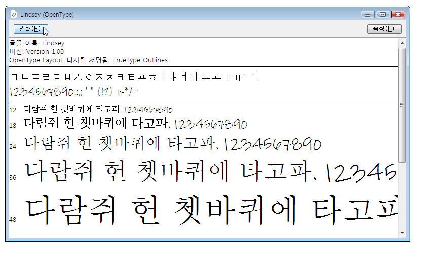

# 샘플 OpenType 글꼴 팩
이 항목에서는 [!INCLUDE[TLA2#tla_wcsdk](../../../../includes/tla2sharptla-wcsdk-md.md)]와 함께 배포되는 샘플 [!INCLUDE[TLA#tla_opentype](../../../../includes/tlasharptla-opentype-md.md)] 글꼴에 대한 개요를 제공합니다.  샘플 글꼴은 [!INCLUDE[TLA#tla_winclient](../../../../includes/tlasharptla-winclient-md.md)] 응용 프로그램에서 사용할 수 있는 확장된 [!INCLUDE[TLA#tla_opentype](../../../../includes/tlasharptla-opentype-md.md)] 기능을 지원합니다.  
  
   
  
   
## OpenType 글꼴 팩의 글꼴  
 [!INCLUDE[TLA2#tla_wcsdk](../../../../includes/tla2sharptla-wcsdk-md.md)]에는 [!INCLUDE[TLA#tla_winclient](../../../../includes/tlasharptla-winclient-md.md)] 응용 프로그램을 만들 때 사용할 수 있는 샘플 [!INCLUDE[TLA#tla_opentype](../../../../includes/tlasharptla-opentype-md.md)] 글꼴 집합이 있습니다.  이 샘플 글꼴은 Ascender Corporation과의 라이선스 계약 하에 제공됩니다.  이러한 글꼴은 [!INCLUDE[TLA#tla_opentype](../../../../includes/tlasharptla-opentype-md.md)] 형식으로 정의된 전체 기능의 하위 집합만 구현합니다.  다음 표에서는 샘플 [!INCLUDE[TLA#tla_opentype](../../../../includes/tlasharptla-opentype-md.md)] 글꼴의 이름을 보여 줍니다.  
  
|**Name**|**파일**|  
|--------------|------------|  
|Kootenay|Kooten.ttf|  
|Lindsey|Linds.ttf|  
|Miramonte|Miramo.ttf|  
|Miramonte Bold|Miramob.ttf|  
|Pericles|Peric.ttf|  
|Pericles Light|Pericl.ttf|  
|Pescadero|Pesca.ttf|  
|Pescadero Bold|Pescab.ttf|  
  
 다음 그림에서는 샘플 [!INCLUDE[TLA#tla_opentype](../../../../includes/tlasharptla-opentype-md.md)] 글꼴의 모양을 보여 줍니다.  
  
   
OpenType 글꼴 팩의 글꼴  
  
 이 샘플 글꼴은 Ascender Corporation과의 라이선스 계약 하에 제공됩니다.  Ascender는 고급 글꼴 제품 공급업체입니다.  샘플 글꼴의 확장 버전이나 사용자 지정 버전에 대한 라이선스를 받으려면 [Ascender Corporation 웹 사이트](http://go.microsoft.com/fwlink/?LinkId=182627)를 참조하십시오.  
  
> [!NOTE]
>  개발자는 응용 프로그램 내에 포함하거나 달리 재배포할 글꼴에 대해 필요한 권한이 있는지 확인해야 할 책임이 있습니다.  
  
   
## 글꼴 설치  
 샘플 [!INCLUDE[TLA#tla_opentype](../../../../includes/tlasharptla-opentype-md.md)] 글꼴을 기본 [!INCLUDE[TLA#tla_mswin](../../../../includes/tlasharptla-mswin-md.md)] 글꼴 디렉터리인 **\\WINDOWS\\Fonts**에 설치할 수 있습니다.  글꼴 제어판을 사용하여 글꼴을 설치합니다.  컴퓨터에 이러한 글꼴이 있으면 기본 [!INCLUDE[TLA#tla_mswin](../../../../includes/tlasharptla-mswin-md.md)] 글꼴을 참조하는 모든 응용 프로그램에서 글꼴에 액세스할 수 있습니다. 글꼴 파일을 두 번 클릭하여 대표 문자 집합을 몇 가지 글꼴 크기로 나타낼 수 있습니다.  다음 스크린 샷에서는 Lindsey 글꼴 파일인 Linds.ttf를 보여 줍니다.  
  
   
Lindsey 글꼴 표시  
  
   
## 글꼴 사용  
 응용 프로그램에서 두 가지 방법으로 글꼴을 사용할 수 있습니다.  어셈블리에 리소스로 포함되지 않은 프로젝트 콘텐츠 항목으로 응용 프로그램에 글꼴을 추가할 수 있습니다.  또는 응용 프로그램의 어셈블리 파일에 포함된 프로젝트 리소스 항목으로 응용 프로그램에 글꼴을 추가할 수 있습니다.  자세한 내용은 [응용 프로그램과 함께 글꼴 패키징](../../../../docs/framework/wpf/advanced/packaging-fonts-with-applications.md)을 참조하십시오.  
  
## 참고 항목  
 <xref:System.Windows.Documents.Typography>   
 [OpenType 글꼴 기능](../../../../docs/framework/wpf/advanced/opentype-font-features.md)   
 [응용 프로그램과 함께 글꼴 패키징](../../../../docs/framework/wpf/advanced/packaging-fonts-with-applications.md)