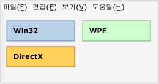
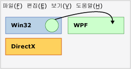
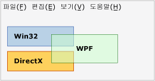
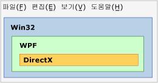
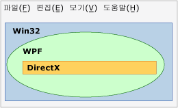

# 기술 영역 개요Technology Regions Overview
응용 프로그램에 WPF, Win32 또는 DirectX와 같은 여러 프레젠테이션 기술이 사용되는 경우 이러한 기술은 공통 최상위 창에서 렌더링 영역을 공유해야 합니다.If multiple presentation technologies are used in an application, such as WPF, Win32, or DirectX, they must share the rendering areas within a common top-level window. 이 항목에서는 WPF 상호 운용 응용 프로그램에 대한 프레젠테이션과 입력에 영향을 미칠 수 있는 문제를 설명합니다.This topic describes issues that might influence the presentation and input for your WPF interoperation application.  
  
## 영역Regions  
 최상위 창에서 상호 운용 응용 프로그램의 기술 중 하나로 구성되는 각 HWND에 자체 영역("에어스페이스"라고도 함)이 포함되도록 개념화할 수 있습니다.Within a top-level window, you can conceptualize that each HWND that comprises one of the technologies of an interoperation application has its own region (also called "airspace"). 창 내의 각 픽셀은 해당 HWND의 영역을 형성하는 정확히 하나의 HWND에 속합니다.Each pixel within the window belongs to exactly one HWND, which constitutes the region of that HWND. 엄격히 말하면 [!INCLUDE[TLA2#tla_winclient](../../../../includes/tla2sharptla-winclient-md.md)] HWND가 두 개 이상 있는 경우 [!INCLUDE[TLA2#tla_winclient](../../../../includes/tla2sharptla-winclient-md.md)] 영역도 두 개 이상 있지만 이 설명을 위해 하나만 있다고 가정할 수 있습니다.(Strictly speaking, there is more than one [!INCLUDE[TLA2#tla_winclient](../../../../includes/tla2sharptla-winclient-md.md)] region if there is more than one [!INCLUDE[TLA2#tla_winclient](../../../../includes/tla2sharptla-winclient-md.md)] HWND, but for purposes of this discussion, you can assume there is only one). 영역은 응용 프로그램 수명 중에 해당 픽셀 위에 렌더링되는 모든 계층 또는 기타 창이 같은 렌더링 수준 기술에 포함되어야 함을 의미합니다.The region implies that all layers or other windows that attempt to render above that pixel during application lifetime must be part of the same render-level technology. [!INCLUDE[TLA2#tla_winclient](../../../../includes/tla2sharptla-winclient-md.md)] 픽셀을 [!INCLUDE[TLA2#tla_win32](../../../../includes/tla2sharptla-win32-md.md)] 위에 렌더링하려고 시도하면 원하지 않는 결과가 발생하고 이 시도는 상호 운용 [!INCLUDE[TLA2#tla_api#plural](../../../../includes/tla2sharptla-apisharpplural-md.md)]를 통해 가능한 한 많이 허용되지 않습니다.Attempting to render [!INCLUDE[TLA2#tla_winclient](../../../../includes/tla2sharptla-winclient-md.md)] pixels over [!INCLUDE[TLA2#tla_win32](../../../../includes/tla2sharptla-win32-md.md)] leads to undesirable results, and is disallowed as much as possible through the interoperation [!INCLUDE[TLA2#tla_api#plural](../../../../includes/tla2sharptla-apisharpplural-md.md)].  
  
### 영역 예제Region Examples  
 다음 그림에서는 [!INCLUDE[TLA2#tla_win32](../../../../includes/tla2sharptla-win32-md.md)], [!INCLUDE[TLA2#tla_dx](../../../../includes/tla2sharptla-dx-md.md)] 및 [!INCLUDE[TLA2#tla_winclient](../../../../includes/tla2sharptla-winclient-md.md)]를 혼합하는 응용 프로그램을 보여 줍니다.The following illustration shows an application that mixes [!INCLUDE[TLA2#tla_win32](../../../../includes/tla2sharptla-win32-md.md)], [!INCLUDE[TLA2#tla_dx](../../../../includes/tla2sharptla-dx-md.md)], and [!INCLUDE[TLA2#tla_winclient](../../../../includes/tla2sharptla-winclient-md.md)]. 각 기술은 자체적인 별도의 겹치지 않는 픽셀 집합을 사용하고 영역 문제가 없습니다.Each technology uses its own separate, non-overlapping set of pixels, and there are no region issues.  
  
   
  
 이 응용 프로그램이 마우스 포인터 위치를 사용하여 이러한 세 개의 영역 위에 렌더링할 애니메이션을 만든다고 가정해 봅니다.Suppose that this application uses the mouse pointer position to create an animation that attempts to render over any of these three regions. 애니메이션 자체에 응답 가능한 기술이 무엇이든 관계없이 해당 기술은 다른 두 기술의 영역을 침해합니다.No matter which technology was responsible for the animation itself, that technology would violate the region of the other two. 다음 그림에서는 Win32 영역 위에 WPF 원을 렌더링하는 시도를 보여 줍니다.The following illustration shows an attempt to render a WPF circle over a Win32 region.  
  
   
  
 또 다른 침해는 서로 다른 기술 사이에 투명도/알파 블렌딩을 사용하려는 경우입니다.Another violation is if you try to use transparency/alpha blending between different technologies.  다음 그림에서 [!INCLUDE[TLA2#tla_winclient](../../../../includes/tla2sharptla-winclient-md.md)] 상자는 [!INCLUDE[TLA2#tla_win32](../../../../includes/tla2sharptla-win32-md.md)] 및 [!INCLUDE[TLA2#tla_dx](../../../../includes/tla2sharptla-dx-md.md)] 영역을 침해합니다.In the following illustration, the [!INCLUDE[TLA2#tla_winclient](../../../../includes/tla2sharptla-winclient-md.md)] box violates the [!INCLUDE[TLA2#tla_win32](../../../../includes/tla2sharptla-win32-md.md)] and [!INCLUDE[TLA2#tla_dx](../../../../includes/tla2sharptla-dx-md.md)] regions. 해당 [!INCLUDE[TLA2#tla_winclient](../../../../includes/tla2sharptla-winclient-md.md)] 상자의 픽셀은 반투명하므로 [!INCLUDE[TLA2#tla_dx](../../../../includes/tla2sharptla-dx-md.md)] 및 [!INCLUDE[TLA2#tla_winclient](../../../../includes/tla2sharptla-winclient-md.md)]가 둘 다 공동으로 이러한 픽셀을 소유해야 하지만 이는 불가능합니다.Because pixels in that [!INCLUDE[TLA2#tla_winclient](../../../../includes/tla2sharptla-winclient-md.md)] box are semi-transparent, they would have to be owned jointly by both [!INCLUDE[TLA2#tla_dx](../../../../includes/tla2sharptla-dx-md.md)] and [!INCLUDE[TLA2#tla_winclient](../../../../includes/tla2sharptla-winclient-md.md)], which is not possible.  따라서 이는 또 다른 침해이며 빌드될 수 없습니다.So this is another violation and cannot be built.  
  
   
  
 이전 세 개의 예제에서는 사각형 영역을 사용했으나 다른 모양이 가능합니다.The previous three examples used rectangular regions, but different shapes are possible.  예를 들어 영역에 구멍이 있을 수 있습니다.For example, a region can have a hole. 다음 그림에서는 사각형 구멍이 있는 [!INCLUDE[TLA2#tla_win32](../../../../includes/tla2sharptla-win32-md.md)] 영역을 보여 줍니다. 구멍의 크기는 [!INCLUDE[TLA2#tla_winclient](../../../../includes/tla2sharptla-winclient-md.md)] 및 [!INCLUDE[TLA2#tla_dx](../../../../includes/tla2sharptla-dx-md.md)] 영역이 결합된 크기입니다.The following illustration shows a [!INCLUDE[TLA2#tla_win32](../../../../includes/tla2sharptla-win32-md.md)] region with a rectangular hole this is the size of the [!INCLUDE[TLA2#tla_winclient](../../../../includes/tla2sharptla-winclient-md.md)] and [!INCLUDE[TLA2#tla_dx](../../../../includes/tla2sharptla-dx-md.md)] regions combined.  
  
   
  
 영역은 완전히 사각형이 아니거나 [!INCLUDE[TLA2#tla_win32](../../../../includes/tla2sharptla-win32-md.md)] HRGN(영역)으로 설명 가능한 모양일 수도 있습니다.Regions can also be completely nonrectangular, or any shape describable by a [!INCLUDE[TLA2#tla_win32](../../../../includes/tla2sharptla-win32-md.md)] HRGN (region).  
  
   
  
## 투명도 및 최상위 창Transparency and Top-Level Windows  
 Windows의 창 관리자는 실제로 [!INCLUDE[TLA2#tla_win32](../../../../includes/tla2sharptla-win32-md.md)] HWND만 처리합니다.The window manager in Windows only really processes [!INCLUDE[TLA2#tla_win32](../../../../includes/tla2sharptla-win32-md.md)] HWNDs. 따라서 모든 [!INCLUDE[TLA2#tla_winclient](../../../../includes/tla2sharptla-winclient-md.md)] <xref:System.Windows.Window> HWND 됩니다.Therefore, every [!INCLUDE[TLA2#tla_winclient](../../../../includes/tla2sharptla-winclient-md.md)] <xref:System.Windows.Window> is an HWND. <xref:System.Windows.Window> HWND 어떤 HWND에 대 한 일반 규칙을 준수 해야 합니다.The <xref:System.Windows.Window> HWND must abide by the general rules for any HWND. 해당 HWND 내에서 [!INCLUDE[TLA2#tla_winclient](../../../../includes/tla2sharptla-winclient-md.md)] 코드는 전체 [!INCLUDE[TLA2#tla_winclient](../../../../includes/tla2sharptla-winclient-md.md)] [!INCLUDE[TLA2#tla_api#plural](../../../../includes/tla2sharptla-apisharpplural-md.md)]가 지원하는 모든 작업을 수행할 수 있습니다.Within that HWND, [!INCLUDE[TLA2#tla_winclient](../../../../includes/tla2sharptla-winclient-md.md)] code can do whatever the overall [!INCLUDE[TLA2#tla_winclient](../../../../includes/tla2sharptla-winclient-md.md)] [!INCLUDE[TLA2#tla_api#plural](../../../../includes/tla2sharptla-apisharpplural-md.md)] support. 하지만 데스크톱에 있는 다른 HWND에 대한 상호 작용의 경우 [!INCLUDE[TLA2#tla_winclient](../../../../includes/tla2sharptla-winclient-md.md)]는 [!INCLUDE[TLA2#tla_win32](../../../../includes/tla2sharptla-win32-md.md)] 처리 및 렌더링 규칙을 따라야 합니다.But for interactions with other HWNDs on the desktop, [!INCLUDE[TLA2#tla_winclient](../../../../includes/tla2sharptla-winclient-md.md)] must abide by [!INCLUDE[TLA2#tla_win32](../../../../includes/tla2sharptla-win32-md.md)] processing and rendering rules.  [!INCLUDE[TLA2#tla_winclient](../../../../includes/tla2sharptla-winclient-md.md)]는 [!INCLUDE[TLA2#tla_win32](../../../../includes/tla2sharptla-win32-md.md)] [!INCLUDE[TLA2#tla_api#plural](../../../../includes/tla2sharptla-apisharpplural-md.md)]를 사용하여 사각형이 아닌 창을 지원합니다(사각형이 아닌 창인 경우 HRGN 및 픽셀별 알파인 경우 겹쳐진 창). supports non-rectangular windows by using [!INCLUDE[TLA2#tla_win32](../../../../includes/tla2sharptla-win32-md.md)] [!INCLUDE[TLA2#tla_api#plural](../../../../includes/tla2sharptla-apisharpplural-md.md)]—HRGNs for non-rectangular windows, and layered windows for a per-pixel alpha.  
  
 상수 알파 및 색 키는 지원되지 않습니다.Constant alpha and color keys are not supported.  [!INCLUDE[TLA2#tla_win32](../../../../includes/tla2sharptla-win32-md.md)] 창 겹침 기능은 플랫폼에 따라 달라집니다. layered window capabilities vary by platform.  
  
 창 겹침의 경우 창의 모든 픽셀에 적용할 알파 값을 지정하여 전체 창을 반투명하게 만들 수 있습니다.Layered windows can make the entire window translucent (semi-transparent) by specifying an alpha value to apply to every pixel in the window.  실제로 [!INCLUDE[TLA2#tla_win32](../../../../includes/tla2sharptla-win32-md.md)]는 픽셀별 알파를 지원하지만, 이 모드에서는 대화 상자, 드롭다운을 포함된 모든 자식 HWND를 직접 그려야 하므로 이 기술은 실제 프로그램에서 사용하기 매우 어렵습니다.([!INCLUDE[TLA2#tla_win32](../../../../includes/tla2sharptla-win32-md.md)] in fact supports per-pixel alpha, but this is very difficult to use in practical programs because in this mode you would need to draw any child HWND yourself, including dialogs and dropdowns).  
  
 [!INCLUDE[TLA2#tla_winclient](../../../../includes/tla2sharptla-winclient-md.md)]는 HRGN을 지원하지만 이 기능에 대한 관리되는 [!INCLUDE[TLA2#tla_api#plural](../../../../includes/tla2sharptla-apisharpplural-md.md)]가 없습니다. supports HRGNs; however, there are no managed [!INCLUDE[TLA2#tla_api#plural](../../../../includes/tla2sharptla-apisharpplural-md.md)] for this functionality. 플랫폼을 사용할 수 있습니다 호출 및 <xref:System.Windows.Interop.HwndSource> 관련 호출할 [!INCLUDE[TLA2#tla_win32](../../../../includes/tla2sharptla-win32-md.md)] [!INCLUDE[TLA2#tla_api#plural](../../../../includes/tla2sharptla-apisharpplural-md.md)]합니다.You can use platform invoke and <xref:System.Windows.Interop.HwndSource> to call the relevant [!INCLUDE[TLA2#tla_win32](../../../../includes/tla2sharptla-win32-md.md)] [!INCLUDE[TLA2#tla_api#plural](../../../../includes/tla2sharptla-apisharpplural-md.md)]. 자세한 내용은 [관리 코드에서 네이티브 함수 호출](/cpp/dotnet/calling-native-functions-from-managed-code)을 참조하세요.For more information, see [Calling Native Functions from Managed Code](/cpp/dotnet/calling-native-functions-from-managed-code).  
  
 [!INCLUDE[TLA2#tla_winclient](../../../../includes/tla2sharptla-winclient-md.md)] 창 겹침에는 다양한 운영 체제에 대한 여러 가지 기능이 포함됩니다. layered windows have different capabilities on different operating systems. 이는 [!INCLUDE[TLA2#tla_winclient](../../../../includes/tla2sharptla-winclient-md.md)]에서는 렌더링에 [!INCLUDE[TLA2#tla_dx](../../../../includes/tla2sharptla-dx-md.md)]를 사용하고, 겹쳐진 창은 기본적으로 [!INCLUDE[TLA2#tla_dx](../../../../includes/tla2sharptla-dx-md.md)] 렌더링이 아닌 [!INCLUDE[TLA2#tla_gdi](../../../../includes/tla2sharptla-gdi-md.md)] 렌더링용으로 디자인되었기 때문입니다.This is because [!INCLUDE[TLA2#tla_winclient](../../../../includes/tla2sharptla-winclient-md.md)] uses [!INCLUDE[TLA2#tla_dx](../../../../includes/tla2sharptla-dx-md.md)] to render, and layered windows were primarily designed for [!INCLUDE[TLA2#tla_gdi](../../../../includes/tla2sharptla-gdi-md.md)] rendering, not [!INCLUDE[TLA2#tla_dx](../../../../includes/tla2sharptla-dx-md.md)] rendering.  
  
-   [!INCLUDE[TLA2#tla_winclient](../../../../includes/tla2sharptla-winclient-md.md)]는 [!INCLUDE[TLA#tla_longhorn](../../../../includes/tlasharptla-longhorn-md.md)] 이상에서 하드웨어 가속 창 겹침을 지원합니다. supports hardware accelerated layered windows on [!INCLUDE[TLA#tla_longhorn](../../../../includes/tlasharptla-longhorn-md.md)] and later. [!INCLUDE[TLA2#tla_winxp](../../../../includes/tla2sharptla-winxp-md.md)]에서 하드웨어 가속 창 겹침을 사용하려면 [!INCLUDE[TLA#tla_dx](../../../../includes/tlasharptla-dx-md.md)]의 지원이 필요하므로 기능은 해당 컴퓨터의 [!INCLUDE[TLA#tla_dx](../../../../includes/tlasharptla-dx-md.md)] 버전에 따라 달라집니다.Hardware accelerated layered windows on [!INCLUDE[TLA2#tla_winxp](../../../../includes/tla2sharptla-winxp-md.md)] require support from [!INCLUDE[TLA#tla_dx](../../../../includes/tlasharptla-dx-md.md)], so the capabilities will depend on the version of [!INCLUDE[TLA#tla_dx](../../../../includes/tlasharptla-dx-md.md)] on that machine.  
  
-   [!INCLUDE[TLA2#tla_winclient](../../../../includes/tla2sharptla-winclient-md.md)]는 투명색 키를 지원하지 않습니다. [!INCLUDE[TLA2#tla_winclient](../../../../includes/tla2sharptla-winclient-md.md)]는 특히 렌더링이 하드웨어 가속될 경우 요청한 정확한 색을 렌더링하도록 보장할 수 없기 때문입니다. does not support transparency color keys, because [!INCLUDE[TLA2#tla_winclient](../../../../includes/tla2sharptla-winclient-md.md)] cannot guarantee to render the exact color you requested, particularly when rendering is hardware-accelerated.  
  
-   응용 프로그램이 [!INCLUDE[TLA2#tla_winxp](../../../../includes/tla2sharptla-winxp-md.md)]에서 실행될 경우 [!INCLUDE[TLA2#tla_dx](../../../../includes/tla2sharptla-dx-md.md)] 응용 프로그램이 렌더링될 때 [!INCLUDE[TLA2#tla_dx](../../../../includes/tla2sharptla-dx-md.md)] 화면 위의 겹쳐진 창이 깜박입니다.If your application is running on [!INCLUDE[TLA2#tla_winxp](../../../../includes/tla2sharptla-winxp-md.md)], layered windows on top of [!INCLUDE[TLA2#tla_dx](../../../../includes/tla2sharptla-dx-md.md)] surfaces flicker when the [!INCLUDE[TLA2#tla_dx](../../../../includes/tla2sharptla-dx-md.md)] application renders.  실제 렌더링 시퀀스는 [!INCLUDE[TLA#tla_gdi](../../../../includes/tlasharptla-gdi-md.md)]가 겹쳐진 창을 숨기고 나서, [!INCLUDE[TLA2#tla_dx](../../../../includes/tla2sharptla-dx-md.md)]가 그린 다음, [!INCLUDE[TLA#tla_gdi](../../../../includes/tlasharptla-gdi-md.md)]가 겹쳐진 창을 되돌리는 것입니다.(The actual rendering sequence is that [!INCLUDE[TLA#tla_gdi](../../../../includes/tlasharptla-gdi-md.md)] hides the layered window, then [!INCLUDE[TLA2#tla_dx](../../../../includes/tla2sharptla-dx-md.md)] draws, and then [!INCLUDE[TLA#tla_gdi](../../../../includes/tlasharptla-gdi-md.md)] puts the layered window back).  [!INCLUDE[TLA2#tla_winclient](../../../../includes/tla2sharptla-winclient-md.md)]가 아닌 겹쳐진 창에는 이 제한 사항이 없습니다.Non-[!INCLUDE[TLA2#tla_winclient](../../../../includes/tla2sharptla-winclient-md.md)] layered windows also have this limitation.  
  
## 참고 항목See Also  
 [WPF 및 Win32 상호 운용성WPF and Win32 Interoperation](../../../../docs/framework/wpf/advanced/wpf-and-win32-interoperation.md)  
 [연습: Win32에서 WPF 시계 호스팅Walkthrough: Hosting a WPF Clock in Win32](../../../../docs/framework/wpf/advanced/walkthrough-hosting-a-wpf-clock-in-win32.md)  
 [WPF에서 Win32 콘텐츠 호스트Hosting Win32 Content in WPF](../../../../docs/framework/wpf/advanced/hosting-win32-content-in-wpf.md)
