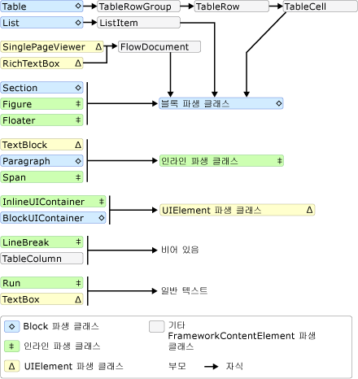
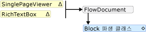
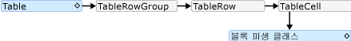
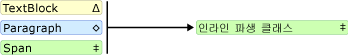
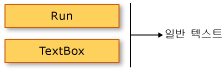

# TextElement 콘텐츠 모델 개요TextElement Content Model Overview
에 대 한 지원 되는 콘텐츠를 설명 하는이 콘텐츠 모델 개요는 <xref:System.Windows.Documents.TextElement>합니다.This content model overview describes the supported content for a <xref:System.Windows.Documents.TextElement>. <xref:System.Windows.Documents.Paragraph> 클래스는 유형의 <xref:System.Windows.Documents.TextElement>합니다.The <xref:System.Windows.Documents.Paragraph> class is a type of <xref:System.Windows.Documents.TextElement>. 콘텐츠 모델은 어떤 개체/요소가 다른 개체/요소에 포함될 수 있는지를 설명합니다.A content model describes what objects/elements can be contained in others. 이 개요에서 파생 된 개체에 사용 되는 콘텐츠 모델을 요약 <xref:System.Windows.Documents.TextElement>합니다.This overview summarizes the content model used for objects derived from <xref:System.Windows.Documents.TextElement>. 자세한 내용은 참조 [문서 개요 흐름](../../../../docs/framework/wpf/advanced/flow-document-overview.md)합니다.For more information, see [Flow Document Overview](../../../../docs/framework/wpf/advanced/flow-document-overview.md).  
  
  
   
## 콘텐츠 모델 다이어그램Content Model Diagram  
 다음 다이어그램에서 파생 된 클래스에 대 한 콘텐츠 모델을 요약 <xref:System.Windows.Documents.TextElement> 뿐만 아니라 다른 비- `TextElement` 클래스가이 모델에 적합 합니다.The following diagram summarizes the content model for classes derived from <xref:System.Windows.Documents.TextElement> as well as how other non- `TextElement` classes fit into this model.  
  
   
  
 위의 다이어그램에서 볼 수 있듯이 요소에 대해 허용 되는 자식이 반드시 의해 결정 되지 않습니다는 클래스에서 파생 된 여부는 <xref:System.Windows.Documents.Block> 클래스 또는 <xref:System.Windows.Documents.Inline> 클래스입니다.As can be seen from the preceding diagram, the children allowed for an element are not necessarily determined by whether a class is derived from the <xref:System.Windows.Documents.Block> class or an <xref:System.Windows.Documents.Inline> class. 예를 들어는 <xref:System.Windows.Documents.Span> (한 <xref:System.Windows.Documents.Inline>-파생 클래스) 하나만 사용할 수 있습니다 <xref:System.Windows.Documents.Inline> 자식 요소 하지만 <xref:System.Windows.Documents.Figure> (또한는 <xref:System.Windows.Documents.Inline>-파생 클래스) 하나만 사용할 수 있습니다 <xref:System.Windows.Documents.Block> 자식 요소입니다.For example, a <xref:System.Windows.Documents.Span> (an <xref:System.Windows.Documents.Inline>-derived class) can only have <xref:System.Windows.Documents.Inline> child elements, but a <xref:System.Windows.Documents.Figure> (also an <xref:System.Windows.Documents.Inline>-derived class) can only have <xref:System.Windows.Documents.Block> child elements. 그러므로 이 다이어그램은 다른 요소에 포함될 수 있는 요소를 신속하게 판별하는 데 유용합니다.Therefore, a diagram is useful for quickly determining what element can be contained in another. 예를 들어 다이어그램을 사용해 보겠습니다의 유동 콘텐츠를 생성 하는 방법을 결정 하는 <xref:System.Windows.Controls.RichTextBox>합니다.As an example, let's use the diagram to determine how to construct the flow content of a <xref:System.Windows.Controls.RichTextBox>.  
  
1.  A <xref:System.Windows.Controls.RichTextBox> 포함 해야 합니다는 <xref:System.Windows.Documents.FlowDocument> 를 포함 해야는 <xref:System.Windows.Documents.Block>-파생 된 개체입니다.A <xref:System.Windows.Controls.RichTextBox> must contain a <xref:System.Windows.Documents.FlowDocument> which in turn must contain a <xref:System.Windows.Documents.Block>-derived object. 이전 다이어그램에 해당하는 세그먼트는 다음과 같습니다.The following is the corresponding segment from the preceding diagram.  
  
       
  
     따라서 지금까지 태그는 다음과 같을 수 있습니다.Thus far, this is what the markup might look like.  
  
     [!code-xaml[FlowOvwSnippets_snip#SchemaWalkThrough1](../../../../samples/snippets/csharp/VS_Snippets_Wpf/FlowOvwSnippets_snip/CS/MiscSnippets.xaml#schemawalkthrough1)]  
  
2.  다이어그램에 따라 몇 가지 <xref:System.Windows.Documents.Block> 비롯 하 여 선택할 요소 <xref:System.Windows.Documents.Paragraph>, <xref:System.Windows.Documents.Section>, <xref:System.Windows.Documents.Table>, <xref:System.Windows.Documents.List>, 및 <xref:System.Windows.Documents.BlockUIContainer> (위 다이어그램에 블록 파생 클래스 참조).According to the diagram, there are several <xref:System.Windows.Documents.Block> elements to choose from including <xref:System.Windows.Documents.Paragraph>, <xref:System.Windows.Documents.Section>, <xref:System.Windows.Documents.Table>, <xref:System.Windows.Documents.List>, and <xref:System.Windows.Documents.BlockUIContainer> (see Block-derived classes in the preceding diagram). 원하는 경우를 가정해는 <xref:System.Windows.Documents.Table>합니다.Let's say we want a <xref:System.Windows.Documents.Table>. 위의 다이어그램에 따라는 <xref:System.Windows.Documents.Table> 포함는 <xref:System.Windows.Documents.TableRowGroup> 포함 된 <xref:System.Windows.Documents.TableRow> 포함 하는 요소 <xref:System.Windows.Documents.TableCell> 포함 하는 요소는 <xref:System.Windows.Documents.Block>-파생 개체입니다.According to the preceding diagram, a <xref:System.Windows.Documents.Table> contains a <xref:System.Windows.Documents.TableRowGroup> containing <xref:System.Windows.Documents.TableRow> elements, which contain <xref:System.Windows.Documents.TableCell> elements which contain a <xref:System.Windows.Documents.Block>-derived object. 다음은 해당 하는 세그먼트에 대 한 <xref:System.Windows.Documents.Table> 위의 다이어그램에서 가져옵니다.The following is the corresponding segment for <xref:System.Windows.Documents.Table> taken from the preceding diagram.  
  
       
  
     다음은 해당 태그입니다.The following is the corresponding markup.  
  
     [!code-xaml[FlowOvwSnippets_snip#SchemaWalkThrough2](../../../../samples/snippets/csharp/VS_Snippets_Wpf/FlowOvwSnippets_snip/CS/MiscSnippets.xaml#schemawalkthrough2)]  
  
3.  마찬가지로 하나 이상의 <xref:System.Windows.Documents.Block> 아래 필요한 요소는 <xref:System.Windows.Documents.TableCell>합니다.Again, one or more <xref:System.Windows.Documents.Block> elements are required underneath a <xref:System.Windows.Documents.TableCell>. 간단하게 셀 안에 텍스트를 배치해 보겠습니다.To make it simple, let's place some text inside the cell. 사용 하 여 수행할 수 있습니다는 <xref:System.Windows.Documents.Paragraph> 와 <xref:System.Windows.Documents.Run> 요소입니다.We can do this using a <xref:System.Windows.Documents.Paragraph> with a <xref:System.Windows.Documents.Run> element. 다음의 해당 세그먼트를 보여 주는 다이어그램은 <xref:System.Windows.Documents.Paragraph> 걸릴 수 있습니다는 <xref:System.Windows.Documents.Inline> 요소를 한 <xref:System.Windows.Documents.Run> (한 <xref:System.Windows.Documents.Inline> 요소) 일반 텍스트만 사용할 수 있습니다.The following is the corresponding segments from the diagram showing that a <xref:System.Windows.Documents.Paragraph> can take an <xref:System.Windows.Documents.Inline> element and that a <xref:System.Windows.Documents.Run> (an <xref:System.Windows.Documents.Inline> element) can only take plain text.  
  
       
  
       
  
 다음은 태그의 전체 예제입니다.The following is the entire example in markup.  
  
 [!code-xaml[FlowOvwSnippets_snip#SchemaExampleWholePage](../../../../samples/snippets/csharp/VS_Snippets_Wpf/FlowOvwSnippets_snip/CS/SchemaExample.xaml#schemaexamplewholepage)]  
  
   
## 프로그래밍 방식으로 TextElement 콘텐츠 작업Working with TextElement Content Programmatically  
 콘텐츠는 <xref:System.Windows.Documents.TextElement> 컬렉션 등의 콘텐츠를 프로그래밍 방식으로 조작 하 여 구성 된 <xref:System.Windows.Documents.TextElement> 개체는 이러한 컬렉션을 사용 하 여 수행 됩니다.The contents of a <xref:System.Windows.Documents.TextElement> is made up by collections and so programmatically manipulating the contents of <xref:System.Windows.Documents.TextElement> objects is done by working with these collections. 사용 하는 세 가지 서로 다른 컬렉션 <xref:System.Windows.Documents.TextElement> -파생 된 클래스:There are three different collections used by <xref:System.Windows.Documents.TextElement> -derived classes:  
  
-   <xref:System.Windows.Documents.InlineCollection>:의 컬렉션을 나타냅니다 <xref:System.Windows.Documents.Inline> 요소입니다.<xref:System.Windows.Documents.InlineCollection>: Represents a collection of <xref:System.Windows.Documents.Inline> elements. <xref:System.Windows.Documents.InlineCollection>사용할 수 있는 자식 콘텐츠를 정의 고 <xref:System.Windows.Documents.Paragraph>, <xref:System.Windows.Documents.Span>, 및 <xref:System.Windows.Controls.TextBlock> 요소입니다.<xref:System.Windows.Documents.InlineCollection> defines the allowable child content of the <xref:System.Windows.Documents.Paragraph>, <xref:System.Windows.Documents.Span>, and <xref:System.Windows.Controls.TextBlock> elements.  
  
-   <xref:System.Windows.Documents.BlockCollection>:의 컬렉션을 나타냅니다 <xref:System.Windows.Documents.Block> 요소입니다.<xref:System.Windows.Documents.BlockCollection>: Represents a collection of <xref:System.Windows.Documents.Block> elements. <xref:System.Windows.Documents.BlockCollection>은 <xref:System.Windows.Documents.FlowDocument>, <xref:System.Windows.Documents.Section>, <xref:System.Windows.Documents.ListItem>, <xref:System.Windows.Documents.TableCell>, <xref:System.Windows.Documents.Floater> 및 <xref:System.Windows.Documents.Figure> 요소의 사용할 수 있는 자식 콘텐츠를 정의합니다.<xref:System.Windows.Documents.BlockCollection> defines the allowable child content of the <xref:System.Windows.Documents.FlowDocument>, <xref:System.Windows.Documents.Section>, <xref:System.Windows.Documents.ListItem>, <xref:System.Windows.Documents.TableCell>, <xref:System.Windows.Documents.Floater>, and <xref:System.Windows.Documents.Figure> elements.  
  
-   <xref:System.Windows.Documents.ListItemCollection>순서 있는 특정 콘텐츠 항목을 나타내는: 유동 콘텐츠 요소 또는 순서가 지정 되지 않은 <xref:System.Windows.Documents.List>합니다.<xref:System.Windows.Documents.ListItemCollection>: A flow content element that represents a particular content item in an ordered or unordered <xref:System.Windows.Documents.List>.  
  
 조작할 수 있습니다 (추가 또는 제거 항목)의 해당 속성을 사용 하 여 이러한 컬렉션에서 **인라인**, **블록**, 및 **ListItems**합니다.You can manipulate (add or remove items) from these collections using the respective properties of **Inlines**, **Blocks**, and **ListItems**. 다음 예제는 범위를 사용 하 여의 내용을 조작 하는 방법을 보여 줍니다는 **인라인** 속성입니다.The following examples show how to manipulate the contents of a Span using the **Inlines** property.  
  
> [!NOTE]
>  테이블에서는 콘텐츠를 조작하는 데 여러 컬렉션을 사용하지만 이러한 컬렉션은 여기에서 다루지 않습니다.Table uses several collections to manipulate its contents, but they are not covered here. 자세한 내용은 참조 [테이블 개요](../../../../docs/framework/wpf/advanced/table-overview.md)합니다.For more information, see [Table Overview](../../../../docs/framework/wpf/advanced/table-overview.md).  
  
 다음 예제에서는 새 <xref:System.Windows.Documents.Span> 개체, 한 다음 사용 하는 `Add` 두 텍스트를 추가 하는 방법을의 콘텐츠 자식으로 실행 되는 <xref:System.Windows.Documents.Span>합니다.The following example creates a new <xref:System.Windows.Documents.Span> object, and then uses the `Add` method to add two text runs as content children of the <xref:System.Windows.Documents.Span>.  
  
 [!code-csharp[SpanSnippets#_SpanInlinesAdd](../../../../samples/snippets/csharp/VS_Snippets_Wpf/SpanSnippets/CSharp/Window1.xaml.cs#_spaninlinesadd)]
 [!code-vb[SpanSnippets#_SpanInlinesAdd](../../../../samples/snippets/visualbasic/VS_Snippets_Wpf/SpanSnippets/visualbasic/window1.xaml.vb#_spaninlinesadd)]  
  
 다음 예제에서는 새 <xref:System.Windows.Documents.Run> 요소를 맨 앞에 삽입 하는 <xref:System.Windows.Documents.Span>합니다.The following example creates a new <xref:System.Windows.Documents.Run> element and inserts it at the beginning of the <xref:System.Windows.Documents.Span>.  
  
 [!code-csharp[SpanSnippets#_SpanInlinesInsert](../../../../samples/snippets/csharp/VS_Snippets_Wpf/SpanSnippets/CSharp/Window1.xaml.cs#_spaninlinesinsert)]
 [!code-vb[SpanSnippets#_SpanInlinesInsert](../../../../samples/snippets/visualbasic/VS_Snippets_Wpf/SpanSnippets/visualbasic/window1.xaml.vb#_spaninlinesinsert)]  
  
 다음 예에서는 삭제 마지막 <xref:System.Windows.Documents.Inline> 요소에는 <xref:System.Windows.Documents.Span>합니다.The following example deletes the last <xref:System.Windows.Documents.Inline> element in the <xref:System.Windows.Documents.Span>.  
  
 [!code-csharp[SpanSnippets#_SpanInlinesRemoveLast](../../../../samples/snippets/csharp/VS_Snippets_Wpf/SpanSnippets/CSharp/Window1.xaml.cs#_spaninlinesremovelast)]
 [!code-vb[SpanSnippets#_SpanInlinesRemoveLast](../../../../samples/snippets/visualbasic/VS_Snippets_Wpf/SpanSnippets/visualbasic/window1.xaml.vb#_spaninlinesremovelast)]  
  
 다음 예제에서는 모든 내용을 지웁니다 (<xref:System.Windows.Documents.Inline> 요소)에서 고 <xref:System.Windows.Documents.Span>합니다.The following example clears all of the contents (<xref:System.Windows.Documents.Inline> elements) from the <xref:System.Windows.Documents.Span>.  
  
 [!code-csharp[SpanSnippets#_SpanInlinesClear](../../../../samples/snippets/csharp/VS_Snippets_Wpf/SpanSnippets/CSharp/Window1.xaml.cs#_spaninlinesclear)]
 [!code-vb[SpanSnippets#_SpanInlinesClear](../../../../samples/snippets/visualbasic/VS_Snippets_Wpf/SpanSnippets/visualbasic/window1.xaml.vb#_spaninlinesclear)]  
  
   
## 이 콘텐츠 모델을 공유하는 형식Types That Share This Content Model  
 다음 형식에서 상속 된 <xref:System.Windows.Documents.TextElement> 클래스 및이 개요에 설명 된 콘텐츠를 표시 하는 데 사용 될 수 있습니다.The following types inherit from the <xref:System.Windows.Documents.TextElement> class and may be used to display the content described in this overview.  
  
 <xref:System.Windows.Documents.Bold>, <xref:System.Windows.Documents.Figure>, <xref:System.Windows.Documents.Floater>, <xref:System.Windows.Documents.Hyperlink>, <xref:System.Windows.Documents.InlineUIContainer>, <xref:System.Windows.Documents.Italic>, <xref:System.Windows.Documents.LineBreak>, <xref:System.Windows.Documents.List>, <xref:System.Windows.Documents.ListItem>, <xref:System.Windows.Documents.Paragraph>, <xref:System.Windows.Documents.Run>, <xref:System.Windows.Documents.Section>, <xref:System.Windows.Documents.Span>, <xref:System.Windows.Documents.Table>, <xref:System.Windows.Documents.Underline>.<xref:System.Windows.Documents.Bold>, <xref:System.Windows.Documents.Figure>, <xref:System.Windows.Documents.Floater>, <xref:System.Windows.Documents.Hyperlink>, <xref:System.Windows.Documents.InlineUIContainer>, <xref:System.Windows.Documents.Italic>, <xref:System.Windows.Documents.LineBreak>, <xref:System.Windows.Documents.List>, <xref:System.Windows.Documents.ListItem>, <xref:System.Windows.Documents.Paragraph>, <xref:System.Windows.Documents.Run>, <xref:System.Windows.Documents.Section>, <xref:System.Windows.Documents.Span>, <xref:System.Windows.Documents.Table>, <xref:System.Windows.Documents.Underline>.  
  
 이 목록에만 함께 배포 하는 비추상 형식 포함는 [!INCLUDE[TLA2#tla_winfxsdk](../../../../includes/tla2sharptla-winfxsdk-md.md)]합니다.Note that this list only includes nonabstract types distributed with the [!INCLUDE[TLA2#tla_winfxsdk](../../../../includes/tla2sharptla-winfxsdk-md.md)]. 상속 하는 다른 형식을 사용할 수 있습니다 <xref:System.Windows.Documents.TextElement>합니다.You may use other types that inherit from <xref:System.Windows.Documents.TextElement>.  
  
   
## TextElement 개체를 포함할 수 있는 형식Types That Can Contain TextElement Objects  
 참조 [WPF 콘텐츠 모델](../../../../docs/framework/wpf/controls/wpf-content-model.md)합니다.See [WPF Content Model](../../../../docs/framework/wpf/controls/wpf-content-model.md).  
  
## 참고 항목See Also  
 [Blocks 속성을 통한 FlowDocument 조작Manipulate a FlowDocument through the Blocks Property](../../../../docs/framework/wpf/advanced/how-to-manipulate-a-flowdocument-through-the-blocks-property.md)  
 [Blocks 속성을 통한 유동 콘텐츠 요소 조작Manipulate Flow Content Elements through the Blocks Property](../../../../docs/framework/wpf/advanced/how-to-manipulate-flow-content-elements-through-the-blocks-property.md)  
 [Blocks 속성을 통한 FlowDocument 조작Manipulate a FlowDocument through the Blocks Property](../../../../docs/framework/wpf/advanced/how-to-manipulate-a-flowdocument-through-the-blocks-property.md)  
 [Columns 속성을 통해 테이블의 열 조작Manipulate a Table's Columns through the Columns Property](../../../../docs/framework/wpf/advanced/how-to-manipulate-table-columns-through-the-columns-property.md)  
 [RowGroups 속성을 통한 테이블의 행 그룹 조작Manipulate a Table's Row Groups through the RowGroups Property](../../../../docs/framework/wpf/advanced/how-to-manipulate-table-row-groups-through-the-rowgroups-property.md)
