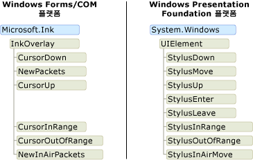
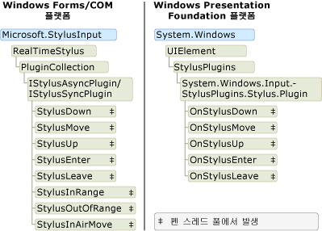

# 잉크 개체 모델: Windows Forms 및 COM과 WPFThe Ink Object Model: Windows Forms and COM versus WPF

디지털 잉크를 지 원하는 세 플랫폼 기본적으로: Tablet PC Windows Forms 플랫폼, 태블릿 PC COM 플랫폼 및 Windows Presentation Foundation (WPF) 플랫폼입니다.There are essentially three platforms that support digital ink: the Tablet PC Windows Forms platform, the Tablet PC COM platform, and the Windows Presentation Foundation (WPF) platform.  에 대 한 개체 모델은 비슷한 있지만 개체 모델에서 Windows Forms 및 COM 플랫폼 공유는 [!INCLUDE[TLA2#tla_wpf](../../../../includes/tla2sharptla-wpf-md.md)] 플랫폼은 크게 다릅니다.The Windows Forms and COM platforms share a similar object model, but the object model for the [!INCLUDE[TLA2#tla_wpf](../../../../includes/tla2sharptla-wpf-md.md)] platform is substantially different.  이 항목을 얻을 수 있는 하나의 개체 모델을 개발자가 더 잘 이해할 수 다른 고급 수준에서 차이점을 설명 합니다.This topic discusses the differences at a high-level so that developers that have worked with one object model can better understand the other.  
  
## 잉크 응용 프로그램에서 사용Enabling Ink in an Application  
 세 플랫폼 모두 개체 및이 태블릿 펜의 입력을 받는 응용 프로그램을 사용할 수 있는 컨트롤을 제공 합니다.All three platforms ship objects and controls that enable an application to receive input from a tablet pen.  와 함께 제공 하는 Windows Forms 및 COM 플랫폼 [Microsoft.Ink.InkPicture](https://msdn.microsoft.com/library/aa514604.aspx), [Microsoft.Ink.InkEdit](https://msdn.microsoft.com/library/ms835842.aspx), [Microsoft.Ink.InkOverlay](https://msdn.microsoft.com/library/ms833057.aspx) 및 [ Microsoft.Ink.InkCollector](https://msdn.microsoft.com/library/ms836493.aspx) 클래스입니다.The Windows Forms and COM platforms ship with [Microsoft.Ink.InkPicture](https://msdn.microsoft.com/library/aa514604.aspx), [Microsoft.Ink.InkEdit](https://msdn.microsoft.com/library/ms835842.aspx), [Microsoft.Ink.InkOverlay](https://msdn.microsoft.com/library/ms833057.aspx) and [Microsoft.Ink.InkCollector](https://msdn.microsoft.com/library/ms836493.aspx) classes.  [Microsoft.Ink.InkPicture](https://msdn.microsoft.com/library/aa514604.aspx) 및 [Microsoft.Ink.InkEdit](https://msdn.microsoft.com/library/ms835842.aspx) 컨트롤을 추가할 수 있는 잉크 수집 하도록 응용 프로그램에 있습니다.[Microsoft.Ink.InkPicture](https://msdn.microsoft.com/library/aa514604.aspx) and [Microsoft.Ink.InkEdit](https://msdn.microsoft.com/library/ms835842.aspx) are controls that you can add to an application to collect ink.  [Microsoft.Ink.InkOverlay](https://msdn.microsoft.com/library/ms833057.aspx) 및 [Microsoft.Ink.InkCollector](https://msdn.microsoft.com/library/ms836493.aspx) 기존 창 잉크 가능 창 및 사용자 지정 컨트롤에 연결할 수 있습니다.The [Microsoft.Ink.InkOverlay](https://msdn.microsoft.com/library/ms833057.aspx) and [Microsoft.Ink.InkCollector](https://msdn.microsoft.com/library/ms836493.aspx) can be attached to an existing window to ink-enable windows and custom controls.  
  
 WPF를 포함 하는 <xref:System.Windows.Controls.InkCanvas> 제어 합니다.The WPF platform includes the <xref:System.Windows.Controls.InkCanvas> control.  추가할 수는 <xref:System.Windows.Controls.InkCanvas> 응용 프로그램에 잉크를 즉시 수집을 시작 하 고 있습니다.You can add an <xref:System.Windows.Controls.InkCanvas> to your application and begin collecting ink immediately. 와 <xref:System.Windows.Controls.InkCanvas>, 사용자 수 복사를 선택 하 고 잉크 크기를 조정 합니다.With the <xref:System.Windows.Controls.InkCanvas>, the user can copy, select, and resize ink.  다른 컨트롤을 추가할 수는 <xref:System.Windows.Controls.InkCanvas>, 한 사용자 수 해당 컨트롤에 비해 너무 합니다.You can add other controls to the <xref:System.Windows.Controls.InkCanvas>, and the user can handwrite over those controls, too.  잉크 지원 사용자 지정 컨트롤을 추가 하 여 만들 수 있습니다는 <xref:System.Windows.Controls.InkPresenter> 하 고 해당 스타일러스 포인트를 수집 합니다.You can create an ink-enabled custom control by adding an <xref:System.Windows.Controls.InkPresenter> to it and collecting its stylus points.  
  
 다음 표에서 잉크 응용 프로그램에서 사용 하는 방법에 대 한 자세한 정보 수 있는 위치를 보여 줍니다.The following table lists where to learn more about enabling ink in an application:  
  
|이렇게 하려면...To do this…|WPF 플랫폼 중...On the WPF Platform…|Windows Forms/COM 플랫폼에서...On the Windows Forms/COM Platforms…|  
|-----------------|--------------------------|------------------------------------------|  
|잉크 지원 컨트롤을 응용 프로그램 추가Add an ink-enabled control to an application|참조 [잉크 시작](../../../../docs/framework/wpf/advanced/getting-started-with-ink.md)합니다.See [Getting Started with Ink](../../../../docs/framework/wpf/advanced/getting-started-with-ink.md).|참조 [자동 클레임 구성 샘플](http://msdn.microsoft.com/bec4333a-62ca-4254-a39b-04bc2c556992)See [Auto Claims Form Sample](http://msdn.microsoft.com/bec4333a-62ca-4254-a39b-04bc2c556992)|  
|사용자 지정 컨트롤에 잉크를 사용 하도록 설정Enable ink on a custom control|참조 [제어 잉크를 만든 입력](../../../../docs/framework/wpf/advanced/creating-an-ink-input-control.md)합니다.See [Creating an Ink Input Control](../../../../docs/framework/wpf/advanced/creating-an-ink-input-control.md).|참조 [클립보드 샘플 잉크](http://msdn.microsoft.com/a0c42f1c-543d-44f8-83d9-fe810de410ff)합니다.See [Ink Clipboard Sample](http://msdn.microsoft.com/a0c42f1c-543d-44f8-83d9-fe810de410ff).|  
  
## 잉크 데이터Ink Data  
 Windows Forms 및 COM 플랫폼에서 [Microsoft.Ink.InkCollector](https://msdn.microsoft.com/library/ms836493.aspx), [Microsoft.Ink.InkOverlay](https://msdn.microsoft.com/library/ms833057.aspx), [Microsoft.Ink.InkEdit](https://msdn.microsoft.com/library/ms835842.aspx), 및 [ Microsoft.Ink.InkPicture](https://msdn.microsoft.com/library/aa514604.aspx) 각 노출 한 [Microsoft.Ink.Ink](https://msdn.microsoft.com/library/aa515768.aspx?displayProperty=nameWithType) 개체입니다.On the Windows Forms and COM platforms, [Microsoft.Ink.InkCollector](https://msdn.microsoft.com/library/ms836493.aspx), [Microsoft.Ink.InkOverlay](https://msdn.microsoft.com/library/ms833057.aspx), [Microsoft.Ink.InkEdit](https://msdn.microsoft.com/library/ms835842.aspx), and [Microsoft.Ink.InkPicture](https://msdn.microsoft.com/library/aa514604.aspx) each expose a [Microsoft.Ink.Ink](https://msdn.microsoft.com/library/aa515768.aspx?displayProperty=nameWithType) object. [Microsoft.Ink.Ink](https://msdn.microsoft.com/library/aa515768.aspx) 하나 이상에 대 한 데이터를 포함 하는 개체 [Microsoft.Ink.Stroke](https://msdn.microsoft.com/library/ms827842.aspx?displayProperty=nameWithType) 개체 및 일반 메서드 및 관리 하 고 이러한 스트로크 조작할 속성 노출 합니다.The [Microsoft.Ink.Ink](https://msdn.microsoft.com/library/aa515768.aspx) object contains the data for one or more [Microsoft.Ink.Stroke](https://msdn.microsoft.com/library/ms827842.aspx?displayProperty=nameWithType) objects and exposes common methods and properties to manage and manipulate those strokes.  [Microsoft.Ink.Ink](https://msdn.microsoft.com/library/aa515768.aspx) 개체에 포함 된; 선의 수명을 관리 하는 [Microsoft.Ink.Ink](https://msdn.microsoft.com/library/aa515768.aspx) 개체를 만들고 소유 하는 선을 삭제 합니다.The [Microsoft.Ink.Ink](https://msdn.microsoft.com/library/aa515768.aspx) object manages the lifetime of the strokes it contains; the [Microsoft.Ink.Ink](https://msdn.microsoft.com/library/aa515768.aspx) object creates and deletes the strokes that it owns.  각 [Microsoft.Ink.Stroke](https://msdn.microsoft.com/library/ms827842.aspx) 부모 내에서 고유한 식별자를 [Microsoft.Ink.Ink](https://msdn.microsoft.com/library/aa515768.aspx) 개체입니다.Each [Microsoft.Ink.Stroke](https://msdn.microsoft.com/library/ms827842.aspx) has an identifier that is unique within its parent [Microsoft.Ink.Ink](https://msdn.microsoft.com/library/aa515768.aspx) object.  
  
 WPF 플랫폼의 <xref:System.Windows.Ink.Stroke?displayProperty=nameWithType> 클래스 소유 하 고 고유의 수명을 관리 합니다.On the WPF platform, the <xref:System.Windows.Ink.Stroke?displayProperty=nameWithType> class owns and manages its own lifetime. 그룹을 <xref:System.Windows.Ink.Stroke> 에 개체를 함께 수집는 <xref:System.Windows.Ink.StrokeCollection>, 테스트, 지우기, 변환 및 잉크 직렬화 적중 메서드를 제공 하 잉크 일반적인 데이터 관리 작업 등입니다.A group of <xref:System.Windows.Ink.Stroke> objects can be collected together in a <xref:System.Windows.Ink.StrokeCollection>, which provides methods for common ink data management operations such as hit testing, erasing, transforming, and serializing the ink. A <xref:System.Windows.Ink.Stroke> 0 개 이상의에 속할 수 <xref:System.Windows.Ink.StrokeCollection> 모든 개체에는 시간을 제공 합니다.A <xref:System.Windows.Ink.Stroke> can belong to zero, one, or more <xref:System.Windows.Ink.StrokeCollection> objects at any give time.  대신는 [Microsoft.Ink.Ink](https://msdn.microsoft.com/library/aa515768.aspx?displayProperty=nameWithType) 개체는 <xref:System.Windows.Controls.InkCanvas> 및 <xref:System.Windows.Controls.InkPresenter> 포함 한 <xref:System.Windows.Ink.StrokeCollection?displayProperty=nameWithType>합니다.Instead of having a [Microsoft.Ink.Ink](https://msdn.microsoft.com/library/aa515768.aspx?displayProperty=nameWithType) object, the <xref:System.Windows.Controls.InkCanvas> and <xref:System.Windows.Controls.InkPresenter> contain a <xref:System.Windows.Ink.StrokeCollection?displayProperty=nameWithType>.  
  
 다음 두 그림 잉크 데이터 개체 모델을 비교합니다.The following pair of illustrations compares the ink data object models.  Windows Forms 및 COM 플랫폼에서는 [Microsoft.Ink.Ink](https://msdn.microsoft.com/library/aa515768.aspx?displayProperty=nameWithType) 개체의 수명을 제한 하는 [Microsoft.Ink.Stroke](https://msdn.microsoft.com/library/ms827842.aspx?displayProperty=nameWithType) 개체 및 스타일러스 패킷을 개별 스트로크에 속해야 합니다.On the Windows Forms and COM platforms, the [Microsoft.Ink.Ink](https://msdn.microsoft.com/library/aa515768.aspx?displayProperty=nameWithType) object constrains the lifetime of the [Microsoft.Ink.Stroke](https://msdn.microsoft.com/library/ms827842.aspx?displayProperty=nameWithType) objects, and the stylus packets belong to the individual strokes.  둘 이상의 스트로크가 동일 참조할 수 [Microsoft.Ink.DrawingAttributes](https://msdn.microsoft.com/library/ms837931.aspx?displayProperty=nameWithType) 다음 그림에 나와 있는 것 처럼 개체입니다.Two or more strokes can reference the same [Microsoft.Ink.DrawingAttributes](https://msdn.microsoft.com/library/ms837931.aspx?displayProperty=nameWithType) object, as shown in the following illustration.  
  
 ![COM에 대 한 잉크 개체 모델의 다이어그램&#47;Winforms 합니다. ] (../../../../docs/framework/wpf/advanced/media/ink-inkownsstrokes.png "Ink_InkOwnsStrokes")  
  
 에 [!INCLUDE[TLA2#tla_winclient](../../../../includes/tla2sharptla-winclient-md.md)], 각 <xref:System.Windows.Ink.Stroke?displayProperty=nameWithType> 공용 언어 런타임 개체에 대 한 참조에으로 존재 하는 합니다.On the [!INCLUDE[TLA2#tla_winclient](../../../../includes/tla2sharptla-winclient-md.md)], each <xref:System.Windows.Ink.Stroke?displayProperty=nameWithType> is a common language runtime object that exists as long as something has a reference to it.  각 <xref:System.Windows.Ink.Stroke> 참조는 <xref:System.Windows.Input.StylusPointCollection> 및 <xref:System.Windows.Ink.DrawingAttributes?displayProperty=nameWithType> 개체는 또한 공용 언어 런타임 개체입니다.Each <xref:System.Windows.Ink.Stroke> references a <xref:System.Windows.Input.StylusPointCollection> and <xref:System.Windows.Ink.DrawingAttributes?displayProperty=nameWithType> object, which are also common language runtime objects.  
  
 ![WPF에 대 한 잉크 개체 모델의 다이어그램입니다. ] (../../../../docs/framework/wpf/advanced/media/ink-wpfinkobjectmodel.png "Ink_WPFInkObjectModel")  
  
 다음 표에서 비교에 몇 가지 일반적인 작업을 수행 하는 방법의 [!INCLUDE[TLA2#tla_wpf](../../../../includes/tla2sharptla-wpf-md.md)] 플랫폼 및 Windows Forms 및 COM 플랫폼입니다.The following table compares how to accomplish some common tasks on the [!INCLUDE[TLA2#tla_wpf](../../../../includes/tla2sharptla-wpf-md.md)] platform and the Windows Forms and COM platforms.  
  
|작업Task|Windows Presentation FoundationWindows Presentation Foundation|Windows Forms 및 COMWindows Forms and COM|  
|----------|-------------------------------------|---------------------------|  
|잉크 저장Save Ink|<xref:System.Windows.Ink.StrokeCollection.Save%2A>|[Microsoft.Ink.Ink.Save](https://technet.microsoft.com/library/security/microsoft.ink.ink.save(v=vs.90))[Microsoft.Ink.Ink.Save](https://technet.microsoft.com/library/security/microsoft.ink.ink.save(v=vs.90))|  
|잉크 로드Load Ink|만들기는 <xref:System.Windows.Ink.StrokeCollection> 와 <xref:System.Windows.Ink.StrokeCollection.%23ctor%2A> 생성자입니다.Create a <xref:System.Windows.Ink.StrokeCollection> with the <xref:System.Windows.Ink.StrokeCollection.%23ctor%2A> constructor.|[Microsoft.Ink.Ink.Load](https://msdn.microsoft.com/library/microsoft.ink.ink.load(v=vs.90).aspx)[Microsoft.Ink.Ink.Load](https://msdn.microsoft.com/library/microsoft.ink.ink.load(v=vs.90).aspx)|  
|적중된 테스트Hit test|<xref:System.Windows.Ink.StrokeCollection.HitTest%2A>|[Microsoft.Ink.Ink.HitTestMicrosoft.Ink.Ink.HitTest](https://msdn.microsoft.com/library/aa515934.aspx)|  
|잉크 복사Copy Ink|<xref:System.Windows.Controls.InkCanvas.CopySelection%2A>|[Microsoft.Ink.Ink.ClipboardCopy](https://msdn.microsoft.com/library/microsoft.ink.ink.clipboardcopy(v=vs.100).aspx)[Microsoft.Ink.Ink.ClipboardCopy](https://msdn.microsoft.com/library/microsoft.ink.ink.clipboardcopy(v=vs.100).aspx)|  
|잉크를 붙여 넣습니다.Paste Ink|<xref:System.Windows.Controls.InkCanvas.Paste%2A>|[Microsoft.Ink.Ink.ClipboardPaste](https://msdn.microsoft.com/library/microsoft.ink.ink.clipboardpaste(v=vs.100).aspx)[Microsoft.Ink.Ink.ClipboardPaste](https://msdn.microsoft.com/library/microsoft.ink.ink.clipboardpaste(v=vs.100).aspx)|  
|스트로크의 컬렉션에 사용자 지정 속성 액세스Access custom properties on a collection of strokes|<xref:System.Windows.Ink.StrokeCollection.AddPropertyData%2A> (속성은 내부적으로 저장 하 고 통해 액세스 <xref:System.Windows.Ink.StrokeCollection.AddPropertyData%2A>, <xref:System.Windows.Ink.StrokeCollection.RemovePropertyData%2A>, 및 <xref:System.Windows.Ink.StrokeCollection.ContainsPropertyData%2A>)<xref:System.Windows.Ink.StrokeCollection.AddPropertyData%2A> (the properties are stored internally and accessed via <xref:System.Windows.Ink.StrokeCollection.AddPropertyData%2A>, <xref:System.Windows.Ink.StrokeCollection.RemovePropertyData%2A>, and <xref:System.Windows.Ink.StrokeCollection.ContainsPropertyData%2A>)|사용 하 여 [Microsoft.Ink.Ink.ExtendedProperties](https://msdn.microsoft.com/library/microsoft.ink.ink.extendedproperties(v=vs.100).aspx)Use [Microsoft.Ink.Ink.ExtendedProperties](https://msdn.microsoft.com/library/microsoft.ink.ink.extendedproperties(v=vs.100).aspx)|  
  
### 플랫폼 간 잉크 공유Sharing ink between platforms  
 플랫폼은 잉크 데이터에 대 한 다양 한 개체 모델, 플랫폼 사이의 데이터를 공유 하는 매우 쉽습니다.Although the platforms have different object models for the ink data, sharing the data between the platforms is very easy. 다음 예에서는 Windows Forms 응용 프로그램에서 잉크를 저장 하 고 Windows Presentation Foundation 응용 프로그램에 잉크를 로드 합니다.The following examples save ink from a Windows Forms application and load the ink into a Windows Presentation Foundation application.  
  
 [!code-csharp[WinFormWPFInk#UsingWinforms](../../../../samples/snippets/csharp/VS_Snippets_Wpf/WinformWPFInk/CSharp/Program.cs#usingwinforms)]
 [!code-vb[WinFormWPFInk#UsingWinforms](../../../../samples/snippets/visualbasic/VS_Snippets_Wpf/WinformWPFInk/VisualBasic/Module1.vb#usingwinforms)]  
[!code-csharp[WinFormWPFInk#SaveWinforms](../../../../samples/snippets/csharp/VS_Snippets_Wpf/WinformWPFInk/CSharp/Program.cs#savewinforms)]
[!code-vb[WinFormWPFInk#SaveWinforms](../../../../samples/snippets/visualbasic/VS_Snippets_Wpf/WinformWPFInk/VisualBasic/Module1.vb#savewinforms)]  
  
 [!code-csharp[WinFormWPFInk#UsingWPF](../../../../samples/snippets/csharp/VS_Snippets_Wpf/WinformWPFInk/CSharp/Program.cs#usingwpf)]
 [!code-vb[WinFormWPFInk#UsingWPF](../../../../samples/snippets/visualbasic/VS_Snippets_Wpf/WinformWPFInk/VisualBasic/Module1.vb#usingwpf)]  
[!code-csharp[WinFormWPFInk#LoadWPF](../../../../samples/snippets/csharp/VS_Snippets_Wpf/WinformWPFInk/CSharp/Program.cs#loadwpf)]
[!code-vb[WinFormWPFInk#LoadWPF](../../../../samples/snippets/visualbasic/VS_Snippets_Wpf/WinformWPFInk/VisualBasic/Module1.vb#loadwpf)]  
  
 다음 예에서는 Windows Presentation Foundation 응용 프로그램에서 잉크를 저장 하 고 Windows Forms 응용 프로그램에 잉크를 로드 합니다.The following examples save ink from a Windows Presentation Foundation application and load the ink into a Windows Forms application.  
  
 [!code-csharp[WinFormWPFInk#UsingWPF](../../../../samples/snippets/csharp/VS_Snippets_Wpf/WinformWPFInk/CSharp/Program.cs#usingwpf)]
 [!code-vb[WinFormWPFInk#UsingWPF](../../../../samples/snippets/visualbasic/VS_Snippets_Wpf/WinformWPFInk/VisualBasic/Module1.vb#usingwpf)]  
[!code-csharp[WinFormWPFInk#SaveWPF](../../../../samples/snippets/csharp/VS_Snippets_Wpf/WinformWPFInk/CSharp/Program.cs#savewpf)]
[!code-vb[WinFormWPFInk#SaveWPF](../../../../samples/snippets/visualbasic/VS_Snippets_Wpf/WinformWPFInk/VisualBasic/Module1.vb#savewpf)]  
  
 [!code-csharp[WinFormWPFInk#UsingWinforms](../../../../samples/snippets/csharp/VS_Snippets_Wpf/WinformWPFInk/CSharp/Program.cs#usingwinforms)]
 [!code-vb[WinFormWPFInk#UsingWinforms](../../../../samples/snippets/visualbasic/VS_Snippets_Wpf/WinformWPFInk/VisualBasic/Module1.vb#usingwinforms)]  
[!code-csharp[WinFormWPFInk#LoadWinforms](../../../../samples/snippets/csharp/VS_Snippets_Wpf/WinformWPFInk/CSharp/Program.cs#loadwinforms)]
[!code-vb[WinFormWPFInk#LoadWinforms](../../../../samples/snippets/visualbasic/VS_Snippets_Wpf/WinformWPFInk/VisualBasic/Module1.vb#loadwinforms)]
## 태블릿 펜의 이벤트Events from the Tablet Pen  
 [Microsoft.Ink.InkOverlay](https://msdn.microsoft.com/library/ms833057.aspx), [Microsoft.Ink.InkCollector](https://msdn.microsoft.com/library/ms836493.aspx), 및 [Microsoft.Ink.InkPicture](https://msdn.microsoft.com/library/aa514604.aspx) Windows Forms 및 COM에 플랫폼 이벤트를 받을 때 사용자 입력 데이터 펜입니다.The [Microsoft.Ink.InkOverlay](https://msdn.microsoft.com/library/ms833057.aspx), [Microsoft.Ink.InkCollector](https://msdn.microsoft.com/library/ms836493.aspx), and [Microsoft.Ink.InkPicture](https://msdn.microsoft.com/library/aa514604.aspx) on the Windows Forms and COM platforms receive events when the user inputs pen data.  [Microsoft.Ink.InkOverlay](https://msdn.microsoft.com/library/ms833057.aspx) 또는 [Microsoft.Ink.InkCollector](https://msdn.microsoft.com/library/ms836493.aspx) 창 또는 컨트롤에 연결 되어 있고 태블릿 입력된 데이터에서 발생 한 이벤트를 구독할 수 있습니다.The [Microsoft.Ink.InkOverlay](https://msdn.microsoft.com/library/ms833057.aspx) or [Microsoft.Ink.InkCollector](https://msdn.microsoft.com/library/ms836493.aspx) is attached to a window or a control, and can subscribe to the events raised by the tablet input data.  이러한 이벤트가 발생 하는 스레드 펜, 마우스, 이벤트 발생 여부에 따라 달라 집니다 또는 프로그래밍 방식으로 합니다.The thread on which these events occurs depends on whether the events are raised with a pen, a mouse, or programmatically.  이러한 이벤트와 관련 된 스레딩에 대 한 자세한 내용은 참조 [일반적인 스레딩 고려 사항](http://msdn.microsoft.com/cf35724f-5f80-4b3e-992a-a9d5ea99aae9) 및 [이벤트가 발생할 수 있는 스레드가](http://msdn.microsoft.com/d1a5ab9b-d474-4ed7-9aa8-b5bdb771934f)합니다.For more information about threading in relation to these events, see [General Threading Considerations](http://msdn.microsoft.com/cf35724f-5f80-4b3e-992a-a9d5ea99aae9) and [Threads on Which an Event Can Fire](http://msdn.microsoft.com/d1a5ab9b-d474-4ed7-9aa8-b5bdb771934f).  
  
 Windows Presentation Foundation 플랫폼에서의 <xref:System.Windows.UIElement> 클래스에 펜 입력에 대 한 이벤트입니다.On the Windows Presentation Foundation platform, the <xref:System.Windows.UIElement> class has events for pen input. 즉, 모든 컨트롤 스타일러스 이벤트의 전체 집합을 노출 합니다.This means that every control exposes the full set of stylus events.  스타일러스 이벤트에는 터널링/버블링 이벤트는 쌍 및 항상 응용 프로그램 스레드에서 발생 합니다.The stylus events have tunneling/bubbling event pairs and always occur on the application thread.  자세한 내용은 참조 [라우트된 이벤트 개요](../../../../docs/framework/wpf/advanced/routed-events-overview.md)합니다.For more information, see [Routed Events Overview](../../../../docs/framework/wpf/advanced/routed-events-overview.md).  
  
 다음 다이어그램에 표시 된 스타일러스 이벤트를 발생 시키는 클래스에 대 한 개체 모델을 비교 합니다.The following diagram shows compares the object models for the classes that raise stylus events. Windows Presentation Foundation 개체 모델 버블링 이벤트만 표시, 터널링 이벤트 해당 항목이 없습니다.The Windows Presentation Foundation object model shows only the bubbling events, not the tunneling event counterparts.  
  
 ![WPF 및 Winforms의 스타일러스 이벤트 다이어그램입니다. ] (../../../../docs/framework/wpf/advanced/media/ink-stylusevents.png "Ink_StylusEvents")  
  
## 펜 데이터Pen Data  
 세 플랫폼 모두를 가로채 고 태블릿 펜에서 제공 되는 데이터를 조작 하는 방법을 제공 합니다.All three platforms provide you with ways to intercept and manipulate the data that comes in from a tablet pen.  Windows Forms 및 COM 플랫폼에서 이렇게 만들어는 [Microsoft.StylusInput.RealTimeStylus](https://msdn.microsoft.com/library/microsoft.stylusinput.realtimestylus(v=vs.100).aspx)고, 연결 창 또는 컨트롤을 구현 하는 클래스를 만들어는 [ Microsoft.StylusInput.IStylusSyncPlugin](https://msdn.microsoft.com/library/microsoft.stylusinput.istylussyncplugin(v=vs.100).aspx) 또는 [Microsoft.StylusInput.IStylusAsyncPlugin](https://msdn.microsoft.com/library/microsoft.stylusinput.istylusasyncplugin(v=vs.100).aspx) 인터페이스입니다.On the Windows Forms and COM Platforms, this is achieved by creating a [Microsoft.StylusInput.RealTimeStylus](https://msdn.microsoft.com/library/microsoft.stylusinput.realtimestylus(v=vs.100).aspx), attaching a window or control to it, and creating a class that implements the [Microsoft.StylusInput.IStylusSyncPlugin](https://msdn.microsoft.com/library/microsoft.stylusinput.istylussyncplugin(v=vs.100).aspx) or [Microsoft.StylusInput.IStylusAsyncPlugin](https://msdn.microsoft.com/library/microsoft.stylusinput.istylusasyncplugin(v=vs.100).aspx) interface. 사용자 지정 플러그 인 플러그 인 컬렉션에 추가 됩니다는 [Microsoft.StylusInput.RealTimeStylus](https://msdn.microsoft.com/library/microsoft.stylusinput.realtimestylus(v=vs.100).aspx)합니다.The custom plug-in is then added to the plug-in collection of the [Microsoft.StylusInput.RealTimeStylus](https://msdn.microsoft.com/library/microsoft.stylusinput.realtimestylus(v=vs.100).aspx). 이 개체 모델에 대 한 자세한 내용은 참조 [StylusInput Api의 아키텍처](http://msdn.microsoft.com/88bab0ab-df9f-4813-9a9f-9a137813f0b4)합니다.For more information about this object model, see [Architecture of the StylusInput APIs](http://msdn.microsoft.com/88bab0ab-df9f-4813-9a9f-9a137813f0b4).  
  
 에 [!INCLUDE[TLA2#tla_wpf](../../../../includes/tla2sharptla-wpf-md.md)] 플랫폼에는 <xref:System.Windows.UIElement> 플러그 인에 디자인에서 비슷합니다의 컬렉션을 노출 하는 클래스는 [Microsoft.StylusInput.RealTimeStylus](https://msdn.microsoft.com/library/microsoft.stylusinput.realtimestylus(v=vs.100).aspx)합니다.On the [!INCLUDE[TLA2#tla_wpf](../../../../includes/tla2sharptla-wpf-md.md)] platform, the <xref:System.Windows.UIElement> class exposes a collection of plug-ins, similar in design to the [Microsoft.StylusInput.RealTimeStylus](https://msdn.microsoft.com/library/microsoft.stylusinput.realtimestylus(v=vs.100).aspx).  펜 데이터를 가로챌 수에서 상속 되는 클래스를 만듭니다 <xref:System.Windows.Input.StylusPlugIns.StylusPlugIn> 개체를 추가 하 고는 <xref:System.Windows.UIElement.StylusPlugIns%2A> 의 컬렉션은 <xref:System.Windows.UIElement>합니다.To intercept pen data, create a class that inherits from <xref:System.Windows.Input.StylusPlugIns.StylusPlugIn> and add the object to the <xref:System.Windows.UIElement.StylusPlugIns%2A> collection of the <xref:System.Windows.UIElement>. 이 상호 작용 하는 방법에 대 한 자세한 내용은 참조 [스타일러스의 입력을 가로채](../../../../docs/framework/wpf/advanced/intercepting-input-from-the-stylus.md)합니다.For more information about this interaction, see [Intercepting Input from the Stylus](../../../../docs/framework/wpf/advanced/intercepting-input-from-the-stylus.md).  
  
 모든 플랫폼에서 스레드 풀 스타일러스 이벤트를 통해 잉크 데이터를 수신 하 고 응용 프로그램 스레드로 보냅니다.On all platforms, a thread pool receives the ink data via stylus events and sends it to the application thread.  COM 및 Windows 플랫폼에서 스레딩에 대 한 자세한 내용은 참조 [StylusInput Api에 대 한 스레딩 고려 사항](http://msdn.microsoft.com/5d98768a-c60b-4bb0-8640-9bf38254d41f)합니다.For more information about threading on the COM and Windows Platforms, see [Threading Considerations for the StylusInput APIs](http://msdn.microsoft.com/5d98768a-c60b-4bb0-8640-9bf38254d41f).  Windows Presentation 소프트웨어에 스레딩에 대 한 자세한 내용은 참조 [잉크 스레딩 모델](../../../../docs/framework/wpf/advanced/the-ink-threading-model.md)합니다.For more information about threading on the Windows Presentation Software, see [The Ink Threading Model](../../../../docs/framework/wpf/advanced/the-ink-threading-model.md).  
  
 다음 그림 펜 스레드 풀에서 펜 데이터를 수신 하는 클래스에 대 한 개체 모델을 비교 합니다.The following illustration compares the object models for the classes that receive pen data on the pen thread pool.  
  
 ![StylusPlugin 모델 WPF 및 Winforms의 다이어그램입니다. ] (../../../../docs/framework/wpf/advanced/media/ink-stylusplugins.png "Ink_StylusPlugins")
