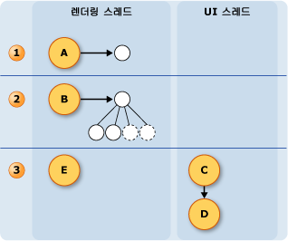

# 잉크 스레딩 모델
잉크 Tablet pc의 이점 중 하나는 마치을 자주 쓰는 것 처럼 일반 펜 및 용지입니다.  태블릿 펜이를 위해은 마우스 사용자 쓰기도 잉크를 렌더링 하는 보다 훨씬 더 높은 속도로 입력된 데이터를 수집 합니다.  응용 프로그램의 사용자 인터페이스 (UI) 스레드는 차단 될 수 있으므로 수집 펜 데이터 및 잉크를 렌더링 하기 위한 충분 하지 않습니다.  이 해결 하는 [!INCLUDE[TLA2#tla_winclient](../../../../includes/tla2sharptla-winclient-md.md)] 응용 프로그램 사용자가 잉크 때 두 개의 추가 스레드를 사용 하 합니다.  
  
 다음 목록에서는 수집 하 고 디지털 잉크를 렌더링에 참여 하는 스레드를 설명 합니다.  
  
-   펜 스레드-스레드 스타일러스의 입력을 가져와서입니다.  (실제로 있지만이 스레드 풀 펜 스레드로 위해이 항목에서는.)  
  
-   응용 프로그램 사용자 인터페이스 스레드 응용 프로그램의 사용자 인터페이스를 제어 하는 스레드입니다.  
  
-   동적 렌더링 스레드-사용자 동안 잉크를 렌더링 하는 스레드 스트로크를 그립니다. 동적 렌더링 스레드는 창 Presentation Foundation에서 설명한 것 처럼 응용 프로그램에 대 한 다른 UI 요소를 렌더링 하는 스레드가 아닌 다른 [스레딩 모델](../../../../docs/framework/wpf/advanced/threading-model.md)합니다.  
  
 응용 프로그램을 사용 하는지 여부를 잉크 모델은 동일한는 <xref:System.Windows.Controls.InkCanvas> 또는 사용자 지정 컨트롤에 있는 것과 유사한 [잉크 입력 컨트롤을 만드는](../../../../docs/framework/wpf/advanced/creating-an-ink-input-control.md)합니다.  이 항목에서는 스레딩의 측면에서 설명 하지만 <xref:System.Windows.Controls.InkCanvas>, 사용자 지정 컨트롤을 만들 때 동일한 개념이 적용 됩니다.  
  
## 스레딩 개요  
 다음 다이어그램은 사용자가 스트로크를 그릴 때 스레딩 모델을 보여줍니다.  
  
 ![스트로크를 그리는 동안 스레딩 모델입니다. ] (../../../../docs/framework/wpf/advanced/media/inkthreading-drawingink.png "InkThreading_DrawingInk")  
  
1.  사용자가 스트로크를 그리는 동안 발생 하는 작업  
  
    1.  사용자가 스트로크 그리면 스타일러스 포인트 펜 스레드에서 제공 됩니다.  스타일러스 플러그 인을 포함 하는 <xref:System.Windows.Input.StylusPlugIns.DynamicRenderer>펜 스레드에서 스타일러스 포인트를 그대로 사용 하 고 전에 수정할 수는 <xref:System.Windows.Controls.InkCanvas> 받으며 합니다.  
  
    2.  <xref:System.Windows.Input.StylusPlugIns.DynamicRenderer> 동적 렌더링 스레드에서 스타일러스 포인트를 렌더링 합니다. 이것은 이전 단계와 같은 시간에 발생합니다.  
  
    3.  <xref:System.Windows.Controls.InkCanvas> UI 스레드에서 스타일러스 포인트를 받습니다.  
  
2.  사용자가 스트로크를 종료 한 후 발생 하는 작업  
  
    1.  사용자가 스트로크를 그리기를 끝내는 <xref:System.Windows.Controls.InkCanvas> 만듭니다는 <xref:System.Windows.Ink.Stroke> 개체에 추가 합니다.는 <xref:System.Windows.Controls.InkPresenter>는 정적으로 렌더링 합니다.  
  
    2.  UI 스레드 경고는 <xref:System.Windows.Input.StylusPlugIns.DynamicRenderer> 획 렌더링 정적으로 하므로 <xref:System.Windows.Input.StylusPlugIns.DynamicRenderer> 획의 시각적 표시를 제거 합니다.  
  
## 잉크 컬렉션과 스타일러스 플러그 인  
 각 <xref:System.Windows.UIElement> 에 <xref:System.Windows.Input.StylusPlugIns.StylusPlugInCollection>합니다.  <xref:System.Windows.Input.StylusPlugIns.StylusPlugIn> 개체에 <xref:System.Windows.Input.StylusPlugIns.StylusPlugInCollection> 수신 및 펜 스레드에서 스타일러스 포인트를 수정할 수 있습니다. <xref:System.Windows.Input.StylusPlugIns.StylusPlugIn> 개체 수신의 순서에 따라 스타일러스 포인트는 <xref:System.Windows.Input.StylusPlugIns.StylusPlugInCollection>합니다.  
  
 다음 다이어그램에서는 가상의 상황에는 <xref:System.Windows.UIElement.StylusPlugIns%2A> 의 컬렉션은 <xref:System.Windows.UIElement> 포함 `stylusPlugin1`, <xref:System.Windows.Input.StylusPlugIns.DynamicRenderer>, 및 `stylusPlugin2`한다는 점에서 순서입니다.  
  
 ![스타일러스 플러그 인 순서가 출력을 영향을 줍니다. ] (../../../../docs/framework/wpf/advanced/media/inkthreading-pluginorder.png "InkThreading_PluginOrder")  
  
 이전 다이어그램에 다음과 같은 동작이 수행이 됩니다.  
  
1.  `StylusPlugin1`x에 대 한 값을 수정 하 고 y 합니다.  
  
2.  <xref:System.Windows.Input.StylusPlugIns.DynamicRenderer>수정된 된 스타일러스 포인트 받아 동적 렌더링 스레드에서 렌더링 합니다.  
  
3.  `StylusPlugin2`수정된 된 스타일러스 포인트를 받아 더욱 x에 대 한 값을 수정 하 고 y 합니다.  
  
4.  응용 프로그램 스타일러스 포인트를 수집 하 고 사용자가 스트로크를 완료 하는 경우 정적으로 렌더링 합니다.  
  
 되었다고 가정 `stylusPlugin1` 스타일러스 포인트 사각형을 제한 하 고 `stylusPlugin2` 오른쪽 스타일러스 포인트를 변환 합니다.  이전 시나리오에서의 <xref:System.Windows.Input.StylusPlugIns.DynamicRenderer> 제한 스타일러스 포인트를 받지만 변환 된 스타일러스 포인트가 없습니다.  사용자가 스트로크를 그리는 경우 사각형의 경계 내에서 stroke 렌더링 되지만 스트로크 펜 들어 올릴 때까지 변환 된 것으로 표시 되지 않습니다.  
  
### 스타일러스 UI 스레드에서 플러그 인으로 작업 수행  
 펜 스레드에서 정확한 적중 테스트를 수행할 수 없으므로 일부 요소가 다른 요소에 스타일러스 입력을 받는 경우도 있습니다. 구독 하 고에 작업을 수행할 작업을 수행 하기 전에 입력이 올바르게 라우트 되도록 해야 하는 경우는 <xref:System.Windows.Input.StylusPlugIns.StylusPlugIn.OnStylusDownProcessed%2A>, <xref:System.Windows.Input.StylusPlugIns.StylusPlugIn.OnStylusMoveProcessed%2A>, 또는 <xref:System.Windows.Input.StylusPlugIns.StylusPlugIn.OnStylusUpProcessed%2A> 메서드. 이러한 메서드는 정확한 적중 테스트 수행 된 후 응용 프로그램 스레드에 의해 호출 됩니다. 이러한 메서드를 등록 하려면 호출 된 <xref:System.Windows.Input.StylusPlugIns.RawStylusInput.NotifyWhenProcessed%2A> 펜 스레드에서 발생 하는 방법에 대 한 메서드.  
  
 다음 다이어그램에서는 펜 스레드와의 스타일러스 이벤트와 관련 하 여 UI 스레드 간의 관계는 <xref:System.Windows.Input.StylusPlugIns.StylusPlugIn>합니다.  
  
 ![잉크 스레딩 모델 &#40; UI 및 펜 &#41; ] (../../../../docs/framework/wpf/advanced/media/inkthreading-plugincallbacks.png "InkThreading_PluginCallbacks")  
  
## 잉크를 렌더링합니다.  
 사용자가 스트로크를 그릴 때 <xref:System.Windows.Input.StylusPlugIns.DynamicRenderer> 잉크 나타납니다 "에서"흐르는 펜 UI 스레드가 사용 중인 경우에 별도 스레드에서 잉크를 렌더링 합니다.  <xref:System.Windows.Input.StylusPlugIns.DynamicRenderer> 스타일러스 포인트를 수집 하면서 동적 렌더링 스레드에서 시각적 트리를 생성 합니다.  사용자가 스트로크를 끝내는 <xref:System.Windows.Input.StylusPlugIns.DynamicRenderer> 는 응용 프로그램은 다음 렌더링 패스를 수행 하는 경우 알림을 받으려면를 요청 합니다.  응용 프로그램에는 다음 렌더링 패스 완료 된 후의 <xref:System.Windows.Input.StylusPlugIns.DynamicRenderer> 시각적 트리를 정리 합니다.  다음 다이어그램에서는이 프로세스를 보여 줍니다.  
  
   
  
1.  사용자가 스트로크를 시작 합니다.  
  
    1.  <xref:System.Windows.Input.StylusPlugIns.DynamicRenderer> 시각적 트리를 만듭니다.  
  
2.  사용자가 스트로크를 그리고 합니다.  
  
    1.  <xref:System.Windows.Input.StylusPlugIns.DynamicRenderer> 시각적 트리를 생성 합니다.  
  
3.  사용자가 스트로크를 종료 합니다.  
  
    1.  <xref:System.Windows.Controls.InkPresenter> 스트로크 해당 시각적 트리의를 추가 합니다.  
  
    2.  미디어 통합 계층 (미 국방) 스트로크를 정적으로 렌더링합니다.  
  
    3.  <xref:System.Windows.Input.StylusPlugIns.DynamicRenderer> 시각적 개체를 정리 합니다.
