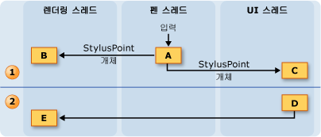
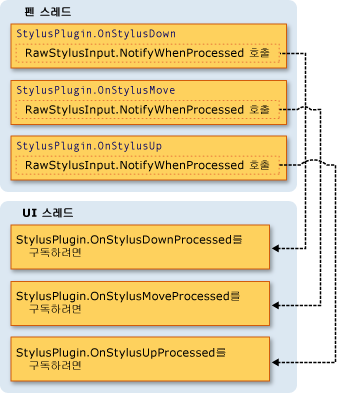

# 잉크 스레딩 모델
Tablet PC의 잉크가 가진 장점 중 하나는 일반 펜과 종이를 사용하여 쓰는 것과 느낌이 매우 비슷하다는 점입니다.  이런 느낌을 위해 태블릿 펜은 마우스보다 훨씬 빠른 속도로 입력 데이터를 수집하여 사용자가 쓸 때 잉크를 렌더링합니다.  응용 프로그램의 UI\(사용자 인터페이스\) 스레드는 차단될 수 있으므로 펜 데이터 입력과 잉크 렌더링에 충분하지 않습니다.  이를 해결하기 위해 [!INCLUDE[TLA2#tla_winclient](../../../../includes/tla2sharptla-winclient-md.md)] 응용 프로그램은 사용자가 잉크로 쓸 때 두 개의 추가적인 스레드를 사용합니다.  
  
 다음 목록에서는 디지털 잉크의 수집과 렌더링에 참여하는 스레드를 설명합니다.  
  
-   펜 스레드 \- 스타일러스에서 입력 내용을 가져오는 스레드입니다.  실제로는 스레드 풀이지만 이 항목에서는 펜 스레드로 지칭합니다.  
  
-   응용 프로그램 사용자 인터페이스 스레드 \- 응용 프로그램의 사용자 인터페이스를 제어하는 스레드입니다.  
  
-   동적 렌더링 스레드 \- 사용자가 스트로크를 그리는 동안 잉크를 렌더링하는 스레드입니다.  Window Presentation Foundation [스레딩 모델](../../../../docs/framework/wpf/advanced/threading-model.md)에서 설명하는 것처럼 동적 렌더링 스레드는 응용 프로그램의 다른 UI 요소를 렌더링하는 스레드와 다릅니다.  
  
 응용 프로그램이 <xref:System.Windows.Controls.InkCanvas> 또는 [잉크 입력 컨트롤 만들기](../../../../docs/framework/wpf/advanced/creating-an-ink-input-control.md)의 컨트롤과 비슷한 사용자 지정 컨트롤 중 어떤 것을 사용하든지 잉크 모델은 동일합니다.  이 항목에서는 스레딩을 <xref:System.Windows.Controls.InkCanvas>의 측면에서 설명하지만 사용자 지정 컨트롤을 만들 때도 같은 개념이 적용됩니다.  
  
## 스레딩 개요  
 다음 다이어그램에서는 사용자가 스트로크를 그릴 때의 스레딩 모델을 보여 줍니다.  
  
   
  
1.  사용자가 스트로크를 그리는 동안 발생하는 작업  
  
    1.  사용자가 스트로크를 그리면 스타일러스 포인트가 펜 스레드에 들어옵니다.  <xref:System.Windows.Input.StylusPlugIns.DynamicRenderer>를 비롯한 스타일러스 플러그 인은 펜 스레드의 스타일러스 포인트를 받으며 <xref:System.Windows.Controls.InkCanvas>가 이를 받기 전에 수정할 기회를 갖습니다.  
  
    2.  <xref:System.Windows.Input.StylusPlugIns.DynamicRenderer>는 스타일러스 포인트를 동적 렌더링 스레드에서 렌더링합니다.  이 작업은 이전 단계와 동시에 수행됩니다.  
  
    3.  <xref:System.Windows.Controls.InkCanvas>는 UI 스레드에서 스타일러스 포인트를 받습니다.  
  
2.  사용자가 스트로크를 끝낸 후 발생하는 작업  
  
    1.  사용자가 스트로크 그리기를 끝내면 <xref:System.Windows.Controls.InkCanvas>가 <xref:System.Windows.Ink.Stroke> 개체를 만들어 정적으로 렌더링하는 <xref:System.Windows.Controls.InkPresenter>에 추가합니다.  
  
    2.  UI 스레드는 스트로크가 정적으로 렌더링된다는 경고를 <xref:System.Windows.Input.StylusPlugIns.DynamicRenderer>에 보내며 <xref:System.Windows.Input.StylusPlugIns.DynamicRenderer>는 스트로크의 시각적 표시를 제거합니다.  
  
## 잉크 컬렉션 및 스타일러스 플러그 인  
 각 <xref:System.Windows.UIElement>에는 <xref:System.Windows.Input.StylusPlugIns.StylusPlugInCollection>이 있습니다.  <xref:System.Windows.Input.StylusPlugIns.StylusPlugInCollection>의 <xref:System.Windows.Input.StylusPlugIns.StylusPlugIn> 개체는 펜 스레드에서 스타일러스 포인트를 받으며 이를 수정할 수 있습니다.  <xref:System.Windows.Input.StylusPlugIns.StylusPlugIn> 개체는 <xref:System.Windows.Input.StylusPlugIns.StylusPlugInCollection>에서의 순서에 따라 스타일러스 포인트를 받습니다.  
  
 다음 다이어그램에서는 <xref:System.Windows.UIElement>의 <xref:System.Windows.UIElement.StylusPlugIns%2A> 컬렉션에 `stylusPlugin1`, <xref:System.Windows.Input.StylusPlugIns.DynamicRenderer> 및 `stylusPlugin2`가 차례대로 포함된 상황을 가정하여 보여 줍니다.  
  
   
  
 이전 다이어그램에서는 다음 동작이 수행됩니다.  
  
1.  `StylusPlugin1`이 x 및 y 값을 수정합니다.  
  
2.  <xref:System.Windows.Input.StylusPlugIns.DynamicRenderer>가 수정된 스타일러스 포인트를 받아 동적 렌더링 스레드에서 렌더링합니다.  
  
3.  `StylusPlugin2`가 수정된 스타일러스 포인트를 받아 x 및 y 값을 추가로 수정합니다.  
  
4.  응용 프로그램은 스타일러스 포인트를 수집하고 사용자가 스트로크를 끝내면 정적으로 렌더링합니다.  
  
 `stylusPlugin1`은 스타일러스 포인트를 사각형으로 제한하고 `stylusPlugin2`는 스타일러스 포인트를 오른쪽으로 변환한다고 가정해 보겠습니다.  앞의 시나리오에서 <xref:System.Windows.Input.StylusPlugIns.DynamicRenderer>는 제한된 스타일러스 포인트를 받지만 이는 변환된 스타일러스 포인트가 아닙니다.  사용자가 스트로크를 그리면 스트로크는 사각형의 경계 내에서 렌더링되지만 사용자가 펜을 들어 올리기 전에는 스트로크가 변환된 것으로 보이지 않습니다.  
  
### UI 스레드에서 스타일러스 플러그 인으로 작업 수행  
 펜 스레드에서는 정확한 적중 테스트를 수행할 수 없으므로 다른 요소에서 받을 스타일러스 입력을 받는 요소가 있을 수 있습니다.  작업을 수행하기 전에 입력이 올바른 경로를 통과하도록 해야 하는 경우에는 <xref:System.Windows.Input.StylusPlugIns.StylusPlugIn.OnStylusDownProcessed%2A>, <xref:System.Windows.Input.StylusPlugIns.StylusPlugIn.OnStylusMoveProcessed%2A> 또는 <xref:System.Windows.Input.StylusPlugIns.StylusPlugIn.OnStylusUpProcessed%2A> 메서드에서 작업을 등록하고 수행합니다.  이들 메서드는 정확한 적중 테스트가 수행된 후 응용 프로그램 스레드에 의해 호출됩니다.  이 메서드에 등록하려면 펜 스레드에서 발생하는 메서드에서 <xref:System.Windows.Input.StylusPlugIns.RawStylusInput.NotifyWhenProcessed%2A> 메서드를 호출합니다.  
  
 다음 다이어그램에서는 <xref:System.Windows.Input.StylusPlugIns.StylusPlugIn>의 스타일러스 이벤트와 관련하여 펜 스레드와 UI 스레드 간의 관계를 보여 줍니다.  
  
   
  
## 잉크 렌더링  
 사용자가 스트로크를 그리면 <xref:System.Windows.Input.StylusPlugIns.DynamicRenderer>가 잉크를 별도의 스레드에서 렌더링하므로 UI 스레드가 사용 중인 경우에도 잉크가 펜에서 "흐르는" 것처럼 보입니다.  <xref:System.Windows.Input.StylusPlugIns.DynamicRenderer>는 스타일러스 포인트를 수집하면서 동적 렌더링 스레드에 시각적 트리를 구축합니다.  사용자가 스트로크를 끝내면 <xref:System.Windows.Input.StylusPlugIns.DynamicRenderer>는 응용 프로그램이 다음 렌더링 패스를 수행할 때 이를 알리도록 요청합니다.  응용 프로그램이 다음 렌더링 패스를 완료하면 <xref:System.Windows.Input.StylusPlugIns.DynamicRenderer>가 시각적 트리를 정리합니다.  다음 다이어그램에서는 이 프로세스를 보여 줍니다.  
  
   
  
1.  사용자가 스트로크를 시작합니다.  
  
    1.  <xref:System.Windows.Input.StylusPlugIns.DynamicRenderer>가 시각적 트리를 만듭니다.  
  
2.  사용자가 스트로크를 그리고 있습니다.  
  
    1.  <xref:System.Windows.Input.StylusPlugIns.DynamicRenderer>가 시각적 트리를 구축합니다.  
  
3.  사용자가 스트로크를 종료합니다.  
  
    1.  <xref:System.Windows.Controls.InkPresenter>가 시각적 트리에 스트로크를 추가합니다.  
  
    2.  MIL\(Media Integration Layer\)이 정적으로 스트로크를 렌더링합니다.  
  
    3.  <xref:System.Windows.Input.StylusPlugIns.DynamicRenderer>가 시각적 표시를 정리합니다.