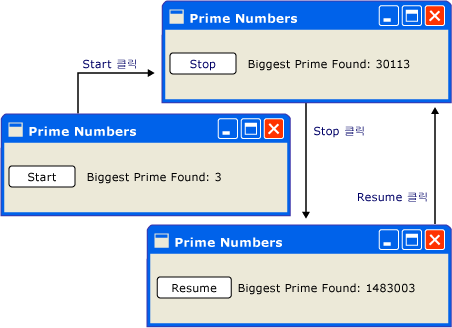
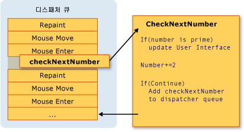
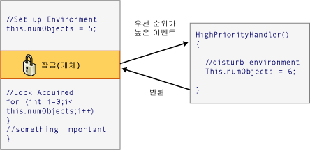

# 스레딩 모델Threading Model
[!INCLUDE[TLA#tla_winclient](../../../../includes/tlasharptla-winclient-md.md)]는 개발자가 스레딩의 어려움을 해결하도록 디자인되어 있습니다. is designed to save developers from the difficulties of threading. 결과적으로 대부분의 [!INCLUDE[TLA2#tla_winclient](../../../../includes/tla2sharptla-winclient-md.md)] 개발자를 둘 이상의 스레드를 사용 하는 인터페이스를 작성할 필요가 없습니다.As a result, the majority of [!INCLUDE[TLA2#tla_winclient](../../../../includes/tla2sharptla-winclient-md.md)] developers won't have to write an interface that uses more than one thread. 다중 스레드 프로그램은 복잡하고 디버그하기 어려우므로 단일 스레드 솔루션이 있을 경우 피해야 합니다.Because multithreaded programs are complex and difficult to debug, they should be avoided when single-threaded solutions exist.  
  
 그러나에 관계 없이 얼마나 잘 설계, 아니요 [!INCLUDE[TLA2#tla_ui](../../../../includes/tla2sharptla-ui-md.md)] 프레임 워크 됩니다도 모든 종류의 문제에 대 한 단일 스레드 솔루션을 제공할 수 있습니다.No matter how well architected, however, no [!INCLUDE[TLA2#tla_ui](../../../../includes/tla2sharptla-ui-md.md)] framework will ever be able to provide a single-threaded solution for every sort of problem. [!INCLUDE[TLA2#tla_winclient](../../../../includes/tla2sharptla-winclient-md.md)]여러 스레드 향상 시킬 경우 여전히 하지만 [!INCLUDE[TLA#tla_ui](../../../../includes/tlasharptla-ui-md.md)] 응답성 또는 응용 프로그램 성능입니다. comes close, but there are still situations where multiple threads improve [!INCLUDE[TLA#tla_ui](../../../../includes/tlasharptla-ui-md.md)] responsiveness or application performance. 일부 배경 자료를 설명한 후 이 문서에서는 이러한 상황 중 일부를 살펴보고 몇몇 하위 수준 세부 정보에 대한 설명으로 마무리 짓습니다.After discussing some background material, this paper explores some of these situations and then concludes with a discussion of some lower-level details.  
  

  
> [!NOTE]
>  이 항목에서는 사용 하 여 스레딩 설명는 <xref:System.Windows.Threading.Dispatcher.BeginInvoke%2A> 메서드에 대 한 비동기 호출입니다.This topic discusses threading by using the <xref:System.Windows.Threading.Dispatcher.BeginInvoke%2A> method for asynchronous calls. 또한 호출 하 여 비동기 호출을 만들 수는 <xref:System.Windows.Threading.Dispatcher.InvokeAsync%2A> 메서드를 사용 하는 <xref:System.Action> 또는 <xref:System.Func%601> 매개 변수로 합니다.You can also make asynchronous calls by calling the <xref:System.Windows.Threading.Dispatcher.InvokeAsync%2A> method, which take an <xref:System.Action> or <xref:System.Func%601> as a parameter.  <xref:System.Windows.Threading.Dispatcher.InvokeAsync%2A> 메서드가 반환 되는 <xref:System.Windows.Threading.DispatcherOperation> 또는 <xref:System.Windows.Threading.DispatcherOperation%601>을는 <xref:System.Windows.Threading.DispatcherOperation.Task%2A> 속성입니다.The <xref:System.Windows.Threading.Dispatcher.InvokeAsync%2A> method returns a <xref:System.Windows.Threading.DispatcherOperation> or <xref:System.Windows.Threading.DispatcherOperation%601>, which has a <xref:System.Windows.Threading.DispatcherOperation.Task%2A> property. 사용할 수 있습니다는 `await` 사용 하 여 키워드는 <xref:System.Windows.Threading.DispatcherOperation> 관련 <xref:System.Threading.Tasks.Task>합니다.You can use the `await` keyword with either the <xref:System.Windows.Threading.DispatcherOperation> or the associated <xref:System.Threading.Tasks.Task>. 동기적으로 대기 하는 경우는 <xref:System.Threading.Tasks.Task> 에서 반환 하는 <xref:System.Windows.Threading.DispatcherOperation> 또는 <xref:System.Windows.Threading.DispatcherOperation%601>, 호출의 <xref:System.Windows.Threading.TaskExtensions.DispatcherOperationWait%2A> 확장 메서드.If you need to wait synchronously for the <xref:System.Threading.Tasks.Task> that is returned by a <xref:System.Windows.Threading.DispatcherOperation> or <xref:System.Windows.Threading.DispatcherOperation%601>, call the <xref:System.Windows.Threading.TaskExtensions.DispatcherOperationWait%2A> extension method.  호출 <xref:System.Threading.Tasks.Task.Wait%2A?displayProperty=nameWithType> 교착 상태가 발생 합니다.Calling <xref:System.Threading.Tasks.Task.Wait%2A?displayProperty=nameWithType> will result in a deadlock. 사용 하는 방법에 대 한 자세한 내용은 <xref:System.Threading.Tasks.Task> 비동기 작업을 수행 하려면 작업 병렬 처리를 참조 하십시오.For more information about using a <xref:System.Threading.Tasks.Task> to perform asynchronous operations, see Task Parallelism.  <xref:System.Windows.Threading.Dispatcher.Invoke%2A> 메서드 역시를 받아들이는 오버 로드는 <xref:System.Action> 또는 <xref:System.Func%601> 매개 변수로 합니다.The <xref:System.Windows.Threading.Dispatcher.Invoke%2A> method also has overloads that take an <xref:System.Action> or <xref:System.Func%601> as a parameter.  사용할 수는 <xref:System.Windows.Threading.Dispatcher.Invoke%2A> 대리자를 전달 하 여 호출 하는 메서드를 동기 <xref:System.Action> 또는 <xref:System.Func%601>합니다.You can use the <xref:System.Windows.Threading.Dispatcher.Invoke%2A> method to make synchronous calls by passing in a delegate, <xref:System.Action> or <xref:System.Func%601>.  
  
   
## 개요 및 디스패처Overview and the Dispatcher  
 일반적으로 [!INCLUDE[TLA2#tla_winclient](../../../../includes/tla2sharptla-winclient-md.md)] 2 개의 스레드가 있는 응용 프로그램 시작: 렌더링 및 관리 하기 위한 다른 처리는 [!INCLUDE[TLA2#tla_ui](../../../../includes/tla2sharptla-ui-md.md)]합니다.Typically, [!INCLUDE[TLA2#tla_winclient](../../../../includes/tla2sharptla-winclient-md.md)] applications start with two threads: one for handling rendering and another for managing the [!INCLUDE[TLA2#tla_ui](../../../../includes/tla2sharptla-ui-md.md)]. 렌더링 스레드에서 효과적으로 실행 되는 동안 백그라운드에서 숨겨진는 [!INCLUDE[TLA2#tla_ui](../../../../includes/tla2sharptla-ui-md.md)] 스레드 입력을 받고, 이벤트를 처리, 화면을 그리며 및 응용 프로그램 코드를 실행 합니다.The rendering thread effectively runs hidden in the background while the [!INCLUDE[TLA2#tla_ui](../../../../includes/tla2sharptla-ui-md.md)] thread receives input, handles events, paints the screen, and runs application code. 대부분의 응용 프로그램 하나만 사용 [!INCLUDE[TLA2#tla_ui](../../../../includes/tla2sharptla-ui-md.md)] 상황에 따라 몇 가지를 사용 하는 스레드입니다.Most applications use a single [!INCLUDE[TLA2#tla_ui](../../../../includes/tla2sharptla-ui-md.md)] thread, although in some situations it is best to use several. 나중에 예제를 통해 이를 설명하겠습니다.We’ll discuss this with an example later.  
  
 [!INCLUDE[TLA2#tla_ui](../../../../includes/tla2sharptla-ui-md.md)] 스레드 큐에 작업 항목을 호출 하는 개체는 <xref:System.Windows.Threading.Dispatcher>합니다.The [!INCLUDE[TLA2#tla_ui](../../../../includes/tla2sharptla-ui-md.md)] thread queues work items inside an object called a <xref:System.Windows.Threading.Dispatcher>. <xref:System.Windows.Threading.Dispatcher>는 우선 순위에 따라 작업 항목을 선택하고 각 작업 항목을 완료할 때까지 실행합니다.The <xref:System.Windows.Threading.Dispatcher> selects work items on a priority basis and runs each one to completion.  모든 [!INCLUDE[TLA2#tla_ui](../../../../includes/tla2sharptla-ui-md.md)] 스레드 하나 이상 있어야 <xref:System.Windows.Threading.Dispatcher>, 및 각 <xref:System.Windows.Threading.Dispatcher> 정확히 하나의 스레드에서 작업 항목을 실행할 수 있습니다.Every [!INCLUDE[TLA2#tla_ui](../../../../includes/tla2sharptla-ui-md.md)] thread must have at least one <xref:System.Windows.Threading.Dispatcher>, and each <xref:System.Windows.Threading.Dispatcher> can execute work items in exactly one thread.  
  
 최대화 하는 것을 친숙 하 게 응답 응용 프로그램을 빌드하는 트릭은 <xref:System.Windows.Threading.Dispatcher> 작은 작업 항목을 유지 하 여 처리량입니다.The trick to building responsive, user-friendly applications is to maximize the <xref:System.Windows.Threading.Dispatcher> throughput by keeping the work items small. 이 방법을 사용 하면 항목 가져오지에 부실는 <xref:System.Windows.Threading.Dispatcher> 큐 처리를 위해 대기 합니다.This way items never get stale sitting in the <xref:System.Windows.Threading.Dispatcher> queue waiting for processing. 입력과 응답 간의 인식할 수 있는 지연으로 인해 사용자가 불편해질 수 있습니다.Any perceivable delay between input and response can frustrate a user.  
  
 어떻게 [!INCLUDE[TLA2#tla_winclient](../../../../includes/tla2sharptla-winclient-md.md)] 큰 작업을 처리 응용 프로그램 할까요?How then are [!INCLUDE[TLA2#tla_winclient](../../../../includes/tla2sharptla-winclient-md.md)] applications supposed to handle big operations? 코드에 큰 계산을 포함하거나 몇몇 원격 서버에서 데이터베이스를 쿼리해야 하면 어떻게 될까요?What if your code involves a large calculation or needs to query a database on some remote server? 큰는 별도 스레드에서 작업을 처리 하도록 대답은 일반적으로 [!INCLUDE[TLA2#tla_ui](../../../../includes/tla2sharptla-ui-md.md)] 스레드가의 항목에는 <xref:System.Windows.Threading.Dispatcher> 큐입니다.Usually, the answer is to handle the big operation in a separate thread, leaving the [!INCLUDE[TLA2#tla_ui](../../../../includes/tla2sharptla-ui-md.md)] thread free to tend to items in the <xref:System.Windows.Threading.Dispatcher> queue. 큰 작업이 완료 되 면 해당 결과 보고할 수 있어 다시는 [!INCLUDE[TLA2#tla_ui](../../../../includes/tla2sharptla-ui-md.md)] 디스플레이 대 한 스레드입니다.When the big operation is complete, it can report its result back to the [!INCLUDE[TLA2#tla_ui](../../../../includes/tla2sharptla-ui-md.md)] thread for display.  
  
 지금까지 [!INCLUDE[TLA#tla_mswin](../../../../includes/tlasharptla-mswin-md.md)] 허용 [!INCLUDE[TLA2#tla_ui](../../../../includes/tla2sharptla-ui-md.md)] 요소를 사용 하는 스레드를 만든만 액세스할 수 있습니다.Historically, [!INCLUDE[TLA#tla_mswin](../../../../includes/tlasharptla-mswin-md.md)] allows [!INCLUDE[TLA2#tla_ui](../../../../includes/tla2sharptla-ui-md.md)] elements to be accessed only by the thread that created them. 즉, 일부 장기 실행 작업을 처리하는 백그라운드 스레드는 작업이 완료될 때 입력란을 업데이트할 수 없습니다.This means that a background thread in charge of some long-running task cannot update a text box when it is finished. [!INCLUDE[TLA#tla_mswin](../../../../includes/tlasharptla-mswin-md.md)]무결성을 보장 하는 [!INCLUDE[TLA2#tla_ui](../../../../includes/tla2sharptla-ui-md.md)] 구성 요소입니다. does this to ensure the integrity of [!INCLUDE[TLA2#tla_ui](../../../../includes/tla2sharptla-ui-md.md)] components. 목록 상자의 콘텐츠가 그리는 동안 백그라운드 스레드를 통해 업데이트되면 목록 상자가 이상하게 표시될 수 있습니다.A list box could look strange if its contents were updated by a background thread during painting.  
  
 [!INCLUDE[TLA2#tla_winclient](../../../../includes/tla2sharptla-winclient-md.md)]에는 이 조정을 적용하는 기본 제공 상호 배제 메커니즘이 있습니다. has a built-in mutual exclusion mechanism that enforces this coordination. 대부분의 클래스에 [!INCLUDE[TLA2#tla_winclient](../../../../includes/tla2sharptla-winclient-md.md)] 에서 파생 <xref:System.Windows.Threading.DispatcherObject>합니다.Most classes in [!INCLUDE[TLA2#tla_winclient](../../../../includes/tla2sharptla-winclient-md.md)] derive from <xref:System.Windows.Threading.DispatcherObject>. 생성 시는 <xref:System.Windows.Threading.DispatcherObject> 저장에 대 한 참조는 <xref:System.Windows.Threading.Dispatcher> 현재 실행 중인 스레드에 연결 합니다.At construction, a <xref:System.Windows.Threading.DispatcherObject> stores a reference to the <xref:System.Windows.Threading.Dispatcher> linked to the currently running thread. 실제로 <xref:System.Windows.Threading.DispatcherObject> 을 만든 스레드에 연결 합니다.In effect, the <xref:System.Windows.Threading.DispatcherObject> associates with the thread that creates it. 프로그램 실행 중 한 <xref:System.Windows.Threading.DispatcherObject> 해당 공용을 호출할 수 <xref:System.Windows.Threading.DispatcherObject.VerifyAccess%2A> 메서드.During program execution, a <xref:System.Windows.Threading.DispatcherObject> can call its public <xref:System.Windows.Threading.DispatcherObject.VerifyAccess%2A> method. <xref:System.Windows.Threading.DispatcherObject.VerifyAccess%2A>검사 하는 <xref:System.Windows.Threading.Dispatcher> 현재 스레드와 연결 된 해시와 비교 하 여 <xref:System.Windows.Threading.Dispatcher> 생성 시 저장 된 참조입니다.<xref:System.Windows.Threading.DispatcherObject.VerifyAccess%2A> examines the <xref:System.Windows.Threading.Dispatcher> associated with the current thread and compares it to the <xref:System.Windows.Threading.Dispatcher> reference stored during construction. 일치 하지 않으면 <xref:System.Windows.Threading.DispatcherObject.VerifyAccess%2A> 예외를 throw 합니다.If they don’t match, <xref:System.Windows.Threading.DispatcherObject.VerifyAccess%2A> throws an exception. <xref:System.Windows.Threading.DispatcherObject.VerifyAccess%2A>에 속한 모든 메서드의 시작 부분에서 호출 하기 위한 용도가 <xref:System.Windows.Threading.DispatcherObject>합니다.<xref:System.Windows.Threading.DispatcherObject.VerifyAccess%2A> is intended to be called at the beginning of every method belonging to a <xref:System.Windows.Threading.DispatcherObject>.  
  
 경우에 하나의 스레드를 수정할 수는 [!INCLUDE[TLA2#tla_ui](../../../../includes/tla2sharptla-ui-md.md)], 사용자와 백그라운드 스레드 상호 작용?If only one thread can modify the [!INCLUDE[TLA2#tla_ui](../../../../includes/tla2sharptla-ui-md.md)], how do background threads interact with the user? 백그라운드 스레드를 요청할 수는 [!INCLUDE[TLA2#tla_ui](../../../../includes/tla2sharptla-ui-md.md)] 대신에 대 한 작업을 수행 하는 스레드입니다.A background thread can ask the [!INCLUDE[TLA2#tla_ui](../../../../includes/tla2sharptla-ui-md.md)] thread to perform an operation on its behalf. 작업 항목을 등록 하 여 수행 된 <xref:System.Windows.Threading.Dispatcher> 의 [!INCLUDE[TLA2#tla_ui](../../../../includes/tla2sharptla-ui-md.md)] 스레드 합니다.It does this by registering a work item with the <xref:System.Windows.Threading.Dispatcher> of the [!INCLUDE[TLA2#tla_ui](../../../../includes/tla2sharptla-ui-md.md)] thread. <xref:System.Windows.Threading.Dispatcher> 클래스에서는 작업 항목을 등록 하기 위한 두 가지 방법: <xref:System.Windows.Threading.Dispatcher.Invoke%2A> 및 <xref:System.Windows.Threading.Dispatcher.BeginInvoke%2A>합니다.The <xref:System.Windows.Threading.Dispatcher> class provides two methods for registering work items: <xref:System.Windows.Threading.Dispatcher.Invoke%2A> and <xref:System.Windows.Threading.Dispatcher.BeginInvoke%2A>. 메서드는 둘 다 대리자 실행을 예약합니다.Both methods schedule a delegate for execution. <xref:System.Windows.Threading.Dispatcher.Invoke%2A>동기 호출 – 즉, 될 때까지 반환 하지 않습니다는 [!INCLUDE[TLA2#tla_ui](../../../../includes/tla2sharptla-ui-md.md)] 스레드가 실제로 대리자를 실행을 완료 합니다.<xref:System.Windows.Threading.Dispatcher.Invoke%2A> is a synchronous call – that is, it doesn’t return until the [!INCLUDE[TLA2#tla_ui](../../../../includes/tla2sharptla-ui-md.md)] thread actually finishes executing the delegate. <xref:System.Windows.Threading.Dispatcher.BeginInvoke%2A>비동기 및 즉시 반환 합니다.<xref:System.Windows.Threading.Dispatcher.BeginInvoke%2A> is asynchronous and returns immediately.  
  
 <xref:System.Windows.Threading.Dispatcher> 우선 순위에 따라 큐에는 요소를 정렬 합니다.The <xref:System.Windows.Threading.Dispatcher> orders the elements in its queue by priority. 에 요소를 추가 하는 경우에 지정 될 수 있는 10 개의 수준이 고 <xref:System.Windows.Threading.Dispatcher> 큐입니다.There are ten levels that may be specified when adding an element to the <xref:System.Windows.Threading.Dispatcher> queue. 이러한 우선 순위에서 유지 관리는 <xref:System.Windows.Threading.DispatcherPriority> 열거형입니다.These priorities are maintained in the <xref:System.Windows.Threading.DispatcherPriority> enumeration. 에 대 한 자세한 정보 <xref:System.Windows.Threading.DispatcherPriority> 수준에서 확인할 수 있습니다는 [!INCLUDE[TLA2#tla_winfxsdk](../../../../includes/tla2sharptla-winfxsdk-md.md)] 설명서입니다.Detailed information about <xref:System.Windows.Threading.DispatcherPriority> levels can be found in the [!INCLUDE[TLA2#tla_winfxsdk](../../../../includes/tla2sharptla-winfxsdk-md.md)] documentation.  
  
   
## 사용 중인 스레드: 샘플Threads in Action: The Samples  
  
   
### 장기 실행 계산이 포함된 단일 스레드 응용 프로그램A Single-Threaded Application with a Long-Running Calculation  
 대부분 [!INCLUDE[TLA#tla_gui#plural](../../../../includes/tlasharptla-guisharpplural-md.md)] 시간 사용자 상호 작용에 대 한 응답으로 생성 된 이벤트를 기다리는 동안 유휴 상태로의 많은 부분을 소비 합니다.Most [!INCLUDE[TLA#tla_gui#plural](../../../../includes/tlasharptla-guisharpplural-md.md)] spend a large portion of their time idle while waiting for events that are generated in response to user interactions. 신중 하 게 프로그래밍이 유휴 시간 없이 사용할 수을 생산적으로의 응답성에 영향을 주지는 [!INCLUDE[TLA2#tla_ui](../../../../includes/tla2sharptla-ui-md.md)]합니다.With careful programming this idle time can be used constructively, without affecting the responsiveness of the [!INCLUDE[TLA2#tla_ui](../../../../includes/tla2sharptla-ui-md.md)]. [!INCLUDE[TLA2#tla_winclient](../../../../includes/tla2sharptla-winclient-md.md)] 스레딩 모델에서 발생 하는 작업을 중단 하는 입력을 허용 하지 않습니다는 [!INCLUDE[TLA2#tla_ui](../../../../includes/tla2sharptla-ui-md.md)] 스레드입니다.The [!INCLUDE[TLA2#tla_winclient](../../../../includes/tla2sharptla-winclient-md.md)] threading model doesn’t allow input to interrupt an operation happening in the [!INCLUDE[TLA2#tla_ui](../../../../includes/tla2sharptla-ui-md.md)] thread. 즉, 돌아가려면 확인 해야는 <xref:System.Windows.Threading.Dispatcher> 부실 해지기 전에 입력된 이벤트 보류 중인 프로세스에 주기적으로 합니다.This means you must be sure to return to the <xref:System.Windows.Threading.Dispatcher> periodically to process pending input events before they get stale.  
  
 다음 예제를 참조하세요.Consider the following example:  
  
   
  
 이 간단한 응용 프로그램은 3부터 위쪽으로 계산하여 소수를 검색합니다.This simple application counts upwards from three, searching for prime numbers. 사용자가 클릭할 때는 **시작** 단추, 검색을 시작 합니다.When the user clicks the **Start** button, the search begins. 프로그램이 소수를 찾으면 검색 결과로 사용자 인터페이스를 업데이트합니다.When the program finds a prime, it updates the user interface with its discovery. 이때 사용자가 검색을 중지할 수 있습니다.At any point, the user can stop the search.  
  
 간단한 방법이지만 소수 검색이 영원히 계속될 수 있는 문제가 있습니다.Although simple enough, the prime number search could go on forever, which presents some difficulties.  제공 되지 않습니다 단추의 click 이벤트 처리기 안에서 전체 검색을 처리 하는 경우는 [!INCLUDE[TLA2#tla_ui](../../../../includes/tla2sharptla-ui-md.md)] 스레드 다른 이벤트를 처리할 수 있습니다.If we handled the entire search inside of the click event handler of the button, we would never give the [!INCLUDE[TLA2#tla_ui](../../../../includes/tla2sharptla-ui-md.md)] thread a chance to handle other events. [!INCLUDE[TLA2#tla_ui](../../../../includes/tla2sharptla-ui-md.md)] 없을 것 입력 또는 프로세스에 응답 메시지입니다.The [!INCLUDE[TLA2#tla_ui](../../../../includes/tla2sharptla-ui-md.md)] would be unable to respond to input or process messages. 다시 표시되지 않으며 단추 클릭에 응답하지 않습니다.It would never repaint and never respond to button clicks.  
  
 소수 검색을 별도의 스레드에서 수행할 수 있지만 이 경우 동기화 문제를 처리해야 합니다.We could conduct the prime number search in a separate thread, but then we would need to deal with synchronization issues. 단일 스레드 방법을 통해 발견된 가장 큰 소수를 나열하는 레이블을 직접 업데이트할 수 있습니다.With a single-threaded approach, we can directly update the label that lists the largest prime found.  
  
 관리 가능한 청크로 계산 작업을 나누고 म म 주기적으로 돌아갈 수는 <xref:System.Windows.Threading.Dispatcher> 이벤트 및 처리 합니다.If we break up the task of calculation into manageable chunks, we can periodically return to the <xref:System.Windows.Threading.Dispatcher> and process events. 제공할 수 [!INCLUDE[TLA2#tla_winclient](../../../../includes/tla2sharptla-winclient-md.md)] 다시 그려야 하 고 입력을 처리할 수 있습니다.We can give [!INCLUDE[TLA2#tla_winclient](../../../../includes/tla2sharptla-winclient-md.md)] an opportunity to repaint and process input.  
  
 계산을 관리 하는 계산 및 이벤트 처리 간 처리 시간을 분할 하는 가장 좋은 방법은 <xref:System.Windows.Threading.Dispatcher>합니다.The best way to split processing time between calculation and event handling is to manage calculation from the <xref:System.Windows.Threading.Dispatcher>. 사용 하 여는 <xref:System.Windows.Threading.Dispatcher.BeginInvoke%2A> 메서드를에서 소수 검사를 예약할 수 있습니다 동일한 큐 [!INCLUDE[TLA2#tla_ui](../../../../includes/tla2sharptla-ui-md.md)] 이벤트에서 가져온 것입니다.By using the <xref:System.Windows.Threading.Dispatcher.BeginInvoke%2A> method, we can schedule prime number checks in the same queue that [!INCLUDE[TLA2#tla_ui](../../../../includes/tla2sharptla-ui-md.md)] events are drawn from. 예제에서는 단일 소수 검사를 한 번만 예약합니다.In our example, we schedule only a single prime number check at a time. 소수 검사가 완료된 후 즉시 다음 검사를 예약합니다.After the prime number check is complete, we schedule the next check immediately. 보류 중인이 검사 후에 진행 됩니다 [!INCLUDE[TLA2#tla_ui](../../../../includes/tla2sharptla-ui-md.md)] 이벤트가 처리 되었습니다.This check proceeds only after pending [!INCLUDE[TLA2#tla_ui](../../../../includes/tla2sharptla-ui-md.md)] events have been handled.  
  
   
  
 [!INCLUDE[TLA#tla_word](../../../../includes/tlasharptla-word-md.md)]에서는 이 메커니즘을 사용하여 맞춤법 검사를 수행합니다. accomplishes spell checking using this mechanism. 맞춤법 검사의 유휴 시간을 사용 하 여 백그라운드에서 수행 되는 [!INCLUDE[TLA2#tla_ui](../../../../includes/tla2sharptla-ui-md.md)] 스레드입니다.Spell checking is done in the background using the idle time of the [!INCLUDE[TLA2#tla_ui](../../../../includes/tla2sharptla-ui-md.md)] thread. 코드를 살펴보겠습니다.Let's take a look at the code.  
  
 다음 예제에서는 사용자 인터페이스를 만드는 XAML을 보여 줍니다.The following example shows the XAML that creates the user interface.  
  
 [!code-xaml[ThreadingPrimeNumbers#ThreadingPrimeNumberXAML](../../../../samples/snippets/csharp/VS_Snippets_Wpf/ThreadingPrimeNumbers/CSharp/Window1.xaml#threadingprimenumberxaml)]  
  
 다음 예제에서는 코드 숨김을 보여 줍니다.The following example shows the code-behind.  
  
 [!code-csharp[ThreadingPrimeNumbers#ThreadingPrimeNumberCodeBehind](../../../../samples/snippets/csharp/VS_Snippets_Wpf/ThreadingPrimeNumbers/CSharp/Window1.xaml.cs#threadingprimenumbercodebehind)]
 [!code-vb[ThreadingPrimeNumbers#ThreadingPrimeNumberCodeBehind](../../../../samples/snippets/visualbasic/VS_Snippets_Wpf/ThreadingPrimeNumbers/visualbasic/mainwindow.xaml.vb#threadingprimenumbercodebehind)]  
  
 다음 예제에 대 한 이벤트 처리기는 <xref:System.Windows.Controls.Button>합니다.The following example shows the event handler for the <xref:System.Windows.Controls.Button>.  
  
 [!code-csharp[ThreadingPrimeNumbers#ThreadingPrimeNumberStartOrStop](../../../../samples/snippets/csharp/VS_Snippets_Wpf/ThreadingPrimeNumbers/CSharp/Window1.xaml.cs#threadingprimenumberstartorstop)]
 [!code-vb[ThreadingPrimeNumbers#ThreadingPrimeNumberStartOrStop](../../../../samples/snippets/visualbasic/VS_Snippets_Wpf/ThreadingPrimeNumbers/visualbasic/mainwindow.xaml.vb#threadingprimenumberstartorstop)]  
  
 텍스트를 업데이트 외에도 <xref:System.Windows.Controls.Button>,이 처리기는 대리자를 추가 하 여 첫 번째 소수 검사를 예약 하는 데는 <xref:System.Windows.Threading.Dispatcher> 큐입니다.Besides updating the text on the <xref:System.Windows.Controls.Button>, this handler is responsible for scheduling the first prime number check by adding a delegate to the <xref:System.Windows.Threading.Dispatcher> queue. 이 이벤트 처리기에는 해당 작업을 완료 된 후 어느는 <xref:System.Windows.Threading.Dispatcher> 실행을 위해이 대리자를 선택 합니다.Sometime after this event handler has completed its work, the <xref:System.Windows.Threading.Dispatcher> will select this delegate for execution.  
  
 앞에서 설명한 것 처럼 <xref:System.Windows.Threading.Dispatcher.BeginInvoke%2A> 는 <xref:System.Windows.Threading.Dispatcher> 실행에 대 한 대리자를 예약 하는 데 사용 되는 멤버입니다.As we mentioned earlier, <xref:System.Windows.Threading.Dispatcher.BeginInvoke%2A> is the <xref:System.Windows.Threading.Dispatcher> member used to schedule a delegate for execution. 선택이 경우에 <xref:System.Windows.Threading.DispatcherPriority.SystemIdle> 우선 순위입니다.In this case, we choose the <xref:System.Windows.Threading.DispatcherPriority.SystemIdle> priority. <xref:System.Windows.Threading.Dispatcher> 없는 중요 한 이벤트를 처리할 경우에이 대리자를 실행 합니다.The <xref:System.Windows.Threading.Dispatcher> will execute this delegate only when there are no important events to process. [!INCLUDE[TLA2#tla_ui](../../../../includes/tla2sharptla-ui-md.md)] 응답성이 숫자 검사보다 더 중요합니다. responsiveness is more important than number checking. 또한 숫자 검사 루틴을 표현하는 새 대리자를 전달합니다.We also pass a new delegate representing the number-checking routine.  
  
 [!code-csharp[ThreadingPrimeNumbers#ThreadingPrimeNumberCheckNextNumber](../../../../samples/snippets/csharp/VS_Snippets_Wpf/ThreadingPrimeNumbers/CSharp/Window1.xaml.cs#threadingprimenumberchecknextnumber)]
 [!code-vb[ThreadingPrimeNumbers#ThreadingPrimeNumberCheckNextNumber](../../../../samples/snippets/visualbasic/VS_Snippets_Wpf/ThreadingPrimeNumbers/visualbasic/mainwindow.xaml.vb#threadingprimenumberchecknextnumber)]  
  
 이 메서드는 다음 홀수가 소수인지 확인합니다.This method checks if the next odd number is prime. 메서드를 직접 업데이트 프라임 인 경우는 `bigPrime` <xref:System.Windows.Controls.TextBlock> 해당 검색을 반영 하도록 합니다.If it is prime, the method directly updates the `bigPrime`<xref:System.Windows.Controls.TextBlock> to reflect its discovery. 구성 요소를 만드는 데 사용된 같은 스레드에서 계산이 수행되므로 이 작업을 수행할 수 있습니다.We can do this because the calculation is occurring in the same thread that was used to create the component. 계산에 대 한 별도 스레드를 사용 하도록 선택 했습니다, 해야 더 복잡 한 동기화 메커니즘을 사용 하 고 업데이트를 실행의 [!INCLUDE[TLA2#tla_ui](../../../../includes/tla2sharptla-ui-md.md)] 스레드입니다.Had we chosen to use a separate thread for the calculation, we would have to use a more complicated synchronization mechanism and execute the update in the [!INCLUDE[TLA2#tla_ui](../../../../includes/tla2sharptla-ui-md.md)] thread. 이 상황은 다음에 살펴보겠습니다.We’ll demonstrate this situation next.  
  
 이 샘플의 전체 소스 코드에 대 한 참조는 [장기 실행 계산 샘플에는 단일 응용 프로그램](http://go.microsoft.com/fwlink/?LinkID=160038)For the complete source code for this sample, see the [Single-Threaded Application with Long-Running Calculation Sample](http://go.microsoft.com/fwlink/?LinkID=160038)  
  
   
### 백그라운드 스레드를 사용하여 차단 작업 처리Handling a Blocking Operation with a Background Thread  
 그래픽 응용 프로그램에서 차단 작업을 처리하는 것은 어려울 수 있습니다.Handling blocking operations in a graphical application can be difficult. 응용 프로그램이 고정된 것처럼 보이므로 이벤트 처리기에서 차단 메서드를 호출하려고 하지 않습니다.We don’t want to call blocking methods from event handlers because the application will appear to freeze up. 별도 스레드를 사용 하 여 이러한 작업을 처리할 수 있습니다 하지만, 완료 시와 동기화 해야는 [!INCLUDE[TLA2#tla_ui](../../../../includes/tla2sharptla-ui-md.md)] 직접 수정할 수 없으므로 스레드는 [!INCLUDE[TLA2#tla_gui](../../../../includes/tla2sharptla-gui-md.md)] 작업자 스레드에서 합니다.We can use a separate thread to handle these operations, but when we’re done, we have to synchronize with the [!INCLUDE[TLA2#tla_ui](../../../../includes/tla2sharptla-ui-md.md)] thread because we can’t directly modify the [!INCLUDE[TLA2#tla_gui](../../../../includes/tla2sharptla-gui-md.md)] from our worker thread. 사용할 수 <xref:System.Windows.Threading.Dispatcher.Invoke%2A> 또는 <xref:System.Windows.Threading.Dispatcher.BeginInvoke%2A> 에 대리자를 삽입 하는 <xref:System.Windows.Threading.Dispatcher> 의 [!INCLUDE[TLA2#tla_ui](../../../../includes/tla2sharptla-ui-md.md)] 스레드입니다.We can use <xref:System.Windows.Threading.Dispatcher.Invoke%2A> or <xref:System.Windows.Threading.Dispatcher.BeginInvoke%2A> to insert delegates into the <xref:System.Windows.Threading.Dispatcher> of the [!INCLUDE[TLA2#tla_ui](../../../../includes/tla2sharptla-ui-md.md)] thread. 이러한 대리자를 실행 하는 수정할 수 있는 권한을 가진는 결국 [!INCLUDE[TLA2#tla_ui](../../../../includes/tla2sharptla-ui-md.md)] 요소입니다.Eventually, these delegates will be executed with permission to modify [!INCLUDE[TLA2#tla_ui](../../../../includes/tla2sharptla-ui-md.md)] elements.  
  
 이 예제에서는 날씨 예보를 검색하는 원격 프로시저 호출을 모방합니다.In this example, we mimic a remote procedure call that retrieves a weather forecast. 이 호출을 실행 하는 별도 작업자 스레드가 사용 하 고 예약의 update 메서드는 <xref:System.Windows.Threading.Dispatcher> 의 [!INCLUDE[TLA2#tla_ui](../../../../includes/tla2sharptla-ui-md.md)] 끝나면 스레드입니다.We use a separate worker thread to execute this call, and we schedule an update method in the <xref:System.Windows.Threading.Dispatcher> of the [!INCLUDE[TLA2#tla_ui](../../../../includes/tla2sharptla-ui-md.md)] thread when we’re finished.  
  
   
  
 [!code-csharp[ThreadingWeatherForecast#ThreadingWeatherCodeBehind](../../../../samples/snippets/csharp/VS_Snippets_Wpf/ThreadingWeatherForecast/CSharp/Window1.xaml.cs#threadingweathercodebehind)]
 [!code-vb[ThreadingWeatherForecast#ThreadingWeatherCodeBehind](../../../../samples/snippets/visualbasic/VS_Snippets_Wpf/ThreadingWeatherForecast/visualbasic/window1.xaml.vb#threadingweathercodebehind)]  
  
 다음은 주의할 몇 가지 세부 정보입니다.The following are some of the details to be noted.  
  
-   단추 처리기 만들기Creating the Button Handler  
  
     [!code-csharp[ThreadingWeatherForecast#ThreadingWeatherButtonHandler](../../../../samples/snippets/csharp/VS_Snippets_Wpf/ThreadingWeatherForecast/CSharp/Window1.xaml.cs#threadingweatherbuttonhandler)]
     [!code-vb[ThreadingWeatherForecast#ThreadingWeatherButtonHandler](../../../../samples/snippets/visualbasic/VS_Snippets_Wpf/ThreadingWeatherForecast/visualbasic/window1.xaml.vb#threadingweatherbuttonhandler)]  
  
 단추가 클릭되면 시계 그림을 표시하고 애니메이션 효과를 주기 시작합니다.When the button is clicked, we display the clock drawing and start animating it. 단추를 사용하지 않습니다.We disable the button. 호출 우리는 `FetchWeatherFromServer` 의 방법으로는 새 스레드를 다음 म 돌아옵니다는 <xref:System.Windows.Threading.Dispatcher> 프로세스 이벤트 수집 일기 예보를 기다리는 동안에 합니다.We invoke the `FetchWeatherFromServer` method in a new thread, and then we return, allowing the <xref:System.Windows.Threading.Dispatcher> to process events while we wait to collect the weather forecast.  
  
-   날씨 페치Fetching the Weather  
  
     [!code-csharp[ThreadingWeatherForecast#ThreadingWeatherFetchWeather](../../../../samples/snippets/csharp/VS_Snippets_Wpf/ThreadingWeatherForecast/CSharp/Window1.xaml.cs#threadingweatherfetchweather)]
     [!code-vb[ThreadingWeatherForecast#ThreadingWeatherFetchWeather](../../../../samples/snippets/visualbasic/VS_Snippets_Wpf/ThreadingWeatherForecast/visualbasic/window1.xaml.vb#threadingweatherfetchweather)]  
  
 예제를 간단하게 유지하기 위해 이 예제에는 실제로 네트워킹 코드가 없습니다.To keep things simple, we don’t actually have any networking code in this example. 대신에 4초 동안 새 스레드를 절전 모드로 전환하여 네트워크 액세스 지연을 시뮬레이트합니다.Instead, we simulate the delay of network access by putting our new thread to sleep for four seconds. 원래가이 시간 내에 [!INCLUDE[TLA2#tla_ui](../../../../includes/tla2sharptla-ui-md.md)] 스레드가 계속 실행 하 고 이벤트에 응답 합니다.In this time, the original [!INCLUDE[TLA2#tla_ui](../../../../includes/tla2sharptla-ui-md.md)] thread is still running and responding to events. 이 상황을 표시하기 위해 애니메이션을 계속 실행하고 [최소화] 및 [최대화] 단추도 계속 작동합니다.To show this, we’ve left an animation running, and the minimize and maximize buttons also continue to work.  
  
 에 보고 하는 시간 지연 완료 되 면 일기 예보 임의로 선택 하는 경우 이기는 [!INCLUDE[TLA2#tla_ui](../../../../includes/tla2sharptla-ui-md.md)] 스레드입니다.When the delay is finished, and we’ve randomly selected our weather forecast, it’s time to report back to the [!INCLUDE[TLA2#tla_ui](../../../../includes/tla2sharptla-ui-md.md)] thread. 에 대 한 호출을 예약 하 여 수행 `UpdateUserInterface` 에 [!INCLUDE[TLA2#tla_ui](../../../../includes/tla2sharptla-ui-md.md)] 해당 스레드를 사용 하 여 스레드 <xref:System.Windows.Threading.Dispatcher>합니다.We do this by scheduling a call to `UpdateUserInterface` in the [!INCLUDE[TLA2#tla_ui](../../../../includes/tla2sharptla-ui-md.md)] thread using that thread’s <xref:System.Windows.Threading.Dispatcher>. 날씨를 설명하는 문자열을 예약된 메서드 호출에 전달합니다.We pass a string describing the weather to this scheduled method call.  
  
-   업데이트는[!INCLUDE[TLA2#tla_ui](../../../../includes/tla2sharptla-ui-md.md)]Updating the [!INCLUDE[TLA2#tla_ui](../../../../includes/tla2sharptla-ui-md.md)]  
  
     [!code-csharp[ThreadingWeatherForecast#ThreadingWeatherUpdateUI](../../../../samples/snippets/csharp/VS_Snippets_Wpf/ThreadingWeatherForecast/CSharp/Window1.xaml.cs#threadingweatherupdateui)]
     [!code-vb[ThreadingWeatherForecast#ThreadingWeatherUpdateUI](../../../../samples/snippets/visualbasic/VS_Snippets_Wpf/ThreadingWeatherForecast/visualbasic/window1.xaml.vb#threadingweatherupdateui)]  
  
 경우는 <xref:System.Windows.Threading.Dispatcher> 에 [!INCLUDE[TLA2#tla_ui](../../../../includes/tla2sharptla-ui-md.md)] 스레드에 시간에 대 한 예약 된 호출을 실행 합니다. `UpdateUserInterface`합니다.When the <xref:System.Windows.Threading.Dispatcher> in the [!INCLUDE[TLA2#tla_ui](../../../../includes/tla2sharptla-ui-md.md)] thread has time, it executes the scheduled call to `UpdateUserInterface`. 이 메서드는 시계 애니메이션을 중지하고 날씨를 설명할 이미지를 선택합니다.This method stops the clock animation and chooses an image to describe the weather. 이 이미지를 표시하고 "예보 페치" 단추를 복원합니다.It displays this image and restores the "fetch forecast" button.  
  
   
### 여러 Windows, 여러 스레드Multiple Windows, Multiple Threads  
 일부 [!INCLUDE[TLA2#tla_winclient](../../../../includes/tla2sharptla-winclient-md.md)] 응용 프로그램에는 최상위 창이 여러 개 필요 합니다.Some [!INCLUDE[TLA2#tla_winclient](../../../../includes/tla2sharptla-winclient-md.md)] applications require multiple top-level windows. 한 스레드에서 상황이 /<xref:System.Windows.Threading.Dispatcher> 더 나은 작업을 수행 하는 여러 기간을 하지만 경우에 따라 여러 개의 스레드를 관리 하는 조합 합니다.It is perfectly acceptable for one Thread/<xref:System.Windows.Threading.Dispatcher> combination to manage multiple windows, but sometimes several threads do a better job. 특히 창 중 하나가 스레드를 독점할 가능성이 있는 경우 여러 스레드를 사용하는 것이 좋습니다.This is especially true if there is any chance that one of the windows will monopolize the thread.  
  
 [!INCLUDE[TLA#tla_mswin](../../../../includes/tlasharptla-mswin-md.md)] 탐색기가 이 방식으로 작동합니다. Explorer works in this fashion. 새로운 각 탐색기 창은 원래 프로세스에 속하지만 독립 스레드의 제어를 기반으로 만들어집니다.Each new Explorer window belongs to the original process, but it is created under the control of an independent thread.  
  
 사용 하 여 한 [!INCLUDE[TLA2#tla_winclient](../../../../includes/tla2sharptla-winclient-md.md)] <xref:System.Windows.Controls.Frame> 컨트롤을 웹 페이지를 표시할 수 있습니다.By using a [!INCLUDE[TLA2#tla_winclient](../../../../includes/tla2sharptla-winclient-md.md)]<xref:System.Windows.Controls.Frame> control, we can display Web pages. 간단한 쉽게 만들 수 있습니다 [!INCLUDE[TLA2#tla_ie](../../../../includes/tla2sharptla-ie-md.md)] 대체 합니다.We can easily create a simple [!INCLUDE[TLA2#tla_ie](../../../../includes/tla2sharptla-ie-md.md)] substitute. 새 탐색기 창을 여는 중요한 기능으로 시작합니다.We start with an important feature: the ability to open a new explorer window. 사용자가 “새 창” 단추를 클릭하면 창 복사본을 별도의 스레드에서 시작합니다.When the user clicks the "new window" button, we launch a copy of our window in a separate thread. 이렇게 하면 창 중 하나에 있는 장기 실행 또는 차단 작업으로 인해 모든 다른 창이 잠기지 않습니다.This way, long-running or blocking operations in one of the windows won’t lock all the other windows.  
  
 실제로 웹 브라우저 모델에는 복잡한 자체 스레딩 모델이 있습니다.In reality, the Web browser model has its own complicated threading model. 대부분의 독자에게 친숙해야 하므로 이를 선택했습니다.We’ve chosen it because it should be familiar to most readers.  
  
 다음 예제에서는 코드를 보여 줍니다.The following example shows the code.  
  
 [!code-xaml[ThreadingMultipleBrowsers#ThreadingMultiBrowserXAML](../../../../samples/snippets/csharp/VS_Snippets_Wpf/ThreadingMultipleBrowsers/CSharp/Window1.xaml#threadingmultibrowserxaml)]  
  
 [!code-csharp[ThreadingMultipleBrowsers#ThreadingMultiBrowserCodeBehind](../../../../samples/snippets/csharp/VS_Snippets_Wpf/ThreadingMultipleBrowsers/CSharp/Window1.xaml.cs#threadingmultibrowsercodebehind)]
 [!code-vb[ThreadingMultipleBrowsers#ThreadingMultiBrowserCodeBehind](../../../../samples/snippets/visualbasic/VS_Snippets_Wpf/ThreadingMultipleBrowsers/VisualBasic/Window1.xaml.vb#threadingmultibrowsercodebehind)]  
  
 이 코드의 다음 스레딩 세그먼트는 이 컨텍스트에서 가장 흥미로운 부분입니다.The following threading segments of this code are the most interesting to us in this context:  
  
 [!code-csharp[ThreadingMultipleBrowsers#ThreadingMultiBrowserNewWindow](../../../../samples/snippets/csharp/VS_Snippets_Wpf/ThreadingMultipleBrowsers/CSharp/Window1.xaml.cs#threadingmultibrowsernewwindow)]
 [!code-vb[ThreadingMultipleBrowsers#ThreadingMultiBrowserNewWindow](../../../../samples/snippets/visualbasic/VS_Snippets_Wpf/ThreadingMultipleBrowsers/VisualBasic/Window1.xaml.vb#threadingmultibrowsernewwindow)]  
  
 이 메서드는 “새 창” 단추가 클릭될 때 호출됩니다.This method is called when the "new window" button is clicked. 이 메서드는 새 스레드를 만들고 비동기적으로 시작합니다.It creates a new thread and starts it asynchronously.  
  
 [!code-csharp[ThreadingMultipleBrowsers#ThreadingMultiBrowserThreadStart](../../../../samples/snippets/csharp/VS_Snippets_Wpf/ThreadingMultipleBrowsers/CSharp/Window1.xaml.cs#threadingmultibrowserthreadstart)]
 [!code-vb[ThreadingMultipleBrowsers#ThreadingMultiBrowserThreadStart](../../../../samples/snippets/visualbasic/VS_Snippets_Wpf/ThreadingMultipleBrowsers/VisualBasic/Window1.xaml.vb#threadingmultibrowserthreadstart)]  
  
 이 메서드는 새 스레드의 시작점입니다.This method is the starting point for the new thread. 이 스레드의 제어를 기반으로 새 창을 만듭니다.We create a new window under the control of this thread. [!INCLUDE[TLA2#tla_winclient](../../../../includes/tla2sharptla-winclient-md.md)]에서는 자동으로 새 <xref:System.Windows.Threading.Dispatcher> 새 스레드를 관리할 수 있습니다. automatically creates a new <xref:System.Windows.Threading.Dispatcher> to manage the new thread. 시작 하는 것을 창 기능을 높이기 위해 수행 해야는 <xref:System.Windows.Threading.Dispatcher>합니다.All we have to do to make the window functional is to start the <xref:System.Windows.Threading.Dispatcher>.  
  
   
## 기술 세부 정보 및 주의 사항Technical Details and Stumbling Points  
  
### 스레딩을 사용하여 구성 요소 작성Writing Components Using Threading  
 [!INCLUDE[TLA#tla_netframewk](../../../../includes/tlasharptla-netframewk-md.md)] 구성 요소 수를 클라이언트에 비동기 동작을 노출 하는 방법에 대 한 패턴을 설명 하는 개발자 가이드 (참조 [이벤트 기반 비동기 패턴 개요](../../../../docs/standard/asynchronous-programming-patterns/event-based-asynchronous-pattern-overview.md)).The [!INCLUDE[TLA#tla_netframewk](../../../../includes/tlasharptla-netframewk-md.md)] Developer's Guide describes a pattern for how a component can expose asynchronous behavior to its clients (see [Event-based Asynchronous Pattern Overview](../../../../docs/standard/asynchronous-programming-patterns/event-based-asynchronous-pattern-overview.md)). 예를 들어 패키지 주고자는 `FetchWeatherFromServer` 비그래픽, 재사용 가능한 구성 요소를 메서드.For instance, suppose we wanted to package the `FetchWeatherFromServer` method into a reusable, nongraphical component. 표준 [!INCLUDE[TLA#tla_netframewk](../../../../includes/tlasharptla-netframewk-md.md)] 패턴을 다음과 유사할 것이 있습니다.Following the standard [!INCLUDE[TLA#tla_netframewk](../../../../includes/tlasharptla-netframewk-md.md)] pattern, this would look something like the following.  
  
 [!code-csharp[CommandingOverviewSnippets#ThreadingArticleWeatherComponent1](../../../../samples/snippets/csharp/VS_Snippets_Wpf/CommandingOverviewSnippets/CSharp/Window1.xaml.cs#threadingarticleweathercomponent1)]
 [!code-vb[CommandingOverviewSnippets#ThreadingArticleWeatherComponent1](../../../../samples/snippets/visualbasic/VS_Snippets_Wpf/CommandingOverviewSnippets/visualbasic/window1.xaml.vb#threadingarticleweathercomponent1)]  
  
 `GetWeatherAsync`는 백그라운드 스레드 만들기와 같이 앞에서 설명한 기술 중 하나를 사용하여 호출 스레드를 잠그지 않고 비동기적으로 작업을 수행합니다.`GetWeatherAsync` would use one of the techniques described earlier, such as creating a background thread, to do the work asynchronously, not blocking the calling thread.  
  
 이 패턴의 가장 중요 한 부분 중 하나를 호출 하는 *MethodName* `Completed` 메서드를 호출 하는 동일한 스레드에서 *MethodName* `Async` 메서드가으로 시작 되도록 합니다.One of the most important parts of this pattern is calling the *MethodName*`Completed` method on the same thread that called the *MethodName*`Async` method to begin with. 사용 하 여 수행할 수 있습니다 [!INCLUDE[TLA2#tla_winclient](../../../../includes/tla2sharptla-winclient-md.md)] 저장 하 여 쉽게 <xref:System.Windows.Threading.Dispatcher.CurrentDispatcher%2A>-에서 비그래픽 구성 요소 수만 사용할 수 있지만 [!INCLUDE[TLA2#tla_winclient](../../../../includes/tla2sharptla-winclient-md.md)] 응용 프로그램에 없는 [!INCLUDE[TLA#tla_winforms](../../../../includes/tlasharptla-winforms-md.md)] 또는 [!INCLUDE[TLA#tla_aspnet](../../../../includes/tlasharptla-aspnet-md.md)] 프로그램입니다.You could do this using [!INCLUDE[TLA2#tla_winclient](../../../../includes/tla2sharptla-winclient-md.md)] fairly easily, by storing <xref:System.Windows.Threading.Dispatcher.CurrentDispatcher%2A>—but then the nongraphical component could only be used in [!INCLUDE[TLA2#tla_winclient](../../../../includes/tla2sharptla-winclient-md.md)] applications, not in [!INCLUDE[TLA#tla_winforms](../../../../includes/tlasharptla-winforms-md.md)] or [!INCLUDE[TLA#tla_aspnet](../../../../includes/tlasharptla-aspnet-md.md)] programs.  
  
 <xref:System.Windows.Threading.DispatcherSynchronizationContext> 클래스에는이 요구 사항을 해결-의 단순화 된 버전으로 한다는 점만 <xref:System.Windows.Threading.Dispatcher> 는 [!INCLUDE[TLA2#tla_ui](../../../../includes/tla2sharptla-ui-md.md)] 프레임 워크에도 합니다.The <xref:System.Windows.Threading.DispatcherSynchronizationContext> class addresses this need—think of it as a simplified version of <xref:System.Windows.Threading.Dispatcher> that works with other [!INCLUDE[TLA2#tla_ui](../../../../includes/tla2sharptla-ui-md.md)] frameworks as well.  
  
 [!code-csharp[CommandingOverviewSnippets#ThreadingArticleWeatherComponent2](../../../../samples/snippets/csharp/VS_Snippets_Wpf/CommandingOverviewSnippets/CSharp/Window1.xaml.cs#threadingarticleweathercomponent2)]
 [!code-vb[CommandingOverviewSnippets#ThreadingArticleWeatherComponent2](../../../../samples/snippets/visualbasic/VS_Snippets_Wpf/CommandingOverviewSnippets/visualbasic/window1.xaml.vb#threadingarticleweathercomponent2)]  
  
### 중첩 펌핑Nested Pumping  
 경우에 따라 적합 하지 않다고 완전히 작동 중지 된 [!INCLUDE[TLA2#tla_ui](../../../../includes/tla2sharptla-ui-md.md)] 스레드입니다.Sometimes it is not feasible to completely lock up the [!INCLUDE[TLA2#tla_ui](../../../../includes/tla2sharptla-ui-md.md)] thread. 이제는 <xref:System.Windows.MessageBox.Show%2A> 의 메서드는 <xref:System.Windows.MessageBox> 클래스 합니다.Let’s consider the <xref:System.Windows.MessageBox.Show%2A> method of the <xref:System.Windows.MessageBox> class. <xref:System.Windows.MessageBox.Show%2A>확인 단추를 클릭할 때까지 반환 하지 않습니다.<xref:System.Windows.MessageBox.Show%2A> doesn’t return until the user clicks the OK button. 하지만 상호 작용하기 위해 메시지 루프를 포함해야 하는 창을 만듭니다.It does, however, create a window that must have a message loop in order to be interactive. 사용자가 [확인]을 클릭할 때까지 기다리고 있는 동안 원래 응용 프로그램 창은 사용자 입력에 반응하지 않습니다.While we are waiting for the user to click OK, the original application window does not respond to user input. 하지만 이 창은 그리기 메시지를 계속 처리합니다.It does, however, continue to process paint messages. 원래 창은 숨겨졌다 표시될 때 자동으로 재배치됩니다.The original window redraws itself when covered and revealed.  
  
   
  
 일부 스레드는 메시지 상자 창을 처리해야 합니다.Some thread must be in charge of the message box window. [!INCLUDE[TLA2#tla_winclient](../../../../includes/tla2sharptla-winclient-md.md)]에서는 메시지 상자 창인 경우에만 새 스레드를 만들 수 있지만 이 스레드는 원래 창에서 사용되지 않는 요소를 그릴 수 없습니다(상호 배제에 대한 이전 설명 참조). could create a new thread just for the message box window, but this thread would be unable to paint the disabled elements in the original window (remember the earlier discussion of mutual exclusion). 대신, [!INCLUDE[TLA2#tla_winclient](../../../../includes/tla2sharptla-winclient-md.md)] 중첩된 메시지 처리 시스템을 사용 합니다.Instead, [!INCLUDE[TLA2#tla_winclient](../../../../includes/tla2sharptla-winclient-md.md)] uses a nested message processing system. <xref:System.Windows.Threading.Dispatcher> 클래스를 호출 하는 특수 한 방법이 포함 <xref:System.Windows.Threading.Dispatcher.PushFrame%2A>, 그런 다음 응용 프로그램의 현재 실행 위치를 저장 하는 새 메시지 루프를 시작 합니다.The <xref:System.Windows.Threading.Dispatcher> class includes a special method called <xref:System.Windows.Threading.Dispatcher.PushFrame%2A>, which stores an application’s current execution point then begins a new message loop. 중첩 된 메시지 루프가 완료 되 면 실행이 다시 시작 후 원래 <xref:System.Windows.Threading.Dispatcher.PushFrame%2A> 호출 합니다.When the nested message loop finishes, execution resumes after the original <xref:System.Windows.Threading.Dispatcher.PushFrame%2A> call.  
  
 이 경우 <xref:System.Windows.Threading.Dispatcher.PushFrame%2A> 호출 될 때 프로그램 컨텍스트를 유지 관리 <xref:System.Windows.MessageBox>.<xref:System.Windows.MessageBox.Show%2A>, 배경 창이 다시 표시 하 고 메시지 상자 창에 대 한 입력을 처리 하는 새 메시지 루프를 시작 합니다.In this case, <xref:System.Windows.Threading.Dispatcher.PushFrame%2A> maintains the program context at the call to <xref:System.Windows.MessageBox>.<xref:System.Windows.MessageBox.Show%2A>, and it starts a new message loop to repaint the background window and handle input to the message box window. 사용자가 확인을 클릭 하 고 팝업 창을 지우는, 중첩 된 루프 종료 및에 대 한 호출 후 컨트롤을 다시 시작 <xref:System.Windows.MessageBox.Show%2A>합니다.When the user clicks OK and clears the pop-up window, the nested loop exits and control resumes after the call to <xref:System.Windows.MessageBox.Show%2A>.  
  
### 부실 라우트된 이벤트Stale Routed Events  
 라우트된 이벤트 시스템 [!INCLUDE[TLA2#tla_winclient](../../../../includes/tla2sharptla-winclient-md.md)] 이벤트가 발생할 때 전체 트리를에 알립니다.The routed event system in [!INCLUDE[TLA2#tla_winclient](../../../../includes/tla2sharptla-winclient-md.md)] notifies entire trees when events are raised.  
  
 [!code-xaml[InputOvw#ThreadingArticleStaticRoutedEvent](../../../../samples/snippets/csharp/VS_Snippets_Wpf/InputOvw/CSharp/Page1.xaml#threadingarticlestaticroutedevent)]  
  
 타원 위로 마우스 왼쪽된 단추를 누를 때 `handler2` 실행 됩니다.When the left mouse button is pressed over the ellipse, `handler2` is executed. 후 `handler2` 완료 되 면 이벤트에 전달 됩니다는 <xref:System.Windows.Controls.Canvas> 개체를 사용 하 여 `handler1` 처리 합니다.After `handler2` finishes, the event is passed along to the <xref:System.Windows.Controls.Canvas> object, which uses `handler1` to process it. 이 경우에 발생 `handler2` 에서 명시적으로 표시 하면 이벤트 개체를 처리 합니다.This happens only if `handler2` does not explicitly mark the event object as handled.  
  
 수 있는 `handler2` 상당한이이 이벤트를 처리 하는 시간을 소요 됩니다.It’s possible that `handler2` will take a great deal of time processing this event. `handler2`사용할 수 있습니다 <xref:System.Windows.Threading.Dispatcher.PushFrame%2A> 시간에 대 한 반환 하지 않는 중첩된 메시지 루프를 시작 합니다.`handler2` might use <xref:System.Windows.Threading.Dispatcher.PushFrame%2A> to begin a nested message loop that doesn’t return for hours. 경우 `handler2` 이벤트 처리 되므로이 메시지 루프가 되었을 때 완료 하는 표시 되지 않는는 매우 오래 된 경우에 트리를 이벤트 전달 됩니다.If `handler2` does not mark the event as handled when this message loop is complete, the event is passed up the tree even though it is very old.  
  
### 재입력 및 잠금Reentrancy and Locking  
 잠금 메커니즘은 [!INCLUDE[TLA#tla_clr](../../../../includes/tlasharptla-clr-md.md)] 과 동일 하 게 동작 하지 않습니다 예상한 것; 스레드 잠금을 요청 하는 경우 작업을 완전히 중단할 된다고 예상 합니다.The locking mechanism of the [!INCLUDE[TLA#tla_clr](../../../../includes/tlasharptla-clr-md.md)] doesn’t behave exactly as one might imagine; one might expect a thread to cease operation completely when requesting a lock. 실제로 스레드는 우선 순위가 높은 메시지를 계속 수신하고 처리합니다.In actuality, the thread continues to receive and process high-priority messages. 이를 통해 교착 상태를 방지하고 인터페이스가 최소한으로 응답할 수 있지만 미묘한 버그가 발생할 수 있습니다.This helps prevent deadlocks and make interfaces minimally responsive, but it introduces the possibility for subtle bugs.  대부분의 시간 드문 경우에는 있지만,이 대 한 어떠한 정보도 알 필요가 없습니다 (일반적으로 관련 된 [!INCLUDE[TLA2#tla_win32](../../../../includes/tla2sharptla-win32-md.md)] 창 메시지 또는 STA COM 구성 요소)이 할 경우도 있습니다.The vast majority of the time you don’t need to know anything about this, but under rare circumstances (usually involving [!INCLUDE[TLA2#tla_win32](../../../../includes/tla2sharptla-win32-md.md)] window messages or COM STA components) this can be worth knowing.  
  
 개발자가 작업 가정 하기 때문에 대부분의 인터페이스 스레드 안전을 고려도 빌드하지 않은 하는 [!INCLUDE[TLA2#tla_ui](../../../../includes/tla2sharptla-ui-md.md)] 둘 이상의 스레드에서 액세스 되지 않습니다.Most interfaces are not built with thread safety in mind because developers work under the assumption that a [!INCLUDE[TLA2#tla_ui](../../../../includes/tla2sharptla-ui-md.md)] is never accessed by more than one thread. 단일 스레드 예기치 않은 시간에 환경 변화를 만들 수 있는지,이 경우에서에 영향 시켜는 <xref:System.Windows.Threading.DispatcherObject> 상호 제외 메커니즘은 해결 해야 합니다.In this case, that single thread may make environmental changes at unexpected times, causing those ill effects that the <xref:System.Windows.Threading.DispatcherObject> mutual exclusion mechanism is supposed to solve. 다음 의사 코드를 살펴보겠습니다.Consider the following pseudocode:  
  
   
  
 문제가 되지 않지만 대부분의 시간에는 이것이 [!INCLUDE[TLA2#tla_winclient](../../../../includes/tla2sharptla-winclient-md.md)] 이러한 예기치 않은 재진입이 문제가 발생할 실제로 수 있습니다.Most of the time that’s the right thing, but there are times in [!INCLUDE[TLA2#tla_winclient](../../../../includes/tla2sharptla-winclient-md.md)] where such unexpected reentrancy can really cause problems. 따라서 특정 주요 시간 [!INCLUDE[TLA2#tla_winclient](../../../../includes/tla2sharptla-winclient-md.md)] 호출 <xref:System.Windows.Threading.Dispatcher.DisableProcessing%2A>, 잠금 명령을 사용 하려면 해당 스레드에 대 한 변경 내용을 [!INCLUDE[TLA2#tla_winclient](../../../../includes/tla2sharptla-winclient-md.md)] 재진입 없는 잠금 대신 일반적인 [!INCLUDE[TLA2#tla_clr](../../../../includes/tla2sharptla-clr-md.md)] 잠금.So, at certain key times, [!INCLUDE[TLA2#tla_winclient](../../../../includes/tla2sharptla-winclient-md.md)] calls <xref:System.Windows.Threading.Dispatcher.DisableProcessing%2A>, which changes the lock instruction for that thread to use the [!INCLUDE[TLA2#tla_winclient](../../../../includes/tla2sharptla-winclient-md.md)] reentrancy-free lock, instead of the usual [!INCLUDE[TLA2#tla_clr](../../../../includes/tla2sharptla-clr-md.md)] lock.  
  
 따라서 이유 않았습니다 고 [!INCLUDE[TLA2#tla_clr](../../../../includes/tla2sharptla-clr-md.md)] 팀이이 동작을 선택한?So why did the [!INCLUDE[TLA2#tla_clr](../../../../includes/tla2sharptla-clr-md.md)] team choose this behavior? 이 팀은 COM STA 개체 및 종료 스레드를 사용해야 했습니다.It had to do with COM STA objects and the finalization thread. 개체가 가비지 수집 해야 하는 경우 해당 `Finalize` 메서드가 하지 전용된 종료자 스레드에서 실행 될는 [!INCLUDE[TLA2#tla_ui](../../../../includes/tla2sharptla-ui-md.md)] 스레드입니다.When an object is garbage collected, its `Finalize` method is run on the dedicated finalizer thread, not the [!INCLUDE[TLA2#tla_ui](../../../../includes/tla2sharptla-ui-md.md)] thread. 및 그 안에 문제에, COM STA 개체를 생성 된에 [!INCLUDE[TLA2#tla_ui](../../../../includes/tla2sharptla-ui-md.md)] 스레드에서 삭제 될 수 있습니다는 [!INCLUDE[TLA2#tla_ui](../../../../includes/tla2sharptla-ui-md.md)] 스레드입니다.And therein lies the problem, because a COM STA object that was created on the [!INCLUDE[TLA2#tla_ui](../../../../includes/tla2sharptla-ui-md.md)] thread can only be disposed on the [!INCLUDE[TLA2#tla_ui](../../../../includes/tla2sharptla-ui-md.md)] thread. [!INCLUDE[TLA2#tla_clr](../../../../includes/tla2sharptla-clr-md.md)] 해당 하는 작업을 <xref:System.Windows.Threading.Dispatcher.BeginInvoke%2A> (이 경우 32의를 사용 하 여 `SendMessage`).The [!INCLUDE[TLA2#tla_clr](../../../../includes/tla2sharptla-clr-md.md)] does the equivalent of a <xref:System.Windows.Threading.Dispatcher.BeginInvoke%2A> (in this case using Win32’s `SendMessage`). 경우에 [!INCLUDE[TLA2#tla_ui](../../../../includes/tla2sharptla-ui-md.md)] 스레드가 사용 중인, 종료자 스레드는 중단 및 STA COM 개체를 삭제할 수 없으므로, 심각한 메모리 누수가 발생 합니다.But if the [!INCLUDE[TLA2#tla_ui](../../../../includes/tla2sharptla-ui-md.md)] thread is busy, the finalizer thread is stalled and the COM STA object can’t be disposed, which creates a serious memory leak. 따라서는 [!INCLUDE[TLA2#tla_clr](../../../../includes/tla2sharptla-clr-md.md)] 팀을 내린 방식으로 작동 하는 잠금 확인을 위한 것입니다.So the [!INCLUDE[TLA2#tla_clr](../../../../includes/tla2sharptla-clr-md.md)] team made the tough call to make locks work the way they do.  
  
 에 대 한 작업 [!INCLUDE[TLA2#tla_winclient](../../../../includes/tla2sharptla-winclient-md.md)] 예기치 않은 재진입이 다시 재진입 everywhere 차단 되지 않도록 하는 이유는 메모리 누수를 초래 하지 않고 방지 하는 것입니다.The task for [!INCLUDE[TLA2#tla_winclient](../../../../includes/tla2sharptla-winclient-md.md)] is to avoid unexpected reentrancy without reintroducing the memory leak, which is why we don’t block reentrancy everywhere.  
  
## 참고 항목See Also  
 [장기 실행 계산이 포함된 단일 스레드 응용 프로그램 샘플Single-Threaded Application with Long-Running Calculation Sample](http://go.microsoft.com/fwlink/?LinkID=160038)
