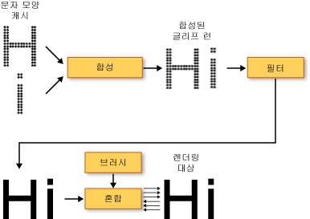
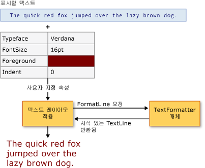

# WPF의 입력 체계
이 문서에서는 [!INCLUDE[TLA2#tla_winclient](../../../../includes/tla2sharptla-winclient-md.md)]의 주요 입력 기능을 소개합니다.  입력 기능의 주요한 특징에는 향상된 텍스트 렌더링 품질과 성능, [!INCLUDE[TLA#tla_opentype](../../../../includes/tlasharptla-opentype-md.md)] 입력 체계 지원, 개선된 국제 범용 텍스트, 개선된 글꼴 지원 및 새로운 텍스트 API\(응용 프로그래밍 인터페이스\) 등이 있습니다.  
  
   
  
   
## 향상된 텍스트 품질과 성능  
 [!INCLUDE[TLA2#tla_winclient](../../../../includes/tla2sharptla-winclient-md.md)]에서는 텍스트의 명확성과 가독성을 향상시키는 [!INCLUDE[TLA#tla_ct](../../../../includes/tlasharptla-ct-md.md)]을 사용하여 텍스트를 렌더링합니다.  [!INCLUDE[TLA2#tla_ct](../../../../includes/tla2sharptla-ct-md.md)]은 랩톱 화면, 포켓 PC 화면, 평면 모니터 등 기존의 LCD\(액정 디스플레이\)에서 보다 쉽게 텍스트를 읽을 수 있도록 지원하기 위해 [!INCLUDE[TLA#tla_ms](../../../../includes/tlasharptla-ms-md.md)]에서 개발한 소프트웨어 기술입니다.  [!INCLUDE[TLA2#tla_ct](../../../../includes/tla2sharptla-ct-md.md)]은 하위 픽셀 렌더링을 통해 픽셀의 아주 작은 부분에 문자를 정렬하여 원래 모양에 가까운 형태로 매우 선명하게 텍스트를 표시합니다.  해상도가 높아짐에 따라 텍스트의 미세한 부분까지 보다 선명하게 표시되므로 오랫동안 읽어도 불편함을 덜 느끼게 됩니다.  [!INCLUDE[TLA2#tla_winclient](../../../../includes/tla2sharptla-winclient-md.md)]에 도입된 [!INCLUDE[TLA2#tla_ct](../../../../includes/tla2sharptla-ct-md.md)]의 또 다른 특징적인 장점은 Y 방향 앤티 앨리어싱으로, 텍스트 문자의 얇은 곡선에서 위와 아래를 부드럽게 처리해 줍니다.  [!INCLUDE[TLA2#tla_ct](../../../../includes/tla2sharptla-ct-md.md)] 기능에 대한 자세한 내용은 [ClearType 개요](../../../../docs/framework/wpf/advanced/cleartype-overview.md)를 참조하십시오.  
  
   
ClearType Y 방향 앤티 앨리어싱 기능으로 표현한 텍스트  
  
 사용 중인 컴퓨터가 기본적인 하드웨어 요구 사항을 만족하면 [!INCLUDE[TLA2#tla_winclient](../../../../includes/tla2sharptla-winclient-md.md)]에서 전체 텍스트 렌더링 파이프라인을 하드웨어 가속할 수 있습니다.  하드웨어로 렌더링을 수행할 수 없는 경우에는 소프트웨어 렌더링을 사용할 수 있습니다.  하드웨어 가속은 개별 문자 모양 저장, 문자 모양을 글리프 런\(Glyph Run\)으로 구성, 효과 적용에서 최종 결과물에 대한 [!INCLUDE[TLA2#tla_ct](../../../../includes/tla2sharptla-ct-md.md)] 혼합 알고리즘 적용에 이르기까지 텍스트 렌더링 파이프라인의 모든 국면에 적용됩니다.  하드웨어 가속에 대한 자세한 내용은 [그래픽 렌더링 계층](../../../../docs/framework/wpf/advanced/graphics-rendering-tiers.md)을 참조하십시오.  
  
   
텍스트 렌더링 파이프라인 다이어그램  
  
 [!INCLUDE[TLA2#tla_winclient](../../../../includes/tla2sharptla-winclient-md.md)]에서 지원하는 그래픽 하드웨어 기능을, 문자인지 문자 모양인지 여부에 관계없이 애니메이션이 적용된 모든 텍스트에 충분히 활용하여  텍스트 애니메이션을 매끄럽게 만들 수도 있습니다.  
  
   
## 다양한 입력 체계  
 [!INCLUDE[TLA2#tla_opentype](../../../../includes/tla2sharptla-opentype-md.md)] 글꼴 형식은 [!INCLUDE[TLA#tla_truetype](../../../../includes/tlasharptla-truetype-md.md)] 글꼴 형식의 확장입니다.  이 [!INCLUDE[TLA2#tla_opentype](../../../../includes/tla2sharptla-opentype-md.md)] 글꼴 형식은 [!INCLUDE[TLA#tla_ms](../../../../includes/tlasharptla-ms-md.md)]와 Adobe가 공동으로 개발했으며 다양한 고급 입력 기능을 제공합니다.  <xref:System.Windows.Documents.Typography> 개체는 스타일 대체와 선단 장식\(Swash\) 등 [!INCLUDE[TLA2#tla_opentype](../../../../includes/tla2sharptla-opentype-md.md)]의 다양한 고급 글꼴 기능을 제공합니다.  [!INCLUDE[TLA2#tla_lhsdk](../../../../includes/tla2sharptla-lhsdk-md.md)]에서는 Pericles 및 Pescadero 글꼴 등 다양한 기능을 제공하도록 디자인된 일련의 샘플 [!INCLUDE[TLA2#tla_opentype](../../../../includes/tla2sharptla-opentype-md.md)] 글꼴을 제공합니다.  자세한 내용은 [샘플 OpenType 글꼴 팩](../../../../docs/framework/wpf/advanced/sample-opentype-font-pack.md)을 참조하십시오.  
  
 Pericles [!INCLUDE[TLA2#tla_opentype](../../../../includes/tla2sharptla-opentype-md.md)] 글꼴에는 표준 문자 모양 집합에 스타일 대체를 제공하는 추가 문자 모양이 포함되어 있습니다.  다음은 스타일 대체 문자 모양으로 표시한 텍스트입니다.  
  
   
OpenType 스타일 대체 문자 모양을 사용하는 텍스트  
  
 선단 장식\(Swash\)은 주로 필체와 관련된 정교한 장식을 사용하는 장식용 문자 모양입니다.  다음은 Pescadero 글꼴을 표준 및 선단 장식 문자 모양으로 표시한 텍스트입니다.  
  
   
OpenType 표준 및 선단 장식 문자 모양을 사용하는 텍스트  
  
 [!INCLUDE[TLA2#tla_opentype](../../../../includes/tla2sharptla-opentype-md.md)]의 특징에 대한 자세한 내용은 [OpenType 글꼴 기능](../../../../docs/framework/wpf/advanced/opentype-font-features.md)을 참조하십시오.  
  
   
## 개선된 국제 범용 텍스트 지원  
 [!INCLUDE[TLA2#tla_winclient](../../../../includes/tla2sharptla-winclient-md.md)]에서는 다음 기능을 통해 개선된 국제 범용 텍스트 지원을 제공합니다.  
  
-   모든 쓰기 체계에서 적절한 단위를 사용하여 자동 줄 간격 조정  
  
-   폭넓은 국제 범용 텍스트 지원.  자세한 내용은 [WPF의 전역화](../../../../docs/framework/wpf/advanced/globalization-for-wpf.md)를 참조하십시오.  
  
-   언어 기반 줄 바꿈, 하이픈 넣기 및 양쪽 맞춤  
  
   
## 개선된 글꼴 지원  
 [!INCLUDE[TLA2#tla_winclient](../../../../includes/tla2sharptla-winclient-md.md)]에서는 다음 기능을 통해 개선된 글꼴 지원을 제공합니다.  
  
-   모든 텍스트에 대한 유니코드 지원.  글꼴과 관련된 동작과 선택을 위해 더 이상 문자 집합이나 코드 페이지가 필요하지 않습니다.  
  
-   시스템 로캘과 같이 전역 설정에 독립적인 글꼴 동작  
  
-   <xref:System.Windows.Media.FontFamily>를 정의하는 분리된 <xref:System.Windows.FontWeight>, <xref:System.Windows.FontStretch> 및 <xref:System.Windows.FontStyle> 형식.  기울임꼴과 굵은 글꼴의 부울 조합을 통해 글꼴 패밀리를 정의하는 [!INCLUDE[TLA#tla_win32](../../../../includes/tlasharptla-win32-md.md)] 프로그래밍에서 보다 향상된 유연성을 제공합니다.  
  
-   글꼴 이름에 독립적으로 처리되는 쓰기 방향\(가로 또는 세로\)  
  
-   합성 글꼴 기술을 사용하여 이식 가능한 [!INCLUDE[TLA#tla_xml](../../../../includes/tlasharptla-xml-md.md)] 파일에서 글꼴 연결 및 글꼴 대체.  합성 글꼴을 사용하면 모든 범위의 다국어 글꼴을 구성할 수 있으며,  없는 문자 모양을 표시하지 않을 수도 있습니다.  자세한 내용은 <xref:System.Windows.Media.FontFamily> 클래스의 설명 단원을 참조하십시오.  
  
-   합성 글꼴을 기반으로 단일 언어 글꼴 그룹을 사용하여 구성된 국제 범용 글꼴.  이 기능을 이용하면 다국어 글꼴을 개발할 때 리소스를 절약할 수 있습니다.  
  
-   문서에 포함된 합성 글꼴. 이 기능은 문서 이식성을 제공합니다.  자세한 내용은 <xref:System.Windows.Media.FontFamily> 클래스의 설명 단원을 참조하십시오.  
  
   
## 새로운 텍스트 API  
 [!INCLUDE[TLA2#tla_winclient](../../../../includes/tla2sharptla-winclient-md.md)]에서는 개발자들이 자신의 응용 프로그램에 텍스트를 포함할 때 사용할 수 있는 여러 가지 텍스트 [!INCLUDE[TLA2#tla_api#plural](../../../../includes/tla2sharptla-apisharpplural-md.md)]를 제공합니다.  이러한 [!INCLUDE[TLA2#tla_api#plural](../../../../includes/tla2sharptla-apisharpplural-md.md)]는 다음 세 범주로 나뉩니다.  
  
-   **레이아웃 및 사용자 인터페이스**.  [!INCLUDE[TLA#tla_gui](../../../../includes/tlasharptla-gui-md.md)]의 일반적인 텍스트 컨트롤입니다.  
  
-   **가벼운 텍스트 그리기**.  개체에 텍스트를 직접 그릴 수 있게 해줍니다.  
  
-   **고급 텍스트 서식 지정**.  이 기능을 통해 사용자 지정 텍스트 엔진을 구현할 수 있습니다.  
  
### 레이아웃 및 사용자 인터페이스  
 높은 기능 수준에서 텍스트 [!INCLUDE[TLA2#tla_api#plural](../../../../includes/tla2sharptla-apisharpplural-md.md)]는 <xref:System.Windows.Controls.Label>, <xref:System.Windows.Controls.TextBlock> 및 <xref:System.Windows.Controls.TextBox> 같은 공용 [!INCLUDE[TLA#tla_ui](../../../../includes/tlasharptla-ui-md.md)] 컨트롤을 제공합니다.  이러한 컨트롤은 응용 프로그램에서 기본적인 [!INCLUDE[TLA2#tla_ui](../../../../includes/tla2sharptla-ui-md.md)] 요소를 제공하며 간편하게 텍스트를 표현하고 텍스트와 상호 작용할 수 있도록 해줍니다.  <xref:System.Windows.Controls.RichTextBox> 및 <xref:System.Windows.Controls.PasswordBox> 등의 컨트롤을 사용하면 텍스트를 보다 전문적으로 고급스럽게 처리할 수 있습니다.  또한 <xref:System.Windows.Documents.TextRange>, <xref:System.Windows.Documents.TextSelection> 및 <xref:System.Windows.Documents.TextPointer>와 같은 클래스는 유용한 텍스트 조작 방법을 제공합니다.  이들 [!INCLUDE[TLA2#tla_ui](../../../../includes/tla2sharptla-ui-md.md)] 컨트롤은 <xref:System.Windows.Controls.Control.FontFamily%2A>, <xref:System.Windows.Controls.Control.FontSize%2A>, <xref:System.Windows.Controls.Control.FontStyle%2A> 등의 속성을 제공하며, 텍스트를 렌더링하는 데 사용되는 글꼴을 제어할 수 있도록 합니다.  
  
#### 비트맵 효과, 변환 및 텍스트 효과 사용  
 [!INCLUDE[TLA2#tla_winclient](../../../../includes/tla2sharptla-winclient-md.md)]에서는 비트맵 효과, 변환, 텍스트 효과 등의 기능을 사용하여 텍스트를 시각적으로 흥미롭게 표현할 수 있습니다.  다음 예제에서는 전형적인 유형의 그림자 효과가 적용된 텍스트를 보여 줍니다.  
  
   
그림자가 적용된 텍스트  
  
 다음 예제에서는 그림자 효과와 노이즈가 적용된 텍스트를 보여 줍니다.  
  
   
그림자와 노이즈가 적용된 텍스트  
  
 다음 예제에서는 후광 효과가 적용된 텍스트를 보여 줍니다.  
  
   
후광 효과가 적용된 텍스트  
  
 다음 예제에서는 흐림 효과가 적용된 텍스트를 보여 줍니다.  
  
   
흐림 효과가 적용된 텍스트  
  
 다음 예제의 둘째 줄과 셋째 줄에서는 각각 x축 방향으로 150% 확대한 텍스트와 y축 방향으로 150% 확대한 텍스트를 보여 줍니다.  
  
   
ScaleTransform을 사용하여 표시한 텍스트  
  
 다음 예제에서는 x축 방향으로 기울인 텍스트를 보여 줍니다.  
  
   
SkewTransform을 사용하여 표시한 텍스트  
  
 <xref:System.Windows.Media.TextEffect> 개체는 텍스트 문자열에서 하나 이상의 문자 그룹으로 텍스트를 처리할 수 있게 하는 도우미 개체입니다.  다음 예제에서는 회전되는 개별 문자를 보여 줍니다.  각 문자는 1초 간격으로 회전됩니다.  
  
   
회전 텍스트 효과 애니메이션의 예  
  
#### 유동 문서 사용  
 일반적인 [!INCLUDE[TLA2#tla_ui](../../../../includes/tla2sharptla-ui-md.md)] 컨트롤 외에도 [!INCLUDE[TLA2#tla_winclient](../../../../includes/tla2sharptla-winclient-md.md)]에서는 텍스트 표현을 위한 레이아웃 컨트롤인 <xref:System.Windows.Documents.FlowDocument> 요소를 제공합니다.  <xref:System.Windows.Documents.FlowDocument> 요소는 <xref:System.Windows.Controls.DocumentViewer> 요소와 함께 사용되어 다양한 레이아웃 요구 사항을 가진 대량 텍스트에 적용할 수 있는 컨트롤을 제공합니다.  레이아웃 컨트롤을 사용하면 <xref:System.Windows.Documents.Typography> 개체 및 다른 [!INCLUDE[TLA2#tla_ui](../../../../includes/tla2sharptla-ui-md.md)] 컨트롤의 글꼴 관련 속성을 통해 고급 입력 체계에 액세스할 수 있습니다.  
  
 다음 예제에서는 검색, 탐색, 페이지 매김 및 콘텐츠 크기 조정 지원을 제공하는 <xref:System.Windows.Controls.FlowDocumentReader>에서 호스팅되는 텍스트 콘텐츠를 보여 줍니다.  
  
   
FlowDocumentReader에서 호스팅되는 텍스트  
  
 자세한 내용은 [WPF의 문서](../../../../docs/framework/wpf/advanced/documents-in-wpf.md)를 참조하십시오.  
  
### 가벼운 텍스트 그리기  
 <xref:System.Windows.Media.DrawingContext> 개체의 <xref:System.Windows.Media.DrawingContext.DrawText%2A> 메서드를 사용하여 [!INCLUDE[TLA2#tla_winclient](../../../../includes/tla2sharptla-winclient-md.md)] 개체에 직접 텍스트를 그릴 수 있습니다.  이 메서드를 사용하려면 <xref:System.Windows.Media.FormattedText> 개체를 만들어야 합니다.  이 개체를 사용하면 여러 줄 텍스트를 그릴 수 있는데, 이러한 텍스트의 각 문자에는 개별적으로 서식을 지정할 수 있습니다.  <xref:System.Windows.Media.FormattedText> 개체는 Win32 API의 DrawText 플래그가 제공하는 기능을 대부분 포함합니다.  또한 <xref:System.Windows.Media.FormattedText> 개체는 줄임표 지원 같은 기능도 제공합니다. 따라서 텍스트가 그 한도를 초과할 때 줄임표로 표시할 수 있습니다.  다음 예제에서는 두 번째와 세 번째 단어에 사용된 선형 그라데이션을 포함하여 여러 가지 서식이 적용된 텍스트를 보여 줍니다.  
  
   
FormattedText 개체를 사용하여 표시한 텍스트  
  
 서식 있는 텍스트를 <xref:System.Windows.Media.Geometry> 개체로 변환하여 시각적으로 흥미로운 다른 유형의 텍스트를 만들 수 있습니다.  예를 들어 텍스트 문자열의 윤곽선을 사용하여 <xref:System.Windows.Media.Geometry> 개체를 만들 수 있습니다.  
  
   
선형 그라데이션 브러시를 사용하여 표시한 텍스트 윤곽선  
  
 다음 예제에서는 변환된 텍스트의 스트로크, 채우기, 강조 표시를 수정하여 흥미로운 시각 효과를 만드는 여러 가지 방법을 보여 줍니다.  
  
   
다른 색으로 스트로크와 채우기를 설정하는 예  
  
   
스트로크에 이미지 브러시가 적용된 예  
  
   
스트로크 및 강조 표시에 이미지 브러시가 적용된 예  
  
 <xref:System.Windows.Media.FormattedText> 개체에 대한 자세한 내용은 [서식 있는 텍스트 그리기](../../../../docs/framework/wpf/advanced/drawing-formatted-text.md)을 참조하십시오.  
  
### 고급 텍스트 서식 지정  
 텍스트 [!INCLUDE[TLA2#tla_api#plural](../../../../includes/tla2sharptla-apisharpplural-md.md)]의 가장 고급 수준에서 [!INCLUDE[TLA2#tla_winclient](../../../../includes/tla2sharptla-winclient-md.md)]는 <xref:System.Windows.Media.TextFormatting.TextFormatter> 개체 및 <xref:System.Windows.Media.TextFormatting> 네임스페이스의 다른 형식을 통해 사용자 지정 텍스트 레이아웃을 만들 수 있는 기능을 제공합니다.  <xref:System.Windows.Media.TextFormatting.TextFormatter> 및 관련 클래스를 사용하면 문자 형식, 단락 스타일, 줄 바꿈 규칙 및 국제 범용 텍스트의 기타 레이아웃 특징에 대한 고유한 정의를 지정할 수 있도록 지원하는 사용자 지정 텍스트 레이아웃을 구현할 수 있습니다.  대체로 [!INCLUDE[TLA2#tla_winclient](../../../../includes/tla2sharptla-winclient-md.md)] 텍스트 레이아웃 지원의 기본 구현을 재정의해야 하는 경우는 아주 드뭅니다.  하지만 텍스트 편집 컨트롤이나 응용 프로그램을 만드는 경우 기본 [!INCLUDE[TLA2#tla_winclient](../../../../includes/tla2sharptla-winclient-md.md)] 구현이 아닌 다른 구현이 필요할 수 있습니다.  
  
 기존의 텍스트 [!INCLUDE[TLA#tla_api](../../../../includes/tlasharptla-api-md.md)]와 달리 <xref:System.Windows.Media.TextFormatting.TextFormatter>는 콜백 메서드 집합을 통해 텍스트 레이아웃 클라이언트와 상호 작용합니다.  이를 위해 클라이언트는 <xref:System.Windows.Media.TextFormatting.TextSource> 클래스 구현에서 이러한 메서드를 제공해야 합니다.  다음 다이어그램에서는 클라이언트 응용 프로그램과 <xref:System.Windows.Media.TextFormatting.TextFormatter>의 텍스트 레이아웃 상호 작용을 보여 줍니다.  
  
   
응용 프로그램과 TextFormatter의 상호 작용  
  
 사용자 지정 텍스트 레이아웃 만들기에 대한 자세한 내용은 [고급 텍스트 서식 지정](../../../../docs/framework/wpf/advanced/advanced-text-formatting.md)을 참조하십시오.  
  
## 참고 항목  
 <xref:System.Windows.Media.FormattedText>   
 <xref:System.Windows.Media.TextFormatting.TextFormatter>   
 [ClearType 개요](../../../../docs/framework/wpf/advanced/cleartype-overview.md)   
 [OpenType 글꼴 기능](../../../../docs/framework/wpf/advanced/opentype-font-features.md)   
 [서식 있는 텍스트 그리기](../../../../docs/framework/wpf/advanced/drawing-formatted-text.md)   
 [고급 텍스트 서식 지정](../../../../docs/framework/wpf/advanced/advanced-text-formatting.md)   
 [텍스트](../../../../docs/framework/wpf/advanced/optimizing-performance-text.md)   
 [Microsoft Typography](http://www.microsoft.com/typography/default.mspx)