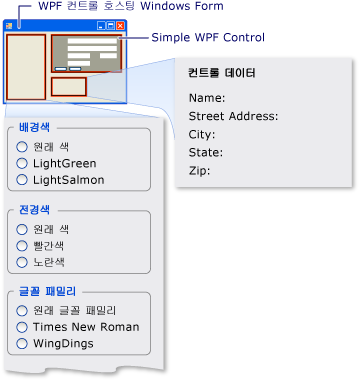

# <a name="walkthrough-hosting-a-wpf-composite-control-in-windows-forms"></a><span data-ttu-id="8eb1b-102">연습: Windows Forms에서 WPF 복합 컨트롤 호스팅</span><span class="sxs-lookup"><span data-stu-id="8eb1b-102">Walkthrough: Hosting a WPF Composite Control in Windows Forms</span></span>
[!INCLUDE[TLA#tla_winclient](../../../../includes/tlasharptla-winclient-md.md)]<span data-ttu-id="8eb1b-103">에서는 응용 프로그램을 만들기 위한 다양한 환경을 제공합니다.</span><span class="sxs-lookup"><span data-stu-id="8eb1b-103"> provides a rich environment for creating applications.</span></span> <span data-ttu-id="8eb1b-104">그러나에 있는 경우 상당한 투자 [!INCLUDE[TLA#tla_winforms](../../../../includes/tlasharptla-winforms-md.md)] 코드는 것이 보다 효율적으로 기존 확장을 [!INCLUDE[TLA#tla_winforms](../../../../includes/tlasharptla-winforms-md.md)] 인 응용 프로그램이 [!INCLUDE[TLA2#tla_winclient](../../../../includes/tla2sharptla-winclient-md.md)] 처음부터 다시 작성 하기 보다는 합니다.</span><span class="sxs-lookup"><span data-stu-id="8eb1b-104">However, when you have a substantial investment in [!INCLUDE[TLA#tla_winforms](../../../../includes/tlasharptla-winforms-md.md)] code, it can be more effective to extend your existing [!INCLUDE[TLA#tla_winforms](../../../../includes/tlasharptla-winforms-md.md)] application with [!INCLUDE[TLA2#tla_winclient](../../../../includes/tla2sharptla-winclient-md.md)] rather than to rewrite it from scratch.</span></span> <span data-ttu-id="8eb1b-105">일반적인 시나리오는 컨트롤을 더 사용 하 여 구현 하거나 하나를 포함할 때 [!INCLUDE[TLA2#tla_winclient](../../../../includes/tla2sharptla-winclient-md.md)] Windows Forms 응용 프로그램 내에서.</span><span class="sxs-lookup"><span data-stu-id="8eb1b-105">A common scenario is when you want to embed one or more controls implemented with [!INCLUDE[TLA2#tla_winclient](../../../../includes/tla2sharptla-winclient-md.md)] within your Windows Forms application.</span></span> <span data-ttu-id="8eb1b-106">WPF 컨트롤을 사용자 지정 하는 방법에 대 한 자세한 내용은 참조 [컨트롤 사용자 지정](../../../../docs/framework/wpf/controls/control-customization.md)합니다.</span><span class="sxs-lookup"><span data-stu-id="8eb1b-106">For more information about customizing WPF controls, see [Control Customization](../../../../docs/framework/wpf/controls/control-customization.md).</span></span>  
  
 <span data-ttu-id="8eb1b-107">이 연습 단계를 안내 응용 프로그램을 호스팅하는 [!INCLUDE[TLA2#tla_winclient](../../../../includes/tla2sharptla-winclient-md.md)] 복합 컨트롤에 Windows Forms 응용 프로그램에서 데이터 입력을 수행 합니다.</span><span class="sxs-lookup"><span data-stu-id="8eb1b-107">This walkthrough steps you through an application that hosts a [!INCLUDE[TLA2#tla_winclient](../../../../includes/tla2sharptla-winclient-md.md)] composite control to perform data-entry in a Windows Forms application.</span></span> <span data-ttu-id="8eb1b-108">복합 컨트롤은 DLL로 패키지됩니다.</span><span class="sxs-lookup"><span data-stu-id="8eb1b-108">The composite control is packaged in a DLL.</span></span> <span data-ttu-id="8eb1b-109">이 일반적인 절차는 더 복잡한 응용 프로그램 및 컨트롤로 확장할 수 있습니다.</span><span class="sxs-lookup"><span data-stu-id="8eb1b-109">This general procedure can be extended to more complex applications and controls.</span></span> <span data-ttu-id="8eb1b-110">이 연습에서 모양과 기능을 거의 동일한 [연습: WPF의 Windows Forms 합성 컨트롤 호스팅](../../../../docs/framework/wpf/advanced/walkthrough-hosting-a-windows-forms-composite-control-in-wpf.md)합니다.</span><span class="sxs-lookup"><span data-stu-id="8eb1b-110">This walkthrough is designed to be nearly identical in appearance and functionality to [Walkthrough: Hosting a Windows Forms Composite Control in WPF](../../../../docs/framework/wpf/advanced/walkthrough-hosting-a-windows-forms-composite-control-in-wpf.md).</span></span> <span data-ttu-id="8eb1b-111">주요 차이점은 호스팅 시나리오가 반대라는 점입니다.</span><span class="sxs-lookup"><span data-stu-id="8eb1b-111">The primary difference is that the hosting scenario is reversed.</span></span>  
  
 <span data-ttu-id="8eb1b-112">이 연습은 두 개의 섹션으로 구분됩니다.</span><span class="sxs-lookup"><span data-stu-id="8eb1b-112">The walkthrough is divided into two sections.</span></span> <span data-ttu-id="8eb1b-113">첫 번째 섹션 구현에 간략하게 설명 된 [!INCLUDE[TLA2#tla_winclient](../../../../includes/tla2sharptla-winclient-md.md)] 합성 컨트롤입니다.</span><span class="sxs-lookup"><span data-stu-id="8eb1b-113">The first section briefly describes the implementation of the [!INCLUDE[TLA2#tla_winclient](../../../../includes/tla2sharptla-winclient-md.md)] composite control.</span></span> <span data-ttu-id="8eb1b-114">두 번째 섹션에는 Windows Forms 응용 프로그램에서 복합 컨트롤을 호스트 컨트롤에서 이벤트를 수신 하 고 컨트롤의 속성 중 일부에 액세스 하는 방법을 자세히 설명 합니다.</span><span class="sxs-lookup"><span data-stu-id="8eb1b-114">The second section discusses in detail how to host the composite control in a Windows Forms application, receive events from the control, and access some of the control’s properties.</span></span>  
  
 <span data-ttu-id="8eb1b-115">이 연습에서 설명하는 작업은 다음과 같습니다.</span><span class="sxs-lookup"><span data-stu-id="8eb1b-115">Tasks illustrated in this walkthrough include:</span></span>  
  
-   <span data-ttu-id="8eb1b-116">WPF 복합 컨트롤 구현</span><span class="sxs-lookup"><span data-stu-id="8eb1b-116">Implementing the WPF composite control.</span></span>  
  
-   <span data-ttu-id="8eb1b-117">Windows Forms 호스트 응용 프로그램 구현</span><span class="sxs-lookup"><span data-stu-id="8eb1b-117">Implementing the Windows Forms host application.</span></span>  
  
 <span data-ttu-id="8eb1b-118">이 연습에서 설명 하는 작업의 전체 코드 목록을 보려면 [Windows Forms 예제에서 복합 WPF 컨트롤 호스트](http://go.microsoft.com/fwlink/?LinkID=159996)합니다.</span><span class="sxs-lookup"><span data-stu-id="8eb1b-118">For a complete code listing of the tasks illustrated in this walkthrough, see [Hosting a WPF Composite Control in Windows Forms Sample](http://go.microsoft.com/fwlink/?LinkID=159996).</span></span>  
  
## <a name="prerequisites"></a><span data-ttu-id="8eb1b-119">전제 조건</span><span class="sxs-lookup"><span data-stu-id="8eb1b-119">Prerequisites</span></span>  
 <span data-ttu-id="8eb1b-120">이 연습을 완료하려면 다음 구성 요소가 필요합니다.</span><span class="sxs-lookup"><span data-stu-id="8eb1b-120">You need the following components to complete this walkthrough:</span></span>  
  
-   [!INCLUDE[vs_dev10_long](../../../../includes/vs-dev10-long-md.md)]<span data-ttu-id="8eb1b-121">.</span><span class="sxs-lookup"><span data-stu-id="8eb1b-121">.</span></span>  
  
## <a name="implementing-the-wpf-composite-control"></a><span data-ttu-id="8eb1b-122">WPF 복합 컨트롤 구현</span><span class="sxs-lookup"><span data-stu-id="8eb1b-122">Implementing the WPF Composite Control</span></span>  
 <span data-ttu-id="8eb1b-123">[!INCLUDE[TLA2#tla_winclient](../../../../includes/tla2sharptla-winclient-md.md)] 이 예제에서 사용 하는 복합 컨트롤은 사용자의 이름 및 주소를 사용 하는 간단한 데이터 입력 폼입니다.</span><span class="sxs-lookup"><span data-stu-id="8eb1b-123">The [!INCLUDE[TLA2#tla_winclient](../../../../includes/tla2sharptla-winclient-md.md)] composite control used in this example is a simple data-entry form that takes the user's name and address.</span></span> <span data-ttu-id="8eb1b-124">사용자가 작업이 완료되었음을 나타내는 두 개의 단추 중 하나를 클릭하면 컨트롤에서 사용자 지정 이벤트가 발생하여 해당 정보가 호스트에 반환됩니다.</span><span class="sxs-lookup"><span data-stu-id="8eb1b-124">When the user clicks one of two buttons to indicate that the task is finished, the control raises a custom event to return that information to the host.</span></span> <span data-ttu-id="8eb1b-125">다음 그림에서는 렌더링된 컨트롤을 보여 줍니다.</span><span class="sxs-lookup"><span data-stu-id="8eb1b-125">The following illustration shows the rendered control.</span></span>  
  
 <span data-ttu-id="8eb1b-126"></span><span class="sxs-lookup"><span data-stu-id="8eb1b-126"></span></span>  
<span data-ttu-id="8eb1b-127">WPF 복합 컨트롤</span><span class="sxs-lookup"><span data-stu-id="8eb1b-127">WPF composite control</span></span>  
  
### <a name="creating-the-project"></a><span data-ttu-id="8eb1b-128">프로젝트 만들기</span><span class="sxs-lookup"><span data-stu-id="8eb1b-128">Creating the Project</span></span>  
 <span data-ttu-id="8eb1b-129">프로젝트를 시작하려면</span><span class="sxs-lookup"><span data-stu-id="8eb1b-129">To start the project:</span></span>  
  
1.  <span data-ttu-id="8eb1b-130">시작 [!INCLUDE[TLA#tla_visualstu](../../../../includes/tlasharptla-visualstu-md.md)], 열 및는 **새 프로젝트** 대화 상자.</span><span class="sxs-lookup"><span data-stu-id="8eb1b-130">Launch [!INCLUDE[TLA#tla_visualstu](../../../../includes/tlasharptla-visualstu-md.md)], and open the **New Project** dialog box.</span></span>  
  
2.  <span data-ttu-id="8eb1b-131">Visual C# 및 Windows 범주에서 선택 된 **WPF 사용자 정의 컨트롤 라이브러리** 템플릿.</span><span class="sxs-lookup"><span data-stu-id="8eb1b-131">In Visual C# and the Windows category, select the **WPF User Control Library** template.</span></span>  
  
3.  <span data-ttu-id="8eb1b-132">새 프로젝트의 이름을 `MyControls`로 지정합니다.</span><span class="sxs-lookup"><span data-stu-id="8eb1b-132">Name the new project `MyControls`.</span></span>  
  
4.  <span data-ttu-id="8eb1b-133">위치에 대 한 최상위 폴더를 편리 하 게 명명 된 같은 지정한 `WindowsFormsHostingWpfControl`합니다.</span><span class="sxs-lookup"><span data-stu-id="8eb1b-133">For the location, specify a conveniently named top-level folder, such as `WindowsFormsHostingWpfControl`.</span></span> <span data-ttu-id="8eb1b-134">나중에 이 폴더에 호스트 응용 프로그램을 넣습니다.</span><span class="sxs-lookup"><span data-stu-id="8eb1b-134">Later, you will put the host application in this folder.</span></span>  
  
5.  <span data-ttu-id="8eb1b-135">**확인**을 클릭해 프로젝트를 만듭니다.</span><span class="sxs-lookup"><span data-stu-id="8eb1b-135">Click **OK** to create the project.</span></span> <span data-ttu-id="8eb1b-136">라는 단일 컨트롤을 포함 하는 기본 프로젝트 `UserControl1`합니다.</span><span class="sxs-lookup"><span data-stu-id="8eb1b-136">The default project contains a single control named `UserControl1`.</span></span>  
  
6.  <span data-ttu-id="8eb1b-137">솔루션 탐색기에서 이름을 바꿀 `UserControl1` 를 `MyControl1`합니다.</span><span class="sxs-lookup"><span data-stu-id="8eb1b-137">In Solution Explorer, rename `UserControl1` to `MyControl1`.</span></span>  
  
 <span data-ttu-id="8eb1b-138">프로젝트에는 다음과 같은 시스템 DLL에 대한 참조가 있어야 합니다.</span><span class="sxs-lookup"><span data-stu-id="8eb1b-138">Your project should have references to the following system DLLs.</span></span> <span data-ttu-id="8eb1b-139">이러한 DLL이 기본적으로 포함되지 않은 경우 프로젝트에 추가합니다.</span><span class="sxs-lookup"><span data-stu-id="8eb1b-139">If any of these DLLs are not included by default, add them to your project.</span></span>  
  
-   <span data-ttu-id="8eb1b-140">PresentationCore</span><span class="sxs-lookup"><span data-stu-id="8eb1b-140">PresentationCore</span></span>  
  
-   <span data-ttu-id="8eb1b-141">PresentationFramework</span><span class="sxs-lookup"><span data-stu-id="8eb1b-141">PresentationFramework</span></span>  
  
-   <span data-ttu-id="8eb1b-142">시스템</span><span class="sxs-lookup"><span data-stu-id="8eb1b-142">System</span></span>  
  
-   <span data-ttu-id="8eb1b-143">WindowsBase</span><span class="sxs-lookup"><span data-stu-id="8eb1b-143">WindowsBase</span></span>  
  
### <a name="creating-the-user-interface"></a><span data-ttu-id="8eb1b-144">사용자 인터페이스 만들기</span><span class="sxs-lookup"><span data-stu-id="8eb1b-144">Creating the User Interface</span></span>  
 <span data-ttu-id="8eb1b-145">[!INCLUDE[TLA#tla_ui](../../../../includes/tlasharptla-ui-md.md)] 합성 컨트롤은 사용 하 여 구현에 대 한 [!INCLUDE[TLA#tla_xaml](../../../../includes/tlasharptla-xaml-md.md)]합니다.</span><span class="sxs-lookup"><span data-stu-id="8eb1b-145">The [!INCLUDE[TLA#tla_ui](../../../../includes/tlasharptla-ui-md.md)] for the composite control is implemented with [!INCLUDE[TLA#tla_xaml](../../../../includes/tlasharptla-xaml-md.md)].</span></span> <span data-ttu-id="8eb1b-146">복합 컨트롤 [!INCLUDE[TLA2#tla_ui](../../../../includes/tla2sharptla-ui-md.md)] 5 이루어져 <xref:System.Windows.Controls.TextBox> 요소입니다.</span><span class="sxs-lookup"><span data-stu-id="8eb1b-146">The composite control [!INCLUDE[TLA2#tla_ui](../../../../includes/tla2sharptla-ui-md.md)] consists of five <xref:System.Windows.Controls.TextBox> elements.</span></span> <span data-ttu-id="8eb1b-147">각 <xref:System.Windows.Controls.TextBox> 요소에 연결 된 <xref:System.Windows.Controls.TextBlock> 레이블로 사용 하는 요소입니다.</span><span class="sxs-lookup"><span data-stu-id="8eb1b-147">Each <xref:System.Windows.Controls.TextBox> element has an associated <xref:System.Windows.Controls.TextBlock> element that serves as a label.</span></span> <span data-ttu-id="8eb1b-148">두 개의 <xref:System.Windows.Controls.Button> 요소 아래에 **확인** 및 **취소**합니다.</span><span class="sxs-lookup"><span data-stu-id="8eb1b-148">There are two <xref:System.Windows.Controls.Button> elements at the bottom, **OK** and **Cancel**.</span></span> <span data-ttu-id="8eb1b-149">사용자가 이 단추 중 하나를 클릭하면 컨트롤에서 사용자 지정 이벤트가 발생하여 호스트에 정보가 반환됩니다.</span><span class="sxs-lookup"><span data-stu-id="8eb1b-149">When the user clicks either button, the control raises a custom event to return the information to the host.</span></span>  
  
#### <a name="basic-layout"></a><span data-ttu-id="8eb1b-150">기본 레이아웃</span><span class="sxs-lookup"><span data-stu-id="8eb1b-150">Basic Layout</span></span>  
 <span data-ttu-id="8eb1b-151">다양 한 [!INCLUDE[TLA2#tla_ui](../../../../includes/tla2sharptla-ui-md.md)] 요소에 포함 됩니다는 <xref:System.Windows.Controls.Grid> 요소입니다.</span><span class="sxs-lookup"><span data-stu-id="8eb1b-151">The various [!INCLUDE[TLA2#tla_ui](../../../../includes/tla2sharptla-ui-md.md)] elements are contained in a <xref:System.Windows.Controls.Grid> element.</span></span> <span data-ttu-id="8eb1b-152">사용할 수 있습니다 <xref:System.Windows.Controls.Grid> 거의 복합의 내용을 제어 동일한 정렬 방식으로 사용 합니다는 `Table` 요소 내에 있습니다.</span><span class="sxs-lookup"><span data-stu-id="8eb1b-152">You can use <xref:System.Windows.Controls.Grid> to arrange the contents of the composite control in much the same way you would use a `Table` element in HTML.</span></span> [!INCLUDE[TLA2#tla_winclient](../../../../includes/tla2sharptla-winclient-md.md)]<span data-ttu-id="8eb1b-153"> 에 <xref:System.Windows.Documents.Table> 요소인 하지만 <xref:System.Windows.Controls.Grid> 가 더 가볍고 단순 레이아웃 작업에 보다 적합 합니다.</span><span class="sxs-lookup"><span data-stu-id="8eb1b-153"> also has a <xref:System.Windows.Documents.Table> element, but <xref:System.Windows.Controls.Grid> is more lightweight and better suited for simple layout tasks.</span></span>  
  
 <span data-ttu-id="8eb1b-154">다음 XAML에서는 기본 레이아웃을 보여 줍니다.</span><span class="sxs-lookup"><span data-stu-id="8eb1b-154">The following XAML shows the basic layout.</span></span> <span data-ttu-id="8eb1b-155">이 XAML 열 수를 지정 하 여 컨트롤의 전체 구조를 정의 하 고에 행이 <xref:System.Windows.Controls.Grid> 요소입니다.</span><span class="sxs-lookup"><span data-stu-id="8eb1b-155">This XAML defines the overall structure of the control by specifying the number of columns and rows in the <xref:System.Windows.Controls.Grid> element.</span></span>  
  
 <span data-ttu-id="8eb1b-156">MyControl1.xaml에서 기존 XAML을 다음 XAML로 바꿉니다.</span><span class="sxs-lookup"><span data-stu-id="8eb1b-156">In MyControl1.xaml, replace the existing XAML with the following XAML.</span></span>  
  
 [!code-xaml[WindowsFormsHostingWpfControl#101](../../../../samples/snippets/csharp/VS_Snippets_Wpf/WindowsFormsHostingWpfControl/CSharp/MyControls/Page1.xaml#101)]  
[!code-xaml[WindowsFormsHostingWpfControl#102](../../../../samples/snippets/csharp/VS_Snippets_Wpf/WindowsFormsHostingWpfControl/CSharp/MyControls/Page1.xaml#102)]  
  
#### <a name="adding-textblock-and-textbox-elements-to-the-grid"></a><span data-ttu-id="8eb1b-157">그리드에 TextBlock 및 TextBox 요소 추가</span><span class="sxs-lookup"><span data-stu-id="8eb1b-157">Adding TextBlock and TextBox Elements to the Grid</span></span>  
 <span data-ttu-id="8eb1b-158">배치는 [!INCLUDE[TLA2#tla_ui](../../../../includes/tla2sharptla-ui-md.md)] 요소를 설정 하 여 표의 요소 <xref:System.Windows.Controls.Grid.RowProperty> 및 <xref:System.Windows.Controls.Grid.ColumnProperty> 특성을 적절 한 행 및 열 번호입니다.</span><span class="sxs-lookup"><span data-stu-id="8eb1b-158">You place a [!INCLUDE[TLA2#tla_ui](../../../../includes/tla2sharptla-ui-md.md)] element in the grid by setting the element's <xref:System.Windows.Controls.Grid.RowProperty> and <xref:System.Windows.Controls.Grid.ColumnProperty> attributes to the appropriate row and column number.</span></span> <span data-ttu-id="8eb1b-159">행 및 열 번호는 0부터 시작해야 합니다.</span><span class="sxs-lookup"><span data-stu-id="8eb1b-159">Remember that row and column numbering are zero-based.</span></span> <span data-ttu-id="8eb1b-160">설정 하 여 여러 열을 포함 하는 요소를 사용할 수 있습니다는 <xref:System.Windows.Controls.Grid.ColumnSpanProperty> 특성입니다.</span><span class="sxs-lookup"><span data-stu-id="8eb1b-160">You can have an element span multiple columns by setting its <xref:System.Windows.Controls.Grid.ColumnSpanProperty> attribute.</span></span> <span data-ttu-id="8eb1b-161">에 대 한 자세한 내용은 <xref:System.Windows.Controls.Grid> 요소 참조 [Grid 요소를 만들](../../../../docs/framework/wpf/controls/how-to-create-a-grid-element.md)합니다.</span><span class="sxs-lookup"><span data-stu-id="8eb1b-161">For more information about <xref:System.Windows.Controls.Grid> elements, see [Create a Grid Element](../../../../docs/framework/wpf/controls/how-to-create-a-grid-element.md).</span></span>  
  
 <span data-ttu-id="8eb1b-162">다음 XAML 복합 컨트롤의 표시 <xref:System.Windows.Controls.TextBox> 및 <xref:System.Windows.Controls.TextBlock> 요소를 자신의 <xref:System.Windows.Controls.Grid.RowProperty> 및 <xref:System.Windows.Controls.Grid.ColumnProperty> 눈금에는 요소를 제대로 배치로 설정 되는 특성입니다.</span><span class="sxs-lookup"><span data-stu-id="8eb1b-162">The following XAML shows the composite control’s <xref:System.Windows.Controls.TextBox> and <xref:System.Windows.Controls.TextBlock> elements with their <xref:System.Windows.Controls.Grid.RowProperty> and <xref:System.Windows.Controls.Grid.ColumnProperty> attributes, which are set to place the elements properly in the grid.</span></span>  
  
 <span data-ttu-id="8eb1b-163">MyControl1.xaml, 추가 내에서 다음 XAML은 <xref:System.Windows.Controls.Grid> 요소입니다.</span><span class="sxs-lookup"><span data-stu-id="8eb1b-163">In MyControl1.xaml, add the following XAML within the <xref:System.Windows.Controls.Grid> element.</span></span>  
  
 [!code-xaml[WindowsFormsHostingWpfControl#103](../../../../samples/snippets/csharp/VS_Snippets_Wpf/WindowsFormsHostingWpfControl/CSharp/MyControls/Page1.xaml#103)]  
  
#### <a name="styling-the-ui-elements"></a><span data-ttu-id="8eb1b-164">UI 요소 스타일 지정</span><span class="sxs-lookup"><span data-stu-id="8eb1b-164">Styling the UI Elements</span></span>  
 <span data-ttu-id="8eb1b-165">데이터 입력 폼의 요소는 대부분 모양이 비슷합니다. 즉, 이러한 요소의 여러 속성 설정이 동일합니다.</span><span class="sxs-lookup"><span data-stu-id="8eb1b-165">Many of the elements on the data-entry form have a similar appearance, which means that they have identical settings for several of their properties.</span></span> <span data-ttu-id="8eb1b-166">앞의 XAML 사용 하 여 각 요소의 특성을 따로 설정 하지 않고 <xref:System.Windows.Style> 요소의 클래스에 대 한 표준 속성 설정을 정의 하는 요소입니다.</span><span class="sxs-lookup"><span data-stu-id="8eb1b-166">Rather than setting each element's attributes separately, the previous XAML uses <xref:System.Windows.Style> elements to define standard property settings for classes of elements.</span></span> <span data-ttu-id="8eb1b-167">이 방법을 사용하면 컨트롤의 복잡도를 줄이고 하나의 스타일 특성을 통해 여러 요소의 모양을 변경할 수 있습니다.</span><span class="sxs-lookup"><span data-stu-id="8eb1b-167">This approach reduces the complexity of the control and enables you to change the appearance of multiple elements through a single style attribute.</span></span>  
  
 <span data-ttu-id="8eb1b-168"><xref:System.Windows.Style> 요소에 포함 됩니다는 <xref:System.Windows.Controls.Grid> 요소의 <xref:System.Windows.FrameworkElement.Resources%2A> 속성, 컨트롤의 모든 요소에서 사용할 수 있도록 합니다.</span><span class="sxs-lookup"><span data-stu-id="8eb1b-168">The <xref:System.Windows.Style> elements are contained in the <xref:System.Windows.Controls.Grid> element's <xref:System.Windows.FrameworkElement.Resources%2A> property, so they can be used by all elements in the control.</span></span> <span data-ttu-id="8eb1b-169">지정 하는 경우에 적용할 있습니다 요소를 추가 하 여 한 <xref:System.Windows.Style> 요소 스타일 이름으로 설정 합니다.</span><span class="sxs-lookup"><span data-stu-id="8eb1b-169">If a style is named, you apply it to an element by adding a <xref:System.Windows.Style> element set to the style's name.</span></span> <span data-ttu-id="8eb1b-170">이름이 지정되지 않은 스타일은 요소의 기본 스타일이 됩니다.</span><span class="sxs-lookup"><span data-stu-id="8eb1b-170">Styles that are not named become the default style for the element.</span></span> <span data-ttu-id="8eb1b-171">에 대 한 자세한 내용은 [!INCLUDE[TLA2#tla_winclient](../../../../includes/tla2sharptla-winclient-md.md)] 스타일 참조 [스타일 및 템플릿](../../../../docs/framework/wpf/controls/styling-and-templating.md)합니다.</span><span class="sxs-lookup"><span data-stu-id="8eb1b-171">For more information about [!INCLUDE[TLA2#tla_winclient](../../../../includes/tla2sharptla-winclient-md.md)] styles, see [Styling and Templating](../../../../docs/framework/wpf/controls/styling-and-templating.md).</span></span>  
  
 <span data-ttu-id="8eb1b-172">에서는 다음 XAML은 <xref:System.Windows.Style> 복합 컨트롤에 대 한 요소입니다.</span><span class="sxs-lookup"><span data-stu-id="8eb1b-172">The following XAML shows the <xref:System.Windows.Style> elements for the composite control.</span></span> <span data-ttu-id="8eb1b-173">스타일이 요소에 어떻게 적용되는지 확인하려면 앞의 XAML을 참조하세요.</span><span class="sxs-lookup"><span data-stu-id="8eb1b-173">To see how the styles are applied to elements, see the previous XAML.</span></span> <span data-ttu-id="8eb1b-174">예를 들어 마지막 <xref:System.Windows.Controls.TextBlock> 요소에는 `inlineText` 스타일 및 마지막 <xref:System.Windows.Controls.TextBox> 요소의 기본 스타일을 사용 합니다.</span><span class="sxs-lookup"><span data-stu-id="8eb1b-174">For example, the last <xref:System.Windows.Controls.TextBlock> element has the `inlineText` style, and the last <xref:System.Windows.Controls.TextBox> element uses the default style.</span></span>  
  
 <span data-ttu-id="8eb1b-175">MyControl1.xaml를 다음 XAML을 추가 바로 뒤의 <xref:System.Windows.Controls.Grid> 요소를 시작 합니다.</span><span class="sxs-lookup"><span data-stu-id="8eb1b-175">In MyControl1.xaml, add the following XAML just after the <xref:System.Windows.Controls.Grid> start element.</span></span>  
  
 [!code-xaml[WindowsFormsHostingWpfControl#104](../../../../samples/snippets/csharp/VS_Snippets_Wpf/WindowsFormsHostingWpfControl/CSharp/MyControls/Page1.xaml#104)]  
  
#### <a name="adding-the-ok-and-cancel-buttons"></a><span data-ttu-id="8eb1b-176">확인 및 취소 단추 추가</span><span class="sxs-lookup"><span data-stu-id="8eb1b-176">Adding the OK and Cancel Buttons</span></span>  
 <span data-ttu-id="8eb1b-177">복합 컨트롤의 마지막 요소는 **확인** 및 **취소** <xref:System.Windows.Controls.Button> 의 마지막 행의 처음 두 열을 차지 하는 요소는 <xref:System.Windows.Controls.Grid>합니다.</span><span class="sxs-lookup"><span data-stu-id="8eb1b-177">The final elements on the composite control are the **OK** and **Cancel**<xref:System.Windows.Controls.Button> elements, which occupy the first two columns of the last row of the <xref:System.Windows.Controls.Grid>.</span></span> <span data-ttu-id="8eb1b-178">이러한 요소에 공통 이벤트 처리기를 사용 하 여 `ButtonClicked`, 및 기본 <xref:System.Windows.Controls.Button> 이전 XAML에 정의 된 스타일입니다.</span><span class="sxs-lookup"><span data-stu-id="8eb1b-178">These elements use a common event handler, `ButtonClicked`, and the default <xref:System.Windows.Controls.Button> style defined in the previous XAML.</span></span>  
  
 <span data-ttu-id="8eb1b-179">MyControl1.xaml, 마지막 뒤에 다음 XAML 추가 <xref:System.Windows.Controls.TextBox> 요소입니다.</span><span class="sxs-lookup"><span data-stu-id="8eb1b-179">In MyControl1.xaml, add the following XAML after the last <xref:System.Windows.Controls.TextBox> element.</span></span> <span data-ttu-id="8eb1b-180">[!INCLUDE[TLA2#tla_xaml](../../../../includes/tla2sharptla-xaml-md.md)] 복합 컨트롤의 일부로 완료 되었습니다.</span><span class="sxs-lookup"><span data-stu-id="8eb1b-180">The [!INCLUDE[TLA2#tla_xaml](../../../../includes/tla2sharptla-xaml-md.md)] part of the composite control is now complete.</span></span>  
  
 [!code-xaml[WindowsFormsHostingWpfControl#105](../../../../samples/snippets/csharp/VS_Snippets_Wpf/WindowsFormsHostingWpfControl/CSharp/MyControls/Page1.xaml#105)]  
  
### <a name="implementing-the-code-behind-file"></a><span data-ttu-id="8eb1b-181">코드 숨김 파일 구현</span><span class="sxs-lookup"><span data-stu-id="8eb1b-181">Implementing the Code-Behind File</span></span>  
 <span data-ttu-id="8eb1b-182">코드 숨김 파일인 MyControl1.xaml.cs, 세 가지 필수 작업을 구현합니다.</span><span class="sxs-lookup"><span data-stu-id="8eb1b-182">The code-behind file, MyControl1.xaml.cs, implements three essential tasks:</span></span>
  
1.  <span data-ttu-id="8eb1b-183">사용자가 단추 중 하나를 클릭할 때 발생하는 이벤트를 처리합니다.</span><span class="sxs-lookup"><span data-stu-id="8eb1b-183">Handles the event that occurs when the user clicks one of the buttons.</span></span>  
  
2.  <span data-ttu-id="8eb1b-184">데이터를 검색 하는 <xref:System.Windows.Controls.TextBox> 요소를 사용자 지정 이벤트 인수 개체에 패키지 하 고 있습니다.</span><span class="sxs-lookup"><span data-stu-id="8eb1b-184">Retrieves the data from the <xref:System.Windows.Controls.TextBox> elements, and packages it in a custom event argument object.</span></span>  
  
3.  <span data-ttu-id="8eb1b-185">발생 시켜 `OnButtonClick` 이벤트를 사용자가 완료 되 고 호스트에 데이터를 전달 합니다. 호스트에 알립니다.</span><span class="sxs-lookup"><span data-stu-id="8eb1b-185">Raises the custom `OnButtonClick` event, which notifies the host that the user is finished and passes the data back to the host.</span></span>  
  
 <span data-ttu-id="8eb1b-186">또한 컨트롤에서는 모양을 변경하는 데 사용할 수 있는 많은 수의 색 및 글꼴 속성을 노출합니다.</span><span class="sxs-lookup"><span data-stu-id="8eb1b-186">The control also exposes a number of color and font properties that enable you to change the appearance.</span></span> <span data-ttu-id="8eb1b-187">와 달리는 <xref:System.Windows.Forms.Integration.WindowsFormsHost> 클래스를 사용 되는 Windows Forms 컨트롤을 호스트 하는 <xref:System.Windows.Forms.Integration.ElementHost> 컨트롤의 클래스를 노출 <xref:System.Windows.Controls.Panel.Background%2A> 속성에만 해당 합니다.</span><span class="sxs-lookup"><span data-stu-id="8eb1b-187">Unlike the <xref:System.Windows.Forms.Integration.WindowsFormsHost> class, which is used to host a Windows Forms control, the <xref:System.Windows.Forms.Integration.ElementHost> class exposes the control’s <xref:System.Windows.Controls.Panel.Background%2A> property only.</span></span> <span data-ttu-id="8eb1b-188">이 코드 예제에서 설명한 예제 사이의 유사성을 유지 하기 위해 [연습: Windows Forms 합성 컨트롤 wpf에서 호스팅](../../../../docs/framework/wpf/advanced/walkthrough-hosting-a-windows-forms-composite-control-in-wpf.md), 컨트롤 나머지 속성을 직접 노출 합니다.</span><span class="sxs-lookup"><span data-stu-id="8eb1b-188">To maintain the similarity between this code example and the example discussed in [Walkthrough: Hosting a Windows Forms Composite Control in WPF](../../../../docs/framework/wpf/advanced/walkthrough-hosting-a-windows-forms-composite-control-in-wpf.md), the control exposes the remaining properties directly.</span></span>  
  
#### <a name="the-basic-structure-of-the-code-behind-file"></a><span data-ttu-id="8eb1b-189">코드 숨김 파일의 기본 구조</span><span class="sxs-lookup"><span data-stu-id="8eb1b-189">The Basic Structure of the Code-Behind File</span></span>  
 <span data-ttu-id="8eb1b-190">코드 숨김 파일 단일 네임 스페이스가 이루어져 `MyControls`, 두 개의 클래스를 포함 하 `MyControl1` 및 `MyControlEventArgs`합니다.</span><span class="sxs-lookup"><span data-stu-id="8eb1b-190">The code-behind file consists of a single namespace, `MyControls`, which will contain two classes, `MyControl1` and `MyControlEventArgs`.</span></span>  
  
```  
namespace MyControls  
{  
  public partial class MyControl1 : Grid  
  {  
    //...  
  }  
  public class MyControlEventArgs : EventArgs  
  {  
    //...  
  }  
}  
```  
  
 <span data-ttu-id="8eb1b-191">첫 번째 클래스 `MyControl1`의 기능을 구현 하는 코드를 포함 하는 partial 클래스는 [!INCLUDE[TLA2#tla_ui](../../../../includes/tla2sharptla-ui-md.md)] MyControl1.xaml에 정의 되어 있습니다.</span><span class="sxs-lookup"><span data-stu-id="8eb1b-191">The first class, `MyControl1`, is a partial class containing the code that implements the functionality of the [!INCLUDE[TLA2#tla_ui](../../../../includes/tla2sharptla-ui-md.md)] defined in MyControl1.xaml.</span></span> <span data-ttu-id="8eb1b-192">MyControl1.xaml 구문 분석할 때는 [!INCLUDE[TLA2#tla_xaml](../../../../includes/tla2sharptla-xaml-md.md)] 동일한 부분 클래스에 변환 및 두 개의 부분 클래스 컴파일된 컨트롤 병합 됩니다.</span><span class="sxs-lookup"><span data-stu-id="8eb1b-192">When MyControl1.xaml is parsed, the [!INCLUDE[TLA2#tla_xaml](../../../../includes/tla2sharptla-xaml-md.md)] is converted to the same partial class, and the two partial classes are merged to form the compiled control.</span></span> <span data-ttu-id="8eb1b-193">따라서 코드 숨김 파일의 클래스 이름이 MyControl1.xaml에 할당된 클래스 이름과 일치해야 하며 컨트롤의 루트 요소에서 상속되어야 합니다.</span><span class="sxs-lookup"><span data-stu-id="8eb1b-193">For this reason, the class name in the code-behind file must match the class name assigned to MyControl1.xaml, and it must inherit from the root element of the control.</span></span> <span data-ttu-id="8eb1b-194">두 번째 클래스 `MyControlEventArgs`는 다시 호스트에 데이터를 보내는 데 사용 되는 이벤트 인수 클래스입니다.</span><span class="sxs-lookup"><span data-stu-id="8eb1b-194">The second class, `MyControlEventArgs`, is an event arguments class that is used to send the data back to the host.</span></span>  
  
 <span data-ttu-id="8eb1b-195">MyControl1.xaml.cs를 엽니다.</span><span class="sxs-lookup"><span data-stu-id="8eb1b-195">Open MyControl1.xaml.cs.</span></span> <span data-ttu-id="8eb1b-196">선언을 변경 하 여 기존 클래스에서 상속 하 고 다음 이름을 갖고 있도록 <xref:System.Windows.Controls.Grid>합니다.</span><span class="sxs-lookup"><span data-stu-id="8eb1b-196">Change the existing class declaration so that it has the following name and inherits from <xref:System.Windows.Controls.Grid>.</span></span>  
  
 [!code-csharp[WindowsFormsHostingWpfControl#21](../../../../samples/snippets/csharp/VS_Snippets_Wpf/WindowsFormsHostingWpfControl/CSharp/MyControls/Page1.xaml.cs#21)]  
  
#### <a name="initializing-the-control"></a><span data-ttu-id="8eb1b-197">컨트롤 초기화</span><span class="sxs-lookup"><span data-stu-id="8eb1b-197">Initializing the Control</span></span>  
 <span data-ttu-id="8eb1b-198">다음 코드에서는 다음과 같은 몇 가지 기본 작업을 구현합니다.</span><span class="sxs-lookup"><span data-stu-id="8eb1b-198">The following code implements several basic tasks:</span></span>  
  
-   <span data-ttu-id="8eb1b-199">Private 이벤트 선언 `OnButtonClick`, 및 관련된 대리자, `MyControlEventHandler`합니다.</span><span class="sxs-lookup"><span data-stu-id="8eb1b-199">Declares a private event, `OnButtonClick`, and its associated delegate, `MyControlEventHandler`.</span></span>  
  
-   <span data-ttu-id="8eb1b-200">사용자 데이터를 저장하는 여러 private 전역 변수를 만듭니다.</span><span class="sxs-lookup"><span data-stu-id="8eb1b-200">Creates several private global variables that store the user's data.</span></span> <span data-ttu-id="8eb1b-201">이 데이터는 해당 속성을 통해 노출됩니다.</span><span class="sxs-lookup"><span data-stu-id="8eb1b-201">This data is exposed through corresponding properties.</span></span>  
  
-   <span data-ttu-id="8eb1b-202">처리기를 구현 `Init`, 컨트롤의에 대 한 <xref:System.Windows.FrameworkElement.Loaded> 이벤트입니다.</span><span class="sxs-lookup"><span data-stu-id="8eb1b-202">Implements a handler, `Init`, for the control’s <xref:System.Windows.FrameworkElement.Loaded> event.</span></span> <span data-ttu-id="8eb1b-203">이 처리기에서는 MyControl1.xaml에 정의된 값을 할당하여 전역 변수를 초기화합니다.</span><span class="sxs-lookup"><span data-stu-id="8eb1b-203">This handler initializes the global variables by assigning them the values defined in MyControl1.xaml.</span></span> <span data-ttu-id="8eb1b-204">이 위해 사용 하 여는 <xref:System.Windows.FrameworkElement.Name%2A> 일반적인에 할당 된 <xref:System.Windows.Controls.TextBlock> 요소인 `nameLabel`, 해당 요소의 속성 설정에 액세스 합니다.</span><span class="sxs-lookup"><span data-stu-id="8eb1b-204">To do this, it uses the <xref:System.Windows.FrameworkElement.Name%2A> assigned to a typical <xref:System.Windows.Controls.TextBlock> element, `nameLabel`, to access that element's property settings.</span></span>  
  
 <span data-ttu-id="8eb1b-205">기존 생성자를 삭제 하 고 다음 코드를 추가 하면 `MyControl1` 클래스입니다.</span><span class="sxs-lookup"><span data-stu-id="8eb1b-205">Delete the existing constructor and add the following code to your `MyControl1` class.</span></span>  
  
 [!code-csharp[WindowsFormsHostingWpfControl#11](../../../../samples/snippets/csharp/VS_Snippets_Wpf/WindowsFormsHostingWpfControl/CSharp/MyControls/Page1.xaml.cs#11)]  
  
#### <a name="handling-the-buttons-click-events"></a><span data-ttu-id="8eb1b-206">단추의 클릭 이벤트 처리</span><span class="sxs-lookup"><span data-stu-id="8eb1b-206">Handling the Buttons' Click Events</span></span>  
 <span data-ttu-id="8eb1b-207">사용자 중 하나를 클릭 하 여 데이터 입력 작업 완료를 나타내는 **확인** 단추 또는 **취소** 단추입니다.</span><span class="sxs-lookup"><span data-stu-id="8eb1b-207">The user indicates that the data-entry task is finished by clicking either the **OK** button or the **Cancel** button.</span></span> <span data-ttu-id="8eb1b-208">두 단추를 사용 하는 동일한 <xref:System.Windows.Controls.Primitives.ButtonBase.Click> 이벤트 처리기 `ButtonClicked`합니다.</span><span class="sxs-lookup"><span data-stu-id="8eb1b-208">Both buttons use the same <xref:System.Windows.Controls.Primitives.ButtonBase.Click> event handler, `ButtonClicked`.</span></span> <span data-ttu-id="8eb1b-209">두 단추에 이름이 `btnOK` 또는 `btnCancel`의 값을 검사 하 여 클릭 한 단추를 결정 하는 처리기 수 있도록 하는 `sender` 인수입니다.</span><span class="sxs-lookup"><span data-stu-id="8eb1b-209">Both buttons have a name, `btnOK` or `btnCancel`, that enables the handler to determine which button was clicked by examining the value of the `sender` argument.</span></span> <span data-ttu-id="8eb1b-210">처리기에서는 다음 작업을 수행합니다.</span><span class="sxs-lookup"><span data-stu-id="8eb1b-210">The handler does the following:</span></span>  
  
-   <span data-ttu-id="8eb1b-211">만듭니다는 `MyControlEventArgs` 개체에서 데이터를 포함 하는 <xref:System.Windows.Controls.TextBox> 요소입니다.</span><span class="sxs-lookup"><span data-stu-id="8eb1b-211">Creates a `MyControlEventArgs` object that contains the data from the <xref:System.Windows.Controls.TextBox> elements.</span></span>  
  
-   <span data-ttu-id="8eb1b-212">사용자가 클릭 한 경우는 **취소** 단추 집합에서 `MyControlEventArgs` 개체의 `IsOK` 속성을 `false`합니다.</span><span class="sxs-lookup"><span data-stu-id="8eb1b-212">If the user clicked the **Cancel** button, sets the `MyControlEventArgs` object's `IsOK` property to `false`.</span></span>  
  
-   <span data-ttu-id="8eb1b-213">발생 된 `OnButtonClick` 이벤트를 사용자가 완료 되 고 수집 된 데이터를 다시 전달 호스트에 알리기.</span><span class="sxs-lookup"><span data-stu-id="8eb1b-213">Raises the `OnButtonClick` event to indicate to the host that the user is finished, and passes back the collected data.</span></span>  
  
 <span data-ttu-id="8eb1b-214">다음 코드를 추가 하 여 `MyControl1` 후 클래스는 `Init` 메서드.</span><span class="sxs-lookup"><span data-stu-id="8eb1b-214">Add the following code to your `MyControl1` class, after the `Init` method.</span></span>  
  
 [!code-csharp[WindowsFormsHostingWpfControl#12](../../../../samples/snippets/csharp/VS_Snippets_Wpf/WindowsFormsHostingWpfControl/CSharp/MyControls/Page1.xaml.cs#12)]  
  
#### <a name="creating-properties"></a><span data-ttu-id="8eb1b-215">속성 만들기</span><span class="sxs-lookup"><span data-stu-id="8eb1b-215">Creating Properties</span></span>  
 <span data-ttu-id="8eb1b-216">클래스의 나머지 부분에서는 위에서 설명한 전역 변수에 해당하는 속성을 노출하기만 합니다.</span><span class="sxs-lookup"><span data-stu-id="8eb1b-216">The remainder of the class simply exposes properties that correspond to the global variables discussed previously.</span></span> <span data-ttu-id="8eb1b-217">속성이 변경되면 set 접근자가 해당 요소 속성을 변경하고 기본 전역 변수를 업데이트하여 컨트롤 모양을 수정합니다.</span><span class="sxs-lookup"><span data-stu-id="8eb1b-217">When a property changes, the set accessor modifies the appearance of the control by changing the corresponding element properties and updating the underlying global variables.</span></span>  
  
 <span data-ttu-id="8eb1b-218">다음 코드를 추가 하 여 `MyControl1` 클래스입니다.</span><span class="sxs-lookup"><span data-stu-id="8eb1b-218">Add the following code to your `MyControl1` class.</span></span>  
  
 [!code-csharp[WindowsFormsHostingWpfControl#13](../../../../samples/snippets/csharp/VS_Snippets_Wpf/WindowsFormsHostingWpfControl/CSharp/MyControls/Page1.xaml.cs#13)]  
  
#### <a name="sending-the-data-back-to-the-host"></a><span data-ttu-id="8eb1b-219">데이터를 다시 호스트에 보내기</span><span class="sxs-lookup"><span data-stu-id="8eb1b-219">Sending the Data Back to the Host</span></span>  
 <span data-ttu-id="8eb1b-220">파일의 마지막 구성 요소는 `MyControlEventArgs` 다시 호스트에 수집 된 데이터를 보내는 데 사용 되는 클래스입니다.</span><span class="sxs-lookup"><span data-stu-id="8eb1b-220">The final component in the file is the `MyControlEventArgs` class, which is used to send the collected data back to the host.</span></span>  
  
 <span data-ttu-id="8eb1b-221">다음 코드를 추가 하 여 `MyControls` 네임 스페이스입니다.</span><span class="sxs-lookup"><span data-stu-id="8eb1b-221">Add the following code to your `MyControls` namespace.</span></span> <span data-ttu-id="8eb1b-222">구현 방법은 간단하므로 자세히 설명하지 않습니다.</span><span class="sxs-lookup"><span data-stu-id="8eb1b-222">The implementation is straightforward, and is not discussed further.</span></span>  
  
 [!code-csharp[WindowsFormsHostingWpfControl#14](../../../../samples/snippets/csharp/VS_Snippets_Wpf/WindowsFormsHostingWpfControl/CSharp/MyControls/Page1.xaml.cs#14)]  
  
 <span data-ttu-id="8eb1b-223">솔루션을 빌드합니다.</span><span class="sxs-lookup"><span data-stu-id="8eb1b-223">Build the solution.</span></span> <span data-ttu-id="8eb1b-224">빌드하면 MyControls.dll이라는 DLL이 생성됩니다.</span><span class="sxs-lookup"><span data-stu-id="8eb1b-224">The build will produce a DLL named MyControls.dll.</span></span>  
  
<a name="winforms_host_section"></a>   
## <a name="implementing-the-windows-forms-host-application"></a><span data-ttu-id="8eb1b-225">Windows Forms 호스트 응용 프로그램 구현</span><span class="sxs-lookup"><span data-stu-id="8eb1b-225">Implementing the Windows Forms Host Application</span></span>  
 <span data-ttu-id="8eb1b-226">Windows Forms를 사용 하 여 응용 프로그램 호스트는 <xref:System.Windows.Forms.Integration.ElementHost> 호스트 개체는 [!INCLUDE[TLA2#tla_winclient](../../../../includes/tla2sharptla-winclient-md.md)] 합성 컨트롤입니다.</span><span class="sxs-lookup"><span data-stu-id="8eb1b-226">The Windows Forms host application uses an <xref:System.Windows.Forms.Integration.ElementHost> object to host the [!INCLUDE[TLA2#tla_winclient](../../../../includes/tla2sharptla-winclient-md.md)] composite control.</span></span> <span data-ttu-id="8eb1b-227">응용 프로그램 핸들이 `OnButtonClick` 합성 컨트롤에서 데이터를 받을 이벤트입니다.</span><span class="sxs-lookup"><span data-stu-id="8eb1b-227">The application handles the `OnButtonClick` event to receive the data from the composite control.</span></span> <span data-ttu-id="8eb1b-228">또한 응용 프로그램은 컨트롤 모양을 수정하는 데 사용할 수 있는 옵션 단추 집합도 포함합니다.</span><span class="sxs-lookup"><span data-stu-id="8eb1b-228">The application also has a set of option buttons that you can use to modify the control’s appearance.</span></span> <span data-ttu-id="8eb1b-229">다음 그림에서는 응용 프로그램을 보여 줍니다.</span><span class="sxs-lookup"><span data-stu-id="8eb1b-229">The following illustration shows the application.</span></span>  
  
 <span data-ttu-id="8eb1b-230"></span><span class="sxs-lookup"><span data-stu-id="8eb1b-230"></span></span>  
<span data-ttu-id="8eb1b-231">Windows Forms 응용 프로그램에서 호스트되는 WPF 복합 컨트롤</span><span class="sxs-lookup"><span data-stu-id="8eb1b-231">WPF composite control hosted in a Windows Forms application</span></span>  
  
### <a name="creating-the-project"></a><span data-ttu-id="8eb1b-232">프로젝트 만들기</span><span class="sxs-lookup"><span data-stu-id="8eb1b-232">Creating the Project</span></span>  
 <span data-ttu-id="8eb1b-233">프로젝트를 시작하려면</span><span class="sxs-lookup"><span data-stu-id="8eb1b-233">To start the project:</span></span>  
  
1.  <span data-ttu-id="8eb1b-234">시작 [!INCLUDE[TLA2#tla_visualstu](../../../../includes/tla2sharptla-visualstu-md.md)], 열 및는 **새 프로젝트** 대화 상자.</span><span class="sxs-lookup"><span data-stu-id="8eb1b-234">Launch [!INCLUDE[TLA2#tla_visualstu](../../../../includes/tla2sharptla-visualstu-md.md)], and open the **New Project** dialog box.</span></span>  
  
2.  <span data-ttu-id="8eb1b-235">Visual C# 및 Windows 범주에서 선택 된 **Windows Forms 응용 프로그램** 템플릿.</span><span class="sxs-lookup"><span data-stu-id="8eb1b-235">In Visual C# and the Windows category, select  the **Windows Forms Application** template.</span></span>  
  
3.  <span data-ttu-id="8eb1b-236">새 프로젝트의 이름을 `WFHost`로 지정합니다.</span><span class="sxs-lookup"><span data-stu-id="8eb1b-236">Name the new project `WFHost`.</span></span>  
  
4.  <span data-ttu-id="8eb1b-237">위치에는 MyControls 프로젝트를 포함하는 동일한 최상위 폴더를 지정합니다.</span><span class="sxs-lookup"><span data-stu-id="8eb1b-237">For the location, specify the same top-level folder that contains the MyControls project.</span></span>  
  
5.  <span data-ttu-id="8eb1b-238">**확인**을 클릭해 프로젝트를 만듭니다.</span><span class="sxs-lookup"><span data-stu-id="8eb1b-238">Click **OK** to create the project.</span></span>  
  
 <span data-ttu-id="8eb1b-239">포함 된 DLL에 대 한 참조를 추가 해야 `MyControl1` 및 기타 어셈블리입니다.</span><span class="sxs-lookup"><span data-stu-id="8eb1b-239">You also need to add references to the DLL that contains `MyControl1` and other assemblies.</span></span>  
  
1.  <span data-ttu-id="8eb1b-240">솔루션 탐색기에서 프로젝트 이름을 마우스 오른쪽 단추로 클릭 하 고 선택 **참조 추가**합니다.</span><span class="sxs-lookup"><span data-stu-id="8eb1b-240">Right-click the project name in Solution Explorer, and select **Add Reference**.</span></span>  
  
2.  <span data-ttu-id="8eb1b-241">클릭는 **찾아보기** 탭을 MyControls.dll 포함 된 폴더로 이동 합니다.</span><span class="sxs-lookup"><span data-stu-id="8eb1b-241">Click the **Browse** tab, and browse to the folder that contains MyControls.dll.</span></span> <span data-ttu-id="8eb1b-242">이 연습에서 이 폴더는 MyControls\bin\Debug입니다.</span><span class="sxs-lookup"><span data-stu-id="8eb1b-242">For this walkthrough, this folder is MyControls\bin\Debug.</span></span>  
  
3.  <span data-ttu-id="8eb1b-243">MyControls.dll를 선택한 다음 클릭 **확인**합니다.</span><span class="sxs-lookup"><span data-stu-id="8eb1b-243">Select MyControls.dll, and then click **OK**.</span></span>  
  
4.  <span data-ttu-id="8eb1b-244">다음 어셈블리에 대한 참조를 추가합니다.</span><span class="sxs-lookup"><span data-stu-id="8eb1b-244">Add references to the following assemblies.</span></span>  
  
    -   <span data-ttu-id="8eb1b-245">PresentationCore</span><span class="sxs-lookup"><span data-stu-id="8eb1b-245">PresentationCore</span></span>  
  
    -   <span data-ttu-id="8eb1b-246">PresentationFramework</span><span class="sxs-lookup"><span data-stu-id="8eb1b-246">PresentationFramework</span></span>  
  
    -   <span data-ttu-id="8eb1b-247">System.Xaml</span><span class="sxs-lookup"><span data-stu-id="8eb1b-247">System.Xaml</span></span>  
  
    -   <span data-ttu-id="8eb1b-248">WindowsBase</span><span class="sxs-lookup"><span data-stu-id="8eb1b-248">WindowsBase</span></span>  
  
    -   <span data-ttu-id="8eb1b-249">WindowsFormsIntegration</span><span class="sxs-lookup"><span data-stu-id="8eb1b-249">WindowsFormsIntegration</span></span>  
  
### <a name="implementing-the-user-interface-for-the-application"></a><span data-ttu-id="8eb1b-250">응용 프로그램에 대한 사용자 인터페이스 구현</span><span class="sxs-lookup"><span data-stu-id="8eb1b-250">Implementing the User Interface for the Application</span></span>  
 <span data-ttu-id="8eb1b-251">Windows Form 응용 프로그램의 UI에는 WPF 복합 컨트롤과 상호 작용하는 여러 컨트롤이 포함되어 있습니다.</span><span class="sxs-lookup"><span data-stu-id="8eb1b-251">The UI for the Windows Form application contains several controls to interact with the WPF composite control.</span></span>  
  
1.  <span data-ttu-id="8eb1b-252">Windows Form 디자이너에서 Form1을 엽니다.</span><span class="sxs-lookup"><span data-stu-id="8eb1b-252">Open Form1 in the Windows Form Designer.</span></span>  
  
2.  <span data-ttu-id="8eb1b-253">컨트롤 크기에 맞게 폼을 확장합니다.</span><span class="sxs-lookup"><span data-stu-id="8eb1b-253">Enlarge the form to accommodate the controls.</span></span>  
  
3.  <span data-ttu-id="8eb1b-254">폼의 오른쪽 위 모퉁이에 추가 <xref:System.Windows.Forms.Panel?displayProperty=nameWithType> 보유 하는 컨트롤의 [!INCLUDE[TLA2#tla_winclient](../../../../includes/tla2sharptla-winclient-md.md)] 합성 컨트롤입니다.</span><span class="sxs-lookup"><span data-stu-id="8eb1b-254">In the upper-right corner of the form, add a <xref:System.Windows.Forms.Panel?displayProperty=nameWithType> control to hold the [!INCLUDE[TLA2#tla_winclient](../../../../includes/tla2sharptla-winclient-md.md)] composite control.</span></span>  
  
4.  <span data-ttu-id="8eb1b-255">다음 추가 <xref:System.Windows.Forms.GroupBox?displayProperty=nameWithType> 폼에 컨트롤을 합니다.</span><span class="sxs-lookup"><span data-stu-id="8eb1b-255">Add the following <xref:System.Windows.Forms.GroupBox?displayProperty=nameWithType> controls to the form.</span></span>  
  
    |<span data-ttu-id="8eb1b-256">이름</span><span class="sxs-lookup"><span data-stu-id="8eb1b-256">Name</span></span>|<span data-ttu-id="8eb1b-257">텍스트</span><span class="sxs-lookup"><span data-stu-id="8eb1b-257">Text</span></span>|  
    |----------|----------|  
    |<span data-ttu-id="8eb1b-258">groupBox1</span><span class="sxs-lookup"><span data-stu-id="8eb1b-258">groupBox1</span></span>|<span data-ttu-id="8eb1b-259">배경색</span><span class="sxs-lookup"><span data-stu-id="8eb1b-259">Background Color</span></span>|  
    |<span data-ttu-id="8eb1b-260">groupBox2</span><span class="sxs-lookup"><span data-stu-id="8eb1b-260">groupBox2</span></span>|<span data-ttu-id="8eb1b-261">전경색</span><span class="sxs-lookup"><span data-stu-id="8eb1b-261">Foreground Color</span></span>|  
    |<span data-ttu-id="8eb1b-262">groupBox3</span><span class="sxs-lookup"><span data-stu-id="8eb1b-262">groupBox3</span></span>|<span data-ttu-id="8eb1b-263">글꼴 크기</span><span class="sxs-lookup"><span data-stu-id="8eb1b-263">Font Size</span></span>|  
    |<span data-ttu-id="8eb1b-264">groupBox4</span><span class="sxs-lookup"><span data-stu-id="8eb1b-264">groupBox4</span></span>|<span data-ttu-id="8eb1b-265">글꼴 패밀리</span><span class="sxs-lookup"><span data-stu-id="8eb1b-265">Font Family</span></span>|  
    |<span data-ttu-id="8eb1b-266">groupBox5</span><span class="sxs-lookup"><span data-stu-id="8eb1b-266">groupBox5</span></span>|<span data-ttu-id="8eb1b-267">글꼴 스타일</span><span class="sxs-lookup"><span data-stu-id="8eb1b-267">Font Style</span></span>|  
    |<span data-ttu-id="8eb1b-268">groupBox6</span><span class="sxs-lookup"><span data-stu-id="8eb1b-268">groupBox6</span></span>|<span data-ttu-id="8eb1b-269">글꼴 두께</span><span class="sxs-lookup"><span data-stu-id="8eb1b-269">Font Weight</span></span>|  
    |<span data-ttu-id="8eb1b-270">groupBox7</span><span class="sxs-lookup"><span data-stu-id="8eb1b-270">groupBox7</span></span>|<span data-ttu-id="8eb1b-271">컨트롤의 데이터</span><span class="sxs-lookup"><span data-stu-id="8eb1b-271">Data from control</span></span>|  
  
5.  <span data-ttu-id="8eb1b-272">다음 추가 <xref:System.Windows.Forms.RadioButton?displayProperty=nameWithType> 컨트롤을 <xref:System.Windows.Forms.GroupBox?displayProperty=nameWithType> 컨트롤입니다.</span><span class="sxs-lookup"><span data-stu-id="8eb1b-272">Add the following <xref:System.Windows.Forms.RadioButton?displayProperty=nameWithType> controls to the <xref:System.Windows.Forms.GroupBox?displayProperty=nameWithType> controls.</span></span>  
  
    |<span data-ttu-id="8eb1b-273">GroupBox</span><span class="sxs-lookup"><span data-stu-id="8eb1b-273">GroupBox</span></span>|<span data-ttu-id="8eb1b-274">이름</span><span class="sxs-lookup"><span data-stu-id="8eb1b-274">Name</span></span>|<span data-ttu-id="8eb1b-275">텍스트</span><span class="sxs-lookup"><span data-stu-id="8eb1b-275">Text</span></span>|  
    |--------------|----------|----------|  
    |<span data-ttu-id="8eb1b-276">groupBox1</span><span class="sxs-lookup"><span data-stu-id="8eb1b-276">groupBox1</span></span>|<span data-ttu-id="8eb1b-277">radioBackgroundOriginal</span><span class="sxs-lookup"><span data-stu-id="8eb1b-277">radioBackgroundOriginal</span></span>|<span data-ttu-id="8eb1b-278">원래 색</span><span class="sxs-lookup"><span data-stu-id="8eb1b-278">Original</span></span>|  
    |<span data-ttu-id="8eb1b-279">groupBox1</span><span class="sxs-lookup"><span data-stu-id="8eb1b-279">groupBox1</span></span>|<span data-ttu-id="8eb1b-280">radioBackgroundLightGreen</span><span class="sxs-lookup"><span data-stu-id="8eb1b-280">radioBackgroundLightGreen</span></span>|<span data-ttu-id="8eb1b-281">LightGreen</span><span class="sxs-lookup"><span data-stu-id="8eb1b-281">LightGreen</span></span>|  
    |<span data-ttu-id="8eb1b-282">groupBox1</span><span class="sxs-lookup"><span data-stu-id="8eb1b-282">groupBox1</span></span>|<span data-ttu-id="8eb1b-283">radioBackgroundLightSalmon</span><span class="sxs-lookup"><span data-stu-id="8eb1b-283">radioBackgroundLightSalmon</span></span>|<span data-ttu-id="8eb1b-284">LightSalmon</span><span class="sxs-lookup"><span data-stu-id="8eb1b-284">LightSalmon</span></span>|  
    |<span data-ttu-id="8eb1b-285">groupBox2</span><span class="sxs-lookup"><span data-stu-id="8eb1b-285">groupBox2</span></span>|<span data-ttu-id="8eb1b-286">radioForegroundOriginal</span><span class="sxs-lookup"><span data-stu-id="8eb1b-286">radioForegroundOriginal</span></span>|<span data-ttu-id="8eb1b-287">원래 색</span><span class="sxs-lookup"><span data-stu-id="8eb1b-287">Original</span></span>|  
    |<span data-ttu-id="8eb1b-288">groupBox2</span><span class="sxs-lookup"><span data-stu-id="8eb1b-288">groupBox2</span></span>|<span data-ttu-id="8eb1b-289">radioForegroundRed</span><span class="sxs-lookup"><span data-stu-id="8eb1b-289">radioForegroundRed</span></span>|<span data-ttu-id="8eb1b-290">빨강</span><span class="sxs-lookup"><span data-stu-id="8eb1b-290">Red</span></span>|  
    |<span data-ttu-id="8eb1b-291">groupBox2</span><span class="sxs-lookup"><span data-stu-id="8eb1b-291">groupBox2</span></span>|<span data-ttu-id="8eb1b-292">radioForegroundYellow</span><span class="sxs-lookup"><span data-stu-id="8eb1b-292">radioForegroundYellow</span></span>|<span data-ttu-id="8eb1b-293">노랑</span><span class="sxs-lookup"><span data-stu-id="8eb1b-293">Yellow</span></span>|  
    |<span data-ttu-id="8eb1b-294">groupBox3</span><span class="sxs-lookup"><span data-stu-id="8eb1b-294">groupBox3</span></span>|<span data-ttu-id="8eb1b-295">radioSizeOriginal</span><span class="sxs-lookup"><span data-stu-id="8eb1b-295">radioSizeOriginal</span></span>|<span data-ttu-id="8eb1b-296">원래 색</span><span class="sxs-lookup"><span data-stu-id="8eb1b-296">Original</span></span>|  
    |<span data-ttu-id="8eb1b-297">groupBox3</span><span class="sxs-lookup"><span data-stu-id="8eb1b-297">groupBox3</span></span>|<span data-ttu-id="8eb1b-298">radioSizeTen</span><span class="sxs-lookup"><span data-stu-id="8eb1b-298">radioSizeTen</span></span>|<span data-ttu-id="8eb1b-299">10</span><span class="sxs-lookup"><span data-stu-id="8eb1b-299">10</span></span>|  
    |<span data-ttu-id="8eb1b-300">groupBox3</span><span class="sxs-lookup"><span data-stu-id="8eb1b-300">groupBox3</span></span>|<span data-ttu-id="8eb1b-301">radioSizeTwelve</span><span class="sxs-lookup"><span data-stu-id="8eb1b-301">radioSizeTwelve</span></span>|<span data-ttu-id="8eb1b-302">12</span><span class="sxs-lookup"><span data-stu-id="8eb1b-302">12</span></span>|  
    |<span data-ttu-id="8eb1b-303">groupBox4</span><span class="sxs-lookup"><span data-stu-id="8eb1b-303">groupBox4</span></span>|<span data-ttu-id="8eb1b-304">radioFamilyOriginal</span><span class="sxs-lookup"><span data-stu-id="8eb1b-304">radioFamilyOriginal</span></span>|<span data-ttu-id="8eb1b-305">원래 색</span><span class="sxs-lookup"><span data-stu-id="8eb1b-305">Original</span></span>|  
    |<span data-ttu-id="8eb1b-306">groupBox4</span><span class="sxs-lookup"><span data-stu-id="8eb1b-306">groupBox4</span></span>|<span data-ttu-id="8eb1b-307">radioFamilyTimes</span><span class="sxs-lookup"><span data-stu-id="8eb1b-307">radioFamilyTimes</span></span>|<span data-ttu-id="8eb1b-308">궁서</span><span class="sxs-lookup"><span data-stu-id="8eb1b-308">Times New Roman</span></span>|  
    |<span data-ttu-id="8eb1b-309">groupBox4</span><span class="sxs-lookup"><span data-stu-id="8eb1b-309">groupBox4</span></span>|<span data-ttu-id="8eb1b-310">radioFamilyWingDings</span><span class="sxs-lookup"><span data-stu-id="8eb1b-310">radioFamilyWingDings</span></span>|<span data-ttu-id="8eb1b-311">WingDings</span><span class="sxs-lookup"><span data-stu-id="8eb1b-311">WingDings</span></span>|  
    |<span data-ttu-id="8eb1b-312">groupBox5</span><span class="sxs-lookup"><span data-stu-id="8eb1b-312">groupBox5</span></span>|<span data-ttu-id="8eb1b-313">radioStyleOriginal</span><span class="sxs-lookup"><span data-stu-id="8eb1b-313">radioStyleOriginal</span></span>|<span data-ttu-id="8eb1b-314">보통</span><span class="sxs-lookup"><span data-stu-id="8eb1b-314">Normal</span></span>|  
    |<span data-ttu-id="8eb1b-315">groupBox5</span><span class="sxs-lookup"><span data-stu-id="8eb1b-315">groupBox5</span></span>|<span data-ttu-id="8eb1b-316">radioStyleItalic</span><span class="sxs-lookup"><span data-stu-id="8eb1b-316">radioStyleItalic</span></span>|<span data-ttu-id="8eb1b-317">기울임꼴</span><span class="sxs-lookup"><span data-stu-id="8eb1b-317">Italic</span></span>|  
    |<span data-ttu-id="8eb1b-318">groupBox6</span><span class="sxs-lookup"><span data-stu-id="8eb1b-318">groupBox6</span></span>|<span data-ttu-id="8eb1b-319">radioWeightOriginal</span><span class="sxs-lookup"><span data-stu-id="8eb1b-319">radioWeightOriginal</span></span>|<span data-ttu-id="8eb1b-320">원래 색</span><span class="sxs-lookup"><span data-stu-id="8eb1b-320">Original</span></span>|  
    |<span data-ttu-id="8eb1b-321">groupBox6</span><span class="sxs-lookup"><span data-stu-id="8eb1b-321">groupBox6</span></span>|<span data-ttu-id="8eb1b-322">radioWeightBold</span><span class="sxs-lookup"><span data-stu-id="8eb1b-322">radioWeightBold</span></span>|<span data-ttu-id="8eb1b-323">Bold</span><span class="sxs-lookup"><span data-stu-id="8eb1b-323">Bold</span></span>|  
  
6.  <span data-ttu-id="8eb1b-324">다음 추가 <xref:System.Windows.Forms.Label?displayProperty=nameWithType> 마지막 제어 <xref:System.Windows.Forms.GroupBox?displayProperty=nameWithType>합니다.</span><span class="sxs-lookup"><span data-stu-id="8eb1b-324">Add the following <xref:System.Windows.Forms.Label?displayProperty=nameWithType> controls to the last <xref:System.Windows.Forms.GroupBox?displayProperty=nameWithType>.</span></span> <span data-ttu-id="8eb1b-325">반환 된 데이터를 표시 하는 이러한 컨트롤은 [!INCLUDE[TLA2#tla_winclient](../../../../includes/tla2sharptla-winclient-md.md)] 합성 컨트롤입니다.</span><span class="sxs-lookup"><span data-stu-id="8eb1b-325">These controls display the data returned by the [!INCLUDE[TLA2#tla_winclient](../../../../includes/tla2sharptla-winclient-md.md)] composite control.</span></span>  
  
    |<span data-ttu-id="8eb1b-326">GroupBox</span><span class="sxs-lookup"><span data-stu-id="8eb1b-326">GroupBox</span></span>|<span data-ttu-id="8eb1b-327">이름</span><span class="sxs-lookup"><span data-stu-id="8eb1b-327">Name</span></span>|<span data-ttu-id="8eb1b-328">텍스트</span><span class="sxs-lookup"><span data-stu-id="8eb1b-328">Text</span></span>|  
    |--------------|----------|----------|  
    |<span data-ttu-id="8eb1b-329">groupBox7</span><span class="sxs-lookup"><span data-stu-id="8eb1b-329">groupBox7</span></span>|<span data-ttu-id="8eb1b-330">lblName</span><span class="sxs-lookup"><span data-stu-id="8eb1b-330">lblName</span></span>|<span data-ttu-id="8eb1b-331">이름:</span><span class="sxs-lookup"><span data-stu-id="8eb1b-331">Name:</span></span>|  
    |<span data-ttu-id="8eb1b-332">groupBox7</span><span class="sxs-lookup"><span data-stu-id="8eb1b-332">groupBox7</span></span>|<span data-ttu-id="8eb1b-333">lblAddress</span><span class="sxs-lookup"><span data-stu-id="8eb1b-333">lblAddress</span></span>|<span data-ttu-id="8eb1b-334">구/군/시:</span><span class="sxs-lookup"><span data-stu-id="8eb1b-334">Street Address:</span></span>|  
    |<span data-ttu-id="8eb1b-335">groupBox7</span><span class="sxs-lookup"><span data-stu-id="8eb1b-335">groupBox7</span></span>|<span data-ttu-id="8eb1b-336">lblCity</span><span class="sxs-lookup"><span data-stu-id="8eb1b-336">lblCity</span></span>|<span data-ttu-id="8eb1b-337">시/도:</span><span class="sxs-lookup"><span data-stu-id="8eb1b-337">City:</span></span>|  
    |<span data-ttu-id="8eb1b-338">groupBox7</span><span class="sxs-lookup"><span data-stu-id="8eb1b-338">groupBox7</span></span>|<span data-ttu-id="8eb1b-339">lblState</span><span class="sxs-lookup"><span data-stu-id="8eb1b-339">lblState</span></span>|<span data-ttu-id="8eb1b-340">상태:</span><span class="sxs-lookup"><span data-stu-id="8eb1b-340">State:</span></span>|  
    |<span data-ttu-id="8eb1b-341">groupBox7</span><span class="sxs-lookup"><span data-stu-id="8eb1b-341">groupBox7</span></span>|<span data-ttu-id="8eb1b-342">lblZip</span><span class="sxs-lookup"><span data-stu-id="8eb1b-342">lblZip</span></span>|<span data-ttu-id="8eb1b-343">우편 번호:</span><span class="sxs-lookup"><span data-stu-id="8eb1b-343">Zip:</span></span>|  
  
### <a name="initializing-the-form"></a><span data-ttu-id="8eb1b-344">폼 초기화</span><span class="sxs-lookup"><span data-stu-id="8eb1b-344">Initializing the Form</span></span>  
 <span data-ttu-id="8eb1b-345">일반적으로 폼의 호스팅 코드를 구현 <xref:System.Windows.Forms.Form.Load> 이벤트 처리기입니다.</span><span class="sxs-lookup"><span data-stu-id="8eb1b-345">You generally implement the hosting code in the form's <xref:System.Windows.Forms.Form.Load> event handler.</span></span> <span data-ttu-id="8eb1b-346">다음 코드는 <xref:System.Windows.Forms.Form.Load> 이벤트 처리기에 대 한 처리기는 [!INCLUDE[TLA2#tla_winclient](../../../../includes/tla2sharptla-winclient-md.md)] 합성 컨트롤 <xref:System.Windows.FrameworkElement.Loaded> 이벤트와 나중에 사용 되는 몇 가지 전역 변수를 선언 합니다.</span><span class="sxs-lookup"><span data-stu-id="8eb1b-346">The following code shows the <xref:System.Windows.Forms.Form.Load> event handler, a handler for the [!INCLUDE[TLA2#tla_winclient](../../../../includes/tla2sharptla-winclient-md.md)] composite control’s <xref:System.Windows.FrameworkElement.Loaded> event, and declarations for several global variables that are used later.</span></span>  
  
 <span data-ttu-id="8eb1b-347">Windows Forms 디자이너에서 만드는 양식이 두 번 클릭 한 <xref:System.Windows.Forms.Form.Load> 이벤트 처리기입니다.</span><span class="sxs-lookup"><span data-stu-id="8eb1b-347">In the Windows Forms Designer, double-click the form to create a <xref:System.Windows.Forms.Form.Load> event handler.</span></span> <span data-ttu-id="8eb1b-348">Form1.cs의 위쪽에 다음 추가 `using` 문.</span><span class="sxs-lookup"><span data-stu-id="8eb1b-348">At the top of Form1.cs, add the following `using` statements.</span></span>  
  
 [!code-csharp[WindowsFormsHostingWpfControl#10](../../../../samples/snippets/csharp/VS_Snippets_Wpf/WindowsFormsHostingWpfControl/CSharp/WFHost/Form1.cs#10)]  
  
 <span data-ttu-id="8eb1b-349">기존 내용을 대체 `Form1` 를 다음 코드로 클래스입니다.</span><span class="sxs-lookup"><span data-stu-id="8eb1b-349">Replace the contents of the existing `Form1` class with the following code.</span></span>  
  
 [!code-csharp[WindowsFormsHostingWpfControl#2](../../../../samples/snippets/csharp/VS_Snippets_Wpf/WindowsFormsHostingWpfControl/CSharp/WFHost/Form1.cs#2)]  
  
 <span data-ttu-id="8eb1b-350">`Form1_Load` 위의 코드에서 메서드를 호스트 하는 일반적인 절차를 보여 줍니다.는 [!INCLUDE[TLA2#tla_winclient](../../../../includes/tla2sharptla-winclient-md.md)] 제어:</span><span class="sxs-lookup"><span data-stu-id="8eb1b-350">The `Form1_Load` method in the preceding code shows the general procedure for hosting a [!INCLUDE[TLA2#tla_winclient](../../../../includes/tla2sharptla-winclient-md.md)] control:</span></span>  
  
1.  <span data-ttu-id="8eb1b-351">새 <xref:System.Windows.Forms.Integration.ElementHost> 개체입니다.</span><span class="sxs-lookup"><span data-stu-id="8eb1b-351">Create a new <xref:System.Windows.Forms.Integration.ElementHost> object.</span></span>  
  
2.  <span data-ttu-id="8eb1b-352">컨트롤의 <xref:System.Windows.Forms.Control.Dock%2A> 속성을 <xref:System.Windows.Forms.DockStyle.Fill?displayProperty=nameWithType>합니다.</span><span class="sxs-lookup"><span data-stu-id="8eb1b-352">Set the control's <xref:System.Windows.Forms.Control.Dock%2A> property to <xref:System.Windows.Forms.DockStyle.Fill?displayProperty=nameWithType>.</span></span>  
  
3.  <span data-ttu-id="8eb1b-353">추가 <xref:System.Windows.Forms.Integration.ElementHost> 컨트롤을 <xref:System.Windows.Forms.Panel> 컨트롤의 <xref:System.Windows.Forms.Control.Controls%2A> 컬렉션입니다.</span><span class="sxs-lookup"><span data-stu-id="8eb1b-353">Add the <xref:System.Windows.Forms.Integration.ElementHost> control to the <xref:System.Windows.Forms.Panel> control's <xref:System.Windows.Forms.Control.Controls%2A> collection.</span></span>  
  
4.  <span data-ttu-id="8eb1b-354">인스턴스를 만들고는 [!INCLUDE[TLA2#tla_winclient](../../../../includes/tla2sharptla-winclient-md.md)] 제어 합니다.</span><span class="sxs-lookup"><span data-stu-id="8eb1b-354">Create an instance of the [!INCLUDE[TLA2#tla_winclient](../../../../includes/tla2sharptla-winclient-md.md)] control.</span></span>  
  
5.  <span data-ttu-id="8eb1b-355">컨트롤을 할당 하 여 복합 컨트롤을 폼에 호스트 된 <xref:System.Windows.Forms.Integration.ElementHost> 컨트롤의 <xref:System.Windows.Forms.Integration.ElementHost.Child%2A> 속성입니다.</span><span class="sxs-lookup"><span data-stu-id="8eb1b-355">Host the composite control on the form by assigning the control to the <xref:System.Windows.Forms.Integration.ElementHost> control's <xref:System.Windows.Forms.Integration.ElementHost.Child%2A> property.</span></span>  
  
 <span data-ttu-id="8eb1b-356">나머지 두 줄은 `Form1_Load` 두 컨트롤 이벤트에 처리기를 연결 하는 메서드:</span><span class="sxs-lookup"><span data-stu-id="8eb1b-356">The remaining two lines in the `Form1_Load` method attach handlers to two control events:</span></span>  
  
-   <span data-ttu-id="8eb1b-357">`OnButtonClick` 사용자가 클릭할 때 복합 컨트롤에 의해 발생 하는 사용자 지정 이벤트는 **확인** 또는 **취소** 단추입니다.</span><span class="sxs-lookup"><span data-stu-id="8eb1b-357">`OnButtonClick` is a custom event that is fired by the composite control when the user clicks the **OK** or **Cancel** button.</span></span> <span data-ttu-id="8eb1b-358">이 이벤트를 처리하여 사용자의 응답을 수신하고 사용자가 지정한 데이터를 수집합니다.</span><span class="sxs-lookup"><span data-stu-id="8eb1b-358">You handle the event to get the user's response and to collect any data that the user specified.</span></span>  
  
-   <span data-ttu-id="8eb1b-359"><xref:System.Windows.FrameworkElement.Loaded> 표준 이벤트에 의해 발생 하는 [!INCLUDE[TLA2#tla_winclient](../../../../includes/tla2sharptla-winclient-md.md)] 완전히 로드 될 때 제어 합니다.</span><span class="sxs-lookup"><span data-stu-id="8eb1b-359"><xref:System.Windows.FrameworkElement.Loaded> is a standard event that is raised by a [!INCLUDE[TLA2#tla_winclient](../../../../includes/tla2sharptla-winclient-md.md)] control when it is fully loaded.</span></span> <span data-ttu-id="8eb1b-360">이 예제에서는 컨트롤의 속성을 사용하여 여러 전역 변수를 초기화해야 하기 때문에 이 이벤트가 사용됩니다.</span><span class="sxs-lookup"><span data-stu-id="8eb1b-360">The event is used here because the example needs to initialize several global variables using properties from the control.</span></span> <span data-ttu-id="8eb1b-361">폼의 당시의 <xref:System.Windows.Forms.Form.Load> 이벤트, 컨트롤 완전히 로드 되지 않습니다. 및 해당 값으로 설정 되며 여전히 `null`합니다.</span><span class="sxs-lookup"><span data-stu-id="8eb1b-361">At the time of the form's <xref:System.Windows.Forms.Form.Load> event, the control is not fully loaded and those values are still set to `null`.</span></span> <span data-ttu-id="8eb1b-362">컨트롤의 때까지 기다려야 <xref:System.Windows.FrameworkElement.Loaded> 이벤트 발생 전에 해당 속성에 액세스할 수 있습니다.</span><span class="sxs-lookup"><span data-stu-id="8eb1b-362">You need to wait until the control’s <xref:System.Windows.FrameworkElement.Loaded> event occurs before you can access those properties.</span></span>  
  
 <span data-ttu-id="8eb1b-363"><xref:System.Windows.FrameworkElement.Loaded> 이벤트 처리기 앞의 코드에 표시 됩니다.</span><span class="sxs-lookup"><span data-stu-id="8eb1b-363">The <xref:System.Windows.FrameworkElement.Loaded> event handler is shown in the preceding code.</span></span> <span data-ttu-id="8eb1b-364">`OnButtonClick` 처리기는 다음 섹션에서 설명 합니다.</span><span class="sxs-lookup"><span data-stu-id="8eb1b-364">The `OnButtonClick` handler is discussed in the next section.</span></span>  
  
### <a name="handling-onbuttonclick"></a><span data-ttu-id="8eb1b-365">OnButtonClick 처리</span><span class="sxs-lookup"><span data-stu-id="8eb1b-365">Handling OnButtonClick</span></span>  
 <span data-ttu-id="8eb1b-366">`OnButtonClick` 이벤트를 클릭할 때 발생는 **확인** 또는 **취소** 단추입니다.</span><span class="sxs-lookup"><span data-stu-id="8eb1b-366">The `OnButtonClick` event occurs when the user clicks the **OK** or **Cancel** button.</span></span>  
  
 <span data-ttu-id="8eb1b-367">이벤트 처리기에서는 이벤트 인수 `IsOK` 필드를 클릭 한 단추를 확인 합니다.</span><span class="sxs-lookup"><span data-stu-id="8eb1b-367">The event handler checks the event argument's `IsOK` field to determine which button was clicked.</span></span> <span data-ttu-id="8eb1b-368">`lbl` *데이터* 에 해당 하는 변수는 <xref:System.Windows.Forms.Label> 앞서 설명한 컨트롤입니다.</span><span class="sxs-lookup"><span data-stu-id="8eb1b-368">The `lbl`*data* variables correspond to the <xref:System.Windows.Forms.Label> controls that were discussed earlier.</span></span> <span data-ttu-id="8eb1b-369">사용자가 클릭할 경우는 **확인** 단추 컨트롤의 데이터로 <xref:System.Windows.Controls.TextBox> 컨트롤 해당에 할당 된 <xref:System.Windows.Forms.Label> 제어 합니다.</span><span class="sxs-lookup"><span data-stu-id="8eb1b-369">If the user clicks the **OK** button, the data from the control’s <xref:System.Windows.Controls.TextBox> controls is assigned to the corresponding <xref:System.Windows.Forms.Label> control.</span></span> <span data-ttu-id="8eb1b-370">사용자가 클릭할 경우 **취소**, <xref:System.Windows.Forms.Label.Text%2A> 값이 기본 문자열로 설정 됩니다.</span><span class="sxs-lookup"><span data-stu-id="8eb1b-370">If the user clicks **Cancel**, the <xref:System.Windows.Forms.Label.Text%2A> values are set to the default strings.</span></span>  
  
 <span data-ttu-id="8eb1b-371">다음 단추를 추가 이벤트 처리기 코드를 클릭 하 고 `Form1` 클래스입니다.</span><span class="sxs-lookup"><span data-stu-id="8eb1b-371">Add the following button click event handler code to the `Form1` class.</span></span>  
  
 [!code-csharp[WindowsFormsHostingWpfControl#3](../../../../samples/snippets/csharp/VS_Snippets_Wpf/WindowsFormsHostingWpfControl/CSharp/WFHost/Form1.cs#3)]  
  
 <span data-ttu-id="8eb1b-372">응용 프로그램을 빌드 및 실행합니다.</span><span class="sxs-lookup"><span data-stu-id="8eb1b-372">Build and run the application.</span></span> <span data-ttu-id="8eb1b-373">WPF 복합 컨트롤에 텍스트를 추가 하 고 클릭 **확인**합니다.</span><span class="sxs-lookup"><span data-stu-id="8eb1b-373">Add some text in the WPF composite control and then click **OK**.</span></span> <span data-ttu-id="8eb1b-374">텍스트가 레이블에 나타납니다.</span><span class="sxs-lookup"><span data-stu-id="8eb1b-374">The text appears in the labels.</span></span> <span data-ttu-id="8eb1b-375">현재는 라디오 단추를 처리하는 코드가 추가되지 않았습니다.</span><span class="sxs-lookup"><span data-stu-id="8eb1b-375">At this point, code has not been added to handle the radio buttons.</span></span>  
  
### <a name="modifying-the-appearance-of-the-control"></a><span data-ttu-id="8eb1b-376">컨트롤의 모양 수정</span><span class="sxs-lookup"><span data-stu-id="8eb1b-376">Modifying the Appearance of the Control</span></span>  
 <span data-ttu-id="8eb1b-377"><xref:System.Windows.Forms.RadioButton> 폼에서 컨트롤에 따르면 변경 하려면 사용자는 [!INCLUDE[TLA2#tla_winclient](../../../../includes/tla2sharptla-winclient-md.md)] 복합 컨트롤의 전경색과 배경색 및 여러 글꼴 속성에 색을 지정 합니다.</span><span class="sxs-lookup"><span data-stu-id="8eb1b-377">The <xref:System.Windows.Forms.RadioButton> controls on the form will enable the user to change the [!INCLUDE[TLA2#tla_winclient](../../../../includes/tla2sharptla-winclient-md.md)] composite control’s foreground and background colors as well as several font properties.</span></span> <span data-ttu-id="8eb1b-378">명령 프롬프트 창의 배경색에 의해 노출 되는 <xref:System.Windows.Forms.Integration.ElementHost> 개체입니다.</span><span class="sxs-lookup"><span data-stu-id="8eb1b-378">The background color is exposed by the <xref:System.Windows.Forms.Integration.ElementHost> object.</span></span> <span data-ttu-id="8eb1b-379">나머지 속성은 컨트롤의 사용자 지정 속성으로 노출됩니다.</span><span class="sxs-lookup"><span data-stu-id="8eb1b-379">The remaining properties are exposed as custom properties of the control.</span></span>  
  
 <span data-ttu-id="8eb1b-380">각각 두 번 클릭 <xref:System.Windows.Forms.RadioButton> 만들 양식에서 컨트롤 <xref:System.Windows.Forms.RadioButton.CheckedChanged> 이벤트 처리기입니다.</span><span class="sxs-lookup"><span data-stu-id="8eb1b-380">Double-click each <xref:System.Windows.Forms.RadioButton> control on the form to create <xref:System.Windows.Forms.RadioButton.CheckedChanged> event handlers.</span></span> <span data-ttu-id="8eb1b-381">대체는 <xref:System.Windows.Forms.RadioButton.CheckedChanged> 다음 코드를 사용 하 여 이벤트 처리기입니다.</span><span class="sxs-lookup"><span data-stu-id="8eb1b-381">Replace the <xref:System.Windows.Forms.RadioButton.CheckedChanged> event handlers with the following code.</span></span>  
  
 [!code-csharp[WindowsFormsHostingWpfControl#4](../../../../samples/snippets/csharp/VS_Snippets_Wpf/WindowsFormsHostingWpfControl/CSharp/WFHost/Form1.cs#4)]  
  
 <span data-ttu-id="8eb1b-382">응용 프로그램을 빌드 및 실행합니다.</span><span class="sxs-lookup"><span data-stu-id="8eb1b-382">Build and run the application.</span></span> <span data-ttu-id="8eb1b-383">WPF 복합 컨트롤에 대한 효과를 확인하려면 다른 라디오 단추를 클릭합니다.</span><span class="sxs-lookup"><span data-stu-id="8eb1b-383">Click the different radio buttons to see the effect on the WPF composite control.</span></span>  
  
## <a name="see-also"></a><span data-ttu-id="8eb1b-384">참고 항목</span><span class="sxs-lookup"><span data-stu-id="8eb1b-384">See Also</span></span>  
 <xref:System.Windows.Forms.Integration.ElementHost>  
 <xref:System.Windows.Forms.Integration.WindowsFormsHost>  
 [<span data-ttu-id="8eb1b-385">WPF 디자이너</span><span class="sxs-lookup"><span data-stu-id="8eb1b-385">WPF Designer</span></span>](http://msdn.microsoft.com/library/c6c65214-8411-4e16-b254-163ed4099c26)  
 [<span data-ttu-id="8eb1b-386">연습: WPF에서 Windows Forms 복합 컨트롤 호스팅</span><span class="sxs-lookup"><span data-stu-id="8eb1b-386">Walkthrough: Hosting a Windows Forms Composite Control in WPF</span></span>](../../../../docs/framework/wpf/advanced/walkthrough-hosting-a-windows-forms-composite-control-in-wpf.md)  
 [<span data-ttu-id="8eb1b-387">연습: Windows Forms에서 3-D WPF 복합 컨트롤 호스팅</span><span class="sxs-lookup"><span data-stu-id="8eb1b-387">Walkthrough: Hosting a 3-D WPF Composite Control in Windows Forms</span></span>](../../../../docs/framework/wpf/advanced/walkthrough-hosting-a-3-d-wpf-composite-control-in-windows-forms.md)
